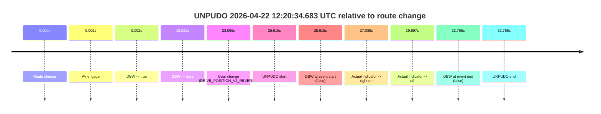
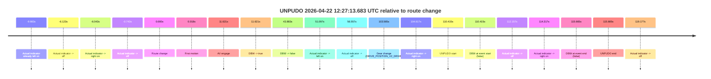
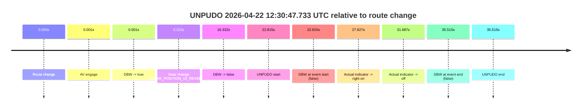
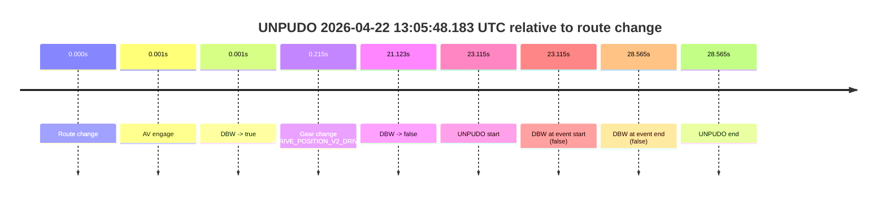
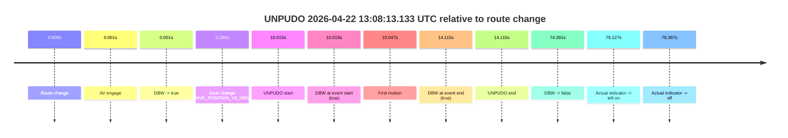
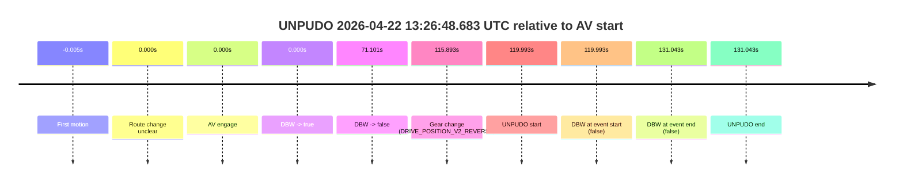

# Run Report: fme20031/2026-04-22--12-10-41--gen2-av-105b10cc-bf96-4f08-833e-04ddba33ad08

| Field | Value |
|---|---|
| Run ID | `fme20031/2026-04-22--12-10-41--gen2-av-105b10cc-bf96-4f08-833e-04ddba33ad08` |
| Date | `2026-04-22` |
| Model(s) | `eel-teal-outspoken` |
| Author | `zak` |
| Event count | `7` |

## unpudo 2026-04-22 12:20:34.683 UTC

| Field | Value |
|---|---|
| Model | `eel-teal-outspoken` |
| Author | `zak` |
| Run ID | `fme20031/2026-04-22--12-10-41--gen2-av-105b10cc-bf96-4f08-833e-04ddba33ad08` |
| Date | `2026-04-22` |
| Time (UTC) | `12:20:34.683` |
| Event type | `unpudo` |
| Disengagement type | `none observed` |
| Route change | `found` |
| Console | [run](https://console.sso.wayve.ai/run/fme20031/2026-04-22--12-10-41--gen2-av-105b10cc-bf96-4f08-833e-04ddba33ad08?id=&time-unixus=1776860434683294) |
| Foxglove | [segment](https://app.foxglove.dev/wayve-on-prem/p/prj_0dX18KZdVHg1fmmI/view?ds=foxglove-stream&ds.deviceName=fme20031&ds.start=2026-04-22T12%3A19%3A59.068336Z&ds.end=2026-04-22T12%3A20%3A51.833306Z&layoutId=lay_0e7VD4WIKDQGU73Y&time=2026-04-22T12%3A20%3A34.683294Z) |

### Event card: fail

- Fail: the credited unpudo does not stay AV-owned. The event window starts with DBW false, and the maneuver outcome lands outside a clean AV-owned segment.

| Event | Time (UTC) | Delta from route change |
|---|---:|---:|
| Route change | 2026-04-22 12:20:09.068 | `0.000s` |
| AV engage | 2026-04-22 12:20:09.069 | `0.002s` |
| DBW -> true | 2026-04-22 12:20:09.069 | `0.002s` |
| DBW -> false | 2026-04-22 12:20:27.988 | `18.921s` |
| Gear change (DRIVE_POSITION_V2_REVERSE) | 2026-04-22 12:20:32.133 | `23.065s` |
| UNPUDO start | 2026-04-22 12:20:34.683 | `25.615s` |
| DBW at event start (false) | 2026-04-22 12:20:34.683 | `25.615s` |
| Actual indicator -> right on | 2026-04-22 12:20:36.106 | `27.038s` |
| Actual indicator -> off | 2026-04-22 12:20:38.965 | `29.897s` |
| DBW at event end (false) | 2026-04-22 12:20:41.833 | `32.765s` |
| UNPUDO end | 2026-04-22 12:20:41.833 | `32.765s` |

| Metric | Value |
|---|---|
| Outcome | `fail` |
| Effective failure type | `not_av_owned` |
| Route change status | `found` |
| DBW at event start | `false` |
| DBW at event end | `false` |
| Predicted gear at AV start | `DRIVE_POSITION_V2_PARK` |
| Actual gear at AV start | `DRIVE_POSITION_V2_PARK` |
| Predicted gear at event start | `DRIVE_POSITION_V2_REVERSE` |
| Actual gear at event start | `DRIVE_POSITION_V2_REVERSE` |
| Planned indicator direction | `INDICATORS_STATE_V2_OFF` |
| Controller indicator direction | `INDICATORS_STATE_V2_OFF` |
| Actual indicator direction | `INDICATORS_STATE_V2_OFF` |
| Actual indicator at maneuver end | `INDICATORS_STATE_V2_OFF` |
| Driver accel help in AV | `false` |
| Driver accel help timestamp | `n/a` |
| Max accel pedal pct in AV | `0.0%` |
| Max brake pedal pct in AV | `10.1%` |
| Max speed mps in AV | `0.000` |
| Success timing baseline | `route change` |
| Route -> AV | `0.002s` |
| AV -> event start | `25.613s` |
| AV -> first motion | `n/a` |
| Success baseline -> event start | `25.615s` |
| Success baseline -> first motion | `n/a` |
| AV duration before disengagement | `18.919s` |
| Trajectory waypoint count | `37` |
| Driving-plan step count | `11` |

The scored portion starts from the AV-owned window, not from the pre-AV setup. Route-change search in the stopped pre-event segment was `found`, with the baseline therefore set to route change. At the event anchor the model predicts `DRIVE_POSITION_V2_REVERSE` and the actual gear is `DRIVE_POSITION_V2_REVERSE`. The effective model outcome is `fail` because `not_av_owned.`

### Resolution

| Field | Value |
|---|---|
| Final outcome | `fail` |
| Do we agree with this label? | `yes` |
| Source disengagement type | `none observed` |
| Resolved effective failure type | `not_av_owned` |
| Confidence | `high` |

## unpudo 2026-04-22 12:27:13.683 UTC

| Field | Value |
|---|---|
| Model | `eel-teal-outspoken` |
| Author | `zak` |
| Run ID | `fme20031/2026-04-22--12-10-41--gen2-av-105b10cc-bf96-4f08-833e-04ddba33ad08` |
| Date | `2026-04-22` |
| Time (UTC) | `12:27:13.683` |
| Event type | `unpudo` |
| Disengagement type | `none observed` |
| Route change | `found` |
| Console | [run](https://console.sso.wayve.ai/run/fme20031/2026-04-22--12-10-41--gen2-av-105b10cc-bf96-4f08-833e-04ddba33ad08?id=&time-unixus=1776860833683299) |
| Foxglove | [segment](https://app.foxglove.dev/wayve-on-prem/p/prj_0dX18KZdVHg1fmmI/view?ds=foxglove-stream&ds.deviceName=fme20031&ds.start=2026-04-22T12%3A25%3A13.268350Z&ds.end=2026-04-22T12%3A27%3A28.933304Z&layoutId=lay_0e7VD4WIKDQGU73Y&time=2026-04-22T12%3A27%3A13.683299Z) |

### Event card: fail

- Fail: the credited unpudo does not stay AV-owned. The event window starts with DBW false, and the maneuver outcome lands outside a clean AV-owned segment.

| Event | Time (UTC) | Delta from route change |
|---|---:|---:|
| Actual indicator already left on | 2026-04-22 12:25:13.285 | `-9.983s` |
| Actual indicator -> off | 2026-04-22 12:25:17.145 | `-6.123s` |
| Actual indicator -> right on | 2026-04-22 12:25:17.225 | `-6.043s` |
| Actual indicator -> off | 2026-04-22 12:25:22.525 | `-0.743s` |
| Route change | 2026-04-22 12:25:23.268 | `0.000s` |
| First motion | 2026-04-22 12:25:23.286 | `0.018s` |
| AV engage | 2026-04-22 12:25:34.889 | `11.621s` |
| DBW -> true | 2026-04-22 12:25:34.889 | `11.621s` |
| DBW -> false | 2026-04-22 12:26:07.150 | `43.883s` |
| Actual indicator -> left on | 2026-04-22 12:26:14.365 | `51.097s` |
| Actual indicator -> off | 2026-04-22 12:26:19.825 | `56.557s` |
| Gear change (DRIVE_POSITION_V2_DRIVE) | 2026-04-22 12:27:06.833 | `103.565s` |
| Actual indicator -> right on | 2026-04-22 12:27:07.885 | `104.617s` |
| UNPUDO start | 2026-04-22 12:27:13.683 | `110.415s` |
| DBW at event start (false) | 2026-04-22 12:27:13.683 | `110.415s` |
| Actual indicator -> off | 2026-04-22 12:27:15.425 | `112.157s` |
| Actual indicator -> right on | 2026-04-22 12:27:17.585 | `114.317s` |
| DBW at event end (false) | 2026-04-22 12:27:18.933 | `115.665s` |
| UNPUDO end | 2026-04-22 12:27:18.933 | `115.665s` |
| Actual indicator -> off | 2026-04-22 12:27:22.445 | `119.177s` |

| Metric | Value |
|---|---|
| Outcome | `fail` |
| Effective failure type | `completed_outside_av` |
| Route change status | `found` |
| DBW at event start | `false` |
| DBW at event end | `false` |
| Predicted gear at AV start | `DRIVE_POSITION_V2_DRIVE` |
| Actual gear at AV start | `DRIVE_POSITION_V2_DRIVE` |
| Predicted gear at event start | `DRIVE_POSITION_V2_DRIVE` |
| Actual gear at event start | `DRIVE_POSITION_V2_DRIVE` |
| Planned indicator direction | `INDICATORS_STATE_V2_RIGHT_ON` |
| Controller indicator direction | `INDICATORS_STATE_V2_RIGHT_ON` |
| Actual indicator direction | `INDICATORS_STATE_V2_RIGHT_ON` |
| Actual indicator at maneuver end | `INDICATORS_STATE_V2_RIGHT_ON` |
| Driver accel help in AV | `false` |
| Driver accel help timestamp | `n/a` |
| Max accel pedal pct in AV | `0.0%` |
| Max brake pedal pct in AV | `0.0%` |
| Max speed mps in AV | `7.822` |
| Success timing baseline | `route change` |
| Route -> AV | `11.621s` |
| AV -> event start | `98.794s` |
| AV -> first motion | `-11.603s` |
| Success baseline -> event start | `110.415s` |
| Success baseline -> first motion | `0.018s` |
| AV duration before disengagement | `32.261s` |
| Trajectory waypoint count | `37` |
| Driving-plan step count | `11` |

The scored portion starts from the AV-owned window, not from the pre-AV setup. Route-change search in the stopped pre-event segment was `found`, with the baseline therefore set to route change. At the event anchor the model predicts `DRIVE_POSITION_V2_DRIVE` and the actual gear is `DRIVE_POSITION_V2_DRIVE`. The effective model outcome is `fail` because `completed_outside_av.`

### Resolution

| Field | Value |
|---|---|
| Final outcome | `fail` |
| Do we agree with this label? | `yes` |
| Source disengagement type | `none observed` |
| Resolved effective failure type | `completed_outside_av` |
| Confidence | `high` |

## unpudo 2026-04-22 12:30:47.733 UTC

| Field | Value |
|---|---|
| Model | `eel-teal-outspoken` |
| Author | `zak` |
| Run ID | `fme20031/2026-04-22--12-10-41--gen2-av-105b10cc-bf96-4f08-833e-04ddba33ad08` |
| Date | `2026-04-22` |
| Time (UTC) | `12:30:47.733` |
| Event type | `unpudo` |
| Disengagement type | `none observed` |
| Route change | `found` |
| Console | [run](https://console.sso.wayve.ai/run/fme20031/2026-04-22--12-10-41--gen2-av-105b10cc-bf96-4f08-833e-04ddba33ad08?id=&time-unixus=1776861047733317) |
| Foxglove | [segment](https://app.foxglove.dev/wayve-on-prem/p/prj_0dX18KZdVHg1fmmI/view?ds=foxglove-stream&ds.deviceName=fme20031&ds.start=2026-04-22T12%3A30%3A14.918264Z&ds.end=2026-04-22T12%3A31%3A10.433307Z&layoutId=lay_0e7VD4WIKDQGU73Y&time=2026-04-22T12%3A30%3A47.733317Z) |

### Event card: fail

- Fail: the credited unpudo does not stay AV-owned. The event window starts with DBW false, and the maneuver outcome lands outside a clean AV-owned segment.

| Event | Time (UTC) | Delta from route change |
|---|---:|---:|
| Route change | 2026-04-22 12:30:24.918 | `0.000s` |
| AV engage | 2026-04-22 12:30:24.919 | `0.001s` |
| DBW -> true | 2026-04-22 12:30:24.919 | `0.001s` |
| Gear change (DRIVE_POSITION_V2_REVERSE) | 2026-04-22 12:30:25.233 | `0.315s` |
| DBW -> false | 2026-04-22 12:30:41.250 | `16.332s` |
| UNPUDO start | 2026-04-22 12:30:47.733 | `22.815s` |
| DBW at event start (false) | 2026-04-22 12:30:47.733 | `22.815s` |
| Actual indicator -> right on | 2026-04-22 12:30:52.745 | `27.827s` |
| Actual indicator -> off | 2026-04-22 12:30:56.605 | `31.687s` |
| DBW at event end (false) | 2026-04-22 12:31:00.433 | `35.515s` |
| UNPUDO end | 2026-04-22 12:31:00.433 | `35.515s` |

| Metric | Value |
|---|---|
| Outcome | `fail` |
| Effective failure type | `not_av_owned` |
| Route change status | `found` |
| DBW at event start | `false` |
| DBW at event end | `false` |
| Predicted gear at AV start | `DRIVE_POSITION_V2_PARK` |
| Actual gear at AV start | `DRIVE_POSITION_V2_PARK` |
| Predicted gear at event start | `DRIVE_POSITION_V2_REVERSE` |
| Actual gear at event start | `DRIVE_POSITION_V2_REVERSE` |
| Planned indicator direction | `INDICATORS_STATE_V2_OFF` |
| Controller indicator direction | `INDICATORS_STATE_V2_OFF` |
| Actual indicator direction | `INDICATORS_STATE_V2_OFF` |
| Actual indicator at maneuver end | `INDICATORS_STATE_V2_OFF` |
| Driver accel help in AV | `false` |
| Driver accel help timestamp | `n/a` |
| Max accel pedal pct in AV | `0.0%` |
| Max brake pedal pct in AV | `8.0%` |
| Max speed mps in AV | `0.000` |
| Success timing baseline | `route change` |
| Route -> AV | `0.001s` |
| AV -> event start | `22.814s` |
| AV -> first motion | `n/a` |
| Success baseline -> event start | `22.815s` |
| Success baseline -> first motion | `n/a` |
| AV duration before disengagement | `16.331s` |
| Trajectory waypoint count | `38` |
| Driving-plan step count | `11` |

The scored portion starts from the AV-owned window, not from the pre-AV setup. Route-change search in the stopped pre-event segment was `found`, with the baseline therefore set to route change. At the event anchor the model predicts `DRIVE_POSITION_V2_REVERSE` and the actual gear is `DRIVE_POSITION_V2_REVERSE`. The effective model outcome is `fail` because `not_av_owned.`

### Resolution

| Field | Value |
|---|---|
| Final outcome | `fail` |
| Do we agree with this label? | `yes` |
| Source disengagement type | `none observed` |
| Resolved effective failure type | `not_av_owned` |
| Confidence | `high` |

## unpudo 2026-04-22 12:49:16.433 UTC

| Field | Value |
|---|---|
| Model | `eel-teal-outspoken` |
| Author | `zak` |
| Run ID | `fme20031/2026-04-22--12-10-41--gen2-av-105b10cc-bf96-4f08-833e-04ddba33ad08` |
| Date | `2026-04-22` |
| Time (UTC) | `12:49:16.433` |
| Event type | `unpudo` |
| Disengagement type | `none observed` |
| Route change | `found` |
| Console | [run](https://console.sso.wayve.ai/run/fme20031/2026-04-22--12-10-41--gen2-av-105b10cc-bf96-4f08-833e-04ddba33ad08?id=&time-unixus=1776862156433302) |
| Foxglove | [segment](https://app.foxglove.dev/wayve-on-prem/p/prj_0dX18KZdVHg1fmmI/view?ds=foxglove-stream&ds.deviceName=fme20031&ds.start=2026-04-22T12%3A49%3A02.568625Z&ds.end=2026-04-22T12%3A52%3A27.590543Z&layoutId=lay_0e7VD4WIKDQGU73Y&time=2026-04-22T12%3A49%3A16.433302Z) |

### Event card: pass

- Pass: AV owns the credited unpudo from route change through the official unpudo window, the gear state is aligned at the anchor, and the vehicle moves without driver accelerator help in AV.

| Event | Time (UTC) | Delta from route change |
|---|---:|---:|
| Route change | 2026-04-22 12:49:12.568 | `0.000s` |
| AV engage | 2026-04-22 12:49:12.569 | `0.001s` |
| DBW -> true | 2026-04-22 12:49:12.569 | `0.001s` |
| Gear change (DRIVE_POSITION_V2_DRIVE) | 2026-04-22 12:49:12.883 | `0.315s` |
| UNPUDO start | 2026-04-22 12:49:16.433 | `3.865s` |
| DBW at event start (true) | 2026-04-22 12:49:16.433 | `3.865s` |
| First motion | 2026-04-22 12:49:16.485 | `3.917s` |
| DBW at event end (true) | 2026-04-22 12:49:20.433 | `7.865s` |
| UNPUDO end | 2026-04-22 12:49:20.433 | `7.865s` |
| Actual indicator -> right on | 2026-04-22 12:52:16.385 | `183.817s` |
| DBW -> false | 2026-04-22 12:52:17.590 | `185.022s` |
| Actual indicator -> off | 2026-04-22 12:52:20.865 | `188.297s` |

| Metric | Value |
|---|---|
| Outcome | `pass` |
| Effective failure type | `none` |
| Route change status | `found` |
| DBW at event start | `true` |
| DBW at event end | `true` |
| Predicted gear at AV start | `DRIVE_POSITION_V2_PARK` |
| Actual gear at AV start | `DRIVE_POSITION_V2_PARK` |
| Predicted gear at event start | `DRIVE_POSITION_V2_DRIVE` |
| Actual gear at event start | `DRIVE_POSITION_V2_DRIVE` |
| Planned indicator direction | `INDICATORS_STATE_V2_LEFT_ON` |
| Controller indicator direction | `INDICATORS_STATE_V2_LEFT_ON` |
| Actual indicator direction | `INDICATORS_STATE_V2_OFF` |
| Actual indicator at maneuver end | `INDICATORS_STATE_V2_OFF` |
| Driver accel help in AV | `false` |
| Driver accel help timestamp | `n/a` |
| Max accel pedal pct in AV | `0.0%` |
| Max brake pedal pct in AV | `8.0%` |
| Max speed mps in AV | `4.906` |
| Success timing baseline | `route change` |
| Route -> AV | `0.001s` |
| AV -> event start | `3.863s` |
| AV -> first motion | `3.916s` |
| Success baseline -> event start | `3.865s` |
| Success baseline -> first motion | `3.917s` |
| AV duration before disengagement | `185.021s` |
| Trajectory waypoint count | `38` |
| Driving-plan step count | `11` |

The scored portion starts from the AV-owned window, not from the pre-AV setup. Route-change search in the stopped pre-event segment was `found`, with the baseline therefore set to route change. At the event anchor the model predicts `DRIVE_POSITION_V2_DRIVE` and the actual gear is `DRIVE_POSITION_V2_DRIVE`. The effective model outcome is `pass` because `the credited unpudo stays AV-owned through the official unpudo window.`

### Resolution

| Field | Value |
|---|---|
| Final outcome | `pass` |
| Do we agree with this label? | `yes` |
| Source disengagement type | `none observed` |
| Resolved effective failure type | `none` |
| Confidence | `high` |

## unpudo 2026-04-22 13:05:48.183 UTC

| Field | Value |
|---|---|
| Model | `eel-teal-outspoken` |
| Author | `zak` |
| Run ID | `fme20031/2026-04-22--12-10-41--gen2-av-105b10cc-bf96-4f08-833e-04ddba33ad08` |
| Date | `2026-04-22` |
| Time (UTC) | `13:05:48.183` |
| Event type | `unpudo` |
| Disengagement type | `none observed` |
| Route change | `found` |
| Console | [run](https://console.sso.wayve.ai/run/fme20031/2026-04-22--12-10-41--gen2-av-105b10cc-bf96-4f08-833e-04ddba33ad08?id=&time-unixus=1776863148183294) |
| Foxglove | [segment](https://app.foxglove.dev/wayve-on-prem/p/prj_0dX18KZdVHg1fmmI/view?ds=foxglove-stream&ds.deviceName=fme20031&ds.start=2026-04-22T13%3A05%3A15.068306Z&ds.end=2026-04-22T13%3A06%3A03.633295Z&layoutId=lay_0e7VD4WIKDQGU73Y&time=2026-04-22T13%3A05%3A48.183294Z) |

### Event card: fail

- Fail: the credited unpudo does not stay AV-owned. The event window starts with DBW false, and the maneuver outcome lands outside a clean AV-owned segment.

| Event | Time (UTC) | Delta from route change |
|---|---:|---:|
| Route change | 2026-04-22 13:05:25.068 | `0.000s` |
| AV engage | 2026-04-22 13:05:25.069 | `0.001s` |
| DBW -> true | 2026-04-22 13:05:25.069 | `0.001s` |
| Gear change (DRIVE_POSITION_V2_DRIVE) | 2026-04-22 13:05:25.283 | `0.215s` |
| DBW -> false | 2026-04-22 13:05:46.191 | `21.123s` |
| UNPUDO start | 2026-04-22 13:05:48.183 | `23.115s` |
| DBW at event start (false) | 2026-04-22 13:05:48.183 | `23.115s` |
| DBW at event end (false) | 2026-04-22 13:05:53.633 | `28.565s` |
| UNPUDO end | 2026-04-22 13:05:53.633 | `28.565s` |

| Metric | Value |
|---|---|
| Outcome | `fail` |
| Effective failure type | `not_av_owned` |
| Route change status | `found` |
| DBW at event start | `false` |
| DBW at event end | `false` |
| Predicted gear at AV start | `DRIVE_POSITION_V2_PARK` |
| Actual gear at AV start | `DRIVE_POSITION_V2_PARK` |
| Predicted gear at event start | `DRIVE_POSITION_V2_DRIVE` |
| Actual gear at event start | `DRIVE_POSITION_V2_DRIVE` |
| Planned indicator direction | `INDICATORS_STATE_V2_RIGHT_ON` |
| Controller indicator direction | `INDICATORS_STATE_V2_RIGHT_ON` |
| Actual indicator direction | `INDICATORS_STATE_V2_OFF` |
| Actual indicator at maneuver end | `INDICATORS_STATE_V2_OFF` |
| Driver accel help in AV | `false` |
| Driver accel help timestamp | `n/a` |
| Max accel pedal pct in AV | `0.0%` |
| Max brake pedal pct in AV | `8.1%` |
| Max speed mps in AV | `0.000` |
| Success timing baseline | `route change` |
| Route -> AV | `0.001s` |
| AV -> event start | `23.114s` |
| AV -> first motion | `n/a` |
| Success baseline -> event start | `23.115s` |
| Success baseline -> first motion | `n/a` |
| AV duration before disengagement | `21.121s` |
| Trajectory waypoint count | `37` |
| Driving-plan step count | `11` |

The scored portion starts from the AV-owned window, not from the pre-AV setup. Route-change search in the stopped pre-event segment was `found`, with the baseline therefore set to route change. At the event anchor the model predicts `DRIVE_POSITION_V2_DRIVE` and the actual gear is `DRIVE_POSITION_V2_DRIVE`. The effective model outcome is `fail` because `not_av_owned.`

### Resolution

| Field | Value |
|---|---|
| Final outcome | `fail` |
| Do we agree with this label? | `yes` |
| Source disengagement type | `none observed` |
| Resolved effective failure type | `not_av_owned` |
| Confidence | `high` |

## unpudo 2026-04-22 13:08:13.133 UTC

| Field | Value |
|---|---|
| Model | `eel-teal-outspoken` |
| Author | `zak` |
| Run ID | `fme20031/2026-04-22--12-10-41--gen2-av-105b10cc-bf96-4f08-833e-04ddba33ad08` |
| Date | `2026-04-22` |
| Time (UTC) | `13:08:13.133` |
| Event type | `unpudo` |
| Disengagement type | `none observed` |
| Route change | `found` |
| Console | [run](https://console.sso.wayve.ai/run/fme20031/2026-04-22--12-10-41--gen2-av-105b10cc-bf96-4f08-833e-04ddba33ad08?id=&time-unixus=1776863293133317) |
| Foxglove | [segment](https://app.foxglove.dev/wayve-on-prem/p/prj_0dX18KZdVHg1fmmI/view?ds=foxglove-stream&ds.deviceName=fme20031&ds.start=2026-04-22T13%3A07%3A53.118323Z&ds.end=2026-04-22T13%3A09%3A27.509554Z&layoutId=lay_0e7VD4WIKDQGU73Y&time=2026-04-22T13%3A08%3A13.133317Z) |

### Event card: pass

- Pass: AV owns the credited unpudo from route change through the official unpudo window, the gear state is aligned at the anchor, and the vehicle moves without driver accelerator help in AV.

| Event | Time (UTC) | Delta from route change |
|---|---:|---:|
| Route change | 2026-04-22 13:08:03.118 | `0.000s` |
| AV engage | 2026-04-22 13:08:03.119 | `0.001s` |
| DBW -> true | 2026-04-22 13:08:03.119 | `0.001s` |
| Gear change (DRIVE_POSITION_V2_DRIVE) | 2026-04-22 13:08:03.383 | `0.265s` |
| UNPUDO start | 2026-04-22 13:08:13.133 | `10.015s` |
| DBW at event start (true) | 2026-04-22 13:08:13.133 | `10.015s` |
| First motion | 2026-04-22 13:08:13.165 | `10.047s` |
| DBW at event end (true) | 2026-04-22 13:08:17.233 | `14.115s` |
| UNPUDO end | 2026-04-22 13:08:17.233 | `14.115s` |
| DBW -> false | 2026-04-22 13:09:17.509 | `74.391s` |
| Actual indicator -> left on | 2026-04-22 13:09:18.245 | `75.127s` |
| Actual indicator -> off | 2026-04-22 13:09:21.505 | `78.387s` |

| Metric | Value |
|---|---|
| Outcome | `pass` |
| Effective failure type | `none` |
| Route change status | `found` |
| DBW at event start | `true` |
| DBW at event end | `true` |
| Predicted gear at AV start | `DRIVE_POSITION_V2_PARK` |
| Actual gear at AV start | `DRIVE_POSITION_V2_PARK` |
| Predicted gear at event start | `DRIVE_POSITION_V2_DRIVE` |
| Actual gear at event start | `DRIVE_POSITION_V2_DRIVE` |
| Planned indicator direction | `INDICATORS_STATE_V2_RIGHT_ON` |
| Controller indicator direction | `INDICATORS_STATE_V2_RIGHT_ON` |
| Actual indicator direction | `INDICATORS_STATE_V2_OFF` |
| Actual indicator at maneuver end | `INDICATORS_STATE_V2_OFF` |
| Driver accel help in AV | `false` |
| Driver accel help timestamp | `n/a` |
| Max accel pedal pct in AV | `0.0%` |
| Max brake pedal pct in AV | `8.0%` |
| Max speed mps in AV | `5.150` |
| Success timing baseline | `route change` |
| Route -> AV | `0.001s` |
| AV -> event start | `10.014s` |
| AV -> first motion | `10.046s` |
| Success baseline -> event start | `10.015s` |
| Success baseline -> first motion | `10.047s` |
| AV duration before disengagement | `74.390s` |
| Trajectory waypoint count | `38` |
| Driving-plan step count | `11` |

The scored portion starts from the AV-owned window, not from the pre-AV setup. Route-change search in the stopped pre-event segment was `found`, with the baseline therefore set to route change. At the event anchor the model predicts `DRIVE_POSITION_V2_DRIVE` and the actual gear is `DRIVE_POSITION_V2_DRIVE`. The effective model outcome is `pass` because `the credited unpudo stays AV-owned through the official unpudo window.`

### Resolution

| Field | Value |
|---|---|
| Final outcome | `pass` |
| Do we agree with this label? | `yes` |
| Source disengagement type | `none observed` |
| Resolved effective failure type | `none` |
| Confidence | `high` |

## unpudo 2026-04-22 13:26:48.683 UTC

| Field | Value |
|---|---|
| Model | `eel-teal-outspoken` |
| Author | `zak` |
| Run ID | `fme20031/2026-04-22--12-10-41--gen2-av-105b10cc-bf96-4f08-833e-04ddba33ad08` |
| Date | `2026-04-22` |
| Time (UTC) | `13:26:48.683` |
| Event type | `unpudo` |
| Disengagement type | `none observed` |
| Route change | `unclear` |
| Console | [run](https://console.sso.wayve.ai/run/fme20031/2026-04-22--12-10-41--gen2-av-105b10cc-bf96-4f08-833e-04ddba33ad08?id=&time-unixus=1776864408683310) |
| Foxglove | [segment](https://app.foxglove.dev/wayve-on-prem/p/prj_0dX18KZdVHg1fmmI/view?ds=foxglove-stream&ds.deviceName=fme20031&ds.start=2026-04-22T13%3A24%3A38.690030Z&ds.end=2026-04-22T13%3A27%3A09.733311Z&layoutId=lay_0e7VD4WIKDQGU73Y&time=2026-04-22T13%3A26%3A48.683310Z) |

### Event card: fail

- Fail: the credited unpudo does not stay AV-owned. The event window starts with DBW false, and the maneuver outcome lands outside a clean AV-owned segment.

| Event | Time (UTC) | Delta from AV start |
|---|---:|---:|
| First motion | 2026-04-22 13:24:48.685 | `-0.005s` |
| Route change unclear | 2026-04-22 13:24:48.690 | `0.000s` |
| AV engage | 2026-04-22 13:24:48.690 | `0.000s` |
| DBW -> true | 2026-04-22 13:24:48.690 | `0.000s` |
| DBW -> false | 2026-04-22 13:25:59.790 | `71.101s` |
| Gear change (DRIVE_POSITION_V2_REVERSE) | 2026-04-22 13:26:44.583 | `115.893s` |
| UNPUDO start | 2026-04-22 13:26:48.683 | `119.993s` |
| DBW at event start (false) | 2026-04-22 13:26:48.683 | `119.993s` |
| DBW at event end (false) | 2026-04-22 13:26:59.733 | `131.043s` |
| UNPUDO end | 2026-04-22 13:26:59.733 | `131.043s` |

| Metric | Value |
|---|---|
| Outcome | `fail` |
| Effective failure type | `completed_outside_av` |
| Route change status | `unclear` |
| DBW at event start | `false` |
| DBW at event end | `false` |
| Predicted gear at AV start | `DRIVE_POSITION_V2_DRIVE` |
| Actual gear at AV start | `DRIVE_POSITION_V2_DRIVE` |
| Predicted gear at event start | `DRIVE_POSITION_V2_REVERSE` |
| Actual gear at event start | `DRIVE_POSITION_V2_REVERSE` |
| Planned indicator direction | `INDICATORS_STATE_V2_OFF` |
| Controller indicator direction | `INDICATORS_STATE_V2_OFF` |
| Actual indicator direction | `INDICATORS_STATE_V2_OFF` |
| Actual indicator at maneuver end | `INDICATORS_STATE_V2_OFF` |
| Driver accel help in AV | `false` |
| Driver accel help timestamp | `n/a` |
| Max accel pedal pct in AV | `0.0%` |
| Max brake pedal pct in AV | `8.0%` |
| Max speed mps in AV | `7.072` |
| Success timing baseline | `AV start` |
| Route -> AV | `n/a` |
| AV -> event start | `119.993s` |
| AV -> first motion | `-0.005s` |
| Success baseline -> event start | `119.993s` |
| Success baseline -> first motion | `-0.005s` |
| AV duration before disengagement | `71.101s` |
| Trajectory waypoint count | `37` |
| Driving-plan step count | `11` |

The scored portion starts from the AV-owned window, not from the pre-AV setup. Route-change search in the stopped pre-event segment was `unclear`, with the baseline therefore set to AV start. At the event anchor the model predicts `DRIVE_POSITION_V2_REVERSE` and the actual gear is `DRIVE_POSITION_V2_REVERSE`. The effective model outcome is `fail` because `completed_outside_av.`

### Resolution

| Field | Value |
|---|---|
| Final outcome | `fail` |
| Do we agree with this label? | `yes` |
| Source disengagement type | `none observed` |
| Resolved effective failure type | `completed_outside_av` |
| Confidence | `medium` |
