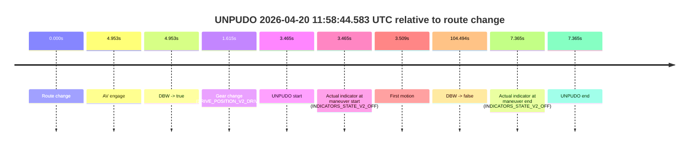
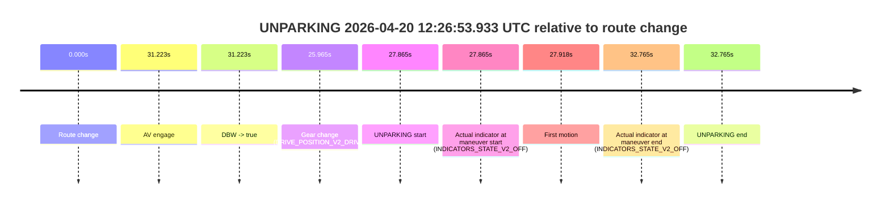

# Run Report: fme20032/2026-04-20--11-47-56--gen2-av-6cb52e0d-9b05-4671-adeb-05c5373729cd

| Field | Value |
|---|---|
| Run ID | `fme20032/2026-04-20--11-47-56--gen2-av-6cb52e0d-9b05-4671-adeb-05c5373729cd` |
| Date | `2026-04-20` |
| Model(s) | `plum-timeless-beaver` |
| Author | `peng.tang` |
| Event count | `3` |

## unpudo 2026-04-20 11:52:22.183 UTC

| Field | Value |
|---|---|
| Model | `plum-timeless-beaver` |
| Author | `peng.tang` |
| Run ID | `fme20032/2026-04-20--11-47-56--gen2-av-6cb52e0d-9b05-4671-adeb-05c5373729cd` |
| Date | `2026-04-20` |
| Time (UTC) | `11:52:22.183` |
| Event type | `unpudo` |
| Disengagement type | `none observed` |
| Route change | `found` |
| Console | [run](https://console.sso.wayve.ai/run/fme20032/2026-04-20--11-47-56--gen2-av-6cb52e0d-9b05-4671-adeb-05c5373729cd?id=&time-unixus=1776685942183321) |
| Foxglove | [segment](https://app.foxglove.dev/wayve-on-prem/p/prj_0dX18KZdVHg1fmmI/view?ds=foxglove-stream&ds.deviceName=fme20032&ds.start=2026-04-20T11%3A50%3A17.318340Z&ds.end=2026-04-20T11%3A52%3A43.750862Z&layoutId=lay_0e7VD4WIKDQGU73Y&time=2026-04-20T11%3A52%3A22.183321Z) |

### Event card: accidental

- Accidental: AV ownership is present for less than `2s`, so this is treated as an accidental brush with the maneuver rather than a meaningful model attempt.

| Event | Time (UTC) | Delta from route change |
|---|---:|---:|
| Route change | 2026-04-20 11:50:27.318 | `0.000s` |
| AV engage | 2026-04-20 11:52:31.470 | `124.152s` |
| DBW -> true | 2026-04-20 11:52:31.470 | `124.152s` |
| Gear change (DRIVE_POSITION_V2_DRIVE) | 2026-04-20 11:52:14.733 | `107.415s` |
| UNPUDO start | 2026-04-20 11:52:22.183 | `114.865s` |
| Actual indicator at maneuver start (INDICATORS_STATE_V2_OFF) | 2026-04-20 11:52:22.183 | `114.865s` |
| First motion | 2026-04-20 11:52:22.226 | `114.908s` |
| DBW -> false | 2026-04-20 11:52:33.750 | `126.433s` |
| Actual indicator at maneuver end (INDICATORS_STATE_V2_OFF) | 2026-04-20 11:52:30.483 | `123.165s` |
| UNPUDO end | 2026-04-20 11:52:30.483 | `123.165s` |

| Metric | Value |
|---|---|
| Outcome | `accidental` |
| Effective failure type | `none` |
| Route change status | `found` |
| DBW at event start | `false` |
| DBW at event end | `false` |
| Predicted gear at AV start | `DRIVE_POSITION_V2_DRIVE` |
| Actual gear at AV start | `DRIVE_POSITION_V2_DRIVE` |
| Predicted gear at event start | `DRIVE_POSITION_V2_DRIVE` |
| Actual gear at event start | `DRIVE_POSITION_V2_DRIVE` |
| Planned indicator direction | `INDICATORS_STATE_V2_OFF` |
| Controller indicator direction | `INDICATORS_STATE_V2_OFF` |
| Actual indicator direction | `INDICATORS_STATE_V2_OFF` |
| Actual indicator at maneuver end | `INDICATORS_STATE_V2_OFF` |
| Driver accel help in AV | `false` |
| Driver accel help timestamp | `n/a` |
| Max accel pedal pct in AV | `0.0%` |
| Max brake pedal pct in AV | `0.0%` |
| Max speed mps in AV | `0.000` |
| Route -> AV | `124.152s` |
| AV -> event start | `-9.287s` |
| AV -> first motion | `-9.244s` |
| AV duration before disengagement | `2.280s` |
| Trajectory waypoint count | `37` |
| Driving-plan step count | `11` |

The scored portion starts from the AV-owned window, not from the pre-AV setup. Route-change search in the stopped pre-event segment was `found`, with the baseline therefore set to route change. At the event anchor the model predicts `DRIVE_POSITION_V2_DRIVE` and the actual gear is `DRIVE_POSITION_V2_DRIVE`. The effective model outcome is `accidental` because `the AV-owned portion is shorter than 2s`.

### Resolution

| Field | Value |
|---|---|
| Final outcome | `accidental` |
| Do we agree with this label? | `yes` |
| Source disengagement type | `none observed` |
| Resolved effective failure type | `none` |
| Confidence | `high` |

## unpudo 2026-04-20 11:58:44.583 UTC

| Field | Value |
|---|---|
| Model | `plum-timeless-beaver` |
| Author | `peng.tang` |
| Run ID | `fme20032/2026-04-20--11-47-56--gen2-av-6cb52e0d-9b05-4671-adeb-05c5373729cd` |
| Date | `2026-04-20` |
| Time (UTC) | `11:58:44.583` |
| Event type | `unpudo` |
| Disengagement type | `none observed` |
| Route change | `found` |
| Console | [run](https://console.sso.wayve.ai/run/fme20032/2026-04-20--11-47-56--gen2-av-6cb52e0d-9b05-4671-adeb-05c5373729cd?id=&time-unixus=1776686324583308) |
| Foxglove | [segment](https://app.foxglove.dev/wayve-on-prem/p/prj_0dX18KZdVHg1fmmI/view?ds=foxglove-stream&ds.deviceName=fme20032&ds.start=2026-04-20T11%3A58%3A31.118260Z&ds.end=2026-04-20T12%3A00%3A35.611992Z&layoutId=lay_0e7VD4WIKDQGU73Y&time=2026-04-20T11%3A58%3A44.583308Z) |

### Event card: non-av

- Non-AV: the detected unpudo starts outside AV ownership, so it is kept for coverage but excluded from model success / failure scoring.

| Event | Time (UTC) | Delta from route change |
|---|---:|---:|
| Route change | 2026-04-20 11:58:41.118 | `0.000s` |
| AV engage | 2026-04-20 11:58:46.070 | `4.953s` |
| DBW -> true | 2026-04-20 11:58:46.070 | `4.953s` |
| Gear change (DRIVE_POSITION_V2_DRIVE) | 2026-04-20 11:58:42.733 | `1.615s` |
| UNPUDO start | 2026-04-20 11:58:44.583 | `3.465s` |
| Actual indicator at maneuver start (INDICATORS_STATE_V2_OFF) | 2026-04-20 11:58:44.583 | `3.465s` |
| First motion | 2026-04-20 11:58:44.627 | `3.509s` |
| DBW -> false | 2026-04-20 12:00:25.611 | `104.494s` |
| Actual indicator at maneuver end (INDICATORS_STATE_V2_OFF) | 2026-04-20 11:58:48.483 | `7.365s` |
| UNPUDO end | 2026-04-20 11:58:48.483 | `7.365s` |

| Metric | Value |
|---|---|
| Outcome | `non-av` |
| Effective failure type | `none` |
| Route change status | `found` |
| DBW at event start | `false` |
| DBW at event end | `true` |
| Predicted gear at AV start | `DRIVE_POSITION_V2_DRIVE` |
| Actual gear at AV start | `DRIVE_POSITION_V2_DRIVE` |
| Predicted gear at event start | `DRIVE_POSITION_V2_DRIVE` |
| Actual gear at event start | `DRIVE_POSITION_V2_DRIVE` |
| Planned indicator direction | `INDICATORS_STATE_V2_OFF` |
| Controller indicator direction | `INDICATORS_STATE_V2_OFF` |
| Actual indicator direction | `INDICATORS_STATE_V2_OFF` |
| Actual indicator at maneuver end | `INDICATORS_STATE_V2_OFF` |
| Driver accel help in AV | `false` |
| Driver accel help timestamp | `n/a` |
| Max accel pedal pct in AV | `0.0%` |
| Max brake pedal pct in AV | `0.0%` |
| Max speed mps in AV | `4.253` |
| Route -> AV | `4.953s` |
| AV -> event start | `-1.488s` |
| AV -> first motion | `-1.444s` |
| AV duration before disengagement | `99.541s` |
| Trajectory waypoint count | `37` |
| Driving-plan step count | `11` |

The scored portion starts from the AV-owned window, not from the pre-AV setup. Route-change search in the stopped pre-event segment was `found`, with the baseline therefore set to route change. At the event anchor the model predicts `DRIVE_POSITION_V2_DRIVE` and the actual gear is `DRIVE_POSITION_V2_DRIVE`. The effective model outcome is `non-av` because `the event does not begin in AV ownership`.

### Resolution

| Field | Value |
|---|---|
| Final outcome | `non-av` |
| Do we agree with this label? | `yes` |
| Source disengagement type | `none observed` |
| Resolved effective failure type | `none` |
| Confidence | `high` |

## unparking 2026-04-20 12:26:53.933 UTC

| Field | Value |
|---|---|
| Model | `plum-timeless-beaver` |
| Author | `peng.tang` |
| Run ID | `fme20032/2026-04-20--11-47-56--gen2-av-6cb52e0d-9b05-4671-adeb-05c5373729cd` |
| Date | `2026-04-20` |
| Time (UTC) | `12:26:53.933` |
| Event type | `unparking` |
| Disengagement type | `none observed` |
| Route change | `found` |
| Console | [run](https://console.sso.wayve.ai/run/fme20032/2026-04-20--11-47-56--gen2-av-6cb52e0d-9b05-4671-adeb-05c5373729cd?id=&time-unixus=1776688013933322) |
| Foxglove | [segment](https://app.foxglove.dev/wayve-on-prem/p/prj_0dX18KZdVHg1fmmI/view?ds=foxglove-stream&ds.deviceName=fme20032&ds.start=2026-04-20T12%3A26%3A16.068281Z&ds.end=2026-04-20T12%3A27%3A08.833319Z&layoutId=lay_0e7VD4WIKDQGU73Y&time=2026-04-20T12%3A26%3A53.933322Z) |

### Event card: accidental

- Accidental: AV ownership is present for less than `2s`, so this is treated as an accidental brush with the maneuver rather than a meaningful model attempt.

| Event | Time (UTC) | Delta from route change |
|---|---:|---:|
| Route change | 2026-04-20 12:26:26.068 | `0.000s` |
| AV engage | 2026-04-20 12:26:57.290 | `31.223s` |
| DBW -> true | 2026-04-20 12:26:57.290 | `31.223s` |
| Gear change (DRIVE_POSITION_V2_DRIVE) | 2026-04-20 12:26:52.033 | `25.965s` |
| UNPARKING start | 2026-04-20 12:26:53.933 | `27.865s` |
| Actual indicator at maneuver start (INDICATORS_STATE_V2_OFF) | 2026-04-20 12:26:53.933 | `27.865s` |
| First motion | 2026-04-20 12:26:53.986 | `27.918s` |
| Actual indicator at maneuver end (INDICATORS_STATE_V2_OFF) | 2026-04-20 12:26:58.833 | `32.765s` |
| UNPARKING end | 2026-04-20 12:26:58.833 | `32.765s` |

| Metric | Value |
|---|---|
| Outcome | `accidental` |
| Effective failure type | `none` |
| Route change status | `found` |
| DBW at event start | `false` |
| DBW at event end | `true` |
| Predicted gear at AV start | `DRIVE_POSITION_V2_DRIVE` |
| Actual gear at AV start | `DRIVE_POSITION_V2_DRIVE` |
| Predicted gear at event start | `DRIVE_POSITION_V2_DRIVE` |
| Actual gear at event start | `DRIVE_POSITION_V2_DRIVE` |
| Planned indicator direction | `INDICATORS_STATE_V2_OFF` |
| Controller indicator direction | `INDICATORS_STATE_V2_OFF` |
| Actual indicator direction | `INDICATORS_STATE_V2_OFF` |
| Actual indicator at maneuver end | `INDICATORS_STATE_V2_OFF` |
| Driver accel help in AV | `false` |
| Driver accel help timestamp | `n/a` |
| Max accel pedal pct in AV | `0.0%` |
| Max brake pedal pct in AV | `0.0%` |
| Max speed mps in AV | `4.011` |
| Route -> AV | `31.223s` |
| AV -> event start | `-3.357s` |
| AV -> first motion | `-3.304s` |
| AV duration before disengagement | `n/a` |
| Trajectory waypoint count | `36` |
| Driving-plan step count | `11` |

The scored portion starts from the AV-owned window, not from the pre-AV setup. Route-change search in the stopped pre-event segment was `found`, with the baseline therefore set to route change. At the event anchor the model predicts `DRIVE_POSITION_V2_DRIVE` and the actual gear is `DRIVE_POSITION_V2_DRIVE`. The effective model outcome is `accidental` because `the AV-owned portion is shorter than 2s`.

### Resolution

| Field | Value |
|---|---|
| Final outcome | `accidental` |
| Do we agree with this label? | `yes` |
| Source disengagement type | `none observed` |
| Resolved effective failure type | `none` |
| Confidence | `high` |
