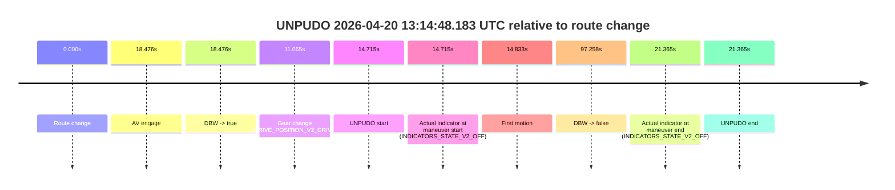
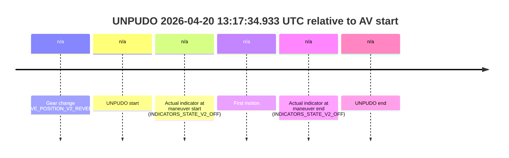
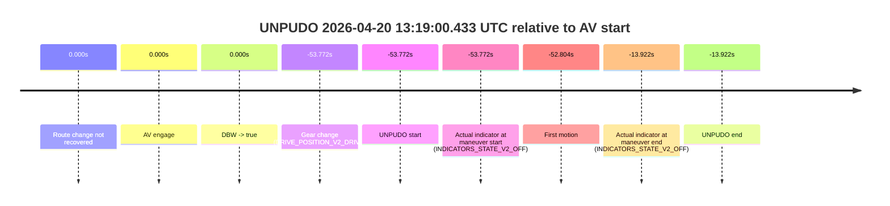
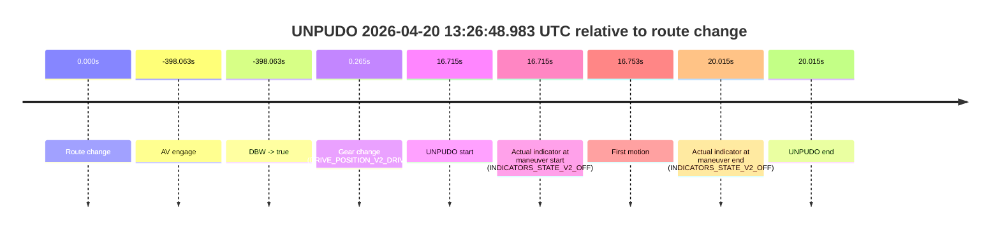

# Run Report: fme20032/2026-04-20--12-50-45--gen2-av-4433efa2-b85f-49b5-b5ca-0d6e9c3de929

| Field | Value |
|---|---|
| Run ID | `fme20032/2026-04-20--12-50-45--gen2-av-4433efa2-b85f-49b5-b5ca-0d6e9c3de929` |
| Date | `2026-04-20` |
| Model(s) | `plum-timeless-beaver` |
| Author | `peng.tang` |
| Event count | `5` |

## unpudo 2026-04-20 13:11:31.783 UTC

| Field | Value |
|---|---|
| Model | `plum-timeless-beaver` |
| Author | `peng.tang` |
| Run ID | `fme20032/2026-04-20--12-50-45--gen2-av-4433efa2-b85f-49b5-b5ca-0d6e9c3de929` |
| Date | `2026-04-20` |
| Time (UTC) | `13:11:31.783` |
| Event type | `unpudo` |
| Disengagement type | `none observed` |
| Route change | `found` |
| Console | [run](https://console.sso.wayve.ai/run/fme20032/2026-04-20--12-50-45--gen2-av-4433efa2-b85f-49b5-b5ca-0d6e9c3de929?id=&time-unixus=1776690691783322) |
| Foxglove | [segment](https://app.foxglove.dev/wayve-on-prem/p/prj_0dX18KZdVHg1fmmI/view?ds=foxglove-stream&ds.deviceName=fme20032&ds.start=2026-04-20T13%3A11%3A09.768301Z&ds.end=2026-04-20T13%3A14%3A09.905179Z&layoutId=lay_0e7VD4WIKDQGU73Y&time=2026-04-20T13%3A11%3A31.783322Z) |

### Event card: pass

- Pass: AV owns the credited unpudo through the official event window, the gear state is aligned at the anchor, and the vehicle moves without driver accelerator help in AV.

| Event | Time (UTC) | Delta from route change |
|---|---:|---:|
| Route change | 2026-04-20 13:11:19.768 | `0.000s` |
| AV engage | 2026-04-20 13:11:28.384 | `8.617s` |
| DBW -> true | 2026-04-20 13:11:28.384 | `8.617s` |
| Gear change (DRIVE_POSITION_V2_DRIVE) | 2026-04-20 13:11:26.433 | `6.665s` |
| UNPUDO start | 2026-04-20 13:11:31.783 | `12.015s` |
| Actual indicator at maneuver start (INDICATORS_STATE_V2_OFF) | 2026-04-20 13:11:31.783 | `12.015s` |
| First motion | 2026-04-20 13:11:31.801 | `12.033s` |
| DBW -> false | 2026-04-20 13:13:59.905 | `160.137s` |
| Actual indicator at maneuver end (INDICATORS_STATE_V2_OFF) | 2026-04-20 13:11:36.083 | `16.315s` |
| UNPUDO end | 2026-04-20 13:11:36.083 | `16.315s` |

| Metric | Value |
|---|---|
| Outcome | `pass` |
| Effective failure type | `none` |
| Route change status | `found` |
| DBW at event start | `true` |
| DBW at event end | `true` |
| Predicted gear at AV start | `DRIVE_POSITION_V2_DRIVE` |
| Actual gear at AV start | `DRIVE_POSITION_V2_DRIVE` |
| Predicted gear at event start | `DRIVE_POSITION_V2_DRIVE` |
| Actual gear at event start | `DRIVE_POSITION_V2_DRIVE` |
| Planned indicator direction | `INDICATORS_STATE_V2_OFF` |
| Controller indicator direction | `INDICATORS_STATE_V2_OFF` |
| Actual indicator direction | `INDICATORS_STATE_V2_OFF` |
| Actual indicator at maneuver end | `INDICATORS_STATE_V2_OFF` |
| Driver accel help in AV | `false` |
| Driver accel help timestamp | `n/a` |
| Max accel pedal pct in AV | `0.0%` |
| Max brake pedal pct in AV | `8.0%` |
| Max speed mps in AV | `4.183` |
| Route -> AV | `8.617s` |
| AV -> event start | `3.398s` |
| AV -> first motion | `3.416s` |
| AV duration before disengagement | `151.520s` |
| Trajectory waypoint count | `37` |
| Driving-plan step count | `11` |

The scored portion starts from the AV-owned window, not from the pre-AV setup. Route-change search in the stopped pre-event segment was `found`, with the baseline therefore set to route change. At the event anchor the model predicts `DRIVE_POSITION_V2_DRIVE` and the actual gear is `DRIVE_POSITION_V2_DRIVE`. The effective model outcome is `pass` because `the credited maneuver stays AV-owned through the official event end`.

### Resolution

| Field | Value |
|---|---|
| Final outcome | `pass` |
| Do we agree with this label? | `yes` |
| Source disengagement type | `none observed` |
| Resolved effective failure type | `none` |
| Confidence | `high` |

## unpudo 2026-04-20 13:14:48.183 UTC

| Field | Value |
|---|---|
| Model | `plum-timeless-beaver` |
| Author | `peng.tang` |
| Run ID | `fme20032/2026-04-20--12-50-45--gen2-av-4433efa2-b85f-49b5-b5ca-0d6e9c3de929` |
| Date | `2026-04-20` |
| Time (UTC) | `13:14:48.183` |
| Event type | `unpudo` |
| Disengagement type | `none observed` |
| Route change | `found` |
| Console | [run](https://console.sso.wayve.ai/run/fme20032/2026-04-20--12-50-45--gen2-av-4433efa2-b85f-49b5-b5ca-0d6e9c3de929?id=&time-unixus=1776690888183295) |
| Foxglove | [segment](https://app.foxglove.dev/wayve-on-prem/p/prj_0dX18KZdVHg1fmmI/view?ds=foxglove-stream&ds.deviceName=fme20032&ds.start=2026-04-20T13%3A14%3A23.468279Z&ds.end=2026-04-20T13%3A16%3A20.726196Z&layoutId=lay_0e7VD4WIKDQGU73Y&time=2026-04-20T13%3A14%3A48.183295Z) |

### Event card: non-av

- Non-AV: the detected unpudo starts outside AV ownership, so it is kept for coverage but excluded from model success / failure scoring.

| Event | Time (UTC) | Delta from route change |
|---|---:|---:|
| Route change | 2026-04-20 13:14:33.468 | `0.000s` |
| AV engage | 2026-04-20 13:14:51.944 | `18.476s` |
| DBW -> true | 2026-04-20 13:14:51.944 | `18.476s` |
| Gear change (DRIVE_POSITION_V2_DRIVE) | 2026-04-20 13:14:44.533 | `11.065s` |
| UNPUDO start | 2026-04-20 13:14:48.183 | `14.715s` |
| Actual indicator at maneuver start (INDICATORS_STATE_V2_OFF) | 2026-04-20 13:14:48.183 | `14.715s` |
| First motion | 2026-04-20 13:14:48.301 | `14.833s` |
| DBW -> false | 2026-04-20 13:16:10.726 | `97.258s` |
| Actual indicator at maneuver end (INDICATORS_STATE_V2_OFF) | 2026-04-20 13:14:54.833 | `21.365s` |
| UNPUDO end | 2026-04-20 13:14:54.833 | `21.365s` |

| Metric | Value |
|---|---|
| Outcome | `non-av` |
| Effective failure type | `none` |
| Route change status | `found` |
| DBW at event start | `false` |
| DBW at event end | `true` |
| Predicted gear at AV start | `DRIVE_POSITION_V2_DRIVE` |
| Actual gear at AV start | `DRIVE_POSITION_V2_DRIVE` |
| Predicted gear at event start | `DRIVE_POSITION_V2_DRIVE` |
| Actual gear at event start | `DRIVE_POSITION_V2_DRIVE` |
| Planned indicator direction | `INDICATORS_STATE_V2_RIGHT_ON` |
| Controller indicator direction | `INDICATORS_STATE_V2_RIGHT_ON` |
| Actual indicator direction | `INDICATORS_STATE_V2_OFF` |
| Actual indicator at maneuver end | `INDICATORS_STATE_V2_OFF` |
| Driver accel help in AV | `false` |
| Driver accel help timestamp | `n/a` |
| Max accel pedal pct in AV | `0.0%` |
| Max brake pedal pct in AV | `0.0%` |
| Max speed mps in AV | `3.719` |
| Route -> AV | `18.476s` |
| AV -> event start | `-3.761s` |
| AV -> first motion | `-3.643s` |
| AV duration before disengagement | `78.782s` |
| Trajectory waypoint count | `37` |
| Driving-plan step count | `11` |

The scored portion starts from the AV-owned window, not from the pre-AV setup. Route-change search in the stopped pre-event segment was `found`, with the baseline therefore set to route change. At the event anchor the model predicts `DRIVE_POSITION_V2_DRIVE` and the actual gear is `DRIVE_POSITION_V2_DRIVE`. The effective model outcome is `non-av` because `the event does not begin in AV ownership`.

### Resolution

| Field | Value |
|---|---|
| Final outcome | `non-av` |
| Do we agree with this label? | `yes` |
| Source disengagement type | `none observed` |
| Resolved effective failure type | `none` |
| Confidence | `high` |

## unpudo 2026-04-20 13:17:34.933 UTC

| Field | Value |
|---|---|
| Model | `plum-timeless-beaver` |
| Author | `peng.tang` |
| Run ID | `fme20032/2026-04-20--12-50-45--gen2-av-4433efa2-b85f-49b5-b5ca-0d6e9c3de929` |
| Date | `2026-04-20` |
| Time (UTC) | `13:17:34.933` |
| Event type | `unpudo` |
| Disengagement type | `none observed` |
| Route change | `unclear` |
| Console | [run](https://console.sso.wayve.ai/run/fme20032/2026-04-20--12-50-45--gen2-av-4433efa2-b85f-49b5-b5ca-0d6e9c3de929?id=&time-unixus=1776691054933315) |
| Foxglove | [segment](https://app.foxglove.dev/wayve-on-prem/p/prj_0dX18KZdVHg1fmmI/view?ds=foxglove-stream&ds.deviceName=fme20032&ds.start=2026-04-20T13%3A17%3A22.883311Z&ds.end=2026-04-20T13%3A17%3A44.933315Z&layoutId=lay_0e7VD4WIKDQGU73Y&time=2026-04-20T13%3A17%3A34.933315Z) |

### Event card: non-av

- Non-AV: the detected unpudo starts outside AV ownership, so it is kept for coverage but excluded from model success / failure scoring.

| Event | Time (UTC) | Delta from AV start |
|---|---:|---:|
| Gear change (DRIVE_POSITION_V2_REVERSE) | 2026-04-20 13:17:32.883 | `n/a` |
| UNPUDO start | 2026-04-20 13:17:34.933 | `n/a` |
| Actual indicator at maneuver start (INDICATORS_STATE_V2_OFF) | 2026-04-20 13:17:34.933 | `n/a` |
| First motion | 2026-04-20 13:17:42.441 | `n/a` |
| Actual indicator at maneuver end (INDICATORS_STATE_V2_OFF) | 2026-04-20 13:17:34.933 | `n/a` |
| UNPUDO end | 2026-04-20 13:17:34.933 | `n/a` |

| Metric | Value |
|---|---|
| Outcome | `non-av` |
| Effective failure type | `none` |
| Route change status | `unclear` |
| DBW at event start | `false` |
| DBW at event end | `false` |
| Predicted gear at AV start | `n/a` |
| Actual gear at AV start | `n/a` |
| Predicted gear at event start | `DRIVE_POSITION_V2_REVERSE` |
| Actual gear at event start | `DRIVE_POSITION_V2_REVERSE` |
| Planned indicator direction | `INDICATORS_STATE_V2_OFF` |
| Controller indicator direction | `INDICATORS_STATE_V2_OFF` |
| Actual indicator direction | `INDICATORS_STATE_V2_OFF` |
| Actual indicator at maneuver end | `INDICATORS_STATE_V2_OFF` |
| Driver accel help in AV | `false` |
| Driver accel help timestamp | `n/a` |
| Max accel pedal pct in AV | `0.0%` |
| Max brake pedal pct in AV | `0.0%` |
| Max speed mps in AV | `0.000` |
| Route -> AV | `n/a` |
| AV -> event start | `n/a` |
| AV -> first motion | `n/a` |
| AV duration before disengagement | `n/a` |
| Trajectory waypoint count | `34` |
| Driving-plan step count | `11` |

The scored portion starts from the AV-owned window, not from the pre-AV setup. Route-change search in the stopped pre-event segment was `unclear`, with the baseline therefore set to AV start. At the event anchor the model predicts `DRIVE_POSITION_V2_REVERSE` and the actual gear is `DRIVE_POSITION_V2_REVERSE`. The effective model outcome is `non-av` because `the event does not begin in AV ownership`.

### Resolution

| Field | Value |
|---|---|
| Final outcome | `non-av` |
| Do we agree with this label? | `yes` |
| Source disengagement type | `none observed` |
| Resolved effective failure type | `none` |
| Confidence | `medium` |

## unpudo 2026-04-20 13:19:00.433 UTC

| Field | Value |
|---|---|
| Model | `plum-timeless-beaver` |
| Author | `peng.tang` |
| Run ID | `fme20032/2026-04-20--12-50-45--gen2-av-4433efa2-b85f-49b5-b5ca-0d6e9c3de929` |
| Date | `2026-04-20` |
| Time (UTC) | `13:19:00.433` |
| Event type | `unpudo` |
| Disengagement type | `none observed` |
| Route change | `not found` |
| Console | [run](https://console.sso.wayve.ai/run/fme20032/2026-04-20--12-50-45--gen2-av-4433efa2-b85f-49b5-b5ca-0d6e9c3de929?id=&time-unixus=1776691140433315) |
| Foxglove | [segment](https://app.foxglove.dev/wayve-on-prem/p/prj_0dX18KZdVHg1fmmI/view?ds=foxglove-stream&ds.deviceName=fme20032&ds.start=2026-04-20T13%3A18%3A50.433315Z&ds.end=2026-04-20T13%3A19%3A50.283306Z&layoutId=lay_0e7VD4WIKDQGU73Y&time=2026-04-20T13%3A19%3A00.433315Z) |

### Event card: accidental

- Accidental: AV ownership is present for less than `2s`, so this is treated as an accidental brush with the maneuver rather than a meaningful model attempt.

| Event | Time (UTC) | Delta from AV start |
|---|---:|---:|
| Route change not recovered | 2026-04-20 13:19:54.205 | `0.000s` |
| AV engage | 2026-04-20 13:19:54.205 | `0.000s` |
| DBW -> true | 2026-04-20 13:19:54.205 | `0.000s` |
| Gear change (DRIVE_POSITION_V2_DRIVE) | 2026-04-20 13:19:00.433 | `-53.772s` |
| UNPUDO start | 2026-04-20 13:19:00.433 | `-53.772s` |
| Actual indicator at maneuver start (INDICATORS_STATE_V2_OFF) | 2026-04-20 13:19:00.433 | `-53.772s` |
| First motion | 2026-04-20 13:19:01.401 | `-52.804s` |
| Actual indicator at maneuver end (INDICATORS_STATE_V2_OFF) | 2026-04-20 13:19:40.283 | `-13.922s` |
| UNPUDO end | 2026-04-20 13:19:40.283 | `-13.922s` |

| Metric | Value |
|---|---|
| Outcome | `accidental` |
| Effective failure type | `none` |
| Route change status | `not found` |
| DBW at event start | `false` |
| DBW at event end | `false` |
| Predicted gear at AV start | `DRIVE_POSITION_V2_DRIVE` |
| Actual gear at AV start | `DRIVE_POSITION_V2_DRIVE` |
| Predicted gear at event start | `DRIVE_POSITION_V2_REVERSE` |
| Actual gear at event start | `DRIVE_POSITION_V2_DRIVE` |
| Planned indicator direction | `INDICATORS_STATE_V2_OFF` |
| Controller indicator direction | `INDICATORS_STATE_V2_OFF` |
| Actual indicator direction | `INDICATORS_STATE_V2_OFF` |
| Actual indicator at maneuver end | `INDICATORS_STATE_V2_OFF` |
| Driver accel help in AV | `false` |
| Driver accel help timestamp | `n/a` |
| Max accel pedal pct in AV | `0.0%` |
| Max brake pedal pct in AV | `0.0%` |
| Max speed mps in AV | `0.000` |
| Route -> AV | `n/a` |
| AV -> event start | `-53.772s` |
| AV -> first motion | `-52.804s` |
| AV duration before disengagement | `n/a` |
| Trajectory waypoint count | `36` |
| Driving-plan step count | `11` |

The scored portion starts from the AV-owned window, not from the pre-AV setup. Route-change search in the stopped pre-event segment was `not found`, with the baseline therefore set to AV start. At the event anchor the model predicts `DRIVE_POSITION_V2_REVERSE` and the actual gear is `DRIVE_POSITION_V2_DRIVE`. The effective model outcome is `accidental` because `the AV-owned portion is shorter than 2s`.

### Resolution

| Field | Value |
|---|---|
| Final outcome | `accidental` |
| Do we agree with this label? | `yes` |
| Source disengagement type | `none observed` |
| Resolved effective failure type | `none` |
| Confidence | `high` |

## unpudo 2026-04-20 13:26:48.983 UTC

| Field | Value |
|---|---|
| Model | `plum-timeless-beaver` |
| Author | `peng.tang` |
| Run ID | `fme20032/2026-04-20--12-50-45--gen2-av-4433efa2-b85f-49b5-b5ca-0d6e9c3de929` |
| Date | `2026-04-20` |
| Time (UTC) | `13:26:48.983` |
| Event type | `unpudo` |
| Disengagement type | `none observed` |
| Route change | `found` |
| Console | [run](https://console.sso.wayve.ai/run/fme20032/2026-04-20--12-50-45--gen2-av-4433efa2-b85f-49b5-b5ca-0d6e9c3de929?id=&time-unixus=1776691608983319) |
| Foxglove | [segment](https://app.foxglove.dev/wayve-on-prem/p/prj_0dX18KZdVHg1fmmI/view?ds=foxglove-stream&ds.deviceName=fme20032&ds.start=2026-04-20T13%3A19%3A44.205302Z&ds.end=2026-04-20T13%3A27%3A02.283321Z&layoutId=lay_0e7VD4WIKDQGU73Y&time=2026-04-20T13%3A26%3A48.983319Z) |

### Event card: pass

- Pass: AV owns the credited unpudo through the official event window, the gear state is aligned at the anchor, and the vehicle moves without driver accelerator help in AV.

| Event | Time (UTC) | Delta from route change |
|---|---:|---:|
| Route change | 2026-04-20 13:26:32.268 | `0.000s` |
| AV engage | 2026-04-20 13:19:54.205 | `-398.063s` |
| DBW -> true | 2026-04-20 13:19:54.205 | `-398.063s` |
| Gear change (DRIVE_POSITION_V2_DRIVE) | 2026-04-20 13:26:32.533 | `0.265s` |
| UNPUDO start | 2026-04-20 13:26:48.983 | `16.715s` |
| Actual indicator at maneuver start (INDICATORS_STATE_V2_OFF) | 2026-04-20 13:26:48.983 | `16.715s` |
| First motion | 2026-04-20 13:26:49.021 | `16.753s` |
| Actual indicator at maneuver end (INDICATORS_STATE_V2_OFF) | 2026-04-20 13:26:52.283 | `20.015s` |
| UNPUDO end | 2026-04-20 13:26:52.283 | `20.015s` |

| Metric | Value |
|---|---|
| Outcome | `pass` |
| Effective failure type | `none` |
| Route change status | `found` |
| DBW at event start | `true` |
| DBW at event end | `true` |
| Predicted gear at AV start | `DRIVE_POSITION_V2_DRIVE` |
| Actual gear at AV start | `DRIVE_POSITION_V2_DRIVE` |
| Predicted gear at event start | `DRIVE_POSITION_V2_DRIVE` |
| Actual gear at event start | `DRIVE_POSITION_V2_DRIVE` |
| Planned indicator direction | `INDICATORS_STATE_V2_OFF` |
| Controller indicator direction | `INDICATORS_STATE_V2_OFF` |
| Actual indicator direction | `INDICATORS_STATE_V2_OFF` |
| Actual indicator at maneuver end | `INDICATORS_STATE_V2_OFF` |
| Driver accel help in AV | `false` |
| Driver accel help timestamp | `n/a` |
| Max accel pedal pct in AV | `0.0%` |
| Max brake pedal pct in AV | `17.9%` |
| Max speed mps in AV | `8.369` |
| Route -> AV | `-398.063s` |
| AV -> event start | `414.778s` |
| AV -> first motion | `414.816s` |
| AV duration before disengagement | `n/a` |
| Trajectory waypoint count | `37` |
| Driving-plan step count | `11` |

The scored portion starts from the AV-owned window, not from the pre-AV setup. Route-change search in the stopped pre-event segment was `found`, with the baseline therefore set to route change. At the event anchor the model predicts `DRIVE_POSITION_V2_DRIVE` and the actual gear is `DRIVE_POSITION_V2_DRIVE`. The effective model outcome is `pass` because `the credited maneuver stays AV-owned through the official event end`.

### Resolution

| Field | Value |
|---|---|
| Final outcome | `pass` |
| Do we agree with this label? | `yes` |
| Source disengagement type | `none observed` |
| Resolved effective failure type | `none` |
| Confidence | `high` |
