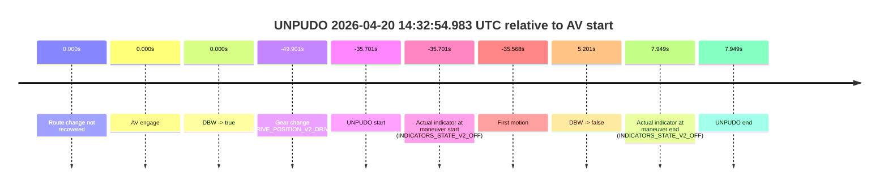
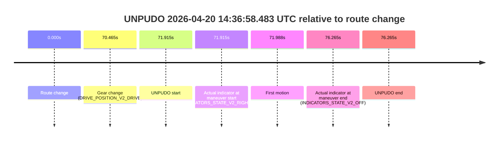
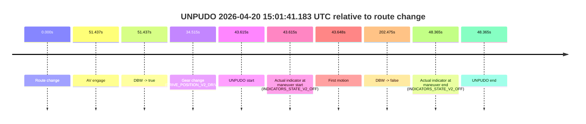
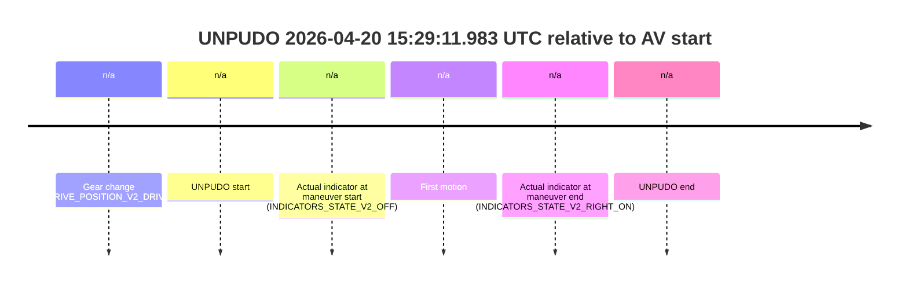
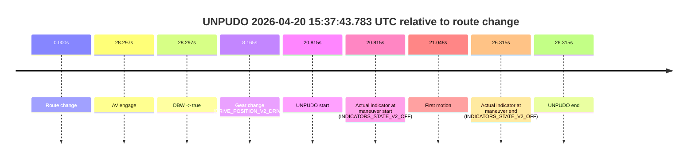

# Run Report: fme20032/2026-04-20--14-11-26--gen2-av-998375f8-34dd-4d1c-841c-c276c19eba04

| Field | Value |
|---|---|
| Run ID | `fme20032/2026-04-20--14-11-26--gen2-av-998375f8-34dd-4d1c-841c-c276c19eba04` |
| Date | `2026-04-20` |
| Model(s) | `blue-panther-solid` |
| Author | `guy.geva` |
| Event count | `10` |

## unpudo 2026-04-20 14:32:54.983 UTC

| Field | Value |
|---|---|
| Model | `blue-panther-solid` |
| Author | `guy.geva` |
| Run ID | `fme20032/2026-04-20--14-11-26--gen2-av-998375f8-34dd-4d1c-841c-c276c19eba04` |
| Date | `2026-04-20` |
| Time (UTC) | `14:32:54.983` |
| Event type | `unpudo` |
| Disengagement type | `none observed` |
| Route change | `not found` |
| Console | [run](https://console.sso.wayve.ai/run/fme20032/2026-04-20--14-11-26--gen2-av-998375f8-34dd-4d1c-841c-c276c19eba04?id=&time-unixus=1776695574983306) |
| Foxglove | [segment](https://app.foxglove.dev/wayve-on-prem/p/prj_0dX18KZdVHg1fmmI/view?ds=foxglove-stream&ds.deviceName=fme20032&ds.start=2026-04-20T14%3A32%3A30.783309Z&ds.end=2026-04-20T14%3A33%3A48.633314Z&layoutId=lay_0e7VD4WIKDQGU73Y&time=2026-04-20T14%3A32%3A54.983306Z) |

### Event card: fail

- Fail: the credited unpudo does not stay AV-owned. The event window starts with DBW false, and the maneuver outcome lands outside a clean AV-owned segment.

| Event | Time (UTC) | Delta from AV start |
|---|---:|---:|
| Route change not recovered | 2026-04-20 14:33:30.683 | `0.000s` |
| AV engage | 2026-04-20 14:33:30.683 | `0.000s` |
| DBW -> true | 2026-04-20 14:33:30.683 | `0.000s` |
| Gear change (DRIVE_POSITION_V2_DRIVE) | 2026-04-20 14:32:40.783 | `-49.901s` |
| UNPUDO start | 2026-04-20 14:32:54.983 | `-35.701s` |
| Actual indicator at maneuver start (INDICATORS_STATE_V2_OFF) | 2026-04-20 14:32:54.983 | `-35.701s` |
| First motion | 2026-04-20 14:32:55.115 | `-35.568s` |
| DBW -> false | 2026-04-20 14:33:35.884 | `5.201s` |
| Actual indicator at maneuver end (INDICATORS_STATE_V2_OFF) | 2026-04-20 14:33:38.633 | `7.949s` |
| UNPUDO end | 2026-04-20 14:33:38.633 | `7.949s` |

| Metric | Value |
|---|---|
| Outcome | `fail` |
| Effective failure type | `completed_outside_av` |
| Route change status | `not found` |
| DBW at event start | `false` |
| DBW at event end | `false` |
| Predicted gear at AV start | `DRIVE_POSITION_V2_DRIVE` |
| Actual gear at AV start | `DRIVE_POSITION_V2_PARK` |
| Predicted gear at event start | `DRIVE_POSITION_V2_DRIVE` |
| Actual gear at event start | `DRIVE_POSITION_V2_DRIVE` |
| Planned indicator direction | `INDICATORS_STATE_V2_RIGHT_ON` |
| Controller indicator direction | `INDICATORS_STATE_V2_RIGHT_ON` |
| Actual indicator direction | `INDICATORS_STATE_V2_OFF` |
| Actual indicator at maneuver end | `INDICATORS_STATE_V2_OFF` |
| Driver accel help in AV | `false` |
| Driver accel help timestamp | `n/a` |
| Max accel pedal pct in AV | `0.0%` |
| Max brake pedal pct in AV | `8.0%` |
| Max speed mps in AV | `0.000` |
| Route -> AV | `n/a` |
| AV -> event start | `-35.701s` |
| AV -> first motion | `-35.568s` |
| AV duration before disengagement | `5.201s` |
| Trajectory waypoint count | `37` |
| Driving-plan step count | `11` |

The scored portion starts from the AV-owned window, not from the pre-AV setup. Route-change search in the stopped pre-event segment was `not found`, with the baseline therefore set to AV start. At the event anchor the model predicts `DRIVE_POSITION_V2_DRIVE` and the actual gear is `DRIVE_POSITION_V2_DRIVE`. The effective model outcome is `fail` because `completed_outside_av`.

### Resolution

| Field | Value |
|---|---|
| Final outcome | `fail` |
| Do we agree with this label? | `yes` |
| Source disengagement type | `none observed` |
| Resolved effective failure type | `completed_outside_av` |
| Confidence | `high` |

## unpudo 2026-04-20 14:36:58.483 UTC

| Field | Value |
|---|---|
| Model | `blue-panther-solid` |
| Author | `guy.geva` |
| Run ID | `fme20032/2026-04-20--14-11-26--gen2-av-998375f8-34dd-4d1c-841c-c276c19eba04` |
| Date | `2026-04-20` |
| Time (UTC) | `14:36:58.483` |
| Event type | `unpudo` |
| Disengagement type | `none observed` |
| Route change | `found` |
| Console | [run](https://console.sso.wayve.ai/run/fme20032/2026-04-20--14-11-26--gen2-av-998375f8-34dd-4d1c-841c-c276c19eba04?id=&time-unixus=1776695818483296) |
| Foxglove | [segment](https://app.foxglove.dev/wayve-on-prem/p/prj_0dX18KZdVHg1fmmI/view?ds=foxglove-stream&ds.deviceName=fme20032&ds.start=2026-04-20T14%3A35%3A36.568324Z&ds.end=2026-04-20T14%3A37%3A12.833307Z&layoutId=lay_0e7VD4WIKDQGU73Y&time=2026-04-20T14%3A36%3A58.483296Z) |

### Event card: fail

- Fail: the credited unpudo does not stay AV-owned. The event window starts with DBW false, and the maneuver outcome lands outside a clean AV-owned segment.

| Event | Time (UTC) | Delta from route change |
|---|---:|---:|
| Route change | 2026-04-20 14:35:46.568 | `0.000s` |
| Gear change (DRIVE_POSITION_V2_DRIVE) | 2026-04-20 14:36:57.033 | `70.465s` |
| UNPUDO start | 2026-04-20 14:36:58.483 | `71.915s` |
| Actual indicator at maneuver start (INDICATORS_STATE_V2_RIGHT_ON) | 2026-04-20 14:36:58.483 | `71.915s` |
| First motion | 2026-04-20 14:36:58.555 | `71.988s` |
| Actual indicator at maneuver end (INDICATORS_STATE_V2_OFF) | 2026-04-20 14:37:02.833 | `76.265s` |
| UNPUDO end | 2026-04-20 14:37:02.833 | `76.265s` |

| Metric | Value |
|---|---|
| Outcome | `fail` |
| Effective failure type | `not_av_owned` |
| Route change status | `found` |
| DBW at event start | `false` |
| DBW at event end | `false` |
| Predicted gear at AV start | `n/a` |
| Actual gear at AV start | `n/a` |
| Predicted gear at event start | `DRIVE_POSITION_V2_DRIVE` |
| Actual gear at event start | `DRIVE_POSITION_V2_DRIVE` |
| Planned indicator direction | `INDICATORS_STATE_V2_RIGHT_ON` |
| Controller indicator direction | `INDICATORS_STATE_V2_RIGHT_ON` |
| Actual indicator direction | `INDICATORS_STATE_V2_RIGHT_ON` |
| Actual indicator at maneuver end | `INDICATORS_STATE_V2_OFF` |
| Driver accel help in AV | `false` |
| Driver accel help timestamp | `n/a` |
| Max accel pedal pct in AV | `0.0%` |
| Max brake pedal pct in AV | `0.0%` |
| Max speed mps in AV | `0.000` |
| Route -> AV | `n/a` |
| AV -> event start | `n/a` |
| AV -> first motion | `n/a` |
| AV duration before disengagement | `n/a` |
| Trajectory waypoint count | `37` |
| Driving-plan step count | `11` |

The scored portion starts from the AV-owned window, not from the pre-AV setup. Route-change search in the stopped pre-event segment was `found`, with the baseline therefore set to route change. At the event anchor the model predicts `DRIVE_POSITION_V2_DRIVE` and the actual gear is `DRIVE_POSITION_V2_DRIVE`. The effective model outcome is `fail` because `not_av_owned`.

### Resolution

| Field | Value |
|---|---|
| Final outcome | `fail` |
| Do we agree with this label? | `yes` |
| Source disengagement type | `none observed` |
| Resolved effective failure type | `not_av_owned` |
| Confidence | `high` |

## unpudo 2026-04-20 14:38:43.383 UTC

| Field | Value |
|---|---|
| Model | `blue-panther-solid` |
| Author | `guy.geva` |
| Run ID | `fme20032/2026-04-20--14-11-26--gen2-av-998375f8-34dd-4d1c-841c-c276c19eba04` |
| Date | `2026-04-20` |
| Time (UTC) | `14:38:43.383` |
| Event type | `unpudo` |
| Disengagement type | `none observed` |
| Route change | `found` |
| Console | [run](https://console.sso.wayve.ai/run/fme20032/2026-04-20--14-11-26--gen2-av-998375f8-34dd-4d1c-841c-c276c19eba04?id=&time-unixus=1776695923383294) |
| Foxglove | [segment](https://app.foxglove.dev/wayve-on-prem/p/prj_0dX18KZdVHg1fmmI/view?ds=foxglove-stream&ds.deviceName=fme20032&ds.start=2026-04-20T14%3A38%3A16.918275Z&ds.end=2026-04-20T14%3A42%3A33.364031Z&layoutId=lay_0e7VD4WIKDQGU73Y&time=2026-04-20T14%3A38%3A43.383294Z) |

### Event card: pass

- Pass: AV owns the credited unpudo through the official event window, the gear state is aligned at the anchor, and the vehicle moves without driver accelerator help in AV.

| Event | Time (UTC) | Delta from route change |
|---|---:|---:|
| Route change | 2026-04-20 14:38:26.918 | `0.000s` |
| AV engage | 2026-04-20 14:38:39.323 | `12.406s` |
| DBW -> true | 2026-04-20 14:38:39.323 | `12.406s` |
| Gear change (DRIVE_POSITION_V2_DRIVE) | 2026-04-20 14:38:39.783 | `12.865s` |
| UNPUDO start | 2026-04-20 14:38:43.383 | `16.465s` |
| Actual indicator at maneuver start (INDICATORS_STATE_V2_OFF) | 2026-04-20 14:38:43.383 | `16.465s` |
| First motion | 2026-04-20 14:38:43.415 | `16.498s` |
| DBW -> false | 2026-04-20 14:42:23.364 | `236.446s` |
| Actual indicator at maneuver end (INDICATORS_STATE_V2_OFF) | 2026-04-20 14:38:47.283 | `20.365s` |
| UNPUDO end | 2026-04-20 14:38:47.283 | `20.365s` |

| Metric | Value |
|---|---|
| Outcome | `pass` |
| Effective failure type | `none` |
| Route change status | `found` |
| DBW at event start | `true` |
| DBW at event end | `true` |
| Predicted gear at AV start | `DRIVE_POSITION_V2_DRIVE` |
| Actual gear at AV start | `DRIVE_POSITION_V2_PARK` |
| Predicted gear at event start | `DRIVE_POSITION_V2_DRIVE` |
| Actual gear at event start | `DRIVE_POSITION_V2_DRIVE` |
| Planned indicator direction | `INDICATORS_STATE_V2_RIGHT_ON` |
| Controller indicator direction | `INDICATORS_STATE_V2_RIGHT_ON` |
| Actual indicator direction | `INDICATORS_STATE_V2_OFF` |
| Actual indicator at maneuver end | `INDICATORS_STATE_V2_OFF` |
| Driver accel help in AV | `false` |
| Driver accel help timestamp | `n/a` |
| Max accel pedal pct in AV | `0.0%` |
| Max brake pedal pct in AV | `8.0%` |
| Max speed mps in AV | `4.708` |
| Route -> AV | `12.406s` |
| AV -> event start | `4.059s` |
| AV -> first motion | `4.092s` |
| AV duration before disengagement | `224.040s` |
| Trajectory waypoint count | `37` |
| Driving-plan step count | `11` |

The scored portion starts from the AV-owned window, not from the pre-AV setup. Route-change search in the stopped pre-event segment was `found`, with the baseline therefore set to route change. At the event anchor the model predicts `DRIVE_POSITION_V2_DRIVE` and the actual gear is `DRIVE_POSITION_V2_DRIVE`. The effective model outcome is `pass` because `the credited maneuver stays AV-owned through the official event end`.

### Resolution

| Field | Value |
|---|---|
| Final outcome | `pass` |
| Do we agree with this label? | `yes` |
| Source disengagement type | `none observed` |
| Resolved effective failure type | `none` |
| Confidence | `high` |

## unpudo 2026-04-20 14:42:28.483 UTC

| Field | Value |
|---|---|
| Model | `blue-panther-solid` |
| Author | `guy.geva` |
| Run ID | `fme20032/2026-04-20--14-11-26--gen2-av-998375f8-34dd-4d1c-841c-c276c19eba04` |
| Date | `2026-04-20` |
| Time (UTC) | `14:42:28.483` |
| Event type | `unpudo` |
| Disengagement type | `none observed` |
| Route change | `found` |
| Console | [run](https://console.sso.wayve.ai/run/fme20032/2026-04-20--14-11-26--gen2-av-998375f8-34dd-4d1c-841c-c276c19eba04?id=&time-unixus=1776696148483295) |
| Foxglove | [segment](https://app.foxglove.dev/wayve-on-prem/p/prj_0dX18KZdVHg1fmmI/view?ds=foxglove-stream&ds.deviceName=fme20032&ds.start=2026-04-20T14%3A42%3A05.970620Z&ds.end=2026-04-20T14%3A44%3A26.344250Z&layoutId=lay_0e7VD4WIKDQGU73Y&time=2026-04-20T14%3A42%3A28.483295Z) |

### Event card: fail

- Fail: the credited unpudo does not stay AV-owned. The event window starts with DBW false, and the maneuver outcome lands outside a clean AV-owned segment.

| Event | Time (UTC) | Delta from route change |
|---|---:|---:|
| Route change | 2026-04-20 14:42:15.970 | `0.000s` |
| AV engage | 2026-04-20 14:43:33.823 | `77.853s` |
| DBW -> true | 2026-04-20 14:43:33.823 | `77.853s` |
| Gear change (DRIVE_POSITION_V2_REVERSE) | 2026-04-20 14:42:16.383 | `0.413s` |
| UNPUDO start | 2026-04-20 14:42:28.483 | `12.513s` |
| Actual indicator at maneuver start (INDICATORS_STATE_V2_OFF) | 2026-04-20 14:42:28.483 | `12.513s` |
| First motion | 2026-04-20 14:42:42.055 | `26.085s` |
| DBW -> false | 2026-04-20 14:44:16.344 | `120.374s` |
| Actual indicator at maneuver end (INDICATORS_STATE_V2_OFF) | 2026-04-20 14:43:27.733 | `71.763s` |
| UNPUDO end | 2026-04-20 14:43:27.733 | `71.763s` |

| Metric | Value |
|---|---|
| Outcome | `fail` |
| Effective failure type | `completed_outside_av` |
| Route change status | `found` |
| DBW at event start | `false` |
| DBW at event end | `false` |
| Predicted gear at AV start | `DRIVE_POSITION_V2_DRIVE` |
| Actual gear at AV start | `DRIVE_POSITION_V2_DRIVE` |
| Predicted gear at event start | `DRIVE_POSITION_V2_REVERSE` |
| Actual gear at event start | `DRIVE_POSITION_V2_REVERSE` |
| Planned indicator direction | `INDICATORS_STATE_V2_OFF` |
| Controller indicator direction | `INDICATORS_STATE_V2_OFF` |
| Actual indicator direction | `INDICATORS_STATE_V2_OFF` |
| Actual indicator at maneuver end | `INDICATORS_STATE_V2_OFF` |
| Driver accel help in AV | `false` |
| Driver accel help timestamp | `n/a` |
| Max accel pedal pct in AV | `0.0%` |
| Max brake pedal pct in AV | `0.0%` |
| Max speed mps in AV | `0.000` |
| Route -> AV | `77.853s` |
| AV -> event start | `-65.341s` |
| AV -> first motion | `-51.768s` |
| AV duration before disengagement | `42.520s` |
| Trajectory waypoint count | `37` |
| Driving-plan step count | `11` |

The scored portion starts from the AV-owned window, not from the pre-AV setup. Route-change search in the stopped pre-event segment was `found`, with the baseline therefore set to route change. At the event anchor the model predicts `DRIVE_POSITION_V2_REVERSE` and the actual gear is `DRIVE_POSITION_V2_REVERSE`. The effective model outcome is `fail` because `completed_outside_av`.

### Resolution

| Field | Value |
|---|---|
| Final outcome | `fail` |
| Do we agree with this label? | `yes` |
| Source disengagement type | `none observed` |
| Resolved effective failure type | `completed_outside_av` |
| Confidence | `high` |

## unpudo 2026-04-20 14:48:27.183 UTC

| Field | Value |
|---|---|
| Model | `blue-panther-solid` |
| Author | `guy.geva` |
| Run ID | `fme20032/2026-04-20--14-11-26--gen2-av-998375f8-34dd-4d1c-841c-c276c19eba04` |
| Date | `2026-04-20` |
| Time (UTC) | `14:48:27.183` |
| Event type | `unpudo` |
| Disengagement type | `none observed` |
| Route change | `found` |
| Console | [run](https://console.sso.wayve.ai/run/fme20032/2026-04-20--14-11-26--gen2-av-998375f8-34dd-4d1c-841c-c276c19eba04?id=&time-unixus=1776696507183316) |
| Foxglove | [segment](https://app.foxglove.dev/wayve-on-prem/p/prj_0dX18KZdVHg1fmmI/view?ds=foxglove-stream&ds.deviceName=fme20032&ds.start=2026-04-20T14%3A47%3A57.418631Z&ds.end=2026-04-20T14%3A49%3A01.683300Z&layoutId=lay_0e7VD4WIKDQGU73Y&time=2026-04-20T14%3A48%3A27.183316Z) |

### Event card: fail

- Fail: the credited unpudo does not stay AV-owned. The event window starts with DBW false, and the maneuver outcome lands outside a clean AV-owned segment.

| Event | Time (UTC) | Delta from route change |
|---|---:|---:|
| Route change | 2026-04-20 14:48:07.418 | `0.000s` |
| AV engage | 2026-04-20 14:48:41.644 | `34.226s` |
| DBW -> true | 2026-04-20 14:48:41.644 | `34.226s` |
| Gear change (DRIVE_POSITION_V2_DRIVE) | 2026-04-20 14:48:16.983 | `9.565s` |
| UNPUDO start | 2026-04-20 14:48:27.183 | `19.765s` |
| Actual indicator at maneuver start (INDICATORS_STATE_V2_OFF) | 2026-04-20 14:48:27.183 | `19.765s` |
| First motion | 2026-04-20 14:48:27.295 | `19.877s` |
| DBW -> false | 2026-04-20 14:48:44.703 | `37.285s` |
| Actual indicator at maneuver end (INDICATORS_STATE_V2_OFF) | 2026-04-20 14:48:51.683 | `44.265s` |
| UNPUDO end | 2026-04-20 14:48:51.683 | `44.265s` |

| Metric | Value |
|---|---|
| Outcome | `fail` |
| Effective failure type | `completed_outside_av` |
| Route change status | `found` |
| DBW at event start | `false` |
| DBW at event end | `false` |
| Predicted gear at AV start | `DRIVE_POSITION_V2_DRIVE` |
| Actual gear at AV start | `DRIVE_POSITION_V2_DRIVE` |
| Predicted gear at event start | `DRIVE_POSITION_V2_DRIVE` |
| Actual gear at event start | `DRIVE_POSITION_V2_DRIVE` |
| Planned indicator direction | `INDICATORS_STATE_V2_RIGHT_ON` |
| Controller indicator direction | `INDICATORS_STATE_V2_RIGHT_ON` |
| Actual indicator direction | `INDICATORS_STATE_V2_OFF` |
| Actual indicator at maneuver end | `INDICATORS_STATE_V2_OFF` |
| Driver accel help in AV | `false` |
| Driver accel help timestamp | `n/a` |
| Max accel pedal pct in AV | `0.0%` |
| Max brake pedal pct in AV | `8.0%` |
| Max speed mps in AV | `0.000` |
| Route -> AV | `34.226s` |
| AV -> event start | `-14.461s` |
| AV -> first motion | `-14.348s` |
| AV duration before disengagement | `3.059s` |
| Trajectory waypoint count | `37` |
| Driving-plan step count | `11` |

The scored portion starts from the AV-owned window, not from the pre-AV setup. Route-change search in the stopped pre-event segment was `found`, with the baseline therefore set to route change. At the event anchor the model predicts `DRIVE_POSITION_V2_DRIVE` and the actual gear is `DRIVE_POSITION_V2_DRIVE`. The effective model outcome is `fail` because `completed_outside_av`.

### Resolution

| Field | Value |
|---|---|
| Final outcome | `fail` |
| Do we agree with this label? | `yes` |
| Source disengagement type | `none observed` |
| Resolved effective failure type | `completed_outside_av` |
| Confidence | `high` |

## unpudo 2026-04-20 14:53:38.533 UTC

| Field | Value |
|---|---|
| Model | `blue-panther-solid` |
| Author | `guy.geva` |
| Run ID | `fme20032/2026-04-20--14-11-26--gen2-av-998375f8-34dd-4d1c-841c-c276c19eba04` |
| Date | `2026-04-20` |
| Time (UTC) | `14:53:38.533` |
| Event type | `unpudo` |
| Disengagement type | `none observed` |
| Route change | `found` |
| Console | [run](https://console.sso.wayve.ai/run/fme20032/2026-04-20--14-11-26--gen2-av-998375f8-34dd-4d1c-841c-c276c19eba04?id=&time-unixus=1776696818533308) |
| Foxglove | [segment](https://app.foxglove.dev/wayve-on-prem/p/prj_0dX18KZdVHg1fmmI/view?ds=foxglove-stream&ds.deviceName=fme20032&ds.start=2026-04-20T14%3A52%3A18.468313Z&ds.end=2026-04-20T14%3A54%3A49.183803Z&layoutId=lay_0e7VD4WIKDQGU73Y&time=2026-04-20T14%3A53%3A38.533308Z) |

### Event card: fail

- Fail: the credited unpudo does not stay AV-owned. The event window starts with DBW false, and the maneuver outcome lands outside a clean AV-owned segment.

| Event | Time (UTC) | Delta from route change |
|---|---:|---:|
| Route change | 2026-04-20 14:52:28.468 | `0.000s` |
| AV engage | 2026-04-20 14:53:47.184 | `78.717s` |
| DBW -> true | 2026-04-20 14:53:47.184 | `78.717s` |
| Gear change (DRIVE_POSITION_V2_DRIVE) | 2026-04-20 14:53:35.383 | `66.915s` |
| UNPUDO start | 2026-04-20 14:53:38.533 | `70.065s` |
| Actual indicator at maneuver start (INDICATORS_STATE_V2_OFF) | 2026-04-20 14:53:38.533 | `70.065s` |
| First motion | 2026-04-20 14:53:38.555 | `70.088s` |
| DBW -> false | 2026-04-20 14:54:39.183 | `130.715s` |
| Actual indicator at maneuver end (INDICATORS_STATE_V2_OFF) | 2026-04-20 14:53:43.183 | `74.715s` |
| UNPUDO end | 2026-04-20 14:53:43.183 | `74.715s` |

| Metric | Value |
|---|---|
| Outcome | `fail` |
| Effective failure type | `completed_outside_av` |
| Route change status | `found` |
| DBW at event start | `false` |
| DBW at event end | `false` |
| Predicted gear at AV start | `DRIVE_POSITION_V2_DRIVE` |
| Actual gear at AV start | `DRIVE_POSITION_V2_DRIVE` |
| Predicted gear at event start | `DRIVE_POSITION_V2_DRIVE` |
| Actual gear at event start | `DRIVE_POSITION_V2_DRIVE` |
| Planned indicator direction | `INDICATORS_STATE_V2_RIGHT_ON` |
| Controller indicator direction | `INDICATORS_STATE_V2_RIGHT_ON` |
| Actual indicator direction | `INDICATORS_STATE_V2_OFF` |
| Actual indicator at maneuver end | `INDICATORS_STATE_V2_OFF` |
| Driver accel help in AV | `false` |
| Driver accel help timestamp | `n/a` |
| Max accel pedal pct in AV | `0.0%` |
| Max brake pedal pct in AV | `0.0%` |
| Max speed mps in AV | `0.000` |
| Route -> AV | `78.717s` |
| AV -> event start | `-8.652s` |
| AV -> first motion | `-8.629s` |
| AV duration before disengagement | `51.999s` |
| Trajectory waypoint count | `36` |
| Driving-plan step count | `11` |

The scored portion starts from the AV-owned window, not from the pre-AV setup. Route-change search in the stopped pre-event segment was `found`, with the baseline therefore set to route change. At the event anchor the model predicts `DRIVE_POSITION_V2_DRIVE` and the actual gear is `DRIVE_POSITION_V2_DRIVE`. The effective model outcome is `fail` because `completed_outside_av`.

### Resolution

| Field | Value |
|---|---|
| Final outcome | `fail` |
| Do we agree with this label? | `yes` |
| Source disengagement type | `none observed` |
| Resolved effective failure type | `completed_outside_av` |
| Confidence | `high` |

## unpudo 2026-04-20 15:01:41.183 UTC

| Field | Value |
|---|---|
| Model | `blue-panther-solid` |
| Author | `guy.geva` |
| Run ID | `fme20032/2026-04-20--14-11-26--gen2-av-998375f8-34dd-4d1c-841c-c276c19eba04` |
| Date | `2026-04-20` |
| Time (UTC) | `15:01:41.183` |
| Event type | `unpudo` |
| Disengagement type | `none observed` |
| Route change | `found` |
| Console | [run](https://console.sso.wayve.ai/run/fme20032/2026-04-20--14-11-26--gen2-av-998375f8-34dd-4d1c-841c-c276c19eba04?id=&time-unixus=1776697301183293) |
| Foxglove | [segment](https://app.foxglove.dev/wayve-on-prem/p/prj_0dX18KZdVHg1fmmI/view?ds=foxglove-stream&ds.deviceName=fme20032&ds.start=2026-04-20T15%3A00%3A47.568286Z&ds.end=2026-04-20T15%3A04%3A30.043727Z&layoutId=lay_0e7VD4WIKDQGU73Y&time=2026-04-20T15%3A01%3A41.183293Z) |

### Event card: fail

- Fail: the credited unpudo does not stay AV-owned. The event window starts with DBW false, and the maneuver outcome lands outside a clean AV-owned segment.

| Event | Time (UTC) | Delta from route change |
|---|---:|---:|
| Route change | 2026-04-20 15:00:57.568 | `0.000s` |
| AV engage | 2026-04-20 15:01:49.005 | `51.437s` |
| DBW -> true | 2026-04-20 15:01:49.005 | `51.437s` |
| Gear change (DRIVE_POSITION_V2_DRIVE) | 2026-04-20 15:01:32.083 | `34.515s` |
| UNPUDO start | 2026-04-20 15:01:41.183 | `43.615s` |
| Actual indicator at maneuver start (INDICATORS_STATE_V2_OFF) | 2026-04-20 15:01:41.183 | `43.615s` |
| First motion | 2026-04-20 15:01:41.215 | `43.648s` |
| DBW -> false | 2026-04-20 15:04:20.043 | `202.475s` |
| Actual indicator at maneuver end (INDICATORS_STATE_V2_OFF) | 2026-04-20 15:01:45.933 | `48.365s` |
| UNPUDO end | 2026-04-20 15:01:45.933 | `48.365s` |

| Metric | Value |
|---|---|
| Outcome | `fail` |
| Effective failure type | `completed_outside_av` |
| Route change status | `found` |
| DBW at event start | `false` |
| DBW at event end | `false` |
| Predicted gear at AV start | `DRIVE_POSITION_V2_DRIVE` |
| Actual gear at AV start | `DRIVE_POSITION_V2_DRIVE` |
| Predicted gear at event start | `DRIVE_POSITION_V2_DRIVE` |
| Actual gear at event start | `DRIVE_POSITION_V2_DRIVE` |
| Planned indicator direction | `INDICATORS_STATE_V2_LEFT_ON` |
| Controller indicator direction | `INDICATORS_STATE_V2_LEFT_ON` |
| Actual indicator direction | `INDICATORS_STATE_V2_OFF` |
| Actual indicator at maneuver end | `INDICATORS_STATE_V2_OFF` |
| Driver accel help in AV | `false` |
| Driver accel help timestamp | `n/a` |
| Max accel pedal pct in AV | `0.0%` |
| Max brake pedal pct in AV | `0.0%` |
| Max speed mps in AV | `0.000` |
| Route -> AV | `51.437s` |
| AV -> event start | `-7.822s` |
| AV -> first motion | `-7.789s` |
| AV duration before disengagement | `151.039s` |
| Trajectory waypoint count | `37` |
| Driving-plan step count | `11` |

The scored portion starts from the AV-owned window, not from the pre-AV setup. Route-change search in the stopped pre-event segment was `found`, with the baseline therefore set to route change. At the event anchor the model predicts `DRIVE_POSITION_V2_DRIVE` and the actual gear is `DRIVE_POSITION_V2_DRIVE`. The effective model outcome is `fail` because `completed_outside_av`.

### Resolution

| Field | Value |
|---|---|
| Final outcome | `fail` |
| Do we agree with this label? | `yes` |
| Source disengagement type | `none observed` |
| Resolved effective failure type | `completed_outside_av` |
| Confidence | `high` |

## unpudo 2026-04-20 15:29:11.983 UTC

| Field | Value |
|---|---|
| Model | `blue-panther-solid` |
| Author | `guy.geva` |
| Run ID | `fme20032/2026-04-20--14-11-26--gen2-av-998375f8-34dd-4d1c-841c-c276c19eba04` |
| Date | `2026-04-20` |
| Time (UTC) | `15:29:11.983` |
| Event type | `unpudo` |
| Disengagement type | `none observed` |
| Route change | `unclear` |
| Console | [run](https://console.sso.wayve.ai/run/fme20032/2026-04-20--14-11-26--gen2-av-998375f8-34dd-4d1c-841c-c276c19eba04?id=&time-unixus=1776698951983318) |
| Foxglove | [segment](https://app.foxglove.dev/wayve-on-prem/p/prj_0dX18KZdVHg1fmmI/view?ds=foxglove-stream&ds.deviceName=fme20032&ds.start=2026-04-20T15%3A29%3A00.433296Z&ds.end=2026-04-20T15%3A29%3A36.283299Z&layoutId=lay_0e7VD4WIKDQGU73Y&time=2026-04-20T15%3A29%3A11.983318Z) |

### Event card: fail

- Fail: the credited unpudo does not stay AV-owned. The event window starts with DBW false, and the maneuver outcome lands outside a clean AV-owned segment.

| Event | Time (UTC) | Delta from AV start |
|---|---:|---:|
| Gear change (DRIVE_POSITION_V2_DRIVE) | 2026-04-20 15:29:10.433 | `n/a` |
| UNPUDO start | 2026-04-20 15:29:11.983 | `n/a` |
| Actual indicator at maneuver start (INDICATORS_STATE_V2_OFF) | 2026-04-20 15:29:11.983 | `n/a` |
| First motion | 2026-04-20 15:29:12.115 | `n/a` |
| Actual indicator at maneuver end (INDICATORS_STATE_V2_RIGHT_ON) | 2026-04-20 15:29:26.283 | `n/a` |
| UNPUDO end | 2026-04-20 15:29:26.283 | `n/a` |

| Metric | Value |
|---|---|
| Outcome | `fail` |
| Effective failure type | `not_av_owned` |
| Route change status | `unclear` |
| DBW at event start | `false` |
| DBW at event end | `false` |
| Predicted gear at AV start | `n/a` |
| Actual gear at AV start | `n/a` |
| Predicted gear at event start | `DRIVE_POSITION_V2_DRIVE` |
| Actual gear at event start | `DRIVE_POSITION_V2_DRIVE` |
| Planned indicator direction | `INDICATORS_STATE_V2_OFF` |
| Controller indicator direction | `INDICATORS_STATE_V2_OFF` |
| Actual indicator direction | `INDICATORS_STATE_V2_OFF` |
| Actual indicator at maneuver end | `INDICATORS_STATE_V2_RIGHT_ON` |
| Driver accel help in AV | `false` |
| Driver accel help timestamp | `n/a` |
| Max accel pedal pct in AV | `0.0%` |
| Max brake pedal pct in AV | `0.0%` |
| Max speed mps in AV | `0.000` |
| Route -> AV | `n/a` |
| AV -> event start | `n/a` |
| AV -> first motion | `n/a` |
| AV duration before disengagement | `n/a` |
| Trajectory waypoint count | `37` |
| Driving-plan step count | `11` |

The scored portion starts from the AV-owned window, not from the pre-AV setup. Route-change search in the stopped pre-event segment was `unclear`, with the baseline therefore set to AV start. At the event anchor the model predicts `DRIVE_POSITION_V2_DRIVE` and the actual gear is `DRIVE_POSITION_V2_DRIVE`. The effective model outcome is `fail` because `not_av_owned`.

### Resolution

| Field | Value |
|---|---|
| Final outcome | `fail` |
| Do we agree with this label? | `yes` |
| Source disengagement type | `none observed` |
| Resolved effective failure type | `not_av_owned` |
| Confidence | `medium` |

## unpudo 2026-04-20 15:30:16.833 UTC

| Field | Value |
|---|---|
| Model | `blue-panther-solid` |
| Author | `guy.geva` |
| Run ID | `fme20032/2026-04-20--14-11-26--gen2-av-998375f8-34dd-4d1c-841c-c276c19eba04` |
| Date | `2026-04-20` |
| Time (UTC) | `15:30:16.833` |
| Event type | `unpudo` |
| Disengagement type | `none observed` |
| Route change | `found` |
| Console | [run](https://console.sso.wayve.ai/run/fme20032/2026-04-20--14-11-26--gen2-av-998375f8-34dd-4d1c-841c-c276c19eba04?id=&time-unixus=1776699016833322) |
| Foxglove | [segment](https://app.foxglove.dev/wayve-on-prem/p/prj_0dX18KZdVHg1fmmI/view?ds=foxglove-stream&ds.deviceName=fme20032&ds.start=2026-04-20T15%3A29%3A41.468327Z&ds.end=2026-04-20T15%3A33%3A51.204045Z&layoutId=lay_0e7VD4WIKDQGU73Y&time=2026-04-20T15%3A30%3A16.833322Z) |

### Event card: fail

- Fail: the credited unpudo does not stay AV-owned. The event window starts with DBW false, and the maneuver outcome lands outside a clean AV-owned segment.

| Event | Time (UTC) | Delta from route change |
|---|---:|---:|
| Route change | 2026-04-20 15:29:51.468 | `0.000s` |
| AV engage | 2026-04-20 15:30:52.063 | `60.595s` |
| DBW -> true | 2026-04-20 15:30:52.063 | `60.595s` |
| Gear change (DRIVE_POSITION_V2_DRIVE) | 2026-04-20 15:30:10.683 | `19.215s` |
| UNPUDO start | 2026-04-20 15:30:16.833 | `25.365s` |
| Actual indicator at maneuver start (INDICATORS_STATE_V2_RIGHT_ON) | 2026-04-20 15:30:16.833 | `25.365s` |
| First motion | 2026-04-20 15:30:16.995 | `25.528s` |
| DBW -> false | 2026-04-20 15:33:41.204 | `229.736s` |
| Actual indicator at maneuver end (INDICATORS_STATE_V2_OFF) | 2026-04-20 15:30:51.183 | `59.715s` |
| UNPUDO end | 2026-04-20 15:30:51.183 | `59.715s` |

| Metric | Value |
|---|---|
| Outcome | `fail` |
| Effective failure type | `completed_outside_av` |
| Route change status | `found` |
| DBW at event start | `false` |
| DBW at event end | `false` |
| Predicted gear at AV start | `DRIVE_POSITION_V2_DRIVE` |
| Actual gear at AV start | `DRIVE_POSITION_V2_DRIVE` |
| Predicted gear at event start | `DRIVE_POSITION_V2_DRIVE` |
| Actual gear at event start | `DRIVE_POSITION_V2_DRIVE` |
| Planned indicator direction | `INDICATORS_STATE_V2_RIGHT_ON` |
| Controller indicator direction | `INDICATORS_STATE_V2_RIGHT_ON` |
| Actual indicator direction | `INDICATORS_STATE_V2_RIGHT_ON` |
| Actual indicator at maneuver end | `INDICATORS_STATE_V2_OFF` |
| Driver accel help in AV | `false` |
| Driver accel help timestamp | `n/a` |
| Max accel pedal pct in AV | `0.0%` |
| Max brake pedal pct in AV | `0.0%` |
| Max speed mps in AV | `0.000` |
| Route -> AV | `60.595s` |
| AV -> event start | `-35.230s` |
| AV -> first motion | `-35.068s` |
| AV duration before disengagement | `169.140s` |
| Trajectory waypoint count | `36` |
| Driving-plan step count | `11` |

The scored portion starts from the AV-owned window, not from the pre-AV setup. Route-change search in the stopped pre-event segment was `found`, with the baseline therefore set to route change. At the event anchor the model predicts `DRIVE_POSITION_V2_DRIVE` and the actual gear is `DRIVE_POSITION_V2_DRIVE`. The effective model outcome is `fail` because `completed_outside_av`.

### Resolution

| Field | Value |
|---|---|
| Final outcome | `fail` |
| Do we agree with this label? | `yes` |
| Source disengagement type | `none observed` |
| Resolved effective failure type | `completed_outside_av` |
| Confidence | `high` |

## unpudo 2026-04-20 15:37:43.783 UTC

| Field | Value |
|---|---|
| Model | `blue-panther-solid` |
| Author | `guy.geva` |
| Run ID | `fme20032/2026-04-20--14-11-26--gen2-av-998375f8-34dd-4d1c-841c-c276c19eba04` |
| Date | `2026-04-20` |
| Time (UTC) | `15:37:43.783` |
| Event type | `unpudo` |
| Disengagement type | `none observed` |
| Route change | `found` |
| Console | [run](https://console.sso.wayve.ai/run/fme20032/2026-04-20--14-11-26--gen2-av-998375f8-34dd-4d1c-841c-c276c19eba04?id=&time-unixus=1776699463783300) |
| Foxglove | [segment](https://app.foxglove.dev/wayve-on-prem/p/prj_0dX18KZdVHg1fmmI/view?ds=foxglove-stream&ds.deviceName=fme20032&ds.start=2026-04-20T15%3A37%3A12.968286Z&ds.end=2026-04-20T15%3A37%3A59.283294Z&layoutId=lay_0e7VD4WIKDQGU73Y&time=2026-04-20T15%3A37%3A43.783300Z) |

### Event card: fail

- Fail: the credited unpudo does not stay AV-owned. The event window starts with DBW false, and the maneuver outcome lands outside a clean AV-owned segment.

| Event | Time (UTC) | Delta from route change |
|---|---:|---:|
| Route change | 2026-04-20 15:37:22.968 | `0.000s` |
| AV engage | 2026-04-20 15:37:51.264 | `28.297s` |
| DBW -> true | 2026-04-20 15:37:51.264 | `28.297s` |
| Gear change (DRIVE_POSITION_V2_DRIVE) | 2026-04-20 15:37:31.133 | `8.165s` |
| UNPUDO start | 2026-04-20 15:37:43.783 | `20.815s` |
| Actual indicator at maneuver start (INDICATORS_STATE_V2_OFF) | 2026-04-20 15:37:43.783 | `20.815s` |
| First motion | 2026-04-20 15:37:44.015 | `21.048s` |
| Actual indicator at maneuver end (INDICATORS_STATE_V2_OFF) | 2026-04-20 15:37:49.283 | `26.315s` |
| UNPUDO end | 2026-04-20 15:37:49.283 | `26.315s` |

| Metric | Value |
|---|---|
| Outcome | `fail` |
| Effective failure type | `completed_outside_av` |
| Route change status | `found` |
| DBW at event start | `false` |
| DBW at event end | `false` |
| Predicted gear at AV start | `DRIVE_POSITION_V2_DRIVE` |
| Actual gear at AV start | `DRIVE_POSITION_V2_DRIVE` |
| Predicted gear at event start | `DRIVE_POSITION_V2_DRIVE` |
| Actual gear at event start | `DRIVE_POSITION_V2_DRIVE` |
| Planned indicator direction | `INDICATORS_STATE_V2_RIGHT_ON` |
| Controller indicator direction | `INDICATORS_STATE_V2_RIGHT_ON` |
| Actual indicator direction | `INDICATORS_STATE_V2_OFF` |
| Actual indicator at maneuver end | `INDICATORS_STATE_V2_OFF` |
| Driver accel help in AV | `false` |
| Driver accel help timestamp | `n/a` |
| Max accel pedal pct in AV | `0.0%` |
| Max brake pedal pct in AV | `0.0%` |
| Max speed mps in AV | `0.000` |
| Route -> AV | `28.297s` |
| AV -> event start | `-7.482s` |
| AV -> first motion | `-7.249s` |
| AV duration before disengagement | `n/a` |
| Trajectory waypoint count | `37` |
| Driving-plan step count | `11` |

The scored portion starts from the AV-owned window, not from the pre-AV setup. Route-change search in the stopped pre-event segment was `found`, with the baseline therefore set to route change. At the event anchor the model predicts `DRIVE_POSITION_V2_DRIVE` and the actual gear is `DRIVE_POSITION_V2_DRIVE`. The effective model outcome is `fail` because `completed_outside_av`.

### Resolution

| Field | Value |
|---|---|
| Final outcome | `fail` |
| Do we agree with this label? | `yes` |
| Source disengagement type | `none observed` |
| Resolved effective failure type | `completed_outside_av` |
| Confidence | `high` |
