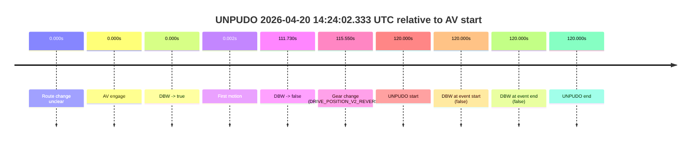
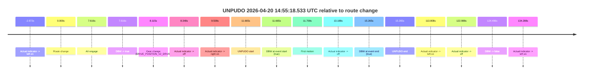
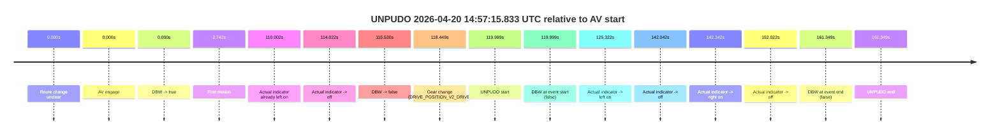
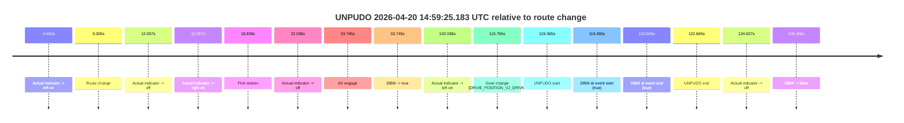
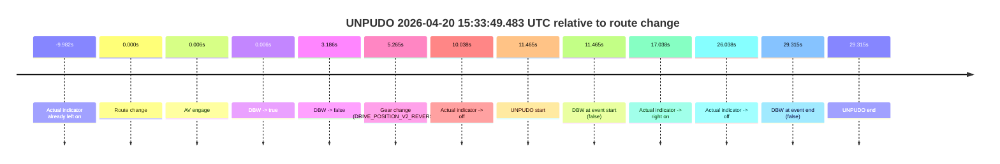

# Run Report: fme20032/2026-04-20--14-11-26--gen2-av-998375f8-34dd-4d1c-841c-c276c19eba04

| Field | Value |
|---|---|
| Run ID | `fme20032/2026-04-20--14-11-26--gen2-av-998375f8-34dd-4d1c-841c-c276c19eba04` |
| Date | `2026-04-20` |
| Model(s) | `eel-teal-outspoken` |
| Author | `zak` |
| Event count | `5` |

## unpudo 2026-04-20 14:24:02.333 UTC

| Field | Value |
|---|---|
| Model | `eel-teal-outspoken` |
| Author | `zak` |
| Run ID | `fme20032/2026-04-20--14-11-26--gen2-av-998375f8-34dd-4d1c-841c-c276c19eba04` |
| Date | `2026-04-20` |
| Time (UTC) | `14:24:02.333` |
| Event type | `unpudo` |
| Disengagement type | `none observed` |
| Route change | `unclear` |
| Console | [run](https://console.sso.wayve.ai/run/fme20032/2026-04-20--14-11-26--gen2-av-998375f8-34dd-4d1c-841c-c276c19eba04?id=&time-unixus=1776695042333296) |
| Foxglove | [segment](https://app.foxglove.dev/wayve-on-prem/p/prj_0dX18KZdVHg1fmmI/view?ds=foxglove-stream&ds.deviceName=fme20032&ds.start=2026-04-20T14%3A21%3A52.333792Z&ds.end=2026-04-20T14%3A24%3A12.333296Z&layoutId=lay_0e7VD4WIKDQGU73Y&time=2026-04-20T14%3A24%3A02.333296Z) |

### Event card: fail

- Fail: the credited unpudo does not stay AV-owned. The event window starts with DBW false, and the maneuver outcome lands outside a clean AV-owned segment.

| Event | Time (UTC) | Delta from AV start |
|---|---:|---:|
| Route change unclear | 2026-04-20 14:22:02.333 | `0.000s` |
| AV engage | 2026-04-20 14:22:02.333 | `0.000s` |
| DBW -> true | 2026-04-20 14:22:02.333 | `0.000s` |
| First motion | 2026-04-20 14:22:02.335 | `0.002s` |
| DBW -> false | 2026-04-20 14:23:54.063 | `111.730s` |
| Gear change (DRIVE_POSITION_V2_REVERSE) | 2026-04-20 14:23:57.883 | `115.550s` |
| UNPUDO start | 2026-04-20 14:24:02.333 | `120.000s` |
| DBW at event start (false) | 2026-04-20 14:24:02.333 | `120.000s` |
| DBW at event end (false) | 2026-04-20 14:24:02.333 | `120.000s` |
| UNPUDO end | 2026-04-20 14:24:02.333 | `120.000s` |

| Metric | Value |
|---|---|
| Outcome | `fail` |
| Effective failure type | `not_av_owned` |
| Route change status | `unclear` |
| DBW at event start | `false` |
| DBW at event end | `false` |
| Predicted gear at AV start | `DRIVE_POSITION_V2_DRIVE` |
| Actual gear at AV start | `DRIVE_POSITION_V2_DRIVE` |
| Predicted gear at event start | `DRIVE_POSITION_V2_REVERSE` |
| Actual gear at event start | `DRIVE_POSITION_V2_REVERSE` |
| Planned indicator direction | `INDICATORS_STATE_V2_OFF` |
| Controller indicator direction | `INDICATORS_STATE_V2_OFF` |
| Actual indicator direction | `INDICATORS_STATE_V2_OFF` |
| Actual indicator at maneuver end | `INDICATORS_STATE_V2_OFF` |
| Driver accel help in AV | `false` |
| Driver accel help timestamp | `n/a` |
| Max accel pedal pct in AV | `0.0%` |
| Max brake pedal pct in AV | `23.2%` |
| Max speed mps in AV | `7.956` |
| Success timing baseline | `AV start` |
| Route -> AV | `n/a` |
| AV -> event start | `120.000s` |
| AV -> first motion | `0.002s` |
| Success baseline -> event start | `120.000s` |
| Success baseline -> first motion | `0.002s` |
| AV duration before disengagement | `111.730s` |
| Trajectory waypoint count | `38` |
| Driving-plan step count | `11` |

The scored portion starts from the AV-owned window, not from the pre-AV setup. Route-change search in the stopped pre-event segment was `unclear`, with the baseline therefore set to AV start. At the event anchor the model predicts `DRIVE_POSITION_V2_REVERSE` and the actual gear is `DRIVE_POSITION_V2_REVERSE`. The effective model outcome is `fail` because `not_av_owned.`

### Resolution

| Field | Value |
|---|---|
| Final outcome | `fail` |
| Do we agree with this label? | `yes` |
| Source disengagement type | `none observed` |
| Resolved effective failure type | `not_av_owned` |
| Confidence | `medium` |

## unpudo 2026-04-20 14:55:18.533 UTC

| Field | Value |
|---|---|
| Model | `eel-teal-outspoken` |
| Author | `zak` |
| Run ID | `fme20032/2026-04-20--14-11-26--gen2-av-998375f8-34dd-4d1c-841c-c276c19eba04` |
| Date | `2026-04-20` |
| Time (UTC) | `14:55:18.533` |
| Event type | `unpudo` |
| Disengagement type | `none observed` |
| Route change | `found` |
| Console | [run](https://console.sso.wayve.ai/run/fme20032/2026-04-20--14-11-26--gen2-av-998375f8-34dd-4d1c-841c-c276c19eba04?id=&time-unixus=1776696918533319) |
| Foxglove | [segment](https://app.foxglove.dev/wayve-on-prem/p/prj_0dX18KZdVHg1fmmI/view?ds=foxglove-stream&ds.deviceName=fme20032&ds.start=2026-04-20T14%3A54%3A56.868280Z&ds.end=2026-04-20T14%3A57%3A21.363978Z&layoutId=lay_0e7VD4WIKDQGU73Y&time=2026-04-20T14%3A55%3A18.533319Z) |

### Event card: pass

- Pass: AV owns the credited unpudo from route change through the official unpudo window, the gear state is aligned at the anchor, and the vehicle moves without driver accelerator help in AV.

| Event | Time (UTC) | Delta from route change |
|---|---:|---:|
| Actual indicator -> left on | 2026-04-20 14:55:03.896 | `-2.972s` |
| Route change | 2026-04-20 14:55:06.868 | `0.000s` |
| AV engage | 2026-04-20 14:55:14.483 | `7.616s` |
| DBW -> true | 2026-04-20 14:55:14.483 | `7.616s` |
| Gear change (DRIVE_POSITION_V2_DRIVE) | 2026-04-20 14:55:14.983 | `8.115s` |
| Actual indicator -> off | 2026-04-20 14:55:15.215 | `8.348s` |
| Actual indicator -> right on | 2026-04-20 14:55:16.376 | `9.508s` |
| UNPUDO start | 2026-04-20 14:55:18.533 | `11.665s` |
| DBW at event start (true) | 2026-04-20 14:55:18.533 | `11.665s` |
| First motion | 2026-04-20 14:55:18.576 | `11.708s` |
| Actual indicator -> off | 2026-04-20 14:55:20.055 | `13.188s` |
| DBW at event end (true) | 2026-04-20 14:55:22.133 | `15.265s` |
| UNPUDO end | 2026-04-20 14:55:22.133 | `15.265s` |
| Actual indicator -> left on | 2026-04-20 14:57:00.675 | `113.808s` |
| Actual indicator -> off | 2026-04-20 14:57:09.855 | `122.988s` |
| DBW -> false | 2026-04-20 14:57:11.363 | `124.496s` |
| Actual indicator -> left on | 2026-04-20 14:57:21.156 | `134.288s` |

| Metric | Value |
|---|---|
| Outcome | `pass` |
| Effective failure type | `none` |
| Route change status | `found` |
| DBW at event start | `true` |
| DBW at event end | `true` |
| Predicted gear at AV start | `DRIVE_POSITION_V2_DRIVE` |
| Actual gear at AV start | `DRIVE_POSITION_V2_PARK` |
| Predicted gear at event start | `DRIVE_POSITION_V2_DRIVE` |
| Actual gear at event start | `DRIVE_POSITION_V2_DRIVE` |
| Planned indicator direction | `INDICATORS_STATE_V2_RIGHT_ON` |
| Controller indicator direction | `INDICATORS_STATE_V2_RIGHT_ON` |
| Actual indicator direction | `INDICATORS_STATE_V2_RIGHT_ON` |
| Actual indicator at maneuver end | `INDICATORS_STATE_V2_OFF` |
| Driver accel help in AV | `false` |
| Driver accel help timestamp | `n/a` |
| Max accel pedal pct in AV | `0.0%` |
| Max brake pedal pct in AV | `8.0%` |
| Max speed mps in AV | `5.325` |
| Success timing baseline | `route change` |
| Route -> AV | `7.616s` |
| AV -> event start | `4.049s` |
| AV -> first motion | `4.092s` |
| Success baseline -> event start | `11.665s` |
| Success baseline -> first motion | `11.708s` |
| AV duration before disengagement | `116.880s` |
| Trajectory waypoint count | `38` |
| Driving-plan step count | `11` |

The scored portion starts from the AV-owned window, not from the pre-AV setup. Route-change search in the stopped pre-event segment was `found`, with the baseline therefore set to route change. At the event anchor the model predicts `DRIVE_POSITION_V2_DRIVE` and the actual gear is `DRIVE_POSITION_V2_DRIVE`. The effective model outcome is `pass` because `the credited unpudo stays AV-owned through the official unpudo window.`

### Resolution

| Field | Value |
|---|---|
| Final outcome | `pass` |
| Do we agree with this label? | `yes` |
| Source disengagement type | `none observed` |
| Resolved effective failure type | `none` |
| Confidence | `high` |

## unpudo 2026-04-20 14:57:15.833 UTC

| Field | Value |
|---|---|
| Model | `eel-teal-outspoken` |
| Author | `zak` |
| Run ID | `fme20032/2026-04-20--14-11-26--gen2-av-998375f8-34dd-4d1c-841c-c276c19eba04` |
| Date | `2026-04-20` |
| Time (UTC) | `14:57:15.833` |
| Event type | `unpudo` |
| Disengagement type | `none observed` |
| Route change | `unclear` |
| Console | [run](https://console.sso.wayve.ai/run/fme20032/2026-04-20--14-11-26--gen2-av-998375f8-34dd-4d1c-841c-c276c19eba04?id=&time-unixus=1776697035833301) |
| Foxglove | [segment](https://app.foxglove.dev/wayve-on-prem/p/prj_0dX18KZdVHg1fmmI/view?ds=foxglove-stream&ds.deviceName=fme20032&ds.start=2026-04-20T14%3A55%3A05.834101Z&ds.end=2026-04-20T14%3A58%3A07.183310Z&layoutId=lay_0e7VD4WIKDQGU73Y&time=2026-04-20T14%3A57%3A15.833301Z) |

### Event card: fail

- Fail: the credited unpudo does not stay AV-owned. The event window starts with DBW false, and the maneuver outcome lands outside a clean AV-owned segment.

| Event | Time (UTC) | Delta from AV start |
|---|---:|---:|
| Route change unclear | 2026-04-20 14:55:15.834 | `0.000s` |
| AV engage | 2026-04-20 14:55:15.834 | `0.000s` |
| DBW -> true | 2026-04-20 14:55:15.834 | `0.000s` |
| First motion | 2026-04-20 14:55:18.576 | `2.742s` |
| Actual indicator already left on | 2026-04-20 14:57:05.836 | `110.002s` |
| Actual indicator -> off | 2026-04-20 14:57:09.855 | `114.022s` |
| DBW -> false | 2026-04-20 14:57:11.363 | `115.530s` |
| Gear change (DRIVE_POSITION_V2_DRIVE) | 2026-04-20 14:57:14.283 | `118.449s` |
| UNPUDO start | 2026-04-20 14:57:15.833 | `119.999s` |
| DBW at event start (false) | 2026-04-20 14:57:15.833 | `119.999s` |
| Actual indicator -> left on | 2026-04-20 14:57:21.156 | `125.322s` |
| Actual indicator -> off | 2026-04-20 14:57:37.875 | `142.042s` |
| Actual indicator -> right on | 2026-04-20 14:57:38.175 | `142.342s` |
| Actual indicator -> off | 2026-04-20 14:57:47.856 | `152.022s` |
| DBW at event end (false) | 2026-04-20 14:57:57.183 | `161.349s` |
| UNPUDO end | 2026-04-20 14:57:57.183 | `161.349s` |

| Metric | Value |
|---|---|
| Outcome | `fail` |
| Effective failure type | `not_av_owned` |
| Route change status | `unclear` |
| DBW at event start | `false` |
| DBW at event end | `false` |
| Predicted gear at AV start | `DRIVE_POSITION_V2_DRIVE` |
| Actual gear at AV start | `DRIVE_POSITION_V2_DRIVE` |
| Predicted gear at event start | `DRIVE_POSITION_V2_DRIVE` |
| Actual gear at event start | `DRIVE_POSITION_V2_DRIVE` |
| Planned indicator direction | `INDICATORS_STATE_V2_OFF` |
| Controller indicator direction | `INDICATORS_STATE_V2_OFF` |
| Actual indicator direction | `INDICATORS_STATE_V2_OFF` |
| Actual indicator at maneuver end | `INDICATORS_STATE_V2_OFF` |
| Driver accel help in AV | `false` |
| Driver accel help timestamp | `n/a` |
| Max accel pedal pct in AV | `0.0%` |
| Max brake pedal pct in AV | `16.4%` |
| Max speed mps in AV | `8.228` |
| Success timing baseline | `AV start` |
| Route -> AV | `n/a` |
| AV -> event start | `119.999s` |
| AV -> first motion | `2.742s` |
| Success baseline -> event start | `119.999s` |
| Success baseline -> first motion | `2.742s` |
| AV duration before disengagement | `115.530s` |
| Trajectory waypoint count | `38` |
| Driving-plan step count | `11` |

The scored portion starts from the AV-owned window, not from the pre-AV setup. Route-change search in the stopped pre-event segment was `unclear`, with the baseline therefore set to AV start. At the event anchor the model predicts `DRIVE_POSITION_V2_DRIVE` and the actual gear is `DRIVE_POSITION_V2_DRIVE`. The effective model outcome is `fail` because `not_av_owned.`

### Resolution

| Field | Value |
|---|---|
| Final outcome | `fail` |
| Do we agree with this label? | `yes` |
| Source disengagement type | `none observed` |
| Resolved effective failure type | `not_av_owned` |
| Confidence | `medium` |

## unpudo 2026-04-20 14:59:25.183 UTC

| Field | Value |
|---|---|
| Model | `eel-teal-outspoken` |
| Author | `zak` |
| Run ID | `fme20032/2026-04-20--14-11-26--gen2-av-998375f8-34dd-4d1c-841c-c276c19eba04` |
| Date | `2026-04-20` |
| Time (UTC) | `14:59:25.183` |
| Event type | `unpudo` |
| Disengagement type | `none observed` |
| Route change | `found` |
| Console | [run](https://console.sso.wayve.ai/run/fme20032/2026-04-20--14-11-26--gen2-av-998375f8-34dd-4d1c-841c-c276c19eba04?id=&time-unixus=1776697165183312) |
| Foxglove | [segment](https://app.foxglove.dev/wayve-on-prem/p/prj_0dX18KZdVHg1fmmI/view?ds=foxglove-stream&ds.deviceName=fme20032&ds.start=2026-04-20T14%3A57%3A15.818420Z&ds.end=2026-04-20T15%3A01%3A01.223922Z&layoutId=lay_0e7VD4WIKDQGU73Y&time=2026-04-20T14%3A59%3A25.183312Z) |

### Event card: pass

- Pass: AV owns the credited unpudo from route change through the official unpudo window, the gear state is aligned at the anchor, and the vehicle moves without driver accelerator help in AV.

| Event | Time (UTC) | Delta from route change |
|---|---:|---:|
| Actual indicator -> left on | 2026-04-20 14:57:21.156 | `-4.662s` |
| Route change | 2026-04-20 14:57:25.818 | `0.000s` |
| Actual indicator -> off | 2026-04-20 14:57:37.875 | `12.057s` |
| Actual indicator -> right on | 2026-04-20 14:57:38.175 | `12.357s` |
| First motion | 2026-04-20 14:57:44.656 | `18.838s` |
| Actual indicator -> off | 2026-04-20 14:57:47.856 | `22.038s` |
| AV engage | 2026-04-20 14:57:59.563 | `33.745s` |
| DBW -> true | 2026-04-20 14:57:59.563 | `33.745s` |
| Actual indicator -> left on | 2026-04-20 14:59:07.855 | `102.038s` |
| Gear change (DRIVE_POSITION_V2_DRIVE) | 2026-04-20 14:59:21.583 | `115.765s` |
| UNPUDO start | 2026-04-20 14:59:25.183 | `119.365s` |
| DBW at event start (true) | 2026-04-20 14:59:25.183 | `119.365s` |
| DBW at event end (true) | 2026-04-20 14:59:28.483 | `122.665s` |
| UNPUDO end | 2026-04-20 14:59:28.483 | `122.665s` |
| Actual indicator -> off | 2026-04-20 14:59:30.455 | `124.637s` |
| DBW -> false | 2026-04-20 15:00:51.223 | `205.406s` |

| Metric | Value |
|---|---|
| Outcome | `pass` |
| Effective failure type | `none` |
| Route change status | `found` |
| DBW at event start | `true` |
| DBW at event end | `true` |
| Predicted gear at AV start | `DRIVE_POSITION_V2_DRIVE` |
| Actual gear at AV start | `DRIVE_POSITION_V2_DRIVE` |
| Predicted gear at event start | `DRIVE_POSITION_V2_DRIVE` |
| Actual gear at event start | `DRIVE_POSITION_V2_DRIVE` |
| Planned indicator direction | `INDICATORS_STATE_V2_RIGHT_ON` |
| Controller indicator direction | `INDICATORS_STATE_V2_RIGHT_ON` |
| Actual indicator direction | `INDICATORS_STATE_V2_LEFT_ON` |
| Actual indicator at maneuver end | `INDICATORS_STATE_V2_LEFT_ON` |
| Driver accel help in AV | `false` |
| Driver accel help timestamp | `n/a` |
| Max accel pedal pct in AV | `0.0%` |
| Max brake pedal pct in AV | `18.6%` |
| Max speed mps in AV | `8.278` |
| Success timing baseline | `route change` |
| Route -> AV | `33.745s` |
| AV -> event start | `85.620s` |
| AV -> first motion | `-14.908s` |
| Success baseline -> event start | `119.365s` |
| Success baseline -> first motion | `18.838s` |
| AV duration before disengagement | `171.660s` |
| Trajectory waypoint count | `37` |
| Driving-plan step count | `11` |

The scored portion starts from the AV-owned window, not from the pre-AV setup. Route-change search in the stopped pre-event segment was `found`, with the baseline therefore set to route change. At the event anchor the model predicts `DRIVE_POSITION_V2_DRIVE` and the actual gear is `DRIVE_POSITION_V2_DRIVE`. The effective model outcome is `pass` because `the credited unpudo stays AV-owned through the official unpudo window.`

### Resolution

| Field | Value |
|---|---|
| Final outcome | `pass` |
| Do we agree with this label? | `yes` |
| Source disengagement type | `none observed` |
| Resolved effective failure type | `none` |
| Confidence | `high` |

## unpudo 2026-04-20 15:33:49.483 UTC

| Field | Value |
|---|---|
| Model | `eel-teal-outspoken` |
| Author | `zak` |
| Run ID | `fme20032/2026-04-20--14-11-26--gen2-av-998375f8-34dd-4d1c-841c-c276c19eba04` |
| Date | `2026-04-20` |
| Time (UTC) | `15:33:49.483` |
| Event type | `unpudo` |
| Disengagement type | `none observed` |
| Route change | `found` |
| Console | [run](https://console.sso.wayve.ai/run/fme20032/2026-04-20--14-11-26--gen2-av-998375f8-34dd-4d1c-841c-c276c19eba04?id=&time-unixus=1776699229483313) |
| Foxglove | [segment](https://app.foxglove.dev/wayve-on-prem/p/prj_0dX18KZdVHg1fmmI/view?ds=foxglove-stream&ds.deviceName=fme20032&ds.start=2026-04-20T15%3A33%3A28.018350Z&ds.end=2026-04-20T15%3A34%3A17.333312Z&layoutId=lay_0e7VD4WIKDQGU73Y&time=2026-04-20T15%3A33%3A49.483313Z) |

### Event card: fail

- Fail: the credited unpudo does not stay AV-owned. The event window starts with DBW false, and the maneuver outcome lands outside a clean AV-owned segment.

| Event | Time (UTC) | Delta from route change |
|---|---:|---:|
| Actual indicator already left on | 2026-04-20 15:33:28.036 | `-9.982s` |
| Route change | 2026-04-20 15:33:38.018 | `0.000s` |
| AV engage | 2026-04-20 15:33:38.023 | `0.006s` |
| DBW -> true | 2026-04-20 15:33:38.023 | `0.006s` |
| DBW -> false | 2026-04-20 15:33:41.204 | `3.186s` |
| Gear change (DRIVE_POSITION_V2_REVERSE) | 2026-04-20 15:33:43.283 | `5.265s` |
| Actual indicator -> off | 2026-04-20 15:33:48.055 | `10.038s` |
| UNPUDO start | 2026-04-20 15:33:49.483 | `11.465s` |
| DBW at event start (false) | 2026-04-20 15:33:49.483 | `11.465s` |
| Actual indicator -> right on | 2026-04-20 15:33:55.055 | `17.038s` |
| Actual indicator -> off | 2026-04-20 15:34:04.056 | `26.038s` |
| DBW at event end (false) | 2026-04-20 15:34:07.333 | `29.315s` |
| UNPUDO end | 2026-04-20 15:34:07.333 | `29.315s` |

| Metric | Value |
|---|---|
| Outcome | `fail` |
| Effective failure type | `not_av_owned` |
| Route change status | `found` |
| DBW at event start | `false` |
| DBW at event end | `false` |
| Predicted gear at AV start | `DRIVE_POSITION_V2_PARK` |
| Actual gear at AV start | `DRIVE_POSITION_V2_PARK` |
| Predicted gear at event start | `DRIVE_POSITION_V2_REVERSE` |
| Actual gear at event start | `DRIVE_POSITION_V2_REVERSE` |
| Planned indicator direction | `INDICATORS_STATE_V2_OFF` |
| Controller indicator direction | `INDICATORS_STATE_V2_OFF` |
| Actual indicator direction | `INDICATORS_STATE_V2_OFF` |
| Actual indicator at maneuver end | `INDICATORS_STATE_V2_OFF` |
| Driver accel help in AV | `false` |
| Driver accel help timestamp | `n/a` |
| Max accel pedal pct in AV | `0.0%` |
| Max brake pedal pct in AV | `9.1%` |
| Max speed mps in AV | `0.000` |
| Success timing baseline | `route change` |
| Route -> AV | `0.006s` |
| AV -> event start | `11.459s` |
| AV -> first motion | `n/a` |
| Success baseline -> event start | `11.465s` |
| Success baseline -> first motion | `n/a` |
| AV duration before disengagement | `3.180s` |
| Trajectory waypoint count | `37` |
| Driving-plan step count | `11` |

The scored portion starts from the AV-owned window, not from the pre-AV setup. Route-change search in the stopped pre-event segment was `found`, with the baseline therefore set to route change. At the event anchor the model predicts `DRIVE_POSITION_V2_REVERSE` and the actual gear is `DRIVE_POSITION_V2_REVERSE`. The effective model outcome is `fail` because `not_av_owned.`

### Resolution

| Field | Value |
|---|---|
| Final outcome | `fail` |
| Do we agree with this label? | `yes` |
| Source disengagement type | `none observed` |
| Resolved effective failure type | `not_av_owned` |
| Confidence | `high` |
