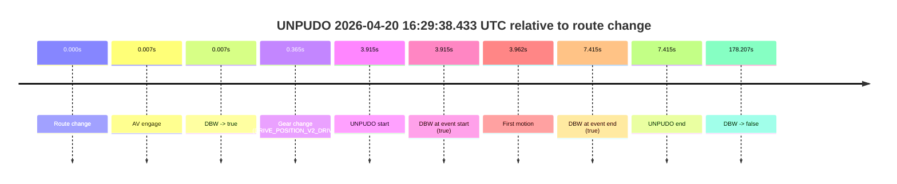
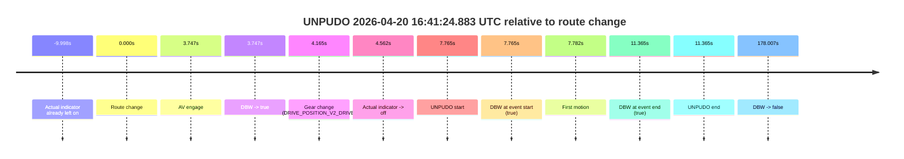
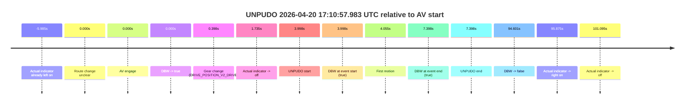
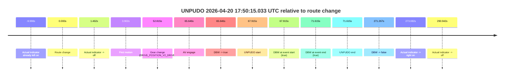
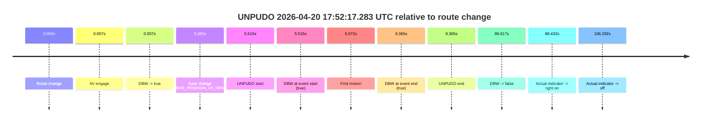
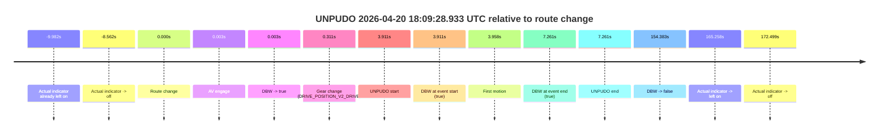
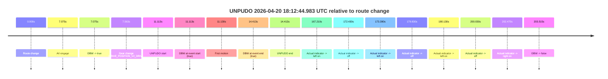

# Run Report: fme20032/2026-04-20--16-03-02--gen2-av-649d4bc0-cb26-4c8d-8386-f05e4e8a1f7e

| Field | Value |
|---|---|
| Run ID | `fme20032/2026-04-20--16-03-02--gen2-av-649d4bc0-cb26-4c8d-8386-f05e4e8a1f7e` |
| Date | `2026-04-20` |
| Model(s) | `eel-teal-outspoken` |
| Author | `zak` |
| Event count | `8` |

## unpudo 2026-04-20 16:29:38.433 UTC

| Field | Value |
|---|---|
| Model | `eel-teal-outspoken` |
| Author | `zak` |
| Run ID | `fme20032/2026-04-20--16-03-02--gen2-av-649d4bc0-cb26-4c8d-8386-f05e4e8a1f7e` |
| Date | `2026-04-20` |
| Time (UTC) | `16:29:38.433` |
| Event type | `unpudo` |
| Disengagement type | `none observed` |
| Route change | `found` |
| Console | [run](https://console.sso.wayve.ai/run/fme20032/2026-04-20--16-03-02--gen2-av-649d4bc0-cb26-4c8d-8386-f05e4e8a1f7e?id=&time-unixus=1776702578433307) |
| Foxglove | [segment](https://app.foxglove.dev/wayve-on-prem/p/prj_0dX18KZdVHg1fmmI/view?ds=foxglove-stream&ds.deviceName=fme20032&ds.start=2026-04-20T16%3A29%3A24.518442Z&ds.end=2026-04-20T16%3A32%3A42.725686Z&layoutId=lay_0e7VD4WIKDQGU73Y&time=2026-04-20T16%3A29%3A38.433307Z) |

### Event card: pass

- Pass: AV owns the credited unpudo from route change through the official unpudo window, the gear state is aligned at the anchor, and the vehicle moves without driver accelerator help in AV.

| Event | Time (UTC) | Delta from route change |
|---|---:|---:|
| Route change | 2026-04-20 16:29:34.518 | `0.000s` |
| AV engage | 2026-04-20 16:29:34.525 | `0.007s` |
| DBW -> true | 2026-04-20 16:29:34.525 | `0.007s` |
| Gear change (DRIVE_POSITION_V2_DRIVE) | 2026-04-20 16:29:34.883 | `0.365s` |
| UNPUDO start | 2026-04-20 16:29:38.433 | `3.915s` |
| DBW at event start (true) | 2026-04-20 16:29:38.433 | `3.915s` |
| First motion | 2026-04-20 16:29:38.480 | `3.962s` |
| DBW at event end (true) | 2026-04-20 16:29:41.933 | `7.415s` |
| UNPUDO end | 2026-04-20 16:29:41.933 | `7.415s` |
| DBW -> false | 2026-04-20 16:32:32.725 | `178.207s` |

| Metric | Value |
|---|---|
| Outcome | `pass` |
| Effective failure type | `none` |
| Route change status | `found` |
| DBW at event start | `true` |
| DBW at event end | `true` |
| Predicted gear at AV start | `DRIVE_POSITION_V2_PARK` |
| Actual gear at AV start | `DRIVE_POSITION_V2_PARK` |
| Predicted gear at event start | `DRIVE_POSITION_V2_DRIVE` |
| Actual gear at event start | `DRIVE_POSITION_V2_DRIVE` |
| Planned indicator direction | `INDICATORS_STATE_V2_OFF` |
| Controller indicator direction | `INDICATORS_STATE_V2_OFF` |
| Actual indicator direction | `INDICATORS_STATE_V2_OFF` |
| Actual indicator at maneuver end | `INDICATORS_STATE_V2_OFF` |
| Driver accel help in AV | `false` |
| Driver accel help timestamp | `n/a` |
| Max accel pedal pct in AV | `0.0%` |
| Max brake pedal pct in AV | `8.2%` |
| Max speed mps in AV | `4.636` |
| Success timing baseline | `route change` |
| Route -> AV | `0.007s` |
| AV -> event start | `3.908s` |
| AV -> first motion | `3.955s` |
| Success baseline -> event start | `3.915s` |
| Success baseline -> first motion | `3.962s` |
| AV duration before disengagement | `178.200s` |
| Trajectory waypoint count | `37` |
| Driving-plan step count | `11` |

The scored portion starts from the AV-owned window, not from the pre-AV setup. Route-change search in the stopped pre-event segment was `found`, with the baseline therefore set to route change. At the event anchor the model predicts `DRIVE_POSITION_V2_DRIVE` and the actual gear is `DRIVE_POSITION_V2_DRIVE`. The effective model outcome is `pass` because `the credited unpudo stays AV-owned through the official unpudo window.`

### Resolution

| Field | Value |
|---|---|
| Final outcome | `pass` |
| Do we agree with this label? | `yes` |
| Source disengagement type | `none observed` |
| Resolved effective failure type | `none` |
| Confidence | `high` |

## unpudo 2026-04-20 16:41:24.883 UTC

| Field | Value |
|---|---|
| Model | `eel-teal-outspoken` |
| Author | `zak` |
| Run ID | `fme20032/2026-04-20--16-03-02--gen2-av-649d4bc0-cb26-4c8d-8386-f05e4e8a1f7e` |
| Date | `2026-04-20` |
| Time (UTC) | `16:41:24.883` |
| Event type | `unpudo` |
| Disengagement type | `none observed` |
| Route change | `found` |
| Console | [run](https://console.sso.wayve.ai/run/fme20032/2026-04-20--16-03-02--gen2-av-649d4bc0-cb26-4c8d-8386-f05e4e8a1f7e?id=&time-unixus=1776703284883302) |
| Foxglove | [segment](https://app.foxglove.dev/wayve-on-prem/p/prj_0dX18KZdVHg1fmmI/view?ds=foxglove-stream&ds.deviceName=fme20032&ds.start=2026-04-20T16%3A41%3A07.118273Z&ds.end=2026-04-20T16%3A44%3A25.125272Z&layoutId=lay_0e7VD4WIKDQGU73Y&time=2026-04-20T16%3A41%3A24.883302Z) |

### Event card: pass

- Pass: AV owns the credited unpudo from route change through the official unpudo window, the gear state is aligned at the anchor, and the vehicle moves without driver accelerator help in AV.

| Event | Time (UTC) | Delta from route change |
|---|---:|---:|
| Actual indicator already left on | 2026-04-20 16:41:07.120 | `-9.998s` |
| Route change | 2026-04-20 16:41:17.118 | `0.000s` |
| AV engage | 2026-04-20 16:41:20.865 | `3.747s` |
| DBW -> true | 2026-04-20 16:41:20.865 | `3.747s` |
| Gear change (DRIVE_POSITION_V2_DRIVE) | 2026-04-20 16:41:21.283 | `4.165s` |
| Actual indicator -> off | 2026-04-20 16:41:21.680 | `4.562s` |
| UNPUDO start | 2026-04-20 16:41:24.883 | `7.765s` |
| DBW at event start (true) | 2026-04-20 16:41:24.883 | `7.765s` |
| First motion | 2026-04-20 16:41:24.900 | `7.782s` |
| DBW at event end (true) | 2026-04-20 16:41:28.483 | `11.365s` |
| UNPUDO end | 2026-04-20 16:41:28.483 | `11.365s` |
| DBW -> false | 2026-04-20 16:44:15.125 | `178.007s` |

| Metric | Value |
|---|---|
| Outcome | `pass` |
| Effective failure type | `none` |
| Route change status | `found` |
| DBW at event start | `true` |
| DBW at event end | `true` |
| Predicted gear at AV start | `DRIVE_POSITION_V2_DRIVE` |
| Actual gear at AV start | `DRIVE_POSITION_V2_PARK` |
| Predicted gear at event start | `DRIVE_POSITION_V2_DRIVE` |
| Actual gear at event start | `DRIVE_POSITION_V2_DRIVE` |
| Planned indicator direction | `INDICATORS_STATE_V2_RIGHT_ON` |
| Controller indicator direction | `INDICATORS_STATE_V2_RIGHT_ON` |
| Actual indicator direction | `INDICATORS_STATE_V2_OFF` |
| Actual indicator at maneuver end | `INDICATORS_STATE_V2_OFF` |
| Driver accel help in AV | `false` |
| Driver accel help timestamp | `n/a` |
| Max accel pedal pct in AV | `0.0%` |
| Max brake pedal pct in AV | `8.6%` |
| Max speed mps in AV | `3.750` |
| Success timing baseline | `route change` |
| Route -> AV | `3.747s` |
| AV -> event start | `4.018s` |
| AV -> first motion | `4.035s` |
| Success baseline -> event start | `7.765s` |
| Success baseline -> first motion | `7.782s` |
| AV duration before disengagement | `174.260s` |
| Trajectory waypoint count | `36` |
| Driving-plan step count | `11` |

The scored portion starts from the AV-owned window, not from the pre-AV setup. Route-change search in the stopped pre-event segment was `found`, with the baseline therefore set to route change. At the event anchor the model predicts `DRIVE_POSITION_V2_DRIVE` and the actual gear is `DRIVE_POSITION_V2_DRIVE`. The effective model outcome is `pass` because `the credited unpudo stays AV-owned through the official unpudo window.`

### Resolution

| Field | Value |
|---|---|
| Final outcome | `pass` |
| Do we agree with this label? | `yes` |
| Source disengagement type | `none observed` |
| Resolved effective failure type | `none` |
| Confidence | `high` |

## unpudo 2026-04-20 17:10:57.983 UTC

| Field | Value |
|---|---|
| Model | `eel-teal-outspoken` |
| Author | `zak` |
| Run ID | `fme20032/2026-04-20--16-03-02--gen2-av-649d4bc0-cb26-4c8d-8386-f05e4e8a1f7e` |
| Date | `2026-04-20` |
| Time (UTC) | `17:10:57.983` |
| Event type | `unpudo` |
| Disengagement type | `none observed` |
| Route change | `unclear` |
| Console | [run](https://console.sso.wayve.ai/run/fme20032/2026-04-20--16-03-02--gen2-av-649d4bc0-cb26-4c8d-8386-f05e4e8a1f7e?id=&time-unixus=1776705057983313) |
| Foxglove | [segment](https://app.foxglove.dev/wayve-on-prem/p/prj_0dX18KZdVHg1fmmI/view?ds=foxglove-stream&ds.deviceName=fme20032&ds.start=2026-04-20T17%3A10%3A43.985241Z&ds.end=2026-04-20T17%3A12%3A38.586237Z&layoutId=lay_0e7VD4WIKDQGU73Y&time=2026-04-20T17%3A10%3A57.983313Z) |

### Event card: pass

- Pass: AV owns the credited unpudo from route change through the official unpudo window, the gear state is aligned at the anchor, and the vehicle moves without driver accelerator help in AV.

| Event | Time (UTC) | Delta from AV start |
|---|---:|---:|
| Actual indicator already left on | 2026-04-20 17:10:48.000 | `-5.985s` |
| Route change unclear | 2026-04-20 17:10:53.985 | `0.000s` |
| AV engage | 2026-04-20 17:10:53.985 | `0.000s` |
| DBW -> true | 2026-04-20 17:10:53.985 | `0.000s` |
| Gear change (DRIVE_POSITION_V2_DRIVE) | 2026-04-20 17:10:54.383 | `0.398s` |
| Actual indicator -> off | 2026-04-20 17:10:55.720 | `1.735s` |
| UNPUDO start | 2026-04-20 17:10:57.983 | `3.998s` |
| DBW at event start (true) | 2026-04-20 17:10:57.983 | `3.998s` |
| First motion | 2026-04-20 17:10:58.040 | `4.055s` |
| DBW at event end (true) | 2026-04-20 17:11:01.383 | `7.398s` |
| UNPUDO end | 2026-04-20 17:11:01.383 | `7.398s` |
| DBW -> false | 2026-04-20 17:12:28.586 | `94.601s` |
| Actual indicator -> right on | 2026-04-20 17:12:29.860 | `95.875s` |
| Actual indicator -> off | 2026-04-20 17:12:35.080 | `101.095s` |

| Metric | Value |
|---|---|
| Outcome | `pass` |
| Effective failure type | `none` |
| Route change status | `unclear` |
| DBW at event start | `true` |
| DBW at event end | `true` |
| Predicted gear at AV start | `DRIVE_POSITION_V2_DRIVE` |
| Actual gear at AV start | `DRIVE_POSITION_V2_PARK` |
| Predicted gear at event start | `DRIVE_POSITION_V2_DRIVE` |
| Actual gear at event start | `DRIVE_POSITION_V2_DRIVE` |
| Planned indicator direction | `INDICATORS_STATE_V2_RIGHT_ON` |
| Controller indicator direction | `INDICATORS_STATE_V2_RIGHT_ON` |
| Actual indicator direction | `INDICATORS_STATE_V2_OFF` |
| Actual indicator at maneuver end | `INDICATORS_STATE_V2_OFF` |
| Driver accel help in AV | `false` |
| Driver accel help timestamp | `n/a` |
| Max accel pedal pct in AV | `0.0%` |
| Max brake pedal pct in AV | `8.8%` |
| Max speed mps in AV | `5.367` |
| Success timing baseline | `AV start` |
| Route -> AV | `n/a` |
| AV -> event start | `3.998s` |
| AV -> first motion | `4.055s` |
| Success baseline -> event start | `3.998s` |
| Success baseline -> first motion | `4.055s` |
| AV duration before disengagement | `94.601s` |
| Trajectory waypoint count | `36` |
| Driving-plan step count | `11` |

The scored portion starts from the AV-owned window, not from the pre-AV setup. Route-change search in the stopped pre-event segment was `unclear`, with the baseline therefore set to AV start. At the event anchor the model predicts `DRIVE_POSITION_V2_DRIVE` and the actual gear is `DRIVE_POSITION_V2_DRIVE`. The effective model outcome is `pass` because `the credited unpudo stays AV-owned through the official unpudo window.`

### Resolution

| Field | Value |
|---|---|
| Final outcome | `pass` |
| Do we agree with this label? | `yes` |
| Source disengagement type | `none observed` |
| Resolved effective failure type | `none` |
| Confidence | `medium` |

## unpudo 2026-04-20 17:49:10.983 UTC

| Field | Value |
|---|---|
| Model | `eel-teal-outspoken` |
| Author | `zak` |
| Run ID | `fme20032/2026-04-20--16-03-02--gen2-av-649d4bc0-cb26-4c8d-8386-f05e4e8a1f7e` |
| Date | `2026-04-20` |
| Time (UTC) | `17:49:10.983` |
| Event type | `unpudo` |
| Disengagement type | `none observed` |
| Route change | `found` |
| Console | [run](https://console.sso.wayve.ai/run/fme20032/2026-04-20--16-03-02--gen2-av-649d4bc0-cb26-4c8d-8386-f05e4e8a1f7e?id=&time-unixus=1776707350983306) |
| Foxglove | [segment](https://app.foxglove.dev/wayve-on-prem/p/prj_0dX18KZdVHg1fmmI/view?ds=foxglove-stream&ds.deviceName=fme20032&ds.start=2026-04-20T17%3A48%3A57.118249Z&ds.end=2026-04-20T17%3A50%3A17.165220Z&layoutId=lay_0e7VD4WIKDQGU73Y&time=2026-04-20T17%3A49%3A10.983306Z) |

### Event card: pass

- Pass: AV owns the credited unpudo from route change through the official unpudo window, the gear state is aligned at the anchor, and the vehicle moves without driver accelerator help in AV.

| Event | Time (UTC) | Delta from route change |
|---|---:|---:|
| Actual indicator already left on | 2026-04-20 17:48:57.120 | `-9.998s` |
| Route change | 2026-04-20 17:49:07.118 | `0.000s` |
| AV engage | 2026-04-20 17:49:07.125 | `0.007s` |
| DBW -> true | 2026-04-20 17:49:07.125 | `0.007s` |
| Gear change (DRIVE_POSITION_V2_DRIVE) | 2026-04-20 17:49:07.433 | `0.315s` |
| Actual indicator -> off | 2026-04-20 17:49:08.580 | `1.462s` |
| UNPUDO start | 2026-04-20 17:49:10.983 | `3.865s` |
| DBW at event start (true) | 2026-04-20 17:49:10.983 | `3.865s` |
| First motion | 2026-04-20 17:49:11.020 | `3.902s` |
| DBW at event end (true) | 2026-04-20 17:49:14.283 | `7.165s` |
| UNPUDO end | 2026-04-20 17:49:14.283 | `7.165s` |
| DBW -> false | 2026-04-20 17:50:07.165 | `60.047s` |

| Metric | Value |
|---|---|
| Outcome | `pass` |
| Effective failure type | `none` |
| Route change status | `found` |
| DBW at event start | `true` |
| DBW at event end | `true` |
| Predicted gear at AV start | `DRIVE_POSITION_V2_PARK` |
| Actual gear at AV start | `DRIVE_POSITION_V2_PARK` |
| Predicted gear at event start | `DRIVE_POSITION_V2_DRIVE` |
| Actual gear at event start | `DRIVE_POSITION_V2_DRIVE` |
| Planned indicator direction | `INDICATORS_STATE_V2_RIGHT_ON` |
| Controller indicator direction | `INDICATORS_STATE_V2_RIGHT_ON` |
| Actual indicator direction | `INDICATORS_STATE_V2_OFF` |
| Actual indicator at maneuver end | `INDICATORS_STATE_V2_OFF` |
| Driver accel help in AV | `false` |
| Driver accel help timestamp | `n/a` |
| Max accel pedal pct in AV | `0.0%` |
| Max brake pedal pct in AV | `8.0%` |
| Max speed mps in AV | `5.494` |
| Success timing baseline | `route change` |
| Route -> AV | `0.007s` |
| AV -> event start | `3.858s` |
| AV -> first motion | `3.895s` |
| Success baseline -> event start | `3.865s` |
| Success baseline -> first motion | `3.902s` |
| AV duration before disengagement | `60.040s` |
| Trajectory waypoint count | `36` |
| Driving-plan step count | `11` |

The scored portion starts from the AV-owned window, not from the pre-AV setup. Route-change search in the stopped pre-event segment was `found`, with the baseline therefore set to route change. At the event anchor the model predicts `DRIVE_POSITION_V2_DRIVE` and the actual gear is `DRIVE_POSITION_V2_DRIVE`. The effective model outcome is `pass` because `the credited unpudo stays AV-owned through the official unpudo window.`

### Resolution

| Field | Value |
|---|---|
| Final outcome | `pass` |
| Do we agree with this label? | `yes` |
| Source disengagement type | `none observed` |
| Resolved effective failure type | `none` |
| Confidence | `high` |

## unpudo 2026-04-20 17:50:15.033 UTC

| Field | Value |
|---|---|
| Model | `eel-teal-outspoken` |
| Author | `zak` |
| Run ID | `fme20032/2026-04-20--16-03-02--gen2-av-649d4bc0-cb26-4c8d-8386-f05e4e8a1f7e` |
| Date | `2026-04-20` |
| Time (UTC) | `17:50:15.033` |
| Event type | `unpudo` |
| Disengagement type | `none observed` |
| Route change | `found` |
| Console | [run](https://console.sso.wayve.ai/run/fme20032/2026-04-20--16-03-02--gen2-av-649d4bc0-cb26-4c8d-8386-f05e4e8a1f7e?id=&time-unixus=1776707415033321) |
| Foxglove | [segment](https://app.foxglove.dev/wayve-on-prem/p/prj_0dX18KZdVHg1fmmI/view?ds=foxglove-stream&ds.deviceName=fme20032&ds.start=2026-04-20T17%3A48%3A57.118249Z&ds.end=2026-04-20T17%3A53%3A48.385043Z&layoutId=lay_0e7VD4WIKDQGU73Y&time=2026-04-20T17%3A50%3A15.033321Z) |

### Event card: pass

- Pass: AV owns the credited unpudo from route change through the official unpudo window, the gear state is aligned at the anchor, and the vehicle moves without driver accelerator help in AV.

| Event | Time (UTC) | Delta from route change |
|---|---:|---:|
| Actual indicator already left on | 2026-04-20 17:48:57.120 | `-9.998s` |
| Route change | 2026-04-20 17:49:07.118 | `0.000s` |
| Actual indicator -> off | 2026-04-20 17:49:08.580 | `1.462s` |
| First motion | 2026-04-20 17:49:11.020 | `3.902s` |
| Gear change (DRIVE_POSITION_V2_DRIVE) | 2026-04-20 17:49:59.933 | `52.815s` |
| AV engage | 2026-04-20 17:50:12.764 | `65.646s` |
| DBW -> true | 2026-04-20 17:50:12.764 | `65.646s` |
| UNPUDO start | 2026-04-20 17:50:15.033 | `67.915s` |
| DBW at event start (true) | 2026-04-20 17:50:15.033 | `67.915s` |
| DBW at event end (true) | 2026-04-20 17:50:18.733 | `71.615s` |
| UNPUDO end | 2026-04-20 17:50:18.733 | `71.615s` |
| DBW -> false | 2026-04-20 17:53:38.385 | `271.267s` |
| Actual indicator -> right on | 2026-04-20 17:53:40.200 | `273.082s` |
| Actual indicator -> off | 2026-04-20 17:53:58.060 | `290.942s` |

| Metric | Value |
|---|---|
| Outcome | `pass` |
| Effective failure type | `none` |
| Route change status | `found` |
| DBW at event start | `true` |
| DBW at event end | `true` |
| Predicted gear at AV start | `DRIVE_POSITION_V2_DRIVE` |
| Actual gear at AV start | `DRIVE_POSITION_V2_DRIVE` |
| Predicted gear at event start | `DRIVE_POSITION_V2_DRIVE` |
| Actual gear at event start | `DRIVE_POSITION_V2_DRIVE` |
| Planned indicator direction | `INDICATORS_STATE_V2_OFF` |
| Controller indicator direction | `INDICATORS_STATE_V2_OFF` |
| Actual indicator direction | `INDICATORS_STATE_V2_OFF` |
| Actual indicator at maneuver end | `INDICATORS_STATE_V2_OFF` |
| Driver accel help in AV | `false` |
| Driver accel help timestamp | `n/a` |
| Max accel pedal pct in AV | `0.0%` |
| Max brake pedal pct in AV | `8.0%` |
| Max speed mps in AV | `4.892` |
| Success timing baseline | `route change` |
| Route -> AV | `65.646s` |
| AV -> event start | `2.269s` |
| AV -> first motion | `-61.744s` |
| Success baseline -> event start | `67.915s` |
| Success baseline -> first motion | `3.902s` |
| AV duration before disengagement | `205.621s` |
| Trajectory waypoint count | `37` |
| Driving-plan step count | `11` |

The scored portion starts from the AV-owned window, not from the pre-AV setup. Route-change search in the stopped pre-event segment was `found`, with the baseline therefore set to route change. At the event anchor the model predicts `DRIVE_POSITION_V2_DRIVE` and the actual gear is `DRIVE_POSITION_V2_DRIVE`. The effective model outcome is `pass` because `the credited unpudo stays AV-owned through the official unpudo window.`

### Resolution

| Field | Value |
|---|---|
| Final outcome | `pass` |
| Do we agree with this label? | `yes` |
| Source disengagement type | `none observed` |
| Resolved effective failure type | `none` |
| Confidence | `high` |

## unpudo 2026-04-20 17:52:17.283 UTC

| Field | Value |
|---|---|
| Model | `eel-teal-outspoken` |
| Author | `zak` |
| Run ID | `fme20032/2026-04-20--16-03-02--gen2-av-649d4bc0-cb26-4c8d-8386-f05e4e8a1f7e` |
| Date | `2026-04-20` |
| Time (UTC) | `17:52:17.283` |
| Event type | `unpudo` |
| Disengagement type | `none observed` |
| Route change | `found` |
| Console | [run](https://console.sso.wayve.ai/run/fme20032/2026-04-20--16-03-02--gen2-av-649d4bc0-cb26-4c8d-8386-f05e4e8a1f7e?id=&time-unixus=1776707537283310) |
| Foxglove | [segment](https://app.foxglove.dev/wayve-on-prem/p/prj_0dX18KZdVHg1fmmI/view?ds=foxglove-stream&ds.deviceName=fme20032&ds.start=2026-04-20T17%3A52%3A01.768276Z&ds.end=2026-04-20T17%3A53%3A48.385043Z&layoutId=lay_0e7VD4WIKDQGU73Y&time=2026-04-20T17%3A52%3A17.283310Z) |

### Event card: pass

- Pass: AV owns the credited unpudo from route change through the official unpudo window, the gear state is aligned at the anchor, and the vehicle moves without driver accelerator help in AV.

| Event | Time (UTC) | Delta from route change |
|---|---:|---:|
| Route change | 2026-04-20 17:52:11.768 | `0.000s` |
| AV engage | 2026-04-20 17:52:11.775 | `0.007s` |
| DBW -> true | 2026-04-20 17:52:11.775 | `0.007s` |
| Gear change (DRIVE_POSITION_V2_DRIVE) | 2026-04-20 17:52:12.133 | `0.365s` |
| UNPUDO start | 2026-04-20 17:52:17.283 | `5.515s` |
| DBW at event start (true) | 2026-04-20 17:52:17.283 | `5.515s` |
| First motion | 2026-04-20 17:52:17.340 | `5.572s` |
| DBW at event end (true) | 2026-04-20 17:52:21.133 | `9.365s` |
| UNPUDO end | 2026-04-20 17:52:21.133 | `9.365s` |
| DBW -> false | 2026-04-20 17:53:38.385 | `86.617s` |
| Actual indicator -> right on | 2026-04-20 17:53:40.200 | `88.432s` |
| Actual indicator -> off | 2026-04-20 17:53:58.060 | `106.292s` |

| Metric | Value |
|---|---|
| Outcome | `pass` |
| Effective failure type | `none` |
| Route change status | `found` |
| DBW at event start | `true` |
| DBW at event end | `true` |
| Predicted gear at AV start | `DRIVE_POSITION_V2_PARK` |
| Actual gear at AV start | `DRIVE_POSITION_V2_PARK` |
| Predicted gear at event start | `DRIVE_POSITION_V2_DRIVE` |
| Actual gear at event start | `DRIVE_POSITION_V2_DRIVE` |
| Planned indicator direction | `INDICATORS_STATE_V2_RIGHT_ON` |
| Controller indicator direction | `INDICATORS_STATE_V2_RIGHT_ON` |
| Actual indicator direction | `INDICATORS_STATE_V2_OFF` |
| Actual indicator at maneuver end | `INDICATORS_STATE_V2_OFF` |
| Driver accel help in AV | `false` |
| Driver accel help timestamp | `n/a` |
| Max accel pedal pct in AV | `0.0%` |
| Max brake pedal pct in AV | `8.0%` |
| Max speed mps in AV | `4.811` |
| Success timing baseline | `route change` |
| Route -> AV | `0.007s` |
| AV -> event start | `5.508s` |
| AV -> first motion | `5.565s` |
| Success baseline -> event start | `5.515s` |
| Success baseline -> first motion | `5.572s` |
| AV duration before disengagement | `86.610s` |
| Trajectory waypoint count | `36` |
| Driving-plan step count | `11` |

The scored portion starts from the AV-owned window, not from the pre-AV setup. Route-change search in the stopped pre-event segment was `found`, with the baseline therefore set to route change. At the event anchor the model predicts `DRIVE_POSITION_V2_DRIVE` and the actual gear is `DRIVE_POSITION_V2_DRIVE`. The effective model outcome is `pass` because `the credited unpudo stays AV-owned through the official unpudo window.`

### Resolution

| Field | Value |
|---|---|
| Final outcome | `pass` |
| Do we agree with this label? | `yes` |
| Source disengagement type | `none observed` |
| Resolved effective failure type | `none` |
| Confidence | `high` |

## unpudo 2026-04-20 18:09:28.933 UTC

| Field | Value |
|---|---|
| Model | `eel-teal-outspoken` |
| Author | `zak` |
| Run ID | `fme20032/2026-04-20--16-03-02--gen2-av-649d4bc0-cb26-4c8d-8386-f05e4e8a1f7e` |
| Date | `2026-04-20` |
| Time (UTC) | `18:09:28.933` |
| Event type | `unpudo` |
| Disengagement type | `none observed` |
| Route change | `found` |
| Console | [run](https://console.sso.wayve.ai/run/fme20032/2026-04-20--16-03-02--gen2-av-649d4bc0-cb26-4c8d-8386-f05e4e8a1f7e?id=&time-unixus=1776708568933299) |
| Foxglove | [segment](https://app.foxglove.dev/wayve-on-prem/p/prj_0dX18KZdVHg1fmmI/view?ds=foxglove-stream&ds.deviceName=fme20032&ds.start=2026-04-20T18%3A09%3A15.022332Z&ds.end=2026-04-20T18%3A12%3A09.405017Z&layoutId=lay_0e7VD4WIKDQGU73Y&time=2026-04-20T18%3A09%3A28.933299Z) |

### Event card: pass

- Pass: AV owns the credited unpudo from route change through the official unpudo window, the gear state is aligned at the anchor, and the vehicle moves without driver accelerator help in AV.

| Event | Time (UTC) | Delta from route change |
|---|---:|---:|
| Actual indicator already left on | 2026-04-20 18:09:15.040 | `-9.982s` |
| Actual indicator -> off | 2026-04-20 18:09:16.460 | `-8.562s` |
| Route change | 2026-04-20 18:09:25.022 | `0.000s` |
| AV engage | 2026-04-20 18:09:25.025 | `0.003s` |
| DBW -> true | 2026-04-20 18:09:25.025 | `0.003s` |
| Gear change (DRIVE_POSITION_V2_DRIVE) | 2026-04-20 18:09:25.333 | `0.311s` |
| UNPUDO start | 2026-04-20 18:09:28.933 | `3.911s` |
| DBW at event start (true) | 2026-04-20 18:09:28.933 | `3.911s` |
| First motion | 2026-04-20 18:09:28.980 | `3.958s` |
| DBW at event end (true) | 2026-04-20 18:09:32.283 | `7.261s` |
| UNPUDO end | 2026-04-20 18:09:32.283 | `7.261s` |
| DBW -> false | 2026-04-20 18:11:59.405 | `154.383s` |
| Actual indicator -> left on | 2026-04-20 18:12:10.280 | `165.258s` |
| Actual indicator -> off | 2026-04-20 18:12:17.521 | `172.499s` |

| Metric | Value |
|---|---|
| Outcome | `pass` |
| Effective failure type | `none` |
| Route change status | `found` |
| DBW at event start | `true` |
| DBW at event end | `true` |
| Predicted gear at AV start | `DRIVE_POSITION_V2_PARK` |
| Actual gear at AV start | `DRIVE_POSITION_V2_PARK` |
| Predicted gear at event start | `DRIVE_POSITION_V2_DRIVE` |
| Actual gear at event start | `DRIVE_POSITION_V2_DRIVE` |
| Planned indicator direction | `INDICATORS_STATE_V2_RIGHT_ON` |
| Controller indicator direction | `INDICATORS_STATE_V2_RIGHT_ON` |
| Actual indicator direction | `INDICATORS_STATE_V2_OFF` |
| Actual indicator at maneuver end | `INDICATORS_STATE_V2_OFF` |
| Driver accel help in AV | `false` |
| Driver accel help timestamp | `n/a` |
| Max accel pedal pct in AV | `0.0%` |
| Max brake pedal pct in AV | `8.0%` |
| Max speed mps in AV | `5.133` |
| Success timing baseline | `route change` |
| Route -> AV | `0.003s` |
| AV -> event start | `3.908s` |
| AV -> first motion | `3.955s` |
| Success baseline -> event start | `3.911s` |
| Success baseline -> first motion | `3.958s` |
| AV duration before disengagement | `154.380s` |
| Trajectory waypoint count | `37` |
| Driving-plan step count | `11` |

The scored portion starts from the AV-owned window, not from the pre-AV setup. Route-change search in the stopped pre-event segment was `found`, with the baseline therefore set to route change. At the event anchor the model predicts `DRIVE_POSITION_V2_DRIVE` and the actual gear is `DRIVE_POSITION_V2_DRIVE`. The effective model outcome is `pass` because `the credited unpudo stays AV-owned through the official unpudo window.`

### Resolution

| Field | Value |
|---|---|
| Final outcome | `pass` |
| Do we agree with this label? | `yes` |
| Source disengagement type | `none observed` |
| Resolved effective failure type | `none` |
| Confidence | `high` |

## unpudo 2026-04-20 18:12:44.983 UTC

| Field | Value |
|---|---|
| Model | `eel-teal-outspoken` |
| Author | `zak` |
| Run ID | `fme20032/2026-04-20--16-03-02--gen2-av-649d4bc0-cb26-4c8d-8386-f05e4e8a1f7e` |
| Date | `2026-04-20` |
| Time (UTC) | `18:12:44.983` |
| Event type | `unpudo` |
| Disengagement type | `none observed` |
| Route change | `found` |
| Console | [run](https://console.sso.wayve.ai/run/fme20032/2026-04-20--16-03-02--gen2-av-649d4bc0-cb26-4c8d-8386-f05e4e8a1f7e?id=&time-unixus=1776708764983317) |
| Foxglove | [segment](https://app.foxglove.dev/wayve-on-prem/p/prj_0dX18KZdVHg1fmmI/view?ds=foxglove-stream&ds.deviceName=fme20032&ds.start=2026-04-20T18%3A12%3A23.870231Z&ds.end=2026-04-20T18%3A16%3A07.385234Z&layoutId=lay_0e7VD4WIKDQGU73Y&time=2026-04-20T18%3A12%3A44.983317Z) |

### Event card: pass

- Pass: AV owns the credited unpudo from route change through the official unpudo window, the gear state is aligned at the anchor, and the vehicle moves without driver accelerator help in AV.

| Event | Time (UTC) | Delta from route change |
|---|---:|---:|
| Route change | 2026-04-20 18:12:33.870 | `0.000s` |
| AV engage | 2026-04-20 18:12:40.945 | `7.075s` |
| DBW -> true | 2026-04-20 18:12:40.945 | `7.075s` |
| Gear change (DRIVE_POSITION_V2_DRIVE) | 2026-04-20 18:12:41.433 | `7.563s` |
| UNPUDO start | 2026-04-20 18:12:44.983 | `11.113s` |
| DBW at event start (true) | 2026-04-20 18:12:44.983 | `11.113s` |
| First motion | 2026-04-20 18:12:45.000 | `11.130s` |
| DBW at event end (true) | 2026-04-20 18:12:48.283 | `14.413s` |
| UNPUDO end | 2026-04-20 18:12:48.283 | `14.413s` |
| Actual indicator -> left on | 2026-04-20 18:15:21.080 | `167.210s` |
| Actual indicator -> off | 2026-04-20 18:15:26.300 | `172.430s` |
| Actual indicator -> left on | 2026-04-20 18:15:27.260 | `173.390s` |
| Actual indicator -> off | 2026-04-20 18:15:33.700 | `179.830s` |
| Actual indicator -> left on | 2026-04-20 18:15:44.000 | `190.130s` |
| Actual indicator -> off | 2026-04-20 18:15:53.900 | `200.030s` |
| Actual indicator -> right on | 2026-04-20 18:15:56.340 | `202.470s` |
| DBW -> false | 2026-04-20 18:15:57.385 | `203.515s` |

| Metric | Value |
|---|---|
| Outcome | `pass` |
| Effective failure type | `none` |
| Route change status | `found` |
| DBW at event start | `true` |
| DBW at event end | `true` |
| Predicted gear at AV start | `DRIVE_POSITION_V2_DRIVE` |
| Actual gear at AV start | `DRIVE_POSITION_V2_PARK` |
| Predicted gear at event start | `DRIVE_POSITION_V2_DRIVE` |
| Actual gear at event start | `DRIVE_POSITION_V2_DRIVE` |
| Planned indicator direction | `INDICATORS_STATE_V2_RIGHT_ON` |
| Controller indicator direction | `INDICATORS_STATE_V2_RIGHT_ON` |
| Actual indicator direction | `INDICATORS_STATE_V2_OFF` |
| Actual indicator at maneuver end | `INDICATORS_STATE_V2_OFF` |
| Driver accel help in AV | `false` |
| Driver accel help timestamp | `n/a` |
| Max accel pedal pct in AV | `0.0%` |
| Max brake pedal pct in AV | `8.0%` |
| Max speed mps in AV | `5.519` |
| Success timing baseline | `route change` |
| Route -> AV | `7.075s` |
| AV -> event start | `4.038s` |
| AV -> first motion | `4.055s` |
| Success baseline -> event start | `11.113s` |
| Success baseline -> first motion | `11.130s` |
| AV duration before disengagement | `196.440s` |
| Trajectory waypoint count | `36` |
| Driving-plan step count | `11` |

The scored portion starts from the AV-owned window, not from the pre-AV setup. Route-change search in the stopped pre-event segment was `found`, with the baseline therefore set to route change. At the event anchor the model predicts `DRIVE_POSITION_V2_DRIVE` and the actual gear is `DRIVE_POSITION_V2_DRIVE`. The effective model outcome is `pass` because `the credited unpudo stays AV-owned through the official unpudo window.`

### Resolution

| Field | Value |
|---|---|
| Final outcome | `pass` |
| Do we agree with this label? | `yes` |
| Source disengagement type | `none observed` |
| Resolved effective failure type | `none` |
| Confidence | `high` |
