# Run Report: fme20032/2026-04-20--19-03-35--gen2-av-e7d103b0-699e-4196-82b3-9255e1b970f8

| Field | Value |
|---|---|
| Run ID | `fme20032/2026-04-20--19-03-35--gen2-av-e7d103b0-699e-4196-82b3-9255e1b970f8` |
| Date | `2026-04-20` |
| Model(s) | `eel-teal-outspoken` |
| Author | `zak` |
| Event count | `12` |

## unpudo 2026-04-20 19:07:48.683 UTC

| Field | Value |
|---|---|
| Model | `eel-teal-outspoken` |
| Author | `zak` |
| Run ID | `fme20032/2026-04-20--19-03-35--gen2-av-e7d103b0-699e-4196-82b3-9255e1b970f8` |
| Date | `2026-04-20` |
| Time (UTC) | `19:07:48.683` |
| Event type | `unpudo` |
| Disengagement type | `none observed` |
| Route change | `found` |
| Console | [run](https://console.sso.wayve.ai/run/fme20032/2026-04-20--19-03-35--gen2-av-e7d103b0-699e-4196-82b3-9255e1b970f8?id=&time-unixus=1776712068683299) |
| Foxglove | [segment](https://app.foxglove.dev/wayve-on-prem/p/prj_0dX18KZdVHg1fmmI/view?ds=foxglove-stream&ds.deviceName=fme20032&ds.start=2026-04-20T19%3A07%3A31.018483Z&ds.end=2026-04-20T19%3A10%3A38.465882Z&layoutId=lay_0e7VD4WIKDQGU73Y&time=2026-04-20T19%3A07%3A48.683299Z) |

### Event card: pass

- Pass: AV owns the credited unpudo from route change through the official unpudo window, the gear state is aligned at the anchor, and the vehicle moves without driver accelerator help in AV.

| Event | Time (UTC) | Delta from route change |
|---|---:|---:|
| Actual indicator already left on | 2026-04-20 19:07:31.035 | `-9.983s` |
| Route change | 2026-04-20 19:07:41.018 | `0.000s` |
| AV engage | 2026-04-20 19:07:44.605 | `3.587s` |
| DBW -> true | 2026-04-20 19:07:44.605 | `3.587s` |
| Gear change (DRIVE_POSITION_V2_DRIVE) | 2026-04-20 19:07:45.133 | `4.115s` |
| UNPUDO start | 2026-04-20 19:07:48.683 | `7.665s` |
| DBW at event start (true) | 2026-04-20 19:07:48.683 | `7.665s` |
| First motion | 2026-04-20 19:07:48.695 | `7.677s` |
| DBW at event end (true) | 2026-04-20 19:07:52.483 | `11.465s` |
| UNPUDO end | 2026-04-20 19:07:52.483 | `11.465s` |
| Actual indicator -> off | 2026-04-20 19:07:55.515 | `14.497s` |
| DBW -> false | 2026-04-20 19:10:28.465 | `167.447s` |

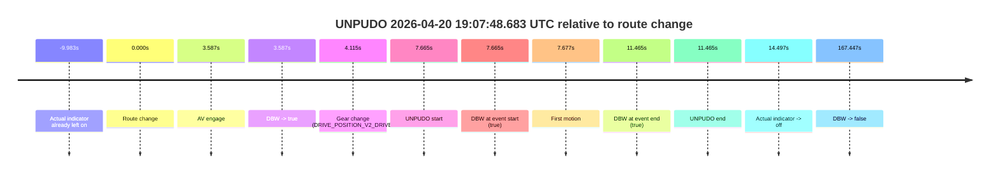

| Metric | Value |
|---|---|
| Outcome | `pass` |
| Effective failure type | `none` |
| Route change status | `found` |
| DBW at event start | `true` |
| DBW at event end | `true` |
| Predicted gear at AV start | `DRIVE_POSITION_V2_DRIVE` |
| Actual gear at AV start | `DRIVE_POSITION_V2_PARK` |
| Predicted gear at event start | `DRIVE_POSITION_V2_DRIVE` |
| Actual gear at event start | `DRIVE_POSITION_V2_DRIVE` |
| Planned indicator direction | `INDICATORS_STATE_V2_RIGHT_ON` |
| Controller indicator direction | `INDICATORS_STATE_V2_RIGHT_ON` |
| Actual indicator direction | `INDICATORS_STATE_V2_LEFT_ON` |
| Actual indicator at maneuver end | `INDICATORS_STATE_V2_LEFT_ON` |
| Driver accel help in AV | `false` |
| Driver accel help timestamp | `n/a` |
| Max accel pedal pct in AV | `0.0%` |
| Max brake pedal pct in AV | `8.3%` |
| Max speed mps in AV | `3.522` |
| Success timing baseline | `route change` |
| Route -> AV | `3.587s` |
| AV -> event start | `4.077s` |
| AV -> first motion | `4.090s` |
| Success baseline -> event start | `7.665s` |
| Success baseline -> first motion | `7.677s` |
| AV duration before disengagement | `163.860s` |
| Trajectory waypoint count | `36` |
| Driving-plan step count | `11` |

The scored portion starts from the AV-owned window, not from the pre-AV setup. Route-change search in the stopped pre-event segment was `found`, with the baseline therefore set to route change. At the event anchor the model predicts `DRIVE_POSITION_V2_DRIVE` and the actual gear is `DRIVE_POSITION_V2_DRIVE`. The effective model outcome is `pass` because `the credited unpudo stays AV-owned through the official unpudo window.`

### Resolution

| Field | Value |
|---|---|
| Final outcome | `pass` |
| Do we agree with this label? | `yes` |
| Source disengagement type | `none observed` |
| Resolved effective failure type | `none` |
| Confidence | `high` |

## unpudo 2026-04-20 19:15:05.483 UTC

| Field | Value |
|---|---|
| Model | `eel-teal-outspoken` |
| Author | `zak` |
| Run ID | `fme20032/2026-04-20--19-03-35--gen2-av-e7d103b0-699e-4196-82b3-9255e1b970f8` |
| Date | `2026-04-20` |
| Time (UTC) | `19:15:05.483` |
| Event type | `unpudo` |
| Disengagement type | `none observed` |
| Route change | `found` |
| Console | [run](https://console.sso.wayve.ai/run/fme20032/2026-04-20--19-03-35--gen2-av-e7d103b0-699e-4196-82b3-9255e1b970f8?id=&time-unixus=1776712505483322) |
| Foxglove | [segment](https://app.foxglove.dev/wayve-on-prem/p/prj_0dX18KZdVHg1fmmI/view?ds=foxglove-stream&ds.deviceName=fme20032&ds.start=2026-04-20T19%3A14%3A32.118336Z&ds.end=2026-04-20T19%3A16%3A34.045869Z&layoutId=lay_0e7VD4WIKDQGU73Y&time=2026-04-20T19%3A15%3A05.483322Z) |

### Event card: pass

- Pass: AV owns the credited unpudo from route change through the official unpudo window, the gear state is aligned at the anchor, and the vehicle moves without driver accelerator help in AV.

| Event | Time (UTC) | Delta from route change |
|---|---:|---:|
| Actual indicator -> left on | 2026-04-20 19:14:36.075 | `-6.043s` |
| Route change | 2026-04-20 19:14:42.118 | `0.000s` |
| AV engage | 2026-04-20 19:15:01.406 | `19.288s` |
| DBW -> true | 2026-04-20 19:15:01.406 | `19.288s` |
| Gear change (DRIVE_POSITION_V2_DRIVE) | 2026-04-20 19:15:01.833 | `19.715s` |
| Actual indicator -> off | 2026-04-20 19:15:02.655 | `20.538s` |
| Actual indicator -> right on | 2026-04-20 19:15:02.715 | `20.598s` |
| UNPUDO start | 2026-04-20 19:15:05.483 | `23.365s` |
| DBW at event start (true) | 2026-04-20 19:15:05.483 | `23.365s` |
| First motion | 2026-04-20 19:15:05.495 | `23.378s` |
| Actual indicator -> off | 2026-04-20 19:15:07.255 | `25.138s` |
| DBW at event end (true) | 2026-04-20 19:15:09.583 | `27.465s` |
| UNPUDO end | 2026-04-20 19:15:09.583 | `27.465s` |
| DBW -> false | 2026-04-20 19:16:24.045 | `101.928s` |
| Actual indicator -> right on | 2026-04-20 19:16:26.835 | `104.718s` |
| Actual indicator -> off | 2026-04-20 19:16:33.616 | `111.498s` |

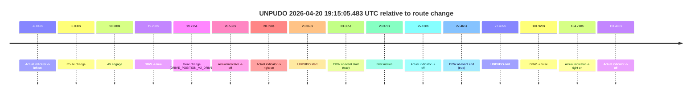

| Metric | Value |
|---|---|
| Outcome | `pass` |
| Effective failure type | `none` |
| Route change status | `found` |
| DBW at event start | `true` |
| DBW at event end | `true` |
| Predicted gear at AV start | `DRIVE_POSITION_V2_DRIVE` |
| Actual gear at AV start | `DRIVE_POSITION_V2_PARK` |
| Predicted gear at event start | `DRIVE_POSITION_V2_DRIVE` |
| Actual gear at event start | `DRIVE_POSITION_V2_DRIVE` |
| Planned indicator direction | `INDICATORS_STATE_V2_RIGHT_ON` |
| Controller indicator direction | `INDICATORS_STATE_V2_RIGHT_ON` |
| Actual indicator direction | `INDICATORS_STATE_V2_RIGHT_ON` |
| Actual indicator at maneuver end | `INDICATORS_STATE_V2_OFF` |
| Driver accel help in AV | `false` |
| Driver accel help timestamp | `n/a` |
| Max accel pedal pct in AV | `0.0%` |
| Max brake pedal pct in AV | `9.9%` |
| Max speed mps in AV | `4.844` |
| Success timing baseline | `route change` |
| Route -> AV | `19.288s` |
| AV -> event start | `4.077s` |
| AV -> first motion | `4.090s` |
| Success baseline -> event start | `23.365s` |
| Success baseline -> first motion | `23.378s` |
| AV duration before disengagement | `82.640s` |
| Trajectory waypoint count | `36` |
| Driving-plan step count | `11` |

The scored portion starts from the AV-owned window, not from the pre-AV setup. Route-change search in the stopped pre-event segment was `found`, with the baseline therefore set to route change. At the event anchor the model predicts `DRIVE_POSITION_V2_DRIVE` and the actual gear is `DRIVE_POSITION_V2_DRIVE`. The effective model outcome is `pass` because `the credited unpudo stays AV-owned through the official unpudo window.`

### Resolution

| Field | Value |
|---|---|
| Final outcome | `pass` |
| Do we agree with this label? | `yes` |
| Source disengagement type | `none observed` |
| Resolved effective failure type | `none` |
| Confidence | `high` |

## unpudo 2026-04-20 19:19:48.483 UTC

| Field | Value |
|---|---|
| Model | `eel-teal-outspoken` |
| Author | `zak` |
| Run ID | `fme20032/2026-04-20--19-03-35--gen2-av-e7d103b0-699e-4196-82b3-9255e1b970f8` |
| Date | `2026-04-20` |
| Time (UTC) | `19:19:48.483` |
| Event type | `unpudo` |
| Disengagement type | `none observed` |
| Route change | `found` |
| Console | [run](https://console.sso.wayve.ai/run/fme20032/2026-04-20--19-03-35--gen2-av-e7d103b0-699e-4196-82b3-9255e1b970f8?id=&time-unixus=1776712788483299) |
| Foxglove | [segment](https://app.foxglove.dev/wayve-on-prem/p/prj_0dX18KZdVHg1fmmI/view?ds=foxglove-stream&ds.deviceName=fme20032&ds.start=2026-04-20T19%3A17%3A40.318271Z&ds.end=2026-04-20T19%3A21%3A01.487230Z&layoutId=lay_0e7VD4WIKDQGU73Y&time=2026-04-20T19%3A19%3A48.483299Z) |

### Event card: pass

- Pass: AV owns the credited unpudo from route change through the official unpudo window, the gear state is aligned at the anchor, and the vehicle moves without driver accelerator help in AV.

| Event | Time (UTC) | Delta from route change |
|---|---:|---:|
| Route change | 2026-04-20 19:17:50.318 | `0.000s` |
| Actual indicator -> left on | 2026-04-20 19:17:58.996 | `8.678s` |
| Actual indicator -> off | 2026-04-20 19:19:34.055 | `103.737s` |
| Actual indicator -> right on | 2026-04-20 19:19:39.795 | `109.478s` |
| AV engage | 2026-04-20 19:19:44.406 | `114.088s` |
| DBW -> true | 2026-04-20 19:19:44.406 | `114.088s` |
| Gear change (DRIVE_POSITION_V2_DRIVE) | 2026-04-20 19:19:44.883 | `114.565s` |
| UNPUDO start | 2026-04-20 19:19:48.483 | `118.165s` |
| DBW at event start (true) | 2026-04-20 19:19:48.483 | `118.165s` |
| First motion | 2026-04-20 19:19:48.536 | `118.218s` |
| Actual indicator -> off | 2026-04-20 19:19:51.055 | `120.738s` |
| DBW at event end (true) | 2026-04-20 19:19:52.083 | `121.765s` |
| UNPUDO end | 2026-04-20 19:19:52.083 | `121.765s` |
| DBW -> false | 2026-04-20 19:20:51.487 | `181.169s` |

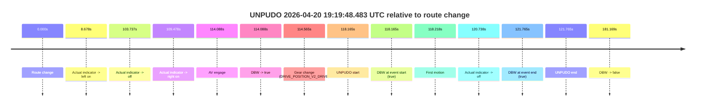

| Metric | Value |
|---|---|
| Outcome | `pass` |
| Effective failure type | `none` |
| Route change status | `found` |
| DBW at event start | `true` |
| DBW at event end | `true` |
| Predicted gear at AV start | `DRIVE_POSITION_V2_DRIVE` |
| Actual gear at AV start | `DRIVE_POSITION_V2_PARK` |
| Predicted gear at event start | `DRIVE_POSITION_V2_DRIVE` |
| Actual gear at event start | `DRIVE_POSITION_V2_DRIVE` |
| Planned indicator direction | `INDICATORS_STATE_V2_RIGHT_ON` |
| Controller indicator direction | `INDICATORS_STATE_V2_RIGHT_ON` |
| Actual indicator direction | `INDICATORS_STATE_V2_RIGHT_ON` |
| Actual indicator at maneuver end | `INDICATORS_STATE_V2_OFF` |
| Driver accel help in AV | `false` |
| Driver accel help timestamp | `n/a` |
| Max accel pedal pct in AV | `0.0%` |
| Max brake pedal pct in AV | `8.2%` |
| Max speed mps in AV | `4.308` |
| Success timing baseline | `route change` |
| Route -> AV | `114.088s` |
| AV -> event start | `4.077s` |
| AV -> first motion | `4.130s` |
| Success baseline -> event start | `118.165s` |
| Success baseline -> first motion | `118.218s` |
| AV duration before disengagement | `67.081s` |
| Trajectory waypoint count | `36` |
| Driving-plan step count | `11` |

The scored portion starts from the AV-owned window, not from the pre-AV setup. Route-change search in the stopped pre-event segment was `found`, with the baseline therefore set to route change. At the event anchor the model predicts `DRIVE_POSITION_V2_DRIVE` and the actual gear is `DRIVE_POSITION_V2_DRIVE`. The effective model outcome is `pass` because `the credited unpudo stays AV-owned through the official unpudo window.`

### Resolution

| Field | Value |
|---|---|
| Final outcome | `pass` |
| Do we agree with this label? | `yes` |
| Source disengagement type | `none observed` |
| Resolved effective failure type | `none` |
| Confidence | `high` |

## unpudo 2026-04-20 19:22:53.483 UTC

| Field | Value |
|---|---|
| Model | `eel-teal-outspoken` |
| Author | `zak` |
| Run ID | `fme20032/2026-04-20--19-03-35--gen2-av-e7d103b0-699e-4196-82b3-9255e1b970f8` |
| Date | `2026-04-20` |
| Time (UTC) | `19:22:53.483` |
| Event type | `unpudo` |
| Disengagement type | `none observed` |
| Route change | `found` |
| Console | [run](https://console.sso.wayve.ai/run/fme20032/2026-04-20--19-03-35--gen2-av-e7d103b0-699e-4196-82b3-9255e1b970f8?id=&time-unixus=1776712973483304) |
| Foxglove | [segment](https://app.foxglove.dev/wayve-on-prem/p/prj_0dX18KZdVHg1fmmI/view?ds=foxglove-stream&ds.deviceName=fme20032&ds.start=2026-04-20T19%3A22%3A02.018261Z&ds.end=2026-04-20T19%3A32%3A18.365898Z&layoutId=lay_0e7VD4WIKDQGU73Y&time=2026-04-20T19%3A22%3A53.483304Z) |

### Event card: pass

- Pass: AV owns the credited unpudo from route change through the official unpudo window, the gear state is aligned at the anchor, and the vehicle moves without driver accelerator help in AV.

| Event | Time (UTC) | Delta from route change |
|---|---:|---:|
| Route change | 2026-04-20 19:22:12.018 | `0.000s` |
| First motion | 2026-04-20 19:22:29.356 | `17.338s` |
| AV engage | 2026-04-20 19:22:49.406 | `37.388s` |
| DBW -> true | 2026-04-20 19:22:49.406 | `37.388s` |
| Gear change (DRIVE_POSITION_V2_DRIVE) | 2026-04-20 19:22:49.883 | `37.865s` |
| UNPUDO start | 2026-04-20 19:22:53.483 | `41.465s` |
| DBW at event start (true) | 2026-04-20 19:22:53.483 | `41.465s` |
| DBW at event end (true) | 2026-04-20 19:22:56.883 | `44.865s` |
| UNPUDO end | 2026-04-20 19:22:56.883 | `44.865s` |
| Actual indicator -> right on | 2026-04-20 19:31:04.035 | `532.018s` |
| Actual indicator -> off | 2026-04-20 19:31:06.315 | `534.298s` |
| DBW -> false | 2026-04-20 19:32:08.365 | `596.348s` |

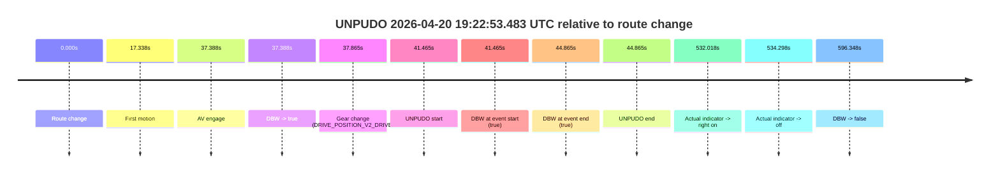

| Metric | Value |
|---|---|
| Outcome | `pass` |
| Effective failure type | `none` |
| Route change status | `found` |
| DBW at event start | `true` |
| DBW at event end | `true` |
| Predicted gear at AV start | `DRIVE_POSITION_V2_DRIVE` |
| Actual gear at AV start | `DRIVE_POSITION_V2_PARK` |
| Predicted gear at event start | `DRIVE_POSITION_V2_DRIVE` |
| Actual gear at event start | `DRIVE_POSITION_V2_DRIVE` |
| Planned indicator direction | `INDICATORS_STATE_V2_RIGHT_ON` |
| Controller indicator direction | `INDICATORS_STATE_V2_RIGHT_ON` |
| Actual indicator direction | `INDICATORS_STATE_V2_OFF` |
| Actual indicator at maneuver end | `INDICATORS_STATE_V2_OFF` |
| Driver accel help in AV | `false` |
| Driver accel help timestamp | `n/a` |
| Max accel pedal pct in AV | `0.0%` |
| Max brake pedal pct in AV | `9.6%` |
| Max speed mps in AV | `5.000` |
| Success timing baseline | `route change` |
| Route -> AV | `37.388s` |
| AV -> event start | `4.077s` |
| AV -> first motion | `-20.050s` |
| Success baseline -> event start | `41.465s` |
| Success baseline -> first motion | `17.338s` |
| AV duration before disengagement | `558.960s` |
| Trajectory waypoint count | `36` |
| Driving-plan step count | `11` |

The scored portion starts from the AV-owned window, not from the pre-AV setup. Route-change search in the stopped pre-event segment was `found`, with the baseline therefore set to route change. At the event anchor the model predicts `DRIVE_POSITION_V2_DRIVE` and the actual gear is `DRIVE_POSITION_V2_DRIVE`. The effective model outcome is `pass` because `the credited unpudo stays AV-owned through the official unpudo window.`

### Resolution

| Field | Value |
|---|---|
| Final outcome | `pass` |
| Do we agree with this label? | `yes` |
| Source disengagement type | `none observed` |
| Resolved effective failure type | `none` |
| Confidence | `high` |

## unpudo 2026-04-20 19:26:10.483 UTC

| Field | Value |
|---|---|
| Model | `eel-teal-outspoken` |
| Author | `zak` |
| Run ID | `fme20032/2026-04-20--19-03-35--gen2-av-e7d103b0-699e-4196-82b3-9255e1b970f8` |
| Date | `2026-04-20` |
| Time (UTC) | `19:26:10.483` |
| Event type | `unpudo` |
| Disengagement type | `none observed` |
| Route change | `found` |
| Console | [run](https://console.sso.wayve.ai/run/fme20032/2026-04-20--19-03-35--gen2-av-e7d103b0-699e-4196-82b3-9255e1b970f8?id=&time-unixus=1776713170483300) |
| Foxglove | [segment](https://app.foxglove.dev/wayve-on-prem/p/prj_0dX18KZdVHg1fmmI/view?ds=foxglove-stream&ds.deviceName=fme20032&ds.start=2026-04-20T19%3A25%3A56.618329Z&ds.end=2026-04-20T19%3A32%3A18.365898Z&layoutId=lay_0e7VD4WIKDQGU73Y&time=2026-04-20T19%3A26%3A10.483300Z) |

### Event card: pass

- Pass: AV owns the credited unpudo from route change through the official unpudo window, the gear state is aligned at the anchor, and the vehicle moves without driver accelerator help in AV.

| Event | Time (UTC) | Delta from route change |
|---|---:|---:|
| Route change | 2026-04-20 19:26:06.618 | `0.000s` |
| AV engage | 2026-04-20 19:26:06.626 | `0.008s` |
| DBW -> true | 2026-04-20 19:26:06.626 | `0.008s` |
| Gear change (DRIVE_POSITION_V2_DRIVE) | 2026-04-20 19:26:06.883 | `0.265s` |
| UNPUDO start | 2026-04-20 19:26:10.483 | `3.865s` |
| DBW at event start (true) | 2026-04-20 19:26:10.483 | `3.865s` |
| First motion | 2026-04-20 19:26:10.495 | `3.877s` |
| DBW at event end (true) | 2026-04-20 19:26:14.233 | `7.615s` |
| UNPUDO end | 2026-04-20 19:26:14.233 | `7.615s` |
| Actual indicator -> right on | 2026-04-20 19:31:04.035 | `297.418s` |
| Actual indicator -> off | 2026-04-20 19:31:06.315 | `299.698s` |
| DBW -> false | 2026-04-20 19:32:08.365 | `361.748s` |

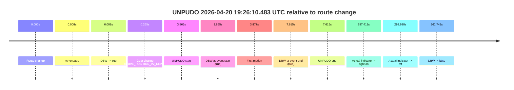

| Metric | Value |
|---|---|
| Outcome | `pass` |
| Effective failure type | `none` |
| Route change status | `found` |
| DBW at event start | `true` |
| DBW at event end | `true` |
| Predicted gear at AV start | `DRIVE_POSITION_V2_PARK` |
| Actual gear at AV start | `DRIVE_POSITION_V2_PARK` |
| Predicted gear at event start | `DRIVE_POSITION_V2_DRIVE` |
| Actual gear at event start | `DRIVE_POSITION_V2_DRIVE` |
| Planned indicator direction | `INDICATORS_STATE_V2_RIGHT_ON` |
| Controller indicator direction | `INDICATORS_STATE_V2_RIGHT_ON` |
| Actual indicator direction | `INDICATORS_STATE_V2_OFF` |
| Actual indicator at maneuver end | `INDICATORS_STATE_V2_OFF` |
| Driver accel help in AV | `false` |
| Driver accel help timestamp | `n/a` |
| Max accel pedal pct in AV | `0.0%` |
| Max brake pedal pct in AV | `8.0%` |
| Max speed mps in AV | `3.636` |
| Success timing baseline | `route change` |
| Route -> AV | `0.008s` |
| AV -> event start | `3.857s` |
| AV -> first motion | `3.870s` |
| Success baseline -> event start | `3.865s` |
| Success baseline -> first motion | `3.877s` |
| AV duration before disengagement | `361.740s` |
| Trajectory waypoint count | `36` |
| Driving-plan step count | `11` |

The scored portion starts from the AV-owned window, not from the pre-AV setup. Route-change search in the stopped pre-event segment was `found`, with the baseline therefore set to route change. At the event anchor the model predicts `DRIVE_POSITION_V2_DRIVE` and the actual gear is `DRIVE_POSITION_V2_DRIVE`. The effective model outcome is `pass` because `the credited unpudo stays AV-owned through the official unpudo window.`

### Resolution

| Field | Value |
|---|---|
| Final outcome | `pass` |
| Do we agree with this label? | `yes` |
| Source disengagement type | `none observed` |
| Resolved effective failure type | `none` |
| Confidence | `high` |

## unpudo 2026-04-20 19:42:14.183 UTC

| Field | Value |
|---|---|
| Model | `eel-teal-outspoken` |
| Author | `zak` |
| Run ID | `fme20032/2026-04-20--19-03-35--gen2-av-e7d103b0-699e-4196-82b3-9255e1b970f8` |
| Date | `2026-04-20` |
| Time (UTC) | `19:42:14.183` |
| Event type | `unpudo` |
| Disengagement type | `none observed` |
| Route change | `found` |
| Console | [run](https://console.sso.wayve.ai/run/fme20032/2026-04-20--19-03-35--gen2-av-e7d103b0-699e-4196-82b3-9255e1b970f8?id=&time-unixus=1776714134183295) |
| Foxglove | [segment](https://app.foxglove.dev/wayve-on-prem/p/prj_0dX18KZdVHg1fmmI/view?ds=foxglove-stream&ds.deviceName=fme20032&ds.start=2026-04-20T19%3A41%3A38.768272Z&ds.end=2026-04-20T19%3A45%3A37.645250Z&layoutId=lay_0e7VD4WIKDQGU73Y&time=2026-04-20T19%3A42%3A14.183295Z) |

### Event card: pass

- Pass: AV owns the credited unpudo from route change through the official unpudo window, the gear state is aligned at the anchor, and the vehicle moves without driver accelerator help in AV.

| Event | Time (UTC) | Delta from route change |
|---|---:|---:|
| Route change | 2026-04-20 19:41:48.768 | `0.000s` |
| Gear change (DRIVE_POSITION_V2_DRIVE) | 2026-04-20 19:42:00.783 | `12.015s` |
| AV engage | 2026-04-20 19:42:10.726 | `21.958s` |
| DBW -> true | 2026-04-20 19:42:10.726 | `21.958s` |
| Actual indicator -> left on | 2026-04-20 19:42:12.595 | `23.828s` |
| UNPUDO start | 2026-04-20 19:42:14.183 | `25.415s` |
| DBW at event start (true) | 2026-04-20 19:42:14.183 | `25.415s` |
| First motion | 2026-04-20 19:42:14.195 | `25.428s` |
| Actual indicator -> off | 2026-04-20 19:42:16.996 | `28.228s` |
| DBW at event end (true) | 2026-04-20 19:42:18.083 | `29.315s` |
| UNPUDO end | 2026-04-20 19:42:18.083 | `29.315s` |
| DBW -> false | 2026-04-20 19:45:27.645 | `218.877s` |

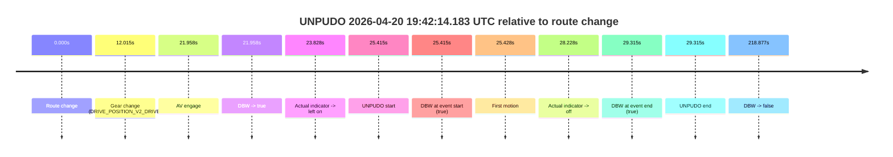

| Metric | Value |
|---|---|
| Outcome | `pass` |
| Effective failure type | `none` |
| Route change status | `found` |
| DBW at event start | `true` |
| DBW at event end | `true` |
| Predicted gear at AV start | `DRIVE_POSITION_V2_DRIVE` |
| Actual gear at AV start | `DRIVE_POSITION_V2_DRIVE` |
| Predicted gear at event start | `DRIVE_POSITION_V2_DRIVE` |
| Actual gear at event start | `DRIVE_POSITION_V2_DRIVE` |
| Planned indicator direction | `INDICATORS_STATE_V2_LEFT_ON` |
| Controller indicator direction | `INDICATORS_STATE_V2_LEFT_ON` |
| Actual indicator direction | `INDICATORS_STATE_V2_LEFT_ON` |
| Actual indicator at maneuver end | `INDICATORS_STATE_V2_OFF` |
| Driver accel help in AV | `false` |
| Driver accel help timestamp | `n/a` |
| Max accel pedal pct in AV | `0.0%` |
| Max brake pedal pct in AV | `8.0%` |
| Max speed mps in AV | `4.222` |
| Success timing baseline | `route change` |
| Route -> AV | `21.958s` |
| AV -> event start | `3.457s` |
| AV -> first motion | `3.470s` |
| Success baseline -> event start | `25.415s` |
| Success baseline -> first motion | `25.428s` |
| AV duration before disengagement | `196.919s` |
| Trajectory waypoint count | `36` |
| Driving-plan step count | `11` |

The scored portion starts from the AV-owned window, not from the pre-AV setup. Route-change search in the stopped pre-event segment was `found`, with the baseline therefore set to route change. At the event anchor the model predicts `DRIVE_POSITION_V2_DRIVE` and the actual gear is `DRIVE_POSITION_V2_DRIVE`. The effective model outcome is `pass` because `the credited unpudo stays AV-owned through the official unpudo window.`

### Resolution

| Field | Value |
|---|---|
| Final outcome | `pass` |
| Do we agree with this label? | `yes` |
| Source disengagement type | `none observed` |
| Resolved effective failure type | `none` |
| Confidence | `high` |

## unpudo 2026-04-20 19:55:05.833 UTC

| Field | Value |
|---|---|
| Model | `eel-teal-outspoken` |
| Author | `zak` |
| Run ID | `fme20032/2026-04-20--19-03-35--gen2-av-e7d103b0-699e-4196-82b3-9255e1b970f8` |
| Date | `2026-04-20` |
| Time (UTC) | `19:55:05.833` |
| Event type | `unpudo` |
| Disengagement type | `none observed` |
| Route change | `unclear` |
| Console | [run](https://console.sso.wayve.ai/run/fme20032/2026-04-20--19-03-35--gen2-av-e7d103b0-699e-4196-82b3-9255e1b970f8?id=&time-unixus=1776714905833310) |
| Foxglove | [segment](https://app.foxglove.dev/wayve-on-prem/p/prj_0dX18KZdVHg1fmmI/view?ds=foxglove-stream&ds.deviceName=fme20032&ds.start=2026-04-20T19%3A52%3A55.835214Z&ds.end=2026-04-20T19%3A55%3A54.083302Z&layoutId=lay_0e7VD4WIKDQGU73Y&time=2026-04-20T19%3A55%3A05.833310Z) |

### Event card: fail

- Fail: the credited unpudo does not stay AV-owned. The event window starts with DBW false, and the maneuver outcome lands outside a clean AV-owned segment.

| Event | Time (UTC) | Delta from AV start |
|---|---:|---:|
| Route change unclear | 2026-04-20 19:53:05.835 | `0.000s` |
| AV engage | 2026-04-20 19:53:05.835 | `0.000s` |
| DBW -> true | 2026-04-20 19:53:05.835 | `0.000s` |
| First motion | 2026-04-20 19:53:05.835 | `0.001s` |
| DBW -> false | 2026-04-20 19:54:29.985 | `84.151s` |
| Gear change (DRIVE_POSITION_V2_DRIVE) | 2026-04-20 19:55:03.483 | `117.648s` |
| UNPUDO start | 2026-04-20 19:55:05.833 | `119.998s` |
| DBW at event start (false) | 2026-04-20 19:55:05.833 | `119.998s` |
| Actual indicator -> right on | 2026-04-20 19:55:36.835 | `151.001s` |
| Actual indicator -> off | 2026-04-20 19:55:41.655 | `155.821s` |
| DBW at event end (true) | 2026-04-20 19:55:44.083 | `158.248s` |
| UNPUDO end | 2026-04-20 19:55:44.083 | `158.248s` |

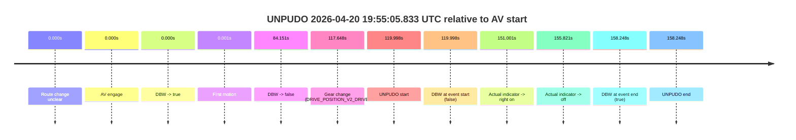

| Metric | Value |
|---|---|
| Outcome | `fail` |
| Effective failure type | `not_av_owned` |
| Route change status | `unclear` |
| DBW at event start | `false` |
| DBW at event end | `true` |
| Predicted gear at AV start | `DRIVE_POSITION_V2_DRIVE` |
| Actual gear at AV start | `DRIVE_POSITION_V2_DRIVE` |
| Predicted gear at event start | `DRIVE_POSITION_V2_DRIVE` |
| Actual gear at event start | `DRIVE_POSITION_V2_DRIVE` |
| Planned indicator direction | `INDICATORS_STATE_V2_OFF` |
| Controller indicator direction | `INDICATORS_STATE_V2_OFF` |
| Actual indicator direction | `INDICATORS_STATE_V2_OFF` |
| Actual indicator at maneuver end | `INDICATORS_STATE_V2_OFF` |
| Driver accel help in AV | `false` |
| Driver accel help timestamp | `n/a` |
| Max accel pedal pct in AV | `0.0%` |
| Max brake pedal pct in AV | `0.0%` |
| Max speed mps in AV | `8.067` |
| Success timing baseline | `AV start` |
| Route -> AV | `n/a` |
| AV -> event start | `119.998s` |
| AV -> first motion | `0.001s` |
| Success baseline -> event start | `119.998s` |
| Success baseline -> first motion | `0.001s` |
| AV duration before disengagement | `84.151s` |
| Trajectory waypoint count | `37` |
| Driving-plan step count | `11` |

The scored portion starts from the AV-owned window, not from the pre-AV setup. Route-change search in the stopped pre-event segment was `unclear`, with the baseline therefore set to AV start. At the event anchor the model predicts `DRIVE_POSITION_V2_DRIVE` and the actual gear is `DRIVE_POSITION_V2_DRIVE`. The effective model outcome is `fail` because `not_av_owned.`

### Resolution

| Field | Value |
|---|---|
| Final outcome | `fail` |
| Do we agree with this label? | `yes` |
| Source disengagement type | `none observed` |
| Resolved effective failure type | `not_av_owned` |
| Confidence | `medium` |

## unpudo 2026-04-20 19:59:34.483 UTC

| Field | Value |
|---|---|
| Model | `eel-teal-outspoken` |
| Author | `zak` |
| Run ID | `fme20032/2026-04-20--19-03-35--gen2-av-e7d103b0-699e-4196-82b3-9255e1b970f8` |
| Date | `2026-04-20` |
| Time (UTC) | `19:59:34.483` |
| Event type | `unpudo` |
| Disengagement type | `none observed` |
| Route change | `found` |
| Console | [run](https://console.sso.wayve.ai/run/fme20032/2026-04-20--19-03-35--gen2-av-e7d103b0-699e-4196-82b3-9255e1b970f8?id=&time-unixus=1776715174483315) |
| Foxglove | [segment](https://app.foxglove.dev/wayve-on-prem/p/prj_0dX18KZdVHg1fmmI/view?ds=foxglove-stream&ds.deviceName=fme20032&ds.start=2026-04-20T19%3A59%3A20.568305Z&ds.end=2026-04-20T20%3A09%3A28.685275Z&layoutId=lay_0e7VD4WIKDQGU73Y&time=2026-04-20T19%3A59%3A34.483315Z) |

### Event card: pass

- Pass: AV owns the credited unpudo from route change through the official unpudo window, the gear state is aligned at the anchor, and the vehicle moves without driver accelerator help in AV.

| Event | Time (UTC) | Delta from route change |
|---|---:|---:|
| Route change | 2026-04-20 19:59:30.568 | `0.000s` |
| AV engage | 2026-04-20 19:59:30.575 | `0.008s` |
| DBW -> true | 2026-04-20 19:59:30.575 | `0.008s` |
| Gear change (DRIVE_POSITION_V2_DRIVE) | 2026-04-20 19:59:30.833 | `0.265s` |
| UNPUDO start | 2026-04-20 19:59:34.483 | `3.915s` |
| DBW at event start (true) | 2026-04-20 19:59:34.483 | `3.915s` |
| First motion | 2026-04-20 19:59:34.495 | `3.928s` |
| DBW at event end (true) | 2026-04-20 19:59:38.383 | `7.815s` |
| UNPUDO end | 2026-04-20 19:59:38.383 | `7.815s` |
| DBW -> false | 2026-04-20 20:09:18.685 | `588.117s` |

| Metric | Value |
|---|---|
| Outcome | `pass` |
| Effective failure type | `none` |
| Route change status | `found` |
| DBW at event start | `true` |
| DBW at event end | `true` |
| Predicted gear at AV start | `DRIVE_POSITION_V2_PARK` |
| Actual gear at AV start | `DRIVE_POSITION_V2_PARK` |
| Predicted gear at event start | `DRIVE_POSITION_V2_DRIVE` |
| Actual gear at event start | `DRIVE_POSITION_V2_DRIVE` |
| Planned indicator direction | `INDICATORS_STATE_V2_RIGHT_ON` |
| Controller indicator direction | `INDICATORS_STATE_V2_RIGHT_ON` |
| Actual indicator direction | `INDICATORS_STATE_V2_OFF` |
| Actual indicator at maneuver end | `INDICATORS_STATE_V2_OFF` |
| Driver accel help in AV | `false` |
| Driver accel help timestamp | `n/a` |
| Max accel pedal pct in AV | `0.0%` |
| Max brake pedal pct in AV | `8.0%` |
| Max speed mps in AV | `4.533` |
| Success timing baseline | `route change` |
| Route -> AV | `0.008s` |
| AV -> event start | `3.907s` |
| AV -> first motion | `3.920s` |
| Success baseline -> event start | `3.915s` |
| Success baseline -> first motion | `3.928s` |
| AV duration before disengagement | `588.109s` |
| Trajectory waypoint count | `36` |
| Driving-plan step count | `11` |

The scored portion starts from the AV-owned window, not from the pre-AV setup. Route-change search in the stopped pre-event segment was `found`, with the baseline therefore set to route change. At the event anchor the model predicts `DRIVE_POSITION_V2_DRIVE` and the actual gear is `DRIVE_POSITION_V2_DRIVE`. The effective model outcome is `pass` because `the credited unpudo stays AV-owned through the official unpudo window.`

### Resolution

| Field | Value |
|---|---|
| Final outcome | `pass` |
| Do we agree with this label? | `yes` |
| Source disengagement type | `none observed` |
| Resolved effective failure type | `none` |
| Confidence | `high` |

## unpudo 2026-04-20 21:04:05.433 UTC

| Field | Value |
|---|---|
| Model | `eel-teal-outspoken` |
| Author | `zak` |
| Run ID | `fme20032/2026-04-20--19-03-35--gen2-av-e7d103b0-699e-4196-82b3-9255e1b970f8` |
| Date | `2026-04-20` |
| Time (UTC) | `21:04:05.433` |
| Event type | `unpudo` |
| Disengagement type | `none observed` |
| Route change | `found` |
| Console | [run](https://console.sso.wayve.ai/run/fme20032/2026-04-20--19-03-35--gen2-av-e7d103b0-699e-4196-82b3-9255e1b970f8?id=&time-unixus=1776719045433320) |
| Foxglove | [segment](https://app.foxglove.dev/wayve-on-prem/p/prj_0dX18KZdVHg1fmmI/view?ds=foxglove-stream&ds.deviceName=fme20032&ds.start=2026-04-20T21%3A03%3A51.568266Z&ds.end=2026-04-20T21%3A04%3A30.683297Z&layoutId=lay_0e7VD4WIKDQGU73Y&time=2026-04-20T21%3A04%3A05.433320Z) |

### Event card: fail

- Fail: the credited unpudo does not stay AV-owned. The event window starts with DBW false, and the maneuver outcome lands outside a clean AV-owned segment.

| Event | Time (UTC) | Delta from route change |
|---|---:|---:|
| Route change | 2026-04-20 21:04:01.568 | `0.000s` |
| AV engage | 2026-04-20 21:04:01.575 | `0.008s` |
| DBW -> true | 2026-04-20 21:04:01.575 | `0.008s` |
| Gear change (DRIVE_POSITION_V2_DRIVE) | 2026-04-20 21:04:01.883 | `0.315s` |
| DBW -> false | 2026-04-20 21:04:05.425 | `3.858s` |
| UNPUDO start | 2026-04-20 21:04:05.433 | `3.865s` |
| DBW at event start (false) | 2026-04-20 21:04:05.433 | `3.865s` |
| Actual indicator -> left on | 2026-04-20 21:04:07.515 | `5.948s` |
| Actual indicator -> off | 2026-04-20 21:04:11.155 | `9.588s` |
| Actual indicator -> left on | 2026-04-20 21:04:12.275 | `10.708s` |
| Actual indicator -> off | 2026-04-20 21:04:13.115 | `11.548s` |
| Actual indicator -> right on | 2026-04-20 21:04:14.815 | `13.248s` |
| Actual indicator -> off | 2026-04-20 21:04:18.735 | `17.168s` |
| DBW at event end (false) | 2026-04-20 21:04:20.683 | `19.115s` |
| UNPUDO end | 2026-04-20 21:04:20.683 | `19.115s` |

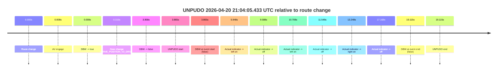

| Metric | Value |
|---|---|
| Outcome | `fail` |
| Effective failure type | `not_av_owned` |
| Route change status | `found` |
| DBW at event start | `false` |
| DBW at event end | `false` |
| Predicted gear at AV start | `DRIVE_POSITION_V2_PARK` |
| Actual gear at AV start | `DRIVE_POSITION_V2_PARK` |
| Predicted gear at event start | `DRIVE_POSITION_V2_DRIVE` |
| Actual gear at event start | `DRIVE_POSITION_V2_DRIVE` |
| Planned indicator direction | `INDICATORS_STATE_V2_RIGHT_ON` |
| Controller indicator direction | `INDICATORS_STATE_V2_RIGHT_ON` |
| Actual indicator direction | `INDICATORS_STATE_V2_OFF` |
| Actual indicator at maneuver end | `INDICATORS_STATE_V2_OFF` |
| Driver accel help in AV | `false` |
| Driver accel help timestamp | `n/a` |
| Max accel pedal pct in AV | `0.0%` |
| Max brake pedal pct in AV | `8.3%` |
| Max speed mps in AV | `0.000` |
| Success timing baseline | `route change` |
| Route -> AV | `0.008s` |
| AV -> event start | `3.857s` |
| AV -> first motion | `n/a` |
| Success baseline -> event start | `3.865s` |
| Success baseline -> first motion | `n/a` |
| AV duration before disengagement | `3.850s` |
| Trajectory waypoint count | `37` |
| Driving-plan step count | `11` |

The scored portion starts from the AV-owned window, not from the pre-AV setup. Route-change search in the stopped pre-event segment was `found`, with the baseline therefore set to route change. At the event anchor the model predicts `DRIVE_POSITION_V2_DRIVE` and the actual gear is `DRIVE_POSITION_V2_DRIVE`. The effective model outcome is `fail` because `not_av_owned.`

### Resolution

| Field | Value |
|---|---|
| Final outcome | `fail` |
| Do we agree with this label? | `yes` |
| Source disengagement type | `none observed` |
| Resolved effective failure type | `not_av_owned` |
| Confidence | `high` |

## unpudo 2026-04-20 21:32:21.733 UTC

| Field | Value |
|---|---|
| Model | `eel-teal-outspoken` |
| Author | `zak` |
| Run ID | `fme20032/2026-04-20--19-03-35--gen2-av-e7d103b0-699e-4196-82b3-9255e1b970f8` |
| Date | `2026-04-20` |
| Time (UTC) | `21:32:21.733` |
| Event type | `unpudo` |
| Disengagement type | `none observed` |
| Route change | `found` |
| Console | [run](https://console.sso.wayve.ai/run/fme20032/2026-04-20--19-03-35--gen2-av-e7d103b0-699e-4196-82b3-9255e1b970f8?id=&time-unixus=1776720741733300) |
| Foxglove | [segment](https://app.foxglove.dev/wayve-on-prem/p/prj_0dX18KZdVHg1fmmI/view?ds=foxglove-stream&ds.deviceName=fme20032&ds.start=2026-04-20T21%3A32%3A07.968319Z&ds.end=2026-04-20T21%3A32%3A50.266795Z&layoutId=lay_0e7VD4WIKDQGU73Y&time=2026-04-20T21%3A32%3A21.733300Z) |

### Event card: pass

- Pass: AV owns the credited unpudo from route change through the official unpudo window, the gear state is aligned at the anchor, and the vehicle moves without driver accelerator help in AV.

| Event | Time (UTC) | Delta from route change |
|---|---:|---:|
| Route change | 2026-04-20 21:32:17.968 | `0.000s` |
| AV engage | 2026-04-20 21:32:17.976 | `0.008s` |
| DBW -> true | 2026-04-20 21:32:17.976 | `0.008s` |
| Gear change (DRIVE_POSITION_V2_DRIVE) | 2026-04-20 21:32:18.233 | `0.265s` |
| UNPUDO start | 2026-04-20 21:32:21.733 | `3.765s` |
| DBW at event start (true) | 2026-04-20 21:32:21.733 | `3.765s` |
| First motion | 2026-04-20 21:32:21.775 | `3.808s` |
| DBW at event end (true) | 2026-04-20 21:32:25.183 | `7.215s` |
| UNPUDO end | 2026-04-20 21:32:25.183 | `7.215s` |
| DBW -> false | 2026-04-20 21:32:40.266 | `22.298s` |

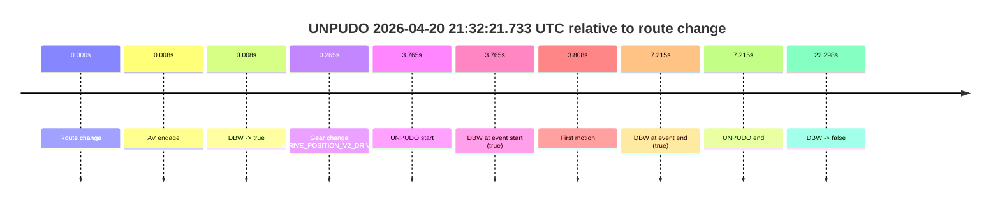

| Metric | Value |
|---|---|
| Outcome | `pass` |
| Effective failure type | `none` |
| Route change status | `found` |
| DBW at event start | `true` |
| DBW at event end | `true` |
| Predicted gear at AV start | `DRIVE_POSITION_V2_PARK` |
| Actual gear at AV start | `DRIVE_POSITION_V2_PARK` |
| Predicted gear at event start | `DRIVE_POSITION_V2_DRIVE` |
| Actual gear at event start | `DRIVE_POSITION_V2_DRIVE` |
| Planned indicator direction | `INDICATORS_STATE_V2_RIGHT_ON` |
| Controller indicator direction | `INDICATORS_STATE_V2_RIGHT_ON` |
| Actual indicator direction | `INDICATORS_STATE_V2_OFF` |
| Actual indicator at maneuver end | `INDICATORS_STATE_V2_OFF` |
| Driver accel help in AV | `false` |
| Driver accel help timestamp | `n/a` |
| Max accel pedal pct in AV | `0.0%` |
| Max brake pedal pct in AV | `8.0%` |
| Max speed mps in AV | `4.614` |
| Success timing baseline | `route change` |
| Route -> AV | `0.008s` |
| AV -> event start | `3.757s` |
| AV -> first motion | `3.800s` |
| Success baseline -> event start | `3.765s` |
| Success baseline -> first motion | `3.808s` |
| AV duration before disengagement | `22.291s` |
| Trajectory waypoint count | `37` |
| Driving-plan step count | `11` |

The scored portion starts from the AV-owned window, not from the pre-AV setup. Route-change search in the stopped pre-event segment was `found`, with the baseline therefore set to route change. At the event anchor the model predicts `DRIVE_POSITION_V2_DRIVE` and the actual gear is `DRIVE_POSITION_V2_DRIVE`. The effective model outcome is `pass` because `the credited unpudo stays AV-owned through the official unpudo window.`

### Resolution

| Field | Value |
|---|---|
| Final outcome | `pass` |
| Do we agree with this label? | `yes` |
| Source disengagement type | `none observed` |
| Resolved effective failure type | `none` |
| Confidence | `high` |

## unpudo 2026-04-20 21:37:32.183 UTC

| Field | Value |
|---|---|
| Model | `eel-teal-outspoken` |
| Author | `zak` |
| Run ID | `fme20032/2026-04-20--19-03-35--gen2-av-e7d103b0-699e-4196-82b3-9255e1b970f8` |
| Date | `2026-04-20` |
| Time (UTC) | `21:37:32.183` |
| Event type | `unpudo` |
| Disengagement type | `none observed` |
| Route change | `found` |
| Console | [run](https://console.sso.wayve.ai/run/fme20032/2026-04-20--19-03-35--gen2-av-e7d103b0-699e-4196-82b3-9255e1b970f8?id=&time-unixus=1776721052183311) |
| Foxglove | [segment](https://app.foxglove.dev/wayve-on-prem/p/prj_0dX18KZdVHg1fmmI/view?ds=foxglove-stream&ds.deviceName=fme20032&ds.start=2026-04-20T21%3A37%3A09.168302Z&ds.end=2026-04-20T21%3A38%3A19.725845Z&layoutId=lay_0e7VD4WIKDQGU73Y&time=2026-04-20T21%3A37%3A32.183311Z) |

### Event card: pass

- Pass: AV owns the credited unpudo from route change through the official unpudo window, the gear state is aligned at the anchor, and the vehicle moves without driver accelerator help in AV.

| Event | Time (UTC) | Delta from route change |
|---|---:|---:|
| Route change | 2026-04-20 21:37:19.168 | `0.000s` |
| AV engage | 2026-04-20 21:37:28.206 | `9.038s` |
| DBW -> true | 2026-04-20 21:37:28.206 | `9.038s` |
| Gear change (DRIVE_POSITION_V2_DRIVE) | 2026-04-20 21:37:28.633 | `9.465s` |
| UNPUDO start | 2026-04-20 21:37:32.183 | `13.015s` |
| DBW at event start (true) | 2026-04-20 21:37:32.183 | `13.015s` |
| First motion | 2026-04-20 21:37:32.215 | `13.047s` |
| DBW at event end (true) | 2026-04-20 21:37:36.083 | `16.915s` |
| UNPUDO end | 2026-04-20 21:37:36.083 | `16.915s` |
| DBW -> false | 2026-04-20 21:38:09.725 | `50.558s` |
| Actual indicator -> right on | 2026-04-20 21:38:10.496 | `51.328s` |
| Actual indicator -> off | 2026-04-20 21:38:18.896 | `59.728s` |
| Actual indicator -> right on | 2026-04-20 21:38:22.695 | `63.528s` |

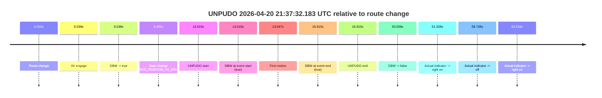

| Metric | Value |
|---|---|
| Outcome | `pass` |
| Effective failure type | `none` |
| Route change status | `found` |
| DBW at event start | `true` |
| DBW at event end | `true` |
| Predicted gear at AV start | `DRIVE_POSITION_V2_DRIVE` |
| Actual gear at AV start | `DRIVE_POSITION_V2_PARK` |
| Predicted gear at event start | `DRIVE_POSITION_V2_DRIVE` |
| Actual gear at event start | `DRIVE_POSITION_V2_DRIVE` |
| Planned indicator direction | `INDICATORS_STATE_V2_RIGHT_ON` |
| Controller indicator direction | `INDICATORS_STATE_V2_RIGHT_ON` |
| Actual indicator direction | `INDICATORS_STATE_V2_OFF` |
| Actual indicator at maneuver end | `INDICATORS_STATE_V2_OFF` |
| Driver accel help in AV | `false` |
| Driver accel help timestamp | `n/a` |
| Max accel pedal pct in AV | `0.0%` |
| Max brake pedal pct in AV | `8.0%` |
| Max speed mps in AV | `3.400` |
| Success timing baseline | `route change` |
| Route -> AV | `9.038s` |
| AV -> event start | `3.977s` |
| AV -> first motion | `4.010s` |
| Success baseline -> event start | `13.015s` |
| Success baseline -> first motion | `13.047s` |
| AV duration before disengagement | `41.520s` |
| Trajectory waypoint count | `36` |
| Driving-plan step count | `11` |

The scored portion starts from the AV-owned window, not from the pre-AV setup. Route-change search in the stopped pre-event segment was `found`, with the baseline therefore set to route change. At the event anchor the model predicts `DRIVE_POSITION_V2_DRIVE` and the actual gear is `DRIVE_POSITION_V2_DRIVE`. The effective model outcome is `pass` because `the credited unpudo stays AV-owned through the official unpudo window.`

### Resolution

| Field | Value |
|---|---|
| Final outcome | `pass` |
| Do we agree with this label? | `yes` |
| Source disengagement type | `none observed` |
| Resolved effective failure type | `none` |
| Confidence | `high` |

## unparking 2026-04-20 21:46:00.833 UTC

| Field | Value |
|---|---|
| Model | `eel-teal-outspoken` |
| Author | `zak` |
| Run ID | `fme20032/2026-04-20--19-03-35--gen2-av-e7d103b0-699e-4196-82b3-9255e1b970f8` |
| Date | `2026-04-20` |
| Time (UTC) | `21:46:00.833` |
| Event type | `unparking` |
| Disengagement type | `none observed` |
| Route change | `found` |
| Console | [run](https://console.sso.wayve.ai/run/fme20032/2026-04-20--19-03-35--gen2-av-e7d103b0-699e-4196-82b3-9255e1b970f8?id=&time-unixus=1776721560833309) |
| Foxglove | [segment](https://app.foxglove.dev/wayve-on-prem/p/prj_0dX18KZdVHg1fmmI/view?ds=foxglove-stream&ds.deviceName=fme20032&ds.start=2026-04-20T21%3A45%3A32.918252Z&ds.end=2026-04-20T21%3A46%3A30.667034Z&layoutId=lay_0e7VD4WIKDQGU73Y&time=2026-04-20T21%3A46%3A00.833309Z) |

### Event card: pass

- Pass: AV owns the credited unparking through the official event window, the gear state is aligned at the anchor, and the vehicle moves without driver accelerator help in AV.

| Event | Time (UTC) | Delta from route change |
|---|---:|---:|
| Route change | 2026-04-20 21:45:42.918 | `0.000s` |
| AV engage | 2026-04-20 21:45:56.865 | `13.948s` |
| DBW -> true | 2026-04-20 21:45:56.865 | `13.948s` |
| Gear change (DRIVE_POSITION_V2_DRIVE) | 2026-04-20 21:45:57.283 | `14.365s` |
| UNPARKING start | 2026-04-20 21:46:00.833 | `17.915s` |
| DBW at event start (true) | 2026-04-20 21:46:00.833 | `17.915s` |
| First motion | 2026-04-20 21:46:00.916 | `17.998s` |
| DBW at event end (true) | 2026-04-20 21:46:04.783 | `21.865s` |
| UNPARKING end | 2026-04-20 21:46:04.783 | `21.865s` |
| DBW -> false | 2026-04-20 21:46:20.667 | `37.749s` |

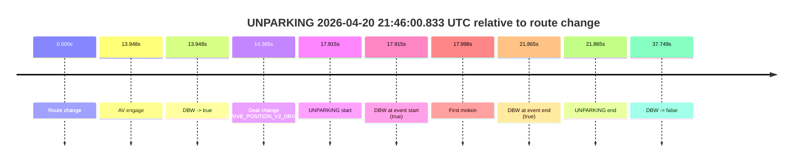

| Metric | Value |
|---|---|
| Outcome | `pass` |
| Effective failure type | `none` |
| Route change status | `found` |
| DBW at event start | `true` |
| DBW at event end | `true` |
| Predicted gear at AV start | `DRIVE_POSITION_V2_DRIVE` |
| Actual gear at AV start | `DRIVE_POSITION_V2_PARK` |
| Predicted gear at event start | `DRIVE_POSITION_V2_DRIVE` |
| Actual gear at event start | `DRIVE_POSITION_V2_DRIVE` |
| Planned indicator direction | `INDICATORS_STATE_V2_RIGHT_ON` |
| Controller indicator direction | `INDICATORS_STATE_V2_RIGHT_ON` |
| Actual indicator direction | `INDICATORS_STATE_V2_OFF` |
| Actual indicator at maneuver end | `INDICATORS_STATE_V2_OFF` |
| Driver accel help in AV | `false` |
| Driver accel help timestamp | `n/a` |
| Max accel pedal pct in AV | `0.0%` |
| Max brake pedal pct in AV | `0.0%` |
| Max speed mps in AV | `4.178` |
| Success timing baseline | `route change` |
| Route -> AV | `13.948s` |
| AV -> event start | `3.967s` |
| AV -> first motion | `4.050s` |
| Success baseline -> event start | `17.915s` |
| Success baseline -> first motion | `17.998s` |
| AV duration before disengagement | `23.801s` |
| Trajectory waypoint count | `35` |
| Driving-plan step count | `11` |

The scored portion starts from the AV-owned window, not from the pre-AV setup. Route-change search in the stopped pre-event segment was `found`, with the baseline therefore set to route change. At the event anchor the model predicts `DRIVE_POSITION_V2_DRIVE` and the actual gear is `DRIVE_POSITION_V2_DRIVE`. The effective model outcome is `pass` because `the credited maneuver stays AV-owned through the official event end.`

### Resolution

| Field | Value |
|---|---|
| Final outcome | `pass` |
| Do we agree with this label? | `yes` |
| Source disengagement type | `none observed` |
| Resolved effective failure type | `none` |
| Confidence | `high` |
