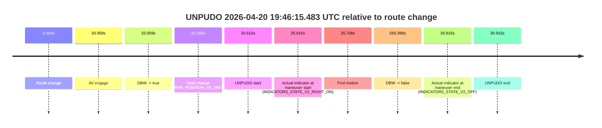
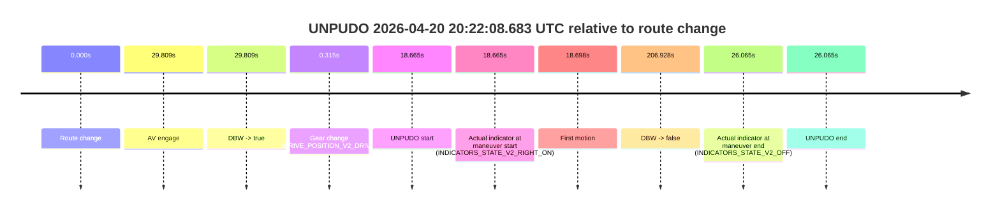
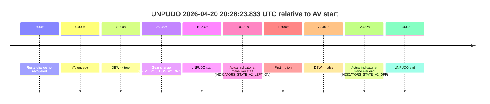
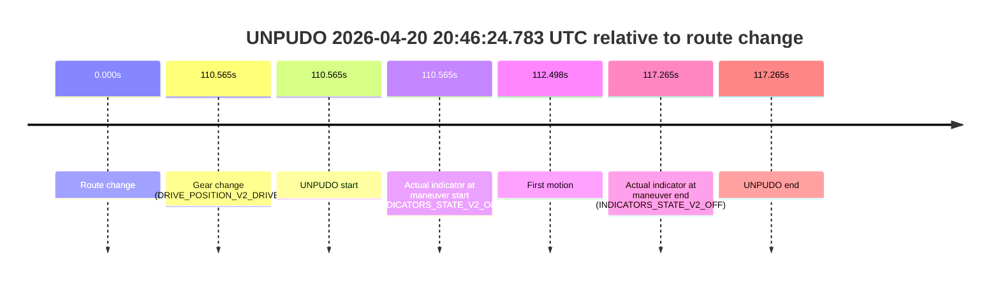

# Run Report: fme20032/2026-04-20--19-03-35--gen2-av-e7d103b0-699e-4196-82b3-9255e1b970f8

| Field | Value |
|---|---|
| Run ID | `fme20032/2026-04-20--19-03-35--gen2-av-e7d103b0-699e-4196-82b3-9255e1b970f8` |
| Date | `2026-04-20` |
| Model(s) | `blue-panther-solid` |
| Author | `guy.geva` |
| Event count | `14` |

## unpudo 2026-04-20 19:11:51.883 UTC

| Field | Value |
|---|---|
| Model | `blue-panther-solid` |
| Author | `guy.geva` |
| Run ID | `fme20032/2026-04-20--19-03-35--gen2-av-e7d103b0-699e-4196-82b3-9255e1b970f8` |
| Date | `2026-04-20` |
| Time (UTC) | `19:11:51.883` |
| Event type | `unpudo` |
| Disengagement type | `none observed` |
| Route change | `found` |
| Console | [run](https://console.sso.wayve.ai/run/fme20032/2026-04-20--19-03-35--gen2-av-e7d103b0-699e-4196-82b3-9255e1b970f8?id=&time-unixus=1776712311883320) |
| Foxglove | [segment](https://app.foxglove.dev/wayve-on-prem/p/prj_0dX18KZdVHg1fmmI/view?ds=foxglove-stream&ds.deviceName=fme20032&ds.start=2026-04-20T19%3A11%3A33.418246Z&ds.end=2026-04-20T19%3A12%3A22.125768Z&layoutId=lay_0e7VD4WIKDQGU73Y&time=2026-04-20T19%3A11%3A51.883320Z) |

### Event card: fail

- Fail: the credited unpudo does not stay AV-owned. The event window starts with DBW false, and the maneuver outcome lands outside a clean AV-owned segment.

| Event | Time (UTC) | Delta from route change |
|---|---:|---:|
| Route change | 2026-04-20 19:11:43.418 | `0.000s` |
| AV engage | 2026-04-20 19:12:00.465 | `17.048s` |
| DBW -> true | 2026-04-20 19:12:00.465 | `17.048s` |
| Gear change (DRIVE_POSITION_V2_DRIVE) | 2026-04-20 19:11:47.733 | `4.315s` |
| UNPUDO start | 2026-04-20 19:11:51.883 | `8.465s` |
| Actual indicator at maneuver start (INDICATORS_STATE_V2_RIGHT_ON) | 2026-04-20 19:11:51.883 | `8.465s` |
| First motion | 2026-04-20 19:11:51.895 | `8.478s` |
| DBW -> false | 2026-04-20 19:12:12.125 | `28.708s` |
| Actual indicator at maneuver end (INDICATORS_STATE_V2_OFF) | 2026-04-20 19:11:56.583 | `13.165s` |
| UNPUDO end | 2026-04-20 19:11:56.583 | `13.165s` |

| Metric | Value |
|---|---|
| Outcome | `fail` |
| Effective failure type | `completed_outside_av` |
| Route change status | `found` |
| DBW at event start | `false` |
| DBW at event end | `false` |
| Predicted gear at AV start | `DRIVE_POSITION_V2_DRIVE` |
| Actual gear at AV start | `DRIVE_POSITION_V2_DRIVE` |
| Predicted gear at event start | `DRIVE_POSITION_V2_DRIVE` |
| Actual gear at event start | `DRIVE_POSITION_V2_DRIVE` |
| Planned indicator direction | `INDICATORS_STATE_V2_OFF` |
| Controller indicator direction | `INDICATORS_STATE_V2_OFF` |
| Actual indicator direction | `INDICATORS_STATE_V2_RIGHT_ON` |
| Actual indicator at maneuver end | `INDICATORS_STATE_V2_OFF` |
| Driver accel help in AV | `false` |
| Driver accel help timestamp | `n/a` |
| Max accel pedal pct in AV | `0.0%` |
| Max brake pedal pct in AV | `0.0%` |
| Max speed mps in AV | `0.000` |
| Route -> AV | `17.048s` |
| AV -> event start | `-8.582s` |
| AV -> first motion | `-8.570s` |
| AV duration before disengagement | `11.660s` |
| Trajectory waypoint count | `36` |
| Driving-plan step count | `11` |

The scored portion starts from the AV-owned window, not from the pre-AV setup. Route-change search in the stopped pre-event segment was `found`, with the baseline therefore set to route change. At the event anchor the model predicts `DRIVE_POSITION_V2_DRIVE` and the actual gear is `DRIVE_POSITION_V2_DRIVE`. The effective model outcome is `fail` because `completed_outside_av`.

### Resolution

| Field | Value |
|---|---|
| Final outcome | `fail` |
| Do we agree with this label? | `yes` |
| Source disengagement type | `none observed` |
| Resolved effective failure type | `completed_outside_av` |
| Confidence | `high` |

## unpudo 2026-04-20 19:12:44.683 UTC

| Field | Value |
|---|---|
| Model | `blue-panther-solid` |
| Author | `guy.geva` |
| Run ID | `fme20032/2026-04-20--19-03-35--gen2-av-e7d103b0-699e-4196-82b3-9255e1b970f8` |
| Date | `2026-04-20` |
| Time (UTC) | `19:12:44.683` |
| Event type | `unpudo` |
| Disengagement type | `none observed` |
| Route change | `found` |
| Console | [run](https://console.sso.wayve.ai/run/fme20032/2026-04-20--19-03-35--gen2-av-e7d103b0-699e-4196-82b3-9255e1b970f8?id=&time-unixus=1776712364683303) |
| Foxglove | [segment](https://app.foxglove.dev/wayve-on-prem/p/prj_0dX18KZdVHg1fmmI/view?ds=foxglove-stream&ds.deviceName=fme20032&ds.start=2026-04-20T19%3A11%3A33.418246Z&ds.end=2026-04-20T19%3A14%3A10.987237Z&layoutId=lay_0e7VD4WIKDQGU73Y&time=2026-04-20T19%3A12%3A44.683303Z) |

### Event card: fail

- Fail: the credited unpudo does not stay AV-owned. The event window starts with DBW false, and the maneuver outcome lands outside a clean AV-owned segment.

| Event | Time (UTC) | Delta from route change |
|---|---:|---:|
| Route change | 2026-04-20 19:11:43.418 | `0.000s` |
| AV engage | 2026-04-20 19:12:52.346 | `68.929s` |
| DBW -> true | 2026-04-20 19:12:52.346 | `68.929s` |
| Gear change (DRIVE_POSITION_V2_DRIVE) | 2026-04-20 19:12:38.683 | `55.265s` |
| UNPUDO start | 2026-04-20 19:12:44.683 | `61.265s` |
| Actual indicator at maneuver start (INDICATORS_STATE_V2_OFF) | 2026-04-20 19:12:44.683 | `61.265s` |
| First motion | 2026-04-20 19:12:44.716 | `61.298s` |
| DBW -> false | 2026-04-20 19:14:00.987 | `137.569s` |
| Actual indicator at maneuver end (INDICATORS_STATE_V2_OFF) | 2026-04-20 19:12:50.483 | `67.065s` |
| UNPUDO end | 2026-04-20 19:12:50.483 | `67.065s` |

| Metric | Value |
|---|---|
| Outcome | `fail` |
| Effective failure type | `completed_outside_av` |
| Route change status | `found` |
| DBW at event start | `false` |
| DBW at event end | `false` |
| Predicted gear at AV start | `DRIVE_POSITION_V2_DRIVE` |
| Actual gear at AV start | `DRIVE_POSITION_V2_DRIVE` |
| Predicted gear at event start | `DRIVE_POSITION_V2_DRIVE` |
| Actual gear at event start | `DRIVE_POSITION_V2_DRIVE` |
| Planned indicator direction | `INDICATORS_STATE_V2_RIGHT_ON` |
| Controller indicator direction | `INDICATORS_STATE_V2_RIGHT_ON` |
| Actual indicator direction | `INDICATORS_STATE_V2_OFF` |
| Actual indicator at maneuver end | `INDICATORS_STATE_V2_OFF` |
| Driver accel help in AV | `false` |
| Driver accel help timestamp | `n/a` |
| Max accel pedal pct in AV | `0.0%` |
| Max brake pedal pct in AV | `0.0%` |
| Max speed mps in AV | `0.000` |
| Route -> AV | `68.929s` |
| AV -> event start | `-7.664s` |
| AV -> first motion | `-7.631s` |
| AV duration before disengagement | `68.640s` |
| Trajectory waypoint count | `36` |
| Driving-plan step count | `11` |

The scored portion starts from the AV-owned window, not from the pre-AV setup. Route-change search in the stopped pre-event segment was `found`, with the baseline therefore set to route change. At the event anchor the model predicts `DRIVE_POSITION_V2_DRIVE` and the actual gear is `DRIVE_POSITION_V2_DRIVE`. The effective model outcome is `fail` because `completed_outside_av`.

### Resolution

| Field | Value |
|---|---|
| Final outcome | `fail` |
| Do we agree with this label? | `yes` |
| Source disengagement type | `none observed` |
| Resolved effective failure type | `completed_outside_av` |
| Confidence | `high` |

## unpudo 2026-04-20 19:46:15.483 UTC

| Field | Value |
|---|---|
| Model | `blue-panther-solid` |
| Author | `guy.geva` |
| Run ID | `fme20032/2026-04-20--19-03-35--gen2-av-e7d103b0-699e-4196-82b3-9255e1b970f8` |
| Date | `2026-04-20` |
| Time (UTC) | `19:46:15.483` |
| Event type | `unpudo` |
| Disengagement type | `none observed` |
| Route change | `found` |
| Console | [run](https://console.sso.wayve.ai/run/fme20032/2026-04-20--19-03-35--gen2-av-e7d103b0-699e-4196-82b3-9255e1b970f8?id=&time-unixus=1776714375483318) |
| Foxglove | [segment](https://app.foxglove.dev/wayve-on-prem/p/prj_0dX18KZdVHg1fmmI/view?ds=foxglove-stream&ds.deviceName=fme20032&ds.start=2026-04-20T19%3A45%3A39.868309Z&ds.end=2026-04-20T19%3A50%3A10.267141Z&layoutId=lay_0e7VD4WIKDQGU73Y&time=2026-04-20T19%3A46%3A15.483318Z) |

### Event card: fail

- Fail: the credited unpudo does not stay AV-owned. The event window starts with DBW false, and the maneuver outcome lands outside a clean AV-owned segment.

| Event | Time (UTC) | Delta from route change |
|---|---:|---:|
| Route change | 2026-04-20 19:45:49.868 | `0.000s` |
| AV engage | 2026-04-20 19:46:23.827 | `33.959s` |
| DBW -> true | 2026-04-20 19:46:23.827 | `33.959s` |
| Gear change (DRIVE_POSITION_V2_DRIVE) | 2026-04-20 19:46:00.033 | `10.165s` |
| UNPUDO start | 2026-04-20 19:46:15.483 | `25.615s` |
| Actual indicator at maneuver start (INDICATORS_STATE_V2_RIGHT_ON) | 2026-04-20 19:46:15.483 | `25.615s` |
| First motion | 2026-04-20 19:46:15.596 | `25.728s` |
| DBW -> false | 2026-04-20 19:50:00.267 | `250.399s` |
| Actual indicator at maneuver end (INDICATORS_STATE_V2_OFF) | 2026-04-20 19:46:20.783 | `30.915s` |
| UNPUDO end | 2026-04-20 19:46:20.783 | `30.915s` |

| Metric | Value |
|---|---|
| Outcome | `fail` |
| Effective failure type | `completed_outside_av` |
| Route change status | `found` |
| DBW at event start | `false` |
| DBW at event end | `false` |
| Predicted gear at AV start | `DRIVE_POSITION_V2_DRIVE` |
| Actual gear at AV start | `DRIVE_POSITION_V2_DRIVE` |
| Predicted gear at event start | `DRIVE_POSITION_V2_DRIVE` |
| Actual gear at event start | `DRIVE_POSITION_V2_DRIVE` |
| Planned indicator direction | `INDICATORS_STATE_V2_RIGHT_ON` |
| Controller indicator direction | `INDICATORS_STATE_V2_RIGHT_ON` |
| Actual indicator direction | `INDICATORS_STATE_V2_RIGHT_ON` |
| Actual indicator at maneuver end | `INDICATORS_STATE_V2_OFF` |
| Driver accel help in AV | `false` |
| Driver accel help timestamp | `n/a` |
| Max accel pedal pct in AV | `0.0%` |
| Max brake pedal pct in AV | `0.0%` |
| Max speed mps in AV | `0.000` |
| Route -> AV | `33.959s` |
| AV -> event start | `-8.344s` |
| AV -> first motion | `-8.231s` |
| AV duration before disengagement | `216.440s` |
| Trajectory waypoint count | `36` |
| Driving-plan step count | `11` |

The scored portion starts from the AV-owned window, not from the pre-AV setup. Route-change search in the stopped pre-event segment was `found`, with the baseline therefore set to route change. At the event anchor the model predicts `DRIVE_POSITION_V2_DRIVE` and the actual gear is `DRIVE_POSITION_V2_DRIVE`. The effective model outcome is `fail` because `completed_outside_av`.

### Resolution

| Field | Value |
|---|---|
| Final outcome | `fail` |
| Do we agree with this label? | `yes` |
| Source disengagement type | `none observed` |
| Resolved effective failure type | `completed_outside_av` |
| Confidence | `high` |

## unpudo 2026-04-20 19:57:39.083 UTC

| Field | Value |
|---|---|
| Model | `blue-panther-solid` |
| Author | `guy.geva` |
| Run ID | `fme20032/2026-04-20--19-03-35--gen2-av-e7d103b0-699e-4196-82b3-9255e1b970f8` |
| Date | `2026-04-20` |
| Time (UTC) | `19:57:39.083` |
| Event type | `unpudo` |
| Disengagement type | `none observed` |
| Route change | `found` |
| Console | [run](https://console.sso.wayve.ai/run/fme20032/2026-04-20--19-03-35--gen2-av-e7d103b0-699e-4196-82b3-9255e1b970f8?id=&time-unixus=1776715059083302) |
| Foxglove | [segment](https://app.foxglove.dev/wayve-on-prem/p/prj_0dX18KZdVHg1fmmI/view?ds=foxglove-stream&ds.deviceName=fme20032&ds.start=2026-04-20T19%3A57%3A03.768243Z&ds.end=2026-04-20T20%3A09%3A28.685275Z&layoutId=lay_0e7VD4WIKDQGU73Y&time=2026-04-20T19%3A57%3A39.083302Z) |

### Event card: fail

- Fail: the credited unpudo does not stay AV-owned. The event window starts with DBW false, and the maneuver outcome lands outside a clean AV-owned segment.

| Event | Time (UTC) | Delta from route change |
|---|---:|---:|
| Route change | 2026-04-20 19:57:13.768 | `0.000s` |
| AV engage | 2026-04-20 19:57:47.385 | `33.618s` |
| DBW -> true | 2026-04-20 19:57:47.385 | `33.618s` |
| Gear change (DRIVE_POSITION_V2_DRIVE) | 2026-04-20 19:57:30.433 | `16.665s` |
| UNPUDO start | 2026-04-20 19:57:39.083 | `25.315s` |
| Actual indicator at maneuver start (INDICATORS_STATE_V2_RIGHT_ON) | 2026-04-20 19:57:39.083 | `25.315s` |
| First motion | 2026-04-20 19:57:39.155 | `25.388s` |
| DBW -> false | 2026-04-20 20:09:18.685 | `724.917s` |
| Actual indicator at maneuver end (INDICATORS_STATE_V2_OFF) | 2026-04-20 19:57:43.783 | `30.015s` |
| UNPUDO end | 2026-04-20 19:57:43.783 | `30.015s` |

| Metric | Value |
|---|---|
| Outcome | `fail` |
| Effective failure type | `completed_outside_av` |
| Route change status | `found` |
| DBW at event start | `false` |
| DBW at event end | `false` |
| Predicted gear at AV start | `DRIVE_POSITION_V2_DRIVE` |
| Actual gear at AV start | `DRIVE_POSITION_V2_DRIVE` |
| Predicted gear at event start | `DRIVE_POSITION_V2_DRIVE` |
| Actual gear at event start | `DRIVE_POSITION_V2_DRIVE` |
| Planned indicator direction | `INDICATORS_STATE_V2_RIGHT_ON` |
| Controller indicator direction | `INDICATORS_STATE_V2_RIGHT_ON` |
| Actual indicator direction | `INDICATORS_STATE_V2_RIGHT_ON` |
| Actual indicator at maneuver end | `INDICATORS_STATE_V2_OFF` |
| Driver accel help in AV | `false` |
| Driver accel help timestamp | `n/a` |
| Max accel pedal pct in AV | `0.0%` |
| Max brake pedal pct in AV | `0.0%` |
| Max speed mps in AV | `0.000` |
| Route -> AV | `33.618s` |
| AV -> event start | `-8.303s` |
| AV -> first motion | `-8.230s` |
| AV duration before disengagement | `691.299s` |
| Trajectory waypoint count | `36` |
| Driving-plan step count | `11` |

The scored portion starts from the AV-owned window, not from the pre-AV setup. Route-change search in the stopped pre-event segment was `found`, with the baseline therefore set to route change. At the event anchor the model predicts `DRIVE_POSITION_V2_DRIVE` and the actual gear is `DRIVE_POSITION_V2_DRIVE`. The effective model outcome is `fail` because `completed_outside_av`.

### Resolution

| Field | Value |
|---|---|
| Final outcome | `fail` |
| Do we agree with this label? | `yes` |
| Source disengagement type | `none observed` |
| Resolved effective failure type | `completed_outside_av` |
| Confidence | `high` |

## unpudo 2026-04-20 20:10:29.783 UTC

| Field | Value |
|---|---|
| Model | `blue-panther-solid` |
| Author | `guy.geva` |
| Run ID | `fme20032/2026-04-20--19-03-35--gen2-av-e7d103b0-699e-4196-82b3-9255e1b970f8` |
| Date | `2026-04-20` |
| Time (UTC) | `20:10:29.783` |
| Event type | `unpudo` |
| Disengagement type | `none observed` |
| Route change | `found` |
| Console | [run](https://console.sso.wayve.ai/run/fme20032/2026-04-20--19-03-35--gen2-av-e7d103b0-699e-4196-82b3-9255e1b970f8?id=&time-unixus=1776715829783304) |
| Foxglove | [segment](https://app.foxglove.dev/wayve-on-prem/p/prj_0dX18KZdVHg1fmmI/view?ds=foxglove-stream&ds.deviceName=fme20032&ds.start=2026-04-20T20%3A09%3A45.868486Z&ds.end=2026-04-20T20%3A12%3A33.525789Z&layoutId=lay_0e7VD4WIKDQGU73Y&time=2026-04-20T20%3A10%3A29.783304Z) |

### Event card: fail

- Fail: the credited unpudo does not stay AV-owned. The event window starts with DBW false, and the maneuver outcome lands outside a clean AV-owned segment.

| Event | Time (UTC) | Delta from route change |
|---|---:|---:|
| Route change | 2026-04-20 20:09:55.868 | `0.000s` |
| AV engage | 2026-04-20 20:10:53.407 | `57.539s` |
| DBW -> true | 2026-04-20 20:10:53.407 | `57.539s` |
| Gear change (DRIVE_POSITION_V2_REVERSE) | 2026-04-20 20:10:26.133 | `30.265s` |
| UNPUDO start | 2026-04-20 20:10:29.783 | `33.915s` |
| Actual indicator at maneuver start (INDICATORS_STATE_V2_OFF) | 2026-04-20 20:10:29.783 | `33.915s` |
| First motion | 2026-04-20 20:10:37.775 | `41.907s` |
| DBW -> false | 2026-04-20 20:12:23.525 | `147.657s` |
| Actual indicator at maneuver end (INDICATORS_STATE_V2_OFF) | 2026-04-20 20:10:43.033 | `47.165s` |
| UNPUDO end | 2026-04-20 20:10:43.033 | `47.165s` |

| Metric | Value |
|---|---|
| Outcome | `fail` |
| Effective failure type | `completed_outside_av` |
| Route change status | `found` |
| DBW at event start | `false` |
| DBW at event end | `false` |
| Predicted gear at AV start | `DRIVE_POSITION_V2_DRIVE` |
| Actual gear at AV start | `DRIVE_POSITION_V2_DRIVE` |
| Predicted gear at event start | `DRIVE_POSITION_V2_REVERSE` |
| Actual gear at event start | `DRIVE_POSITION_V2_REVERSE` |
| Planned indicator direction | `INDICATORS_STATE_V2_OFF` |
| Controller indicator direction | `INDICATORS_STATE_V2_OFF` |
| Actual indicator direction | `INDICATORS_STATE_V2_OFF` |
| Actual indicator at maneuver end | `INDICATORS_STATE_V2_OFF` |
| Driver accel help in AV | `false` |
| Driver accel help timestamp | `n/a` |
| Max accel pedal pct in AV | `0.0%` |
| Max brake pedal pct in AV | `0.0%` |
| Max speed mps in AV | `0.000` |
| Route -> AV | `57.539s` |
| AV -> event start | `-23.624s` |
| AV -> first motion | `-15.631s` |
| AV duration before disengagement | `90.119s` |
| Trajectory waypoint count | `36` |
| Driving-plan step count | `11` |

The scored portion starts from the AV-owned window, not from the pre-AV setup. Route-change search in the stopped pre-event segment was `found`, with the baseline therefore set to route change. At the event anchor the model predicts `DRIVE_POSITION_V2_REVERSE` and the actual gear is `DRIVE_POSITION_V2_REVERSE`. The effective model outcome is `fail` because `completed_outside_av`.

### Resolution

| Field | Value |
|---|---|
| Final outcome | `fail` |
| Do we agree with this label? | `yes` |
| Source disengagement type | `none observed` |
| Resolved effective failure type | `completed_outside_av` |
| Confidence | `high` |

## unpudo 2026-04-20 20:12:55.533 UTC

| Field | Value |
|---|---|
| Model | `blue-panther-solid` |
| Author | `guy.geva` |
| Run ID | `fme20032/2026-04-20--19-03-35--gen2-av-e7d103b0-699e-4196-82b3-9255e1b970f8` |
| Date | `2026-04-20` |
| Time (UTC) | `20:12:55.533` |
| Event type | `unpudo` |
| Disengagement type | `none observed` |
| Route change | `found` |
| Console | [run](https://console.sso.wayve.ai/run/fme20032/2026-04-20--19-03-35--gen2-av-e7d103b0-699e-4196-82b3-9255e1b970f8?id=&time-unixus=1776715975533307) |
| Foxglove | [segment](https://app.foxglove.dev/wayve-on-prem/p/prj_0dX18KZdVHg1fmmI/view?ds=foxglove-stream&ds.deviceName=fme20032&ds.start=2026-04-20T20%3A12%3A25.268241Z&ds.end=2026-04-20T20%3A14%3A08.347179Z&layoutId=lay_0e7VD4WIKDQGU73Y&time=2026-04-20T20%3A12%3A55.533307Z) |

### Event card: fail

- Fail: the credited unpudo does not stay AV-owned. The event window starts with DBW false, and the maneuver outcome lands outside a clean AV-owned segment.

| Event | Time (UTC) | Delta from route change |
|---|---:|---:|
| Route change | 2026-04-20 20:12:35.268 | `0.000s` |
| AV engage | 2026-04-20 20:13:04.027 | `28.759s` |
| DBW -> true | 2026-04-20 20:13:04.027 | `28.759s` |
| Gear change (DRIVE_POSITION_V2_DRIVE) | 2026-04-20 20:12:47.683 | `12.415s` |
| UNPUDO start | 2026-04-20 20:12:55.533 | `20.265s` |
| Actual indicator at maneuver start (INDICATORS_STATE_V2_OFF) | 2026-04-20 20:12:55.533 | `20.265s` |
| First motion | 2026-04-20 20:12:55.596 | `20.328s` |
| DBW -> false | 2026-04-20 20:13:58.347 | `83.079s` |
| Actual indicator at maneuver end (INDICATORS_STATE_V2_OFF) | 2026-04-20 20:13:00.883 | `25.615s` |
| UNPUDO end | 2026-04-20 20:13:00.883 | `25.615s` |

| Metric | Value |
|---|---|
| Outcome | `fail` |
| Effective failure type | `completed_outside_av` |
| Route change status | `found` |
| DBW at event start | `false` |
| DBW at event end | `false` |
| Predicted gear at AV start | `DRIVE_POSITION_V2_DRIVE` |
| Actual gear at AV start | `DRIVE_POSITION_V2_DRIVE` |
| Predicted gear at event start | `DRIVE_POSITION_V2_DRIVE` |
| Actual gear at event start | `DRIVE_POSITION_V2_DRIVE` |
| Planned indicator direction | `INDICATORS_STATE_V2_RIGHT_ON` |
| Controller indicator direction | `INDICATORS_STATE_V2_RIGHT_ON` |
| Actual indicator direction | `INDICATORS_STATE_V2_OFF` |
| Actual indicator at maneuver end | `INDICATORS_STATE_V2_OFF` |
| Driver accel help in AV | `false` |
| Driver accel help timestamp | `n/a` |
| Max accel pedal pct in AV | `0.0%` |
| Max brake pedal pct in AV | `0.0%` |
| Max speed mps in AV | `0.000` |
| Route -> AV | `28.759s` |
| AV -> event start | `-8.494s` |
| AV -> first motion | `-8.431s` |
| AV duration before disengagement | `54.320s` |
| Trajectory waypoint count | `35` |
| Driving-plan step count | `11` |

The scored portion starts from the AV-owned window, not from the pre-AV setup. Route-change search in the stopped pre-event segment was `found`, with the baseline therefore set to route change. At the event anchor the model predicts `DRIVE_POSITION_V2_DRIVE` and the actual gear is `DRIVE_POSITION_V2_DRIVE`. The effective model outcome is `fail` because `completed_outside_av`.

### Resolution

| Field | Value |
|---|---|
| Final outcome | `fail` |
| Do we agree with this label? | `yes` |
| Source disengagement type | `none observed` |
| Resolved effective failure type | `completed_outside_av` |
| Confidence | `high` |

## unpudo 2026-04-20 20:19:05.783 UTC

| Field | Value |
|---|---|
| Model | `blue-panther-solid` |
| Author | `guy.geva` |
| Run ID | `fme20032/2026-04-20--19-03-35--gen2-av-e7d103b0-699e-4196-82b3-9255e1b970f8` |
| Date | `2026-04-20` |
| Time (UTC) | `20:19:05.783` |
| Event type | `unpudo` |
| Disengagement type | `none observed` |
| Route change | `found` |
| Console | [run](https://console.sso.wayve.ai/run/fme20032/2026-04-20--19-03-35--gen2-av-e7d103b0-699e-4196-82b3-9255e1b970f8?id=&time-unixus=1776716345783324) |
| Foxglove | [segment](https://app.foxglove.dev/wayve-on-prem/p/prj_0dX18KZdVHg1fmmI/view?ds=foxglove-stream&ds.deviceName=fme20032&ds.start=2026-04-20T20%3A17%3A44.218276Z&ds.end=2026-04-20T20%3A22%3A17.906749Z&layoutId=lay_0e7VD4WIKDQGU73Y&time=2026-04-20T20%3A19%3A05.783324Z) |

### Event card: fail

- Fail: the credited unpudo does not stay AV-owned. The event window starts with DBW false, and the maneuver outcome lands outside a clean AV-owned segment.

| Event | Time (UTC) | Delta from route change |
|---|---:|---:|
| Route change | 2026-04-20 20:17:54.218 | `0.000s` |
| AV engage | 2026-04-20 20:19:15.506 | `81.289s` |
| DBW -> true | 2026-04-20 20:19:15.506 | `81.289s` |
| Gear change (DRIVE_POSITION_V2_DRIVE) | 2026-04-20 20:19:02.283 | `68.065s` |
| UNPUDO start | 2026-04-20 20:19:05.783 | `71.565s` |
| Actual indicator at maneuver start (INDICATORS_STATE_V2_LEFT_ON) | 2026-04-20 20:19:05.783 | `71.565s` |
| First motion | 2026-04-20 20:19:05.875 | `71.658s` |
| DBW -> false | 2026-04-20 20:22:07.906 | `253.688s` |
| Actual indicator at maneuver end (INDICATORS_STATE_V2_OFF) | 2026-04-20 20:19:11.433 | `77.215s` |
| UNPUDO end | 2026-04-20 20:19:11.433 | `77.215s` |

| Metric | Value |
|---|---|
| Outcome | `fail` |
| Effective failure type | `completed_outside_av` |
| Route change status | `found` |
| DBW at event start | `false` |
| DBW at event end | `false` |
| Predicted gear at AV start | `DRIVE_POSITION_V2_DRIVE` |
| Actual gear at AV start | `DRIVE_POSITION_V2_DRIVE` |
| Predicted gear at event start | `DRIVE_POSITION_V2_DRIVE` |
| Actual gear at event start | `DRIVE_POSITION_V2_DRIVE` |
| Planned indicator direction | `INDICATORS_STATE_V2_LEFT_ON` |
| Controller indicator direction | `INDICATORS_STATE_V2_LEFT_ON` |
| Actual indicator direction | `INDICATORS_STATE_V2_LEFT_ON` |
| Actual indicator at maneuver end | `INDICATORS_STATE_V2_OFF` |
| Driver accel help in AV | `false` |
| Driver accel help timestamp | `n/a` |
| Max accel pedal pct in AV | `0.0%` |
| Max brake pedal pct in AV | `0.0%` |
| Max speed mps in AV | `0.000` |
| Route -> AV | `81.289s` |
| AV -> event start | `-9.724s` |
| AV -> first motion | `-9.631s` |
| AV duration before disengagement | `172.400s` |
| Trajectory waypoint count | `36` |
| Driving-plan step count | `11` |

The scored portion starts from the AV-owned window, not from the pre-AV setup. Route-change search in the stopped pre-event segment was `found`, with the baseline therefore set to route change. At the event anchor the model predicts `DRIVE_POSITION_V2_DRIVE` and the actual gear is `DRIVE_POSITION_V2_DRIVE`. The effective model outcome is `fail` because `completed_outside_av`.

### Resolution

| Field | Value |
|---|---|
| Final outcome | `fail` |
| Do we agree with this label? | `yes` |
| Source disengagement type | `none observed` |
| Resolved effective failure type | `completed_outside_av` |
| Confidence | `high` |

## unpudo 2026-04-20 20:22:08.683 UTC

| Field | Value |
|---|---|
| Model | `blue-panther-solid` |
| Author | `guy.geva` |
| Run ID | `fme20032/2026-04-20--19-03-35--gen2-av-e7d103b0-699e-4196-82b3-9255e1b970f8` |
| Date | `2026-04-20` |
| Time (UTC) | `20:22:08.683` |
| Event type | `unpudo` |
| Disengagement type | `none observed` |
| Route change | `found` |
| Console | [run](https://console.sso.wayve.ai/run/fme20032/2026-04-20--19-03-35--gen2-av-e7d103b0-699e-4196-82b3-9255e1b970f8?id=&time-unixus=1776716528683310) |
| Foxglove | [segment](https://app.foxglove.dev/wayve-on-prem/p/prj_0dX18KZdVHg1fmmI/view?ds=foxglove-stream&ds.deviceName=fme20032&ds.start=2026-04-20T20%3A21%3A40.018275Z&ds.end=2026-04-20T20%3A25%3A26.945823Z&layoutId=lay_0e7VD4WIKDQGU73Y&time=2026-04-20T20%3A22%3A08.683310Z) |

### Event card: fail

- Fail: the credited unpudo does not stay AV-owned. The event window starts with DBW false, and the maneuver outcome lands outside a clean AV-owned segment.

| Event | Time (UTC) | Delta from route change |
|---|---:|---:|
| Route change | 2026-04-20 20:21:50.018 | `0.000s` |
| AV engage | 2026-04-20 20:22:19.827 | `29.809s` |
| DBW -> true | 2026-04-20 20:22:19.827 | `29.809s` |
| Gear change (DRIVE_POSITION_V2_DRIVE) | 2026-04-20 20:21:50.333 | `0.315s` |
| UNPUDO start | 2026-04-20 20:22:08.683 | `18.665s` |
| Actual indicator at maneuver start (INDICATORS_STATE_V2_RIGHT_ON) | 2026-04-20 20:22:08.683 | `18.665s` |
| First motion | 2026-04-20 20:22:08.716 | `18.698s` |
| DBW -> false | 2026-04-20 20:25:16.945 | `206.928s` |
| Actual indicator at maneuver end (INDICATORS_STATE_V2_OFF) | 2026-04-20 20:22:16.083 | `26.065s` |
| UNPUDO end | 2026-04-20 20:22:16.083 | `26.065s` |

| Metric | Value |
|---|---|
| Outcome | `fail` |
| Effective failure type | `completed_outside_av` |
| Route change status | `found` |
| DBW at event start | `false` |
| DBW at event end | `false` |
| Predicted gear at AV start | `DRIVE_POSITION_V2_DRIVE` |
| Actual gear at AV start | `DRIVE_POSITION_V2_DRIVE` |
| Predicted gear at event start | `DRIVE_POSITION_V2_DRIVE` |
| Actual gear at event start | `DRIVE_POSITION_V2_DRIVE` |
| Planned indicator direction | `INDICATORS_STATE_V2_RIGHT_ON` |
| Controller indicator direction | `INDICATORS_STATE_V2_RIGHT_ON` |
| Actual indicator direction | `INDICATORS_STATE_V2_RIGHT_ON` |
| Actual indicator at maneuver end | `INDICATORS_STATE_V2_OFF` |
| Driver accel help in AV | `false` |
| Driver accel help timestamp | `n/a` |
| Max accel pedal pct in AV | `0.0%` |
| Max brake pedal pct in AV | `0.0%` |
| Max speed mps in AV | `0.000` |
| Route -> AV | `29.809s` |
| AV -> event start | `-11.144s` |
| AV -> first motion | `-11.111s` |
| AV duration before disengagement | `177.119s` |
| Trajectory waypoint count | `36` |
| Driving-plan step count | `11` |

The scored portion starts from the AV-owned window, not from the pre-AV setup. Route-change search in the stopped pre-event segment was `found`, with the baseline therefore set to route change. At the event anchor the model predicts `DRIVE_POSITION_V2_DRIVE` and the actual gear is `DRIVE_POSITION_V2_DRIVE`. The effective model outcome is `fail` because `completed_outside_av`.

### Resolution

| Field | Value |
|---|---|
| Final outcome | `fail` |
| Do we agree with this label? | `yes` |
| Source disengagement type | `none observed` |
| Resolved effective failure type | `completed_outside_av` |
| Confidence | `high` |

## unpudo 2026-04-20 20:28:23.833 UTC

| Field | Value |
|---|---|
| Model | `blue-panther-solid` |
| Author | `guy.geva` |
| Run ID | `fme20032/2026-04-20--19-03-35--gen2-av-e7d103b0-699e-4196-82b3-9255e1b970f8` |
| Date | `2026-04-20` |
| Time (UTC) | `20:28:23.833` |
| Event type | `unpudo` |
| Disengagement type | `none observed` |
| Route change | `not found` |
| Console | [run](https://console.sso.wayve.ai/run/fme20032/2026-04-20--19-03-35--gen2-av-e7d103b0-699e-4196-82b3-9255e1b970f8?id=&time-unixus=1776716903833317) |
| Foxglove | [segment](https://app.foxglove.dev/wayve-on-prem/p/prj_0dX18KZdVHg1fmmI/view?ds=foxglove-stream&ds.deviceName=fme20032&ds.start=2026-04-20T20%3A27%3A58.783314Z&ds.end=2026-04-20T20%3A29%3A56.467000Z&layoutId=lay_0e7VD4WIKDQGU73Y&time=2026-04-20T20%3A28%3A23.833317Z) |

### Event card: fail

- Fail: the credited unpudo does not stay AV-owned. The event window starts with DBW false, and the maneuver outcome lands outside a clean AV-owned segment.

| Event | Time (UTC) | Delta from AV start |
|---|---:|---:|
| Route change not recovered | 2026-04-20 20:28:34.065 | `0.000s` |
| AV engage | 2026-04-20 20:28:34.065 | `0.000s` |
| DBW -> true | 2026-04-20 20:28:34.065 | `0.000s` |
| Gear change (DRIVE_POSITION_V2_DRIVE) | 2026-04-20 20:28:08.783 | `-25.282s` |
| UNPUDO start | 2026-04-20 20:28:23.833 | `-10.232s` |
| Actual indicator at maneuver start (INDICATORS_STATE_V2_LEFT_ON) | 2026-04-20 20:28:23.833 | `-10.232s` |
| First motion | 2026-04-20 20:28:23.975 | `-10.090s` |
| DBW -> false | 2026-04-20 20:29:46.467 | `72.401s` |
| Actual indicator at maneuver end (INDICATORS_STATE_V2_OFF) | 2026-04-20 20:28:31.633 | `-2.432s` |
| UNPUDO end | 2026-04-20 20:28:31.633 | `-2.432s` |

| Metric | Value |
|---|---|
| Outcome | `fail` |
| Effective failure type | `completed_outside_av` |
| Route change status | `not found` |
| DBW at event start | `false` |
| DBW at event end | `false` |
| Predicted gear at AV start | `DRIVE_POSITION_V2_DRIVE` |
| Actual gear at AV start | `DRIVE_POSITION_V2_DRIVE` |
| Predicted gear at event start | `DRIVE_POSITION_V2_DRIVE` |
| Actual gear at event start | `DRIVE_POSITION_V2_DRIVE` |
| Planned indicator direction | `INDICATORS_STATE_V2_LEFT_ON` |
| Controller indicator direction | `INDICATORS_STATE_V2_LEFT_ON` |
| Actual indicator direction | `INDICATORS_STATE_V2_LEFT_ON` |
| Actual indicator at maneuver end | `INDICATORS_STATE_V2_OFF` |
| Driver accel help in AV | `false` |
| Driver accel help timestamp | `n/a` |
| Max accel pedal pct in AV | `0.0%` |
| Max brake pedal pct in AV | `0.0%` |
| Max speed mps in AV | `0.000` |
| Route -> AV | `n/a` |
| AV -> event start | `-10.232s` |
| AV -> first motion | `-10.090s` |
| AV duration before disengagement | `72.401s` |
| Trajectory waypoint count | `35` |
| Driving-plan step count | `11` |

The scored portion starts from the AV-owned window, not from the pre-AV setup. Route-change search in the stopped pre-event segment was `not found`, with the baseline therefore set to AV start. At the event anchor the model predicts `DRIVE_POSITION_V2_DRIVE` and the actual gear is `DRIVE_POSITION_V2_DRIVE`. The effective model outcome is `fail` because `completed_outside_av`.

### Resolution

| Field | Value |
|---|---|
| Final outcome | `fail` |
| Do we agree with this label? | `yes` |
| Source disengagement type | `none observed` |
| Resolved effective failure type | `completed_outside_av` |
| Confidence | `high` |

## unpudo 2026-04-20 20:37:42.833 UTC

| Field | Value |
|---|---|
| Model | `blue-panther-solid` |
| Author | `guy.geva` |
| Run ID | `fme20032/2026-04-20--19-03-35--gen2-av-e7d103b0-699e-4196-82b3-9255e1b970f8` |
| Date | `2026-04-20` |
| Time (UTC) | `20:37:42.833` |
| Event type | `unpudo` |
| Disengagement type | `none observed` |
| Route change | `found` |
| Console | [run](https://console.sso.wayve.ai/run/fme20032/2026-04-20--19-03-35--gen2-av-e7d103b0-699e-4196-82b3-9255e1b970f8?id=&time-unixus=1776717462833306) |
| Foxglove | [segment](https://app.foxglove.dev/wayve-on-prem/p/prj_0dX18KZdVHg1fmmI/view?ds=foxglove-stream&ds.deviceName=fme20032&ds.start=2026-04-20T20%3A36%3A53.868304Z&ds.end=2026-04-20T20%3A40%3A25.625892Z&layoutId=lay_0e7VD4WIKDQGU73Y&time=2026-04-20T20%3A37%3A42.833306Z) |

### Event card: fail

- Fail: the credited unpudo does not stay AV-owned. The event window starts with DBW false, and the maneuver outcome lands outside a clean AV-owned segment.

| Event | Time (UTC) | Delta from route change |
|---|---:|---:|
| Route change | 2026-04-20 20:37:03.868 | `0.000s` |
| AV engage | 2026-04-20 20:37:55.807 | `51.939s` |
| DBW -> true | 2026-04-20 20:37:55.807 | `51.939s` |
| Gear change (DRIVE_POSITION_V2_DRIVE) | 2026-04-20 20:37:39.033 | `35.165s` |
| UNPUDO start | 2026-04-20 20:37:42.833 | `38.965s` |
| Actual indicator at maneuver start (INDICATORS_STATE_V2_RIGHT_ON) | 2026-04-20 20:37:42.833 | `38.965s` |
| First motion | 2026-04-20 20:37:43.055 | `39.187s` |
| DBW -> false | 2026-04-20 20:40:15.625 | `191.758s` |
| Actual indicator at maneuver end (INDICATORS_STATE_V2_RIGHT_ON) | 2026-04-20 20:37:48.833 | `44.965s` |
| UNPUDO end | 2026-04-20 20:37:48.833 | `44.965s` |

| Metric | Value |
|---|---|
| Outcome | `fail` |
| Effective failure type | `completed_outside_av` |
| Route change status | `found` |
| DBW at event start | `false` |
| DBW at event end | `false` |
| Predicted gear at AV start | `DRIVE_POSITION_V2_DRIVE` |
| Actual gear at AV start | `DRIVE_POSITION_V2_DRIVE` |
| Predicted gear at event start | `DRIVE_POSITION_V2_DRIVE` |
| Actual gear at event start | `DRIVE_POSITION_V2_DRIVE` |
| Planned indicator direction | `INDICATORS_STATE_V2_RIGHT_ON` |
| Controller indicator direction | `INDICATORS_STATE_V2_RIGHT_ON` |
| Actual indicator direction | `INDICATORS_STATE_V2_RIGHT_ON` |
| Actual indicator at maneuver end | `INDICATORS_STATE_V2_RIGHT_ON` |
| Driver accel help in AV | `false` |
| Driver accel help timestamp | `n/a` |
| Max accel pedal pct in AV | `0.0%` |
| Max brake pedal pct in AV | `0.0%` |
| Max speed mps in AV | `0.000` |
| Route -> AV | `51.939s` |
| AV -> event start | `-12.974s` |
| AV -> first motion | `-12.751s` |
| AV duration before disengagement | `139.819s` |
| Trajectory waypoint count | `35` |
| Driving-plan step count | `11` |

The scored portion starts from the AV-owned window, not from the pre-AV setup. Route-change search in the stopped pre-event segment was `found`, with the baseline therefore set to route change. At the event anchor the model predicts `DRIVE_POSITION_V2_DRIVE` and the actual gear is `DRIVE_POSITION_V2_DRIVE`. The effective model outcome is `fail` because `completed_outside_av`.

### Resolution

| Field | Value |
|---|---|
| Final outcome | `fail` |
| Do we agree with this label? | `yes` |
| Source disengagement type | `none observed` |
| Resolved effective failure type | `completed_outside_av` |
| Confidence | `high` |

## unpudo 2026-04-20 20:46:24.783 UTC

| Field | Value |
|---|---|
| Model | `blue-panther-solid` |
| Author | `guy.geva` |
| Run ID | `fme20032/2026-04-20--19-03-35--gen2-av-e7d103b0-699e-4196-82b3-9255e1b970f8` |
| Date | `2026-04-20` |
| Time (UTC) | `20:46:24.783` |
| Event type | `unpudo` |
| Disengagement type | `none observed` |
| Route change | `found` |
| Console | [run](https://console.sso.wayve.ai/run/fme20032/2026-04-20--19-03-35--gen2-av-e7d103b0-699e-4196-82b3-9255e1b970f8?id=&time-unixus=1776717984783297) |
| Foxglove | [segment](https://app.foxglove.dev/wayve-on-prem/p/prj_0dX18KZdVHg1fmmI/view?ds=foxglove-stream&ds.deviceName=fme20032&ds.start=2026-04-20T20%3A44%3A24.218246Z&ds.end=2026-04-20T20%3A46%3A41.483303Z&layoutId=lay_0e7VD4WIKDQGU73Y&time=2026-04-20T20%3A46%3A24.783297Z) |

### Event card: fail

- Fail: the credited unpudo does not stay AV-owned. The event window starts with DBW false, and the maneuver outcome lands outside a clean AV-owned segment.

| Event | Time (UTC) | Delta from route change |
|---|---:|---:|
| Route change | 2026-04-20 20:44:34.218 | `0.000s` |
| Gear change (DRIVE_POSITION_V2_DRIVE) | 2026-04-20 20:46:24.783 | `110.565s` |
| UNPUDO start | 2026-04-20 20:46:24.783 | `110.565s` |
| Actual indicator at maneuver start (INDICATORS_STATE_V2_OFF) | 2026-04-20 20:46:24.783 | `110.565s` |
| First motion | 2026-04-20 20:46:26.716 | `112.498s` |
| Actual indicator at maneuver end (INDICATORS_STATE_V2_OFF) | 2026-04-20 20:46:31.483 | `117.265s` |
| UNPUDO end | 2026-04-20 20:46:31.483 | `117.265s` |

| Metric | Value |
|---|---|
| Outcome | `fail` |
| Effective failure type | `not_av_owned` |
| Route change status | `found` |
| DBW at event start | `false` |
| DBW at event end | `false` |
| Predicted gear at AV start | `n/a` |
| Actual gear at AV start | `n/a` |
| Predicted gear at event start | `DRIVE_POSITION_V2_REVERSE` |
| Actual gear at event start | `DRIVE_POSITION_V2_DRIVE` |
| Planned indicator direction | `INDICATORS_STATE_V2_OFF` |
| Controller indicator direction | `INDICATORS_STATE_V2_OFF` |
| Actual indicator direction | `INDICATORS_STATE_V2_OFF` |
| Actual indicator at maneuver end | `INDICATORS_STATE_V2_OFF` |
| Driver accel help in AV | `false` |
| Driver accel help timestamp | `n/a` |
| Max accel pedal pct in AV | `0.0%` |
| Max brake pedal pct in AV | `0.0%` |
| Max speed mps in AV | `0.000` |
| Route -> AV | `n/a` |
| AV -> event start | `n/a` |
| AV -> first motion | `n/a` |
| AV duration before disengagement | `n/a` |
| Trajectory waypoint count | `36` |
| Driving-plan step count | `11` |

The scored portion starts from the AV-owned window, not from the pre-AV setup. Route-change search in the stopped pre-event segment was `found`, with the baseline therefore set to route change. At the event anchor the model predicts `DRIVE_POSITION_V2_REVERSE` and the actual gear is `DRIVE_POSITION_V2_DRIVE`. The effective model outcome is `fail` because `not_av_owned`.

### Resolution

| Field | Value |
|---|---|
| Final outcome | `fail` |
| Do we agree with this label? | `yes` |
| Source disengagement type | `none observed` |
| Resolved effective failure type | `not_av_owned` |
| Confidence | `high` |

## unpudo 2026-04-20 21:14:53.283 UTC

| Field | Value |
|---|---|
| Model | `blue-panther-solid` |
| Author | `guy.geva` |
| Run ID | `fme20032/2026-04-20--19-03-35--gen2-av-e7d103b0-699e-4196-82b3-9255e1b970f8` |
| Date | `2026-04-20` |
| Time (UTC) | `21:14:53.283` |
| Event type | `unpudo` |
| Disengagement type | `none observed` |
| Route change | `found` |
| Console | [run](https://console.sso.wayve.ai/run/fme20032/2026-04-20--19-03-35--gen2-av-e7d103b0-699e-4196-82b3-9255e1b970f8?id=&time-unixus=1776719693283305) |
| Foxglove | [segment](https://app.foxglove.dev/wayve-on-prem/p/prj_0dX18KZdVHg1fmmI/view?ds=foxglove-stream&ds.deviceName=fme20032&ds.start=2026-04-20T21%3A14%3A19.468422Z&ds.end=2026-04-20T21%3A17%3A41.445801Z&layoutId=lay_0e7VD4WIKDQGU73Y&time=2026-04-20T21%3A14%3A53.283305Z) |

### Event card: fail

- Fail: the credited unpudo does not stay AV-owned. The event window starts with DBW false, and the maneuver outcome lands outside a clean AV-owned segment.

| Event | Time (UTC) | Delta from route change |
|---|---:|---:|
| Route change | 2026-04-20 21:14:29.468 | `0.000s` |
| AV engage | 2026-04-20 21:15:34.845 | `65.377s` |
| DBW -> true | 2026-04-20 21:15:34.845 | `65.377s` |
| Gear change (DRIVE_POSITION_V2_REVERSE) | 2026-04-20 21:14:45.183 | `15.715s` |
| UNPUDO start | 2026-04-20 21:14:53.283 | `23.815s` |
| Actual indicator at maneuver start (INDICATORS_STATE_V2_OFF) | 2026-04-20 21:14:53.283 | `23.815s` |
| First motion | 2026-04-20 21:15:00.856 | `31.388s` |
| DBW -> false | 2026-04-20 21:17:31.445 | `181.977s` |
| Actual indicator at maneuver end (INDICATORS_STATE_V2_OFF) | 2026-04-20 21:15:29.933 | `60.465s` |
| UNPUDO end | 2026-04-20 21:15:29.933 | `60.465s` |

| Metric | Value |
|---|---|
| Outcome | `fail` |
| Effective failure type | `completed_outside_av` |
| Route change status | `found` |
| DBW at event start | `false` |
| DBW at event end | `false` |
| Predicted gear at AV start | `DRIVE_POSITION_V2_DRIVE` |
| Actual gear at AV start | `DRIVE_POSITION_V2_DRIVE` |
| Predicted gear at event start | `DRIVE_POSITION_V2_REVERSE` |
| Actual gear at event start | `DRIVE_POSITION_V2_REVERSE` |
| Planned indicator direction | `INDICATORS_STATE_V2_OFF` |
| Controller indicator direction | `INDICATORS_STATE_V2_OFF` |
| Actual indicator direction | `INDICATORS_STATE_V2_OFF` |
| Actual indicator at maneuver end | `INDICATORS_STATE_V2_OFF` |
| Driver accel help in AV | `false` |
| Driver accel help timestamp | `n/a` |
| Max accel pedal pct in AV | `0.0%` |
| Max brake pedal pct in AV | `0.0%` |
| Max speed mps in AV | `0.000` |
| Route -> AV | `65.377s` |
| AV -> event start | `-41.562s` |
| AV -> first motion | `-33.990s` |
| AV duration before disengagement | `116.600s` |
| Trajectory waypoint count | `36` |
| Driving-plan step count | `11` |

The scored portion starts from the AV-owned window, not from the pre-AV setup. Route-change search in the stopped pre-event segment was `found`, with the baseline therefore set to route change. At the event anchor the model predicts `DRIVE_POSITION_V2_REVERSE` and the actual gear is `DRIVE_POSITION_V2_REVERSE`. The effective model outcome is `fail` because `completed_outside_av`.

### Resolution

| Field | Value |
|---|---|
| Final outcome | `fail` |
| Do we agree with this label? | `yes` |
| Source disengagement type | `none observed` |
| Resolved effective failure type | `completed_outside_av` |
| Confidence | `high` |

## unpudo 2026-04-20 21:32:45.733 UTC

| Field | Value |
|---|---|
| Model | `blue-panther-solid` |
| Author | `guy.geva` |
| Run ID | `fme20032/2026-04-20--19-03-35--gen2-av-e7d103b0-699e-4196-82b3-9255e1b970f8` |
| Date | `2026-04-20` |
| Time (UTC) | `21:32:45.733` |
| Event type | `unpudo` |
| Disengagement type | `none observed` |
| Route change | `found` |
| Console | [run](https://console.sso.wayve.ai/run/fme20032/2026-04-20--19-03-35--gen2-av-e7d103b0-699e-4196-82b3-9255e1b970f8?id=&time-unixus=1776720765733312) |
| Foxglove | [segment](https://app.foxglove.dev/wayve-on-prem/p/prj_0dX18KZdVHg1fmmI/view?ds=foxglove-stream&ds.deviceName=fme20032&ds.start=2026-04-20T21%3A32%3A07.968319Z&ds.end=2026-04-20T21%3A37%3A05.585785Z&layoutId=lay_0e7VD4WIKDQGU73Y&time=2026-04-20T21%3A32%3A45.733312Z) |

### Event card: fail

- Fail: the credited unpudo does not stay AV-owned. The event window starts with DBW false, and the maneuver outcome lands outside a clean AV-owned segment.

| Event | Time (UTC) | Delta from route change |
|---|---:|---:|
| Route change | 2026-04-20 21:32:17.968 | `0.000s` |
| AV engage | 2026-04-20 21:33:18.067 | `60.099s` |
| DBW -> true | 2026-04-20 21:33:18.067 | `60.099s` |
| Gear change (DRIVE_POSITION_V2_REVERSE) | 2026-04-20 21:32:40.733 | `22.765s` |
| UNPUDO start | 2026-04-20 21:32:45.733 | `27.765s` |
| Actual indicator at maneuver start (INDICATORS_STATE_V2_OFF) | 2026-04-20 21:32:45.733 | `27.765s` |
| First motion | 2026-04-20 21:32:49.455 | `31.487s` |
| DBW -> false | 2026-04-20 21:36:55.585 | `277.617s` |
| Actual indicator at maneuver end (INDICATORS_STATE_V2_OFF) | 2026-04-20 21:32:59.533 | `41.565s` |
| UNPUDO end | 2026-04-20 21:32:59.533 | `41.565s` |

| Metric | Value |
|---|---|
| Outcome | `fail` |
| Effective failure type | `completed_outside_av` |
| Route change status | `found` |
| DBW at event start | `false` |
| DBW at event end | `false` |
| Predicted gear at AV start | `DRIVE_POSITION_V2_DRIVE` |
| Actual gear at AV start | `DRIVE_POSITION_V2_DRIVE` |
| Predicted gear at event start | `DRIVE_POSITION_V2_REVERSE` |
| Actual gear at event start | `DRIVE_POSITION_V2_REVERSE` |
| Planned indicator direction | `INDICATORS_STATE_V2_OFF` |
| Controller indicator direction | `INDICATORS_STATE_V2_OFF` |
| Actual indicator direction | `INDICATORS_STATE_V2_OFF` |
| Actual indicator at maneuver end | `INDICATORS_STATE_V2_OFF` |
| Driver accel help in AV | `false` |
| Driver accel help timestamp | `n/a` |
| Max accel pedal pct in AV | `0.0%` |
| Max brake pedal pct in AV | `0.0%` |
| Max speed mps in AV | `0.000` |
| Route -> AV | `60.099s` |
| AV -> event start | `-32.334s` |
| AV -> first motion | `-28.611s` |
| AV duration before disengagement | `217.519s` |
| Trajectory waypoint count | `37` |
| Driving-plan step count | `11` |

The scored portion starts from the AV-owned window, not from the pre-AV setup. Route-change search in the stopped pre-event segment was `found`, with the baseline therefore set to route change. At the event anchor the model predicts `DRIVE_POSITION_V2_REVERSE` and the actual gear is `DRIVE_POSITION_V2_REVERSE`. The effective model outcome is `fail` because `completed_outside_av`.

### Resolution

| Field | Value |
|---|---|
| Final outcome | `fail` |
| Do we agree with this label? | `yes` |
| Source disengagement type | `none observed` |
| Resolved effective failure type | `completed_outside_av` |
| Confidence | `high` |

## unpudo 2026-04-20 21:43:59.333 UTC

| Field | Value |
|---|---|
| Model | `blue-panther-solid` |
| Author | `guy.geva` |
| Run ID | `fme20032/2026-04-20--19-03-35--gen2-av-e7d103b0-699e-4196-82b3-9255e1b970f8` |
| Date | `2026-04-20` |
| Time (UTC) | `21:43:59.333` |
| Event type | `unpudo` |
| Disengagement type | `none observed` |
| Route change | `found` |
| Console | [run](https://console.sso.wayve.ai/run/fme20032/2026-04-20--19-03-35--gen2-av-e7d103b0-699e-4196-82b3-9255e1b970f8?id=&time-unixus=1776721439333293) |
| Foxglove | [segment](https://app.foxglove.dev/wayve-on-prem/p/prj_0dX18KZdVHg1fmmI/view?ds=foxglove-stream&ds.deviceName=fme20032&ds.start=2026-04-20T21%3A43%3A22.768339Z&ds.end=2026-04-20T21%3A44%3A14.383303Z&layoutId=lay_0e7VD4WIKDQGU73Y&time=2026-04-20T21%3A43%3A59.333293Z) |

### Event card: fail

- Fail: the credited unpudo does not stay AV-owned. The event window starts with DBW false, and the maneuver outcome lands outside a clean AV-owned segment.

| Event | Time (UTC) | Delta from route change |
|---|---:|---:|
| Route change | 2026-04-20 21:43:32.768 | `0.000s` |
| Gear change (DRIVE_POSITION_V2_DRIVE) | 2026-04-20 21:43:47.783 | `15.015s` |
| UNPUDO start | 2026-04-20 21:43:59.333 | `26.565s` |
| Actual indicator at maneuver start (INDICATORS_STATE_V2_RIGHT_ON) | 2026-04-20 21:43:59.333 | `26.565s` |
| First motion | 2026-04-20 21:43:59.455 | `26.687s` |
| Actual indicator at maneuver end (INDICATORS_STATE_V2_OFF) | 2026-04-20 21:44:04.383 | `31.615s` |
| UNPUDO end | 2026-04-20 21:44:04.383 | `31.615s` |

| Metric | Value |
|---|---|
| Outcome | `fail` |
| Effective failure type | `not_av_owned` |
| Route change status | `found` |
| DBW at event start | `false` |
| DBW at event end | `false` |
| Predicted gear at AV start | `n/a` |
| Actual gear at AV start | `n/a` |
| Predicted gear at event start | `DRIVE_POSITION_V2_DRIVE` |
| Actual gear at event start | `DRIVE_POSITION_V2_DRIVE` |
| Planned indicator direction | `INDICATORS_STATE_V2_RIGHT_ON` |
| Controller indicator direction | `INDICATORS_STATE_V2_RIGHT_ON` |
| Actual indicator direction | `INDICATORS_STATE_V2_RIGHT_ON` |
| Actual indicator at maneuver end | `INDICATORS_STATE_V2_OFF` |
| Driver accel help in AV | `false` |
| Driver accel help timestamp | `n/a` |
| Max accel pedal pct in AV | `0.0%` |
| Max brake pedal pct in AV | `0.0%` |
| Max speed mps in AV | `0.000` |
| Route -> AV | `n/a` |
| AV -> event start | `n/a` |
| AV -> first motion | `n/a` |
| AV duration before disengagement | `n/a` |
| Trajectory waypoint count | `37` |
| Driving-plan step count | `11` |

The scored portion starts from the AV-owned window, not from the pre-AV setup. Route-change search in the stopped pre-event segment was `found`, with the baseline therefore set to route change. At the event anchor the model predicts `DRIVE_POSITION_V2_DRIVE` and the actual gear is `DRIVE_POSITION_V2_DRIVE`. The effective model outcome is `fail` because `not_av_owned`.

### Resolution

| Field | Value |
|---|---|
| Final outcome | `fail` |
| Do we agree with this label? | `yes` |
| Source disengagement type | `none observed` |
| Resolved effective failure type | `not_av_owned` |
| Confidence | `high` |
