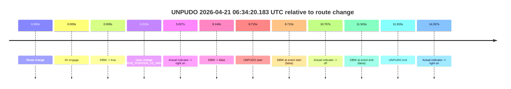
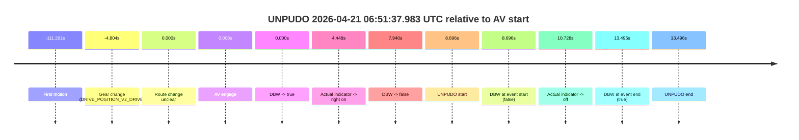
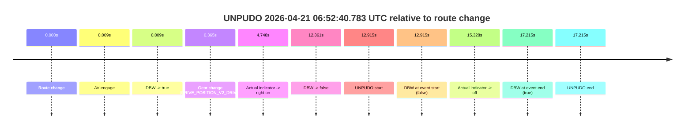

# Run Report: fme20032/2026-04-21--06-21-59--gen2-av-dc89c904-bd1e-45df-a584-41784b2b2a5a

| Field | Value |
|---|---|
| Run ID | `fme20032/2026-04-21--06-21-59--gen2-av-dc89c904-bd1e-45df-a584-41784b2b2a5a` |
| Date | `2026-04-21` |
| Model(s) | `pink-manta-ray-smooth` |
| Author | `guy.geva` |
| Event count | `4` |

## unpudo 2026-04-21 06:31:11.983 UTC

| Field | Value |
|---|---|
| Model | `pink-manta-ray-smooth` |
| Author | `guy.geva` |
| Run ID | `fme20032/2026-04-21--06-21-59--gen2-av-dc89c904-bd1e-45df-a584-41784b2b2a5a` |
| Date | `2026-04-21` |
| Time (UTC) | `06:31:11.983` |
| Event type | `unpudo` |
| Disengagement type | `none observed` |
| Route change | `found` |
| Console | [run](https://console.sso.wayve.ai/run/fme20032/2026-04-21--06-21-59--gen2-av-dc89c904-bd1e-45df-a584-41784b2b2a5a?id=&time-unixus=1776753071983322) |
| Foxglove | [segment](https://app.foxglove.dev/wayve-on-prem/p/prj_0dX18KZdVHg1fmmI/view?ds=foxglove-stream&ds.deviceName=fme20032&ds.start=2026-04-21T06%3A30%3A48.368241Z&ds.end=2026-04-21T06%3A31%3A34.383313Z&layoutId=lay_0e7VD4WIKDQGU73Y&time=2026-04-21T06%3A31%3A11.983322Z) |

### Event card: fail

- Fail: the credited unpudo does not stay AV-owned. The event window starts with DBW false, and the maneuver outcome lands outside a clean AV-owned segment.

| Event | Time (UTC) | Delta from route change |
|---|---:|---:|
| Route change | 2026-04-21 06:30:58.368 | `0.000s` |
| AV engage | 2026-04-21 06:30:58.377 | `0.009s` |
| DBW -> true | 2026-04-21 06:30:58.377 | `0.009s` |
| Gear change (DRIVE_POSITION_V2_DRIVE) | 2026-04-21 06:30:58.583 | `0.215s` |
| Actual indicator -> right on | 2026-04-21 06:31:04.816 | `6.448s` |
| DBW -> false | 2026-04-21 06:31:09.868 | `11.500s` |
| UNPUDO start | 2026-04-21 06:31:11.983 | `13.615s` |
| DBW at event start (false) | 2026-04-21 06:31:11.983 | `13.615s` |
| Actual indicator -> off | 2026-04-21 06:31:20.056 | `21.688s` |
| DBW at event end (false) | 2026-04-21 06:31:24.383 | `26.015s` |
| UNPUDO end | 2026-04-21 06:31:24.383 | `26.015s` |

| Metric | Value |
|---|---|
| Outcome | `fail` |
| Effective failure type | `not_av_owned` |
| Route change status | `found` |
| DBW at event start | `false` |
| DBW at event end | `false` |
| Predicted gear at AV start | `DRIVE_POSITION_V2_PARK` |
| Actual gear at AV start | `DRIVE_POSITION_V2_PARK` |
| Predicted gear at event start | `DRIVE_POSITION_V2_DRIVE` |
| Actual gear at event start | `DRIVE_POSITION_V2_DRIVE` |
| Planned indicator direction | `INDICATORS_STATE_V2_OFF` |
| Controller indicator direction | `INDICATORS_STATE_V2_OFF` |
| Actual indicator direction | `INDICATORS_STATE_V2_RIGHT_ON` |
| Actual indicator at maneuver end | `INDICATORS_STATE_V2_OFF` |
| Driver accel help in AV | `false` |
| Driver accel help timestamp | `n/a` |
| Max accel pedal pct in AV | `0.0%` |
| Max brake pedal pct in AV | `8.0%` |
| Max speed mps in AV | `0.000` |
| Success timing baseline | `route change` |
| Route -> AV | `0.009s` |
| AV -> event start | `13.606s` |
| AV -> first motion | `n/a` |
| Success baseline -> event start | `13.615s` |
| Success baseline -> first motion | `n/a` |
| AV duration before disengagement | `11.490s` |
| Trajectory waypoint count | `36` |
| Driving-plan step count | `11` |

The scored portion starts from the AV-owned window, not from the pre-AV setup. Route-change search in the stopped pre-event segment was `found`, with the baseline therefore set to route change. At the event anchor the model predicts `DRIVE_POSITION_V2_DRIVE` and the actual gear is `DRIVE_POSITION_V2_DRIVE`. The effective model outcome is `fail` because `not_av_owned.`

### Resolution

| Field | Value |
|---|---|
| Final outcome | `fail` |
| Do we agree with this label? | `yes` |
| Source disengagement type | `none observed` |
| Resolved effective failure type | `not_av_owned` |
| Confidence | `high` |

## unpudo 2026-04-21 06:34:20.183 UTC

| Field | Value |
|---|---|
| Model | `pink-manta-ray-smooth` |
| Author | `guy.geva` |
| Run ID | `fme20032/2026-04-21--06-21-59--gen2-av-dc89c904-bd1e-45df-a584-41784b2b2a5a` |
| Date | `2026-04-21` |
| Time (UTC) | `06:34:20.183` |
| Event type | `unpudo` |
| Disengagement type | `none observed` |
| Route change | `found` |
| Console | [run](https://console.sso.wayve.ai/run/fme20032/2026-04-21--06-21-59--gen2-av-dc89c904-bd1e-45df-a584-41784b2b2a5a?id=&time-unixus=1776753260183307) |
| Foxglove | [segment](https://app.foxglove.dev/wayve-on-prem/p/prj_0dX18KZdVHg1fmmI/view?ds=foxglove-stream&ds.deviceName=fme20032&ds.start=2026-04-21T06%3A34%3A01.468316Z&ds.end=2026-04-21T06%3A34%3A33.383299Z&layoutId=lay_0e7VD4WIKDQGU73Y&time=2026-04-21T06%3A34%3A20.183307Z) |

### Event card: fail

- Fail: the credited unpudo does not stay AV-owned. The event window starts with DBW false, and the maneuver outcome lands outside a clean AV-owned segment.

| Event | Time (UTC) | Delta from route change |
|---|---:|---:|
| Route change | 2026-04-21 06:34:11.468 | `0.000s` |
| AV engage | 2026-04-21 06:34:11.477 | `0.009s` |
| DBW -> true | 2026-04-21 06:34:11.477 | `0.009s` |
| Gear change (DRIVE_POSITION_V2_DRIVE) | 2026-04-21 06:34:11.783 | `0.315s` |
| Actual indicator -> right on | 2026-04-21 06:34:16.495 | `5.027s` |
| DBW -> false | 2026-04-21 06:34:19.608 | `8.140s` |
| UNPUDO start | 2026-04-21 06:34:20.183 | `8.715s` |
| DBW at event start (false) | 2026-04-21 06:34:20.183 | `8.715s` |
| Actual indicator -> off | 2026-04-21 06:34:22.175 | `10.707s` |
| DBW at event end (false) | 2026-04-21 06:34:23.383 | `11.915s` |
| UNPUDO end | 2026-04-21 06:34:23.383 | `11.915s` |
| Actual indicator -> right on | 2026-04-21 06:34:25.735 | `14.267s` |

| Metric | Value |
|---|---|
| Outcome | `fail` |
| Effective failure type | `not_av_owned` |
| Route change status | `found` |
| DBW at event start | `false` |
| DBW at event end | `false` |
| Predicted gear at AV start | `DRIVE_POSITION_V2_PARK` |
| Actual gear at AV start | `DRIVE_POSITION_V2_PARK` |
| Predicted gear at event start | `DRIVE_POSITION_V2_DRIVE` |
| Actual gear at event start | `DRIVE_POSITION_V2_DRIVE` |
| Planned indicator direction | `INDICATORS_STATE_V2_LEFT_ON` |
| Controller indicator direction | `INDICATORS_STATE_V2_LEFT_ON` |
| Actual indicator direction | `INDICATORS_STATE_V2_RIGHT_ON` |
| Actual indicator at maneuver end | `INDICATORS_STATE_V2_OFF` |
| Driver accel help in AV | `false` |
| Driver accel help timestamp | `n/a` |
| Max accel pedal pct in AV | `0.0%` |
| Max brake pedal pct in AV | `8.0%` |
| Max speed mps in AV | `0.000` |
| Success timing baseline | `route change` |
| Route -> AV | `0.009s` |
| AV -> event start | `8.706s` |
| AV -> first motion | `n/a` |
| Success baseline -> event start | `8.715s` |
| Success baseline -> first motion | `n/a` |
| AV duration before disengagement | `8.131s` |
| Trajectory waypoint count | `36` |
| Driving-plan step count | `11` |

The scored portion starts from the AV-owned window, not from the pre-AV setup. Route-change search in the stopped pre-event segment was `found`, with the baseline therefore set to route change. At the event anchor the model predicts `DRIVE_POSITION_V2_DRIVE` and the actual gear is `DRIVE_POSITION_V2_DRIVE`. The effective model outcome is `fail` because `not_av_owned.`

### Resolution

| Field | Value |
|---|---|
| Final outcome | `fail` |
| Do we agree with this label? | `yes` |
| Source disengagement type | `none observed` |
| Resolved effective failure type | `not_av_owned` |
| Confidence | `high` |

## unpudo 2026-04-21 06:51:37.983 UTC

| Field | Value |
|---|---|
| Model | `pink-manta-ray-smooth` |
| Author | `guy.geva` |
| Run ID | `fme20032/2026-04-21--06-21-59--gen2-av-dc89c904-bd1e-45df-a584-41784b2b2a5a` |
| Date | `2026-04-21` |
| Time (UTC) | `06:51:37.983` |
| Event type | `unpudo` |
| Disengagement type | `none observed` |
| Route change | `unclear` |
| Console | [run](https://console.sso.wayve.ai/run/fme20032/2026-04-21--06-21-59--gen2-av-dc89c904-bd1e-45df-a584-41784b2b2a5a?id=&time-unixus=1776754297983303) |
| Foxglove | [segment](https://app.foxglove.dev/wayve-on-prem/p/prj_0dX18KZdVHg1fmmI/view?ds=foxglove-stream&ds.deviceName=fme20032&ds.start=2026-04-21T06%3A51%3A14.483306Z&ds.end=2026-04-21T06%3A51%3A52.783320Z&layoutId=lay_0e7VD4WIKDQGU73Y&time=2026-04-21T06%3A51%3A37.983303Z) |

### Event card: fail

- Fail: the credited unpudo does not stay AV-owned. The event window starts with DBW false, and the maneuver outcome lands outside a clean AV-owned segment.

| Event | Time (UTC) | Delta from AV start |
|---|---:|---:|
| First motion | 2026-04-21 06:49:37.996 | `-111.291s` |
| Gear change (DRIVE_POSITION_V2_DRIVE) | 2026-04-21 06:51:24.483 | `-4.804s` |
| Route change unclear | 2026-04-21 06:51:29.287 | `0.000s` |
| AV engage | 2026-04-21 06:51:29.287 | `0.000s` |
| DBW -> true | 2026-04-21 06:51:29.287 | `0.000s` |
| Actual indicator -> right on | 2026-04-21 06:51:33.735 | `4.448s` |
| DBW -> false | 2026-04-21 06:51:37.227 | `7.940s` |
| UNPUDO start | 2026-04-21 06:51:37.983 | `8.696s` |
| DBW at event start (false) | 2026-04-21 06:51:37.983 | `8.696s` |
| Actual indicator -> off | 2026-04-21 06:51:40.015 | `10.728s` |
| DBW at event end (true) | 2026-04-21 06:51:42.783 | `13.496s` |
| UNPUDO end | 2026-04-21 06:51:42.783 | `13.496s` |

| Metric | Value |
|---|---|
| Outcome | `fail` |
| Effective failure type | `completed_outside_av` |
| Route change status | `unclear` |
| DBW at event start | `false` |
| DBW at event end | `true` |
| Predicted gear at AV start | `DRIVE_POSITION_V2_DRIVE` |
| Actual gear at AV start | `DRIVE_POSITION_V2_DRIVE` |
| Predicted gear at event start | `DRIVE_POSITION_V2_DRIVE` |
| Actual gear at event start | `DRIVE_POSITION_V2_DRIVE` |
| Planned indicator direction | `INDICATORS_STATE_V2_RIGHT_ON` |
| Controller indicator direction | `INDICATORS_STATE_V2_RIGHT_ON` |
| Actual indicator direction | `INDICATORS_STATE_V2_RIGHT_ON` |
| Actual indicator at maneuver end | `INDICATORS_STATE_V2_OFF` |
| Driver accel help in AV | `false` |
| Driver accel help timestamp | `n/a` |
| Max accel pedal pct in AV | `0.0%` |
| Max brake pedal pct in AV | `9.0%` |
| Max speed mps in AV | `0.000` |
| Success timing baseline | `AV start` |
| Route -> AV | `n/a` |
| AV -> event start | `8.696s` |
| AV -> first motion | `-111.291s` |
| Success baseline -> event start | `8.696s` |
| Success baseline -> first motion | `-111.291s` |
| AV duration before disengagement | `7.940s` |
| Trajectory waypoint count | `36` |
| Driving-plan step count | `11` |

The scored portion starts from the AV-owned window, not from the pre-AV setup. Route-change search in the stopped pre-event segment was `unclear`, with the baseline therefore set to AV start. At the event anchor the model predicts `DRIVE_POSITION_V2_DRIVE` and the actual gear is `DRIVE_POSITION_V2_DRIVE`. The effective model outcome is `fail` because `completed_outside_av.`

### Resolution

| Field | Value |
|---|---|
| Final outcome | `fail` |
| Do we agree with this label? | `yes` |
| Source disengagement type | `none observed` |
| Resolved effective failure type | `completed_outside_av` |
| Confidence | `medium` |

## unpudo 2026-04-21 06:52:40.783 UTC

| Field | Value |
|---|---|
| Model | `pink-manta-ray-smooth` |
| Author | `guy.geva` |
| Run ID | `fme20032/2026-04-21--06-21-59--gen2-av-dc89c904-bd1e-45df-a584-41784b2b2a5a` |
| Date | `2026-04-21` |
| Time (UTC) | `06:52:40.783` |
| Event type | `unpudo` |
| Disengagement type | `none observed` |
| Route change | `found` |
| Console | [run](https://console.sso.wayve.ai/run/fme20032/2026-04-21--06-21-59--gen2-av-dc89c904-bd1e-45df-a584-41784b2b2a5a?id=&time-unixus=1776754360783326) |
| Foxglove | [segment](https://app.foxglove.dev/wayve-on-prem/p/prj_0dX18KZdVHg1fmmI/view?ds=foxglove-stream&ds.deviceName=fme20032&ds.start=2026-04-21T06%3A52%3A17.868269Z&ds.end=2026-04-21T06%3A52%3A55.083304Z&layoutId=lay_0e7VD4WIKDQGU73Y&time=2026-04-21T06%3A52%3A40.783326Z) |

### Event card: fail

- Fail: the credited unpudo does not stay AV-owned. The event window starts with DBW false, and the maneuver outcome lands outside a clean AV-owned segment.

| Event | Time (UTC) | Delta from route change |
|---|---:|---:|
| Route change | 2026-04-21 06:52:27.868 | `0.000s` |
| AV engage | 2026-04-21 06:52:27.877 | `0.009s` |
| DBW -> true | 2026-04-21 06:52:27.877 | `0.009s` |
| Gear change (DRIVE_POSITION_V2_DRIVE) | 2026-04-21 06:52:28.233 | `0.365s` |
| Actual indicator -> right on | 2026-04-21 06:52:32.615 | `4.748s` |
| DBW -> false | 2026-04-21 06:52:40.229 | `12.361s` |
| UNPUDO start | 2026-04-21 06:52:40.783 | `12.915s` |
| DBW at event start (false) | 2026-04-21 06:52:40.783 | `12.915s` |
| Actual indicator -> off | 2026-04-21 06:52:43.195 | `15.328s` |
| DBW at event end (true) | 2026-04-21 06:52:45.083 | `17.215s` |
| UNPUDO end | 2026-04-21 06:52:45.083 | `17.215s` |

| Metric | Value |
|---|---|
| Outcome | `fail` |
| Effective failure type | `not_av_owned` |
| Route change status | `found` |
| DBW at event start | `false` |
| DBW at event end | `true` |
| Predicted gear at AV start | `DRIVE_POSITION_V2_PARK` |
| Actual gear at AV start | `DRIVE_POSITION_V2_PARK` |
| Predicted gear at event start | `DRIVE_POSITION_V2_DRIVE` |
| Actual gear at event start | `DRIVE_POSITION_V2_DRIVE` |
| Planned indicator direction | `INDICATORS_STATE_V2_LEFT_ON` |
| Controller indicator direction | `INDICATORS_STATE_V2_LEFT_ON` |
| Actual indicator direction | `INDICATORS_STATE_V2_RIGHT_ON` |
| Actual indicator at maneuver end | `INDICATORS_STATE_V2_OFF` |
| Driver accel help in AV | `false` |
| Driver accel help timestamp | `n/a` |
| Max accel pedal pct in AV | `0.0%` |
| Max brake pedal pct in AV | `9.4%` |
| Max speed mps in AV | `0.000` |
| Success timing baseline | `route change` |
| Route -> AV | `0.009s` |
| AV -> event start | `12.906s` |
| AV -> first motion | `n/a` |
| Success baseline -> event start | `12.915s` |
| Success baseline -> first motion | `n/a` |
| AV duration before disengagement | `12.352s` |
| Trajectory waypoint count | `36` |
| Driving-plan step count | `11` |

The scored portion starts from the AV-owned window, not from the pre-AV setup. Route-change search in the stopped pre-event segment was `found`, with the baseline therefore set to route change. At the event anchor the model predicts `DRIVE_POSITION_V2_DRIVE` and the actual gear is `DRIVE_POSITION_V2_DRIVE`. The effective model outcome is `fail` because `not_av_owned.`

### Resolution

| Field | Value |
|---|---|
| Final outcome | `fail` |
| Do we agree with this label? | `yes` |
| Source disengagement type | `none observed` |
| Resolved effective failure type | `not_av_owned` |
| Confidence | `high` |
