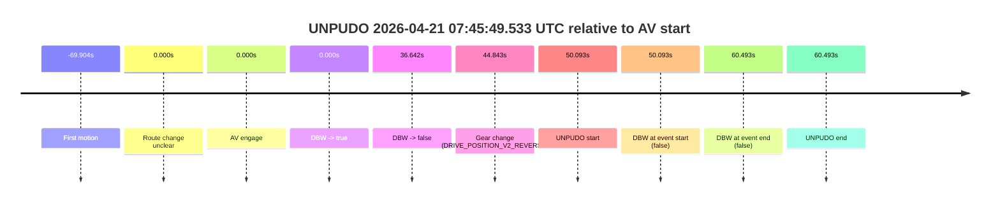
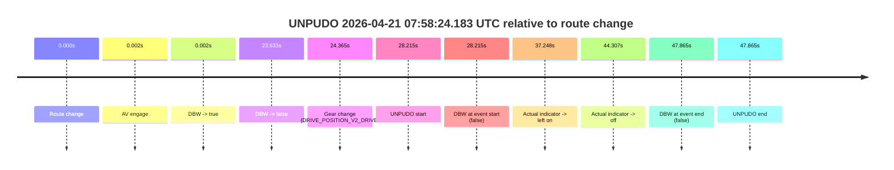
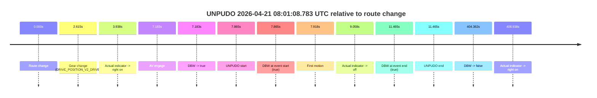
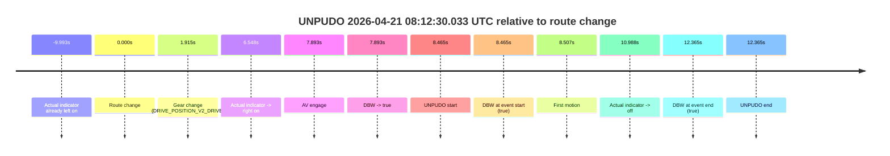
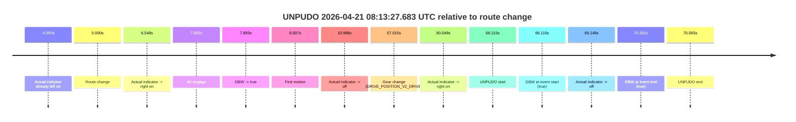

# Run Report: fme20032/2026-04-21--07-32-06--gen2-av-6b2228e6-9d34-4978-b743-0d762038e024

| Field | Value |
|---|---|
| Run ID | `fme20032/2026-04-21--07-32-06--gen2-av-6b2228e6-9d34-4978-b743-0d762038e024` |
| Date | `2026-04-21` |
| Model(s) | `eel-teal-outspoken` |
| Author | `zak` |
| Event count | `5` |

## unpudo 2026-04-21 07:45:49.533 UTC

| Field | Value |
|---|---|
| Model | `eel-teal-outspoken` |
| Author | `zak` |
| Run ID | `fme20032/2026-04-21--07-32-06--gen2-av-6b2228e6-9d34-4978-b743-0d762038e024` |
| Date | `2026-04-21` |
| Time (UTC) | `07:45:49.533` |
| Event type | `unpudo` |
| Disengagement type | `none observed` |
| Route change | `unclear` |
| Console | [run](https://console.sso.wayve.ai/run/fme20032/2026-04-21--07-32-06--gen2-av-6b2228e6-9d34-4978-b743-0d762038e024?id=&time-unixus=1776757549533319) |
| Foxglove | [segment](https://app.foxglove.dev/wayve-on-prem/p/prj_0dX18KZdVHg1fmmI/view?ds=foxglove-stream&ds.deviceName=fme20032&ds.start=2026-04-21T07%3A44%3A49.440045Z&ds.end=2026-04-21T07%3A46%3A09.933309Z&layoutId=lay_0e7VD4WIKDQGU73Y&time=2026-04-21T07%3A45%3A49.533319Z) |

### Event card: fail

- Fail: the credited unpudo does not stay AV-owned. The event window starts with DBW false, and the maneuver outcome lands outside a clean AV-owned segment.

| Event | Time (UTC) | Delta from AV start |
|---|---:|---:|
| First motion | 2026-04-21 07:43:49.535 | `-69.904s` |
| Route change unclear | 2026-04-21 07:44:59.440 | `0.000s` |
| AV engage | 2026-04-21 07:44:59.440 | `0.000s` |
| DBW -> true | 2026-04-21 07:44:59.440 | `0.000s` |
| DBW -> false | 2026-04-21 07:45:36.082 | `36.642s` |
| Gear change (DRIVE_POSITION_V2_REVERSE) | 2026-04-21 07:45:44.283 | `44.843s` |
| UNPUDO start | 2026-04-21 07:45:49.533 | `50.093s` |
| DBW at event start (false) | 2026-04-21 07:45:49.533 | `50.093s` |
| DBW at event end (false) | 2026-04-21 07:45:59.933 | `60.493s` |
| UNPUDO end | 2026-04-21 07:45:59.933 | `60.493s` |

| Metric | Value |
|---|---|
| Outcome | `fail` |
| Effective failure type | `completed_outside_av` |
| Route change status | `unclear` |
| DBW at event start | `false` |
| DBW at event end | `false` |
| Predicted gear at AV start | `DRIVE_POSITION_V2_DRIVE` |
| Actual gear at AV start | `DRIVE_POSITION_V2_DRIVE` |
| Predicted gear at event start | `DRIVE_POSITION_V2_REVERSE` |
| Actual gear at event start | `DRIVE_POSITION_V2_REVERSE` |
| Planned indicator direction | `INDICATORS_STATE_V2_OFF` |
| Controller indicator direction | `INDICATORS_STATE_V2_OFF` |
| Actual indicator direction | `INDICATORS_STATE_V2_OFF` |
| Actual indicator at maneuver end | `INDICATORS_STATE_V2_OFF` |
| Driver accel help in AV | `false` |
| Driver accel help timestamp | `n/a` |
| Max accel pedal pct in AV | `0.0%` |
| Max brake pedal pct in AV | `0.0%` |
| Max speed mps in AV | `6.786` |
| Success timing baseline | `AV start` |
| Route -> AV | `n/a` |
| AV -> event start | `50.093s` |
| AV -> first motion | `-69.904s` |
| Success baseline -> event start | `50.093s` |
| Success baseline -> first motion | `-69.904s` |
| AV duration before disengagement | `36.642s` |
| Trajectory waypoint count | `38` |
| Driving-plan step count | `11` |

The scored portion starts from the AV-owned window, not from the pre-AV setup. Route-change search in the stopped pre-event segment was `unclear`, with the baseline therefore set to AV start. At the event anchor the model predicts `DRIVE_POSITION_V2_REVERSE` and the actual gear is `DRIVE_POSITION_V2_REVERSE`. The effective model outcome is `fail` because `completed_outside_av.`

### Resolution

| Field | Value |
|---|---|
| Final outcome | `fail` |
| Do we agree with this label? | `yes` |
| Source disengagement type | `none observed` |
| Resolved effective failure type | `completed_outside_av` |
| Confidence | `medium` |

## unpudo 2026-04-21 07:58:24.183 UTC

| Field | Value |
|---|---|
| Model | `eel-teal-outspoken` |
| Author | `zak` |
| Run ID | `fme20032/2026-04-21--07-32-06--gen2-av-6b2228e6-9d34-4978-b743-0d762038e024` |
| Date | `2026-04-21` |
| Time (UTC) | `07:58:24.183` |
| Event type | `unpudo` |
| Disengagement type | `none observed` |
| Route change | `found` |
| Console | [run](https://console.sso.wayve.ai/run/fme20032/2026-04-21--07-32-06--gen2-av-6b2228e6-9d34-4978-b743-0d762038e024?id=&time-unixus=1776758304183302) |
| Foxglove | [segment](https://app.foxglove.dev/wayve-on-prem/p/prj_0dX18KZdVHg1fmmI/view?ds=foxglove-stream&ds.deviceName=fme20032&ds.start=2026-04-21T07%3A57%3A45.968280Z&ds.end=2026-04-21T07%3A58%3A53.833296Z&layoutId=lay_0e7VD4WIKDQGU73Y&time=2026-04-21T07%3A58%3A24.183302Z) |

### Event card: fail

- Fail: the credited unpudo does not stay AV-owned. The event window starts with DBW false, and the maneuver outcome lands outside a clean AV-owned segment.

| Event | Time (UTC) | Delta from route change |
|---|---:|---:|
| Route change | 2026-04-21 07:57:55.968 | `0.000s` |
| AV engage | 2026-04-21 07:57:55.970 | `0.002s` |
| DBW -> true | 2026-04-21 07:57:55.970 | `0.002s` |
| DBW -> false | 2026-04-21 07:58:19.600 | `23.633s` |
| Gear change (DRIVE_POSITION_V2_DRIVE) | 2026-04-21 07:58:20.333 | `24.365s` |
| UNPUDO start | 2026-04-21 07:58:24.183 | `28.215s` |
| DBW at event start (false) | 2026-04-21 07:58:24.183 | `28.215s` |
| Actual indicator -> left on | 2026-04-21 07:58:33.215 | `37.248s` |
| Actual indicator -> off | 2026-04-21 07:58:40.275 | `44.307s` |
| DBW at event end (false) | 2026-04-21 07:58:43.833 | `47.865s` |
| UNPUDO end | 2026-04-21 07:58:43.833 | `47.865s` |

| Metric | Value |
|---|---|
| Outcome | `fail` |
| Effective failure type | `not_av_owned` |
| Route change status | `found` |
| DBW at event start | `false` |
| DBW at event end | `false` |
| Predicted gear at AV start | `DRIVE_POSITION_V2_PARK` |
| Actual gear at AV start | `DRIVE_POSITION_V2_PARK` |
| Predicted gear at event start | `DRIVE_POSITION_V2_DRIVE` |
| Actual gear at event start | `DRIVE_POSITION_V2_DRIVE` |
| Planned indicator direction | `INDICATORS_STATE_V2_OFF` |
| Controller indicator direction | `INDICATORS_STATE_V2_OFF` |
| Actual indicator direction | `INDICATORS_STATE_V2_OFF` |
| Actual indicator at maneuver end | `INDICATORS_STATE_V2_OFF` |
| Driver accel help in AV | `false` |
| Driver accel help timestamp | `n/a` |
| Max accel pedal pct in AV | `0.0%` |
| Max brake pedal pct in AV | `8.0%` |
| Max speed mps in AV | `0.000` |
| Success timing baseline | `route change` |
| Route -> AV | `0.002s` |
| AV -> event start | `28.213s` |
| AV -> first motion | `n/a` |
| Success baseline -> event start | `28.215s` |
| Success baseline -> first motion | `n/a` |
| AV duration before disengagement | `23.631s` |
| Trajectory waypoint count | `37` |
| Driving-plan step count | `11` |

The scored portion starts from the AV-owned window, not from the pre-AV setup. Route-change search in the stopped pre-event segment was `found`, with the baseline therefore set to route change. At the event anchor the model predicts `DRIVE_POSITION_V2_DRIVE` and the actual gear is `DRIVE_POSITION_V2_DRIVE`. The effective model outcome is `fail` because `not_av_owned.`

### Resolution

| Field | Value |
|---|---|
| Final outcome | `fail` |
| Do we agree with this label? | `yes` |
| Source disengagement type | `none observed` |
| Resolved effective failure type | `not_av_owned` |
| Confidence | `high` |

## unpudo 2026-04-21 08:01:08.783 UTC

| Field | Value |
|---|---|
| Model | `eel-teal-outspoken` |
| Author | `zak` |
| Run ID | `fme20032/2026-04-21--07-32-06--gen2-av-6b2228e6-9d34-4978-b743-0d762038e024` |
| Date | `2026-04-21` |
| Time (UTC) | `08:01:08.783` |
| Event type | `unpudo` |
| Disengagement type | `none observed` |
| Route change | `found` |
| Console | [run](https://console.sso.wayve.ai/run/fme20032/2026-04-21--07-32-06--gen2-av-6b2228e6-9d34-4978-b743-0d762038e024?id=&time-unixus=1776758468783321) |
| Foxglove | [segment](https://app.foxglove.dev/wayve-on-prem/p/prj_0dX18KZdVHg1fmmI/view?ds=foxglove-stream&ds.deviceName=fme20032&ds.start=2026-04-21T08%3A00%3A50.918291Z&ds.end=2026-04-21T08%3A07%3A55.280648Z&layoutId=lay_0e7VD4WIKDQGU73Y&time=2026-04-21T08%3A01%3A08.783321Z) |

### Event card: pass

- Pass: AV owns the credited unpudo from route change through the official unpudo window, the gear state is aligned at the anchor, and the vehicle moves without driver accelerator help in AV.

| Event | Time (UTC) | Delta from route change |
|---|---:|---:|
| Route change | 2026-04-21 08:01:00.918 | `0.000s` |
| Gear change (DRIVE_POSITION_V2_DRIVE) | 2026-04-21 08:01:03.533 | `2.615s` |
| Actual indicator -> right on | 2026-04-21 08:01:04.855 | `3.938s` |
| AV engage | 2026-04-21 08:01:08.100 | `7.183s` |
| DBW -> true | 2026-04-21 08:01:08.100 | `7.183s` |
| UNPUDO start | 2026-04-21 08:01:08.783 | `7.865s` |
| DBW at event start (true) | 2026-04-21 08:01:08.783 | `7.865s` |
| First motion | 2026-04-21 08:01:08.835 | `7.918s` |
| Actual indicator -> off | 2026-04-21 08:01:09.975 | `9.058s` |
| DBW at event end (true) | 2026-04-21 08:01:12.383 | `11.465s` |
| UNPUDO end | 2026-04-21 08:01:12.383 | `11.465s` |
| DBW -> false | 2026-04-21 08:07:45.280 | `404.362s` |
| Actual indicator -> right on | 2026-04-21 08:07:49.855 | `408.938s` |

| Metric | Value |
|---|---|
| Outcome | `pass` |
| Effective failure type | `none` |
| Route change status | `found` |
| DBW at event start | `true` |
| DBW at event end | `true` |
| Predicted gear at AV start | `DRIVE_POSITION_V2_DRIVE` |
| Actual gear at AV start | `DRIVE_POSITION_V2_DRIVE` |
| Predicted gear at event start | `DRIVE_POSITION_V2_DRIVE` |
| Actual gear at event start | `DRIVE_POSITION_V2_DRIVE` |
| Planned indicator direction | `INDICATORS_STATE_V2_RIGHT_ON` |
| Controller indicator direction | `INDICATORS_STATE_V2_RIGHT_ON` |
| Actual indicator direction | `INDICATORS_STATE_V2_RIGHT_ON` |
| Actual indicator at maneuver end | `INDICATORS_STATE_V2_OFF` |
| Driver accel help in AV | `false` |
| Driver accel help timestamp | `n/a` |
| Max accel pedal pct in AV | `0.0%` |
| Max brake pedal pct in AV | `0.0%` |
| Max speed mps in AV | `4.906` |
| Success timing baseline | `route change` |
| Route -> AV | `7.183s` |
| AV -> event start | `0.682s` |
| AV -> first motion | `0.735s` |
| Success baseline -> event start | `7.865s` |
| Success baseline -> first motion | `7.918s` |
| AV duration before disengagement | `397.180s` |
| Trajectory waypoint count | `37` |
| Driving-plan step count | `11` |

The scored portion starts from the AV-owned window, not from the pre-AV setup. Route-change search in the stopped pre-event segment was `found`, with the baseline therefore set to route change. At the event anchor the model predicts `DRIVE_POSITION_V2_DRIVE` and the actual gear is `DRIVE_POSITION_V2_DRIVE`. The effective model outcome is `pass` because `the credited unpudo stays AV-owned through the official unpudo window.`

### Resolution

| Field | Value |
|---|---|
| Final outcome | `pass` |
| Do we agree with this label? | `yes` |
| Source disengagement type | `none observed` |
| Resolved effective failure type | `none` |
| Confidence | `high` |

## unpudo 2026-04-21 08:12:30.033 UTC

| Field | Value |
|---|---|
| Model | `eel-teal-outspoken` |
| Author | `zak` |
| Run ID | `fme20032/2026-04-21--07-32-06--gen2-av-6b2228e6-9d34-4978-b743-0d762038e024` |
| Date | `2026-04-21` |
| Time (UTC) | `08:12:30.033` |
| Event type | `unpudo` |
| Disengagement type | `none observed` |
| Route change | `found` |
| Console | [run](https://console.sso.wayve.ai/run/fme20032/2026-04-21--07-32-06--gen2-av-6b2228e6-9d34-4978-b743-0d762038e024?id=&time-unixus=1776759150033327) |
| Foxglove | [segment](https://app.foxglove.dev/wayve-on-prem/p/prj_0dX18KZdVHg1fmmI/view?ds=foxglove-stream&ds.deviceName=fme20032&ds.start=2026-04-21T08%3A12%3A11.568337Z&ds.end=2026-04-21T08%3A12%3A43.933325Z&layoutId=lay_0e7VD4WIKDQGU73Y&time=2026-04-21T08%3A12%3A30.033327Z) |

### Event card: pass

- Pass: AV owns the credited unpudo from route change through the official unpudo window, the gear state is aligned at the anchor, and the vehicle moves without driver accelerator help in AV.

| Event | Time (UTC) | Delta from route change |
|---|---:|---:|
| Actual indicator already left on | 2026-04-21 08:12:11.575 | `-9.993s` |
| Route change | 2026-04-21 08:12:21.568 | `0.000s` |
| Gear change (DRIVE_POSITION_V2_DRIVE) | 2026-04-21 08:12:23.483 | `1.915s` |
| Actual indicator -> right on | 2026-04-21 08:12:28.115 | `6.548s` |
| AV engage | 2026-04-21 08:12:29.460 | `7.893s` |
| DBW -> true | 2026-04-21 08:12:29.460 | `7.893s` |
| UNPUDO start | 2026-04-21 08:12:30.033 | `8.465s` |
| DBW at event start (true) | 2026-04-21 08:12:30.033 | `8.465s` |
| First motion | 2026-04-21 08:12:30.075 | `8.507s` |
| Actual indicator -> off | 2026-04-21 08:12:32.556 | `10.988s` |
| DBW at event end (true) | 2026-04-21 08:12:33.933 | `12.365s` |
| UNPUDO end | 2026-04-21 08:12:33.933 | `12.365s` |

| Metric | Value |
|---|---|
| Outcome | `pass` |
| Effective failure type | `none` |
| Route change status | `found` |
| DBW at event start | `true` |
| DBW at event end | `true` |
| Predicted gear at AV start | `DRIVE_POSITION_V2_DRIVE` |
| Actual gear at AV start | `DRIVE_POSITION_V2_DRIVE` |
| Predicted gear at event start | `DRIVE_POSITION_V2_DRIVE` |
| Actual gear at event start | `DRIVE_POSITION_V2_DRIVE` |
| Planned indicator direction | `INDICATORS_STATE_V2_RIGHT_ON` |
| Controller indicator direction | `INDICATORS_STATE_V2_RIGHT_ON` |
| Actual indicator direction | `INDICATORS_STATE_V2_RIGHT_ON` |
| Actual indicator at maneuver end | `INDICATORS_STATE_V2_OFF` |
| Driver accel help in AV | `false` |
| Driver accel help timestamp | `n/a` |
| Max accel pedal pct in AV | `0.0%` |
| Max brake pedal pct in AV | `0.0%` |
| Max speed mps in AV | `3.567` |
| Success timing baseline | `route change` |
| Route -> AV | `7.893s` |
| AV -> event start | `0.572s` |
| AV -> first motion | `0.615s` |
| Success baseline -> event start | `8.465s` |
| Success baseline -> first motion | `8.507s` |
| AV duration before disengagement | `n/a` |
| Trajectory waypoint count | `36` |
| Driving-plan step count | `11` |

The scored portion starts from the AV-owned window, not from the pre-AV setup. Route-change search in the stopped pre-event segment was `found`, with the baseline therefore set to route change. At the event anchor the model predicts `DRIVE_POSITION_V2_DRIVE` and the actual gear is `DRIVE_POSITION_V2_DRIVE`. The effective model outcome is `pass` because `the credited unpudo stays AV-owned through the official unpudo window.`

### Resolution

| Field | Value |
|---|---|
| Final outcome | `pass` |
| Do we agree with this label? | `yes` |
| Source disengagement type | `none observed` |
| Resolved effective failure type | `none` |
| Confidence | `high` |

## unpudo 2026-04-21 08:13:27.683 UTC

| Field | Value |
|---|---|
| Model | `eel-teal-outspoken` |
| Author | `zak` |
| Run ID | `fme20032/2026-04-21--07-32-06--gen2-av-6b2228e6-9d34-4978-b743-0d762038e024` |
| Date | `2026-04-21` |
| Time (UTC) | `08:13:27.683` |
| Event type | `unpudo` |
| Disengagement type | `none observed` |
| Route change | `found` |
| Console | [run](https://console.sso.wayve.ai/run/fme20032/2026-04-21--07-32-06--gen2-av-6b2228e6-9d34-4978-b743-0d762038e024?id=&time-unixus=1776759207683311) |
| Foxglove | [segment](https://app.foxglove.dev/wayve-on-prem/p/prj_0dX18KZdVHg1fmmI/view?ds=foxglove-stream&ds.deviceName=fme20032&ds.start=2026-04-21T08%3A12%3A11.568337Z&ds.end=2026-04-21T08%3A13%3A42.133296Z&layoutId=lay_0e7VD4WIKDQGU73Y&time=2026-04-21T08%3A13%3A27.683311Z) |

### Event card: pass

- Pass: AV owns the credited unpudo from route change through the official unpudo window, the gear state is aligned at the anchor, and the vehicle moves without driver accelerator help in AV.

| Event | Time (UTC) | Delta from route change |
|---|---:|---:|
| Actual indicator already left on | 2026-04-21 08:12:11.575 | `-9.993s` |
| Route change | 2026-04-21 08:12:21.568 | `0.000s` |
| Actual indicator -> right on | 2026-04-21 08:12:28.115 | `6.548s` |
| AV engage | 2026-04-21 08:12:29.460 | `7.893s` |
| DBW -> true | 2026-04-21 08:12:29.460 | `7.893s` |
| First motion | 2026-04-21 08:12:30.075 | `8.507s` |
| Actual indicator -> off | 2026-04-21 08:12:32.556 | `10.988s` |
| Gear change (DRIVE_POSITION_V2_DRIVE) | 2026-04-21 08:13:18.583 | `57.015s` |
| Actual indicator -> right on | 2026-04-21 08:13:21.616 | `60.048s` |
| UNPUDO start | 2026-04-21 08:13:27.683 | `66.115s` |
| DBW at event start (true) | 2026-04-21 08:13:27.683 | `66.115s` |
| Actual indicator -> off | 2026-04-21 08:13:30.715 | `69.148s` |
| DBW at event end (true) | 2026-04-21 08:13:32.133 | `70.565s` |
| UNPUDO end | 2026-04-21 08:13:32.133 | `70.565s` |

| Metric | Value |
|---|---|
| Outcome | `pass` |
| Effective failure type | `none` |
| Route change status | `found` |
| DBW at event start | `true` |
| DBW at event end | `true` |
| Predicted gear at AV start | `DRIVE_POSITION_V2_DRIVE` |
| Actual gear at AV start | `DRIVE_POSITION_V2_DRIVE` |
| Predicted gear at event start | `DRIVE_POSITION_V2_DRIVE` |
| Actual gear at event start | `DRIVE_POSITION_V2_DRIVE` |
| Planned indicator direction | `INDICATORS_STATE_V2_RIGHT_ON` |
| Controller indicator direction | `INDICATORS_STATE_V2_RIGHT_ON` |
| Actual indicator direction | `INDICATORS_STATE_V2_RIGHT_ON` |
| Actual indicator at maneuver end | `INDICATORS_STATE_V2_OFF` |
| Driver accel help in AV | `false` |
| Driver accel help timestamp | `n/a` |
| Max accel pedal pct in AV | `0.0%` |
| Max brake pedal pct in AV | `9.2%` |
| Max speed mps in AV | `6.756` |
| Success timing baseline | `route change` |
| Route -> AV | `7.893s` |
| AV -> event start | `58.222s` |
| AV -> first motion | `0.615s` |
| Success baseline -> event start | `66.115s` |
| Success baseline -> first motion | `8.507s` |
| AV duration before disengagement | `n/a` |
| Trajectory waypoint count | `37` |
| Driving-plan step count | `11` |

The scored portion starts from the AV-owned window, not from the pre-AV setup. Route-change search in the stopped pre-event segment was `found`, with the baseline therefore set to route change. At the event anchor the model predicts `DRIVE_POSITION_V2_DRIVE` and the actual gear is `DRIVE_POSITION_V2_DRIVE`. The effective model outcome is `pass` because `the credited unpudo stays AV-owned through the official unpudo window.`

### Resolution

| Field | Value |
|---|---|
| Final outcome | `pass` |
| Do we agree with this label? | `yes` |
| Source disengagement type | `none observed` |
| Resolved effective failure type | `none` |
| Confidence | `high` |
