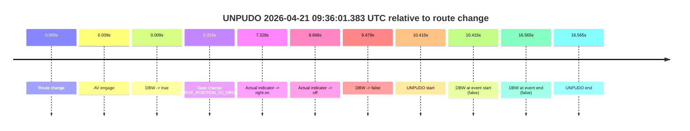
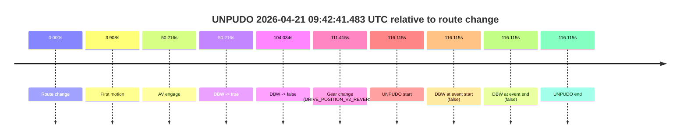
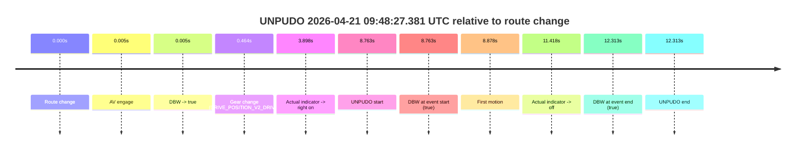

# Run Report: fme20032/2026-04-21--09-09-28--gen2-av-900aea02-08d0-4bad-8c73-5b302b4d1a52

| Field | Value |
|---|---|
| Run ID | `fme20032/2026-04-21--09-09-28--gen2-av-900aea02-08d0-4bad-8c73-5b302b4d1a52` |
| Date | `2026-04-21` |
| Model(s) | `pink-manta-ray-smooth` |
| Author | `guy.geva` |
| Event count | `3` |

## unpudo 2026-04-21 09:36:01.383 UTC

| Field | Value |
|---|---|
| Model | `pink-manta-ray-smooth` |
| Author | `guy.geva` |
| Run ID | `fme20032/2026-04-21--09-09-28--gen2-av-900aea02-08d0-4bad-8c73-5b302b4d1a52` |
| Date | `2026-04-21` |
| Time (UTC) | `09:36:01.383` |
| Event type | `unpudo` |
| Disengagement type | `none observed` |
| Route change | `found` |
| Console | [run](https://console.sso.wayve.ai/run/fme20032/2026-04-21--09-09-28--gen2-av-900aea02-08d0-4bad-8c73-5b302b4d1a52?id=&time-unixus=1776764161383295) |
| Foxglove | [segment](https://app.foxglove.dev/wayve-on-prem/p/prj_0dX18KZdVHg1fmmI/view?ds=foxglove-stream&ds.deviceName=fme20032&ds.start=2026-04-21T09%3A35%3A40.968314Z&ds.end=2026-04-21T09%3A36%3A17.533317Z&layoutId=lay_0e7VD4WIKDQGU73Y&time=2026-04-21T09%3A36%3A01.383295Z) |

### Event card: fail

- Fail: the credited unpudo does not stay AV-owned. The event window starts with DBW false, and the maneuver outcome lands outside a clean AV-owned segment.

| Event | Time (UTC) | Delta from route change |
|---|---:|---:|
| Route change | 2026-04-21 09:35:50.968 | `0.000s` |
| AV engage | 2026-04-21 09:35:50.977 | `0.009s` |
| DBW -> true | 2026-04-21 09:35:50.977 | `0.009s` |
| Gear change (DRIVE_POSITION_V2_DRIVE) | 2026-04-21 09:35:51.283 | `0.315s` |
| Actual indicator -> right on | 2026-04-21 09:35:58.295 | `7.328s` |
| Actual indicator -> off | 2026-04-21 09:35:59.636 | `8.668s` |
| DBW -> false | 2026-04-21 09:36:00.447 | `9.479s` |
| UNPUDO start | 2026-04-21 09:36:01.383 | `10.415s` |
| DBW at event start (false) | 2026-04-21 09:36:01.383 | `10.415s` |
| DBW at event end (false) | 2026-04-21 09:36:07.533 | `16.565s` |
| UNPUDO end | 2026-04-21 09:36:07.533 | `16.565s` |

| Metric | Value |
|---|---|
| Outcome | `fail` |
| Effective failure type | `not_av_owned` |
| Route change status | `found` |
| DBW at event start | `false` |
| DBW at event end | `false` |
| Predicted gear at AV start | `DRIVE_POSITION_V2_PARK` |
| Actual gear at AV start | `DRIVE_POSITION_V2_PARK` |
| Predicted gear at event start | `DRIVE_POSITION_V2_DRIVE` |
| Actual gear at event start | `DRIVE_POSITION_V2_DRIVE` |
| Planned indicator direction | `INDICATORS_STATE_V2_RIGHT_ON` |
| Controller indicator direction | `INDICATORS_STATE_V2_RIGHT_ON` |
| Actual indicator direction | `INDICATORS_STATE_V2_OFF` |
| Actual indicator at maneuver end | `INDICATORS_STATE_V2_OFF` |
| Driver accel help in AV | `false` |
| Driver accel help timestamp | `n/a` |
| Max accel pedal pct in AV | `0.0%` |
| Max brake pedal pct in AV | `8.0%` |
| Max speed mps in AV | `0.000` |
| Success timing baseline | `route change` |
| Route -> AV | `0.009s` |
| AV -> event start | `10.406s` |
| AV -> first motion | `n/a` |
| Success baseline -> event start | `10.415s` |
| Success baseline -> first motion | `n/a` |
| AV duration before disengagement | `9.470s` |
| Trajectory waypoint count | `36` |
| Driving-plan step count | `11` |

The scored portion starts from the AV-owned window, not from the pre-AV setup. Route-change search in the stopped pre-event segment was `found`, with the baseline therefore set to route change. At the event anchor the model predicts `DRIVE_POSITION_V2_DRIVE` and the actual gear is `DRIVE_POSITION_V2_DRIVE`. The effective model outcome is `fail` because `not_av_owned.`

### Resolution

| Field | Value |
|---|---|
| Final outcome | `fail` |
| Do we agree with this label? | `yes` |
| Source disengagement type | `none observed` |
| Resolved effective failure type | `not_av_owned` |
| Confidence | `high` |

## unpudo 2026-04-21 09:42:41.483 UTC

| Field | Value |
|---|---|
| Model | `pink-manta-ray-smooth` |
| Author | `guy.geva` |
| Run ID | `fme20032/2026-04-21--09-09-28--gen2-av-900aea02-08d0-4bad-8c73-5b302b4d1a52` |
| Date | `2026-04-21` |
| Time (UTC) | `09:42:41.483` |
| Event type | `unpudo` |
| Disengagement type | `none observed` |
| Route change | `found` |
| Console | [run](https://console.sso.wayve.ai/run/fme20032/2026-04-21--09-09-28--gen2-av-900aea02-08d0-4bad-8c73-5b302b4d1a52?id=&time-unixus=1776764561483265) |
| Foxglove | [segment](https://app.foxglove.dev/wayve-on-prem/p/prj_0dX18KZdVHg1fmmI/view?ds=foxglove-stream&ds.deviceName=fme20032&ds.start=2026-04-21T09%3A40%3A35.368248Z&ds.end=2026-04-21T09%3A42%3A51.483265Z&layoutId=lay_0e7VD4WIKDQGU73Y&time=2026-04-21T09%3A42%3A41.483265Z) |

### Event card: fail

- Fail: the credited unpudo does not stay AV-owned. The event window starts with DBW false, and the maneuver outcome lands outside a clean AV-owned segment.

| Event | Time (UTC) | Delta from route change |
|---|---:|---:|
| Route change | 2026-04-21 09:40:45.368 | `0.000s` |
| First motion | 2026-04-21 09:40:49.275 | `3.908s` |
| AV engage | 2026-04-21 09:41:35.584 | `50.216s` |
| DBW -> true | 2026-04-21 09:41:35.584 | `50.216s` |
| DBW -> false | 2026-04-21 09:42:29.402 | `104.034s` |
| Gear change (DRIVE_POSITION_V2_REVERSE) | 2026-04-21 09:42:36.783 | `111.415s` |
| UNPUDO start | 2026-04-21 09:42:41.483 | `116.115s` |
| DBW at event start (false) | 2026-04-21 09:42:41.483 | `116.115s` |
| DBW at event end (false) | 2026-04-21 09:42:41.483 | `116.115s` |
| UNPUDO end | 2026-04-21 09:42:41.483 | `116.115s` |

| Metric | Value |
|---|---|
| Outcome | `fail` |
| Effective failure type | `completed_outside_av` |
| Route change status | `found` |
| DBW at event start | `false` |
| DBW at event end | `false` |
| Predicted gear at AV start | `DRIVE_POSITION_V2_DRIVE` |
| Actual gear at AV start | `DRIVE_POSITION_V2_DRIVE` |
| Predicted gear at event start | `DRIVE_POSITION_V2_REVERSE` |
| Actual gear at event start | `DRIVE_POSITION_V2_REVERSE` |
| Planned indicator direction | `INDICATORS_STATE_V2_OFF` |
| Controller indicator direction | `INDICATORS_STATE_V2_OFF` |
| Actual indicator direction | `INDICATORS_STATE_V2_OFF` |
| Actual indicator at maneuver end | `INDICATORS_STATE_V2_OFF` |
| Driver accel help in AV | `false` |
| Driver accel help timestamp | `n/a` |
| Max accel pedal pct in AV | `0.0%` |
| Max brake pedal pct in AV | `0.0%` |
| Max speed mps in AV | `7.719` |
| Success timing baseline | `route change` |
| Route -> AV | `50.216s` |
| AV -> event start | `65.899s` |
| AV -> first motion | `-46.308s` |
| Success baseline -> event start | `116.115s` |
| Success baseline -> first motion | `3.908s` |
| AV duration before disengagement | `53.819s` |
| Trajectory waypoint count | `37` |
| Driving-plan step count | `11` |

The scored portion starts from the AV-owned window, not from the pre-AV setup. Route-change search in the stopped pre-event segment was `found`, with the baseline therefore set to route change. At the event anchor the model predicts `DRIVE_POSITION_V2_REVERSE` and the actual gear is `DRIVE_POSITION_V2_REVERSE`. The effective model outcome is `fail` because `completed_outside_av.`

### Resolution

| Field | Value |
|---|---|
| Final outcome | `fail` |
| Do we agree with this label? | `yes` |
| Source disengagement type | `none observed` |
| Resolved effective failure type | `completed_outside_av` |
| Confidence | `high` |

## unpudo 2026-04-21 09:48:27.381 UTC

| Field | Value |
|---|---|
| Model | `pink-manta-ray-smooth` |
| Author | `guy.geva` |
| Run ID | `fme20032/2026-04-21--09-09-28--gen2-av-900aea02-08d0-4bad-8c73-5b302b4d1a52` |
| Date | `2026-04-21` |
| Time (UTC) | `09:48:27.381` |
| Event type | `unpudo` |
| Disengagement type | `none observed` |
| Route change | `found` |
| Console | [run](https://console.sso.wayve.ai/run/fme20032/2026-04-21--09-09-28--gen2-av-900aea02-08d0-4bad-8c73-5b302b4d1a52?id=&time-unixus=1776764907381389) |
| Foxglove | [segment](https://app.foxglove.dev/wayve-on-prem/p/prj_0dX18KZdVHg1fmmI/view?ds=foxglove-stream&ds.deviceName=fme20032&ds.start=2026-04-21T09%3A48%3A08.618251Z&ds.end=2026-04-21T09%3A48%3A40.931200Z&layoutId=lay_0e7VD4WIKDQGU73Y&time=2026-04-21T09%3A48%3A27.381389Z) |

### Event card: pass

- Pass: AV owns the credited unpudo from route change through the official unpudo window, the gear state is aligned at the anchor, and the vehicle moves without driver accelerator help in AV.

| Event | Time (UTC) | Delta from route change |
|---|---:|---:|
| Route change | 2026-04-21 09:48:18.618 | `0.000s` |
| AV engage | 2026-04-21 09:48:18.622 | `0.005s` |
| DBW -> true | 2026-04-21 09:48:18.622 | `0.005s` |
| Gear change (DRIVE_POSITION_V2_DRIVE) | 2026-04-21 09:48:19.081 | `0.464s` |
| Actual indicator -> right on | 2026-04-21 09:48:22.515 | `3.898s` |
| UNPUDO start | 2026-04-21 09:48:27.381 | `8.763s` |
| DBW at event start (true) | 2026-04-21 09:48:27.381 | `8.763s` |
| First motion | 2026-04-21 09:48:27.495 | `8.878s` |
| Actual indicator -> off | 2026-04-21 09:48:30.035 | `11.418s` |
| DBW at event end (true) | 2026-04-21 09:48:30.931 | `12.313s` |
| UNPUDO end | 2026-04-21 09:48:30.931 | `12.313s` |

| Metric | Value |
|---|---|
| Outcome | `pass` |
| Effective failure type | `none` |
| Route change status | `found` |
| DBW at event start | `true` |
| DBW at event end | `true` |
| Predicted gear at AV start | `DRIVE_POSITION_V2_PARK` |
| Actual gear at AV start | `DRIVE_POSITION_V2_PARK` |
| Predicted gear at event start | `DRIVE_POSITION_V2_DRIVE` |
| Actual gear at event start | `DRIVE_POSITION_V2_DRIVE` |
| Planned indicator direction | `INDICATORS_STATE_V2_RIGHT_ON` |
| Controller indicator direction | `INDICATORS_STATE_V2_RIGHT_ON` |
| Actual indicator direction | `INDICATORS_STATE_V2_RIGHT_ON` |
| Actual indicator at maneuver end | `INDICATORS_STATE_V2_OFF` |
| Driver accel help in AV | `false` |
| Driver accel help timestamp | `n/a` |
| Max accel pedal pct in AV | `0.0%` |
| Max brake pedal pct in AV | `8.0%` |
| Max speed mps in AV | `5.000` |
| Success timing baseline | `route change` |
| Route -> AV | `0.005s` |
| AV -> event start | `8.758s` |
| AV -> first motion | `8.873s` |
| Success baseline -> event start | `8.763s` |
| Success baseline -> first motion | `8.878s` |
| AV duration before disengagement | `n/a` |
| Trajectory waypoint count | `36` |
| Driving-plan step count | `11` |

The scored portion starts from the AV-owned window, not from the pre-AV setup. Route-change search in the stopped pre-event segment was `found`, with the baseline therefore set to route change. At the event anchor the model predicts `DRIVE_POSITION_V2_DRIVE` and the actual gear is `DRIVE_POSITION_V2_DRIVE`. The effective model outcome is `pass` because `the credited unpudo stays AV-owned through the official unpudo window.`

### Resolution

| Field | Value |
|---|---|
| Final outcome | `pass` |
| Do we agree with this label? | `yes` |
| Source disengagement type | `none observed` |
| Resolved effective failure type | `none` |
| Confidence | `high` |
