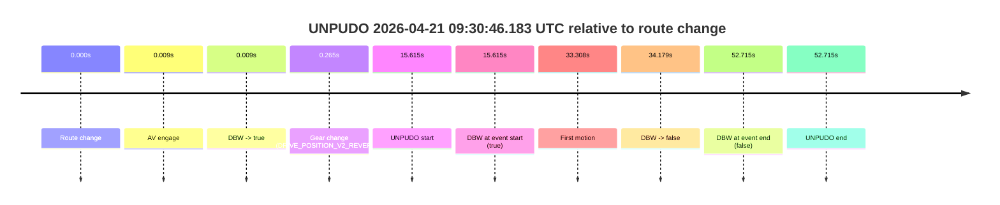
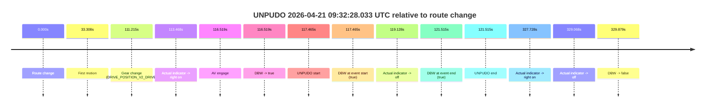
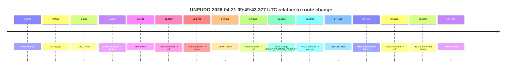

# Run Report: fme20032/2026-04-21--09-09-28--gen2-av-900aea02-08d0-4bad-8c73-5b302b4d1a52

| Field | Value |
|---|---|
| Run ID | `fme20032/2026-04-21--09-09-28--gen2-av-900aea02-08d0-4bad-8c73-5b302b4d1a52` |
| Date | `2026-04-21` |
| Model(s) | `eel-teal-outspoken` |
| Author | `zak` |
| Event count | `6` |

## unpudo 2026-04-21 09:15:14.183 UTC

| Field | Value |
|---|---|
| Model | `eel-teal-outspoken` |
| Author | `zak` |
| Run ID | `fme20032/2026-04-21--09-09-28--gen2-av-900aea02-08d0-4bad-8c73-5b302b4d1a52` |
| Date | `2026-04-21` |
| Time (UTC) | `09:15:14.183` |
| Event type | `unpudo` |
| Disengagement type | `none observed` |
| Route change | `found` |
| Console | [run](https://console.sso.wayve.ai/run/fme20032/2026-04-21--09-09-28--gen2-av-900aea02-08d0-4bad-8c73-5b302b4d1a52?id=&time-unixus=1776762914183295) |
| Foxglove | [segment](https://app.foxglove.dev/wayve-on-prem/p/prj_0dX18KZdVHg1fmmI/view?ds=foxglove-stream&ds.deviceName=fme20032&ds.start=2026-04-21T09%3A14%3A54.318287Z&ds.end=2026-04-21T09%3A20%3A44.447947Z&layoutId=lay_0e7VD4WIKDQGU73Y&time=2026-04-21T09%3A15%3A14.183295Z) |

### Event card: pass

- Pass: AV owns the credited unpudo from route change through the official unpudo window, the gear state is aligned at the anchor, and the vehicle moves without driver accelerator help in AV.

| Event | Time (UTC) | Delta from route change |
|---|---:|---:|
| Route change | 2026-04-21 09:15:04.318 | `0.000s` |
| Gear change (DRIVE_POSITION_V2_DRIVE) | 2026-04-21 09:15:10.483 | `6.165s` |
| AV engage | 2026-04-21 09:15:13.627 | `9.309s` |
| DBW -> true | 2026-04-21 09:15:13.627 | `9.309s` |
| UNPUDO start | 2026-04-21 09:15:14.183 | `9.865s` |
| DBW at event start (true) | 2026-04-21 09:15:14.183 | `9.865s` |
| First motion | 2026-04-21 09:15:14.235 | `9.918s` |
| DBW at event end (true) | 2026-04-21 09:15:17.533 | `13.215s` |
| UNPUDO end | 2026-04-21 09:15:17.533 | `13.215s` |
| DBW -> false | 2026-04-21 09:20:34.447 | `330.130s` |

| Metric | Value |
|---|---|
| Outcome | `pass` |
| Effective failure type | `none` |
| Route change status | `found` |
| DBW at event start | `true` |
| DBW at event end | `true` |
| Predicted gear at AV start | `DRIVE_POSITION_V2_DRIVE` |
| Actual gear at AV start | `DRIVE_POSITION_V2_DRIVE` |
| Predicted gear at event start | `DRIVE_POSITION_V2_DRIVE` |
| Actual gear at event start | `DRIVE_POSITION_V2_DRIVE` |
| Planned indicator direction | `INDICATORS_STATE_V2_RIGHT_ON` |
| Controller indicator direction | `INDICATORS_STATE_V2_RIGHT_ON` |
| Actual indicator direction | `INDICATORS_STATE_V2_OFF` |
| Actual indicator at maneuver end | `INDICATORS_STATE_V2_OFF` |
| Driver accel help in AV | `false` |
| Driver accel help timestamp | `n/a` |
| Max accel pedal pct in AV | `0.0%` |
| Max brake pedal pct in AV | `0.0%` |
| Max speed mps in AV | `5.239` |
| Success timing baseline | `route change` |
| Route -> AV | `9.309s` |
| AV -> event start | `0.556s` |
| AV -> first motion | `0.609s` |
| Success baseline -> event start | `9.865s` |
| Success baseline -> first motion | `9.918s` |
| AV duration before disengagement | `320.821s` |
| Trajectory waypoint count | `37` |
| Driving-plan step count | `11` |

The scored portion starts from the AV-owned window, not from the pre-AV setup. Route-change search in the stopped pre-event segment was `found`, with the baseline therefore set to route change. At the event anchor the model predicts `DRIVE_POSITION_V2_DRIVE` and the actual gear is `DRIVE_POSITION_V2_DRIVE`. The effective model outcome is `pass` because `the credited unpudo stays AV-owned through the official unpudo window.`

### Resolution

| Field | Value |
|---|---|
| Final outcome | `pass` |
| Do we agree with this label? | `yes` |
| Source disengagement type | `none observed` |
| Resolved effective failure type | `none` |
| Confidence | `high` |

## unpudo 2026-04-21 09:19:21.733 UTC

| Field | Value |
|---|---|
| Model | `eel-teal-outspoken` |
| Author | `zak` |
| Run ID | `fme20032/2026-04-21--09-09-28--gen2-av-900aea02-08d0-4bad-8c73-5b302b4d1a52` |
| Date | `2026-04-21` |
| Time (UTC) | `09:19:21.733` |
| Event type | `unpudo` |
| Disengagement type | `none observed` |
| Route change | `found` |
| Console | [run](https://console.sso.wayve.ai/run/fme20032/2026-04-21--09-09-28--gen2-av-900aea02-08d0-4bad-8c73-5b302b4d1a52?id=&time-unixus=1776763161733303) |
| Foxglove | [segment](https://app.foxglove.dev/wayve-on-prem/p/prj_0dX18KZdVHg1fmmI/view?ds=foxglove-stream&ds.deviceName=fme20032&ds.start=2026-04-21T09%3A19%3A07.818281Z&ds.end=2026-04-21T09%3A20%3A44.447947Z&layoutId=lay_0e7VD4WIKDQGU73Y&time=2026-04-21T09%3A19%3A21.733303Z) |

### Event card: pass

- Pass: AV owns the credited unpudo from route change through the official unpudo window, the gear state is aligned at the anchor, and the vehicle moves without driver accelerator help in AV.

| Event | Time (UTC) | Delta from route change |
|---|---:|---:|
| Route change | 2026-04-21 09:19:17.818 | `0.000s` |
| AV engage | 2026-04-21 09:19:17.827 | `0.009s` |
| DBW -> true | 2026-04-21 09:19:17.827 | `0.009s` |
| Gear change (DRIVE_POSITION_V2_DRIVE) | 2026-04-21 09:19:18.133 | `0.315s` |
| UNPUDO start | 2026-04-21 09:19:21.733 | `3.915s` |
| DBW at event start (true) | 2026-04-21 09:19:21.733 | `3.915s` |
| First motion | 2026-04-21 09:19:21.755 | `3.938s` |
| DBW at event end (true) | 2026-04-21 09:19:25.783 | `7.965s` |
| UNPUDO end | 2026-04-21 09:19:25.783 | `7.965s` |
| DBW -> false | 2026-04-21 09:20:34.447 | `76.630s` |

| Metric | Value |
|---|---|
| Outcome | `pass` |
| Effective failure type | `none` |
| Route change status | `found` |
| DBW at event start | `true` |
| DBW at event end | `true` |
| Predicted gear at AV start | `DRIVE_POSITION_V2_PARK` |
| Actual gear at AV start | `DRIVE_POSITION_V2_NEUTRAL` |
| Predicted gear at event start | `DRIVE_POSITION_V2_DRIVE` |
| Actual gear at event start | `DRIVE_POSITION_V2_DRIVE` |
| Planned indicator direction | `INDICATORS_STATE_V2_RIGHT_ON` |
| Controller indicator direction | `INDICATORS_STATE_V2_RIGHT_ON` |
| Actual indicator direction | `INDICATORS_STATE_V2_OFF` |
| Actual indicator at maneuver end | `INDICATORS_STATE_V2_OFF` |
| Driver accel help in AV | `false` |
| Driver accel help timestamp | `n/a` |
| Max accel pedal pct in AV | `0.0%` |
| Max brake pedal pct in AV | `9.0%` |
| Max speed mps in AV | `3.094` |
| Success timing baseline | `route change` |
| Route -> AV | `0.009s` |
| AV -> event start | `3.906s` |
| AV -> first motion | `3.929s` |
| Success baseline -> event start | `3.915s` |
| Success baseline -> first motion | `3.938s` |
| AV duration before disengagement | `76.621s` |
| Trajectory waypoint count | `37` |
| Driving-plan step count | `11` |

The scored portion starts from the AV-owned window, not from the pre-AV setup. Route-change search in the stopped pre-event segment was `found`, with the baseline therefore set to route change. At the event anchor the model predicts `DRIVE_POSITION_V2_DRIVE` and the actual gear is `DRIVE_POSITION_V2_DRIVE`. The effective model outcome is `pass` because `the credited unpudo stays AV-owned through the official unpudo window.`

### Resolution

| Field | Value |
|---|---|
| Final outcome | `pass` |
| Do we agree with this label? | `yes` |
| Source disengagement type | `none observed` |
| Resolved effective failure type | `none` |
| Confidence | `high` |

## unpudo 2026-04-21 09:30:46.183 UTC

| Field | Value |
|---|---|
| Model | `eel-teal-outspoken` |
| Author | `zak` |
| Run ID | `fme20032/2026-04-21--09-09-28--gen2-av-900aea02-08d0-4bad-8c73-5b302b4d1a52` |
| Date | `2026-04-21` |
| Time (UTC) | `09:30:46.183` |
| Event type | `unpudo` |
| Disengagement type | `none observed` |
| Route change | `found` |
| Console | [run](https://console.sso.wayve.ai/run/fme20032/2026-04-21--09-09-28--gen2-av-900aea02-08d0-4bad-8c73-5b302b4d1a52?id=&time-unixus=1776763846183297) |
| Foxglove | [segment](https://app.foxglove.dev/wayve-on-prem/p/prj_0dX18KZdVHg1fmmI/view?ds=foxglove-stream&ds.deviceName=fme20032&ds.start=2026-04-21T09%3A30%3A20.568259Z&ds.end=2026-04-21T09%3A31%3A33.283290Z&layoutId=lay_0e7VD4WIKDQGU73Y&time=2026-04-21T09%3A30%3A46.183297Z) |

### Event card: fail

- Fail: the credited unpudo does not stay AV-owned. The event window starts with DBW true, and the maneuver outcome lands outside a clean AV-owned segment.

| Event | Time (UTC) | Delta from route change |
|---|---:|---:|
| Route change | 2026-04-21 09:30:30.568 | `0.000s` |
| AV engage | 2026-04-21 09:30:30.577 | `0.009s` |
| DBW -> true | 2026-04-21 09:30:30.577 | `0.009s` |
| Gear change (DRIVE_POSITION_V2_REVERSE) | 2026-04-21 09:30:30.833 | `0.265s` |
| UNPUDO start | 2026-04-21 09:30:46.183 | `15.615s` |
| DBW at event start (true) | 2026-04-21 09:30:46.183 | `15.615s` |
| First motion | 2026-04-21 09:31:03.876 | `33.308s` |
| DBW -> false | 2026-04-21 09:31:04.746 | `34.179s` |
| DBW at event end (false) | 2026-04-21 09:31:23.283 | `52.715s` |
| UNPUDO end | 2026-04-21 09:31:23.283 | `52.715s` |

| Metric | Value |
|---|---|
| Outcome | `fail` |
| Effective failure type | `driver_completed_maneuver` |
| Route change status | `found` |
| DBW at event start | `true` |
| DBW at event end | `false` |
| Predicted gear at AV start | `DRIVE_POSITION_V2_PARK` |
| Actual gear at AV start | `DRIVE_POSITION_V2_PARK` |
| Predicted gear at event start | `DRIVE_POSITION_V2_REVERSE` |
| Actual gear at event start | `DRIVE_POSITION_V2_REVERSE` |
| Planned indicator direction | `INDICATORS_STATE_V2_OFF` |
| Controller indicator direction | `INDICATORS_STATE_V2_OFF` |
| Actual indicator direction | `INDICATORS_STATE_V2_OFF` |
| Actual indicator at maneuver end | `INDICATORS_STATE_V2_OFF` |
| Driver accel help in AV | `false` |
| Driver accel help timestamp | `n/a` |
| Max accel pedal pct in AV | `0.0%` |
| Max brake pedal pct in AV | `21.2%` |
| Max speed mps in AV | `0.228` |
| Success timing baseline | `route change` |
| Route -> AV | `0.009s` |
| AV -> event start | `15.606s` |
| AV -> first motion | `33.299s` |
| Success baseline -> event start | `15.615s` |
| Success baseline -> first motion | `33.308s` |
| AV duration before disengagement | `34.170s` |
| Trajectory waypoint count | `36` |
| Driving-plan step count | `11` |

The scored portion starts from the AV-owned window, not from the pre-AV setup. Route-change search in the stopped pre-event segment was `found`, with the baseline therefore set to route change. At the event anchor the model predicts `DRIVE_POSITION_V2_REVERSE` and the actual gear is `DRIVE_POSITION_V2_REVERSE`. The effective model outcome is `fail` because `driver_completed_maneuver.`

### Resolution

| Field | Value |
|---|---|
| Final outcome | `fail` |
| Do we agree with this label? | `yes` |
| Source disengagement type | `none observed` |
| Resolved effective failure type | `driver_completed_maneuver` |
| Confidence | `high` |

## unpudo 2026-04-21 09:32:28.033 UTC

| Field | Value |
|---|---|
| Model | `eel-teal-outspoken` |
| Author | `zak` |
| Run ID | `fme20032/2026-04-21--09-09-28--gen2-av-900aea02-08d0-4bad-8c73-5b302b4d1a52` |
| Date | `2026-04-21` |
| Time (UTC) | `09:32:28.033` |
| Event type | `unpudo` |
| Disengagement type | `none observed` |
| Route change | `found` |
| Console | [run](https://console.sso.wayve.ai/run/fme20032/2026-04-21--09-09-28--gen2-av-900aea02-08d0-4bad-8c73-5b302b4d1a52?id=&time-unixus=1776763948033318) |
| Foxglove | [segment](https://app.foxglove.dev/wayve-on-prem/p/prj_0dX18KZdVHg1fmmI/view?ds=foxglove-stream&ds.deviceName=fme20032&ds.start=2026-04-21T09%3A30%3A20.568259Z&ds.end=2026-04-21T09%3A36%3A10.447371Z&layoutId=lay_0e7VD4WIKDQGU73Y&time=2026-04-21T09%3A32%3A28.033318Z) |

### Event card: pass

- Pass: AV owns the credited unpudo from route change through the official unpudo window, the gear state is aligned at the anchor, and the vehicle moves without driver accelerator help in AV.

| Event | Time (UTC) | Delta from route change |
|---|---:|---:|
| Route change | 2026-04-21 09:30:30.568 | `0.000s` |
| First motion | 2026-04-21 09:31:03.876 | `33.308s` |
| Gear change (DRIVE_POSITION_V2_DRIVE) | 2026-04-21 09:32:21.783 | `111.215s` |
| Actual indicator -> right on | 2026-04-21 09:32:24.036 | `113.468s` |
| AV engage | 2026-04-21 09:32:27.087 | `116.519s` |
| DBW -> true | 2026-04-21 09:32:27.087 | `116.519s` |
| UNPUDO start | 2026-04-21 09:32:28.033 | `117.465s` |
| DBW at event start (true) | 2026-04-21 09:32:28.033 | `117.465s` |
| Actual indicator -> off | 2026-04-21 09:32:29.696 | `119.128s` |
| DBW at event end (true) | 2026-04-21 09:32:32.083 | `121.515s` |
| UNPUDO end | 2026-04-21 09:32:32.083 | `121.515s` |
| Actual indicator -> right on | 2026-04-21 09:35:58.295 | `327.728s` |
| Actual indicator -> off | 2026-04-21 09:35:59.636 | `329.068s` |
| DBW -> false | 2026-04-21 09:36:00.447 | `329.879s` |

| Metric | Value |
|---|---|
| Outcome | `pass` |
| Effective failure type | `none` |
| Route change status | `found` |
| DBW at event start | `true` |
| DBW at event end | `true` |
| Predicted gear at AV start | `DRIVE_POSITION_V2_DRIVE` |
| Actual gear at AV start | `DRIVE_POSITION_V2_DRIVE` |
| Predicted gear at event start | `DRIVE_POSITION_V2_DRIVE` |
| Actual gear at event start | `DRIVE_POSITION_V2_DRIVE` |
| Planned indicator direction | `INDICATORS_STATE_V2_RIGHT_ON` |
| Controller indicator direction | `INDICATORS_STATE_V2_RIGHT_ON` |
| Actual indicator direction | `INDICATORS_STATE_V2_RIGHT_ON` |
| Actual indicator at maneuver end | `INDICATORS_STATE_V2_OFF` |
| Driver accel help in AV | `false` |
| Driver accel help timestamp | `n/a` |
| Max accel pedal pct in AV | `0.0%` |
| Max brake pedal pct in AV | `1.6%` |
| Max speed mps in AV | `4.756` |
| Success timing baseline | `route change` |
| Route -> AV | `116.519s` |
| AV -> event start | `0.946s` |
| AV -> first motion | `-83.211s` |
| Success baseline -> event start | `117.465s` |
| Success baseline -> first motion | `33.308s` |
| AV duration before disengagement | `213.360s` |
| Trajectory waypoint count | `37` |
| Driving-plan step count | `11` |

The scored portion starts from the AV-owned window, not from the pre-AV setup. Route-change search in the stopped pre-event segment was `found`, with the baseline therefore set to route change. At the event anchor the model predicts `DRIVE_POSITION_V2_DRIVE` and the actual gear is `DRIVE_POSITION_V2_DRIVE`. The effective model outcome is `pass` because `the credited unpudo stays AV-owned through the official unpudo window.`

### Resolution

| Field | Value |
|---|---|
| Final outcome | `pass` |
| Do we agree with this label? | `yes` |
| Source disengagement type | `none observed` |
| Resolved effective failure type | `none` |
| Confidence | `high` |

## unpudo 2026-04-21 09:40:49.233 UTC

| Field | Value |
|---|---|
| Model | `eel-teal-outspoken` |
| Author | `zak` |
| Run ID | `fme20032/2026-04-21--09-09-28--gen2-av-900aea02-08d0-4bad-8c73-5b302b4d1a52` |
| Date | `2026-04-21` |
| Time (UTC) | `09:40:49.233` |
| Event type | `unpudo` |
| Disengagement type | `none observed` |
| Route change | `found` |
| Console | [run](https://console.sso.wayve.ai/run/fme20032/2026-04-21--09-09-28--gen2-av-900aea02-08d0-4bad-8c73-5b302b4d1a52?id=&time-unixus=1776764449233278) |
| Foxglove | [segment](https://app.foxglove.dev/wayve-on-prem/p/prj_0dX18KZdVHg1fmmI/view?ds=foxglove-stream&ds.deviceName=fme20032&ds.start=2026-04-21T09%3A40%3A35.368248Z&ds.end=2026-04-21T09%3A41%3A35.743855Z&layoutId=lay_0e7VD4WIKDQGU73Y&time=2026-04-21T09%3A40%3A49.233278Z) |

### Event card: pass

- Pass: AV owns the credited unpudo from route change through the official unpudo window, the gear state is aligned at the anchor, and the vehicle moves without driver accelerator help in AV.

| Event | Time (UTC) | Delta from route change |
|---|---:|---:|
| Route change | 2026-04-21 09:40:45.368 | `0.000s` |
| AV engage | 2026-04-21 09:40:45.377 | `0.009s` |
| DBW -> true | 2026-04-21 09:40:45.377 | `0.009s` |
| Gear change (DRIVE_POSITION_V2_DRIVE) | 2026-04-21 09:40:45.683 | `0.315s` |
| UNPUDO start | 2026-04-21 09:40:49.233 | `3.865s` |
| DBW at event start (true) | 2026-04-21 09:40:49.233 | `3.865s` |
| First motion | 2026-04-21 09:40:49.275 | `3.908s` |
| DBW at event end (true) | 2026-04-21 09:40:53.083 | `7.715s` |
| UNPUDO end | 2026-04-21 09:40:53.083 | `7.715s` |
| DBW -> false | 2026-04-21 09:41:25.743 | `40.376s` |

| Metric | Value |
|---|---|
| Outcome | `pass` |
| Effective failure type | `none` |
| Route change status | `found` |
| DBW at event start | `true` |
| DBW at event end | `true` |
| Predicted gear at AV start | `DRIVE_POSITION_V2_PARK` |
| Actual gear at AV start | `DRIVE_POSITION_V2_PARK` |
| Predicted gear at event start | `DRIVE_POSITION_V2_DRIVE` |
| Actual gear at event start | `DRIVE_POSITION_V2_DRIVE` |
| Planned indicator direction | `INDICATORS_STATE_V2_RIGHT_ON` |
| Controller indicator direction | `INDICATORS_STATE_V2_RIGHT_ON` |
| Actual indicator direction | `INDICATORS_STATE_V2_OFF` |
| Actual indicator at maneuver end | `INDICATORS_STATE_V2_OFF` |
| Driver accel help in AV | `false` |
| Driver accel help timestamp | `n/a` |
| Max accel pedal pct in AV | `0.0%` |
| Max brake pedal pct in AV | `9.4%` |
| Max speed mps in AV | `4.503` |
| Success timing baseline | `route change` |
| Route -> AV | `0.009s` |
| AV -> event start | `3.856s` |
| AV -> first motion | `3.899s` |
| Success baseline -> event start | `3.865s` |
| Success baseline -> first motion | `3.908s` |
| AV duration before disengagement | `40.367s` |
| Trajectory waypoint count | `37` |
| Driving-plan step count | `11` |

The scored portion starts from the AV-owned window, not from the pre-AV setup. Route-change search in the stopped pre-event segment was `found`, with the baseline therefore set to route change. At the event anchor the model predicts `DRIVE_POSITION_V2_DRIVE` and the actual gear is `DRIVE_POSITION_V2_DRIVE`. The effective model outcome is `pass` because `the credited unpudo stays AV-owned through the official unpudo window.`

### Resolution

| Field | Value |
|---|---|
| Final outcome | `pass` |
| Do we agree with this label? | `yes` |
| Source disengagement type | `none observed` |
| Resolved effective failure type | `none` |
| Confidence | `high` |

## unpudo 2026-04-21 09:49:43.377 UTC

| Field | Value |
|---|---|
| Model | `eel-teal-outspoken` |
| Author | `zak` |
| Run ID | `fme20032/2026-04-21--09-09-28--gen2-av-900aea02-08d0-4bad-8c73-5b302b4d1a52` |
| Date | `2026-04-21` |
| Time (UTC) | `09:49:43.377` |
| Event type | `unpudo` |
| Disengagement type | `none observed` |
| Route change | `found` |
| Console | [run](https://console.sso.wayve.ai/run/fme20032/2026-04-21--09-09-28--gen2-av-900aea02-08d0-4bad-8c73-5b302b4d1a52?id=&time-unixus=1776764983377184) |
| Foxglove | [segment](https://app.foxglove.dev/wayve-on-prem/p/prj_0dX18KZdVHg1fmmI/view?ds=foxglove-stream&ds.deviceName=fme20032&ds.start=2026-04-21T09%3A48%3A08.618251Z&ds.end=2026-04-21T09%3A49%3A59.326878Z&layoutId=lay_0e7VD4WIKDQGU73Y&time=2026-04-21T09%3A49%3A43.377184Z) |

### Event card: fail

- Fail: the credited unpudo does not stay AV-owned. The event window starts with DBW false, and the maneuver outcome lands outside a clean AV-owned segment.

| Event | Time (UTC) | Delta from route change |
|---|---:|---:|
| Route change | 2026-04-21 09:48:18.618 | `0.000s` |
| AV engage | 2026-04-21 09:48:18.622 | `0.005s` |
| DBW -> true | 2026-04-21 09:48:18.622 | `0.005s` |
| Actual indicator -> right on | 2026-04-21 09:48:22.515 | `3.898s` |
| First motion | 2026-04-21 09:48:27.495 | `8.878s` |
| Actual indicator -> off | 2026-04-21 09:48:30.035 | `11.418s` |
| Actual indicator -> left on | 2026-04-21 09:49:10.695 | `52.078s` |
| DBW -> false | 2026-04-21 09:49:13.222 | `54.605s` |
| Actual indicator -> off | 2026-04-21 09:49:15.955 | `57.338s` |
| Gear change (DRIVE_POSITION_V2_DRIVE) | 2026-04-21 09:49:38.827 | `80.209s` |
| Actual indicator -> right on | 2026-04-21 09:49:40.216 | `81.598s` |
| UNPUDO start | 2026-04-21 09:49:43.377 | `84.759s` |
| DBW at event start (false) | 2026-04-21 09:49:43.377 | `84.759s` |
| Actual indicator -> off | 2026-04-21 09:49:45.815 | `87.198s` |
| DBW at event end (false) | 2026-04-21 09:49:49.326 | `90.709s` |
| UNPUDO end | 2026-04-21 09:49:49.326 | `90.709s` |

| Metric | Value |
|---|---|
| Outcome | `fail` |
| Effective failure type | `not_av_owned` |
| Route change status | `found` |
| DBW at event start | `false` |
| DBW at event end | `false` |
| Predicted gear at AV start | `DRIVE_POSITION_V2_PARK` |
| Actual gear at AV start | `DRIVE_POSITION_V2_PARK` |
| Predicted gear at event start | `DRIVE_POSITION_V2_DRIVE` |
| Actual gear at event start | `DRIVE_POSITION_V2_DRIVE` |
| Planned indicator direction | `INDICATORS_STATE_V2_OFF` |
| Controller indicator direction | `INDICATORS_STATE_V2_OFF` |
| Actual indicator direction | `INDICATORS_STATE_V2_RIGHT_ON` |
| Actual indicator at maneuver end | `INDICATORS_STATE_V2_OFF` |
| Driver accel help in AV | `false` |
| Driver accel help timestamp | `n/a` |
| Max accel pedal pct in AV | `0.0%` |
| Max brake pedal pct in AV | `8.0%` |
| Max speed mps in AV | `7.469` |
| Success timing baseline | `route change` |
| Route -> AV | `0.005s` |
| AV -> event start | `84.754s` |
| AV -> first motion | `8.873s` |
| Success baseline -> event start | `84.759s` |
| Success baseline -> first motion | `8.878s` |
| AV duration before disengagement | `54.600s` |
| Trajectory waypoint count | `28` |
| Driving-plan step count | `11` |

The scored portion starts from the AV-owned window, not from the pre-AV setup. Route-change search in the stopped pre-event segment was `found`, with the baseline therefore set to route change. At the event anchor the model predicts `DRIVE_POSITION_V2_DRIVE` and the actual gear is `DRIVE_POSITION_V2_DRIVE`. The effective model outcome is `fail` because `not_av_owned.`

### Resolution

| Field | Value |
|---|---|
| Final outcome | `fail` |
| Do we agree with this label? | `yes` |
| Source disengagement type | `none observed` |
| Resolved effective failure type | `not_av_owned` |
| Confidence | `high` |
