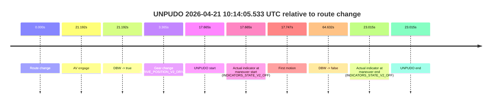
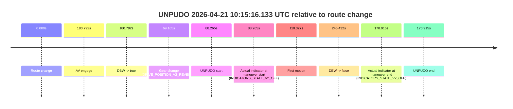
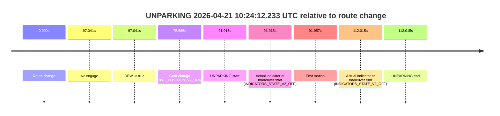

# Run Report: fme20032/2026-04-21--10-09-14--gen2-av-fac6131e-754a-43f8-abc1-f99abb4ea8af

| Field | Value |
|---|---|
| Run ID | `fme20032/2026-04-21--10-09-14--gen2-av-fac6131e-754a-43f8-abc1-f99abb4ea8af` |
| Date | `2026-04-21` |
| Model(s) | `pink-manta-ray-smooth` |
| Author | `guy.geva` |
| Event count | `4` |

## unpudo 2026-04-21 10:14:05.533 UTC

| Field | Value |
|---|---|
| Model | `pink-manta-ray-smooth` |
| Author | `guy.geva` |
| Run ID | `fme20032/2026-04-21--10-09-14--gen2-av-fac6131e-754a-43f8-abc1-f99abb4ea8af` |
| Date | `2026-04-21` |
| Time (UTC) | `10:14:05.533` |
| Event type | `unpudo` |
| Disengagement type | `none observed` |
| Route change | `found` |
| Console | [run](https://console.sso.wayve.ai/run/fme20032/2026-04-21--10-09-14--gen2-av-fac6131e-754a-43f8-abc1-f99abb4ea8af?id=&time-unixus=1776766445533318) |
| Foxglove | [segment](https://app.foxglove.dev/wayve-on-prem/p/prj_0dX18KZdVHg1fmmI/view?ds=foxglove-stream&ds.deviceName=fme20032&ds.start=2026-04-21T10%3A13%3A37.868255Z&ds.end=2026-04-21T10%3A15%3A02.500009Z&layoutId=lay_0e7VD4WIKDQGU73Y&time=2026-04-21T10%3A14%3A05.533318Z) |

### Event card: accidental

- Accidental: AV ownership is present for less than `2s`, so this is treated as an accidental brush with the maneuver rather than a meaningful model attempt.

| Event | Time (UTC) | Delta from route change |
|---|---:|---:|
| Route change | 2026-04-21 10:13:47.868 | `0.000s` |
| AV engage | 2026-04-21 10:14:09.060 | `21.192s` |
| DBW -> true | 2026-04-21 10:14:09.060 | `21.192s` |
| Gear change (DRIVE_POSITION_V2_DRIVE) | 2026-04-21 10:13:51.233 | `3.365s` |
| UNPUDO start | 2026-04-21 10:14:05.533 | `17.665s` |
| Actual indicator at maneuver start (INDICATORS_STATE_V2_OFF) | 2026-04-21 10:14:05.533 | `17.665s` |
| First motion | 2026-04-21 10:14:05.615 | `17.747s` |
| DBW -> false | 2026-04-21 10:14:52.500 | `64.632s` |
| Actual indicator at maneuver end (INDICATORS_STATE_V2_OFF) | 2026-04-21 10:14:10.883 | `23.015s` |
| UNPUDO end | 2026-04-21 10:14:10.883 | `23.015s` |

| Metric | Value |
|---|---|
| Outcome | `accidental` |
| Effective failure type | `none` |
| Route change status | `found` |
| DBW at event start | `false` |
| DBW at event end | `true` |
| Predicted gear at AV start | `DRIVE_POSITION_V2_DRIVE` |
| Actual gear at AV start | `DRIVE_POSITION_V2_DRIVE` |
| Predicted gear at event start | `DRIVE_POSITION_V2_DRIVE` |
| Actual gear at event start | `DRIVE_POSITION_V2_DRIVE` |
| Planned indicator direction | `INDICATORS_STATE_V2_OFF` |
| Controller indicator direction | `INDICATORS_STATE_V2_OFF` |
| Actual indicator direction | `INDICATORS_STATE_V2_OFF` |
| Actual indicator at maneuver end | `INDICATORS_STATE_V2_OFF` |
| Driver accel help in AV | `false` |
| Driver accel help timestamp | `n/a` |
| Max accel pedal pct in AV | `0.0%` |
| Max brake pedal pct in AV | `0.0%` |
| Max speed mps in AV | `2.739` |
| Route -> AV | `21.192s` |
| AV -> event start | `-3.527s` |
| AV -> first motion | `-3.445s` |
| AV duration before disengagement | `43.440s` |
| Trajectory waypoint count | `36` |
| Driving-plan step count | `11` |

The scored portion starts from the AV-owned window, not from the pre-AV setup. Route-change search in the stopped pre-event segment was `found`, with the baseline therefore set to route change. At the event anchor the model predicts `DRIVE_POSITION_V2_DRIVE` and the actual gear is `DRIVE_POSITION_V2_DRIVE`. The effective model outcome is `accidental` because `the AV-owned portion is shorter than 2s`.

### Resolution

| Field | Value |
|---|---|
| Final outcome | `accidental` |
| Do we agree with this label? | `yes` |
| Source disengagement type | `none observed` |
| Resolved effective failure type | `none` |
| Confidence | `high` |

## unpudo 2026-04-21 10:15:16.133 UTC

| Field | Value |
|---|---|
| Model | `pink-manta-ray-smooth` |
| Author | `guy.geva` |
| Run ID | `fme20032/2026-04-21--10-09-14--gen2-av-fac6131e-754a-43f8-abc1-f99abb4ea8af` |
| Date | `2026-04-21` |
| Time (UTC) | `10:15:16.133` |
| Event type | `unpudo` |
| Disengagement type | `none observed` |
| Route change | `found` |
| Console | [run](https://console.sso.wayve.ai/run/fme20032/2026-04-21--10-09-14--gen2-av-fac6131e-754a-43f8-abc1-f99abb4ea8af?id=&time-unixus=1776766516133307) |
| Foxglove | [segment](https://app.foxglove.dev/wayve-on-prem/p/prj_0dX18KZdVHg1fmmI/view?ds=foxglove-stream&ds.deviceName=fme20032&ds.start=2026-04-21T10%3A13%3A37.868255Z&ds.end=2026-04-21T10%3A18%3A04.300189Z&layoutId=lay_0e7VD4WIKDQGU73Y&time=2026-04-21T10%3A15%3A16.133307Z) |

### Event card: non-av

- Non-AV: there is no AV-owned portion anywhere inside the detected unpudo timeline, so it is kept for coverage but excluded from model success / failure scoring.

| Event | Time (UTC) | Delta from route change |
|---|---:|---:|
| Route change | 2026-04-21 10:13:47.868 | `0.000s` |
| AV engage | 2026-04-21 10:16:48.660 | `180.792s` |
| DBW -> true | 2026-04-21 10:16:48.660 | `180.792s` |
| Gear change (DRIVE_POSITION_V2_REVERSE) | 2026-04-21 10:14:57.033 | `69.165s` |
| UNPUDO start | 2026-04-21 10:15:16.133 | `88.265s` |
| Actual indicator at maneuver start (INDICATORS_STATE_V2_OFF) | 2026-04-21 10:15:16.133 | `88.265s` |
| First motion | 2026-04-21 10:15:38.195 | `110.327s` |
| DBW -> false | 2026-04-21 10:17:54.300 | `246.432s` |
| Actual indicator at maneuver end (INDICATORS_STATE_V2_OFF) | 2026-04-21 10:16:38.783 | `170.915s` |
| UNPUDO end | 2026-04-21 10:16:38.783 | `170.915s` |

| Metric | Value |
|---|---|
| Outcome | `non-av` |
| Effective failure type | `none` |
| Route change status | `found` |
| DBW at event start | `false` |
| DBW at event end | `false` |
| Predicted gear at AV start | `DRIVE_POSITION_V2_DRIVE` |
| Actual gear at AV start | `DRIVE_POSITION_V2_DRIVE` |
| Predicted gear at event start | `DRIVE_POSITION_V2_REVERSE` |
| Actual gear at event start | `DRIVE_POSITION_V2_REVERSE` |
| Planned indicator direction | `INDICATORS_STATE_V2_OFF` |
| Controller indicator direction | `INDICATORS_STATE_V2_OFF` |
| Actual indicator direction | `INDICATORS_STATE_V2_OFF` |
| Actual indicator at maneuver end | `INDICATORS_STATE_V2_OFF` |
| Driver accel help in AV | `false` |
| Driver accel help timestamp | `n/a` |
| Max accel pedal pct in AV | `0.0%` |
| Max brake pedal pct in AV | `0.0%` |
| Max speed mps in AV | `0.000` |
| Route -> AV | `180.792s` |
| AV -> event start | `-92.527s` |
| AV -> first motion | `-70.465s` |
| AV duration before disengagement | `65.640s` |
| Trajectory waypoint count | `36` |
| Driving-plan step count | `11` |

The scored portion starts from the AV-owned window, not from the pre-AV setup. Route-change search in the stopped pre-event segment was `found`, with the baseline therefore set to route change. At the event anchor the model predicts `DRIVE_POSITION_V2_REVERSE` and the actual gear is `DRIVE_POSITION_V2_REVERSE`. The effective model outcome is `non-av` because `there is no AV-owned overlap inside the event timeline`.

### Resolution

| Field | Value |
|---|---|
| Final outcome | `non-av` |
| Do we agree with this label? | `yes` |
| Source disengagement type | `none observed` |
| Resolved effective failure type | `none` |
| Confidence | `high` |

## unpudo 2026-04-21 10:21:33.083 UTC

| Field | Value |
|---|---|
| Model | `pink-manta-ray-smooth` |
| Author | `guy.geva` |
| Run ID | `fme20032/2026-04-21--10-09-14--gen2-av-fac6131e-754a-43f8-abc1-f99abb4ea8af` |
| Date | `2026-04-21` |
| Time (UTC) | `10:21:33.083` |
| Event type | `unpudo` |
| Disengagement type | `none observed` |
| Route change | `found` |
| Console | [run](https://console.sso.wayve.ai/run/fme20032/2026-04-21--10-09-14--gen2-av-fac6131e-754a-43f8-abc1-f99abb4ea8af?id=&time-unixus=1776766893083299) |
| Foxglove | [segment](https://app.foxglove.dev/wayve-on-prem/p/prj_0dX18KZdVHg1fmmI/view?ds=foxglove-stream&ds.deviceName=fme20032&ds.start=2026-04-21T10%3A21%3A01.158932Z&ds.end=2026-04-21T10%3A23%3A02.459871Z&layoutId=lay_0e7VD4WIKDQGU73Y&time=2026-04-21T10%3A21%3A33.083299Z) |

### Event card: pass

- Pass: AV owns the credited unpudo through the official event window, the gear state is aligned at the anchor, and the vehicle moves without driver accelerator help in AV.

| Event | Time (UTC) | Delta from route change |
|---|---:|---:|
| Route change | 2026-04-21 10:21:29.168 | `0.000s` |
| AV engage | 2026-04-21 10:21:11.158 | `-18.009s` |
| DBW -> true | 2026-04-21 10:21:11.158 | `-18.009s` |
| Gear change (DRIVE_POSITION_V2_DRIVE) | 2026-04-21 10:21:29.483 | `0.315s` |
| UNPUDO start | 2026-04-21 10:21:33.083 | `3.915s` |
| Actual indicator at maneuver start (INDICATORS_STATE_V2_OFF) | 2026-04-21 10:21:33.083 | `3.915s` |
| First motion | 2026-04-21 10:21:33.095 | `3.927s` |
| DBW -> false | 2026-04-21 10:22:52.459 | `83.292s` |
| Actual indicator at maneuver end (INDICATORS_STATE_V2_OFF) | 2026-04-21 10:21:36.933 | `7.765s` |
| UNPUDO end | 2026-04-21 10:21:36.933 | `7.765s` |

| Metric | Value |
|---|---|
| Outcome | `pass` |
| Effective failure type | `none` |
| Route change status | `found` |
| DBW at event start | `true` |
| DBW at event end | `true` |
| Predicted gear at AV start | `DRIVE_POSITION_V2_DRIVE` |
| Actual gear at AV start | `DRIVE_POSITION_V2_DRIVE` |
| Predicted gear at event start | `DRIVE_POSITION_V2_DRIVE` |
| Actual gear at event start | `DRIVE_POSITION_V2_DRIVE` |
| Planned indicator direction | `INDICATORS_STATE_V2_RIGHT_ON` |
| Controller indicator direction | `INDICATORS_STATE_V2_RIGHT_ON` |
| Actual indicator direction | `INDICATORS_STATE_V2_OFF` |
| Actual indicator at maneuver end | `INDICATORS_STATE_V2_OFF` |
| Driver accel help in AV | `false` |
| Driver accel help timestamp | `n/a` |
| Max accel pedal pct in AV | `0.0%` |
| Max brake pedal pct in AV | `0.0%` |
| Max speed mps in AV | `3.975` |
| Route -> AV | `-18.009s` |
| AV -> event start | `21.924s` |
| AV -> first motion | `21.936s` |
| AV duration before disengagement | `101.301s` |
| Trajectory waypoint count | `35` |
| Driving-plan step count | `11` |

The scored portion starts from the AV-owned window, not from the pre-AV setup. Route-change search in the stopped pre-event segment was `found`, with the baseline therefore set to route change. At the event anchor the model predicts `DRIVE_POSITION_V2_DRIVE` and the actual gear is `DRIVE_POSITION_V2_DRIVE`. The effective model outcome is `pass` because `the credited maneuver stays AV-owned through the official event end`.

### Resolution

| Field | Value |
|---|---|
| Final outcome | `pass` |
| Do we agree with this label? | `yes` |
| Source disengagement type | `none observed` |
| Resolved effective failure type | `none` |
| Confidence | `high` |

## unparking 2026-04-21 10:24:12.233 UTC

| Field | Value |
|---|---|
| Model | `pink-manta-ray-smooth` |
| Author | `guy.geva` |
| Run ID | `fme20032/2026-04-21--10-09-14--gen2-av-fac6131e-754a-43f8-abc1-f99abb4ea8af` |
| Date | `2026-04-21` |
| Time (UTC) | `10:24:12.233` |
| Event type | `unparking` |
| Disengagement type | `none observed` |
| Route change | `found` |
| Console | [run](https://console.sso.wayve.ai/run/fme20032/2026-04-21--10-09-14--gen2-av-fac6131e-754a-43f8-abc1-f99abb4ea8af?id=&time-unixus=1776767052233299) |
| Foxglove | [segment](https://app.foxglove.dev/wayve-on-prem/p/prj_0dX18KZdVHg1fmmI/view?ds=foxglove-stream&ds.deviceName=fme20032&ds.start=2026-04-21T10%3A22%3A30.318634Z&ds.end=2026-04-21T10%3A24%3A42.333321Z&layoutId=lay_0e7VD4WIKDQGU73Y&time=2026-04-21T10%3A24%3A12.233299Z) |

### Event card: pass

- Pass: AV owns the credited unparking through the official event window, the gear state is aligned at the anchor, and the vehicle moves without driver accelerator help in AV.

| Event | Time (UTC) | Delta from route change |
|---|---:|---:|
| Route change | 2026-04-21 10:22:40.318 | `0.000s` |
| AV engage | 2026-04-21 10:24:17.359 | `97.041s` |
| DBW -> true | 2026-04-21 10:24:17.359 | `97.041s` |
| Gear change (DRIVE_POSITION_V2_DRIVE) | 2026-04-21 10:23:55.883 | `75.565s` |
| UNPARKING start | 2026-04-21 10:24:12.233 | `91.915s` |
| Actual indicator at maneuver start (INDICATORS_STATE_V2_OFF) | 2026-04-21 10:24:12.233 | `91.915s` |
| First motion | 2026-04-21 10:24:12.275 | `91.957s` |
| Actual indicator at maneuver end (INDICATORS_STATE_V2_OFF) | 2026-04-21 10:24:32.333 | `112.015s` |
| UNPARKING end | 2026-04-21 10:24:32.333 | `112.015s` |

| Metric | Value |
|---|---|
| Outcome | `pass` |
| Effective failure type | `none` |
| Route change status | `found` |
| DBW at event start | `false` |
| DBW at event end | `true` |
| Predicted gear at AV start | `DRIVE_POSITION_V2_DRIVE` |
| Actual gear at AV start | `DRIVE_POSITION_V2_DRIVE` |
| Predicted gear at event start | `DRIVE_POSITION_V2_DRIVE` |
| Actual gear at event start | `DRIVE_POSITION_V2_DRIVE` |
| Planned indicator direction | `INDICATORS_STATE_V2_RIGHT_ON` |
| Controller indicator direction | `INDICATORS_STATE_V2_RIGHT_ON` |
| Actual indicator direction | `INDICATORS_STATE_V2_OFF` |
| Actual indicator at maneuver end | `INDICATORS_STATE_V2_OFF` |
| Driver accel help in AV | `false` |
| Driver accel help timestamp | `n/a` |
| Max accel pedal pct in AV | `0.0%` |
| Max brake pedal pct in AV | `8.0%` |
| Max speed mps in AV | `3.214` |
| Route -> AV | `97.041s` |
| AV -> event start | `-5.126s` |
| AV -> first motion | `-5.084s` |
| AV duration before disengagement | `n/a` |
| Trajectory waypoint count | `36` |
| Driving-plan step count | `11` |

The scored portion starts from the AV-owned window, not from the pre-AV setup. Route-change search in the stopped pre-event segment was `found`, with the baseline therefore set to route change. At the event anchor the model predicts `DRIVE_POSITION_V2_DRIVE` and the actual gear is `DRIVE_POSITION_V2_DRIVE`. The effective model outcome is `pass` because `the credited maneuver stays AV-owned through the official event end`.

### Resolution

| Field | Value |
|---|---|
| Final outcome | `pass` |
| Do we agree with this label? | `yes` |
| Source disengagement type | `none observed` |
| Resolved effective failure type | `none` |
| Confidence | `high` |
