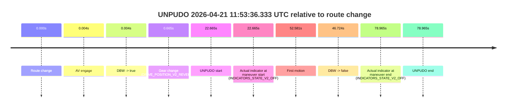
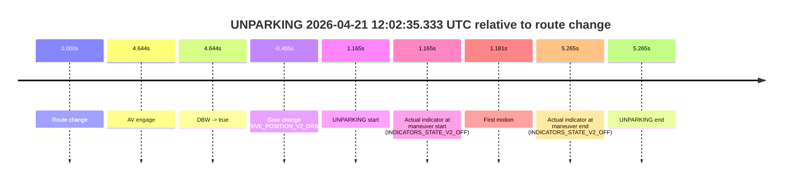

# Run Report: fme20032/2026-04-21--11-45-14--gen2-av-57a723c9-4da1-4756-8053-4fca0a508a4b

| Field | Value |
|---|---|
| Run ID | `fme20032/2026-04-21--11-45-14--gen2-av-57a723c9-4da1-4756-8053-4fca0a508a4b` |
| Date | `2026-04-21` |
| Model(s) | `pink-manta-ray-smooth` |
| Author | `guy.geva` |
| Event count | `3` |

## unpudo 2026-04-21 11:53:36.333 UTC

| Field | Value |
|---|---|
| Model | `pink-manta-ray-smooth` |
| Author | `guy.geva` |
| Run ID | `fme20032/2026-04-21--11-45-14--gen2-av-57a723c9-4da1-4756-8053-4fca0a508a4b` |
| Date | `2026-04-21` |
| Time (UTC) | `11:53:36.333` |
| Event type | `unpudo` |
| Disengagement type | `none observed` |
| Route change | `found` |
| Console | [run](https://console.sso.wayve.ai/run/fme20032/2026-04-21--11-45-14--gen2-av-57a723c9-4da1-4756-8053-4fca0a508a4b?id=&time-unixus=1776772416333311) |
| Foxglove | [segment](https://app.foxglove.dev/wayve-on-prem/p/prj_0dX18KZdVHg1fmmI/view?ds=foxglove-stream&ds.deviceName=fme20032&ds.start=2026-04-21T11%3A53%3A03.668292Z&ds.end=2026-04-21T11%3A54%3A42.633300Z&layoutId=lay_0e7VD4WIKDQGU73Y&time=2026-04-21T11%3A53%3A36.333311Z) |

### Event card: fail

- Fail: the credited unpudo does not stay AV-owned. The event window starts with DBW true, and the maneuver outcome lands outside a clean AV-owned segment.

| Event | Time (UTC) | Delta from route change |
|---|---:|---:|
| Route change | 2026-04-21 11:53:13.668 | `0.000s` |
| AV engage | 2026-04-21 11:53:13.672 | `0.004s` |
| DBW -> true | 2026-04-21 11:53:13.672 | `0.004s` |
| Gear change (DRIVE_POSITION_V2_REVERSE) | 2026-04-21 11:53:14.333 | `0.665s` |
| UNPUDO start | 2026-04-21 11:53:36.333 | `22.665s` |
| Actual indicator at maneuver start (INDICATORS_STATE_V2_OFF) | 2026-04-21 11:53:36.333 | `22.665s` |
| First motion | 2026-04-21 11:54:06.249 | `52.581s` |
| DBW -> false | 2026-04-21 11:54:00.392 | `46.724s` |
| Actual indicator at maneuver end (INDICATORS_STATE_V2_OFF) | 2026-04-21 11:54:32.633 | `78.965s` |
| UNPUDO end | 2026-04-21 11:54:32.633 | `78.965s` |

| Metric | Value |
|---|---|
| Outcome | `fail` |
| Effective failure type | `driver_completed_maneuver` |
| Route change status | `found` |
| DBW at event start | `true` |
| DBW at event end | `true` |
| Predicted gear at AV start | `DRIVE_POSITION_V2_PARK` |
| Actual gear at AV start | `DRIVE_POSITION_V2_NEUTRAL` |
| Predicted gear at event start | `DRIVE_POSITION_V2_REVERSE` |
| Actual gear at event start | `DRIVE_POSITION_V2_REVERSE` |
| Planned indicator direction | `INDICATORS_STATE_V2_OFF` |
| Controller indicator direction | `INDICATORS_STATE_V2_OFF` |
| Actual indicator direction | `INDICATORS_STATE_V2_OFF` |
| Actual indicator at maneuver end | `INDICATORS_STATE_V2_OFF` |
| Driver accel help in AV | `false` |
| Driver accel help timestamp | `n/a` |
| Max accel pedal pct in AV | `0.0%` |
| Max brake pedal pct in AV | `9.4%` |
| Max speed mps in AV | `0.053` |
| Route -> AV | `0.004s` |
| AV -> event start | `22.661s` |
| AV -> first motion | `52.577s` |
| AV duration before disengagement | `46.720s` |
| Trajectory waypoint count | `36` |
| Driving-plan step count | `11` |

The scored portion starts from the AV-owned window, not from the pre-AV setup. Route-change search in the stopped pre-event segment was `found`, with the baseline therefore set to route change. At the event anchor the model predicts `DRIVE_POSITION_V2_REVERSE` and the actual gear is `DRIVE_POSITION_V2_REVERSE`. The effective model outcome is `fail` because `driver_completed_maneuver`.

### Resolution

| Field | Value |
|---|---|
| Final outcome | `fail` |
| Do we agree with this label? | `yes` |
| Source disengagement type | `none observed` |
| Resolved effective failure type | `driver_completed_maneuver` |
| Confidence | `high` |

## unpudo 2026-04-21 11:59:24.033 UTC

| Field | Value |
|---|---|
| Model | `pink-manta-ray-smooth` |
| Author | `guy.geva` |
| Run ID | `fme20032/2026-04-21--11-45-14--gen2-av-57a723c9-4da1-4756-8053-4fca0a508a4b` |
| Date | `2026-04-21` |
| Time (UTC) | `11:59:24.033` |
| Event type | `unpudo` |
| Disengagement type | `none observed` |
| Route change | `found` |
| Console | [run](https://console.sso.wayve.ai/run/fme20032/2026-04-21--11-45-14--gen2-av-57a723c9-4da1-4756-8053-4fca0a508a4b?id=&time-unixus=1776772764033321) |
| Foxglove | [segment](https://app.foxglove.dev/wayve-on-prem/p/prj_0dX18KZdVHg1fmmI/view?ds=foxglove-stream&ds.deviceName=fme20032&ds.start=2026-04-21T11%3A59%3A05.118252Z&ds.end=2026-04-21T12%3A02%3A36.252786Z&layoutId=lay_0e7VD4WIKDQGU73Y&time=2026-04-21T11%3A59%3A24.033321Z) |

### Event card: accidental

- Accidental: AV ownership is present for less than `2s`, so this is treated as an accidental brush with the maneuver rather than a meaningful model attempt.

| Event | Time (UTC) | Delta from route change |
|---|---:|---:|
| Route change | 2026-04-21 11:59:15.118 | `0.000s` |
| AV engage | 2026-04-21 11:59:30.913 | `15.795s` |
| DBW -> true | 2026-04-21 11:59:30.913 | `15.795s` |
| Gear change (DRIVE_POSITION_V2_DRIVE) | 2026-04-21 11:59:15.433 | `0.315s` |
| UNPUDO start | 2026-04-21 11:59:24.033 | `8.915s` |
| Actual indicator at maneuver start (INDICATORS_STATE_V2_RIGHT_ON) | 2026-04-21 11:59:24.033 | `8.915s` |
| First motion | 2026-04-21 11:59:24.149 | `9.031s` |
| DBW -> false | 2026-04-21 12:02:26.252 | `191.135s` |
| Actual indicator at maneuver end (INDICATORS_STATE_V2_OFF) | 2026-04-21 11:59:29.533 | `14.415s` |
| UNPUDO end | 2026-04-21 11:59:29.533 | `14.415s` |

| Metric | Value |
|---|---|
| Outcome | `accidental` |
| Effective failure type | `none` |
| Route change status | `found` |
| DBW at event start | `false` |
| DBW at event end | `false` |
| Predicted gear at AV start | `DRIVE_POSITION_V2_DRIVE` |
| Actual gear at AV start | `DRIVE_POSITION_V2_DRIVE` |
| Predicted gear at event start | `DRIVE_POSITION_V2_DRIVE` |
| Actual gear at event start | `DRIVE_POSITION_V2_DRIVE` |
| Planned indicator direction | `INDICATORS_STATE_V2_RIGHT_ON` |
| Controller indicator direction | `INDICATORS_STATE_V2_RIGHT_ON` |
| Actual indicator direction | `INDICATORS_STATE_V2_RIGHT_ON` |
| Actual indicator at maneuver end | `INDICATORS_STATE_V2_OFF` |
| Driver accel help in AV | `false` |
| Driver accel help timestamp | `n/a` |
| Max accel pedal pct in AV | `0.0%` |
| Max brake pedal pct in AV | `0.0%` |
| Max speed mps in AV | `0.000` |
| Route -> AV | `15.795s` |
| AV -> event start | `-6.880s` |
| AV -> first motion | `-6.764s` |
| AV duration before disengagement | `175.339s` |
| Trajectory waypoint count | `36` |
| Driving-plan step count | `11` |

The scored portion starts from the AV-owned window, not from the pre-AV setup. Route-change search in the stopped pre-event segment was `found`, with the baseline therefore set to route change. At the event anchor the model predicts `DRIVE_POSITION_V2_DRIVE` and the actual gear is `DRIVE_POSITION_V2_DRIVE`. The effective model outcome is `accidental` because `the AV-owned portion is shorter than 2s`.

### Resolution

| Field | Value |
|---|---|
| Final outcome | `accidental` |
| Do we agree with this label? | `yes` |
| Source disengagement type | `none observed` |
| Resolved effective failure type | `none` |
| Confidence | `high` |

## unparking 2026-04-21 12:02:35.333 UTC

| Field | Value |
|---|---|
| Model | `pink-manta-ray-smooth` |
| Author | `guy.geva` |
| Run ID | `fme20032/2026-04-21--11-45-14--gen2-av-57a723c9-4da1-4756-8053-4fca0a508a4b` |
| Date | `2026-04-21` |
| Time (UTC) | `12:02:35.333` |
| Event type | `unparking` |
| Disengagement type | `none observed` |
| Route change | `found` |
| Console | [run](https://console.sso.wayve.ai/run/fme20032/2026-04-21--11-45-14--gen2-av-57a723c9-4da1-4756-8053-4fca0a508a4b?id=&time-unixus=1776772955333323) |
| Foxglove | [segment](https://app.foxglove.dev/wayve-on-prem/p/prj_0dX18KZdVHg1fmmI/view?ds=foxglove-stream&ds.deviceName=fme20032&ds.start=2026-04-21T12%3A02%3A23.683318Z&ds.end=2026-04-21T12%3A02%3A49.433293Z&layoutId=lay_0e7VD4WIKDQGU73Y&time=2026-04-21T12%3A02%3A35.333323Z) |

### Event card: accidental

- Accidental: AV ownership is present for less than `2s`, so this is treated as an accidental brush with the maneuver rather than a meaningful model attempt.

| Event | Time (UTC) | Delta from route change |
|---|---:|---:|
| Route change | 2026-04-21 12:02:34.168 | `0.000s` |
| AV engage | 2026-04-21 12:02:38.812 | `4.644s` |
| DBW -> true | 2026-04-21 12:02:38.812 | `4.644s` |
| Gear change (DRIVE_POSITION_V2_DRIVE) | 2026-04-21 12:02:33.683 | `-0.485s` |
| UNPARKING start | 2026-04-21 12:02:35.333 | `1.165s` |
| Actual indicator at maneuver start (INDICATORS_STATE_V2_OFF) | 2026-04-21 12:02:35.333 | `1.165s` |
| First motion | 2026-04-21 12:02:35.349 | `1.181s` |
| Actual indicator at maneuver end (INDICATORS_STATE_V2_OFF) | 2026-04-21 12:02:39.433 | `5.265s` |
| UNPARKING end | 2026-04-21 12:02:39.433 | `5.265s` |

| Metric | Value |
|---|---|
| Outcome | `accidental` |
| Effective failure type | `none` |
| Route change status | `found` |
| DBW at event start | `false` |
| DBW at event end | `true` |
| Predicted gear at AV start | `DRIVE_POSITION_V2_DRIVE` |
| Actual gear at AV start | `DRIVE_POSITION_V2_DRIVE` |
| Predicted gear at event start | `DRIVE_POSITION_V2_DRIVE` |
| Actual gear at event start | `DRIVE_POSITION_V2_DRIVE` |
| Planned indicator direction | `INDICATORS_STATE_V2_OFF` |
| Controller indicator direction | `INDICATORS_STATE_V2_OFF` |
| Actual indicator direction | `INDICATORS_STATE_V2_OFF` |
| Actual indicator at maneuver end | `INDICATORS_STATE_V2_OFF` |
| Driver accel help in AV | `false` |
| Driver accel help timestamp | `n/a` |
| Max accel pedal pct in AV | `0.0%` |
| Max brake pedal pct in AV | `0.0%` |
| Max speed mps in AV | `4.128` |
| Route -> AV | `4.644s` |
| AV -> event start | `-3.479s` |
| AV -> first motion | `-3.463s` |
| AV duration before disengagement | `n/a` |
| Trajectory waypoint count | `36` |
| Driving-plan step count | `11` |

The scored portion starts from the AV-owned window, not from the pre-AV setup. Route-change search in the stopped pre-event segment was `found`, with the baseline therefore set to route change. At the event anchor the model predicts `DRIVE_POSITION_V2_DRIVE` and the actual gear is `DRIVE_POSITION_V2_DRIVE`. The effective model outcome is `accidental` because `the AV-owned portion is shorter than 2s`.

### Resolution

| Field | Value |
|---|---|
| Final outcome | `accidental` |
| Do we agree with this label? | `yes` |
| Source disengagement type | `none observed` |
| Resolved effective failure type | `none` |
| Confidence | `high` |
