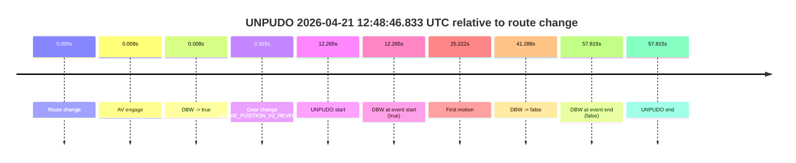

# Run Report: fme20032/2026-04-21--12-36-31--gen2-av-ce5401ab-e385-431a-9076-a8b813d9a9ab

| Field | Value |
|---|---|
| Run ID | `fme20032/2026-04-21--12-36-31--gen2-av-ce5401ab-e385-431a-9076-a8b813d9a9ab` |
| Date | `2026-04-21` |
| Model(s) | `eel-teal-outspoken` |
| Author | `zak` |
| Event count | `1` |

## unpudo 2026-04-21 12:48:46.833 UTC

| Field | Value |
|---|---|
| Model | `eel-teal-outspoken` |
| Author | `zak` |
| Run ID | `fme20032/2026-04-21--12-36-31--gen2-av-ce5401ab-e385-431a-9076-a8b813d9a9ab` |
| Date | `2026-04-21` |
| Time (UTC) | `12:48:46.833` |
| Event type | `unpudo` |
| Disengagement type | `none observed` |
| Route change | `found` |
| Console | [run](https://console.sso.wayve.ai/run/fme20032/2026-04-21--12-36-31--gen2-av-ce5401ab-e385-431a-9076-a8b813d9a9ab?id=&time-unixus=1776775726833318) |
| Foxglove | [segment](https://app.foxglove.dev/wayve-on-prem/p/prj_0dX18KZdVHg1fmmI/view?ds=foxglove-stream&ds.deviceName=fme20032&ds.start=2026-04-21T12%3A48%3A24.568357Z&ds.end=2026-04-21T12%3A49%3A42.383311Z&layoutId=lay_0e7VD4WIKDQGU73Y&time=2026-04-21T12%3A48%3A46.833318Z) |

### Event card: fail

- Fail: the credited unpudo does not stay AV-owned. The event window starts with DBW true, and the maneuver outcome lands outside a clean AV-owned segment.

| Event | Time (UTC) | Delta from route change |
|---|---:|---:|
| Route change | 2026-04-21 12:48:34.568 | `0.000s` |
| AV engage | 2026-04-21 12:48:34.576 | `0.008s` |
| DBW -> true | 2026-04-21 12:48:34.576 | `0.008s` |
| Gear change (DRIVE_POSITION_V2_REVERSE) | 2026-04-21 12:48:34.933 | `0.365s` |
| UNPUDO start | 2026-04-21 12:48:46.833 | `12.265s` |
| DBW at event start (true) | 2026-04-21 12:48:46.833 | `12.265s` |
| First motion | 2026-04-21 12:48:59.790 | `25.222s` |
| DBW -> false | 2026-04-21 12:49:15.855 | `41.288s` |
| DBW at event end (false) | 2026-04-21 12:49:32.383 | `57.815s` |
| UNPUDO end | 2026-04-21 12:49:32.383 | `57.815s` |

| Metric | Value |
|---|---|
| Outcome | `fail` |
| Effective failure type | `driver_completed_maneuver` |
| Route change status | `found` |
| DBW at event start | `true` |
| DBW at event end | `false` |
| Predicted gear at AV start | `DRIVE_POSITION_V2_PARK` |
| Actual gear at AV start | `DRIVE_POSITION_V2_PARK` |
| Predicted gear at event start | `DRIVE_POSITION_V2_REVERSE` |
| Actual gear at event start | `DRIVE_POSITION_V2_REVERSE` |
| Planned indicator direction | `INDICATORS_STATE_V2_OFF` |
| Controller indicator direction | `INDICATORS_STATE_V2_OFF` |
| Actual indicator direction | `INDICATORS_STATE_V2_OFF` |
| Actual indicator at maneuver end | `INDICATORS_STATE_V2_OFF` |
| Driver accel help in AV | `false` |
| Driver accel help timestamp | `n/a` |
| Max accel pedal pct in AV | `0.0%` |
| Max brake pedal pct in AV | `13.6%` |
| Max speed mps in AV | `1.072` |
| Success timing baseline | `route change` |
| Route -> AV | `0.008s` |
| AV -> event start | `12.257s` |
| AV -> first motion | `25.214s` |
| Success baseline -> event start | `12.265s` |
| Success baseline -> first motion | `25.222s` |
| AV duration before disengagement | `41.280s` |
| Trajectory waypoint count | `37` |
| Driving-plan step count | `11` |

The scored portion starts from the AV-owned window, not from the pre-AV setup. Route-change search in the stopped pre-event segment was `found`, with the baseline therefore set to route change. At the event anchor the model predicts `DRIVE_POSITION_V2_REVERSE` and the actual gear is `DRIVE_POSITION_V2_REVERSE`. The effective model outcome is `fail` because `driver_completed_maneuver.`

### Resolution

| Field | Value |
|---|---|
| Final outcome | `fail` |
| Do we agree with this label? | `yes` |
| Source disengagement type | `none observed` |
| Resolved effective failure type | `driver_completed_maneuver` |
| Confidence | `high` |
