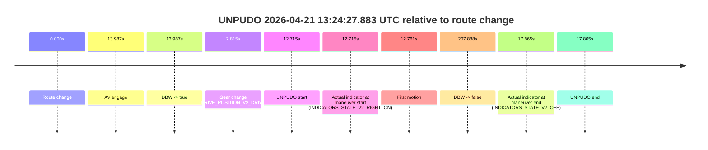
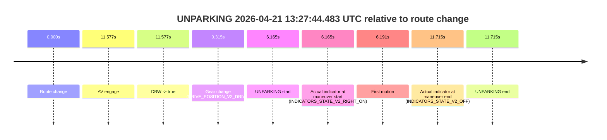

# Run Report: fme20032/2026-04-21--13-12-06--gen2-av-a10ae110-cb98-456c-87dc-1a25ca1e23c9

| Field | Value |
|---|---|
| Run ID | `fme20032/2026-04-21--13-12-06--gen2-av-a10ae110-cb98-456c-87dc-1a25ca1e23c9` |
| Date | `2026-04-21` |
| Model(s) | `pink-manta-ray-smooth` |
| Author | `guy.geva` |
| Event count | `2` |

## unpudo 2026-04-21 13:24:27.883 UTC

| Field | Value |
|---|---|
| Model | `pink-manta-ray-smooth` |
| Author | `guy.geva` |
| Run ID | `fme20032/2026-04-21--13-12-06--gen2-av-a10ae110-cb98-456c-87dc-1a25ca1e23c9` |
| Date | `2026-04-21` |
| Time (UTC) | `13:24:27.883` |
| Event type | `unpudo` |
| Disengagement type | `none observed` |
| Route change | `found` |
| Console | [run](https://console.sso.wayve.ai/run/fme20032/2026-04-21--13-12-06--gen2-av-a10ae110-cb98-456c-87dc-1a25ca1e23c9?id=&time-unixus=1776777867883315) |
| Foxglove | [segment](https://app.foxglove.dev/wayve-on-prem/p/prj_0dX18KZdVHg1fmmI/view?ds=foxglove-stream&ds.deviceName=fme20032&ds.start=2026-04-21T13%3A24%3A05.168260Z&ds.end=2026-04-21T13%3A27%3A53.056718Z&layoutId=lay_0e7VD4WIKDQGU73Y&time=2026-04-21T13%3A24%3A27.883315Z) |

### Event card: pass

- Pass: AV owns the credited unpudo through the official event window, the gear state is aligned at the anchor, and the vehicle moves without driver accelerator help in AV.

| Event | Time (UTC) | Delta from route change |
|---|---:|---:|
| Route change | 2026-04-21 13:24:15.168 | `0.000s` |
| AV engage | 2026-04-21 13:24:29.155 | `13.987s` |
| DBW -> true | 2026-04-21 13:24:29.155 | `13.987s` |
| Gear change (DRIVE_POSITION_V2_DRIVE) | 2026-04-21 13:24:22.983 | `7.815s` |
| UNPUDO start | 2026-04-21 13:24:27.883 | `12.715s` |
| Actual indicator at maneuver start (INDICATORS_STATE_V2_RIGHT_ON) | 2026-04-21 13:24:27.883 | `12.715s` |
| First motion | 2026-04-21 13:24:27.929 | `12.761s` |
| DBW -> false | 2026-04-21 13:27:43.056 | `207.888s` |
| Actual indicator at maneuver end (INDICATORS_STATE_V2_OFF) | 2026-04-21 13:24:33.033 | `17.865s` |
| UNPUDO end | 2026-04-21 13:24:33.033 | `17.865s` |

| Metric | Value |
|---|---|
| Outcome | `pass` |
| Effective failure type | `none` |
| Route change status | `found` |
| DBW at event start | `false` |
| DBW at event end | `true` |
| Predicted gear at AV start | `DRIVE_POSITION_V2_DRIVE` |
| Actual gear at AV start | `DRIVE_POSITION_V2_DRIVE` |
| Predicted gear at event start | `DRIVE_POSITION_V2_DRIVE` |
| Actual gear at event start | `DRIVE_POSITION_V2_DRIVE` |
| Planned indicator direction | `INDICATORS_STATE_V2_RIGHT_ON` |
| Controller indicator direction | `INDICATORS_STATE_V2_RIGHT_ON` |
| Actual indicator direction | `INDICATORS_STATE_V2_RIGHT_ON` |
| Actual indicator at maneuver end | `INDICATORS_STATE_V2_OFF` |
| Driver accel help in AV | `false` |
| Driver accel help timestamp | `n/a` |
| Max accel pedal pct in AV | `0.0%` |
| Max brake pedal pct in AV | `0.0%` |
| Max speed mps in AV | `4.942` |
| Route -> AV | `13.987s` |
| AV -> event start | `-1.272s` |
| AV -> first motion | `-1.226s` |
| AV duration before disengagement | `193.901s` |
| Trajectory waypoint count | `36` |
| Driving-plan step count | `11` |

The scored portion starts from the AV-owned window, not from the pre-AV setup. Route-change search in the stopped pre-event segment was `found`, with the baseline therefore set to route change. At the event anchor the model predicts `DRIVE_POSITION_V2_DRIVE` and the actual gear is `DRIVE_POSITION_V2_DRIVE`. The effective model outcome is `pass` because `the credited maneuver stays AV-owned through the official event end`.

### Resolution

| Field | Value |
|---|---|
| Final outcome | `pass` |
| Do we agree with this label? | `yes` |
| Source disengagement type | `none observed` |
| Resolved effective failure type | `none` |
| Confidence | `high` |

## unparking 2026-04-21 13:27:44.483 UTC

| Field | Value |
|---|---|
| Model | `pink-manta-ray-smooth` |
| Author | `guy.geva` |
| Run ID | `fme20032/2026-04-21--13-12-06--gen2-av-a10ae110-cb98-456c-87dc-1a25ca1e23c9` |
| Date | `2026-04-21` |
| Time (UTC) | `13:27:44.483` |
| Event type | `unparking` |
| Disengagement type | `none observed` |
| Route change | `found` |
| Console | [run](https://console.sso.wayve.ai/run/fme20032/2026-04-21--13-12-06--gen2-av-a10ae110-cb98-456c-87dc-1a25ca1e23c9?id=&time-unixus=1776778064483308) |
| Foxglove | [segment](https://app.foxglove.dev/wayve-on-prem/p/prj_0dX18KZdVHg1fmmI/view?ds=foxglove-stream&ds.deviceName=fme20032&ds.start=2026-04-21T13%3A27%3A28.318302Z&ds.end=2026-04-21T13%3A28%3A00.033323Z&layoutId=lay_0e7VD4WIKDQGU73Y&time=2026-04-21T13%3A27%3A44.483308Z) |

### Event card: accidental

- Accidental: AV ownership is present for less than `2s`, so this is treated as an accidental brush with the maneuver rather than a meaningful model attempt.

| Event | Time (UTC) | Delta from route change |
|---|---:|---:|
| Route change | 2026-04-21 13:27:38.318 | `0.000s` |
| AV engage | 2026-04-21 13:27:49.895 | `11.577s` |
| DBW -> true | 2026-04-21 13:27:49.895 | `11.577s` |
| Gear change (DRIVE_POSITION_V2_DRIVE) | 2026-04-21 13:27:38.633 | `0.315s` |
| UNPARKING start | 2026-04-21 13:27:44.483 | `6.165s` |
| Actual indicator at maneuver start (INDICATORS_STATE_V2_RIGHT_ON) | 2026-04-21 13:27:44.483 | `6.165s` |
| First motion | 2026-04-21 13:27:44.509 | `6.191s` |
| Actual indicator at maneuver end (INDICATORS_STATE_V2_OFF) | 2026-04-21 13:27:50.033 | `11.715s` |
| UNPARKING end | 2026-04-21 13:27:50.033 | `11.715s` |

| Metric | Value |
|---|---|
| Outcome | `accidental` |
| Effective failure type | `none` |
| Route change status | `found` |
| DBW at event start | `false` |
| DBW at event end | `true` |
| Predicted gear at AV start | `DRIVE_POSITION_V2_DRIVE` |
| Actual gear at AV start | `DRIVE_POSITION_V2_DRIVE` |
| Predicted gear at event start | `DRIVE_POSITION_V2_DRIVE` |
| Actual gear at event start | `DRIVE_POSITION_V2_DRIVE` |
| Planned indicator direction | `INDICATORS_STATE_V2_OFF` |
| Controller indicator direction | `INDICATORS_STATE_V2_OFF` |
| Actual indicator direction | `INDICATORS_STATE_V2_RIGHT_ON` |
| Actual indicator at maneuver end | `INDICATORS_STATE_V2_OFF` |
| Driver accel help in AV | `false` |
| Driver accel help timestamp | `n/a` |
| Max accel pedal pct in AV | `0.0%` |
| Max brake pedal pct in AV | `0.0%` |
| Max speed mps in AV | `4.856` |
| Route -> AV | `11.577s` |
| AV -> event start | `-5.412s` |
| AV -> first motion | `-5.386s` |
| AV duration before disengagement | `n/a` |
| Trajectory waypoint count | `36` |
| Driving-plan step count | `11` |

The scored portion starts from the AV-owned window, not from the pre-AV setup. Route-change search in the stopped pre-event segment was `found`, with the baseline therefore set to route change. At the event anchor the model predicts `DRIVE_POSITION_V2_DRIVE` and the actual gear is `DRIVE_POSITION_V2_DRIVE`. The effective model outcome is `accidental` because `the AV-owned portion is shorter than 2s`.

### Resolution

| Field | Value |
|---|---|
| Final outcome | `accidental` |
| Do we agree with this label? | `yes` |
| Source disengagement type | `none observed` |
| Resolved effective failure type | `none` |
| Confidence | `high` |
