# Run Report: fme20032/2026-04-21--14-17-54--gen2-av-cae1b391-dab2-4ad8-8f3a-0c5f0814d292

| Field | Value |
|---|---|
| Run ID | `fme20032/2026-04-21--14-17-54--gen2-av-cae1b391-dab2-4ad8-8f3a-0c5f0814d292` |
| Date | `2026-04-21` |
| Model(s) | `eel-teal-outspoken` |
| Author | `zak` |
| Event count | `14` |

## unpudo 2026-04-21 14:32:37.533 UTC

| Field | Value |
|---|---|
| Model | `eel-teal-outspoken` |
| Author | `zak` |
| Run ID | `fme20032/2026-04-21--14-17-54--gen2-av-cae1b391-dab2-4ad8-8f3a-0c5f0814d292` |
| Date | `2026-04-21` |
| Time (UTC) | `14:32:37.533` |
| Event type | `unpudo` |
| Disengagement type | `none observed` |
| Route change | `unclear` |
| Console | [run](https://console.sso.wayve.ai/run/fme20032/2026-04-21--14-17-54--gen2-av-cae1b391-dab2-4ad8-8f3a-0c5f0814d292?id=&time-unixus=1776781957533296) |
| Foxglove | [segment](https://app.foxglove.dev/wayve-on-prem/p/prj_0dX18KZdVHg1fmmI/view?ds=foxglove-stream&ds.deviceName=fme20032&ds.start=2026-04-21T14%3A32%3A23.454480Z&ds.end=2026-04-21T14%3A36%3A19.574470Z&layoutId=lay_0e7VD4WIKDQGU73Y&time=2026-04-21T14%3A32%3A37.533296Z) |

### Event card: pass

- Pass: AV owns the credited unpudo from route change through the official unpudo window, the gear state is aligned at the anchor, and the vehicle moves without driver accelerator help in AV.

| Event | Time (UTC) | Delta from AV start |
|---|---:|---:|
| Route change unclear | 2026-04-21 14:32:33.454 | `0.000s` |
| AV engage | 2026-04-21 14:32:33.454 | `0.000s` |
| DBW -> true | 2026-04-21 14:32:33.454 | `0.000s` |
| Gear change (DRIVE_POSITION_V2_DRIVE) | 2026-04-21 14:32:33.883 | `0.429s` |
| UNPUDO start | 2026-04-21 14:32:37.533 | `4.079s` |
| DBW at event start (true) | 2026-04-21 14:32:37.533 | `4.079s` |
| First motion | 2026-04-21 14:32:37.569 | `4.115s` |
| DBW at event end (true) | 2026-04-21 14:32:41.283 | `7.829s` |
| UNPUDO end | 2026-04-21 14:32:41.283 | `7.829s` |
| DBW -> false | 2026-04-21 14:36:09.574 | `216.120s` |

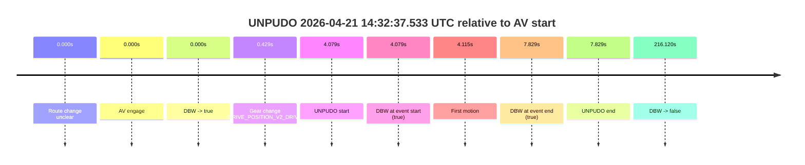

| Metric | Value |
|---|---|
| Outcome | `pass` |
| Effective failure type | `none` |
| Route change status | `unclear` |
| DBW at event start | `true` |
| DBW at event end | `true` |
| Predicted gear at AV start | `DRIVE_POSITION_V2_DRIVE` |
| Actual gear at AV start | `DRIVE_POSITION_V2_PARK` |
| Predicted gear at event start | `DRIVE_POSITION_V2_DRIVE` |
| Actual gear at event start | `DRIVE_POSITION_V2_DRIVE` |
| Planned indicator direction | `INDICATORS_STATE_V2_RIGHT_ON` |
| Controller indicator direction | `INDICATORS_STATE_V2_RIGHT_ON` |
| Actual indicator direction | `INDICATORS_STATE_V2_OFF` |
| Actual indicator at maneuver end | `INDICATORS_STATE_V2_OFF` |
| Driver accel help in AV | `false` |
| Driver accel help timestamp | `n/a` |
| Max accel pedal pct in AV | `0.0%` |
| Max brake pedal pct in AV | `8.0%` |
| Max speed mps in AV | `4.158` |
| Success timing baseline | `AV start` |
| Route -> AV | `n/a` |
| AV -> event start | `4.079s` |
| AV -> first motion | `4.115s` |
| Success baseline -> event start | `4.079s` |
| Success baseline -> first motion | `4.115s` |
| AV duration before disengagement | `216.120s` |
| Trajectory waypoint count | `36` |
| Driving-plan step count | `11` |

The scored portion starts from the AV-owned window, not from the pre-AV setup. Route-change search in the stopped pre-event segment was `unclear`, with the baseline therefore set to AV start. At the event anchor the model predicts `DRIVE_POSITION_V2_DRIVE` and the actual gear is `DRIVE_POSITION_V2_DRIVE`. The effective model outcome is `pass` because `the credited unpudo stays AV-owned through the official unpudo window.`

### Resolution

| Field | Value |
|---|---|
| Final outcome | `pass` |
| Do we agree with this label? | `yes` |
| Source disengagement type | `none observed` |
| Resolved effective failure type | `none` |
| Confidence | `medium` |

## unpudo 2026-04-21 14:36:11.783 UTC

| Field | Value |
|---|---|
| Model | `eel-teal-outspoken` |
| Author | `zak` |
| Run ID | `fme20032/2026-04-21--14-17-54--gen2-av-cae1b391-dab2-4ad8-8f3a-0c5f0814d292` |
| Date | `2026-04-21` |
| Time (UTC) | `14:36:11.783` |
| Event type | `unpudo` |
| Disengagement type | `none observed` |
| Route change | `found` |
| Console | [run](https://console.sso.wayve.ai/run/fme20032/2026-04-21--14-17-54--gen2-av-cae1b391-dab2-4ad8-8f3a-0c5f0814d292?id=&time-unixus=1776782171783320) |
| Foxglove | [segment](https://app.foxglove.dev/wayve-on-prem/p/prj_0dX18KZdVHg1fmmI/view?ds=foxglove-stream&ds.deviceName=fme20032&ds.start=2026-04-21T14%3A35%3A57.668250Z&ds.end=2026-04-21T14%3A36%3A21.783320Z&layoutId=lay_0e7VD4WIKDQGU73Y&time=2026-04-21T14%3A36%3A11.783320Z) |

### Event card: accidental

- Accidental: AV ownership is present for less than `2s`, so this is treated as an accidental brush with the maneuver rather than a meaningful model attempt.

| Event | Time (UTC) | Delta from route change |
|---|---:|---:|
| Route change | 2026-04-21 14:36:07.668 | `0.000s` |
| AV engage | 2026-04-21 14:36:07.674 | `0.006s` |
| DBW -> true | 2026-04-21 14:36:07.674 | `0.006s` |
| Gear change (DRIVE_POSITION_V2_REVERSE) | 2026-04-21 14:36:07.933 | `0.265s` |
| DBW -> false | 2026-04-21 14:36:09.574 | `1.906s` |
| UNPUDO start | 2026-04-21 14:36:11.783 | `4.115s` |
| DBW at event start (false) | 2026-04-21 14:36:11.783 | `4.115s` |
| DBW at event end (false) | 2026-04-21 14:36:11.783 | `4.115s` |
| UNPUDO end | 2026-04-21 14:36:11.783 | `4.115s` |

| Metric | Value |
|---|---|
| Outcome | `accidental` |
| Effective failure type | `none` |
| Route change status | `found` |
| DBW at event start | `false` |
| DBW at event end | `false` |
| Predicted gear at AV start | `DRIVE_POSITION_V2_PARK` |
| Actual gear at AV start | `DRIVE_POSITION_V2_PARK` |
| Predicted gear at event start | `DRIVE_POSITION_V2_REVERSE` |
| Actual gear at event start | `DRIVE_POSITION_V2_REVERSE` |
| Planned indicator direction | `INDICATORS_STATE_V2_OFF` |
| Controller indicator direction | `INDICATORS_STATE_V2_OFF` |
| Actual indicator direction | `INDICATORS_STATE_V2_OFF` |
| Actual indicator at maneuver end | `INDICATORS_STATE_V2_OFF` |
| Driver accel help in AV | `false` |
| Driver accel help timestamp | `n/a` |
| Max accel pedal pct in AV | `0.0%` |
| Max brake pedal pct in AV | `9.4%` |
| Max speed mps in AV | `0.000` |
| Success timing baseline | `route change` |
| Route -> AV | `0.006s` |
| AV -> event start | `4.109s` |
| AV -> first motion | `n/a` |
| Success baseline -> event start | `4.115s` |
| Success baseline -> first motion | `n/a` |
| AV duration before disengagement | `1.900s` |
| Trajectory waypoint count | `37` |
| Driving-plan step count | `11` |

The scored portion starts from the AV-owned window, not from the pre-AV setup. Route-change search in the stopped pre-event segment was `found`, with the baseline therefore set to route change. At the event anchor the model predicts `DRIVE_POSITION_V2_REVERSE` and the actual gear is `DRIVE_POSITION_V2_REVERSE`. The effective model outcome is `accidental` because `the AV-owned portion is shorter than 2s.`

### Resolution

| Field | Value |
|---|---|
| Final outcome | `accidental` |
| Do we agree with this label? | `yes` |
| Source disengagement type | `none observed` |
| Resolved effective failure type | `none` |
| Confidence | `high` |

## unpudo 2026-04-21 15:05:05.533 UTC

| Field | Value |
|---|---|
| Model | `eel-teal-outspoken` |
| Author | `zak` |
| Run ID | `fme20032/2026-04-21--14-17-54--gen2-av-cae1b391-dab2-4ad8-8f3a-0c5f0814d292` |
| Date | `2026-04-21` |
| Time (UTC) | `15:05:05.533` |
| Event type | `unpudo` |
| Disengagement type | `none observed` |
| Route change | `found` |
| Console | [run](https://console.sso.wayve.ai/run/fme20032/2026-04-21--14-17-54--gen2-av-cae1b391-dab2-4ad8-8f3a-0c5f0814d292?id=&time-unixus=1776783905533301) |
| Foxglove | [segment](https://app.foxglove.dev/wayve-on-prem/p/prj_0dX18KZdVHg1fmmI/view?ds=foxglove-stream&ds.deviceName=fme20032&ds.start=2026-04-21T15%3A04%3A31.868289Z&ds.end=2026-04-21T15%3A05%3A28.883326Z&layoutId=lay_0e7VD4WIKDQGU73Y&time=2026-04-21T15%3A05%3A05.533301Z) |

### Event card: fail

- Fail: the credited unpudo does not stay AV-owned. The event window starts with DBW false, and the maneuver outcome lands outside a clean AV-owned segment.

| Event | Time (UTC) | Delta from route change |
|---|---:|---:|
| Route change | 2026-04-21 15:04:41.868 | `0.000s` |
| AV engage | 2026-04-21 15:04:41.874 | `0.006s` |
| DBW -> true | 2026-04-21 15:04:41.874 | `0.006s` |
| Gear change (DRIVE_POSITION_V2_REVERSE) | 2026-04-21 15:04:42.233 | `0.365s` |
| DBW -> false | 2026-04-21 15:05:03.835 | `21.967s` |
| UNPUDO start | 2026-04-21 15:05:05.533 | `23.665s` |
| DBW at event start (false) | 2026-04-21 15:05:05.533 | `23.665s` |
| Actual indicator -> right on | 2026-04-21 15:05:11.149 | `29.281s` |
| Actual indicator -> off | 2026-04-21 15:05:15.829 | `33.961s` |
| DBW at event end (false) | 2026-04-21 15:05:18.883 | `37.015s` |
| UNPUDO end | 2026-04-21 15:05:18.883 | `37.015s` |

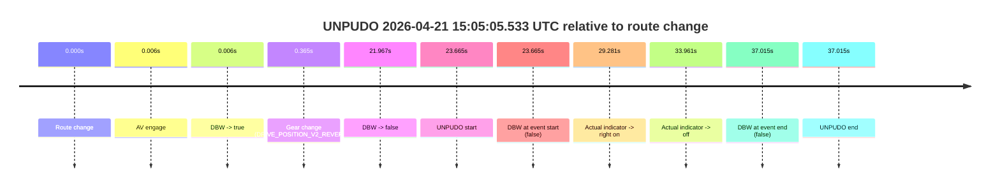

| Metric | Value |
|---|---|
| Outcome | `fail` |
| Effective failure type | `not_av_owned` |
| Route change status | `found` |
| DBW at event start | `false` |
| DBW at event end | `false` |
| Predicted gear at AV start | `DRIVE_POSITION_V2_PARK` |
| Actual gear at AV start | `DRIVE_POSITION_V2_PARK` |
| Predicted gear at event start | `DRIVE_POSITION_V2_REVERSE` |
| Actual gear at event start | `DRIVE_POSITION_V2_REVERSE` |
| Planned indicator direction | `INDICATORS_STATE_V2_OFF` |
| Controller indicator direction | `INDICATORS_STATE_V2_OFF` |
| Actual indicator direction | `INDICATORS_STATE_V2_OFF` |
| Actual indicator at maneuver end | `INDICATORS_STATE_V2_OFF` |
| Driver accel help in AV | `false` |
| Driver accel help timestamp | `n/a` |
| Max accel pedal pct in AV | `0.0%` |
| Max brake pedal pct in AV | `8.3%` |
| Max speed mps in AV | `0.000` |
| Success timing baseline | `route change` |
| Route -> AV | `0.006s` |
| AV -> event start | `23.659s` |
| AV -> first motion | `n/a` |
| Success baseline -> event start | `23.665s` |
| Success baseline -> first motion | `n/a` |
| AV duration before disengagement | `21.961s` |
| Trajectory waypoint count | `38` |
| Driving-plan step count | `11` |

The scored portion starts from the AV-owned window, not from the pre-AV setup. Route-change search in the stopped pre-event segment was `found`, with the baseline therefore set to route change. At the event anchor the model predicts `DRIVE_POSITION_V2_REVERSE` and the actual gear is `DRIVE_POSITION_V2_REVERSE`. The effective model outcome is `fail` because `not_av_owned.`

### Resolution

| Field | Value |
|---|---|
| Final outcome | `fail` |
| Do we agree with this label? | `yes` |
| Source disengagement type | `none observed` |
| Resolved effective failure type | `not_av_owned` |
| Confidence | `high` |

## unpudo 2026-04-21 15:08:26.883 UTC

| Field | Value |
|---|---|
| Model | `eel-teal-outspoken` |
| Author | `zak` |
| Run ID | `fme20032/2026-04-21--14-17-54--gen2-av-cae1b391-dab2-4ad8-8f3a-0c5f0814d292` |
| Date | `2026-04-21` |
| Time (UTC) | `15:08:26.883` |
| Event type | `unpudo` |
| Disengagement type | `none observed` |
| Route change | `found` |
| Console | [run](https://console.sso.wayve.ai/run/fme20032/2026-04-21--14-17-54--gen2-av-cae1b391-dab2-4ad8-8f3a-0c5f0814d292?id=&time-unixus=1776784106883319) |
| Foxglove | [segment](https://app.foxglove.dev/wayve-on-prem/p/prj_0dX18KZdVHg1fmmI/view?ds=foxglove-stream&ds.deviceName=fme20032&ds.start=2026-04-21T15%3A06%3A46.618369Z&ds.end=2026-04-21T15%3A08%3A51.433310Z&layoutId=lay_0e7VD4WIKDQGU73Y&time=2026-04-21T15%3A08%3A26.883319Z) |

### Event card: fail

- Fail: the credited unpudo does not stay AV-owned. The event window starts with DBW true, and the maneuver outcome lands outside a clean AV-owned segment.

| Event | Time (UTC) | Delta from route change |
|---|---:|---:|
| Route change | 2026-04-21 15:06:56.618 | `0.000s` |
| First motion | 2026-04-21 15:07:13.049 | `16.431s` |
| Actual indicator -> right on | 2026-04-21 15:07:28.029 | `31.411s` |
| Gear change (DRIVE_POSITION_V2_DRIVE) | 2026-04-21 15:08:14.533 | `77.915s` |
| AV engage | 2026-04-21 15:08:16.493 | `79.875s` |
| DBW -> true | 2026-04-21 15:08:16.493 | `79.875s` |
| UNPUDO start | 2026-04-21 15:08:26.883 | `90.265s` |
| DBW at event start (true) | 2026-04-21 15:08:26.883 | `90.265s` |
| DBW -> false | 2026-04-21 15:08:30.994 | `94.376s` |
| DBW at event end (false) | 2026-04-21 15:08:41.433 | `104.815s` |
| UNPUDO end | 2026-04-21 15:08:41.433 | `104.815s` |
| Actual indicator -> off | 2026-04-21 15:08:42.529 | `105.911s` |

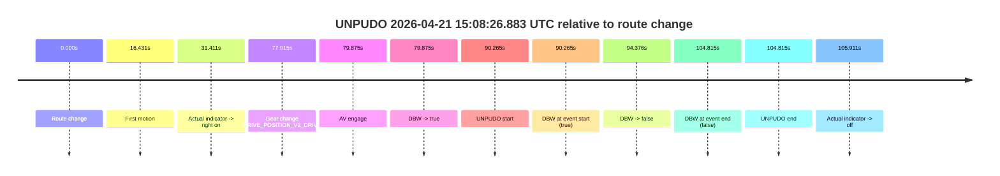

| Metric | Value |
|---|---|
| Outcome | `fail` |
| Effective failure type | `driver_completed_maneuver` |
| Route change status | `found` |
| DBW at event start | `true` |
| DBW at event end | `false` |
| Predicted gear at AV start | `DRIVE_POSITION_V2_DRIVE` |
| Actual gear at AV start | `DRIVE_POSITION_V2_DRIVE` |
| Predicted gear at event start | `DRIVE_POSITION_V2_DRIVE` |
| Actual gear at event start | `DRIVE_POSITION_V2_DRIVE` |
| Planned indicator direction | `INDICATORS_STATE_V2_RIGHT_ON` |
| Controller indicator direction | `INDICATORS_STATE_V2_RIGHT_ON` |
| Actual indicator direction | `INDICATORS_STATE_V2_RIGHT_ON` |
| Actual indicator at maneuver end | `INDICATORS_STATE_V2_RIGHT_ON` |
| Driver accel help in AV | `false` |
| Driver accel help timestamp | `n/a` |
| Max accel pedal pct in AV | `0.0%` |
| Max brake pedal pct in AV | `8.0%` |
| Max speed mps in AV | `2.011` |
| Success timing baseline | `route change` |
| Route -> AV | `79.875s` |
| AV -> event start | `10.390s` |
| AV -> first motion | `-63.444s` |
| Success baseline -> event start | `90.265s` |
| Success baseline -> first motion | `16.431s` |
| AV duration before disengagement | `14.501s` |
| Trajectory waypoint count | `37` |
| Driving-plan step count | `11` |

The scored portion starts from the AV-owned window, not from the pre-AV setup. Route-change search in the stopped pre-event segment was `found`, with the baseline therefore set to route change. At the event anchor the model predicts `DRIVE_POSITION_V2_DRIVE` and the actual gear is `DRIVE_POSITION_V2_DRIVE`. The effective model outcome is `fail` because `driver_completed_maneuver.`

### Resolution

| Field | Value |
|---|---|
| Final outcome | `fail` |
| Do we agree with this label? | `yes` |
| Source disengagement type | `none observed` |
| Resolved effective failure type | `driver_completed_maneuver` |
| Confidence | `high` |

## unpudo 2026-04-21 15:16:52.633 UTC

| Field | Value |
|---|---|
| Model | `eel-teal-outspoken` |
| Author | `zak` |
| Run ID | `fme20032/2026-04-21--14-17-54--gen2-av-cae1b391-dab2-4ad8-8f3a-0c5f0814d292` |
| Date | `2026-04-21` |
| Time (UTC) | `15:16:52.633` |
| Event type | `unpudo` |
| Disengagement type | `none observed` |
| Route change | `found` |
| Console | [run](https://console.sso.wayve.ai/run/fme20032/2026-04-21--14-17-54--gen2-av-cae1b391-dab2-4ad8-8f3a-0c5f0814d292?id=&time-unixus=1776784612633323) |
| Foxglove | [segment](https://app.foxglove.dev/wayve-on-prem/p/prj_0dX18KZdVHg1fmmI/view?ds=foxglove-stream&ds.deviceName=fme20032&ds.start=2026-04-21T15%3A16%3A33.868283Z&ds.end=2026-04-21T15%3A22%3A47.534252Z&layoutId=lay_0e7VD4WIKDQGU73Y&time=2026-04-21T15%3A16%3A52.633323Z) |

### Event card: pass

- Pass: AV owns the credited unpudo from route change through the official unpudo window, the gear state is aligned at the anchor, and the vehicle moves without driver accelerator help in AV.

| Event | Time (UTC) | Delta from route change |
|---|---:|---:|
| Route change | 2026-04-21 15:16:43.868 | `0.000s` |
| AV engage | 2026-04-21 15:16:48.594 | `4.726s` |
| DBW -> true | 2026-04-21 15:16:48.594 | `4.726s` |
| Gear change (DRIVE_POSITION_V2_DRIVE) | 2026-04-21 15:16:49.033 | `5.165s` |
| UNPUDO start | 2026-04-21 15:16:52.633 | `8.765s` |
| DBW at event start (true) | 2026-04-21 15:16:52.633 | `8.765s` |
| First motion | 2026-04-21 15:16:52.669 | `8.801s` |
| DBW at event end (true) | 2026-04-21 15:16:56.033 | `12.165s` |
| UNPUDO end | 2026-04-21 15:16:56.033 | `12.165s` |
| DBW -> false | 2026-04-21 15:22:37.534 | `353.666s` |
| Actual indicator -> right on | 2026-04-21 15:22:46.649 | `362.782s` |
| Actual indicator -> off | 2026-04-21 15:22:53.550 | `369.682s` |

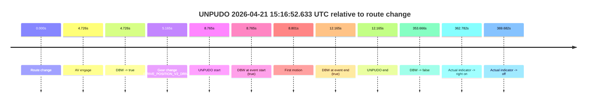

| Metric | Value |
|---|---|
| Outcome | `pass` |
| Effective failure type | `none` |
| Route change status | `found` |
| DBW at event start | `true` |
| DBW at event end | `true` |
| Predicted gear at AV start | `DRIVE_POSITION_V2_DRIVE` |
| Actual gear at AV start | `DRIVE_POSITION_V2_PARK` |
| Predicted gear at event start | `DRIVE_POSITION_V2_DRIVE` |
| Actual gear at event start | `DRIVE_POSITION_V2_DRIVE` |
| Planned indicator direction | `INDICATORS_STATE_V2_RIGHT_ON` |
| Controller indicator direction | `INDICATORS_STATE_V2_RIGHT_ON` |
| Actual indicator direction | `INDICATORS_STATE_V2_OFF` |
| Actual indicator at maneuver end | `INDICATORS_STATE_V2_OFF` |
| Driver accel help in AV | `false` |
| Driver accel help timestamp | `n/a` |
| Max accel pedal pct in AV | `0.0%` |
| Max brake pedal pct in AV | `8.0%` |
| Max speed mps in AV | `5.278` |
| Success timing baseline | `route change` |
| Route -> AV | `4.726s` |
| AV -> event start | `4.039s` |
| AV -> first motion | `4.075s` |
| Success baseline -> event start | `8.765s` |
| Success baseline -> first motion | `8.801s` |
| AV duration before disengagement | `348.940s` |
| Trajectory waypoint count | `36` |
| Driving-plan step count | `11` |

The scored portion starts from the AV-owned window, not from the pre-AV setup. Route-change search in the stopped pre-event segment was `found`, with the baseline therefore set to route change. At the event anchor the model predicts `DRIVE_POSITION_V2_DRIVE` and the actual gear is `DRIVE_POSITION_V2_DRIVE`. The effective model outcome is `pass` because `the credited unpudo stays AV-owned through the official unpudo window.`

### Resolution

| Field | Value |
|---|---|
| Final outcome | `pass` |
| Do we agree with this label? | `yes` |
| Source disengagement type | `none observed` |
| Resolved effective failure type | `none` |
| Confidence | `high` |

## unpudo 2026-04-21 15:37:39.333 UTC

| Field | Value |
|---|---|
| Model | `eel-teal-outspoken` |
| Author | `zak` |
| Run ID | `fme20032/2026-04-21--14-17-54--gen2-av-cae1b391-dab2-4ad8-8f3a-0c5f0814d292` |
| Date | `2026-04-21` |
| Time (UTC) | `15:37:39.333` |
| Event type | `unpudo` |
| Disengagement type | `none observed` |
| Route change | `found` |
| Console | [run](https://console.sso.wayve.ai/run/fme20032/2026-04-21--14-17-54--gen2-av-cae1b391-dab2-4ad8-8f3a-0c5f0814d292?id=&time-unixus=1776785859333315) |
| Foxglove | [segment](https://app.foxglove.dev/wayve-on-prem/p/prj_0dX18KZdVHg1fmmI/view?ds=foxglove-stream&ds.deviceName=fme20032&ds.start=2026-04-21T15%3A35%3A41.718433Z&ds.end=2026-04-21T15%3A39%3A39.275586Z&layoutId=lay_0e7VD4WIKDQGU73Y&time=2026-04-21T15%3A37%3A39.333315Z) |

### Event card: pass

- Pass: AV owns the credited unpudo from route change through the official unpudo window, the gear state is aligned at the anchor, and the vehicle moves without driver accelerator help in AV.

| Event | Time (UTC) | Delta from route change |
|---|---:|---:|
| Route change | 2026-04-21 15:35:51.718 | `0.000s` |
| First motion | 2026-04-21 15:35:52.930 | `1.212s` |
| AV engage | 2026-04-21 15:37:31.074 | `99.356s` |
| DBW -> true | 2026-04-21 15:37:31.074 | `99.356s` |
| Gear change (DRIVE_POSITION_V2_DRIVE) | 2026-04-21 15:37:31.533 | `99.815s` |
| UNPUDO start | 2026-04-21 15:37:39.333 | `107.615s` |
| DBW at event start (true) | 2026-04-21 15:37:39.333 | `107.615s` |
| DBW at event end (true) | 2026-04-21 15:37:42.683 | `110.965s` |
| UNPUDO end | 2026-04-21 15:37:42.683 | `110.965s` |
| DBW -> false | 2026-04-21 15:39:29.275 | `217.557s` |

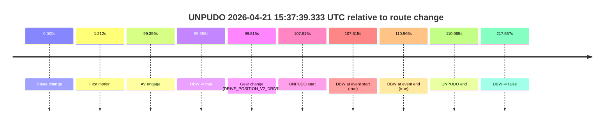

| Metric | Value |
|---|---|
| Outcome | `pass` |
| Effective failure type | `none` |
| Route change status | `found` |
| DBW at event start | `true` |
| DBW at event end | `true` |
| Predicted gear at AV start | `DRIVE_POSITION_V2_DRIVE` |
| Actual gear at AV start | `DRIVE_POSITION_V2_PARK` |
| Predicted gear at event start | `DRIVE_POSITION_V2_DRIVE` |
| Actual gear at event start | `DRIVE_POSITION_V2_DRIVE` |
| Planned indicator direction | `INDICATORS_STATE_V2_LEFT_ON` |
| Controller indicator direction | `INDICATORS_STATE_V2_LEFT_ON` |
| Actual indicator direction | `INDICATORS_STATE_V2_OFF` |
| Actual indicator at maneuver end | `INDICATORS_STATE_V2_OFF` |
| Driver accel help in AV | `false` |
| Driver accel help timestamp | `n/a` |
| Max accel pedal pct in AV | `0.0%` |
| Max brake pedal pct in AV | `8.0%` |
| Max speed mps in AV | `5.136` |
| Success timing baseline | `route change` |
| Route -> AV | `99.356s` |
| AV -> event start | `8.259s` |
| AV -> first motion | `-98.144s` |
| Success baseline -> event start | `107.615s` |
| Success baseline -> first motion | `1.212s` |
| AV duration before disengagement | `118.201s` |
| Trajectory waypoint count | `38` |
| Driving-plan step count | `11` |

The scored portion starts from the AV-owned window, not from the pre-AV setup. Route-change search in the stopped pre-event segment was `found`, with the baseline therefore set to route change. At the event anchor the model predicts `DRIVE_POSITION_V2_DRIVE` and the actual gear is `DRIVE_POSITION_V2_DRIVE`. The effective model outcome is `pass` because `the credited unpudo stays AV-owned through the official unpudo window.`

### Resolution

| Field | Value |
|---|---|
| Final outcome | `pass` |
| Do we agree with this label? | `yes` |
| Source disengagement type | `none observed` |
| Resolved effective failure type | `none` |
| Confidence | `high` |

## unpudo 2026-04-21 15:41:27.233 UTC

| Field | Value |
|---|---|
| Model | `eel-teal-outspoken` |
| Author | `zak` |
| Run ID | `fme20032/2026-04-21--14-17-54--gen2-av-cae1b391-dab2-4ad8-8f3a-0c5f0814d292` |
| Date | `2026-04-21` |
| Time (UTC) | `15:41:27.233` |
| Event type | `unpudo` |
| Disengagement type | `none observed` |
| Route change | `found` |
| Console | [run](https://console.sso.wayve.ai/run/fme20032/2026-04-21--14-17-54--gen2-av-cae1b391-dab2-4ad8-8f3a-0c5f0814d292?id=&time-unixus=1776786087233315) |
| Foxglove | [segment](https://app.foxglove.dev/wayve-on-prem/p/prj_0dX18KZdVHg1fmmI/view?ds=foxglove-stream&ds.deviceName=fme20032&ds.start=2026-04-21T15%3A41%3A13.268300Z&ds.end=2026-04-21T15%3A42%3A03.015456Z&layoutId=lay_0e7VD4WIKDQGU73Y&time=2026-04-21T15%3A41%3A27.233315Z) |

### Event card: pass

- Pass: AV owns the credited unpudo from route change through the official unpudo window, the gear state is aligned at the anchor, and the vehicle moves without driver accelerator help in AV.

| Event | Time (UTC) | Delta from route change |
|---|---:|---:|
| Route change | 2026-04-21 15:41:23.268 | `0.000s` |
| AV engage | 2026-04-21 15:41:23.274 | `0.006s` |
| DBW -> true | 2026-04-21 15:41:23.274 | `0.006s` |
| Gear change (DRIVE_POSITION_V2_DRIVE) | 2026-04-21 15:41:23.683 | `0.415s` |
| UNPUDO start | 2026-04-21 15:41:27.233 | `3.965s` |
| DBW at event start (true) | 2026-04-21 15:41:27.233 | `3.965s` |
| First motion | 2026-04-21 15:41:27.270 | `4.002s` |
| DBW at event end (true) | 2026-04-21 15:41:30.733 | `7.465s` |
| UNPUDO end | 2026-04-21 15:41:30.733 | `7.465s` |
| DBW -> false | 2026-04-21 15:41:53.015 | `29.747s` |
| Actual indicator -> left on | 2026-04-21 15:42:00.949 | `37.681s` |

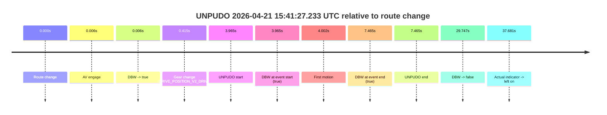

| Metric | Value |
|---|---|
| Outcome | `pass` |
| Effective failure type | `none` |
| Route change status | `found` |
| DBW at event start | `true` |
| DBW at event end | `true` |
| Predicted gear at AV start | `DRIVE_POSITION_V2_PARK` |
| Actual gear at AV start | `DRIVE_POSITION_V2_PARK` |
| Predicted gear at event start | `DRIVE_POSITION_V2_DRIVE` |
| Actual gear at event start | `DRIVE_POSITION_V2_DRIVE` |
| Planned indicator direction | `INDICATORS_STATE_V2_RIGHT_ON` |
| Controller indicator direction | `INDICATORS_STATE_V2_RIGHT_ON` |
| Actual indicator direction | `INDICATORS_STATE_V2_OFF` |
| Actual indicator at maneuver end | `INDICATORS_STATE_V2_OFF` |
| Driver accel help in AV | `false` |
| Driver accel help timestamp | `n/a` |
| Max accel pedal pct in AV | `0.0%` |
| Max brake pedal pct in AV | `8.0%` |
| Max speed mps in AV | `4.522` |
| Success timing baseline | `route change` |
| Route -> AV | `0.006s` |
| AV -> event start | `3.959s` |
| AV -> first motion | `3.996s` |
| Success baseline -> event start | `3.965s` |
| Success baseline -> first motion | `4.002s` |
| AV duration before disengagement | `29.741s` |
| Trajectory waypoint count | `38` |
| Driving-plan step count | `11` |

The scored portion starts from the AV-owned window, not from the pre-AV setup. Route-change search in the stopped pre-event segment was `found`, with the baseline therefore set to route change. At the event anchor the model predicts `DRIVE_POSITION_V2_DRIVE` and the actual gear is `DRIVE_POSITION_V2_DRIVE`. The effective model outcome is `pass` because `the credited unpudo stays AV-owned through the official unpudo window.`

### Resolution

| Field | Value |
|---|---|
| Final outcome | `pass` |
| Do we agree with this label? | `yes` |
| Source disengagement type | `none observed` |
| Resolved effective failure type | `none` |
| Confidence | `high` |

## unpudo 2026-04-21 15:42:20.283 UTC

| Field | Value |
|---|---|
| Model | `eel-teal-outspoken` |
| Author | `zak` |
| Run ID | `fme20032/2026-04-21--14-17-54--gen2-av-cae1b391-dab2-4ad8-8f3a-0c5f0814d292` |
| Date | `2026-04-21` |
| Time (UTC) | `15:42:20.283` |
| Event type | `unpudo` |
| Disengagement type | `none observed` |
| Route change | `found` |
| Console | [run](https://console.sso.wayve.ai/run/fme20032/2026-04-21--14-17-54--gen2-av-cae1b391-dab2-4ad8-8f3a-0c5f0814d292?id=&time-unixus=1776786140283296) |
| Foxglove | [segment](https://app.foxglove.dev/wayve-on-prem/p/prj_0dX18KZdVHg1fmmI/view?ds=foxglove-stream&ds.deviceName=fme20032&ds.start=2026-04-21T15%3A41%3A13.268300Z&ds.end=2026-04-21T15%3A46%3A12.414409Z&layoutId=lay_0e7VD4WIKDQGU73Y&time=2026-04-21T15%3A42%3A20.283296Z) |

### Event card: pass

- Pass: AV owns the credited unpudo from route change through the official unpudo window, the gear state is aligned at the anchor, and the vehicle moves without driver accelerator help in AV.

| Event | Time (UTC) | Delta from route change |
|---|---:|---:|
| Route change | 2026-04-21 15:41:23.268 | `0.000s` |
| First motion | 2026-04-21 15:41:27.270 | `4.002s` |
| Actual indicator -> left on | 2026-04-21 15:42:00.949 | `37.681s` |
| AV engage | 2026-04-21 15:42:16.274 | `53.006s` |
| DBW -> true | 2026-04-21 15:42:16.274 | `53.006s` |
| Gear change (DRIVE_POSITION_V2_DRIVE) | 2026-04-21 15:42:16.733 | `53.465s` |
| UNPUDO start | 2026-04-21 15:42:20.283 | `57.015s` |
| DBW at event start (true) | 2026-04-21 15:42:20.283 | `57.015s` |
| DBW at event end (true) | 2026-04-21 15:42:23.733 | `60.465s` |
| UNPUDO end | 2026-04-21 15:42:23.733 | `60.465s` |
| Actual indicator -> off | 2026-04-21 15:42:26.809 | `63.541s` |
| Actual indicator -> right on | 2026-04-21 15:44:51.629 | `208.361s` |
| Actual indicator -> off | 2026-04-21 15:44:53.049 | `209.781s` |
| DBW -> false | 2026-04-21 15:46:02.414 | `279.146s` |
| Actual indicator -> left on | 2026-04-21 15:46:03.509 | `280.241s` |
| Actual indicator -> off | 2026-04-21 15:46:19.809 | `296.541s` |

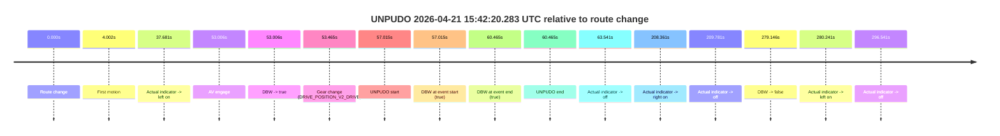

| Metric | Value |
|---|---|
| Outcome | `pass` |
| Effective failure type | `none` |
| Route change status | `found` |
| DBW at event start | `true` |
| DBW at event end | `true` |
| Predicted gear at AV start | `DRIVE_POSITION_V2_DRIVE` |
| Actual gear at AV start | `DRIVE_POSITION_V2_PARK` |
| Predicted gear at event start | `DRIVE_POSITION_V2_DRIVE` |
| Actual gear at event start | `DRIVE_POSITION_V2_DRIVE` |
| Planned indicator direction | `INDICATORS_STATE_V2_RIGHT_ON` |
| Controller indicator direction | `INDICATORS_STATE_V2_RIGHT_ON` |
| Actual indicator direction | `INDICATORS_STATE_V2_LEFT_ON` |
| Actual indicator at maneuver end | `INDICATORS_STATE_V2_LEFT_ON` |
| Driver accel help in AV | `false` |
| Driver accel help timestamp | `n/a` |
| Max accel pedal pct in AV | `0.0%` |
| Max brake pedal pct in AV | `8.0%` |
| Max speed mps in AV | `4.864` |
| Success timing baseline | `route change` |
| Route -> AV | `53.006s` |
| AV -> event start | `4.009s` |
| AV -> first motion | `-49.004s` |
| Success baseline -> event start | `57.015s` |
| Success baseline -> first motion | `4.002s` |
| AV duration before disengagement | `226.140s` |
| Trajectory waypoint count | `37` |
| Driving-plan step count | `11` |

The scored portion starts from the AV-owned window, not from the pre-AV setup. Route-change search in the stopped pre-event segment was `found`, with the baseline therefore set to route change. At the event anchor the model predicts `DRIVE_POSITION_V2_DRIVE` and the actual gear is `DRIVE_POSITION_V2_DRIVE`. The effective model outcome is `pass` because `the credited unpudo stays AV-owned through the official unpudo window.`

### Resolution

| Field | Value |
|---|---|
| Final outcome | `pass` |
| Do we agree with this label? | `yes` |
| Source disengagement type | `none observed` |
| Resolved effective failure type | `none` |
| Confidence | `high` |

## unpudo 2026-04-21 15:46:08.683 UTC

| Field | Value |
|---|---|
| Model | `eel-teal-outspoken` |
| Author | `zak` |
| Run ID | `fme20032/2026-04-21--14-17-54--gen2-av-cae1b391-dab2-4ad8-8f3a-0c5f0814d292` |
| Date | `2026-04-21` |
| Time (UTC) | `15:46:08.683` |
| Event type | `unpudo` |
| Disengagement type | `none observed` |
| Route change | `found` |
| Console | [run](https://console.sso.wayve.ai/run/fme20032/2026-04-21--14-17-54--gen2-av-cae1b391-dab2-4ad8-8f3a-0c5f0814d292?id=&time-unixus=1776786368683324) |
| Foxglove | [segment](https://app.foxglove.dev/wayve-on-prem/p/prj_0dX18KZdVHg1fmmI/view?ds=foxglove-stream&ds.deviceName=fme20032&ds.start=2026-04-21T15%3A45%3A26.783306Z&ds.end=2026-04-21T15%3A46%3A34.233297Z&layoutId=lay_0e7VD4WIKDQGU73Y&time=2026-04-21T15%3A46%3A08.683324Z) |

### Event card: fail

- Fail: the credited unpudo does not stay AV-owned. The event window starts with DBW false, and the maneuver outcome lands outside a clean AV-owned segment.

| Event | Time (UTC) | Delta from route change |
|---|---:|---:|
| Gear change (DRIVE_POSITION_V2_DRIVE) | 2026-04-21 15:45:36.783 | `-5.385s` |
| Route change | 2026-04-21 15:45:42.168 | `0.000s` |
| AV engage | 2026-04-21 15:45:42.174 | `0.006s` |
| DBW -> true | 2026-04-21 15:45:42.174 | `0.006s` |
| DBW -> false | 2026-04-21 15:46:02.414 | `20.246s` |
| Actual indicator -> left on | 2026-04-21 15:46:03.509 | `21.341s` |
| UNPUDO start | 2026-04-21 15:46:08.683 | `26.515s` |
| DBW at event start (false) | 2026-04-21 15:46:08.683 | `26.515s` |
| Actual indicator -> off | 2026-04-21 15:46:19.809 | `37.641s` |
| DBW at event end (false) | 2026-04-21 15:46:24.233 | `42.065s` |
| UNPUDO end | 2026-04-21 15:46:24.233 | `42.065s` |

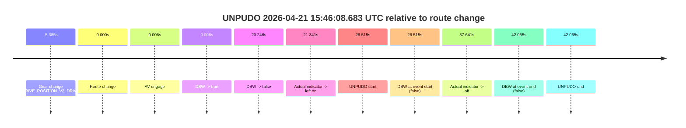

| Metric | Value |
|---|---|
| Outcome | `fail` |
| Effective failure type | `not_av_owned` |
| Route change status | `found` |
| DBW at event start | `false` |
| DBW at event end | `false` |
| Predicted gear at AV start | `DRIVE_POSITION_V2_DRIVE` |
| Actual gear at AV start | `DRIVE_POSITION_V2_DRIVE` |
| Predicted gear at event start | `DRIVE_POSITION_V2_DRIVE` |
| Actual gear at event start | `DRIVE_POSITION_V2_DRIVE` |
| Planned indicator direction | `INDICATORS_STATE_V2_OFF` |
| Controller indicator direction | `INDICATORS_STATE_V2_OFF` |
| Actual indicator direction | `INDICATORS_STATE_V2_LEFT_ON` |
| Actual indicator at maneuver end | `INDICATORS_STATE_V2_OFF` |
| Driver accel help in AV | `false` |
| Driver accel help timestamp | `n/a` |
| Max accel pedal pct in AV | `0.0%` |
| Max brake pedal pct in AV | `8.0%` |
| Max speed mps in AV | `0.000` |
| Success timing baseline | `route change` |
| Route -> AV | `0.006s` |
| AV -> event start | `26.509s` |
| AV -> first motion | `n/a` |
| Success baseline -> event start | `26.515s` |
| Success baseline -> first motion | `n/a` |
| AV duration before disengagement | `20.240s` |
| Trajectory waypoint count | `37` |
| Driving-plan step count | `11` |

The scored portion starts from the AV-owned window, not from the pre-AV setup. Route-change search in the stopped pre-event segment was `found`, with the baseline therefore set to route change. At the event anchor the model predicts `DRIVE_POSITION_V2_DRIVE` and the actual gear is `DRIVE_POSITION_V2_DRIVE`. The effective model outcome is `fail` because `not_av_owned.`

### Resolution

| Field | Value |
|---|---|
| Final outcome | `fail` |
| Do we agree with this label? | `yes` |
| Source disengagement type | `none observed` |
| Resolved effective failure type | `not_av_owned` |
| Confidence | `high` |

## unpudo 2026-04-21 16:22:27.383 UTC

| Field | Value |
|---|---|
| Model | `eel-teal-outspoken` |
| Author | `zak` |
| Run ID | `fme20032/2026-04-21--14-17-54--gen2-av-cae1b391-dab2-4ad8-8f3a-0c5f0814d292` |
| Date | `2026-04-21` |
| Time (UTC) | `16:22:27.383` |
| Event type | `unpudo` |
| Disengagement type | `none observed` |
| Route change | `found` |
| Console | [run](https://console.sso.wayve.ai/run/fme20032/2026-04-21--14-17-54--gen2-av-cae1b391-dab2-4ad8-8f3a-0c5f0814d292?id=&time-unixus=1776788547383303) |
| Foxglove | [segment](https://app.foxglove.dev/wayve-on-prem/p/prj_0dX18KZdVHg1fmmI/view?ds=foxglove-stream&ds.deviceName=fme20032&ds.start=2026-04-21T16%3A21%3A31.568311Z&ds.end=2026-04-21T16%3A22%3A43.183301Z&layoutId=lay_0e7VD4WIKDQGU73Y&time=2026-04-21T16%3A22%3A27.383303Z) |

### Event card: fail

- Fail: the credited unpudo does not stay AV-owned. The event window starts with DBW false, and the maneuver outcome lands outside a clean AV-owned segment.

| Event | Time (UTC) | Delta from route change |
|---|---:|---:|
| Route change | 2026-04-21 16:21:41.568 | `0.000s` |
| AV engage | 2026-04-21 16:21:47.714 | `6.146s` |
| DBW -> true | 2026-04-21 16:21:47.714 | `6.146s` |
| Gear change (DRIVE_POSITION_V2_DRIVE) | 2026-04-21 16:21:48.083 | `6.515s` |
| DBW -> false | 2026-04-21 16:22:26.354 | `44.786s` |
| UNPUDO start | 2026-04-21 16:22:27.383 | `45.815s` |
| DBW at event start (false) | 2026-04-21 16:22:27.383 | `45.815s` |
| DBW at event end (false) | 2026-04-21 16:22:33.183 | `51.615s` |
| UNPUDO end | 2026-04-21 16:22:33.183 | `51.615s` |

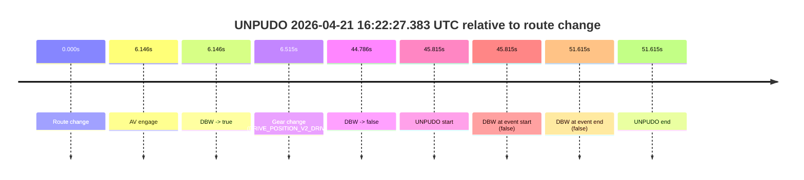

| Metric | Value |
|---|---|
| Outcome | `fail` |
| Effective failure type | `not_av_owned` |
| Route change status | `found` |
| DBW at event start | `false` |
| DBW at event end | `false` |
| Predicted gear at AV start | `DRIVE_POSITION_V2_DRIVE` |
| Actual gear at AV start | `DRIVE_POSITION_V2_PARK` |
| Predicted gear at event start | `DRIVE_POSITION_V2_DRIVE` |
| Actual gear at event start | `DRIVE_POSITION_V2_DRIVE` |
| Planned indicator direction | `INDICATORS_STATE_V2_LEFT_ON` |
| Controller indicator direction | `INDICATORS_STATE_V2_LEFT_ON` |
| Actual indicator direction | `INDICATORS_STATE_V2_OFF` |
| Actual indicator at maneuver end | `INDICATORS_STATE_V2_OFF` |
| Driver accel help in AV | `false` |
| Driver accel help timestamp | `n/a` |
| Max accel pedal pct in AV | `0.0%` |
| Max brake pedal pct in AV | `8.0%` |
| Max speed mps in AV | `0.000` |
| Success timing baseline | `route change` |
| Route -> AV | `6.146s` |
| AV -> event start | `39.669s` |
| AV -> first motion | `n/a` |
| Success baseline -> event start | `45.815s` |
| Success baseline -> first motion | `n/a` |
| AV duration before disengagement | `38.640s` |
| Trajectory waypoint count | `37` |
| Driving-plan step count | `11` |

The scored portion starts from the AV-owned window, not from the pre-AV setup. Route-change search in the stopped pre-event segment was `found`, with the baseline therefore set to route change. At the event anchor the model predicts `DRIVE_POSITION_V2_DRIVE` and the actual gear is `DRIVE_POSITION_V2_DRIVE`. The effective model outcome is `fail` because `not_av_owned.`

### Resolution

| Field | Value |
|---|---|
| Final outcome | `fail` |
| Do we agree with this label? | `yes` |
| Source disengagement type | `none observed` |
| Resolved effective failure type | `not_av_owned` |
| Confidence | `high` |

## unpudo 2026-04-21 16:27:08.933 UTC

| Field | Value |
|---|---|
| Model | `eel-teal-outspoken` |
| Author | `zak` |
| Run ID | `fme20032/2026-04-21--14-17-54--gen2-av-cae1b391-dab2-4ad8-8f3a-0c5f0814d292` |
| Date | `2026-04-21` |
| Time (UTC) | `16:27:08.933` |
| Event type | `unpudo` |
| Disengagement type | `none observed` |
| Route change | `found` |
| Console | [run](https://console.sso.wayve.ai/run/fme20032/2026-04-21--14-17-54--gen2-av-cae1b391-dab2-4ad8-8f3a-0c5f0814d292?id=&time-unixus=1776788828933318) |
| Foxglove | [segment](https://app.foxglove.dev/wayve-on-prem/p/prj_0dX18KZdVHg1fmmI/view?ds=foxglove-stream&ds.deviceName=fme20032&ds.start=2026-04-21T16%3A26%3A49.118298Z&ds.end=2026-04-21T16%3A27%3A26.633316Z&layoutId=lay_0e7VD4WIKDQGU73Y&time=2026-04-21T16%3A27%3A08.933318Z) |

### Event card: fail

- Fail: the credited unpudo does not stay AV-owned. The event window starts with DBW false, and the maneuver outcome lands outside a clean AV-owned segment.

| Event | Time (UTC) | Delta from route change |
|---|---:|---:|
| Route change | 2026-04-21 16:26:59.118 | `0.000s` |
| AV engage | 2026-04-21 16:27:04.114 | `4.996s` |
| DBW -> true | 2026-04-21 16:27:04.114 | `4.996s` |
| Gear change (DRIVE_POSITION_V2_DRIVE) | 2026-04-21 16:27:04.533 | `5.415s` |
| DBW -> false | 2026-04-21 16:27:08.874 | `9.756s` |
| UNPUDO start | 2026-04-21 16:27:08.933 | `9.815s` |
| DBW at event start (false) | 2026-04-21 16:27:08.933 | `9.815s` |
| Actual indicator -> right on | 2026-04-21 16:27:15.129 | `16.011s` |
| DBW at event end (false) | 2026-04-21 16:27:16.633 | `17.515s` |
| UNPUDO end | 2026-04-21 16:27:16.633 | `17.515s` |
| Actual indicator -> off | 2026-04-21 16:27:17.029 | `17.911s` |

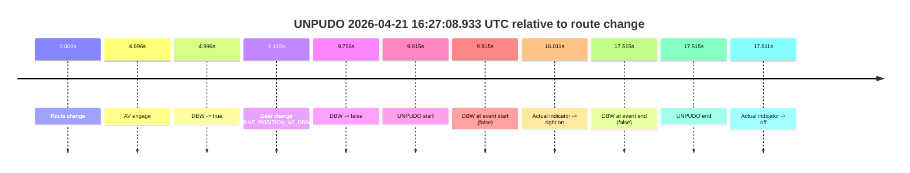

| Metric | Value |
|---|---|
| Outcome | `fail` |
| Effective failure type | `not_av_owned` |
| Route change status | `found` |
| DBW at event start | `false` |
| DBW at event end | `false` |
| Predicted gear at AV start | `DRIVE_POSITION_V2_DRIVE` |
| Actual gear at AV start | `DRIVE_POSITION_V2_PARK` |
| Predicted gear at event start | `DRIVE_POSITION_V2_DRIVE` |
| Actual gear at event start | `DRIVE_POSITION_V2_DRIVE` |
| Planned indicator direction | `INDICATORS_STATE_V2_RIGHT_ON` |
| Controller indicator direction | `INDICATORS_STATE_V2_RIGHT_ON` |
| Actual indicator direction | `INDICATORS_STATE_V2_OFF` |
| Actual indicator at maneuver end | `INDICATORS_STATE_V2_RIGHT_ON` |
| Driver accel help in AV | `false` |
| Driver accel help timestamp | `n/a` |
| Max accel pedal pct in AV | `0.0%` |
| Max brake pedal pct in AV | `8.3%` |
| Max speed mps in AV | `0.000` |
| Success timing baseline | `route change` |
| Route -> AV | `4.996s` |
| AV -> event start | `4.819s` |
| AV -> first motion | `n/a` |
| Success baseline -> event start | `9.815s` |
| Success baseline -> first motion | `n/a` |
| AV duration before disengagement | `4.760s` |
| Trajectory waypoint count | `38` |
| Driving-plan step count | `11` |

The scored portion starts from the AV-owned window, not from the pre-AV setup. Route-change search in the stopped pre-event segment was `found`, with the baseline therefore set to route change. At the event anchor the model predicts `DRIVE_POSITION_V2_DRIVE` and the actual gear is `DRIVE_POSITION_V2_DRIVE`. The effective model outcome is `fail` because `not_av_owned.`

### Resolution

| Field | Value |
|---|---|
| Final outcome | `fail` |
| Do we agree with this label? | `yes` |
| Source disengagement type | `none observed` |
| Resolved effective failure type | `not_av_owned` |
| Confidence | `high` |

## unpudo 2026-04-21 17:07:29.633 UTC

| Field | Value |
|---|---|
| Model | `eel-teal-outspoken` |
| Author | `zak` |
| Run ID | `fme20032/2026-04-21--14-17-54--gen2-av-cae1b391-dab2-4ad8-8f3a-0c5f0814d292` |
| Date | `2026-04-21` |
| Time (UTC) | `17:07:29.633` |
| Event type | `unpudo` |
| Disengagement type | `none observed` |
| Route change | `found` |
| Console | [run](https://console.sso.wayve.ai/run/fme20032/2026-04-21--14-17-54--gen2-av-cae1b391-dab2-4ad8-8f3a-0c5f0814d292?id=&time-unixus=1776791249633306) |
| Foxglove | [segment](https://app.foxglove.dev/wayve-on-prem/p/prj_0dX18KZdVHg1fmmI/view?ds=foxglove-stream&ds.deviceName=fme20032&ds.start=2026-04-21T17%3A07%3A02.468256Z&ds.end=2026-04-21T17%3A07%3A45.783304Z&layoutId=lay_0e7VD4WIKDQGU73Y&time=2026-04-21T17%3A07%3A29.633306Z) |

### Event card: fail

- Fail: the credited unpudo does not stay AV-owned. The event window starts with DBW true, and the maneuver outcome lands outside a clean AV-owned segment.

| Event | Time (UTC) | Delta from route change |
|---|---:|---:|
| Route change | 2026-04-21 17:07:12.468 | `0.000s` |
| AV engage | 2026-04-21 17:07:18.394 | `5.926s` |
| DBW -> true | 2026-04-21 17:07:18.394 | `5.926s` |
| Gear change (DRIVE_POSITION_V2_DRIVE) | 2026-04-21 17:07:18.833 | `6.365s` |
| UNPUDO start | 2026-04-21 17:07:29.633 | `17.165s` |
| DBW at event start (true) | 2026-04-21 17:07:29.633 | `17.165s` |
| First motion | 2026-04-21 17:07:29.689 | `17.221s` |
| DBW -> false | 2026-04-21 17:07:32.635 | `20.167s` |
| Actual indicator -> right on | 2026-04-21 17:07:35.049 | `22.582s` |
| DBW at event end (false) | 2026-04-21 17:07:35.783 | `23.315s` |
| UNPUDO end | 2026-04-21 17:07:35.783 | `23.315s` |
| Actual indicator -> off | 2026-04-21 17:07:36.389 | `23.921s` |

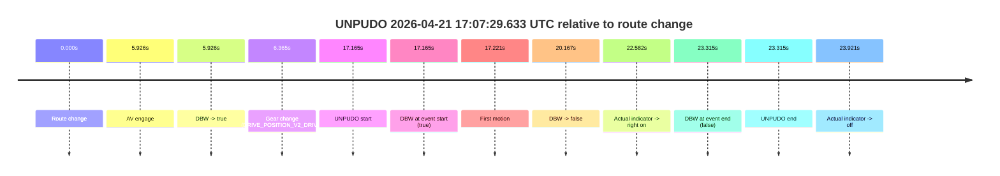

| Metric | Value |
|---|---|
| Outcome | `fail` |
| Effective failure type | `driver_completed_maneuver` |
| Route change status | `found` |
| DBW at event start | `true` |
| DBW at event end | `false` |
| Predicted gear at AV start | `DRIVE_POSITION_V2_DRIVE` |
| Actual gear at AV start | `DRIVE_POSITION_V2_PARK` |
| Predicted gear at event start | `DRIVE_POSITION_V2_DRIVE` |
| Actual gear at event start | `DRIVE_POSITION_V2_DRIVE` |
| Planned indicator direction | `INDICATORS_STATE_V2_RIGHT_ON` |
| Controller indicator direction | `INDICATORS_STATE_V2_RIGHT_ON` |
| Actual indicator direction | `INDICATORS_STATE_V2_OFF` |
| Actual indicator at maneuver end | `INDICATORS_STATE_V2_RIGHT_ON` |
| Driver accel help in AV | `false` |
| Driver accel help timestamp | `n/a` |
| Max accel pedal pct in AV | `0.0%` |
| Max brake pedal pct in AV | `11.1%` |
| Max speed mps in AV | `2.933` |
| Success timing baseline | `route change` |
| Route -> AV | `5.926s` |
| AV -> event start | `11.239s` |
| AV -> first motion | `11.295s` |
| Success baseline -> event start | `17.165s` |
| Success baseline -> first motion | `17.221s` |
| AV duration before disengagement | `14.241s` |
| Trajectory waypoint count | `38` |
| Driving-plan step count | `11` |

The scored portion starts from the AV-owned window, not from the pre-AV setup. Route-change search in the stopped pre-event segment was `found`, with the baseline therefore set to route change. At the event anchor the model predicts `DRIVE_POSITION_V2_DRIVE` and the actual gear is `DRIVE_POSITION_V2_DRIVE`. The effective model outcome is `fail` because `driver_completed_maneuver.`

### Resolution

| Field | Value |
|---|---|
| Final outcome | `fail` |
| Do we agree with this label? | `yes` |
| Source disengagement type | `none observed` |
| Resolved effective failure type | `driver_completed_maneuver` |
| Confidence | `high` |

## unpudo 2026-04-21 17:23:11.183 UTC

| Field | Value |
|---|---|
| Model | `eel-teal-outspoken` |
| Author | `zak` |
| Run ID | `fme20032/2026-04-21--14-17-54--gen2-av-cae1b391-dab2-4ad8-8f3a-0c5f0814d292` |
| Date | `2026-04-21` |
| Time (UTC) | `17:23:11.183` |
| Event type | `unpudo` |
| Disengagement type | `none observed` |
| Route change | `found` |
| Console | [run](https://console.sso.wayve.ai/run/fme20032/2026-04-21--14-17-54--gen2-av-cae1b391-dab2-4ad8-8f3a-0c5f0814d292?id=&time-unixus=1776792191183316) |
| Foxglove | [segment](https://app.foxglove.dev/wayve-on-prem/p/prj_0dX18KZdVHg1fmmI/view?ds=foxglove-stream&ds.deviceName=fme20032&ds.start=2026-04-21T17%3A22%3A11.168295Z&ds.end=2026-04-21T17%3A23%3A43.833320Z&layoutId=lay_0e7VD4WIKDQGU73Y&time=2026-04-21T17%3A23%3A11.183316Z) |

### Event card: fail

- Fail: the credited unpudo does not stay AV-owned. The event window starts with DBW false, and the maneuver outcome lands outside a clean AV-owned segment.

| Event | Time (UTC) | Delta from route change |
|---|---:|---:|
| Route change | 2026-04-21 17:22:21.168 | `0.000s` |
| AV engage | 2026-04-21 17:22:58.114 | `36.946s` |
| DBW -> true | 2026-04-21 17:22:58.114 | `36.946s` |
| Gear change (DRIVE_POSITION_V2_DRIVE) | 2026-04-21 17:22:58.433 | `37.265s` |
| DBW -> false | 2026-04-21 17:23:10.294 | `49.126s` |
| UNPUDO start | 2026-04-21 17:23:11.183 | `50.015s` |
| DBW at event start (false) | 2026-04-21 17:23:11.183 | `50.015s` |
| Actual indicator -> left on | 2026-04-21 17:23:13.189 | `52.021s` |
| Actual indicator -> off | 2026-04-21 17:23:31.809 | `70.641s` |
| DBW at event end (false) | 2026-04-21 17:23:33.833 | `72.665s` |
| UNPUDO end | 2026-04-21 17:23:33.833 | `72.665s` |

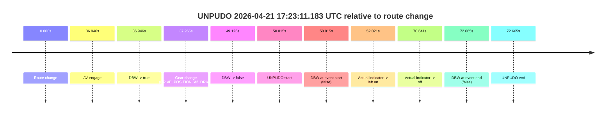

| Metric | Value |
|---|---|
| Outcome | `fail` |
| Effective failure type | `not_av_owned` |
| Route change status | `found` |
| DBW at event start | `false` |
| DBW at event end | `false` |
| Predicted gear at AV start | `DRIVE_POSITION_V2_DRIVE` |
| Actual gear at AV start | `DRIVE_POSITION_V2_PARK` |
| Predicted gear at event start | `DRIVE_POSITION_V2_DRIVE` |
| Actual gear at event start | `DRIVE_POSITION_V2_DRIVE` |
| Planned indicator direction | `INDICATORS_STATE_V2_LEFT_ON` |
| Controller indicator direction | `INDICATORS_STATE_V2_LEFT_ON` |
| Actual indicator direction | `INDICATORS_STATE_V2_OFF` |
| Actual indicator at maneuver end | `INDICATORS_STATE_V2_OFF` |
| Driver accel help in AV | `false` |
| Driver accel help timestamp | `n/a` |
| Max accel pedal pct in AV | `0.0%` |
| Max brake pedal pct in AV | `8.0%` |
| Max speed mps in AV | `0.000` |
| Success timing baseline | `route change` |
| Route -> AV | `36.946s` |
| AV -> event start | `13.069s` |
| AV -> first motion | `n/a` |
| Success baseline -> event start | `50.015s` |
| Success baseline -> first motion | `n/a` |
| AV duration before disengagement | `12.180s` |
| Trajectory waypoint count | `37` |
| Driving-plan step count | `11` |

The scored portion starts from the AV-owned window, not from the pre-AV setup. Route-change search in the stopped pre-event segment was `found`, with the baseline therefore set to route change. At the event anchor the model predicts `DRIVE_POSITION_V2_DRIVE` and the actual gear is `DRIVE_POSITION_V2_DRIVE`. The effective model outcome is `fail` because `not_av_owned.`

### Resolution

| Field | Value |
|---|---|
| Final outcome | `fail` |
| Do we agree with this label? | `yes` |
| Source disengagement type | `none observed` |
| Resolved effective failure type | `not_av_owned` |
| Confidence | `high` |

## unpudo 2026-04-21 17:27:05.233 UTC

| Field | Value |
|---|---|
| Model | `eel-teal-outspoken` |
| Author | `zak` |
| Run ID | `fme20032/2026-04-21--14-17-54--gen2-av-cae1b391-dab2-4ad8-8f3a-0c5f0814d292` |
| Date | `2026-04-21` |
| Time (UTC) | `17:27:05.233` |
| Event type | `unpudo` |
| Disengagement type | `none observed` |
| Route change | `found` |
| Console | [run](https://console.sso.wayve.ai/run/fme20032/2026-04-21--14-17-54--gen2-av-cae1b391-dab2-4ad8-8f3a-0c5f0814d292?id=&time-unixus=1776792425233294) |
| Foxglove | [segment](https://app.foxglove.dev/wayve-on-prem/p/prj_0dX18KZdVHg1fmmI/view?ds=foxglove-stream&ds.deviceName=fme20032&ds.start=2026-04-21T17%3A26%3A42.018292Z&ds.end=2026-04-21T17%3A27%3A18.733310Z&layoutId=lay_0e7VD4WIKDQGU73Y&time=2026-04-21T17%3A27%3A05.233294Z) |

### Event card: fail

- Fail: the credited unpudo does not stay AV-owned. The event window starts with DBW false, and the maneuver outcome lands outside a clean AV-owned segment.

| Event | Time (UTC) | Delta from route change |
|---|---:|---:|
| Route change | 2026-04-21 17:26:52.018 | `0.000s` |
| Actual indicator -> right on | 2026-04-21 17:26:56.109 | `4.091s` |
| AV engage | 2026-04-21 17:27:01.914 | `9.896s` |
| DBW -> true | 2026-04-21 17:27:01.914 | `9.896s` |
| Gear change (DRIVE_POSITION_V2_DRIVE) | 2026-04-21 17:27:02.233 | `10.215s` |
| DBW -> false | 2026-04-21 17:27:04.653 | `12.635s` |
| UNPUDO start | 2026-04-21 17:27:05.233 | `13.215s` |
| DBW at event start (false) | 2026-04-21 17:27:05.233 | `13.215s` |
| Actual indicator -> off | 2026-04-21 17:27:06.729 | `14.711s` |
| DBW at event end (false) | 2026-04-21 17:27:08.733 | `16.715s` |
| UNPUDO end | 2026-04-21 17:27:08.733 | `16.715s` |

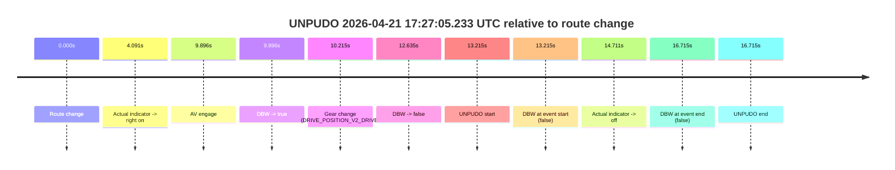

| Metric | Value |
|---|---|
| Outcome | `fail` |
| Effective failure type | `not_av_owned` |
| Route change status | `found` |
| DBW at event start | `false` |
| DBW at event end | `false` |
| Predicted gear at AV start | `DRIVE_POSITION_V2_DRIVE` |
| Actual gear at AV start | `DRIVE_POSITION_V2_PARK` |
| Predicted gear at event start | `DRIVE_POSITION_V2_DRIVE` |
| Actual gear at event start | `DRIVE_POSITION_V2_DRIVE` |
| Planned indicator direction | `INDICATORS_STATE_V2_RIGHT_ON` |
| Controller indicator direction | `INDICATORS_STATE_V2_RIGHT_ON` |
| Actual indicator direction | `INDICATORS_STATE_V2_RIGHT_ON` |
| Actual indicator at maneuver end | `INDICATORS_STATE_V2_OFF` |
| Driver accel help in AV | `false` |
| Driver accel help timestamp | `n/a` |
| Max accel pedal pct in AV | `0.0%` |
| Max brake pedal pct in AV | `8.5%` |
| Max speed mps in AV | `0.000` |
| Success timing baseline | `route change` |
| Route -> AV | `9.896s` |
| AV -> event start | `3.319s` |
| AV -> first motion | `n/a` |
| Success baseline -> event start | `13.215s` |
| Success baseline -> first motion | `n/a` |
| AV duration before disengagement | `2.739s` |
| Trajectory waypoint count | `38` |
| Driving-plan step count | `11` |

The scored portion starts from the AV-owned window, not from the pre-AV setup. Route-change search in the stopped pre-event segment was `found`, with the baseline therefore set to route change. At the event anchor the model predicts `DRIVE_POSITION_V2_DRIVE` and the actual gear is `DRIVE_POSITION_V2_DRIVE`. The effective model outcome is `fail` because `not_av_owned.`

### Resolution

| Field | Value |
|---|---|
| Final outcome | `fail` |
| Do we agree with this label? | `yes` |
| Source disengagement type | `none observed` |
| Resolved effective failure type | `not_av_owned` |
| Confidence | `high` |
