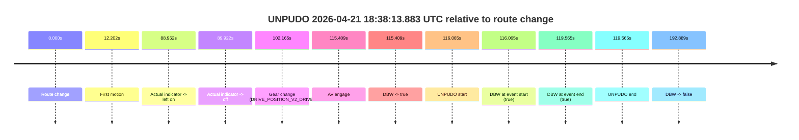
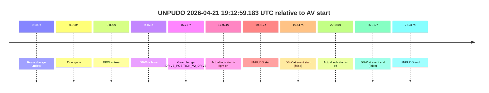
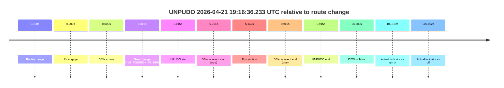
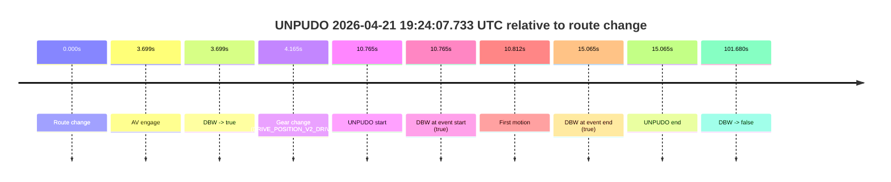
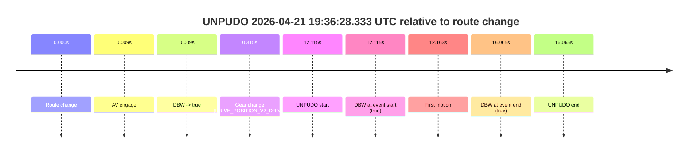

# Run Report: fme20032/2026-04-21--18-23-00--gen2-av-5253201b-b649-42e7-aa5e-a64306a66558

| Field | Value |
|---|---|
| Run ID | `fme20032/2026-04-21--18-23-00--gen2-av-5253201b-b649-42e7-aa5e-a64306a66558` |
| Date | `2026-04-21` |
| Model(s) | `eel-teal-outspoken` |
| Author | `zak` |
| Event count | `7` |

## unpudo 2026-04-21 18:38:13.883 UTC

| Field | Value |
|---|---|
| Model | `eel-teal-outspoken` |
| Author | `zak` |
| Run ID | `fme20032/2026-04-21--18-23-00--gen2-av-5253201b-b649-42e7-aa5e-a64306a66558` |
| Date | `2026-04-21` |
| Time (UTC) | `18:38:13.883` |
| Event type | `unpudo` |
| Disengagement type | `none observed` |
| Route change | `found` |
| Console | [run](https://console.sso.wayve.ai/run/fme20032/2026-04-21--18-23-00--gen2-av-5253201b-b649-42e7-aa5e-a64306a66558?id=&time-unixus=1776796693883316) |
| Foxglove | [segment](https://app.foxglove.dev/wayve-on-prem/p/prj_0dX18KZdVHg1fmmI/view?ds=foxglove-stream&ds.deviceName=fme20032&ds.start=2026-04-21T18%3A36%3A07.818252Z&ds.end=2026-04-21T18%3A39%3A40.707264Z&layoutId=lay_0e7VD4WIKDQGU73Y&time=2026-04-21T18%3A38%3A13.883316Z) |

### Event card: pass

- Pass: AV owns the credited unpudo from route change through the official unpudo window, the gear state is aligned at the anchor, and the vehicle moves without driver accelerator help in AV.

| Event | Time (UTC) | Delta from route change |
|---|---:|---:|
| Route change | 2026-04-21 18:36:17.818 | `0.000s` |
| First motion | 2026-04-21 18:36:30.020 | `12.202s` |
| Actual indicator -> left on | 2026-04-21 18:37:46.780 | `88.962s` |
| Actual indicator -> off | 2026-04-21 18:37:47.739 | `89.922s` |
| Gear change (DRIVE_POSITION_V2_DRIVE) | 2026-04-21 18:37:59.983 | `102.165s` |
| AV engage | 2026-04-21 18:38:13.227 | `115.409s` |
| DBW -> true | 2026-04-21 18:38:13.227 | `115.409s` |
| UNPUDO start | 2026-04-21 18:38:13.883 | `116.065s` |
| DBW at event start (true) | 2026-04-21 18:38:13.883 | `116.065s` |
| DBW at event end (true) | 2026-04-21 18:38:17.383 | `119.565s` |
| UNPUDO end | 2026-04-21 18:38:17.383 | `119.565s` |
| DBW -> false | 2026-04-21 18:39:30.707 | `192.889s` |

| Metric | Value |
|---|---|
| Outcome | `pass` |
| Effective failure type | `none` |
| Route change status | `found` |
| DBW at event start | `true` |
| DBW at event end | `true` |
| Predicted gear at AV start | `DRIVE_POSITION_V2_DRIVE` |
| Actual gear at AV start | `DRIVE_POSITION_V2_DRIVE` |
| Predicted gear at event start | `DRIVE_POSITION_V2_DRIVE` |
| Actual gear at event start | `DRIVE_POSITION_V2_DRIVE` |
| Planned indicator direction | `INDICATORS_STATE_V2_RIGHT_ON` |
| Controller indicator direction | `INDICATORS_STATE_V2_RIGHT_ON` |
| Actual indicator direction | `INDICATORS_STATE_V2_OFF` |
| Actual indicator at maneuver end | `INDICATORS_STATE_V2_OFF` |
| Driver accel help in AV | `false` |
| Driver accel help timestamp | `n/a` |
| Max accel pedal pct in AV | `0.0%` |
| Max brake pedal pct in AV | `0.0%` |
| Max speed mps in AV | `4.208` |
| Success timing baseline | `route change` |
| Route -> AV | `115.409s` |
| AV -> event start | `0.656s` |
| AV -> first motion | `-103.207s` |
| Success baseline -> event start | `116.065s` |
| Success baseline -> first motion | `12.202s` |
| AV duration before disengagement | `77.480s` |
| Trajectory waypoint count | `36` |
| Driving-plan step count | `11` |

The scored portion starts from the AV-owned window, not from the pre-AV setup. Route-change search in the stopped pre-event segment was `found`, with the baseline therefore set to route change. At the event anchor the model predicts `DRIVE_POSITION_V2_DRIVE` and the actual gear is `DRIVE_POSITION_V2_DRIVE`. The effective model outcome is `pass` because `the credited unpudo stays AV-owned through the official unpudo window.`

### Resolution

| Field | Value |
|---|---|
| Final outcome | `pass` |
| Do we agree with this label? | `yes` |
| Source disengagement type | `none observed` |
| Resolved effective failure type | `none` |
| Confidence | `high` |

## unpudo 2026-04-21 18:44:38.633 UTC

| Field | Value |
|---|---|
| Model | `eel-teal-outspoken` |
| Author | `zak` |
| Run ID | `fme20032/2026-04-21--18-23-00--gen2-av-5253201b-b649-42e7-aa5e-a64306a66558` |
| Date | `2026-04-21` |
| Time (UTC) | `18:44:38.633` |
| Event type | `unpudo` |
| Disengagement type | `none observed` |
| Route change | `found` |
| Console | [run](https://console.sso.wayve.ai/run/fme20032/2026-04-21--18-23-00--gen2-av-5253201b-b649-42e7-aa5e-a64306a66558?id=&time-unixus=1776797078633304) |
| Foxglove | [segment](https://app.foxglove.dev/wayve-on-prem/p/prj_0dX18KZdVHg1fmmI/view?ds=foxglove-stream&ds.deviceName=fme20032&ds.start=2026-04-21T18%3A44%3A24.718457Z&ds.end=2026-04-21T18%3A44%3A52.783305Z&layoutId=lay_0e7VD4WIKDQGU73Y&time=2026-04-21T18%3A44%3A38.633304Z) |

### Event card: fail

- Fail: this is a short AV stint rather than a durable model-owned maneuver. The vehicle never settles into a long enough AV-owned attempt to credit the model.

| Event | Time (UTC) | Delta from route change |
|---|---:|---:|
| Route change | 2026-04-21 18:44:34.718 | `0.000s` |
| AV engage | 2026-04-21 18:44:34.727 | `0.009s` |
| DBW -> true | 2026-04-21 18:44:34.727 | `0.009s` |
| Gear change (DRIVE_POSITION_V2_DRIVE) | 2026-04-21 18:44:35.033 | `0.315s` |
| UNPUDO start | 2026-04-21 18:44:38.633 | `3.915s` |
| DBW at event start (true) | 2026-04-21 18:44:38.633 | `3.915s` |
| First motion | 2026-04-21 18:44:38.660 | `3.942s` |
| DBW -> false | 2026-04-21 18:44:42.047 | `7.329s` |
| DBW at event end (false) | 2026-04-21 18:44:42.783 | `8.065s` |
| UNPUDO end | 2026-04-21 18:44:42.783 | `8.065s` |

| Metric | Value |
|---|---|
| Outcome | `fail` |
| Effective failure type | `interrupted_handover` |
| Route change status | `found` |
| DBW at event start | `true` |
| DBW at event end | `false` |
| Predicted gear at AV start | `DRIVE_POSITION_V2_PARK` |
| Actual gear at AV start | `DRIVE_POSITION_V2_PARK` |
| Predicted gear at event start | `DRIVE_POSITION_V2_DRIVE` |
| Actual gear at event start | `DRIVE_POSITION_V2_DRIVE` |
| Planned indicator direction | `INDICATORS_STATE_V2_OFF` |
| Controller indicator direction | `INDICATORS_STATE_V2_OFF` |
| Actual indicator direction | `INDICATORS_STATE_V2_OFF` |
| Actual indicator at maneuver end | `INDICATORS_STATE_V2_OFF` |
| Driver accel help in AV | `false` |
| Driver accel help timestamp | `n/a` |
| Max accel pedal pct in AV | `0.0%` |
| Max brake pedal pct in AV | `8.0%` |
| Max speed mps in AV | `3.653` |
| Success timing baseline | `route change` |
| Route -> AV | `0.009s` |
| AV -> event start | `3.906s` |
| AV -> first motion | `3.933s` |
| Success baseline -> event start | `3.915s` |
| Success baseline -> first motion | `3.942s` |
| AV duration before disengagement | `7.320s` |
| Trajectory waypoint count | `37` |
| Driving-plan step count | `11` |

The scored portion starts from the AV-owned window, not from the pre-AV setup. Route-change search in the stopped pre-event segment was `found`, with the baseline therefore set to route change. At the event anchor the model predicts `DRIVE_POSITION_V2_DRIVE` and the actual gear is `DRIVE_POSITION_V2_DRIVE`. The effective model outcome is `fail` because `interrupted_handover.`

### Resolution

| Field | Value |
|---|---|
| Final outcome | `fail` |
| Do we agree with this label? | `yes` |
| Source disengagement type | `none observed` |
| Resolved effective failure type | `interrupted_handover` |
| Confidence | `high` |

## unpudo 2026-04-21 19:00:32.033 UTC

| Field | Value |
|---|---|
| Model | `eel-teal-outspoken` |
| Author | `zak` |
| Run ID | `fme20032/2026-04-21--18-23-00--gen2-av-5253201b-b649-42e7-aa5e-a64306a66558` |
| Date | `2026-04-21` |
| Time (UTC) | `19:00:32.033` |
| Event type | `unpudo` |
| Disengagement type | `none observed` |
| Route change | `found` |
| Console | [run](https://console.sso.wayve.ai/run/fme20032/2026-04-21--18-23-00--gen2-av-5253201b-b649-42e7-aa5e-a64306a66558?id=&time-unixus=1776798032033313) |
| Foxglove | [segment](https://app.foxglove.dev/wayve-on-prem/p/prj_0dX18KZdVHg1fmmI/view?ds=foxglove-stream&ds.deviceName=fme20032&ds.start=2026-04-21T18%3A59%3A08.318264Z&ds.end=2026-04-21T19%3A01%3A10.228507Z&layoutId=lay_0e7VD4WIKDQGU73Y&time=2026-04-21T19%3A00%3A32.033313Z) |

### Event card: pass

- Pass: AV owns the credited unpudo from route change through the official unpudo window, the gear state is aligned at the anchor, and the vehicle moves without driver accelerator help in AV.

| Event | Time (UTC) | Delta from route change |
|---|---:|---:|
| Route change | 2026-04-21 18:59:18.318 | `0.000s` |
| AV engage | 2026-04-21 19:00:27.807 | `69.489s` |
| DBW -> true | 2026-04-21 19:00:27.807 | `69.489s` |
| Gear change (DRIVE_POSITION_V2_DRIVE) | 2026-04-21 19:00:28.333 | `70.015s` |
| UNPUDO start | 2026-04-21 19:00:32.033 | `73.715s` |
| DBW at event start (true) | 2026-04-21 19:00:32.033 | `73.715s` |
| First motion | 2026-04-21 19:00:32.060 | `73.742s` |
| DBW at event end (true) | 2026-04-21 19:00:35.483 | `77.165s` |
| UNPUDO end | 2026-04-21 19:00:35.483 | `77.165s` |
| DBW -> false | 2026-04-21 19:01:00.228 | `101.910s` |

| Metric | Value |
|---|---|
| Outcome | `pass` |
| Effective failure type | `none` |
| Route change status | `found` |
| DBW at event start | `true` |
| DBW at event end | `true` |
| Predicted gear at AV start | `DRIVE_POSITION_V2_DRIVE` |
| Actual gear at AV start | `DRIVE_POSITION_V2_PARK` |
| Predicted gear at event start | `DRIVE_POSITION_V2_DRIVE` |
| Actual gear at event start | `DRIVE_POSITION_V2_DRIVE` |
| Planned indicator direction | `INDICATORS_STATE_V2_RIGHT_ON` |
| Controller indicator direction | `INDICATORS_STATE_V2_RIGHT_ON` |
| Actual indicator direction | `INDICATORS_STATE_V2_OFF` |
| Actual indicator at maneuver end | `INDICATORS_STATE_V2_OFF` |
| Driver accel help in AV | `false` |
| Driver accel help timestamp | `n/a` |
| Max accel pedal pct in AV | `0.0%` |
| Max brake pedal pct in AV | `8.0%` |
| Max speed mps in AV | `4.639` |
| Success timing baseline | `route change` |
| Route -> AV | `69.489s` |
| AV -> event start | `4.226s` |
| AV -> first motion | `4.253s` |
| Success baseline -> event start | `73.715s` |
| Success baseline -> first motion | `73.742s` |
| AV duration before disengagement | `32.421s` |
| Trajectory waypoint count | `37` |
| Driving-plan step count | `11` |

The scored portion starts from the AV-owned window, not from the pre-AV setup. Route-change search in the stopped pre-event segment was `found`, with the baseline therefore set to route change. At the event anchor the model predicts `DRIVE_POSITION_V2_DRIVE` and the actual gear is `DRIVE_POSITION_V2_DRIVE`. The effective model outcome is `pass` because `the credited unpudo stays AV-owned through the official unpudo window.`

### Resolution

| Field | Value |
|---|---|
| Final outcome | `pass` |
| Do we agree with this label? | `yes` |
| Source disengagement type | `none observed` |
| Resolved effective failure type | `none` |
| Confidence | `high` |

## unpudo 2026-04-21 19:12:59.183 UTC

| Field | Value |
|---|---|
| Model | `eel-teal-outspoken` |
| Author | `zak` |
| Run ID | `fme20032/2026-04-21--18-23-00--gen2-av-5253201b-b649-42e7-aa5e-a64306a66558` |
| Date | `2026-04-21` |
| Time (UTC) | `19:12:59.183` |
| Event type | `unpudo` |
| Disengagement type | `none observed` |
| Route change | `unclear` |
| Console | [run](https://console.sso.wayve.ai/run/fme20032/2026-04-21--18-23-00--gen2-av-5253201b-b649-42e7-aa5e-a64306a66558?id=&time-unixus=1776798779183297) |
| Foxglove | [segment](https://app.foxglove.dev/wayve-on-prem/p/prj_0dX18KZdVHg1fmmI/view?ds=foxglove-stream&ds.deviceName=fme20032&ds.start=2026-04-21T19%3A12%3A29.666590Z&ds.end=2026-04-21T19%3A13%3A15.983310Z&layoutId=lay_0e7VD4WIKDQGU73Y&time=2026-04-21T19%3A12%3A59.183297Z) |

### Event card: fail

- Fail: the credited unpudo does not stay AV-owned. The event window starts with DBW false, and the maneuver outcome lands outside a clean AV-owned segment.

| Event | Time (UTC) | Delta from AV start |
|---|---:|---:|
| Route change unclear | 2026-04-21 19:12:39.666 | `0.000s` |
| AV engage | 2026-04-21 19:12:39.666 | `0.000s` |
| DBW -> true | 2026-04-21 19:12:39.666 | `0.000s` |
| DBW -> false | 2026-04-21 19:12:49.127 | `9.461s` |
| Gear change (DRIVE_POSITION_V2_DRIVE) | 2026-04-21 19:12:56.383 | `16.717s` |
| Actual indicator -> right on | 2026-04-21 19:12:57.640 | `17.974s` |
| UNPUDO start | 2026-04-21 19:12:59.183 | `19.517s` |
| DBW at event start (false) | 2026-04-21 19:12:59.183 | `19.517s` |
| Actual indicator -> off | 2026-04-21 19:13:01.860 | `22.194s` |
| DBW at event end (false) | 2026-04-21 19:13:05.983 | `26.317s` |
| UNPUDO end | 2026-04-21 19:13:05.983 | `26.317s` |

| Metric | Value |
|---|---|
| Outcome | `fail` |
| Effective failure type | `not_av_owned` |
| Route change status | `unclear` |
| DBW at event start | `false` |
| DBW at event end | `false` |
| Predicted gear at AV start | `DRIVE_POSITION_V2_PARK` |
| Actual gear at AV start | `DRIVE_POSITION_V2_PARK` |
| Predicted gear at event start | `DRIVE_POSITION_V2_DRIVE` |
| Actual gear at event start | `DRIVE_POSITION_V2_DRIVE` |
| Planned indicator direction | `INDICATORS_STATE_V2_OFF` |
| Controller indicator direction | `INDICATORS_STATE_V2_OFF` |
| Actual indicator direction | `INDICATORS_STATE_V2_RIGHT_ON` |
| Actual indicator at maneuver end | `INDICATORS_STATE_V2_OFF` |
| Driver accel help in AV | `false` |
| Driver accel help timestamp | `n/a` |
| Max accel pedal pct in AV | `0.0%` |
| Max brake pedal pct in AV | `8.6%` |
| Max speed mps in AV | `0.000` |
| Success timing baseline | `AV start` |
| Route -> AV | `n/a` |
| AV -> event start | `19.517s` |
| AV -> first motion | `n/a` |
| Success baseline -> event start | `19.517s` |
| Success baseline -> first motion | `n/a` |
| AV duration before disengagement | `9.461s` |
| Trajectory waypoint count | `36` |
| Driving-plan step count | `11` |

The scored portion starts from the AV-owned window, not from the pre-AV setup. Route-change search in the stopped pre-event segment was `unclear`, with the baseline therefore set to AV start. At the event anchor the model predicts `DRIVE_POSITION_V2_DRIVE` and the actual gear is `DRIVE_POSITION_V2_DRIVE`. The effective model outcome is `fail` because `not_av_owned.`

### Resolution

| Field | Value |
|---|---|
| Final outcome | `fail` |
| Do we agree with this label? | `yes` |
| Source disengagement type | `none observed` |
| Resolved effective failure type | `not_av_owned` |
| Confidence | `medium` |

## unpudo 2026-04-21 19:16:36.233 UTC

| Field | Value |
|---|---|
| Model | `eel-teal-outspoken` |
| Author | `zak` |
| Run ID | `fme20032/2026-04-21--18-23-00--gen2-av-5253201b-b649-42e7-aa5e-a64306a66558` |
| Date | `2026-04-21` |
| Time (UTC) | `19:16:36.233` |
| Event type | `unpudo` |
| Disengagement type | `none observed` |
| Route change | `found` |
| Console | [run](https://console.sso.wayve.ai/run/fme20032/2026-04-21--18-23-00--gen2-av-5253201b-b649-42e7-aa5e-a64306a66558?id=&time-unixus=1776798996233308) |
| Foxglove | [segment](https://app.foxglove.dev/wayve-on-prem/p/prj_0dX18KZdVHg1fmmI/view?ds=foxglove-stream&ds.deviceName=fme20032&ds.start=2026-04-21T19%3A16%3A21.218293Z&ds.end=2026-04-21T19%3A18%3A17.907335Z&layoutId=lay_0e7VD4WIKDQGU73Y&time=2026-04-21T19%3A16%3A36.233308Z) |

### Event card: pass

- Pass: AV owns the credited unpudo from route change through the official unpudo window, the gear state is aligned at the anchor, and the vehicle moves without driver accelerator help in AV.

| Event | Time (UTC) | Delta from route change |
|---|---:|---:|
| Route change | 2026-04-21 19:16:31.218 | `0.000s` |
| AV engage | 2026-04-21 19:16:31.227 | `0.009s` |
| DBW -> true | 2026-04-21 19:16:31.227 | `0.009s` |
| Gear change (DRIVE_POSITION_V2_DRIVE) | 2026-04-21 19:16:31.533 | `0.315s` |
| UNPUDO start | 2026-04-21 19:16:36.233 | `5.015s` |
| DBW at event start (true) | 2026-04-21 19:16:36.233 | `5.015s` |
| First motion | 2026-04-21 19:16:36.360 | `5.142s` |
| DBW at event end (true) | 2026-04-21 19:16:41.133 | `9.915s` |
| UNPUDO end | 2026-04-21 19:16:41.133 | `9.915s` |
| DBW -> false | 2026-04-21 19:18:07.907 | `96.689s` |
| Actual indicator -> right on | 2026-04-21 19:18:11.380 | `100.162s` |
| Actual indicator -> off | 2026-04-21 19:18:17.080 | `105.862s` |

| Metric | Value |
|---|---|
| Outcome | `pass` |
| Effective failure type | `none` |
| Route change status | `found` |
| DBW at event start | `true` |
| DBW at event end | `true` |
| Predicted gear at AV start | `DRIVE_POSITION_V2_PARK` |
| Actual gear at AV start | `DRIVE_POSITION_V2_PARK` |
| Predicted gear at event start | `DRIVE_POSITION_V2_DRIVE` |
| Actual gear at event start | `DRIVE_POSITION_V2_DRIVE` |
| Planned indicator direction | `INDICATORS_STATE_V2_RIGHT_ON` |
| Controller indicator direction | `INDICATORS_STATE_V2_RIGHT_ON` |
| Actual indicator direction | `INDICATORS_STATE_V2_OFF` |
| Actual indicator at maneuver end | `INDICATORS_STATE_V2_OFF` |
| Driver accel help in AV | `false` |
| Driver accel help timestamp | `n/a` |
| Max accel pedal pct in AV | `0.0%` |
| Max brake pedal pct in AV | `8.0%` |
| Max speed mps in AV | `4.061` |
| Success timing baseline | `route change` |
| Route -> AV | `0.009s` |
| AV -> event start | `5.006s` |
| AV -> first motion | `5.133s` |
| Success baseline -> event start | `5.015s` |
| Success baseline -> first motion | `5.142s` |
| AV duration before disengagement | `96.680s` |
| Trajectory waypoint count | `35` |
| Driving-plan step count | `11` |

The scored portion starts from the AV-owned window, not from the pre-AV setup. Route-change search in the stopped pre-event segment was `found`, with the baseline therefore set to route change. At the event anchor the model predicts `DRIVE_POSITION_V2_DRIVE` and the actual gear is `DRIVE_POSITION_V2_DRIVE`. The effective model outcome is `pass` because `the credited unpudo stays AV-owned through the official unpudo window.`

### Resolution

| Field | Value |
|---|---|
| Final outcome | `pass` |
| Do we agree with this label? | `yes` |
| Source disengagement type | `none observed` |
| Resolved effective failure type | `none` |
| Confidence | `high` |

## unpudo 2026-04-21 19:24:07.733 UTC

| Field | Value |
|---|---|
| Model | `eel-teal-outspoken` |
| Author | `zak` |
| Run ID | `fme20032/2026-04-21--18-23-00--gen2-av-5253201b-b649-42e7-aa5e-a64306a66558` |
| Date | `2026-04-21` |
| Time (UTC) | `19:24:07.733` |
| Event type | `unpudo` |
| Disengagement type | `none observed` |
| Route change | `found` |
| Console | [run](https://console.sso.wayve.ai/run/fme20032/2026-04-21--18-23-00--gen2-av-5253201b-b649-42e7-aa5e-a64306a66558?id=&time-unixus=1776799447733322) |
| Foxglove | [segment](https://app.foxglove.dev/wayve-on-prem/p/prj_0dX18KZdVHg1fmmI/view?ds=foxglove-stream&ds.deviceName=fme20032&ds.start=2026-04-21T19%3A23%3A46.968278Z&ds.end=2026-04-21T19%3A25%3A48.648130Z&layoutId=lay_0e7VD4WIKDQGU73Y&time=2026-04-21T19%3A24%3A07.733322Z) |

### Event card: pass

- Pass: AV owns the credited unpudo from route change through the official unpudo window, the gear state is aligned at the anchor, and the vehicle moves without driver accelerator help in AV.

| Event | Time (UTC) | Delta from route change |
|---|---:|---:|
| Route change | 2026-04-21 19:23:56.968 | `0.000s` |
| AV engage | 2026-04-21 19:24:00.667 | `3.699s` |
| DBW -> true | 2026-04-21 19:24:00.667 | `3.699s` |
| Gear change (DRIVE_POSITION_V2_DRIVE) | 2026-04-21 19:24:01.133 | `4.165s` |
| UNPUDO start | 2026-04-21 19:24:07.733 | `10.765s` |
| DBW at event start (true) | 2026-04-21 19:24:07.733 | `10.765s` |
| First motion | 2026-04-21 19:24:07.779 | `10.812s` |
| DBW at event end (true) | 2026-04-21 19:24:12.033 | `15.065s` |
| UNPUDO end | 2026-04-21 19:24:12.033 | `15.065s` |
| DBW -> false | 2026-04-21 19:25:38.648 | `101.680s` |

| Metric | Value |
|---|---|
| Outcome | `pass` |
| Effective failure type | `none` |
| Route change status | `found` |
| DBW at event start | `true` |
| DBW at event end | `true` |
| Predicted gear at AV start | `DRIVE_POSITION_V2_DRIVE` |
| Actual gear at AV start | `DRIVE_POSITION_V2_PARK` |
| Predicted gear at event start | `DRIVE_POSITION_V2_DRIVE` |
| Actual gear at event start | `DRIVE_POSITION_V2_DRIVE` |
| Planned indicator direction | `INDICATORS_STATE_V2_RIGHT_ON` |
| Controller indicator direction | `INDICATORS_STATE_V2_RIGHT_ON` |
| Actual indicator direction | `INDICATORS_STATE_V2_OFF` |
| Actual indicator at maneuver end | `INDICATORS_STATE_V2_OFF` |
| Driver accel help in AV | `false` |
| Driver accel help timestamp | `n/a` |
| Max accel pedal pct in AV | `0.0%` |
| Max brake pedal pct in AV | `8.0%` |
| Max speed mps in AV | `3.881` |
| Success timing baseline | `route change` |
| Route -> AV | `3.699s` |
| AV -> event start | `7.066s` |
| AV -> first motion | `7.113s` |
| Success baseline -> event start | `10.765s` |
| Success baseline -> first motion | `10.812s` |
| AV duration before disengagement | `97.981s` |
| Trajectory waypoint count | `37` |
| Driving-plan step count | `11` |

The scored portion starts from the AV-owned window, not from the pre-AV setup. Route-change search in the stopped pre-event segment was `found`, with the baseline therefore set to route change. At the event anchor the model predicts `DRIVE_POSITION_V2_DRIVE` and the actual gear is `DRIVE_POSITION_V2_DRIVE`. The effective model outcome is `pass` because `the credited unpudo stays AV-owned through the official unpudo window.`

### Resolution

| Field | Value |
|---|---|
| Final outcome | `pass` |
| Do we agree with this label? | `yes` |
| Source disengagement type | `none observed` |
| Resolved effective failure type | `none` |
| Confidence | `high` |

## unpudo 2026-04-21 19:36:28.333 UTC

| Field | Value |
|---|---|
| Model | `eel-teal-outspoken` |
| Author | `zak` |
| Run ID | `fme20032/2026-04-21--18-23-00--gen2-av-5253201b-b649-42e7-aa5e-a64306a66558` |
| Date | `2026-04-21` |
| Time (UTC) | `19:36:28.333` |
| Event type | `unpudo` |
| Disengagement type | `none observed` |
| Route change | `found` |
| Console | [run](https://console.sso.wayve.ai/run/fme20032/2026-04-21--18-23-00--gen2-av-5253201b-b649-42e7-aa5e-a64306a66558?id=&time-unixus=1776800188333312) |
| Foxglove | [segment](https://app.foxglove.dev/wayve-on-prem/p/prj_0dX18KZdVHg1fmmI/view?ds=foxglove-stream&ds.deviceName=fme20032&ds.start=2026-04-21T19%3A36%3A06.218259Z&ds.end=2026-04-21T19%3A36%3A42.283306Z&layoutId=lay_0e7VD4WIKDQGU73Y&time=2026-04-21T19%3A36%3A28.333312Z) |

### Event card: pass

- Pass: AV owns the credited unpudo from route change through the official unpudo window, the gear state is aligned at the anchor, and the vehicle moves without driver accelerator help in AV.

| Event | Time (UTC) | Delta from route change |
|---|---:|---:|
| Route change | 2026-04-21 19:36:16.218 | `0.000s` |
| AV engage | 2026-04-21 19:36:16.227 | `0.009s` |
| DBW -> true | 2026-04-21 19:36:16.227 | `0.009s` |
| Gear change (DRIVE_POSITION_V2_DRIVE) | 2026-04-21 19:36:16.533 | `0.315s` |
| UNPUDO start | 2026-04-21 19:36:28.333 | `12.115s` |
| DBW at event start (true) | 2026-04-21 19:36:28.333 | `12.115s` |
| First motion | 2026-04-21 19:36:28.380 | `12.163s` |
| DBW at event end (true) | 2026-04-21 19:36:32.283 | `16.065s` |
| UNPUDO end | 2026-04-21 19:36:32.283 | `16.065s` |

| Metric | Value |
|---|---|
| Outcome | `pass` |
| Effective failure type | `none` |
| Route change status | `found` |
| DBW at event start | `true` |
| DBW at event end | `true` |
| Predicted gear at AV start | `DRIVE_POSITION_V2_PARK` |
| Actual gear at AV start | `DRIVE_POSITION_V2_PARK` |
| Predicted gear at event start | `DRIVE_POSITION_V2_DRIVE` |
| Actual gear at event start | `DRIVE_POSITION_V2_DRIVE` |
| Planned indicator direction | `INDICATORS_STATE_V2_RIGHT_ON` |
| Controller indicator direction | `INDICATORS_STATE_V2_RIGHT_ON` |
| Actual indicator direction | `INDICATORS_STATE_V2_OFF` |
| Actual indicator at maneuver end | `INDICATORS_STATE_V2_OFF` |
| Driver accel help in AV | `false` |
| Driver accel help timestamp | `n/a` |
| Max accel pedal pct in AV | `0.0%` |
| Max brake pedal pct in AV | `8.0%` |
| Max speed mps in AV | `3.419` |
| Success timing baseline | `route change` |
| Route -> AV | `0.009s` |
| AV -> event start | `12.106s` |
| AV -> first motion | `12.153s` |
| Success baseline -> event start | `12.115s` |
| Success baseline -> first motion | `12.163s` |
| AV duration before disengagement | `n/a` |
| Trajectory waypoint count | `37` |
| Driving-plan step count | `11` |

The scored portion starts from the AV-owned window, not from the pre-AV setup. Route-change search in the stopped pre-event segment was `found`, with the baseline therefore set to route change. At the event anchor the model predicts `DRIVE_POSITION_V2_DRIVE` and the actual gear is `DRIVE_POSITION_V2_DRIVE`. The effective model outcome is `pass` because `the credited unpudo stays AV-owned through the official unpudo window.`

### Resolution

| Field | Value |
|---|---|
| Final outcome | `pass` |
| Do we agree with this label? | `yes` |
| Source disengagement type | `none observed` |
| Resolved effective failure type | `none` |
| Confidence | `high` |
