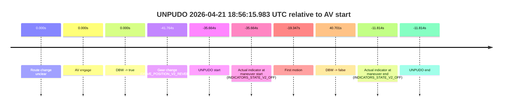
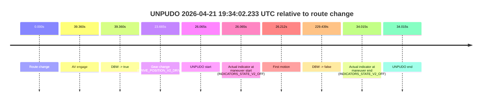
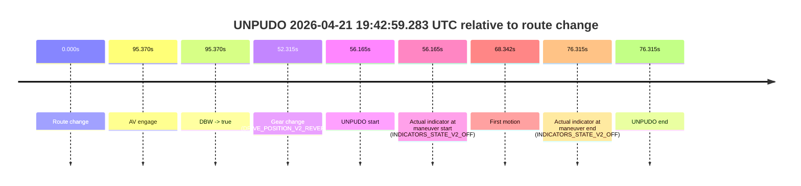

# Run Report: fme20032/2026-04-21--18-23-00--gen2-av-5253201b-b649-42e7-aa5e-a64306a66558

| Field | Value |
|---|---|
| Run ID | `fme20032/2026-04-21--18-23-00--gen2-av-5253201b-b649-42e7-aa5e-a64306a66558` |
| Date | `2026-04-21` |
| Model(s) | `blue-panther-solid` |
| Author | `guy.geva` |
| Event count | `9` |

## unpudo 2026-04-21 18:36:29.933 UTC

| Field | Value |
|---|---|
| Model | `blue-panther-solid` |
| Author | `guy.geva` |
| Run ID | `fme20032/2026-04-21--18-23-00--gen2-av-5253201b-b649-42e7-aa5e-a64306a66558` |
| Date | `2026-04-21` |
| Time (UTC) | `18:36:29.933` |
| Event type | `unpudo` |
| Disengagement type | `none observed` |
| Route change | `found` |
| Console | [run](https://console.sso.wayve.ai/run/fme20032/2026-04-21--18-23-00--gen2-av-5253201b-b649-42e7-aa5e-a64306a66558?id=&time-unixus=1776796589933321) |
| Foxglove | [segment](https://app.foxglove.dev/wayve-on-prem/p/prj_0dX18KZdVHg1fmmI/view?ds=foxglove-stream&ds.deviceName=fme20032&ds.start=2026-04-21T18%3A36%3A07.818252Z&ds.end=2026-04-21T18%3A38%3A10.786669Z&layoutId=lay_0e7VD4WIKDQGU73Y&time=2026-04-21T18%3A36%3A29.933321Z) |

### Event card: accidental

- Accidental: AV ownership is present for less than `2s`, so this is treated as an accidental brush with the maneuver rather than a meaningful model attempt.

| Event | Time (UTC) | Delta from route change |
|---|---:|---:|
| Route change | 2026-04-21 18:36:17.818 | `0.000s` |
| AV engage | 2026-04-21 18:36:35.827 | `18.009s` |
| DBW -> true | 2026-04-21 18:36:35.827 | `18.009s` |
| Gear change (DRIVE_POSITION_V2_DRIVE) | 2026-04-21 18:36:21.183 | `3.365s` |
| UNPUDO start | 2026-04-21 18:36:29.933 | `12.115s` |
| Actual indicator at maneuver start (INDICATORS_STATE_V2_OFF) | 2026-04-21 18:36:29.933 | `12.115s` |
| First motion | 2026-04-21 18:36:30.020 | `12.202s` |
| DBW -> false | 2026-04-21 18:38:00.786 | `102.968s` |
| Actual indicator at maneuver end (INDICATORS_STATE_V2_OFF) | 2026-04-21 18:36:33.583 | `15.765s` |
| UNPUDO end | 2026-04-21 18:36:33.583 | `15.765s` |

| Metric | Value |
|---|---|
| Outcome | `accidental` |
| Effective failure type | `none` |
| Route change status | `found` |
| DBW at event start | `false` |
| DBW at event end | `false` |
| Predicted gear at AV start | `DRIVE_POSITION_V2_DRIVE` |
| Actual gear at AV start | `DRIVE_POSITION_V2_DRIVE` |
| Predicted gear at event start | `DRIVE_POSITION_V2_DRIVE` |
| Actual gear at event start | `DRIVE_POSITION_V2_DRIVE` |
| Planned indicator direction | `INDICATORS_STATE_V2_LEFT_ON` |
| Controller indicator direction | `INDICATORS_STATE_V2_LEFT_ON` |
| Actual indicator direction | `INDICATORS_STATE_V2_OFF` |
| Actual indicator at maneuver end | `INDICATORS_STATE_V2_OFF` |
| Driver accel help in AV | `false` |
| Driver accel help timestamp | `n/a` |
| Max accel pedal pct in AV | `0.0%` |
| Max brake pedal pct in AV | `0.0%` |
| Max speed mps in AV | `0.000` |
| Route -> AV | `18.009s` |
| AV -> event start | `-5.894s` |
| AV -> first motion | `-5.807s` |
| AV duration before disengagement | `84.959s` |
| Trajectory waypoint count | `35` |
| Driving-plan step count | `11` |

The scored portion starts from the AV-owned window, not from the pre-AV setup. Route-change search in the stopped pre-event segment was `found`, with the baseline therefore set to route change. At the event anchor the model predicts `DRIVE_POSITION_V2_DRIVE` and the actual gear is `DRIVE_POSITION_V2_DRIVE`. The effective model outcome is `accidental` because `the AV-owned portion is shorter than 2s`.

### Resolution

| Field | Value |
|---|---|
| Final outcome | `accidental` |
| Do we agree with this label? | `yes` |
| Source disengagement type | `none observed` |
| Resolved effective failure type | `none` |
| Confidence | `high` |

## unpudo 2026-04-21 18:53:05.533 UTC

| Field | Value |
|---|---|
| Model | `blue-panther-solid` |
| Author | `guy.geva` |
| Run ID | `fme20032/2026-04-21--18-23-00--gen2-av-5253201b-b649-42e7-aa5e-a64306a66558` |
| Date | `2026-04-21` |
| Time (UTC) | `18:53:05.533` |
| Event type | `unpudo` |
| Disengagement type | `none observed` |
| Route change | `found` |
| Console | [run](https://console.sso.wayve.ai/run/fme20032/2026-04-21--18-23-00--gen2-av-5253201b-b649-42e7-aa5e-a64306a66558?id=&time-unixus=1776797585533321) |
| Foxglove | [segment](https://app.foxglove.dev/wayve-on-prem/p/prj_0dX18KZdVHg1fmmI/view?ds=foxglove-stream&ds.deviceName=fme20032&ds.start=2026-04-21T18%3A52%3A44.518276Z&ds.end=2026-04-21T18%3A54%3A04.208386Z&layoutId=lay_0e7VD4WIKDQGU73Y&time=2026-04-21T18%3A53%3A05.533321Z) |

### Event card: accidental

- Accidental: AV ownership is present for less than `2s`, so this is treated as an accidental brush with the maneuver rather than a meaningful model attempt.

| Event | Time (UTC) | Delta from route change |
|---|---:|---:|
| Route change | 2026-04-21 18:52:54.518 | `0.000s` |
| AV engage | 2026-04-21 18:53:10.287 | `15.769s` |
| DBW -> true | 2026-04-21 18:53:10.287 | `15.769s` |
| Gear change (DRIVE_POSITION_V2_DRIVE) | 2026-04-21 18:52:59.933 | `5.415s` |
| UNPUDO start | 2026-04-21 18:53:05.533 | `11.015s` |
| Actual indicator at maneuver start (INDICATORS_STATE_V2_RIGHT_ON) | 2026-04-21 18:53:05.533 | `11.015s` |
| First motion | 2026-04-21 18:53:05.579 | `11.062s` |
| DBW -> false | 2026-04-21 18:53:54.208 | `59.690s` |
| Actual indicator at maneuver end (INDICATORS_STATE_V2_OFF) | 2026-04-21 18:53:09.383 | `14.865s` |
| UNPUDO end | 2026-04-21 18:53:09.383 | `14.865s` |

| Metric | Value |
|---|---|
| Outcome | `accidental` |
| Effective failure type | `none` |
| Route change status | `found` |
| DBW at event start | `false` |
| DBW at event end | `false` |
| Predicted gear at AV start | `DRIVE_POSITION_V2_DRIVE` |
| Actual gear at AV start | `DRIVE_POSITION_V2_DRIVE` |
| Predicted gear at event start | `DRIVE_POSITION_V2_DRIVE` |
| Actual gear at event start | `DRIVE_POSITION_V2_DRIVE` |
| Planned indicator direction | `INDICATORS_STATE_V2_LEFT_ON` |
| Controller indicator direction | `INDICATORS_STATE_V2_LEFT_ON` |
| Actual indicator direction | `INDICATORS_STATE_V2_RIGHT_ON` |
| Actual indicator at maneuver end | `INDICATORS_STATE_V2_OFF` |
| Driver accel help in AV | `false` |
| Driver accel help timestamp | `n/a` |
| Max accel pedal pct in AV | `0.0%` |
| Max brake pedal pct in AV | `0.0%` |
| Max speed mps in AV | `0.000` |
| Route -> AV | `15.769s` |
| AV -> event start | `-4.754s` |
| AV -> first motion | `-4.707s` |
| AV duration before disengagement | `43.921s` |
| Trajectory waypoint count | `37` |
| Driving-plan step count | `11` |

The scored portion starts from the AV-owned window, not from the pre-AV setup. Route-change search in the stopped pre-event segment was `found`, with the baseline therefore set to route change. At the event anchor the model predicts `DRIVE_POSITION_V2_DRIVE` and the actual gear is `DRIVE_POSITION_V2_DRIVE`. The effective model outcome is `accidental` because `the AV-owned portion is shorter than 2s`.

### Resolution

| Field | Value |
|---|---|
| Final outcome | `accidental` |
| Do we agree with this label? | `yes` |
| Source disengagement type | `none observed` |
| Resolved effective failure type | `none` |
| Confidence | `high` |

## unpudo 2026-04-21 18:56:15.983 UTC

| Field | Value |
|---|---|
| Model | `blue-panther-solid` |
| Author | `guy.geva` |
| Run ID | `fme20032/2026-04-21--18-23-00--gen2-av-5253201b-b649-42e7-aa5e-a64306a66558` |
| Date | `2026-04-21` |
| Time (UTC) | `18:56:15.983` |
| Event type | `unpudo` |
| Disengagement type | `none observed` |
| Route change | `unclear` |
| Console | [run](https://console.sso.wayve.ai/run/fme20032/2026-04-21--18-23-00--gen2-av-5253201b-b649-42e7-aa5e-a64306a66558?id=&time-unixus=1776797775983307) |
| Foxglove | [segment](https://app.foxglove.dev/wayve-on-prem/p/prj_0dX18KZdVHg1fmmI/view?ds=foxglove-stream&ds.deviceName=fme20032&ds.start=2026-04-21T18%3A55%3A59.883309Z&ds.end=2026-04-21T18%3A57%3A42.348258Z&layoutId=lay_0e7VD4WIKDQGU73Y&time=2026-04-21T18%3A56%3A15.983307Z) |

### Event card: accidental

- Accidental: AV ownership is present for less than `2s`, so this is treated as an accidental brush with the maneuver rather than a meaningful model attempt.

| Event | Time (UTC) | Delta from AV start |
|---|---:|---:|
| Route change unclear | 2026-04-21 18:56:51.647 | `0.000s` |
| AV engage | 2026-04-21 18:56:51.647 | `0.000s` |
| DBW -> true | 2026-04-21 18:56:51.647 | `0.000s` |
| Gear change (DRIVE_POSITION_V2_REVERSE) | 2026-04-21 18:56:09.883 | `-41.764s` |
| UNPUDO start | 2026-04-21 18:56:15.983 | `-35.664s` |
| Actual indicator at maneuver start (INDICATORS_STATE_V2_OFF) | 2026-04-21 18:56:15.983 | `-35.664s` |
| First motion | 2026-04-21 18:56:32.300 | `-19.347s` |
| DBW -> false | 2026-04-21 18:57:32.348 | `40.701s` |
| Actual indicator at maneuver end (INDICATORS_STATE_V2_OFF) | 2026-04-21 18:56:39.833 | `-11.814s` |
| UNPUDO end | 2026-04-21 18:56:39.833 | `-11.814s` |

| Metric | Value |
|---|---|
| Outcome | `accidental` |
| Effective failure type | `none` |
| Route change status | `unclear` |
| DBW at event start | `false` |
| DBW at event end | `false` |
| Predicted gear at AV start | `DRIVE_POSITION_V2_DRIVE` |
| Actual gear at AV start | `DRIVE_POSITION_V2_DRIVE` |
| Predicted gear at event start | `DRIVE_POSITION_V2_REVERSE` |
| Actual gear at event start | `DRIVE_POSITION_V2_REVERSE` |
| Planned indicator direction | `INDICATORS_STATE_V2_OFF` |
| Controller indicator direction | `INDICATORS_STATE_V2_OFF` |
| Actual indicator direction | `INDICATORS_STATE_V2_OFF` |
| Actual indicator at maneuver end | `INDICATORS_STATE_V2_OFF` |
| Driver accel help in AV | `false` |
| Driver accel help timestamp | `n/a` |
| Max accel pedal pct in AV | `0.0%` |
| Max brake pedal pct in AV | `0.0%` |
| Max speed mps in AV | `0.000` |
| Route -> AV | `n/a` |
| AV -> event start | `-35.664s` |
| AV -> first motion | `-19.347s` |
| AV duration before disengagement | `40.701s` |
| Trajectory waypoint count | `36` |
| Driving-plan step count | `11` |

The scored portion starts from the AV-owned window, not from the pre-AV setup. Route-change search in the stopped pre-event segment was `unclear`, with the baseline therefore set to AV start. At the event anchor the model predicts `DRIVE_POSITION_V2_REVERSE` and the actual gear is `DRIVE_POSITION_V2_REVERSE`. The effective model outcome is `accidental` because `the AV-owned portion is shorter than 2s`.

### Resolution

| Field | Value |
|---|---|
| Final outcome | `accidental` |
| Do we agree with this label? | `yes` |
| Source disengagement type | `none observed` |
| Resolved effective failure type | `none` |
| Confidence | `medium` |

## unpudo 2026-04-21 19:05:27.433 UTC

| Field | Value |
|---|---|
| Model | `blue-panther-solid` |
| Author | `guy.geva` |
| Run ID | `fme20032/2026-04-21--18-23-00--gen2-av-5253201b-b649-42e7-aa5e-a64306a66558` |
| Date | `2026-04-21` |
| Time (UTC) | `19:05:27.433` |
| Event type | `unpudo` |
| Disengagement type | `none observed` |
| Route change | `found` |
| Console | [run](https://console.sso.wayve.ai/run/fme20032/2026-04-21--18-23-00--gen2-av-5253201b-b649-42e7-aa5e-a64306a66558?id=&time-unixus=1776798327433293) |
| Foxglove | [segment](https://app.foxglove.dev/wayve-on-prem/p/prj_0dX18KZdVHg1fmmI/view?ds=foxglove-stream&ds.deviceName=fme20032&ds.start=2026-04-21T19%3A04%3A58.718303Z&ds.end=2026-04-21T19%3A06%3A15.908647Z&layoutId=lay_0e7VD4WIKDQGU73Y&time=2026-04-21T19%3A05%3A27.433293Z) |

### Event card: accidental

- Accidental: AV ownership is present for less than `2s`, so this is treated as an accidental brush with the maneuver rather than a meaningful model attempt.

| Event | Time (UTC) | Delta from route change |
|---|---:|---:|
| Route change | 2026-04-21 19:05:08.718 | `0.000s` |
| AV engage | 2026-04-21 19:05:37.047 | `28.329s` |
| DBW -> true | 2026-04-21 19:05:37.047 | `28.329s` |
| Gear change (DRIVE_POSITION_V2_REVERSE) | 2026-04-21 19:05:19.133 | `10.415s` |
| UNPUDO start | 2026-04-21 19:05:27.433 | `18.715s` |
| Actual indicator at maneuver start (INDICATORS_STATE_V2_RIGHT_ON) | 2026-04-21 19:05:27.433 | `18.715s` |
| First motion | 2026-04-21 19:05:30.940 | `22.222s` |
| DBW -> false | 2026-04-21 19:06:05.908 | `57.190s` |
| Actual indicator at maneuver end (INDICATORS_STATE_V2_OFF) | 2026-04-21 19:05:35.483 | `26.765s` |
| UNPUDO end | 2026-04-21 19:05:35.483 | `26.765s` |

| Metric | Value |
|---|---|
| Outcome | `accidental` |
| Effective failure type | `none` |
| Route change status | `found` |
| DBW at event start | `false` |
| DBW at event end | `false` |
| Predicted gear at AV start | `DRIVE_POSITION_V2_DRIVE` |
| Actual gear at AV start | `DRIVE_POSITION_V2_DRIVE` |
| Predicted gear at event start | `DRIVE_POSITION_V2_REVERSE` |
| Actual gear at event start | `DRIVE_POSITION_V2_REVERSE` |
| Planned indicator direction | `INDICATORS_STATE_V2_RIGHT_ON` |
| Controller indicator direction | `INDICATORS_STATE_V2_RIGHT_ON` |
| Actual indicator direction | `INDICATORS_STATE_V2_RIGHT_ON` |
| Actual indicator at maneuver end | `INDICATORS_STATE_V2_OFF` |
| Driver accel help in AV | `false` |
| Driver accel help timestamp | `n/a` |
| Max accel pedal pct in AV | `0.0%` |
| Max brake pedal pct in AV | `0.0%` |
| Max speed mps in AV | `0.000` |
| Route -> AV | `28.329s` |
| AV -> event start | `-9.614s` |
| AV -> first motion | `-6.107s` |
| AV duration before disengagement | `28.861s` |
| Trajectory waypoint count | `37` |
| Driving-plan step count | `11` |

The scored portion starts from the AV-owned window, not from the pre-AV setup. Route-change search in the stopped pre-event segment was `found`, with the baseline therefore set to route change. At the event anchor the model predicts `DRIVE_POSITION_V2_REVERSE` and the actual gear is `DRIVE_POSITION_V2_REVERSE`. The effective model outcome is `accidental` because `the AV-owned portion is shorter than 2s`.

### Resolution

| Field | Value |
|---|---|
| Final outcome | `accidental` |
| Do we agree with this label? | `yes` |
| Source disengagement type | `none observed` |
| Resolved effective failure type | `none` |
| Confidence | `high` |

## unpudo 2026-04-21 19:21:43.883 UTC

| Field | Value |
|---|---|
| Model | `blue-panther-solid` |
| Author | `guy.geva` |
| Run ID | `fme20032/2026-04-21--18-23-00--gen2-av-5253201b-b649-42e7-aa5e-a64306a66558` |
| Date | `2026-04-21` |
| Time (UTC) | `19:21:43.883` |
| Event type | `unpudo` |
| Disengagement type | `none observed` |
| Route change | `found` |
| Console | [run](https://console.sso.wayve.ai/run/fme20032/2026-04-21--18-23-00--gen2-av-5253201b-b649-42e7-aa5e-a64306a66558?id=&time-unixus=1776799303883314) |
| Foxglove | [segment](https://app.foxglove.dev/wayve-on-prem/p/prj_0dX18KZdVHg1fmmI/view?ds=foxglove-stream&ds.deviceName=fme20032&ds.start=2026-04-21T19%3A21%3A16.969194Z&ds.end=2026-04-21T19%3A22%3A57.007360Z&layoutId=lay_0e7VD4WIKDQGU73Y&time=2026-04-21T19%3A21%3A43.883314Z) |

### Event card: pass

- Pass: AV owns the credited unpudo through the official event window, the gear state is aligned at the anchor, and the vehicle moves without driver accelerator help in AV.

| Event | Time (UTC) | Delta from route change |
|---|---:|---:|
| Route change | 2026-04-21 19:21:26.969 | `0.000s` |
| AV engage | 2026-04-21 19:21:27.967 | `0.998s` |
| DBW -> true | 2026-04-21 19:21:27.967 | `0.998s` |
| Gear change (DRIVE_POSITION_V2_DRIVE) | 2026-04-21 19:21:28.333 | `1.364s` |
| UNPUDO start | 2026-04-21 19:21:43.883 | `16.914s` |
| Actual indicator at maneuver start (INDICATORS_STATE_V2_OFF) | 2026-04-21 19:21:43.883 | `16.914s` |
| First motion | 2026-04-21 19:21:43.899 | `16.931s` |
| DBW -> false | 2026-04-21 19:22:47.007 | `80.038s` |
| Actual indicator at maneuver end (INDICATORS_STATE_V2_OFF) | 2026-04-21 19:21:47.283 | `20.314s` |
| UNPUDO end | 2026-04-21 19:21:47.283 | `20.314s` |

| Metric | Value |
|---|---|
| Outcome | `pass` |
| Effective failure type | `none` |
| Route change status | `found` |
| DBW at event start | `true` |
| DBW at event end | `true` |
| Predicted gear at AV start | `DRIVE_POSITION_V2_DRIVE` |
| Actual gear at AV start | `DRIVE_POSITION_V2_PARK` |
| Predicted gear at event start | `DRIVE_POSITION_V2_DRIVE` |
| Actual gear at event start | `DRIVE_POSITION_V2_DRIVE` |
| Planned indicator direction | `INDICATORS_STATE_V2_OFF` |
| Controller indicator direction | `INDICATORS_STATE_V2_OFF` |
| Actual indicator direction | `INDICATORS_STATE_V2_OFF` |
| Actual indicator at maneuver end | `INDICATORS_STATE_V2_OFF` |
| Driver accel help in AV | `false` |
| Driver accel help timestamp | `n/a` |
| Max accel pedal pct in AV | `0.0%` |
| Max brake pedal pct in AV | `8.0%` |
| Max speed mps in AV | `5.264` |
| Route -> AV | `0.998s` |
| AV -> event start | `15.916s` |
| AV -> first motion | `15.933s` |
| AV duration before disengagement | `79.040s` |
| Trajectory waypoint count | `36` |
| Driving-plan step count | `11` |

The scored portion starts from the AV-owned window, not from the pre-AV setup. Route-change search in the stopped pre-event segment was `found`, with the baseline therefore set to route change. At the event anchor the model predicts `DRIVE_POSITION_V2_DRIVE` and the actual gear is `DRIVE_POSITION_V2_DRIVE`. The effective model outcome is `pass` because `the credited maneuver stays AV-owned through the official event end`.

### Resolution

| Field | Value |
|---|---|
| Final outcome | `pass` |
| Do we agree with this label? | `yes` |
| Source disengagement type | `none observed` |
| Resolved effective failure type | `none` |
| Confidence | `high` |

## unpudo 2026-04-21 19:31:58.633 UTC

| Field | Value |
|---|---|
| Model | `blue-panther-solid` |
| Author | `guy.geva` |
| Run ID | `fme20032/2026-04-21--18-23-00--gen2-av-5253201b-b649-42e7-aa5e-a64306a66558` |
| Date | `2026-04-21` |
| Time (UTC) | `19:31:58.633` |
| Event type | `unpudo` |
| Disengagement type | `none observed` |
| Route change | `found` |
| Console | [run](https://console.sso.wayve.ai/run/fme20032/2026-04-21--18-23-00--gen2-av-5253201b-b649-42e7-aa5e-a64306a66558?id=&time-unixus=1776799918633304) |
| Foxglove | [segment](https://app.foxglove.dev/wayve-on-prem/p/prj_0dX18KZdVHg1fmmI/view?ds=foxglove-stream&ds.deviceName=fme20032&ds.start=2026-04-21T19%3A31%3A24.933301Z&ds.end=2026-04-21T19%3A32%3A15.933316Z&layoutId=lay_0e7VD4WIKDQGU73Y&time=2026-04-21T19%3A31%3A58.633304Z) |

### Event card: fail

- Fail: the credited unpudo does not stay AV-owned. The event window starts with DBW true, and the maneuver outcome lands outside a clean AV-owned segment.

| Event | Time (UTC) | Delta from route change |
|---|---:|---:|
| Route change | 2026-04-21 19:31:44.668 | `0.000s` |
| AV engage | 2026-04-21 19:31:48.568 | `3.900s` |
| DBW -> true | 2026-04-21 19:31:48.568 | `3.900s` |
| Gear change (DRIVE_POSITION_V2_DRIVE) | 2026-04-21 19:31:34.933 | `-9.735s` |
| UNPUDO start | 2026-04-21 19:31:58.633 | `13.965s` |
| Actual indicator at maneuver start (INDICATORS_STATE_V2_OFF) | 2026-04-21 19:31:58.633 | `13.965s` |
| First motion | 2026-04-21 19:31:58.739 | `14.072s` |
| DBW -> false | 2026-04-21 19:31:59.527 | `14.859s` |
| Actual indicator at maneuver end (INDICATORS_STATE_V2_OFF) | 2026-04-21 19:32:05.933 | `21.265s` |
| UNPUDO end | 2026-04-21 19:32:05.933 | `21.265s` |

| Metric | Value |
|---|---|
| Outcome | `fail` |
| Effective failure type | `driver_completed_maneuver` |
| Route change status | `found` |
| DBW at event start | `true` |
| DBW at event end | `false` |
| Predicted gear at AV start | `DRIVE_POSITION_V2_DRIVE` |
| Actual gear at AV start | `DRIVE_POSITION_V2_DRIVE` |
| Predicted gear at event start | `DRIVE_POSITION_V2_DRIVE` |
| Actual gear at event start | `DRIVE_POSITION_V2_DRIVE` |
| Planned indicator direction | `INDICATORS_STATE_V2_RIGHT_ON` |
| Controller indicator direction | `INDICATORS_STATE_V2_RIGHT_ON` |
| Actual indicator direction | `INDICATORS_STATE_V2_OFF` |
| Actual indicator at maneuver end | `INDICATORS_STATE_V2_OFF` |
| Driver accel help in AV | `false` |
| Driver accel help timestamp | `n/a` |
| Max accel pedal pct in AV | `0.0%` |
| Max brake pedal pct in AV | `11.1%` |
| Max speed mps in AV | `1.614` |
| Route -> AV | `3.900s` |
| AV -> event start | `10.065s` |
| AV -> first motion | `10.172s` |
| AV duration before disengagement | `10.959s` |
| Trajectory waypoint count | `37` |
| Driving-plan step count | `11` |

The scored portion starts from the AV-owned window, not from the pre-AV setup. Route-change search in the stopped pre-event segment was `found`, with the baseline therefore set to route change. At the event anchor the model predicts `DRIVE_POSITION_V2_DRIVE` and the actual gear is `DRIVE_POSITION_V2_DRIVE`. The effective model outcome is `fail` because `driver_completed_maneuver`.

### Resolution

| Field | Value |
|---|---|
| Final outcome | `fail` |
| Do we agree with this label? | `yes` |
| Source disengagement type | `none observed` |
| Resolved effective failure type | `driver_completed_maneuver` |
| Confidence | `high` |

## unpudo 2026-04-21 19:34:02.233 UTC

| Field | Value |
|---|---|
| Model | `blue-panther-solid` |
| Author | `guy.geva` |
| Run ID | `fme20032/2026-04-21--18-23-00--gen2-av-5253201b-b649-42e7-aa5e-a64306a66558` |
| Date | `2026-04-21` |
| Time (UTC) | `19:34:02.233` |
| Event type | `unpudo` |
| Disengagement type | `none observed` |
| Route change | `found` |
| Console | [run](https://console.sso.wayve.ai/run/fme20032/2026-04-21--18-23-00--gen2-av-5253201b-b649-42e7-aa5e-a64306a66558?id=&time-unixus=1776800042233309) |
| Foxglove | [segment](https://app.foxglove.dev/wayve-on-prem/p/prj_0dX18KZdVHg1fmmI/view?ds=foxglove-stream&ds.deviceName=fme20032&ds.start=2026-04-21T19%3A33%3A26.168395Z&ds.end=2026-04-21T19%3A37%3A35.607310Z&layoutId=lay_0e7VD4WIKDQGU73Y&time=2026-04-21T19%3A34%3A02.233309Z) |

### Event card: accidental

- Accidental: AV ownership is present for less than `2s`, so this is treated as an accidental brush with the maneuver rather than a meaningful model attempt.

| Event | Time (UTC) | Delta from route change |
|---|---:|---:|
| Route change | 2026-04-21 19:33:36.168 | `0.000s` |
| AV engage | 2026-04-21 19:34:15.528 | `39.360s` |
| DBW -> true | 2026-04-21 19:34:15.528 | `39.360s` |
| Gear change (DRIVE_POSITION_V2_DRIVE) | 2026-04-21 19:33:59.833 | `23.665s` |
| UNPUDO start | 2026-04-21 19:34:02.233 | `26.065s` |
| Actual indicator at maneuver start (INDICATORS_STATE_V2_OFF) | 2026-04-21 19:34:02.233 | `26.065s` |
| First motion | 2026-04-21 19:34:02.380 | `26.212s` |
| DBW -> false | 2026-04-21 19:37:25.607 | `229.439s` |
| Actual indicator at maneuver end (INDICATORS_STATE_V2_OFF) | 2026-04-21 19:34:10.183 | `34.015s` |
| UNPUDO end | 2026-04-21 19:34:10.183 | `34.015s` |

| Metric | Value |
|---|---|
| Outcome | `accidental` |
| Effective failure type | `none` |
| Route change status | `found` |
| DBW at event start | `false` |
| DBW at event end | `false` |
| Predicted gear at AV start | `DRIVE_POSITION_V2_DRIVE` |
| Actual gear at AV start | `DRIVE_POSITION_V2_DRIVE` |
| Predicted gear at event start | `DRIVE_POSITION_V2_DRIVE` |
| Actual gear at event start | `DRIVE_POSITION_V2_DRIVE` |
| Planned indicator direction | `INDICATORS_STATE_V2_OFF` |
| Controller indicator direction | `INDICATORS_STATE_V2_OFF` |
| Actual indicator direction | `INDICATORS_STATE_V2_OFF` |
| Actual indicator at maneuver end | `INDICATORS_STATE_V2_OFF` |
| Driver accel help in AV | `false` |
| Driver accel help timestamp | `n/a` |
| Max accel pedal pct in AV | `0.0%` |
| Max brake pedal pct in AV | `0.0%` |
| Max speed mps in AV | `0.000` |
| Route -> AV | `39.360s` |
| AV -> event start | `-13.295s` |
| AV -> first motion | `-13.148s` |
| AV duration before disengagement | `190.079s` |
| Trajectory waypoint count | `35` |
| Driving-plan step count | `11` |

The scored portion starts from the AV-owned window, not from the pre-AV setup. Route-change search in the stopped pre-event segment was `found`, with the baseline therefore set to route change. At the event anchor the model predicts `DRIVE_POSITION_V2_DRIVE` and the actual gear is `DRIVE_POSITION_V2_DRIVE`. The effective model outcome is `accidental` because `the AV-owned portion is shorter than 2s`.

### Resolution

| Field | Value |
|---|---|
| Final outcome | `accidental` |
| Do we agree with this label? | `yes` |
| Source disengagement type | `none observed` |
| Resolved effective failure type | `none` |
| Confidence | `high` |

## unpudo 2026-04-21 19:39:50.783 UTC

| Field | Value |
|---|---|
| Model | `blue-panther-solid` |
| Author | `guy.geva` |
| Run ID | `fme20032/2026-04-21--18-23-00--gen2-av-5253201b-b649-42e7-aa5e-a64306a66558` |
| Date | `2026-04-21` |
| Time (UTC) | `19:39:50.783` |
| Event type | `unpudo` |
| Disengagement type | `none observed` |
| Route change | `found` |
| Console | [run](https://console.sso.wayve.ai/run/fme20032/2026-04-21--18-23-00--gen2-av-5253201b-b649-42e7-aa5e-a64306a66558?id=&time-unixus=1776800390783306) |
| Foxglove | [segment](https://app.foxglove.dev/wayve-on-prem/p/prj_0dX18KZdVHg1fmmI/view?ds=foxglove-stream&ds.deviceName=fme20032&ds.start=2026-04-21T19%3A39%3A07.968272Z&ds.end=2026-04-21T19%3A41%3A46.728048Z&layoutId=lay_0e7VD4WIKDQGU73Y&time=2026-04-21T19%3A39%3A50.783306Z) |

### Event card: accidental

- Accidental: AV ownership is present for less than `2s`, so this is treated as an accidental brush with the maneuver rather than a meaningful model attempt.

| Event | Time (UTC) | Delta from route change |
|---|---:|---:|
| Route change | 2026-04-21 19:39:17.968 | `0.000s` |
| AV engage | 2026-04-21 19:39:58.687 | `40.719s` |
| DBW -> true | 2026-04-21 19:39:58.687 | `40.719s` |
| Gear change (DRIVE_POSITION_V2_DRIVE) | 2026-04-21 19:39:49.283 | `31.315s` |
| UNPUDO start | 2026-04-21 19:39:50.783 | `32.815s` |
| Actual indicator at maneuver start (INDICATORS_STATE_V2_RIGHT_ON) | 2026-04-21 19:39:50.783 | `32.815s` |
| First motion | 2026-04-21 19:39:50.939 | `32.972s` |
| DBW -> false | 2026-04-21 19:41:36.728 | `138.760s` |
| Actual indicator at maneuver end (INDICATORS_STATE_V2_OFF) | 2026-04-21 19:39:57.233 | `39.265s` |
| UNPUDO end | 2026-04-21 19:39:57.233 | `39.265s` |

| Metric | Value |
|---|---|
| Outcome | `accidental` |
| Effective failure type | `none` |
| Route change status | `found` |
| DBW at event start | `false` |
| DBW at event end | `false` |
| Predicted gear at AV start | `DRIVE_POSITION_V2_DRIVE` |
| Actual gear at AV start | `DRIVE_POSITION_V2_DRIVE` |
| Predicted gear at event start | `DRIVE_POSITION_V2_DRIVE` |
| Actual gear at event start | `DRIVE_POSITION_V2_DRIVE` |
| Planned indicator direction | `INDICATORS_STATE_V2_OFF` |
| Controller indicator direction | `INDICATORS_STATE_V2_OFF` |
| Actual indicator direction | `INDICATORS_STATE_V2_RIGHT_ON` |
| Actual indicator at maneuver end | `INDICATORS_STATE_V2_OFF` |
| Driver accel help in AV | `false` |
| Driver accel help timestamp | `n/a` |
| Max accel pedal pct in AV | `0.0%` |
| Max brake pedal pct in AV | `0.0%` |
| Max speed mps in AV | `0.000` |
| Route -> AV | `40.719s` |
| AV -> event start | `-7.904s` |
| AV -> first motion | `-7.747s` |
| AV duration before disengagement | `98.041s` |
| Trajectory waypoint count | `37` |
| Driving-plan step count | `11` |

The scored portion starts from the AV-owned window, not from the pre-AV setup. Route-change search in the stopped pre-event segment was `found`, with the baseline therefore set to route change. At the event anchor the model predicts `DRIVE_POSITION_V2_DRIVE` and the actual gear is `DRIVE_POSITION_V2_DRIVE`. The effective model outcome is `accidental` because `the AV-owned portion is shorter than 2s`.

### Resolution

| Field | Value |
|---|---|
| Final outcome | `accidental` |
| Do we agree with this label? | `yes` |
| Source disengagement type | `none observed` |
| Resolved effective failure type | `none` |
| Confidence | `high` |

## unpudo 2026-04-21 19:42:59.283 UTC

| Field | Value |
|---|---|
| Model | `blue-panther-solid` |
| Author | `guy.geva` |
| Run ID | `fme20032/2026-04-21--18-23-00--gen2-av-5253201b-b649-42e7-aa5e-a64306a66558` |
| Date | `2026-04-21` |
| Time (UTC) | `19:42:59.283` |
| Event type | `unpudo` |
| Disengagement type | `none observed` |
| Route change | `found` |
| Console | [run](https://console.sso.wayve.ai/run/fme20032/2026-04-21--18-23-00--gen2-av-5253201b-b649-42e7-aa5e-a64306a66558?id=&time-unixus=1776800579283314) |
| Foxglove | [segment](https://app.foxglove.dev/wayve-on-prem/p/prj_0dX18KZdVHg1fmmI/view?ds=foxglove-stream&ds.deviceName=fme20032&ds.start=2026-04-21T19%3A41%3A53.118259Z&ds.end=2026-04-21T19%3A43%3A29.433320Z&layoutId=lay_0e7VD4WIKDQGU73Y&time=2026-04-21T19%3A42%3A59.283314Z) |

### Event card: accidental

- Accidental: AV ownership is present for less than `2s`, so this is treated as an accidental brush with the maneuver rather than a meaningful model attempt.

| Event | Time (UTC) | Delta from route change |
|---|---:|---:|
| Route change | 2026-04-21 19:42:03.118 | `0.000s` |
| AV engage | 2026-04-21 19:43:38.487 | `95.370s` |
| DBW -> true | 2026-04-21 19:43:38.487 | `95.370s` |
| Gear change (DRIVE_POSITION_V2_REVERSE) | 2026-04-21 19:42:55.433 | `52.315s` |
| UNPUDO start | 2026-04-21 19:42:59.283 | `56.165s` |
| Actual indicator at maneuver start (INDICATORS_STATE_V2_OFF) | 2026-04-21 19:42:59.283 | `56.165s` |
| First motion | 2026-04-21 19:43:11.460 | `68.342s` |
| Actual indicator at maneuver end (INDICATORS_STATE_V2_OFF) | 2026-04-21 19:43:19.433 | `76.315s` |
| UNPUDO end | 2026-04-21 19:43:19.433 | `76.315s` |

| Metric | Value |
|---|---|
| Outcome | `accidental` |
| Effective failure type | `none` |
| Route change status | `found` |
| DBW at event start | `false` |
| DBW at event end | `false` |
| Predicted gear at AV start | `DRIVE_POSITION_V2_DRIVE` |
| Actual gear at AV start | `DRIVE_POSITION_V2_DRIVE` |
| Predicted gear at event start | `DRIVE_POSITION_V2_REVERSE` |
| Actual gear at event start | `DRIVE_POSITION_V2_REVERSE` |
| Planned indicator direction | `INDICATORS_STATE_V2_OFF` |
| Controller indicator direction | `INDICATORS_STATE_V2_OFF` |
| Actual indicator direction | `INDICATORS_STATE_V2_OFF` |
| Actual indicator at maneuver end | `INDICATORS_STATE_V2_OFF` |
| Driver accel help in AV | `false` |
| Driver accel help timestamp | `n/a` |
| Max accel pedal pct in AV | `0.0%` |
| Max brake pedal pct in AV | `0.0%` |
| Max speed mps in AV | `0.000` |
| Route -> AV | `95.370s` |
| AV -> event start | `-39.204s` |
| AV -> first motion | `-27.027s` |
| AV duration before disengagement | `n/a` |
| Trajectory waypoint count | `36` |
| Driving-plan step count | `11` |

The scored portion starts from the AV-owned window, not from the pre-AV setup. Route-change search in the stopped pre-event segment was `found`, with the baseline therefore set to route change. At the event anchor the model predicts `DRIVE_POSITION_V2_REVERSE` and the actual gear is `DRIVE_POSITION_V2_REVERSE`. The effective model outcome is `accidental` because `the AV-owned portion is shorter than 2s`.

### Resolution

| Field | Value |
|---|---|
| Final outcome | `accidental` |
| Do we agree with this label? | `yes` |
| Source disengagement type | `none observed` |
| Resolved effective failure type | `none` |
| Confidence | `high` |
