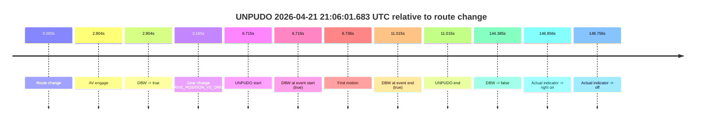
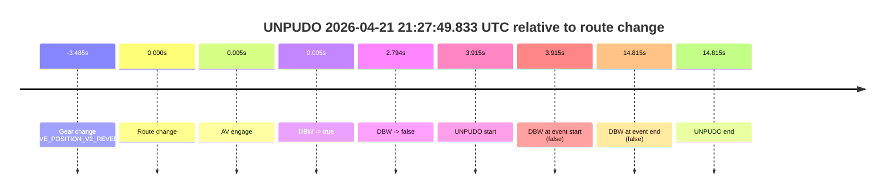
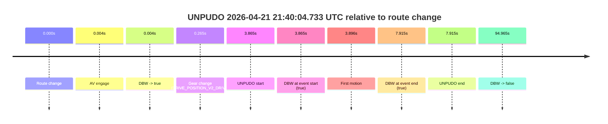
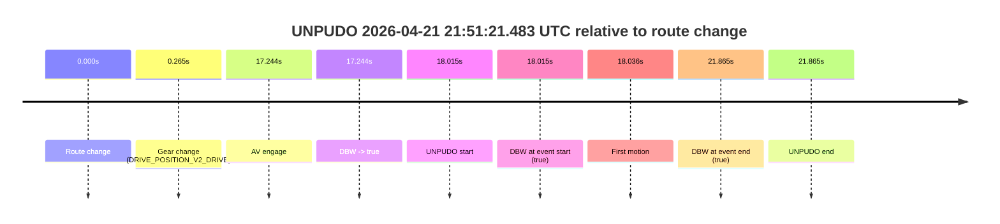

# Run Report: fme20032/2026-04-21--20-46-06--gen2-av-651ff103-15c7-4865-84b3-165d71a3ebb9

| Field | Value |
|---|---|
| Run ID | `fme20032/2026-04-21--20-46-06--gen2-av-651ff103-15c7-4865-84b3-165d71a3ebb9` |
| Date | `2026-04-21` |
| Model(s) | `eel-teal-outspoken` |
| Author | `zak` |
| Event count | `4` |

## unpudo 2026-04-21 21:06:01.683 UTC

| Field | Value |
|---|---|
| Model | `eel-teal-outspoken` |
| Author | `zak` |
| Run ID | `fme20032/2026-04-21--20-46-06--gen2-av-651ff103-15c7-4865-84b3-165d71a3ebb9` |
| Date | `2026-04-21` |
| Time (UTC) | `21:06:01.683` |
| Event type | `unpudo` |
| Disengagement type | `none observed` |
| Route change | `found` |
| Console | [run](https://console.sso.wayve.ai/run/fme20032/2026-04-21--20-46-06--gen2-av-651ff103-15c7-4865-84b3-165d71a3ebb9?id=&time-unixus=1776805561683325) |
| Foxglove | [segment](https://app.foxglove.dev/wayve-on-prem/p/prj_0dX18KZdVHg1fmmI/view?ds=foxglove-stream&ds.deviceName=fme20032&ds.start=2026-04-21T21%3A05%3A44.968257Z&ds.end=2026-04-21T21%3A08%3A29.352878Z&layoutId=lay_0e7VD4WIKDQGU73Y&time=2026-04-21T21%3A06%3A01.683325Z) |

### Event card: pass

- Pass: AV owns the credited unpudo from route change through the official unpudo window, the gear state is aligned at the anchor, and the vehicle moves without driver accelerator help in AV.

| Event | Time (UTC) | Delta from route change |
|---|---:|---:|
| Route change | 2026-04-21 21:05:54.968 | `0.000s` |
| AV engage | 2026-04-21 21:05:57.772 | `2.804s` |
| DBW -> true | 2026-04-21 21:05:57.772 | `2.804s` |
| Gear change (DRIVE_POSITION_V2_DRIVE) | 2026-04-21 21:05:58.133 | `3.165s` |
| UNPUDO start | 2026-04-21 21:06:01.683 | `6.715s` |
| DBW at event start (true) | 2026-04-21 21:06:01.683 | `6.715s` |
| First motion | 2026-04-21 21:06:01.704 | `6.736s` |
| DBW at event end (true) | 2026-04-21 21:06:05.983 | `11.015s` |
| UNPUDO end | 2026-04-21 21:06:05.983 | `11.015s` |
| DBW -> false | 2026-04-21 21:08:19.352 | `144.385s` |
| Actual indicator -> right on | 2026-04-21 21:08:21.824 | `146.856s` |
| Actual indicator -> off | 2026-04-21 21:08:23.724 | `148.756s` |

| Metric | Value |
|---|---|
| Outcome | `pass` |
| Effective failure type | `none` |
| Route change status | `found` |
| DBW at event start | `true` |
| DBW at event end | `true` |
| Predicted gear at AV start | `DRIVE_POSITION_V2_DRIVE` |
| Actual gear at AV start | `DRIVE_POSITION_V2_PARK` |
| Predicted gear at event start | `DRIVE_POSITION_V2_DRIVE` |
| Actual gear at event start | `DRIVE_POSITION_V2_DRIVE` |
| Planned indicator direction | `INDICATORS_STATE_V2_OFF` |
| Controller indicator direction | `INDICATORS_STATE_V2_RIGHT_ON` |
| Actual indicator direction | `INDICATORS_STATE_V2_OFF` |
| Actual indicator at maneuver end | `INDICATORS_STATE_V2_OFF` |
| Driver accel help in AV | `false` |
| Driver accel help timestamp | `n/a` |
| Max accel pedal pct in AV | `0.0%` |
| Max brake pedal pct in AV | `8.0%` |
| Max speed mps in AV | `4.514` |
| Success timing baseline | `route change` |
| Route -> AV | `2.804s` |
| AV -> event start | `3.911s` |
| AV -> first motion | `3.932s` |
| Success baseline -> event start | `6.715s` |
| Success baseline -> first motion | `6.736s` |
| AV duration before disengagement | `141.581s` |
| Trajectory waypoint count | `37` |
| Driving-plan step count | `11` |

The scored portion starts from the AV-owned window, not from the pre-AV setup. Route-change search in the stopped pre-event segment was `found`, with the baseline therefore set to route change. At the event anchor the model predicts `DRIVE_POSITION_V2_DRIVE` and the actual gear is `DRIVE_POSITION_V2_DRIVE`. The effective model outcome is `pass` because `the credited unpudo stays AV-owned through the official unpudo window.`

### Resolution

| Field | Value |
|---|---|
| Final outcome | `pass` |
| Do we agree with this label? | `yes` |
| Source disengagement type | `none observed` |
| Resolved effective failure type | `none` |
| Confidence | `high` |

## unpudo 2026-04-21 21:27:49.833 UTC

| Field | Value |
|---|---|
| Model | `eel-teal-outspoken` |
| Author | `zak` |
| Run ID | `fme20032/2026-04-21--20-46-06--gen2-av-651ff103-15c7-4865-84b3-165d71a3ebb9` |
| Date | `2026-04-21` |
| Time (UTC) | `21:27:49.833` |
| Event type | `unpudo` |
| Disengagement type | `none observed` |
| Route change | `found` |
| Console | [run](https://console.sso.wayve.ai/run/fme20032/2026-04-21--20-46-06--gen2-av-651ff103-15c7-4865-84b3-165d71a3ebb9?id=&time-unixus=1776806869833306) |
| Foxglove | [segment](https://app.foxglove.dev/wayve-on-prem/p/prj_0dX18KZdVHg1fmmI/view?ds=foxglove-stream&ds.deviceName=fme20032&ds.start=2026-04-21T21%3A27%3A32.433304Z&ds.end=2026-04-21T21%3A28%3A10.733323Z&layoutId=lay_0e7VD4WIKDQGU73Y&time=2026-04-21T21%3A27%3A49.833306Z) |

### Event card: fail

- Fail: the credited unpudo does not stay AV-owned. The event window starts with DBW false, and the maneuver outcome lands outside a clean AV-owned segment.

| Event | Time (UTC) | Delta from route change |
|---|---:|---:|
| Gear change (DRIVE_POSITION_V2_REVERSE) | 2026-04-21 21:27:42.433 | `-3.485s` |
| Route change | 2026-04-21 21:27:45.918 | `0.000s` |
| AV engage | 2026-04-21 21:27:45.922 | `0.005s` |
| DBW -> true | 2026-04-21 21:27:45.922 | `0.005s` |
| DBW -> false | 2026-04-21 21:27:48.712 | `2.794s` |
| UNPUDO start | 2026-04-21 21:27:49.833 | `3.915s` |
| DBW at event start (false) | 2026-04-21 21:27:49.833 | `3.915s` |
| DBW at event end (false) | 2026-04-21 21:28:00.733 | `14.815s` |
| UNPUDO end | 2026-04-21 21:28:00.733 | `14.815s` |

| Metric | Value |
|---|---|
| Outcome | `fail` |
| Effective failure type | `not_av_owned` |
| Route change status | `found` |
| DBW at event start | `false` |
| DBW at event end | `false` |
| Predicted gear at AV start | `DRIVE_POSITION_V2_REVERSE` |
| Actual gear at AV start | `DRIVE_POSITION_V2_REVERSE` |
| Predicted gear at event start | `DRIVE_POSITION_V2_REVERSE` |
| Actual gear at event start | `DRIVE_POSITION_V2_REVERSE` |
| Planned indicator direction | `INDICATORS_STATE_V2_OFF` |
| Controller indicator direction | `INDICATORS_STATE_V2_OFF` |
| Actual indicator direction | `INDICATORS_STATE_V2_OFF` |
| Actual indicator at maneuver end | `INDICATORS_STATE_V2_OFF` |
| Driver accel help in AV | `false` |
| Driver accel help timestamp | `n/a` |
| Max accel pedal pct in AV | `0.0%` |
| Max brake pedal pct in AV | `8.0%` |
| Max speed mps in AV | `0.000` |
| Success timing baseline | `route change` |
| Route -> AV | `0.005s` |
| AV -> event start | `3.910s` |
| AV -> first motion | `n/a` |
| Success baseline -> event start | `3.915s` |
| Success baseline -> first motion | `n/a` |
| AV duration before disengagement | `2.789s` |
| Trajectory waypoint count | `38` |
| Driving-plan step count | `11` |

The scored portion starts from the AV-owned window, not from the pre-AV setup. Route-change search in the stopped pre-event segment was `found`, with the baseline therefore set to route change. At the event anchor the model predicts `DRIVE_POSITION_V2_REVERSE` and the actual gear is `DRIVE_POSITION_V2_REVERSE`. The effective model outcome is `fail` because `not_av_owned.`

### Resolution

| Field | Value |
|---|---|
| Final outcome | `fail` |
| Do we agree with this label? | `yes` |
| Source disengagement type | `none observed` |
| Resolved effective failure type | `not_av_owned` |
| Confidence | `high` |

## unpudo 2026-04-21 21:40:04.733 UTC

| Field | Value |
|---|---|
| Model | `eel-teal-outspoken` |
| Author | `zak` |
| Run ID | `fme20032/2026-04-21--20-46-06--gen2-av-651ff103-15c7-4865-84b3-165d71a3ebb9` |
| Date | `2026-04-21` |
| Time (UTC) | `21:40:04.733` |
| Event type | `unpudo` |
| Disengagement type | `none observed` |
| Route change | `found` |
| Console | [run](https://console.sso.wayve.ai/run/fme20032/2026-04-21--20-46-06--gen2-av-651ff103-15c7-4865-84b3-165d71a3ebb9?id=&time-unixus=1776807604733325) |
| Foxglove | [segment](https://app.foxglove.dev/wayve-on-prem/p/prj_0dX18KZdVHg1fmmI/view?ds=foxglove-stream&ds.deviceName=fme20032&ds.start=2026-04-21T21%3A39%3A50.868291Z&ds.end=2026-04-21T21%3A41%3A45.833637Z&layoutId=lay_0e7VD4WIKDQGU73Y&time=2026-04-21T21%3A40%3A04.733325Z) |

### Event card: pass

- Pass: AV owns the credited unpudo from route change through the official unpudo window, the gear state is aligned at the anchor, and the vehicle moves without driver accelerator help in AV.

| Event | Time (UTC) | Delta from route change |
|---|---:|---:|
| Route change | 2026-04-21 21:40:00.868 | `0.000s` |
| AV engage | 2026-04-21 21:40:00.872 | `0.004s` |
| DBW -> true | 2026-04-21 21:40:00.872 | `0.004s` |
| Gear change (DRIVE_POSITION_V2_DRIVE) | 2026-04-21 21:40:01.133 | `0.265s` |
| UNPUDO start | 2026-04-21 21:40:04.733 | `3.865s` |
| DBW at event start (true) | 2026-04-21 21:40:04.733 | `3.865s` |
| First motion | 2026-04-21 21:40:04.764 | `3.896s` |
| DBW at event end (true) | 2026-04-21 21:40:08.783 | `7.915s` |
| UNPUDO end | 2026-04-21 21:40:08.783 | `7.915s` |
| DBW -> false | 2026-04-21 21:41:35.833 | `94.965s` |

| Metric | Value |
|---|---|
| Outcome | `pass` |
| Effective failure type | `none` |
| Route change status | `found` |
| DBW at event start | `true` |
| DBW at event end | `true` |
| Predicted gear at AV start | `DRIVE_POSITION_V2_PARK` |
| Actual gear at AV start | `DRIVE_POSITION_V2_PARK` |
| Predicted gear at event start | `DRIVE_POSITION_V2_DRIVE` |
| Actual gear at event start | `DRIVE_POSITION_V2_DRIVE` |
| Planned indicator direction | `INDICATORS_STATE_V2_RIGHT_ON` |
| Controller indicator direction | `INDICATORS_STATE_V2_RIGHT_ON` |
| Actual indicator direction | `INDICATORS_STATE_V2_OFF` |
| Actual indicator at maneuver end | `INDICATORS_STATE_V2_OFF` |
| Driver accel help in AV | `false` |
| Driver accel help timestamp | `n/a` |
| Max accel pedal pct in AV | `0.0%` |
| Max brake pedal pct in AV | `10.1%` |
| Max speed mps in AV | `4.342` |
| Success timing baseline | `route change` |
| Route -> AV | `0.004s` |
| AV -> event start | `3.861s` |
| AV -> first motion | `3.892s` |
| Success baseline -> event start | `3.865s` |
| Success baseline -> first motion | `3.896s` |
| AV duration before disengagement | `94.962s` |
| Trajectory waypoint count | `38` |
| Driving-plan step count | `11` |

The scored portion starts from the AV-owned window, not from the pre-AV setup. Route-change search in the stopped pre-event segment was `found`, with the baseline therefore set to route change. At the event anchor the model predicts `DRIVE_POSITION_V2_DRIVE` and the actual gear is `DRIVE_POSITION_V2_DRIVE`. The effective model outcome is `pass` because `the credited unpudo stays AV-owned through the official unpudo window.`

### Resolution

| Field | Value |
|---|---|
| Final outcome | `pass` |
| Do we agree with this label? | `yes` |
| Source disengagement type | `none observed` |
| Resolved effective failure type | `none` |
| Confidence | `high` |

## unpudo 2026-04-21 21:51:21.483 UTC

| Field | Value |
|---|---|
| Model | `eel-teal-outspoken` |
| Author | `zak` |
| Run ID | `fme20032/2026-04-21--20-46-06--gen2-av-651ff103-15c7-4865-84b3-165d71a3ebb9` |
| Date | `2026-04-21` |
| Time (UTC) | `21:51:21.483` |
| Event type | `unpudo` |
| Disengagement type | `none observed` |
| Route change | `found` |
| Console | [run](https://console.sso.wayve.ai/run/fme20032/2026-04-21--20-46-06--gen2-av-651ff103-15c7-4865-84b3-165d71a3ebb9?id=&time-unixus=1776808281483295) |
| Foxglove | [segment](https://app.foxglove.dev/wayve-on-prem/p/prj_0dX18KZdVHg1fmmI/view?ds=foxglove-stream&ds.deviceName=fme20032&ds.start=2026-04-21T21%3A50%3A53.468244Z&ds.end=2026-04-21T21%3A51%3A35.333316Z&layoutId=lay_0e7VD4WIKDQGU73Y&time=2026-04-21T21%3A51%3A21.483295Z) |

### Event card: pass

- Pass: AV owns the credited unpudo from route change through the official unpudo window, the gear state is aligned at the anchor, and the vehicle moves without driver accelerator help in AV.

| Event | Time (UTC) | Delta from route change |
|---|---:|---:|
| Route change | 2026-04-21 21:51:03.468 | `0.000s` |
| Gear change (DRIVE_POSITION_V2_DRIVE) | 2026-04-21 21:51:03.733 | `0.265s` |
| AV engage | 2026-04-21 21:51:20.712 | `17.244s` |
| DBW -> true | 2026-04-21 21:51:20.712 | `17.244s` |
| UNPUDO start | 2026-04-21 21:51:21.483 | `18.015s` |
| DBW at event start (true) | 2026-04-21 21:51:21.483 | `18.015s` |
| First motion | 2026-04-21 21:51:21.504 | `18.036s` |
| DBW at event end (true) | 2026-04-21 21:51:25.333 | `21.865s` |
| UNPUDO end | 2026-04-21 21:51:25.333 | `21.865s` |

| Metric | Value |
|---|---|
| Outcome | `pass` |
| Effective failure type | `none` |
| Route change status | `found` |
| DBW at event start | `true` |
| DBW at event end | `true` |
| Predicted gear at AV start | `DRIVE_POSITION_V2_DRIVE` |
| Actual gear at AV start | `DRIVE_POSITION_V2_DRIVE` |
| Predicted gear at event start | `DRIVE_POSITION_V2_DRIVE` |
| Actual gear at event start | `DRIVE_POSITION_V2_DRIVE` |
| Planned indicator direction | `INDICATORS_STATE_V2_RIGHT_ON` |
| Controller indicator direction | `INDICATORS_STATE_V2_RIGHT_ON` |
| Actual indicator direction | `INDICATORS_STATE_V2_OFF` |
| Actual indicator at maneuver end | `INDICATORS_STATE_V2_OFF` |
| Driver accel help in AV | `false` |
| Driver accel help timestamp | `n/a` |
| Max accel pedal pct in AV | `0.0%` |
| Max brake pedal pct in AV | `0.3%` |
| Max speed mps in AV | `4.914` |
| Success timing baseline | `route change` |
| Route -> AV | `17.244s` |
| AV -> event start | `0.771s` |
| AV -> first motion | `0.792s` |
| Success baseline -> event start | `18.015s` |
| Success baseline -> first motion | `18.036s` |
| AV duration before disengagement | `n/a` |
| Trajectory waypoint count | `37` |
| Driving-plan step count | `11` |

The scored portion starts from the AV-owned window, not from the pre-AV setup. Route-change search in the stopped pre-event segment was `found`, with the baseline therefore set to route change. At the event anchor the model predicts `DRIVE_POSITION_V2_DRIVE` and the actual gear is `DRIVE_POSITION_V2_DRIVE`. The effective model outcome is `pass` because `the credited unpudo stays AV-owned through the official unpudo window.`

### Resolution

| Field | Value |
|---|---|
| Final outcome | `pass` |
| Do we agree with this label? | `yes` |
| Source disengagement type | `none observed` |
| Resolved effective failure type | `none` |
| Confidence | `high` |
