# Run Report: fme20032/2026-04-22--06-46-49--gen2-av-dfb7ae12-4c7d-40e2-ad4b-edb775cd0fbf

| Field | Value |
|---|---|
| Run ID | `fme20032/2026-04-22--06-46-49--gen2-av-dfb7ae12-4c7d-40e2-ad4b-edb775cd0fbf` |
| Date | `2026-04-22` |
| Model(s) | `eel-teal-outspoken` |
| Author | `zak` |
| Event count | `16` |

## unpudo 2026-04-22 06:59:21.883 UTC

| Field | Value |
|---|---|
| Model | `eel-teal-outspoken` |
| Author | `zak` |
| Run ID | `fme20032/2026-04-22--06-46-49--gen2-av-dfb7ae12-4c7d-40e2-ad4b-edb775cd0fbf` |
| Date | `2026-04-22` |
| Time (UTC) | `06:59:21.883` |
| Event type | `unpudo` |
| Disengagement type | `none observed` |
| Route change | `unclear` |
| Console | [run](https://console.sso.wayve.ai/run/fme20032/2026-04-22--06-46-49--gen2-av-dfb7ae12-4c7d-40e2-ad4b-edb775cd0fbf?id=&time-unixus=1776841161883301) |
| Foxglove | [segment](https://app.foxglove.dev/wayve-on-prem/p/prj_0dX18KZdVHg1fmmI/view?ds=foxglove-stream&ds.deviceName=fme20032&ds.start=2026-04-22T06%3A58%3A51.574740Z&ds.end=2026-04-22T07%3A00%3A10.583303Z&layoutId=lay_0e7VD4WIKDQGU73Y&time=2026-04-22T06%3A59%3A21.883301Z) |

### Event card: fail

- Fail: the credited unpudo does not stay AV-owned. The event window starts with DBW false, and the maneuver outcome lands outside a clean AV-owned segment.

| Event | Time (UTC) | Delta from AV start |
|---|---:|---:|
| First motion | 2026-04-22 06:57:21.885 | `-99.689s` |
| Route change unclear | 2026-04-22 06:59:01.574 | `0.000s` |
| AV engage | 2026-04-22 06:59:01.574 | `0.000s` |
| DBW -> true | 2026-04-22 06:59:01.574 | `0.000s` |
| DBW -> false | 2026-04-22 06:59:18.513 | `16.939s` |
| Gear change (DRIVE_POSITION_V2_DRIVE) | 2026-04-22 06:59:20.983 | `19.409s` |
| UNPUDO start | 2026-04-22 06:59:21.883 | `20.309s` |
| DBW at event start (false) | 2026-04-22 06:59:21.883 | `20.309s` |
| Actual indicator -> left on | 2026-04-22 06:59:53.226 | `51.651s` |
| Actual indicator -> off | 2026-04-22 06:59:57.365 | `55.791s` |
| DBW at event end (false) | 2026-04-22 07:00:00.583 | `59.009s` |
| UNPUDO end | 2026-04-22 07:00:00.583 | `59.009s` |

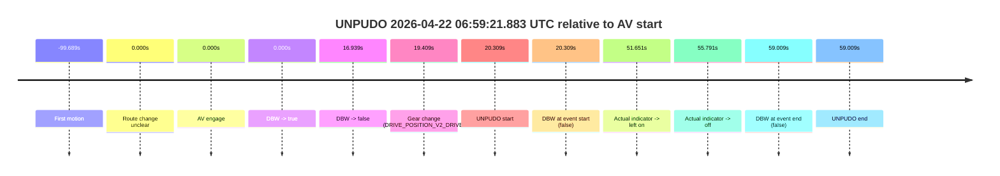

| Metric | Value |
|---|---|
| Outcome | `fail` |
| Effective failure type | `completed_outside_av` |
| Route change status | `unclear` |
| DBW at event start | `false` |
| DBW at event end | `false` |
| Predicted gear at AV start | `DRIVE_POSITION_V2_DRIVE` |
| Actual gear at AV start | `DRIVE_POSITION_V2_DRIVE` |
| Predicted gear at event start | `DRIVE_POSITION_V2_DRIVE` |
| Actual gear at event start | `DRIVE_POSITION_V2_DRIVE` |
| Planned indicator direction | `INDICATORS_STATE_V2_LEFT_ON` |
| Controller indicator direction | `INDICATORS_STATE_V2_LEFT_ON` |
| Actual indicator direction | `INDICATORS_STATE_V2_OFF` |
| Actual indicator at maneuver end | `INDICATORS_STATE_V2_OFF` |
| Driver accel help in AV | `false` |
| Driver accel help timestamp | `n/a` |
| Max accel pedal pct in AV | `0.0%` |
| Max brake pedal pct in AV | `14.6%` |
| Max speed mps in AV | `7.508` |
| Success timing baseline | `AV start` |
| Route -> AV | `n/a` |
| AV -> event start | `20.309s` |
| AV -> first motion | `-99.689s` |
| Success baseline -> event start | `20.309s` |
| Success baseline -> first motion | `-99.689s` |
| AV duration before disengagement | `16.939s` |
| Trajectory waypoint count | `37` |
| Driving-plan step count | `11` |

The scored portion starts from the AV-owned window, not from the pre-AV setup. Route-change search in the stopped pre-event segment was `unclear`, with the baseline therefore set to AV start. At the event anchor the model predicts `DRIVE_POSITION_V2_DRIVE` and the actual gear is `DRIVE_POSITION_V2_DRIVE`. The effective model outcome is `fail` because `completed_outside_av.`

### Resolution

| Field | Value |
|---|---|
| Final outcome | `fail` |
| Do we agree with this label? | `yes` |
| Source disengagement type | `none observed` |
| Resolved effective failure type | `completed_outside_av` |
| Confidence | `medium` |

## unpudo 2026-04-22 07:06:28.933 UTC

| Field | Value |
|---|---|
| Model | `eel-teal-outspoken` |
| Author | `zak` |
| Run ID | `fme20032/2026-04-22--06-46-49--gen2-av-dfb7ae12-4c7d-40e2-ad4b-edb775cd0fbf` |
| Date | `2026-04-22` |
| Time (UTC) | `07:06:28.933` |
| Event type | `unpudo` |
| Disengagement type | `none observed` |
| Route change | `found` |
| Console | [run](https://console.sso.wayve.ai/run/fme20032/2026-04-22--06-46-49--gen2-av-dfb7ae12-4c7d-40e2-ad4b-edb775cd0fbf?id=&time-unixus=1776841588933326) |
| Foxglove | [segment](https://app.foxglove.dev/wayve-on-prem/p/prj_0dX18KZdVHg1fmmI/view?ds=foxglove-stream&ds.deviceName=fme20032&ds.start=2026-04-22T07%3A05%3A38.918335Z&ds.end=2026-04-22T07%3A07%3A50.993446Z&layoutId=lay_0e7VD4WIKDQGU73Y&time=2026-04-22T07%3A06%3A28.933326Z) |

### Event card: pass

- Pass: AV owns the credited unpudo from route change through the official unpudo window, the gear state is aligned at the anchor, and the vehicle moves without driver accelerator help in AV.

| Event | Time (UTC) | Delta from route change |
|---|---:|---:|
| Route change | 2026-04-22 07:05:48.918 | `0.000s` |
| AV engage | 2026-04-22 07:06:20.173 | `31.255s` |
| DBW -> true | 2026-04-22 07:06:20.173 | `31.255s` |
| Gear change (DRIVE_POSITION_V2_DRIVE) | 2026-04-22 07:06:20.683 | `31.765s` |
| UNPUDO start | 2026-04-22 07:06:28.933 | `40.015s` |
| DBW at event start (true) | 2026-04-22 07:06:28.933 | `40.015s` |
| First motion | 2026-04-22 07:06:28.966 | `40.048s` |
| DBW at event end (true) | 2026-04-22 07:06:32.733 | `43.815s` |
| UNPUDO end | 2026-04-22 07:06:32.733 | `43.815s` |
| DBW -> false | 2026-04-22 07:07:40.993 | `112.075s` |

| Metric | Value |
|---|---|
| Outcome | `pass` |
| Effective failure type | `none` |
| Route change status | `found` |
| DBW at event start | `true` |
| DBW at event end | `true` |
| Predicted gear at AV start | `DRIVE_POSITION_V2_DRIVE` |
| Actual gear at AV start | `DRIVE_POSITION_V2_PARK` |
| Predicted gear at event start | `DRIVE_POSITION_V2_DRIVE` |
| Actual gear at event start | `DRIVE_POSITION_V2_DRIVE` |
| Planned indicator direction | `INDICATORS_STATE_V2_LEFT_ON` |
| Controller indicator direction | `INDICATORS_STATE_V2_LEFT_ON` |
| Actual indicator direction | `INDICATORS_STATE_V2_OFF` |
| Actual indicator at maneuver end | `INDICATORS_STATE_V2_OFF` |
| Driver accel help in AV | `false` |
| Driver accel help timestamp | `n/a` |
| Max accel pedal pct in AV | `0.0%` |
| Max brake pedal pct in AV | `8.7%` |
| Max speed mps in AV | `4.694` |
| Success timing baseline | `route change` |
| Route -> AV | `31.255s` |
| AV -> event start | `8.760s` |
| AV -> first motion | `8.793s` |
| Success baseline -> event start | `40.015s` |
| Success baseline -> first motion | `40.048s` |
| AV duration before disengagement | `80.820s` |
| Trajectory waypoint count | `38` |
| Driving-plan step count | `11` |

The scored portion starts from the AV-owned window, not from the pre-AV setup. Route-change search in the stopped pre-event segment was `found`, with the baseline therefore set to route change. At the event anchor the model predicts `DRIVE_POSITION_V2_DRIVE` and the actual gear is `DRIVE_POSITION_V2_DRIVE`. The effective model outcome is `pass` because `the credited unpudo stays AV-owned through the official unpudo window.`

### Resolution

| Field | Value |
|---|---|
| Final outcome | `pass` |
| Do we agree with this label? | `yes` |
| Source disengagement type | `none observed` |
| Resolved effective failure type | `none` |
| Confidence | `high` |

## unpudo 2026-04-22 07:09:29.583 UTC

| Field | Value |
|---|---|
| Model | `eel-teal-outspoken` |
| Author | `zak` |
| Run ID | `fme20032/2026-04-22--06-46-49--gen2-av-dfb7ae12-4c7d-40e2-ad4b-edb775cd0fbf` |
| Date | `2026-04-22` |
| Time (UTC) | `07:09:29.583` |
| Event type | `unpudo` |
| Disengagement type | `none observed` |
| Route change | `unclear` |
| Console | [run](https://console.sso.wayve.ai/run/fme20032/2026-04-22--06-46-49--gen2-av-dfb7ae12-4c7d-40e2-ad4b-edb775cd0fbf?id=&time-unixus=1776841769583296) |
| Foxglove | [segment](https://app.foxglove.dev/wayve-on-prem/p/prj_0dX18KZdVHg1fmmI/view?ds=foxglove-stream&ds.deviceName=fme20032&ds.start=2026-04-22T07%3A07%3A39.234730Z&ds.end=2026-04-22T07%3A09%3A39.583296Z&layoutId=lay_0e7VD4WIKDQGU73Y&time=2026-04-22T07%3A09%3A29.583296Z) |

### Event card: fail

- Fail: the credited unpudo does not stay AV-owned. The event window starts with DBW false, and the maneuver outcome lands outside a clean AV-owned segment.

| Event | Time (UTC) | Delta from AV start |
|---|---:|---:|
| First motion | 2026-04-22 07:07:34.605 | `-14.629s` |
| Route change unclear | 2026-04-22 07:07:49.234 | `0.000s` |
| AV engage | 2026-04-22 07:07:49.234 | `0.000s` |
| DBW -> true | 2026-04-22 07:07:49.234 | `0.000s` |
| DBW -> false | 2026-04-22 07:09:16.433 | `87.199s` |
| Gear change (DRIVE_POSITION_V2_REVERSE) | 2026-04-22 07:09:21.433 | `92.199s` |
| UNPUDO start | 2026-04-22 07:09:29.583 | `100.349s` |
| DBW at event start (false) | 2026-04-22 07:09:29.583 | `100.349s` |
| DBW at event end (false) | 2026-04-22 07:09:29.583 | `100.349s` |
| UNPUDO end | 2026-04-22 07:09:29.583 | `100.349s` |

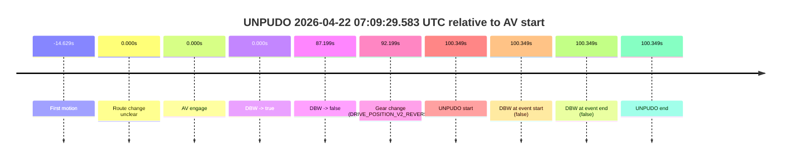

| Metric | Value |
|---|---|
| Outcome | `fail` |
| Effective failure type | `completed_outside_av` |
| Route change status | `unclear` |
| DBW at event start | `false` |
| DBW at event end | `false` |
| Predicted gear at AV start | `DRIVE_POSITION_V2_DRIVE` |
| Actual gear at AV start | `DRIVE_POSITION_V2_DRIVE` |
| Predicted gear at event start | `DRIVE_POSITION_V2_REVERSE` |
| Actual gear at event start | `DRIVE_POSITION_V2_REVERSE` |
| Planned indicator direction | `INDICATORS_STATE_V2_OFF` |
| Controller indicator direction | `INDICATORS_STATE_V2_OFF` |
| Actual indicator direction | `INDICATORS_STATE_V2_OFF` |
| Actual indicator at maneuver end | `INDICATORS_STATE_V2_OFF` |
| Driver accel help in AV | `false` |
| Driver accel help timestamp | `n/a` |
| Max accel pedal pct in AV | `0.0%` |
| Max brake pedal pct in AV | `26.3%` |
| Max speed mps in AV | `8.308` |
| Success timing baseline | `AV start` |
| Route -> AV | `n/a` |
| AV -> event start | `100.349s` |
| AV -> first motion | `-14.629s` |
| Success baseline -> event start | `100.349s` |
| Success baseline -> first motion | `-14.629s` |
| AV duration before disengagement | `87.199s` |
| Trajectory waypoint count | `37` |
| Driving-plan step count | `11` |

The scored portion starts from the AV-owned window, not from the pre-AV setup. Route-change search in the stopped pre-event segment was `unclear`, with the baseline therefore set to AV start. At the event anchor the model predicts `DRIVE_POSITION_V2_REVERSE` and the actual gear is `DRIVE_POSITION_V2_REVERSE`. The effective model outcome is `fail` because `completed_outside_av.`

### Resolution

| Field | Value |
|---|---|
| Final outcome | `fail` |
| Do we agree with this label? | `yes` |
| Source disengagement type | `none observed` |
| Resolved effective failure type | `completed_outside_av` |
| Confidence | `medium` |

## unpudo 2026-04-22 07:15:52.733 UTC

| Field | Value |
|---|---|
| Model | `eel-teal-outspoken` |
| Author | `zak` |
| Run ID | `fme20032/2026-04-22--06-46-49--gen2-av-dfb7ae12-4c7d-40e2-ad4b-edb775cd0fbf` |
| Date | `2026-04-22` |
| Time (UTC) | `07:15:52.733` |
| Event type | `unpudo` |
| Disengagement type | `none observed` |
| Route change | `found` |
| Console | [run](https://console.sso.wayve.ai/run/fme20032/2026-04-22--06-46-49--gen2-av-dfb7ae12-4c7d-40e2-ad4b-edb775cd0fbf?id=&time-unixus=1776842152733302) |
| Foxglove | [segment](https://app.foxglove.dev/wayve-on-prem/p/prj_0dX18KZdVHg1fmmI/view?ds=foxglove-stream&ds.deviceName=fme20032&ds.start=2026-04-22T07%3A15%3A22.568251Z&ds.end=2026-04-22T07%3A23%3A28.033385Z&layoutId=lay_0e7VD4WIKDQGU73Y&time=2026-04-22T07%3A15%3A52.733302Z) |

### Event card: pass

- Pass: AV owns the credited unpudo from route change through the official unpudo window, the gear state is aligned at the anchor, and the vehicle moves without driver accelerator help in AV.

| Event | Time (UTC) | Delta from route change |
|---|---:|---:|
| Route change | 2026-04-22 07:15:32.568 | `0.000s` |
| AV engage | 2026-04-22 07:15:32.573 | `0.005s` |
| DBW -> true | 2026-04-22 07:15:32.573 | `0.005s` |
| Gear change (DRIVE_POSITION_V2_DRIVE) | 2026-04-22 07:15:32.883 | `0.315s` |
| UNPUDO start | 2026-04-22 07:15:52.733 | `20.165s` |
| DBW at event start (true) | 2026-04-22 07:15:52.733 | `20.165s` |
| First motion | 2026-04-22 07:15:52.765 | `20.198s` |
| DBW at event end (true) | 2026-04-22 07:15:56.433 | `23.865s` |
| UNPUDO end | 2026-04-22 07:15:56.433 | `23.865s` |
| DBW -> false | 2026-04-22 07:23:18.033 | `465.465s` |

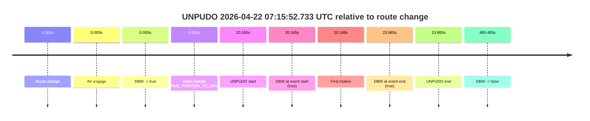

| Metric | Value |
|---|---|
| Outcome | `pass` |
| Effective failure type | `none` |
| Route change status | `found` |
| DBW at event start | `true` |
| DBW at event end | `true` |
| Predicted gear at AV start | `DRIVE_POSITION_V2_PARK` |
| Actual gear at AV start | `DRIVE_POSITION_V2_PARK` |
| Predicted gear at event start | `DRIVE_POSITION_V2_DRIVE` |
| Actual gear at event start | `DRIVE_POSITION_V2_DRIVE` |
| Planned indicator direction | `INDICATORS_STATE_V2_OFF` |
| Controller indicator direction | `INDICATORS_STATE_V2_OFF` |
| Actual indicator direction | `INDICATORS_STATE_V2_OFF` |
| Actual indicator at maneuver end | `INDICATORS_STATE_V2_OFF` |
| Driver accel help in AV | `false` |
| Driver accel help timestamp | `n/a` |
| Max accel pedal pct in AV | `0.0%` |
| Max brake pedal pct in AV | `8.0%` |
| Max speed mps in AV | `3.636` |
| Success timing baseline | `route change` |
| Route -> AV | `0.005s` |
| AV -> event start | `20.160s` |
| AV -> first motion | `20.192s` |
| Success baseline -> event start | `20.165s` |
| Success baseline -> first motion | `20.198s` |
| AV duration before disengagement | `465.460s` |
| Trajectory waypoint count | `38` |
| Driving-plan step count | `11` |

The scored portion starts from the AV-owned window, not from the pre-AV setup. Route-change search in the stopped pre-event segment was `found`, with the baseline therefore set to route change. At the event anchor the model predicts `DRIVE_POSITION_V2_DRIVE` and the actual gear is `DRIVE_POSITION_V2_DRIVE`. The effective model outcome is `pass` because `the credited unpudo stays AV-owned through the official unpudo window.`

### Resolution

| Field | Value |
|---|---|
| Final outcome | `pass` |
| Do we agree with this label? | `yes` |
| Source disengagement type | `none observed` |
| Resolved effective failure type | `none` |
| Confidence | `high` |

## unpudo 2026-04-22 07:26:52.633 UTC

| Field | Value |
|---|---|
| Model | `eel-teal-outspoken` |
| Author | `zak` |
| Run ID | `fme20032/2026-04-22--06-46-49--gen2-av-dfb7ae12-4c7d-40e2-ad4b-edb775cd0fbf` |
| Date | `2026-04-22` |
| Time (UTC) | `07:26:52.633` |
| Event type | `unpudo` |
| Disengagement type | `none observed` |
| Route change | `found` |
| Console | [run](https://console.sso.wayve.ai/run/fme20032/2026-04-22--06-46-49--gen2-av-dfb7ae12-4c7d-40e2-ad4b-edb775cd0fbf?id=&time-unixus=1776842812633313) |
| Foxglove | [segment](https://app.foxglove.dev/wayve-on-prem/p/prj_0dX18KZdVHg1fmmI/view?ds=foxglove-stream&ds.deviceName=fme20032&ds.start=2026-04-22T07%3A25%3A20.818252Z&ds.end=2026-04-22T07%3A28%3A29.174284Z&layoutId=lay_0e7VD4WIKDQGU73Y&time=2026-04-22T07%3A26%3A52.633313Z) |

### Event card: pass

- Pass: AV owns the credited unpudo from route change through the official unpudo window, the gear state is aligned at the anchor, and the vehicle moves without driver accelerator help in AV.

| Event | Time (UTC) | Delta from route change |
|---|---:|---:|
| Route change | 2026-04-22 07:25:30.818 | `0.000s` |
| Actual indicator -> right on | 2026-04-22 07:25:33.645 | `2.827s` |
| First motion | 2026-04-22 07:25:34.305 | `3.487s` |
| Actual indicator -> off | 2026-04-22 07:25:36.585 | `5.767s` |
| Actual indicator -> left on | 2026-04-22 07:25:48.625 | `17.807s` |
| Actual indicator -> off | 2026-04-22 07:25:51.485 | `20.667s` |
| AV engage | 2026-04-22 07:26:40.753 | `69.935s` |
| DBW -> true | 2026-04-22 07:26:40.753 | `69.935s` |
| Gear change (DRIVE_POSITION_V2_DRIVE) | 2026-04-22 07:26:41.083 | `70.265s` |
| UNPUDO start | 2026-04-22 07:26:52.633 | `81.815s` |
| DBW at event start (true) | 2026-04-22 07:26:52.633 | `81.815s` |
| DBW at event end (true) | 2026-04-22 07:26:56.333 | `85.515s` |
| UNPUDO end | 2026-04-22 07:26:56.333 | `85.515s` |
| DBW -> false | 2026-04-22 07:28:19.174 | `168.356s` |
| Actual indicator -> right on | 2026-04-22 07:28:19.766 | `168.948s` |
| Actual indicator -> off | 2026-04-22 07:28:23.765 | `172.947s` |
| Actual indicator -> right on | 2026-04-22 07:28:24.166 | `173.348s` |
| Actual indicator -> off | 2026-04-22 07:28:29.225 | `178.407s` |

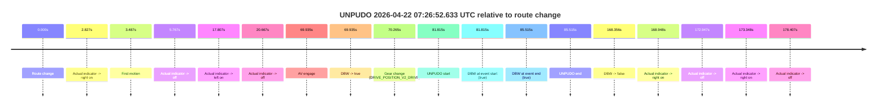

| Metric | Value |
|---|---|
| Outcome | `pass` |
| Effective failure type | `none` |
| Route change status | `found` |
| DBW at event start | `true` |
| DBW at event end | `true` |
| Predicted gear at AV start | `DRIVE_POSITION_V2_DRIVE` |
| Actual gear at AV start | `DRIVE_POSITION_V2_PARK` |
| Predicted gear at event start | `DRIVE_POSITION_V2_DRIVE` |
| Actual gear at event start | `DRIVE_POSITION_V2_DRIVE` |
| Planned indicator direction | `INDICATORS_STATE_V2_RIGHT_ON` |
| Controller indicator direction | `INDICATORS_STATE_V2_RIGHT_ON` |
| Actual indicator direction | `INDICATORS_STATE_V2_OFF` |
| Actual indicator at maneuver end | `INDICATORS_STATE_V2_OFF` |
| Driver accel help in AV | `false` |
| Driver accel help timestamp | `n/a` |
| Max accel pedal pct in AV | `0.0%` |
| Max brake pedal pct in AV | `8.2%` |
| Max speed mps in AV | `4.464` |
| Success timing baseline | `route change` |
| Route -> AV | `69.935s` |
| AV -> event start | `11.880s` |
| AV -> first motion | `-66.448s` |
| Success baseline -> event start | `81.815s` |
| Success baseline -> first motion | `3.487s` |
| AV duration before disengagement | `98.421s` |
| Trajectory waypoint count | `38` |
| Driving-plan step count | `11` |

The scored portion starts from the AV-owned window, not from the pre-AV setup. Route-change search in the stopped pre-event segment was `found`, with the baseline therefore set to route change. At the event anchor the model predicts `DRIVE_POSITION_V2_DRIVE` and the actual gear is `DRIVE_POSITION_V2_DRIVE`. The effective model outcome is `pass` because `the credited unpudo stays AV-owned through the official unpudo window.`

### Resolution

| Field | Value |
|---|---|
| Final outcome | `pass` |
| Do we agree with this label? | `yes` |
| Source disengagement type | `none observed` |
| Resolved effective failure type | `none` |
| Confidence | `high` |

## unpudo 2026-04-22 07:44:40.433 UTC

| Field | Value |
|---|---|
| Model | `eel-teal-outspoken` |
| Author | `zak` |
| Run ID | `fme20032/2026-04-22--06-46-49--gen2-av-dfb7ae12-4c7d-40e2-ad4b-edb775cd0fbf` |
| Date | `2026-04-22` |
| Time (UTC) | `07:44:40.433` |
| Event type | `unpudo` |
| Disengagement type | `none observed` |
| Route change | `found` |
| Console | [run](https://console.sso.wayve.ai/run/fme20032/2026-04-22--06-46-49--gen2-av-dfb7ae12-4c7d-40e2-ad4b-edb775cd0fbf?id=&time-unixus=1776843880433302) |
| Foxglove | [segment](https://app.foxglove.dev/wayve-on-prem/p/prj_0dX18KZdVHg1fmmI/view?ds=foxglove-stream&ds.deviceName=fme20032&ds.start=2026-04-22T07%3A44%3A18.318390Z&ds.end=2026-04-22T07%3A44%3A55.373415Z&layoutId=lay_0e7VD4WIKDQGU73Y&time=2026-04-22T07%3A44%3A40.433302Z) |

### Event card: fail

- Fail: this is a short AV stint rather than a durable model-owned maneuver. The vehicle never settles into a long enough AV-owned attempt to credit the model.

| Event | Time (UTC) | Delta from route change |
|---|---:|---:|
| Route change | 2026-04-22 07:44:28.318 | `0.000s` |
| AV engage | 2026-04-22 07:44:36.413 | `8.095s` |
| DBW -> true | 2026-04-22 07:44:36.413 | `8.095s` |
| Gear change (DRIVE_POSITION_V2_DRIVE) | 2026-04-22 07:44:36.933 | `8.615s` |
| UNPUDO start | 2026-04-22 07:44:40.433 | `12.115s` |
| DBW at event start (true) | 2026-04-22 07:44:40.433 | `12.115s` |
| DBW at event end (true) | 2026-04-22 07:44:40.433 | `12.115s` |
| UNPUDO end | 2026-04-22 07:44:40.433 | `12.115s` |
| DBW -> false | 2026-04-22 07:44:45.373 | `17.055s` |
| Actual indicator -> left on | 2026-04-22 07:44:48.465 | `20.147s` |
| Actual indicator -> off | 2026-04-22 07:45:03.785 | `35.467s` |

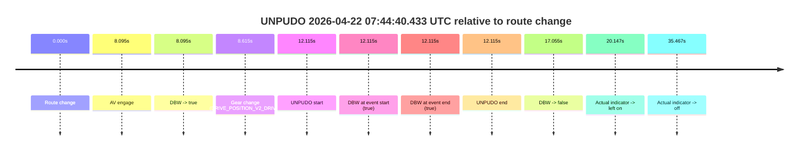

| Metric | Value |
|---|---|
| Outcome | `fail` |
| Effective failure type | `interrupted_handover` |
| Route change status | `found` |
| DBW at event start | `true` |
| DBW at event end | `true` |
| Predicted gear at AV start | `DRIVE_POSITION_V2_DRIVE` |
| Actual gear at AV start | `DRIVE_POSITION_V2_PARK` |
| Predicted gear at event start | `DRIVE_POSITION_V2_DRIVE` |
| Actual gear at event start | `DRIVE_POSITION_V2_DRIVE` |
| Planned indicator direction | `INDICATORS_STATE_V2_OFF` |
| Controller indicator direction | `INDICATORS_STATE_V2_OFF` |
| Actual indicator direction | `INDICATORS_STATE_V2_OFF` |
| Actual indicator at maneuver end | `INDICATORS_STATE_V2_OFF` |
| Driver accel help in AV | `false` |
| Driver accel help timestamp | `n/a` |
| Max accel pedal pct in AV | `0.0%` |
| Max brake pedal pct in AV | `8.2%` |
| Max speed mps in AV | `0.000` |
| Success timing baseline | `route change` |
| Route -> AV | `8.095s` |
| AV -> event start | `4.020s` |
| AV -> first motion | `n/a` |
| Success baseline -> event start | `12.115s` |
| Success baseline -> first motion | `n/a` |
| AV duration before disengagement | `8.960s` |
| Trajectory waypoint count | `38` |
| Driving-plan step count | `11` |

The scored portion starts from the AV-owned window, not from the pre-AV setup. Route-change search in the stopped pre-event segment was `found`, with the baseline therefore set to route change. At the event anchor the model predicts `DRIVE_POSITION_V2_DRIVE` and the actual gear is `DRIVE_POSITION_V2_DRIVE`. The effective model outcome is `fail` because `interrupted_handover.`

### Resolution

| Field | Value |
|---|---|
| Final outcome | `fail` |
| Do we agree with this label? | `yes` |
| Source disengagement type | `none observed` |
| Resolved effective failure type | `interrupted_handover` |
| Confidence | `high` |

## unpudo 2026-04-22 07:45:10.683 UTC

| Field | Value |
|---|---|
| Model | `eel-teal-outspoken` |
| Author | `zak` |
| Run ID | `fme20032/2026-04-22--06-46-49--gen2-av-dfb7ae12-4c7d-40e2-ad4b-edb775cd0fbf` |
| Date | `2026-04-22` |
| Time (UTC) | `07:45:10.683` |
| Event type | `unpudo` |
| Disengagement type | `none observed` |
| Route change | `found` |
| Console | [run](https://console.sso.wayve.ai/run/fme20032/2026-04-22--06-46-49--gen2-av-dfb7ae12-4c7d-40e2-ad4b-edb775cd0fbf?id=&time-unixus=1776843910683321) |
| Foxglove | [segment](https://app.foxglove.dev/wayve-on-prem/p/prj_0dX18KZdVHg1fmmI/view?ds=foxglove-stream&ds.deviceName=fme20032&ds.start=2026-04-22T07%3A44%3A18.318390Z&ds.end=2026-04-22T07%3A45%3A32.383319Z&layoutId=lay_0e7VD4WIKDQGU73Y&time=2026-04-22T07%3A45%3A10.683321Z) |

### Event card: fail

- Fail: the credited unpudo does not stay AV-owned. The event window starts with DBW false, and the maneuver outcome lands outside a clean AV-owned segment.

| Event | Time (UTC) | Delta from route change |
|---|---:|---:|
| Route change | 2026-04-22 07:44:28.318 | `0.000s` |
| AV engage | 2026-04-22 07:44:36.413 | `8.095s` |
| DBW -> true | 2026-04-22 07:44:36.413 | `8.095s` |
| First motion | 2026-04-22 07:44:40.485 | `12.167s` |
| DBW -> false | 2026-04-22 07:44:45.373 | `17.055s` |
| Actual indicator -> left on | 2026-04-22 07:44:48.465 | `20.147s` |
| Actual indicator -> off | 2026-04-22 07:45:03.785 | `35.467s` |
| Gear change (DRIVE_POSITION_V2_DRIVE) | 2026-04-22 07:45:08.683 | `40.365s` |
| UNPUDO start | 2026-04-22 07:45:10.683 | `42.365s` |
| DBW at event start (false) | 2026-04-22 07:45:10.683 | `42.365s` |
| DBW at event end (false) | 2026-04-22 07:45:22.383 | `54.065s` |
| UNPUDO end | 2026-04-22 07:45:22.383 | `54.065s` |

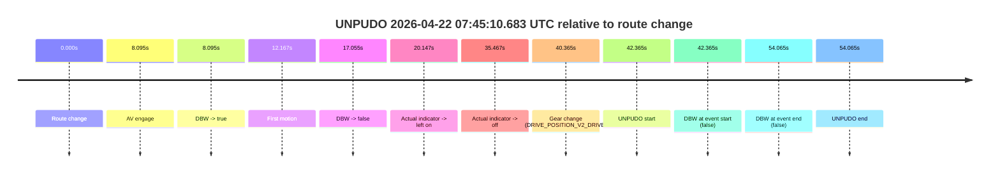

| Metric | Value |
|---|---|
| Outcome | `fail` |
| Effective failure type | `not_av_owned` |
| Route change status | `found` |
| DBW at event start | `false` |
| DBW at event end | `false` |
| Predicted gear at AV start | `DRIVE_POSITION_V2_DRIVE` |
| Actual gear at AV start | `DRIVE_POSITION_V2_PARK` |
| Predicted gear at event start | `DRIVE_POSITION_V2_DRIVE` |
| Actual gear at event start | `DRIVE_POSITION_V2_DRIVE` |
| Planned indicator direction | `INDICATORS_STATE_V2_OFF` |
| Controller indicator direction | `INDICATORS_STATE_V2_OFF` |
| Actual indicator direction | `INDICATORS_STATE_V2_OFF` |
| Actual indicator at maneuver end | `INDICATORS_STATE_V2_OFF` |
| Driver accel help in AV | `false` |
| Driver accel help timestamp | `n/a` |
| Max accel pedal pct in AV | `0.0%` |
| Max brake pedal pct in AV | `8.2%` |
| Max speed mps in AV | `2.600` |
| Success timing baseline | `route change` |
| Route -> AV | `8.095s` |
| AV -> event start | `34.270s` |
| AV -> first motion | `4.072s` |
| Success baseline -> event start | `42.365s` |
| Success baseline -> first motion | `12.167s` |
| AV duration before disengagement | `8.960s` |
| Trajectory waypoint count | `37` |
| Driving-plan step count | `11` |

The scored portion starts from the AV-owned window, not from the pre-AV setup. Route-change search in the stopped pre-event segment was `found`, with the baseline therefore set to route change. At the event anchor the model predicts `DRIVE_POSITION_V2_DRIVE` and the actual gear is `DRIVE_POSITION_V2_DRIVE`. The effective model outcome is `fail` because `not_av_owned.`

### Resolution

| Field | Value |
|---|---|
| Final outcome | `fail` |
| Do we agree with this label? | `yes` |
| Source disengagement type | `none observed` |
| Resolved effective failure type | `not_av_owned` |
| Confidence | `high` |

## unpudo 2026-04-22 08:12:21.433 UTC

| Field | Value |
|---|---|
| Model | `eel-teal-outspoken` |
| Author | `zak` |
| Run ID | `fme20032/2026-04-22--06-46-49--gen2-av-dfb7ae12-4c7d-40e2-ad4b-edb775cd0fbf` |
| Date | `2026-04-22` |
| Time (UTC) | `08:12:21.433` |
| Event type | `unpudo` |
| Disengagement type | `none observed` |
| Route change | `found` |
| Console | [run](https://console.sso.wayve.ai/run/fme20032/2026-04-22--06-46-49--gen2-av-dfb7ae12-4c7d-40e2-ad4b-edb775cd0fbf?id=&time-unixus=1776845541433301) |
| Foxglove | [segment](https://app.foxglove.dev/wayve-on-prem/p/prj_0dX18KZdVHg1fmmI/view?ds=foxglove-stream&ds.deviceName=fme20032&ds.start=2026-04-22T08%3A11%3A26.968256Z&ds.end=2026-04-22T08%3A12%3A46.383311Z&layoutId=lay_0e7VD4WIKDQGU73Y&time=2026-04-22T08%3A12%3A21.433301Z) |

### Event card: fail

- Fail: the credited unpudo does not stay AV-owned. The event window starts with DBW false, and the maneuver outcome lands outside a clean AV-owned segment.

| Event | Time (UTC) | Delta from route change |
|---|---:|---:|
| Actual indicator already left on | 2026-04-22 08:11:26.985 | `-9.983s` |
| Route change | 2026-04-22 08:11:36.968 | `0.000s` |
| AV engage | 2026-04-22 08:11:41.213 | `4.245s` |
| DBW -> true | 2026-04-22 08:11:41.213 | `4.245s` |
| Gear change (DRIVE_POSITION_V2_DRIVE) | 2026-04-22 08:11:41.733 | `4.765s` |
| Actual indicator -> off | 2026-04-22 08:11:44.385 | `7.417s` |
| DBW -> false | 2026-04-22 08:12:19.552 | `42.585s` |
| Actual indicator -> right on | 2026-04-22 08:12:20.345 | `43.377s` |
| UNPUDO start | 2026-04-22 08:12:21.433 | `44.465s` |
| DBW at event start (false) | 2026-04-22 08:12:21.433 | `44.465s` |
| Actual indicator -> off | 2026-04-22 08:12:26.285 | `49.318s` |
| DBW at event end (false) | 2026-04-22 08:12:36.383 | `59.415s` |
| UNPUDO end | 2026-04-22 08:12:36.383 | `59.415s` |

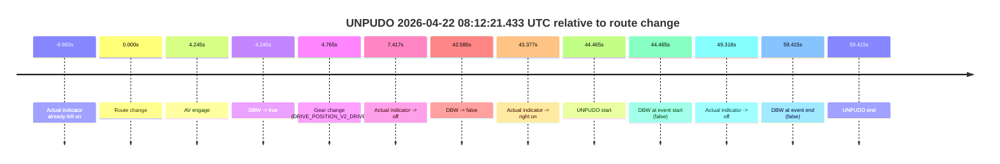

| Metric | Value |
|---|---|
| Outcome | `fail` |
| Effective failure type | `not_av_owned` |
| Route change status | `found` |
| DBW at event start | `false` |
| DBW at event end | `false` |
| Predicted gear at AV start | `DRIVE_POSITION_V2_DRIVE` |
| Actual gear at AV start | `DRIVE_POSITION_V2_PARK` |
| Predicted gear at event start | `DRIVE_POSITION_V2_DRIVE` |
| Actual gear at event start | `DRIVE_POSITION_V2_DRIVE` |
| Planned indicator direction | `INDICATORS_STATE_V2_RIGHT_ON` |
| Controller indicator direction | `INDICATORS_STATE_V2_RIGHT_ON` |
| Actual indicator direction | `INDICATORS_STATE_V2_RIGHT_ON` |
| Actual indicator at maneuver end | `INDICATORS_STATE_V2_OFF` |
| Driver accel help in AV | `false` |
| Driver accel help timestamp | `n/a` |
| Max accel pedal pct in AV | `0.0%` |
| Max brake pedal pct in AV | `8.0%` |
| Max speed mps in AV | `0.000` |
| Success timing baseline | `route change` |
| Route -> AV | `4.245s` |
| AV -> event start | `40.220s` |
| AV -> first motion | `n/a` |
| Success baseline -> event start | `44.465s` |
| Success baseline -> first motion | `n/a` |
| AV duration before disengagement | `38.339s` |
| Trajectory waypoint count | `38` |
| Driving-plan step count | `11` |

The scored portion starts from the AV-owned window, not from the pre-AV setup. Route-change search in the stopped pre-event segment was `found`, with the baseline therefore set to route change. At the event anchor the model predicts `DRIVE_POSITION_V2_DRIVE` and the actual gear is `DRIVE_POSITION_V2_DRIVE`. The effective model outcome is `fail` because `not_av_owned.`

### Resolution

| Field | Value |
|---|---|
| Final outcome | `fail` |
| Do we agree with this label? | `yes` |
| Source disengagement type | `none observed` |
| Resolved effective failure type | `not_av_owned` |
| Confidence | `high` |

## unpudo 2026-04-22 08:15:04.633 UTC

| Field | Value |
|---|---|
| Model | `eel-teal-outspoken` |
| Author | `zak` |
| Run ID | `fme20032/2026-04-22--06-46-49--gen2-av-dfb7ae12-4c7d-40e2-ad4b-edb775cd0fbf` |
| Date | `2026-04-22` |
| Time (UTC) | `08:15:04.633` |
| Event type | `unpudo` |
| Disengagement type | `none observed` |
| Route change | `found` |
| Console | [run](https://console.sso.wayve.ai/run/fme20032/2026-04-22--06-46-49--gen2-av-dfb7ae12-4c7d-40e2-ad4b-edb775cd0fbf?id=&time-unixus=1776845704633308) |
| Foxglove | [segment](https://app.foxglove.dev/wayve-on-prem/p/prj_0dX18KZdVHg1fmmI/view?ds=foxglove-stream&ds.deviceName=fme20032&ds.start=2026-04-22T08%3A13%3A58.168448Z&ds.end=2026-04-22T08%3A17%3A10.954682Z&layoutId=lay_0e7VD4WIKDQGU73Y&time=2026-04-22T08%3A15%3A04.633308Z) |

### Event card: pass

- Pass: AV owns the credited unpudo from route change through the official unpudo window, the gear state is aligned at the anchor, and the vehicle moves without driver accelerator help in AV.

| Event | Time (UTC) | Delta from route change |
|---|---:|---:|
| Route change | 2026-04-22 08:14:08.168 | `0.000s` |
| AV engage | 2026-04-22 08:14:14.933 | `6.765s` |
| DBW -> true | 2026-04-22 08:14:14.933 | `6.765s` |
| Gear change (DRIVE_POSITION_V2_DRIVE) | 2026-04-22 08:14:15.433 | `7.265s` |
| UNPUDO start | 2026-04-22 08:15:04.633 | `56.465s` |
| DBW at event start (true) | 2026-04-22 08:15:04.633 | `56.465s` |
| First motion | 2026-04-22 08:15:04.685 | `56.517s` |
| DBW at event end (true) | 2026-04-22 08:15:08.033 | `59.865s` |
| UNPUDO end | 2026-04-22 08:15:08.033 | `59.865s` |
| Actual indicator -> left on | 2026-04-22 08:16:52.125 | `163.957s` |
| Actual indicator -> off | 2026-04-22 08:16:57.025 | `168.857s` |
| DBW -> false | 2026-04-22 08:17:00.954 | `172.786s` |

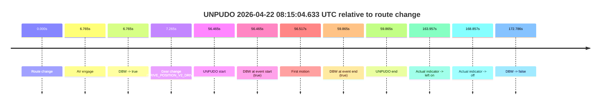

| Metric | Value |
|---|---|
| Outcome | `pass` |
| Effective failure type | `none` |
| Route change status | `found` |
| DBW at event start | `true` |
| DBW at event end | `true` |
| Predicted gear at AV start | `DRIVE_POSITION_V2_DRIVE` |
| Actual gear at AV start | `DRIVE_POSITION_V2_PARK` |
| Predicted gear at event start | `DRIVE_POSITION_V2_DRIVE` |
| Actual gear at event start | `DRIVE_POSITION_V2_DRIVE` |
| Planned indicator direction | `INDICATORS_STATE_V2_OFF` |
| Controller indicator direction | `INDICATORS_STATE_V2_OFF` |
| Actual indicator direction | `INDICATORS_STATE_V2_OFF` |
| Actual indicator at maneuver end | `INDICATORS_STATE_V2_OFF` |
| Driver accel help in AV | `false` |
| Driver accel help timestamp | `n/a` |
| Max accel pedal pct in AV | `0.0%` |
| Max brake pedal pct in AV | `8.0%` |
| Max speed mps in AV | `4.997` |
| Success timing baseline | `route change` |
| Route -> AV | `6.765s` |
| AV -> event start | `49.700s` |
| AV -> first motion | `49.752s` |
| Success baseline -> event start | `56.465s` |
| Success baseline -> first motion | `56.517s` |
| AV duration before disengagement | `166.021s` |
| Trajectory waypoint count | `38` |
| Driving-plan step count | `11` |

The scored portion starts from the AV-owned window, not from the pre-AV setup. Route-change search in the stopped pre-event segment was `found`, with the baseline therefore set to route change. At the event anchor the model predicts `DRIVE_POSITION_V2_DRIVE` and the actual gear is `DRIVE_POSITION_V2_DRIVE`. The effective model outcome is `pass` because `the credited unpudo stays AV-owned through the official unpudo window.`

### Resolution

| Field | Value |
|---|---|
| Final outcome | `pass` |
| Do we agree with this label? | `yes` |
| Source disengagement type | `none observed` |
| Resolved effective failure type | `none` |
| Confidence | `high` |

## unpudo 2026-04-22 08:17:39.333 UTC

| Field | Value |
|---|---|
| Model | `eel-teal-outspoken` |
| Author | `zak` |
| Run ID | `fme20032/2026-04-22--06-46-49--gen2-av-dfb7ae12-4c7d-40e2-ad4b-edb775cd0fbf` |
| Date | `2026-04-22` |
| Time (UTC) | `08:17:39.333` |
| Event type | `unpudo` |
| Disengagement type | `none observed` |
| Route change | `found` |
| Console | [run](https://console.sso.wayve.ai/run/fme20032/2026-04-22--06-46-49--gen2-av-dfb7ae12-4c7d-40e2-ad4b-edb775cd0fbf?id=&time-unixus=1776845859333302) |
| Foxglove | [segment](https://app.foxglove.dev/wayve-on-prem/p/prj_0dX18KZdVHg1fmmI/view?ds=foxglove-stream&ds.deviceName=fme20032&ds.start=2026-04-22T08%3A17%3A15.668263Z&ds.end=2026-04-22T08%3A18%3A54.334674Z&layoutId=lay_0e7VD4WIKDQGU73Y&time=2026-04-22T08%3A17%3A39.333302Z) |

### Event card: pass

- Pass: AV owns the credited unpudo from route change through the official unpudo window, the gear state is aligned at the anchor, and the vehicle moves without driver accelerator help in AV.

| Event | Time (UTC) | Delta from route change |
|---|---:|---:|
| Route change | 2026-04-22 08:17:25.668 | `0.000s` |
| AV engage | 2026-04-22 08:17:34.793 | `9.125s` |
| DBW -> true | 2026-04-22 08:17:34.793 | `9.125s` |
| Gear change (DRIVE_POSITION_V2_DRIVE) | 2026-04-22 08:17:35.233 | `9.565s` |
| UNPUDO start | 2026-04-22 08:17:39.333 | `13.665s` |
| DBW at event start (true) | 2026-04-22 08:17:39.333 | `13.665s` |
| First motion | 2026-04-22 08:17:39.365 | `13.698s` |
| DBW at event end (true) | 2026-04-22 08:17:44.233 | `18.565s` |
| UNPUDO end | 2026-04-22 08:17:44.233 | `18.565s` |
| DBW -> false | 2026-04-22 08:18:44.334 | `78.666s` |

| Metric | Value |
|---|---|
| Outcome | `pass` |
| Effective failure type | `none` |
| Route change status | `found` |
| DBW at event start | `true` |
| DBW at event end | `true` |
| Predicted gear at AV start | `DRIVE_POSITION_V2_DRIVE` |
| Actual gear at AV start | `DRIVE_POSITION_V2_PARK` |
| Predicted gear at event start | `DRIVE_POSITION_V2_DRIVE` |
| Actual gear at event start | `DRIVE_POSITION_V2_DRIVE` |
| Planned indicator direction | `INDICATORS_STATE_V2_RIGHT_ON` |
| Controller indicator direction | `INDICATORS_STATE_V2_RIGHT_ON` |
| Actual indicator direction | `INDICATORS_STATE_V2_OFF` |
| Actual indicator at maneuver end | `INDICATORS_STATE_V2_OFF` |
| Driver accel help in AV | `false` |
| Driver accel help timestamp | `n/a` |
| Max accel pedal pct in AV | `0.0%` |
| Max brake pedal pct in AV | `8.5%` |
| Max speed mps in AV | `4.575` |
| Success timing baseline | `route change` |
| Route -> AV | `9.125s` |
| AV -> event start | `4.540s` |
| AV -> first motion | `4.572s` |
| Success baseline -> event start | `13.665s` |
| Success baseline -> first motion | `13.698s` |
| AV duration before disengagement | `69.541s` |
| Trajectory waypoint count | `38` |
| Driving-plan step count | `11` |

The scored portion starts from the AV-owned window, not from the pre-AV setup. Route-change search in the stopped pre-event segment was `found`, with the baseline therefore set to route change. At the event anchor the model predicts `DRIVE_POSITION_V2_DRIVE` and the actual gear is `DRIVE_POSITION_V2_DRIVE`. The effective model outcome is `pass` because `the credited unpudo stays AV-owned through the official unpudo window.`

### Resolution

| Field | Value |
|---|---|
| Final outcome | `pass` |
| Do we agree with this label? | `yes` |
| Source disengagement type | `none observed` |
| Resolved effective failure type | `none` |
| Confidence | `high` |

## unpudo 2026-04-22 08:21:30.683 UTC

| Field | Value |
|---|---|
| Model | `eel-teal-outspoken` |
| Author | `zak` |
| Run ID | `fme20032/2026-04-22--06-46-49--gen2-av-dfb7ae12-4c7d-40e2-ad4b-edb775cd0fbf` |
| Date | `2026-04-22` |
| Time (UTC) | `08:21:30.683` |
| Event type | `unpudo` |
| Disengagement type | `none observed` |
| Route change | `found` |
| Console | [run](https://console.sso.wayve.ai/run/fme20032/2026-04-22--06-46-49--gen2-av-dfb7ae12-4c7d-40e2-ad4b-edb775cd0fbf?id=&time-unixus=1776846090683314) |
| Foxglove | [segment](https://app.foxglove.dev/wayve-on-prem/p/prj_0dX18KZdVHg1fmmI/view?ds=foxglove-stream&ds.deviceName=fme20032&ds.start=2026-04-22T08%3A21%3A00.118268Z&ds.end=2026-04-22T08%3A22%3A22.383318Z&layoutId=lay_0e7VD4WIKDQGU73Y&time=2026-04-22T08%3A21%3A30.683314Z) |

### Event card: fail

- Fail: the credited unpudo does not stay AV-owned. The event window starts with DBW false, and the maneuver outcome lands outside a clean AV-owned segment.

| Event | Time (UTC) | Delta from route change |
|---|---:|---:|
| Route change | 2026-04-22 08:21:10.118 | `0.000s` |
| AV engage | 2026-04-22 08:21:12.333 | `2.215s` |
| DBW -> true | 2026-04-22 08:21:12.333 | `2.215s` |
| DBW -> false | 2026-04-22 08:21:18.133 | `8.015s` |
| Gear change (DRIVE_POSITION_V2_REVERSE) | 2026-04-22 08:21:26.583 | `16.465s` |
| UNPUDO start | 2026-04-22 08:21:30.683 | `20.565s` |
| DBW at event start (false) | 2026-04-22 08:21:30.683 | `20.565s` |
| DBW at event end (true) | 2026-04-22 08:22:12.383 | `62.265s` |
| UNPUDO end | 2026-04-22 08:22:12.383 | `62.265s` |

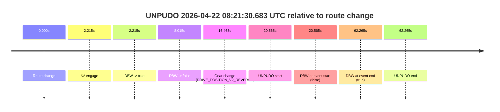

| Metric | Value |
|---|---|
| Outcome | `fail` |
| Effective failure type | `not_av_owned` |
| Route change status | `found` |
| DBW at event start | `false` |
| DBW at event end | `true` |
| Predicted gear at AV start | `DRIVE_POSITION_V2_PARK` |
| Actual gear at AV start | `DRIVE_POSITION_V2_PARK` |
| Predicted gear at event start | `DRIVE_POSITION_V2_REVERSE` |
| Actual gear at event start | `DRIVE_POSITION_V2_REVERSE` |
| Planned indicator direction | `INDICATORS_STATE_V2_OFF` |
| Controller indicator direction | `INDICATORS_STATE_V2_OFF` |
| Actual indicator direction | `INDICATORS_STATE_V2_OFF` |
| Actual indicator at maneuver end | `INDICATORS_STATE_V2_OFF` |
| Driver accel help in AV | `false` |
| Driver accel help timestamp | `n/a` |
| Max accel pedal pct in AV | `0.0%` |
| Max brake pedal pct in AV | `8.0%` |
| Max speed mps in AV | `0.000` |
| Success timing baseline | `route change` |
| Route -> AV | `2.215s` |
| AV -> event start | `18.350s` |
| AV -> first motion | `n/a` |
| Success baseline -> event start | `20.565s` |
| Success baseline -> first motion | `n/a` |
| AV duration before disengagement | `5.800s` |
| Trajectory waypoint count | `37` |
| Driving-plan step count | `11` |

The scored portion starts from the AV-owned window, not from the pre-AV setup. Route-change search in the stopped pre-event segment was `found`, with the baseline therefore set to route change. At the event anchor the model predicts `DRIVE_POSITION_V2_REVERSE` and the actual gear is `DRIVE_POSITION_V2_REVERSE`. The effective model outcome is `fail` because `not_av_owned.`

### Resolution

| Field | Value |
|---|---|
| Final outcome | `fail` |
| Do we agree with this label? | `yes` |
| Source disengagement type | `none observed` |
| Resolved effective failure type | `not_av_owned` |
| Confidence | `high` |

## unpudo 2026-04-22 08:31:26.783 UTC

| Field | Value |
|---|---|
| Model | `eel-teal-outspoken` |
| Author | `zak` |
| Run ID | `fme20032/2026-04-22--06-46-49--gen2-av-dfb7ae12-4c7d-40e2-ad4b-edb775cd0fbf` |
| Date | `2026-04-22` |
| Time (UTC) | `08:31:26.783` |
| Event type | `unpudo` |
| Disengagement type | `none observed` |
| Route change | `found` |
| Console | [run](https://console.sso.wayve.ai/run/fme20032/2026-04-22--06-46-49--gen2-av-dfb7ae12-4c7d-40e2-ad4b-edb775cd0fbf?id=&time-unixus=1776846686783321) |
| Foxglove | [segment](https://app.foxglove.dev/wayve-on-prem/p/prj_0dX18KZdVHg1fmmI/view?ds=foxglove-stream&ds.deviceName=fme20032&ds.start=2026-04-22T08%3A30%3A55.618274Z&ds.end=2026-04-22T08%3A33%3A24.956077Z&layoutId=lay_0e7VD4WIKDQGU73Y&time=2026-04-22T08%3A31%3A26.783321Z) |

### Event card: pass

- Pass: AV owns the credited unpudo from route change through the official unpudo window, the gear state is aligned at the anchor, and the vehicle moves without driver accelerator help in AV.

| Event | Time (UTC) | Delta from route change |
|---|---:|---:|
| Route change | 2026-04-22 08:31:05.618 | `0.000s` |
| AV engage | 2026-04-22 08:31:05.623 | `0.005s` |
| DBW -> true | 2026-04-22 08:31:05.623 | `0.005s` |
| Gear change (DRIVE_POSITION_V2_DRIVE) | 2026-04-22 08:31:05.933 | `0.315s` |
| UNPUDO start | 2026-04-22 08:31:26.783 | `21.165s` |
| DBW at event start (true) | 2026-04-22 08:31:26.783 | `21.165s` |
| First motion | 2026-04-22 08:31:26.805 | `21.187s` |
| DBW at event end (true) | 2026-04-22 08:31:30.183 | `24.565s` |
| UNPUDO end | 2026-04-22 08:31:30.183 | `24.565s` |
| DBW -> false | 2026-04-22 08:33:14.956 | `129.338s` |

| Metric | Value |
|---|---|
| Outcome | `pass` |
| Effective failure type | `none` |
| Route change status | `found` |
| DBW at event start | `true` |
| DBW at event end | `true` |
| Predicted gear at AV start | `DRIVE_POSITION_V2_PARK` |
| Actual gear at AV start | `DRIVE_POSITION_V2_PARK` |
| Predicted gear at event start | `DRIVE_POSITION_V2_DRIVE` |
| Actual gear at event start | `DRIVE_POSITION_V2_DRIVE` |
| Planned indicator direction | `INDICATORS_STATE_V2_RIGHT_ON` |
| Controller indicator direction | `INDICATORS_STATE_V2_RIGHT_ON` |
| Actual indicator direction | `INDICATORS_STATE_V2_OFF` |
| Actual indicator at maneuver end | `INDICATORS_STATE_V2_OFF` |
| Driver accel help in AV | `false` |
| Driver accel help timestamp | `n/a` |
| Max accel pedal pct in AV | `0.0%` |
| Max brake pedal pct in AV | `10.0%` |
| Max speed mps in AV | `5.003` |
| Success timing baseline | `route change` |
| Route -> AV | `0.005s` |
| AV -> event start | `21.160s` |
| AV -> first motion | `21.182s` |
| Success baseline -> event start | `21.165s` |
| Success baseline -> first motion | `21.187s` |
| AV duration before disengagement | `129.333s` |
| Trajectory waypoint count | `37` |
| Driving-plan step count | `11` |

The scored portion starts from the AV-owned window, not from the pre-AV setup. Route-change search in the stopped pre-event segment was `found`, with the baseline therefore set to route change. At the event anchor the model predicts `DRIVE_POSITION_V2_DRIVE` and the actual gear is `DRIVE_POSITION_V2_DRIVE`. The effective model outcome is `pass` because `the credited unpudo stays AV-owned through the official unpudo window.`

### Resolution

| Field | Value |
|---|---|
| Final outcome | `pass` |
| Do we agree with this label? | `yes` |
| Source disengagement type | `none observed` |
| Resolved effective failure type | `none` |
| Confidence | `high` |

## unpudo 2026-04-22 08:37:59.733 UTC

| Field | Value |
|---|---|
| Model | `eel-teal-outspoken` |
| Author | `zak` |
| Run ID | `fme20032/2026-04-22--06-46-49--gen2-av-dfb7ae12-4c7d-40e2-ad4b-edb775cd0fbf` |
| Date | `2026-04-22` |
| Time (UTC) | `08:37:59.733` |
| Event type | `unpudo` |
| Disengagement type | `none observed` |
| Route change | `found` |
| Console | [run](https://console.sso.wayve.ai/run/fme20032/2026-04-22--06-46-49--gen2-av-dfb7ae12-4c7d-40e2-ad4b-edb775cd0fbf?id=&time-unixus=1776847079733305) |
| Foxglove | [segment](https://app.foxglove.dev/wayve-on-prem/p/prj_0dX18KZdVHg1fmmI/view?ds=foxglove-stream&ds.deviceName=fme20032&ds.start=2026-04-22T08%3A36%3A32.468267Z&ds.end=2026-04-22T08%3A38%3A16.813482Z&layoutId=lay_0e7VD4WIKDQGU73Y&time=2026-04-22T08%3A37%3A59.733305Z) |

### Event card: fail

- Fail: AV owns part of the segment, but the event still resolves as a model-performance failure under the AV-only scoring rule.

| Event | Time (UTC) | Delta from route change |
|---|---:|---:|
| Route change | 2026-04-22 08:36:42.468 | `0.000s` |
| First motion | 2026-04-22 08:36:46.385 | `3.917s` |
| AV engage | 2026-04-22 08:37:55.653 | `73.185s` |
| DBW -> true | 2026-04-22 08:37:55.653 | `73.185s` |
| Gear change (DRIVE_POSITION_V2_DRIVE) | 2026-04-22 08:37:56.133 | `73.665s` |
| UNPUDO start | 2026-04-22 08:37:59.733 | `77.265s` |
| DBW at event start (true) | 2026-04-22 08:37:59.733 | `77.265s` |
| DBW at event end (true) | 2026-04-22 08:37:59.733 | `77.265s` |
| UNPUDO end | 2026-04-22 08:37:59.733 | `77.265s` |
| DBW -> false | 2026-04-22 08:38:06.813 | `84.345s` |

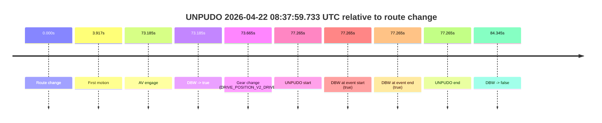

| Metric | Value |
|---|---|
| Outcome | `fail` |
| Effective failure type | `unknown_needs_review` |
| Route change status | `found` |
| DBW at event start | `true` |
| DBW at event end | `true` |
| Predicted gear at AV start | `DRIVE_POSITION_V2_DRIVE` |
| Actual gear at AV start | `DRIVE_POSITION_V2_PARK` |
| Predicted gear at event start | `DRIVE_POSITION_V2_DRIVE` |
| Actual gear at event start | `DRIVE_POSITION_V2_DRIVE` |
| Planned indicator direction | `INDICATORS_STATE_V2_RIGHT_ON` |
| Controller indicator direction | `INDICATORS_STATE_V2_RIGHT_ON` |
| Actual indicator direction | `INDICATORS_STATE_V2_OFF` |
| Actual indicator at maneuver end | `INDICATORS_STATE_V2_OFF` |
| Driver accel help in AV | `false` |
| Driver accel help timestamp | `n/a` |
| Max accel pedal pct in AV | `0.0%` |
| Max brake pedal pct in AV | `8.0%` |
| Max speed mps in AV | `0.000` |
| Success timing baseline | `route change` |
| Route -> AV | `73.185s` |
| AV -> event start | `4.080s` |
| AV -> first motion | `-69.268s` |
| Success baseline -> event start | `77.265s` |
| Success baseline -> first motion | `3.917s` |
| AV duration before disengagement | `11.160s` |
| Trajectory waypoint count | `38` |
| Driving-plan step count | `11` |

The scored portion starts from the AV-owned window, not from the pre-AV setup. Route-change search in the stopped pre-event segment was `found`, with the baseline therefore set to route change. At the event anchor the model predicts `DRIVE_POSITION_V2_DRIVE` and the actual gear is `DRIVE_POSITION_V2_DRIVE`. The effective model outcome is `fail` because `unknown_needs_review.`

### Resolution

| Field | Value |
|---|---|
| Final outcome | `fail` |
| Do we agree with this label? | `yes` |
| Source disengagement type | `none observed` |
| Resolved effective failure type | `unknown_needs_review` |
| Confidence | `high` |

## unpudo 2026-04-22 08:38:13.633 UTC

| Field | Value |
|---|---|
| Model | `eel-teal-outspoken` |
| Author | `zak` |
| Run ID | `fme20032/2026-04-22--06-46-49--gen2-av-dfb7ae12-4c7d-40e2-ad4b-edb775cd0fbf` |
| Date | `2026-04-22` |
| Time (UTC) | `08:38:13.633` |
| Event type | `unpudo` |
| Disengagement type | `none observed` |
| Route change | `found` |
| Console | [run](https://console.sso.wayve.ai/run/fme20032/2026-04-22--06-46-49--gen2-av-dfb7ae12-4c7d-40e2-ad4b-edb775cd0fbf?id=&time-unixus=1776847093633315) |
| Foxglove | [segment](https://app.foxglove.dev/wayve-on-prem/p/prj_0dX18KZdVHg1fmmI/view?ds=foxglove-stream&ds.deviceName=fme20032&ds.start=2026-04-22T08%3A36%3A32.468267Z&ds.end=2026-04-22T08%3A38%3A30.383324Z&layoutId=lay_0e7VD4WIKDQGU73Y&time=2026-04-22T08%3A38%3A13.633315Z) |

### Event card: fail

- Fail: the credited unpudo does not stay AV-owned. The event window starts with DBW false, and the maneuver outcome lands outside a clean AV-owned segment.

| Event | Time (UTC) | Delta from route change |
|---|---:|---:|
| Route change | 2026-04-22 08:36:42.468 | `0.000s` |
| First motion | 2026-04-22 08:36:46.385 | `3.917s` |
| AV engage | 2026-04-22 08:37:55.653 | `73.185s` |
| DBW -> true | 2026-04-22 08:37:55.653 | `73.185s` |
| DBW -> false | 2026-04-22 08:38:06.813 | `84.345s` |
| Gear change (DRIVE_POSITION_V2_DRIVE) | 2026-04-22 08:38:11.633 | `89.165s` |
| UNPUDO start | 2026-04-22 08:38:13.633 | `91.165s` |
| DBW at event start (false) | 2026-04-22 08:38:13.633 | `91.165s` |
| DBW at event end (false) | 2026-04-22 08:38:20.383 | `97.915s` |
| UNPUDO end | 2026-04-22 08:38:20.383 | `97.915s` |

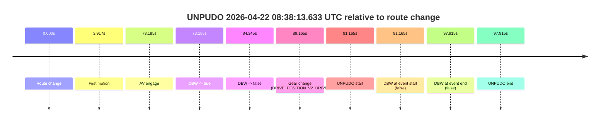

| Metric | Value |
|---|---|
| Outcome | `fail` |
| Effective failure type | `completed_outside_av` |
| Route change status | `found` |
| DBW at event start | `false` |
| DBW at event end | `false` |
| Predicted gear at AV start | `DRIVE_POSITION_V2_DRIVE` |
| Actual gear at AV start | `DRIVE_POSITION_V2_PARK` |
| Predicted gear at event start | `DRIVE_POSITION_V2_DRIVE` |
| Actual gear at event start | `DRIVE_POSITION_V2_DRIVE` |
| Planned indicator direction | `INDICATORS_STATE_V2_OFF` |
| Controller indicator direction | `INDICATORS_STATE_V2_OFF` |
| Actual indicator direction | `INDICATORS_STATE_V2_OFF` |
| Actual indicator at maneuver end | `INDICATORS_STATE_V2_OFF` |
| Driver accel help in AV | `false` |
| Driver accel help timestamp | `n/a` |
| Max accel pedal pct in AV | `0.0%` |
| Max brake pedal pct in AV | `8.0%` |
| Max speed mps in AV | `1.961` |
| Success timing baseline | `route change` |
| Route -> AV | `73.185s` |
| AV -> event start | `17.980s` |
| AV -> first motion | `-69.268s` |
| Success baseline -> event start | `91.165s` |
| Success baseline -> first motion | `3.917s` |
| AV duration before disengagement | `11.160s` |
| Trajectory waypoint count | `38` |
| Driving-plan step count | `11` |

The scored portion starts from the AV-owned window, not from the pre-AV setup. Route-change search in the stopped pre-event segment was `found`, with the baseline therefore set to route change. At the event anchor the model predicts `DRIVE_POSITION_V2_DRIVE` and the actual gear is `DRIVE_POSITION_V2_DRIVE`. The effective model outcome is `fail` because `completed_outside_av.`

### Resolution

| Field | Value |
|---|---|
| Final outcome | `fail` |
| Do we agree with this label? | `yes` |
| Source disengagement type | `none observed` |
| Resolved effective failure type | `completed_outside_av` |
| Confidence | `high` |

## unpudo 2026-04-22 08:42:37.983 UTC

| Field | Value |
|---|---|
| Model | `eel-teal-outspoken` |
| Author | `zak` |
| Run ID | `fme20032/2026-04-22--06-46-49--gen2-av-dfb7ae12-4c7d-40e2-ad4b-edb775cd0fbf` |
| Date | `2026-04-22` |
| Time (UTC) | `08:42:37.983` |
| Event type | `unpudo` |
| Disengagement type | `none observed` |
| Route change | `found` |
| Console | [run](https://console.sso.wayve.ai/run/fme20032/2026-04-22--06-46-49--gen2-av-dfb7ae12-4c7d-40e2-ad4b-edb775cd0fbf?id=&time-unixus=1776847357983314) |
| Foxglove | [segment](https://app.foxglove.dev/wayve-on-prem/p/prj_0dX18KZdVHg1fmmI/view?ds=foxglove-stream&ds.deviceName=fme20032&ds.start=2026-04-22T08%3A41%3A59.168276Z&ds.end=2026-04-22T08%3A43%3A00.533529Z&layoutId=lay_0e7VD4WIKDQGU73Y&time=2026-04-22T08%3A42%3A37.983314Z) |

### Event card: pass

- Pass: AV owns the credited unpudo from route change through the official unpudo window, the gear state is aligned at the anchor, and the vehicle moves without driver accelerator help in AV.

| Event | Time (UTC) | Delta from route change |
|---|---:|---:|
| Route change | 2026-04-22 08:42:09.168 | `0.000s` |
| AV engage | 2026-04-22 08:42:29.213 | `20.045s` |
| DBW -> true | 2026-04-22 08:42:29.213 | `20.045s` |
| Gear change (DRIVE_POSITION_V2_DRIVE) | 2026-04-22 08:42:29.633 | `20.465s` |
| UNPUDO start | 2026-04-22 08:42:37.983 | `28.815s` |
| DBW at event start (true) | 2026-04-22 08:42:37.983 | `28.815s` |
| First motion | 2026-04-22 08:42:38.005 | `28.837s` |
| DBW at event end (true) | 2026-04-22 08:42:41.633 | `32.465s` |
| UNPUDO end | 2026-04-22 08:42:41.633 | `32.465s` |
| DBW -> false | 2026-04-22 08:42:50.533 | `41.365s` |

| Metric | Value |
|---|---|
| Outcome | `pass` |
| Effective failure type | `none` |
| Route change status | `found` |
| DBW at event start | `true` |
| DBW at event end | `true` |
| Predicted gear at AV start | `DRIVE_POSITION_V2_DRIVE` |
| Actual gear at AV start | `DRIVE_POSITION_V2_PARK` |
| Predicted gear at event start | `DRIVE_POSITION_V2_DRIVE` |
| Actual gear at event start | `DRIVE_POSITION_V2_DRIVE` |
| Planned indicator direction | `INDICATORS_STATE_V2_RIGHT_ON` |
| Controller indicator direction | `INDICATORS_STATE_V2_RIGHT_ON` |
| Actual indicator direction | `INDICATORS_STATE_V2_OFF` |
| Actual indicator at maneuver end | `INDICATORS_STATE_V2_OFF` |
| Driver accel help in AV | `false` |
| Driver accel help timestamp | `n/a` |
| Max accel pedal pct in AV | `0.0%` |
| Max brake pedal pct in AV | `8.0%` |
| Max speed mps in AV | `4.656` |
| Success timing baseline | `route change` |
| Route -> AV | `20.045s` |
| AV -> event start | `8.770s` |
| AV -> first motion | `8.792s` |
| Success baseline -> event start | `28.815s` |
| Success baseline -> first motion | `28.837s` |
| AV duration before disengagement | `21.320s` |
| Trajectory waypoint count | `37` |
| Driving-plan step count | `11` |

The scored portion starts from the AV-owned window, not from the pre-AV setup. Route-change search in the stopped pre-event segment was `found`, with the baseline therefore set to route change. At the event anchor the model predicts `DRIVE_POSITION_V2_DRIVE` and the actual gear is `DRIVE_POSITION_V2_DRIVE`. The effective model outcome is `pass` because `the credited unpudo stays AV-owned through the official unpudo window.`

### Resolution

| Field | Value |
|---|---|
| Final outcome | `pass` |
| Do we agree with this label? | `yes` |
| Source disengagement type | `none observed` |
| Resolved effective failure type | `none` |
| Confidence | `high` |

## unpudo 2026-04-22 08:46:45.233 UTC

| Field | Value |
|---|---|
| Model | `eel-teal-outspoken` |
| Author | `zak` |
| Run ID | `fme20032/2026-04-22--06-46-49--gen2-av-dfb7ae12-4c7d-40e2-ad4b-edb775cd0fbf` |
| Date | `2026-04-22` |
| Time (UTC) | `08:46:45.233` |
| Event type | `unpudo` |
| Disengagement type | `none observed` |
| Route change | `found` |
| Console | [run](https://console.sso.wayve.ai/run/fme20032/2026-04-22--06-46-49--gen2-av-dfb7ae12-4c7d-40e2-ad4b-edb775cd0fbf?id=&time-unixus=1776847605233312) |
| Foxglove | [segment](https://app.foxglove.dev/wayve-on-prem/p/prj_0dX18KZdVHg1fmmI/view?ds=foxglove-stream&ds.deviceName=fme20032&ds.start=2026-04-22T08%3A46%3A24.318253Z&ds.end=2026-04-22T08%3A47%3A52.432819Z&layoutId=lay_0e7VD4WIKDQGU73Y&time=2026-04-22T08%3A46%3A45.233312Z) |

### Event card: pass

- Pass: AV owns the credited unpudo from route change through the official unpudo window, the gear state is aligned at the anchor, and the vehicle moves without driver accelerator help in AV.

| Event | Time (UTC) | Delta from route change |
|---|---:|---:|
| Route change | 2026-04-22 08:46:34.318 | `0.000s` |
| AV engage | 2026-04-22 08:46:41.213 | `6.895s` |
| DBW -> true | 2026-04-22 08:46:41.213 | `6.895s` |
| Gear change (DRIVE_POSITION_V2_DRIVE) | 2026-04-22 08:46:41.683 | `7.365s` |
| UNPUDO start | 2026-04-22 08:46:45.233 | `10.915s` |
| DBW at event start (true) | 2026-04-22 08:46:45.233 | `10.915s` |
| First motion | 2026-04-22 08:46:45.286 | `10.968s` |
| DBW at event end (true) | 2026-04-22 08:46:48.533 | `14.215s` |
| UNPUDO end | 2026-04-22 08:46:48.533 | `14.215s` |
| DBW -> false | 2026-04-22 08:47:42.432 | `68.115s` |
| Actual indicator -> right on | 2026-04-22 08:47:42.765 | `68.448s` |
| Actual indicator -> off | 2026-04-22 08:47:45.905 | `71.588s` |
| Actual indicator -> right on | 2026-04-22 08:47:49.405 | `75.087s` |

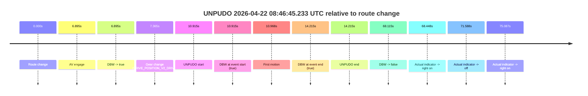

| Metric | Value |
|---|---|
| Outcome | `pass` |
| Effective failure type | `none` |
| Route change status | `found` |
| DBW at event start | `true` |
| DBW at event end | `true` |
| Predicted gear at AV start | `DRIVE_POSITION_V2_DRIVE` |
| Actual gear at AV start | `DRIVE_POSITION_V2_PARK` |
| Predicted gear at event start | `DRIVE_POSITION_V2_DRIVE` |
| Actual gear at event start | `DRIVE_POSITION_V2_DRIVE` |
| Planned indicator direction | `INDICATORS_STATE_V2_RIGHT_ON` |
| Controller indicator direction | `INDICATORS_STATE_V2_RIGHT_ON` |
| Actual indicator direction | `INDICATORS_STATE_V2_OFF` |
| Actual indicator at maneuver end | `INDICATORS_STATE_V2_OFF` |
| Driver accel help in AV | `false` |
| Driver accel help timestamp | `n/a` |
| Max accel pedal pct in AV | `0.0%` |
| Max brake pedal pct in AV | `10.6%` |
| Max speed mps in AV | `5.503` |
| Success timing baseline | `route change` |
| Route -> AV | `6.895s` |
| AV -> event start | `4.020s` |
| AV -> first motion | `4.073s` |
| Success baseline -> event start | `10.915s` |
| Success baseline -> first motion | `10.968s` |
| AV duration before disengagement | `61.219s` |
| Trajectory waypoint count | `38` |
| Driving-plan step count | `11` |

The scored portion starts from the AV-owned window, not from the pre-AV setup. Route-change search in the stopped pre-event segment was `found`, with the baseline therefore set to route change. At the event anchor the model predicts `DRIVE_POSITION_V2_DRIVE` and the actual gear is `DRIVE_POSITION_V2_DRIVE`. The effective model outcome is `pass` because `the credited unpudo stays AV-owned through the official unpudo window.`

### Resolution

| Field | Value |
|---|---|
| Final outcome | `pass` |
| Do we agree with this label? | `yes` |
| Source disengagement type | `none observed` |
| Resolved effective failure type | `none` |
| Confidence | `high` |
