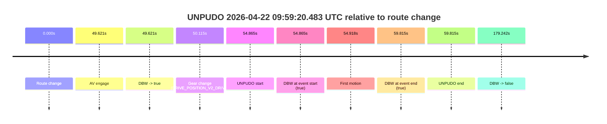
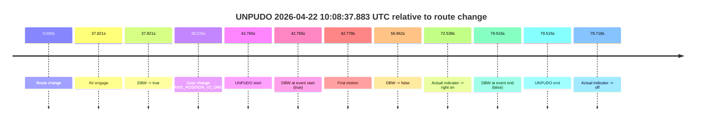
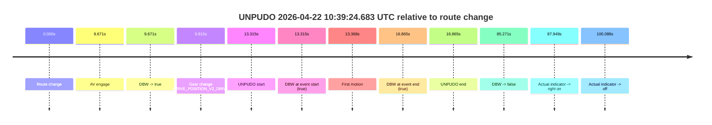
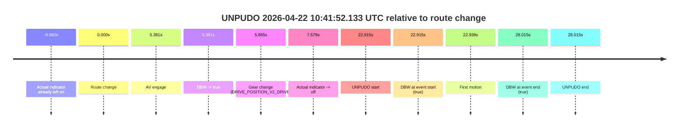

# Run Report: fme20032/2026-04-22--09-40-31--gen2-av-fcd841b5-277a-4b0a-82da-607e34daf223

| Field | Value |
|---|---|
| Run ID | `fme20032/2026-04-22--09-40-31--gen2-av-fcd841b5-277a-4b0a-82da-607e34daf223` |
| Date | `2026-04-22` |
| Model(s) | `eel-teal-outspoken` |
| Author | `zak` |
| Event count | `7` |

## unpudo 2026-04-22 09:46:55.633 UTC

| Field | Value |
|---|---|
| Model | `eel-teal-outspoken` |
| Author | `zak` |
| Run ID | `fme20032/2026-04-22--09-40-31--gen2-av-fcd841b5-277a-4b0a-82da-607e34daf223` |
| Date | `2026-04-22` |
| Time (UTC) | `09:46:55.633` |
| Event type | `unpudo` |
| Disengagement type | `none observed` |
| Route change | `found` |
| Console | [run](https://console.sso.wayve.ai/run/fme20032/2026-04-22--09-40-31--gen2-av-fcd841b5-277a-4b0a-82da-607e34daf223?id=&time-unixus=1776851215633306) |
| Foxglove | [segment](https://app.foxglove.dev/wayve-on-prem/p/prj_0dX18KZdVHg1fmmI/view?ds=foxglove-stream&ds.deviceName=fme20032&ds.start=2026-04-22T09%3A46%3A32.818303Z&ds.end=2026-04-22T09%3A49%3A51.419049Z&layoutId=lay_0e7VD4WIKDQGU73Y&time=2026-04-22T09%3A46%3A55.633306Z) |

### Event card: pass

- Pass: AV owns the credited unpudo from route change through the official unpudo window, the gear state is aligned at the anchor, and the vehicle moves without driver accelerator help in AV.

| Event | Time (UTC) | Delta from route change |
|---|---:|---:|
| Route change | 2026-04-22 09:46:42.818 | `0.000s` |
| AV engage | 2026-04-22 09:46:51.519 | `8.701s` |
| DBW -> true | 2026-04-22 09:46:51.519 | `8.701s` |
| Gear change (DRIVE_POSITION_V2_DRIVE) | 2026-04-22 09:46:52.033 | `9.215s` |
| UNPUDO start | 2026-04-22 09:46:55.633 | `12.815s` |
| DBW at event start (true) | 2026-04-22 09:46:55.633 | `12.815s` |
| First motion | 2026-04-22 09:46:55.676 | `12.859s` |
| DBW at event end (true) | 2026-04-22 09:46:59.883 | `17.065s` |
| UNPUDO end | 2026-04-22 09:46:59.883 | `17.065s` |
| DBW -> false | 2026-04-22 09:49:41.419 | `178.601s` |

| Metric | Value |
|---|---|
| Outcome | `pass` |
| Effective failure type | `none` |
| Route change status | `found` |
| DBW at event start | `true` |
| DBW at event end | `true` |
| Predicted gear at AV start | `DRIVE_POSITION_V2_DRIVE` |
| Actual gear at AV start | `DRIVE_POSITION_V2_PARK` |
| Predicted gear at event start | `DRIVE_POSITION_V2_DRIVE` |
| Actual gear at event start | `DRIVE_POSITION_V2_DRIVE` |
| Planned indicator direction | `INDICATORS_STATE_V2_RIGHT_ON` |
| Controller indicator direction | `INDICATORS_STATE_V2_RIGHT_ON` |
| Actual indicator direction | `INDICATORS_STATE_V2_OFF` |
| Actual indicator at maneuver end | `INDICATORS_STATE_V2_OFF` |
| Driver accel help in AV | `false` |
| Driver accel help timestamp | `n/a` |
| Max accel pedal pct in AV | `0.0%` |
| Max brake pedal pct in AV | `11.5%` |
| Max speed mps in AV | `3.850` |
| Success timing baseline | `route change` |
| Route -> AV | `8.701s` |
| AV -> event start | `4.114s` |
| AV -> first motion | `4.158s` |
| Success baseline -> event start | `12.815s` |
| Success baseline -> first motion | `12.859s` |
| AV duration before disengagement | `169.900s` |
| Trajectory waypoint count | `36` |
| Driving-plan step count | `11` |

The scored portion starts from the AV-owned window, not from the pre-AV setup. Route-change search in the stopped pre-event segment was `found`, with the baseline therefore set to route change. At the event anchor the model predicts `DRIVE_POSITION_V2_DRIVE` and the actual gear is `DRIVE_POSITION_V2_DRIVE`. The effective model outcome is `pass` because `the credited unpudo stays AV-owned through the official unpudo window.`

### Resolution

| Field | Value |
|---|---|
| Final outcome | `pass` |
| Do we agree with this label? | `yes` |
| Source disengagement type | `none observed` |
| Resolved effective failure type | `none` |
| Confidence | `high` |

## unpudo 2026-04-22 09:59:20.483 UTC

| Field | Value |
|---|---|
| Model | `eel-teal-outspoken` |
| Author | `zak` |
| Run ID | `fme20032/2026-04-22--09-40-31--gen2-av-fcd841b5-277a-4b0a-82da-607e34daf223` |
| Date | `2026-04-22` |
| Time (UTC) | `09:59:20.483` |
| Event type | `unpudo` |
| Disengagement type | `none observed` |
| Route change | `found` |
| Console | [run](https://console.sso.wayve.ai/run/fme20032/2026-04-22--09-40-31--gen2-av-fcd841b5-277a-4b0a-82da-607e34daf223?id=&time-unixus=1776851960483298) |
| Foxglove | [segment](https://app.foxglove.dev/wayve-on-prem/p/prj_0dX18KZdVHg1fmmI/view?ds=foxglove-stream&ds.deviceName=fme20032&ds.start=2026-04-22T09%3A58%3A15.618271Z&ds.end=2026-04-22T10%3A01%3A34.860460Z&layoutId=lay_0e7VD4WIKDQGU73Y&time=2026-04-22T09%3A59%3A20.483298Z) |

### Event card: pass

- Pass: AV owns the credited unpudo from route change through the official unpudo window, the gear state is aligned at the anchor, and the vehicle moves without driver accelerator help in AV.

| Event | Time (UTC) | Delta from route change |
|---|---:|---:|
| Route change | 2026-04-22 09:58:25.618 | `0.000s` |
| AV engage | 2026-04-22 09:59:15.239 | `49.621s` |
| DBW -> true | 2026-04-22 09:59:15.239 | `49.621s` |
| Gear change (DRIVE_POSITION_V2_DRIVE) | 2026-04-22 09:59:15.733 | `50.115s` |
| UNPUDO start | 2026-04-22 09:59:20.483 | `54.865s` |
| DBW at event start (true) | 2026-04-22 09:59:20.483 | `54.865s` |
| First motion | 2026-04-22 09:59:20.536 | `54.918s` |
| DBW at event end (true) | 2026-04-22 09:59:25.433 | `59.815s` |
| UNPUDO end | 2026-04-22 09:59:25.433 | `59.815s` |
| DBW -> false | 2026-04-22 10:01:24.860 | `179.242s` |

| Metric | Value |
|---|---|
| Outcome | `pass` |
| Effective failure type | `none` |
| Route change status | `found` |
| DBW at event start | `true` |
| DBW at event end | `true` |
| Predicted gear at AV start | `DRIVE_POSITION_V2_DRIVE` |
| Actual gear at AV start | `DRIVE_POSITION_V2_PARK` |
| Predicted gear at event start | `DRIVE_POSITION_V2_DRIVE` |
| Actual gear at event start | `DRIVE_POSITION_V2_DRIVE` |
| Planned indicator direction | `INDICATORS_STATE_V2_RIGHT_ON` |
| Controller indicator direction | `INDICATORS_STATE_V2_RIGHT_ON` |
| Actual indicator direction | `INDICATORS_STATE_V2_OFF` |
| Actual indicator at maneuver end | `INDICATORS_STATE_V2_OFF` |
| Driver accel help in AV | `false` |
| Driver accel help timestamp | `n/a` |
| Max accel pedal pct in AV | `0.0%` |
| Max brake pedal pct in AV | `8.0%` |
| Max speed mps in AV | `2.847` |
| Success timing baseline | `route change` |
| Route -> AV | `49.621s` |
| AV -> event start | `5.244s` |
| AV -> first motion | `5.297s` |
| Success baseline -> event start | `54.865s` |
| Success baseline -> first motion | `54.918s` |
| AV duration before disengagement | `129.621s` |
| Trajectory waypoint count | `37` |
| Driving-plan step count | `11` |

The scored portion starts from the AV-owned window, not from the pre-AV setup. Route-change search in the stopped pre-event segment was `found`, with the baseline therefore set to route change. At the event anchor the model predicts `DRIVE_POSITION_V2_DRIVE` and the actual gear is `DRIVE_POSITION_V2_DRIVE`. The effective model outcome is `pass` because `the credited unpudo stays AV-owned through the official unpudo window.`

### Resolution

| Field | Value |
|---|---|
| Final outcome | `pass` |
| Do we agree with this label? | `yes` |
| Source disengagement type | `none observed` |
| Resolved effective failure type | `none` |
| Confidence | `high` |

## unpudo 2026-04-22 10:08:37.883 UTC

| Field | Value |
|---|---|
| Model | `eel-teal-outspoken` |
| Author | `zak` |
| Run ID | `fme20032/2026-04-22--09-40-31--gen2-av-fcd841b5-277a-4b0a-82da-607e34daf223` |
| Date | `2026-04-22` |
| Time (UTC) | `10:08:37.883` |
| Event type | `unpudo` |
| Disengagement type | `none observed` |
| Route change | `found` |
| Console | [run](https://console.sso.wayve.ai/run/fme20032/2026-04-22--09-40-31--gen2-av-fcd841b5-277a-4b0a-82da-607e34daf223?id=&time-unixus=1776852517883312) |
| Foxglove | [segment](https://app.foxglove.dev/wayve-on-prem/p/prj_0dX18KZdVHg1fmmI/view?ds=foxglove-stream&ds.deviceName=fme20032&ds.start=2026-04-22T10%3A07%3A45.118404Z&ds.end=2026-04-22T10%3A09%3A24.633313Z&layoutId=lay_0e7VD4WIKDQGU73Y&time=2026-04-22T10%3A08%3A37.883312Z) |

### Event card: fail

- Fail: the credited unpudo does not stay AV-owned. The event window starts with DBW true, and the maneuver outcome lands outside a clean AV-owned segment.

| Event | Time (UTC) | Delta from route change |
|---|---:|---:|
| Route change | 2026-04-22 10:07:55.118 | `0.000s` |
| AV engage | 2026-04-22 10:08:32.939 | `37.821s` |
| DBW -> true | 2026-04-22 10:08:32.939 | `37.821s` |
| Gear change (DRIVE_POSITION_V2_DRIVE) | 2026-04-22 10:08:33.333 | `38.215s` |
| UNPUDO start | 2026-04-22 10:08:37.883 | `42.765s` |
| DBW at event start (true) | 2026-04-22 10:08:37.883 | `42.765s` |
| First motion | 2026-04-22 10:08:37.896 | `42.778s` |
| DBW -> false | 2026-04-22 10:08:52.080 | `56.962s` |
| Actual indicator -> right on | 2026-04-22 10:09:07.656 | `72.538s` |
| DBW at event end (false) | 2026-04-22 10:09:14.633 | `79.515s` |
| UNPUDO end | 2026-04-22 10:09:14.633 | `79.515s` |
| Actual indicator -> off | 2026-04-22 10:09:14.836 | `79.718s` |

| Metric | Value |
|---|---|
| Outcome | `fail` |
| Effective failure type | `driver_completed_maneuver` |
| Route change status | `found` |
| DBW at event start | `true` |
| DBW at event end | `false` |
| Predicted gear at AV start | `DRIVE_POSITION_V2_DRIVE` |
| Actual gear at AV start | `DRIVE_POSITION_V2_PARK` |
| Predicted gear at event start | `DRIVE_POSITION_V2_DRIVE` |
| Actual gear at event start | `DRIVE_POSITION_V2_DRIVE` |
| Planned indicator direction | `INDICATORS_STATE_V2_OFF` |
| Controller indicator direction | `INDICATORS_STATE_V2_OFF` |
| Actual indicator direction | `INDICATORS_STATE_V2_OFF` |
| Actual indicator at maneuver end | `INDICATORS_STATE_V2_RIGHT_ON` |
| Driver accel help in AV | `false` |
| Driver accel help timestamp | `n/a` |
| Max accel pedal pct in AV | `0.0%` |
| Max brake pedal pct in AV | `46.9%` |
| Max speed mps in AV | `1.822` |
| Success timing baseline | `route change` |
| Route -> AV | `37.821s` |
| AV -> event start | `4.944s` |
| AV -> first motion | `4.957s` |
| Success baseline -> event start | `42.765s` |
| Success baseline -> first motion | `42.778s` |
| AV duration before disengagement | `19.142s` |
| Trajectory waypoint count | `37` |
| Driving-plan step count | `11` |

The scored portion starts from the AV-owned window, not from the pre-AV setup. Route-change search in the stopped pre-event segment was `found`, with the baseline therefore set to route change. At the event anchor the model predicts `DRIVE_POSITION_V2_DRIVE` and the actual gear is `DRIVE_POSITION_V2_DRIVE`. The effective model outcome is `fail` because `driver_completed_maneuver.`

### Resolution

| Field | Value |
|---|---|
| Final outcome | `fail` |
| Do we agree with this label? | `yes` |
| Source disengagement type | `none observed` |
| Resolved effective failure type | `driver_completed_maneuver` |
| Confidence | `high` |

## unpudo 2026-04-22 10:15:09.683 UTC

| Field | Value |
|---|---|
| Model | `eel-teal-outspoken` |
| Author | `zak` |
| Run ID | `fme20032/2026-04-22--09-40-31--gen2-av-fcd841b5-277a-4b0a-82da-607e34daf223` |
| Date | `2026-04-22` |
| Time (UTC) | `10:15:09.683` |
| Event type | `unpudo` |
| Disengagement type | `none observed` |
| Route change | `found` |
| Console | [run](https://console.sso.wayve.ai/run/fme20032/2026-04-22--09-40-31--gen2-av-fcd841b5-277a-4b0a-82da-607e34daf223?id=&time-unixus=1776852909683298) |
| Foxglove | [segment](https://app.foxglove.dev/wayve-on-prem/p/prj_0dX18KZdVHg1fmmI/view?ds=foxglove-stream&ds.deviceName=fme20032&ds.start=2026-04-22T10%3A14%3A25.018328Z&ds.end=2026-04-22T10%3A16%3A18.683311Z&layoutId=lay_0e7VD4WIKDQGU73Y&time=2026-04-22T10%3A15%3A09.683298Z) |

### Event card: fail

- Fail: the credited unpudo does not stay AV-owned. The event window starts with DBW true, and the maneuver outcome lands outside a clean AV-owned segment.

| Event | Time (UTC) | Delta from route change |
|---|---:|---:|
| Route change | 2026-04-22 10:14:35.018 | `0.000s` |
| AV engage | 2026-04-22 10:14:56.239 | `21.221s` |
| DBW -> true | 2026-04-22 10:14:56.239 | `21.221s` |
| Gear change (DRIVE_POSITION_V2_DRIVE) | 2026-04-22 10:14:56.733 | `21.715s` |
| UNPUDO start | 2026-04-22 10:15:09.683 | `34.665s` |
| DBW at event start (true) | 2026-04-22 10:15:09.683 | `34.665s` |
| First motion | 2026-04-22 10:15:09.716 | `34.698s` |
| DBW -> false | 2026-04-22 10:15:35.299 | `60.281s` |
| DBW at event end (true) | 2026-04-22 10:16:08.683 | `93.665s` |
| UNPUDO end | 2026-04-22 10:16:08.683 | `93.665s` |

| Metric | Value |
|---|---|
| Outcome | `fail` |
| Effective failure type | `driver_completed_maneuver` |
| Route change status | `found` |
| DBW at event start | `true` |
| DBW at event end | `true` |
| Predicted gear at AV start | `DRIVE_POSITION_V2_DRIVE` |
| Actual gear at AV start | `DRIVE_POSITION_V2_PARK` |
| Predicted gear at event start | `DRIVE_POSITION_V2_DRIVE` |
| Actual gear at event start | `DRIVE_POSITION_V2_DRIVE` |
| Planned indicator direction | `INDICATORS_STATE_V2_RIGHT_ON` |
| Controller indicator direction | `INDICATORS_STATE_V2_RIGHT_ON` |
| Actual indicator direction | `INDICATORS_STATE_V2_OFF` |
| Actual indicator at maneuver end | `INDICATORS_STATE_V2_OFF` |
| Driver accel help in AV | `false` |
| Driver accel help timestamp | `n/a` |
| Max accel pedal pct in AV | `0.0%` |
| Max brake pedal pct in AV | `12.7%` |
| Max speed mps in AV | `1.706` |
| Success timing baseline | `route change` |
| Route -> AV | `21.221s` |
| AV -> event start | `13.444s` |
| AV -> first motion | `13.477s` |
| Success baseline -> event start | `34.665s` |
| Success baseline -> first motion | `34.698s` |
| AV duration before disengagement | `39.060s` |
| Trajectory waypoint count | `37` |
| Driving-plan step count | `11` |

The scored portion starts from the AV-owned window, not from the pre-AV setup. Route-change search in the stopped pre-event segment was `found`, with the baseline therefore set to route change. At the event anchor the model predicts `DRIVE_POSITION_V2_DRIVE` and the actual gear is `DRIVE_POSITION_V2_DRIVE`. The effective model outcome is `fail` because `driver_completed_maneuver.`

### Resolution

| Field | Value |
|---|---|
| Final outcome | `fail` |
| Do we agree with this label? | `yes` |
| Source disengagement type | `none observed` |
| Resolved effective failure type | `driver_completed_maneuver` |
| Confidence | `high` |

## unpudo 2026-04-22 10:18:24.433 UTC

| Field | Value |
|---|---|
| Model | `eel-teal-outspoken` |
| Author | `zak` |
| Run ID | `fme20032/2026-04-22--09-40-31--gen2-av-fcd841b5-277a-4b0a-82da-607e34daf223` |
| Date | `2026-04-22` |
| Time (UTC) | `10:18:24.433` |
| Event type | `unpudo` |
| Disengagement type | `none observed` |
| Route change | `found` |
| Console | [run](https://console.sso.wayve.ai/run/fme20032/2026-04-22--09-40-31--gen2-av-fcd841b5-277a-4b0a-82da-607e34daf223?id=&time-unixus=1776853104433307) |
| Foxglove | [segment](https://app.foxglove.dev/wayve-on-prem/p/prj_0dX18KZdVHg1fmmI/view?ds=foxglove-stream&ds.deviceName=fme20032&ds.start=2026-04-22T10%3A17%3A50.468256Z&ds.end=2026-04-22T10%3A19%3A58.079105Z&layoutId=lay_0e7VD4WIKDQGU73Y&time=2026-04-22T10%3A18%3A24.433307Z) |

### Event card: pass

- Pass: AV owns the credited unpudo from route change through the official unpudo window, the gear state is aligned at the anchor, and the vehicle moves without driver accelerator help in AV.

| Event | Time (UTC) | Delta from route change |
|---|---:|---:|
| Route change | 2026-04-22 10:18:00.468 | `0.000s` |
| AV engage | 2026-04-22 10:18:08.979 | `8.511s` |
| DBW -> true | 2026-04-22 10:18:08.979 | `8.511s` |
| Gear change (DRIVE_POSITION_V2_DRIVE) | 2026-04-22 10:18:09.433 | `8.965s` |
| UNPUDO start | 2026-04-22 10:18:24.433 | `23.965s` |
| DBW at event start (true) | 2026-04-22 10:18:24.433 | `23.965s` |
| First motion | 2026-04-22 10:18:24.476 | `24.008s` |
| DBW at event end (true) | 2026-04-22 10:18:28.633 | `28.165s` |
| UNPUDO end | 2026-04-22 10:18:28.633 | `28.165s` |
| DBW -> false | 2026-04-22 10:19:48.079 | `107.611s` |

| Metric | Value |
|---|---|
| Outcome | `pass` |
| Effective failure type | `none` |
| Route change status | `found` |
| DBW at event start | `true` |
| DBW at event end | `true` |
| Predicted gear at AV start | `DRIVE_POSITION_V2_DRIVE` |
| Actual gear at AV start | `DRIVE_POSITION_V2_PARK` |
| Predicted gear at event start | `DRIVE_POSITION_V2_DRIVE` |
| Actual gear at event start | `DRIVE_POSITION_V2_DRIVE` |
| Planned indicator direction | `INDICATORS_STATE_V2_RIGHT_ON` |
| Controller indicator direction | `INDICATORS_STATE_V2_RIGHT_ON` |
| Actual indicator direction | `INDICATORS_STATE_V2_OFF` |
| Actual indicator at maneuver end | `INDICATORS_STATE_V2_OFF` |
| Driver accel help in AV | `false` |
| Driver accel help timestamp | `n/a` |
| Max accel pedal pct in AV | `0.0%` |
| Max brake pedal pct in AV | `8.2%` |
| Max speed mps in AV | `4.822` |
| Success timing baseline | `route change` |
| Route -> AV | `8.511s` |
| AV -> event start | `15.454s` |
| AV -> first motion | `15.497s` |
| Success baseline -> event start | `23.965s` |
| Success baseline -> first motion | `24.008s` |
| AV duration before disengagement | `99.100s` |
| Trajectory waypoint count | `36` |
| Driving-plan step count | `11` |

The scored portion starts from the AV-owned window, not from the pre-AV setup. Route-change search in the stopped pre-event segment was `found`, with the baseline therefore set to route change. At the event anchor the model predicts `DRIVE_POSITION_V2_DRIVE` and the actual gear is `DRIVE_POSITION_V2_DRIVE`. The effective model outcome is `pass` because `the credited unpudo stays AV-owned through the official unpudo window.`

### Resolution

| Field | Value |
|---|---|
| Final outcome | `pass` |
| Do we agree with this label? | `yes` |
| Source disengagement type | `none observed` |
| Resolved effective failure type | `none` |
| Confidence | `high` |

## unpudo 2026-04-22 10:39:24.683 UTC

| Field | Value |
|---|---|
| Model | `eel-teal-outspoken` |
| Author | `zak` |
| Run ID | `fme20032/2026-04-22--09-40-31--gen2-av-fcd841b5-277a-4b0a-82da-607e34daf223` |
| Date | `2026-04-22` |
| Time (UTC) | `10:39:24.683` |
| Event type | `unpudo` |
| Disengagement type | `none observed` |
| Route change | `found` |
| Console | [run](https://console.sso.wayve.ai/run/fme20032/2026-04-22--09-40-31--gen2-av-fcd841b5-277a-4b0a-82da-607e34daf223?id=&time-unixus=1776854364683310) |
| Foxglove | [segment](https://app.foxglove.dev/wayve-on-prem/p/prj_0dX18KZdVHg1fmmI/view?ds=foxglove-stream&ds.deviceName=fme20032&ds.start=2026-04-22T10%3A39%3A01.368321Z&ds.end=2026-04-22T10%3A40%3A46.639047Z&layoutId=lay_0e7VD4WIKDQGU73Y&time=2026-04-22T10%3A39%3A24.683310Z) |

### Event card: pass

- Pass: AV owns the credited unpudo from route change through the official unpudo window, the gear state is aligned at the anchor, and the vehicle moves without driver accelerator help in AV.

| Event | Time (UTC) | Delta from route change |
|---|---:|---:|
| Route change | 2026-04-22 10:39:11.368 | `0.000s` |
| AV engage | 2026-04-22 10:39:21.039 | `9.671s` |
| DBW -> true | 2026-04-22 10:39:21.039 | `9.671s` |
| Gear change (DRIVE_POSITION_V2_DRIVE) | 2026-04-22 10:39:21.183 | `9.815s` |
| UNPUDO start | 2026-04-22 10:39:24.683 | `13.315s` |
| DBW at event start (true) | 2026-04-22 10:39:24.683 | `13.315s` |
| First motion | 2026-04-22 10:39:24.736 | `13.368s` |
| DBW at event end (true) | 2026-04-22 10:39:28.233 | `16.865s` |
| UNPUDO end | 2026-04-22 10:39:28.233 | `16.865s` |
| DBW -> false | 2026-04-22 10:40:36.639 | `85.271s` |
| Actual indicator -> right on | 2026-04-22 10:40:39.316 | `87.949s` |
| Actual indicator -> off | 2026-04-22 10:40:51.456 | `100.088s` |

| Metric | Value |
|---|---|
| Outcome | `pass` |
| Effective failure type | `none` |
| Route change status | `found` |
| DBW at event start | `true` |
| DBW at event end | `true` |
| Predicted gear at AV start | `DRIVE_POSITION_V2_DRIVE` |
| Actual gear at AV start | `DRIVE_POSITION_V2_PARK` |
| Predicted gear at event start | `DRIVE_POSITION_V2_DRIVE` |
| Actual gear at event start | `DRIVE_POSITION_V2_DRIVE` |
| Planned indicator direction | `INDICATORS_STATE_V2_RIGHT_ON` |
| Controller indicator direction | `INDICATORS_STATE_V2_RIGHT_ON` |
| Actual indicator direction | `INDICATORS_STATE_V2_OFF` |
| Actual indicator at maneuver end | `INDICATORS_STATE_V2_OFF` |
| Driver accel help in AV | `false` |
| Driver accel help timestamp | `n/a` |
| Max accel pedal pct in AV | `0.0%` |
| Max brake pedal pct in AV | `8.0%` |
| Max speed mps in AV | `4.686` |
| Success timing baseline | `route change` |
| Route -> AV | `9.671s` |
| AV -> event start | `3.644s` |
| AV -> first motion | `3.697s` |
| Success baseline -> event start | `13.315s` |
| Success baseline -> first motion | `13.368s` |
| AV duration before disengagement | `75.600s` |
| Trajectory waypoint count | `37` |
| Driving-plan step count | `11` |

The scored portion starts from the AV-owned window, not from the pre-AV setup. Route-change search in the stopped pre-event segment was `found`, with the baseline therefore set to route change. At the event anchor the model predicts `DRIVE_POSITION_V2_DRIVE` and the actual gear is `DRIVE_POSITION_V2_DRIVE`. The effective model outcome is `pass` because `the credited unpudo stays AV-owned through the official unpudo window.`

### Resolution

| Field | Value |
|---|---|
| Final outcome | `pass` |
| Do we agree with this label? | `yes` |
| Source disengagement type | `none observed` |
| Resolved effective failure type | `none` |
| Confidence | `high` |

## unpudo 2026-04-22 10:41:52.133 UTC

| Field | Value |
|---|---|
| Model | `eel-teal-outspoken` |
| Author | `zak` |
| Run ID | `fme20032/2026-04-22--09-40-31--gen2-av-fcd841b5-277a-4b0a-82da-607e34daf223` |
| Date | `2026-04-22` |
| Time (UTC) | `10:41:52.133` |
| Event type | `unpudo` |
| Disengagement type | `none observed` |
| Route change | `found` |
| Console | [run](https://console.sso.wayve.ai/run/fme20032/2026-04-22--09-40-31--gen2-av-fcd841b5-277a-4b0a-82da-607e34daf223?id=&time-unixus=1776854512133313) |
| Foxglove | [segment](https://app.foxglove.dev/wayve-on-prem/p/prj_0dX18KZdVHg1fmmI/view?ds=foxglove-stream&ds.deviceName=fme20032&ds.start=2026-04-22T10%3A41%3A19.218244Z&ds.end=2026-04-22T10%3A42%3A07.233302Z&layoutId=lay_0e7VD4WIKDQGU73Y&time=2026-04-22T10%3A41%3A52.133313Z) |

### Event card: pass

- Pass: AV owns the credited unpudo from route change through the official unpudo window, the gear state is aligned at the anchor, and the vehicle moves without driver accelerator help in AV.

| Event | Time (UTC) | Delta from route change |
|---|---:|---:|
| Actual indicator already left on | 2026-04-22 10:41:19.236 | `-9.982s` |
| Route change | 2026-04-22 10:41:29.218 | `0.000s` |
| AV engage | 2026-04-22 10:41:34.599 | `5.381s` |
| DBW -> true | 2026-04-22 10:41:34.599 | `5.381s` |
| Gear change (DRIVE_POSITION_V2_DRIVE) | 2026-04-22 10:41:35.083 | `5.865s` |
| Actual indicator -> off | 2026-04-22 10:41:36.796 | `7.579s` |
| UNPUDO start | 2026-04-22 10:41:52.133 | `22.915s` |
| DBW at event start (true) | 2026-04-22 10:41:52.133 | `22.915s` |
| First motion | 2026-04-22 10:41:52.156 | `22.938s` |
| DBW at event end (true) | 2026-04-22 10:41:57.233 | `28.015s` |
| UNPUDO end | 2026-04-22 10:41:57.233 | `28.015s` |

| Metric | Value |
|---|---|
| Outcome | `pass` |
| Effective failure type | `none` |
| Route change status | `found` |
| DBW at event start | `true` |
| DBW at event end | `true` |
| Predicted gear at AV start | `DRIVE_POSITION_V2_DRIVE` |
| Actual gear at AV start | `DRIVE_POSITION_V2_PARK` |
| Predicted gear at event start | `DRIVE_POSITION_V2_DRIVE` |
| Actual gear at event start | `DRIVE_POSITION_V2_DRIVE` |
| Planned indicator direction | `INDICATORS_STATE_V2_RIGHT_ON` |
| Controller indicator direction | `INDICATORS_STATE_V2_RIGHT_ON` |
| Actual indicator direction | `INDICATORS_STATE_V2_OFF` |
| Actual indicator at maneuver end | `INDICATORS_STATE_V2_OFF` |
| Driver accel help in AV | `false` |
| Driver accel help timestamp | `n/a` |
| Max accel pedal pct in AV | `0.0%` |
| Max brake pedal pct in AV | `10.0%` |
| Max speed mps in AV | `3.158` |
| Success timing baseline | `route change` |
| Route -> AV | `5.381s` |
| AV -> event start | `17.534s` |
| AV -> first motion | `17.557s` |
| Success baseline -> event start | `22.915s` |
| Success baseline -> first motion | `22.938s` |
| AV duration before disengagement | `n/a` |
| Trajectory waypoint count | `36` |
| Driving-plan step count | `11` |

The scored portion starts from the AV-owned window, not from the pre-AV setup. Route-change search in the stopped pre-event segment was `found`, with the baseline therefore set to route change. At the event anchor the model predicts `DRIVE_POSITION_V2_DRIVE` and the actual gear is `DRIVE_POSITION_V2_DRIVE`. The effective model outcome is `pass` because `the credited unpudo stays AV-owned through the official unpudo window.`

### Resolution

| Field | Value |
|---|---|
| Final outcome | `pass` |
| Do we agree with this label? | `yes` |
| Source disengagement type | `none observed` |
| Resolved effective failure type | `none` |
| Confidence | `high` |
