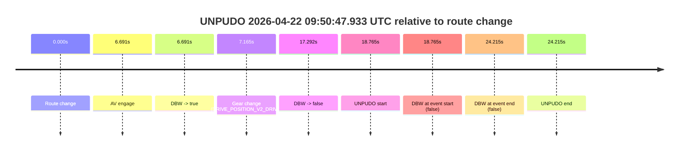
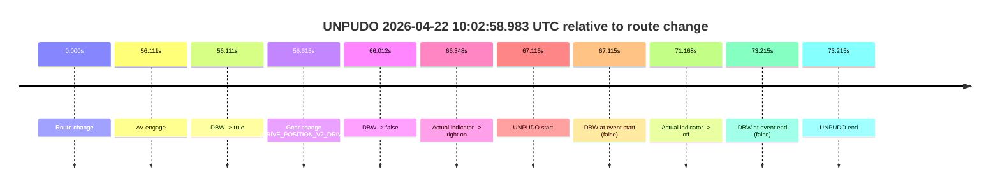
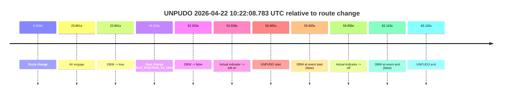
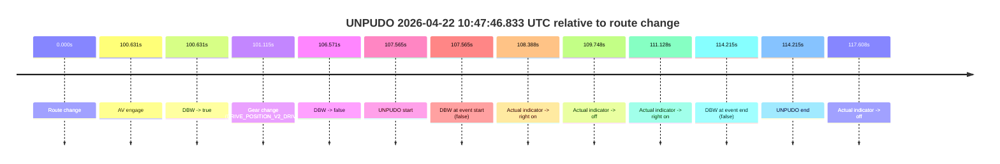

# Run Report: fme20032/2026-04-22--09-40-31--gen2-av-fcd841b5-277a-4b0a-82da-607e34daf223

| Field | Value |
|---|---|
| Run ID | `fme20032/2026-04-22--09-40-31--gen2-av-fcd841b5-277a-4b0a-82da-607e34daf223` |
| Date | `2026-04-22` |
| Model(s) | `pink-manta-ray-smooth` |
| Author | `guy.geva` |
| Event count | `6` |

## unpudo 2026-04-22 09:50:47.933 UTC

| Field | Value |
|---|---|
| Model | `pink-manta-ray-smooth` |
| Author | `guy.geva` |
| Run ID | `fme20032/2026-04-22--09-40-31--gen2-av-fcd841b5-277a-4b0a-82da-607e34daf223` |
| Date | `2026-04-22` |
| Time (UTC) | `09:50:47.933` |
| Event type | `unpudo` |
| Disengagement type | `none observed` |
| Route change | `found` |
| Console | [run](https://console.sso.wayve.ai/run/fme20032/2026-04-22--09-40-31--gen2-av-fcd841b5-277a-4b0a-82da-607e34daf223?id=&time-unixus=1776851447933321) |
| Foxglove | [segment](https://app.foxglove.dev/wayve-on-prem/p/prj_0dX18KZdVHg1fmmI/view?ds=foxglove-stream&ds.deviceName=fme20032&ds.start=2026-04-22T09%3A50%3A19.168278Z&ds.end=2026-04-22T09%3A51%3A03.383309Z&layoutId=lay_0e7VD4WIKDQGU73Y&time=2026-04-22T09%3A50%3A47.933321Z) |

### Event card: fail

- Fail: the credited unpudo does not stay AV-owned. The event window starts with DBW false, and the maneuver outcome lands outside a clean AV-owned segment.

| Event | Time (UTC) | Delta from route change |
|---|---:|---:|
| Route change | 2026-04-22 09:50:29.168 | `0.000s` |
| AV engage | 2026-04-22 09:50:35.859 | `6.691s` |
| DBW -> true | 2026-04-22 09:50:35.859 | `6.691s` |
| Gear change (DRIVE_POSITION_V2_DRIVE) | 2026-04-22 09:50:36.333 | `7.165s` |
| DBW -> false | 2026-04-22 09:50:46.459 | `17.292s` |
| UNPUDO start | 2026-04-22 09:50:47.933 | `18.765s` |
| DBW at event start (false) | 2026-04-22 09:50:47.933 | `18.765s` |
| DBW at event end (false) | 2026-04-22 09:50:53.383 | `24.215s` |
| UNPUDO end | 2026-04-22 09:50:53.383 | `24.215s` |

| Metric | Value |
|---|---|
| Outcome | `fail` |
| Effective failure type | `not_av_owned` |
| Route change status | `found` |
| DBW at event start | `false` |
| DBW at event end | `false` |
| Predicted gear at AV start | `DRIVE_POSITION_V2_DRIVE` |
| Actual gear at AV start | `DRIVE_POSITION_V2_PARK` |
| Predicted gear at event start | `DRIVE_POSITION_V2_DRIVE` |
| Actual gear at event start | `DRIVE_POSITION_V2_DRIVE` |
| Planned indicator direction | `INDICATORS_STATE_V2_RIGHT_ON` |
| Controller indicator direction | `INDICATORS_STATE_V2_RIGHT_ON` |
| Actual indicator direction | `INDICATORS_STATE_V2_OFF` |
| Actual indicator at maneuver end | `INDICATORS_STATE_V2_OFF` |
| Driver accel help in AV | `false` |
| Driver accel help timestamp | `n/a` |
| Max accel pedal pct in AV | `0.0%` |
| Max brake pedal pct in AV | `8.2%` |
| Max speed mps in AV | `0.000` |
| Success timing baseline | `route change` |
| Route -> AV | `6.691s` |
| AV -> event start | `12.074s` |
| AV -> first motion | `n/a` |
| Success baseline -> event start | `18.765s` |
| Success baseline -> first motion | `n/a` |
| AV duration before disengagement | `10.601s` |
| Trajectory waypoint count | `36` |
| Driving-plan step count | `11` |

The scored portion starts from the AV-owned window, not from the pre-AV setup. Route-change search in the stopped pre-event segment was `found`, with the baseline therefore set to route change. At the event anchor the model predicts `DRIVE_POSITION_V2_DRIVE` and the actual gear is `DRIVE_POSITION_V2_DRIVE`. The effective model outcome is `fail` because `not_av_owned.`

### Resolution

| Field | Value |
|---|---|
| Final outcome | `fail` |
| Do we agree with this label? | `yes` |
| Source disengagement type | `none observed` |
| Resolved effective failure type | `not_av_owned` |
| Confidence | `high` |

## unpudo 2026-04-22 09:55:54.133 UTC

| Field | Value |
|---|---|
| Model | `pink-manta-ray-smooth` |
| Author | `guy.geva` |
| Run ID | `fme20032/2026-04-22--09-40-31--gen2-av-fcd841b5-277a-4b0a-82da-607e34daf223` |
| Date | `2026-04-22` |
| Time (UTC) | `09:55:54.133` |
| Event type | `unpudo` |
| Disengagement type | `none observed` |
| Route change | `found` |
| Console | [run](https://console.sso.wayve.ai/run/fme20032/2026-04-22--09-40-31--gen2-av-fcd841b5-277a-4b0a-82da-607e34daf223?id=&time-unixus=1776851754133319) |
| Foxglove | [segment](https://app.foxglove.dev/wayve-on-prem/p/prj_0dX18KZdVHg1fmmI/view?ds=foxglove-stream&ds.deviceName=fme20032&ds.start=2026-04-22T09%3A54%3A41.518251Z&ds.end=2026-04-22T09%3A56%3A09.733308Z&layoutId=lay_0e7VD4WIKDQGU73Y&time=2026-04-22T09%3A55%3A54.133319Z) |

### Event card: fail

- Fail: the credited unpudo does not stay AV-owned. The event window starts with DBW false, and the maneuver outcome lands outside a clean AV-owned segment.

| Event | Time (UTC) | Delta from route change |
|---|---:|---:|
| Route change | 2026-04-22 09:54:51.518 | `0.000s` |
| AV engage | 2026-04-22 09:55:35.779 | `44.261s` |
| DBW -> true | 2026-04-22 09:55:35.779 | `44.261s` |
| Gear change (DRIVE_POSITION_V2_DRIVE) | 2026-04-22 09:55:36.233 | `44.715s` |
| DBW -> false | 2026-04-22 09:55:50.398 | `58.880s` |
| Actual indicator -> right on | 2026-04-22 09:55:51.216 | `59.698s` |
| UNPUDO start | 2026-04-22 09:55:54.133 | `62.615s` |
| DBW at event start (false) | 2026-04-22 09:55:54.133 | `62.615s` |
| Actual indicator -> off | 2026-04-22 09:55:56.616 | `65.098s` |
| DBW at event end (false) | 2026-04-22 09:55:59.733 | `68.215s` |
| UNPUDO end | 2026-04-22 09:55:59.733 | `68.215s` |

| Metric | Value |
|---|---|
| Outcome | `fail` |
| Effective failure type | `not_av_owned` |
| Route change status | `found` |
| DBW at event start | `false` |
| DBW at event end | `false` |
| Predicted gear at AV start | `DRIVE_POSITION_V2_DRIVE` |
| Actual gear at AV start | `DRIVE_POSITION_V2_PARK` |
| Predicted gear at event start | `DRIVE_POSITION_V2_DRIVE` |
| Actual gear at event start | `DRIVE_POSITION_V2_DRIVE` |
| Planned indicator direction | `INDICATORS_STATE_V2_RIGHT_ON` |
| Controller indicator direction | `INDICATORS_STATE_V2_RIGHT_ON` |
| Actual indicator direction | `INDICATORS_STATE_V2_RIGHT_ON` |
| Actual indicator at maneuver end | `INDICATORS_STATE_V2_OFF` |
| Driver accel help in AV | `false` |
| Driver accel help timestamp | `n/a` |
| Max accel pedal pct in AV | `0.0%` |
| Max brake pedal pct in AV | `8.0%` |
| Max speed mps in AV | `0.000` |
| Success timing baseline | `route change` |
| Route -> AV | `44.261s` |
| AV -> event start | `18.354s` |
| AV -> first motion | `n/a` |
| Success baseline -> event start | `62.615s` |
| Success baseline -> first motion | `n/a` |
| AV duration before disengagement | `14.619s` |
| Trajectory waypoint count | `36` |
| Driving-plan step count | `11` |

The scored portion starts from the AV-owned window, not from the pre-AV setup. Route-change search in the stopped pre-event segment was `found`, with the baseline therefore set to route change. At the event anchor the model predicts `DRIVE_POSITION_V2_DRIVE` and the actual gear is `DRIVE_POSITION_V2_DRIVE`. The effective model outcome is `fail` because `not_av_owned.`

### Resolution

| Field | Value |
|---|---|
| Final outcome | `fail` |
| Do we agree with this label? | `yes` |
| Source disengagement type | `none observed` |
| Resolved effective failure type | `not_av_owned` |
| Confidence | `high` |

## unpudo 2026-04-22 10:02:58.983 UTC

| Field | Value |
|---|---|
| Model | `pink-manta-ray-smooth` |
| Author | `guy.geva` |
| Run ID | `fme20032/2026-04-22--09-40-31--gen2-av-fcd841b5-277a-4b0a-82da-607e34daf223` |
| Date | `2026-04-22` |
| Time (UTC) | `10:02:58.983` |
| Event type | `unpudo` |
| Disengagement type | `none observed` |
| Route change | `found` |
| Console | [run](https://console.sso.wayve.ai/run/fme20032/2026-04-22--09-40-31--gen2-av-fcd841b5-277a-4b0a-82da-607e34daf223?id=&time-unixus=1776852178983302) |
| Foxglove | [segment](https://app.foxglove.dev/wayve-on-prem/p/prj_0dX18KZdVHg1fmmI/view?ds=foxglove-stream&ds.deviceName=fme20032&ds.start=2026-04-22T10%3A01%3A41.868268Z&ds.end=2026-04-22T10%3A03%3A15.083301Z&layoutId=lay_0e7VD4WIKDQGU73Y&time=2026-04-22T10%3A02%3A58.983302Z) |

### Event card: fail

- Fail: the credited unpudo does not stay AV-owned. The event window starts with DBW false, and the maneuver outcome lands outside a clean AV-owned segment.

| Event | Time (UTC) | Delta from route change |
|---|---:|---:|
| Route change | 2026-04-22 10:01:51.868 | `0.000s` |
| AV engage | 2026-04-22 10:02:47.979 | `56.111s` |
| DBW -> true | 2026-04-22 10:02:47.979 | `56.111s` |
| Gear change (DRIVE_POSITION_V2_DRIVE) | 2026-04-22 10:02:48.483 | `56.615s` |
| DBW -> false | 2026-04-22 10:02:57.880 | `66.012s` |
| Actual indicator -> right on | 2026-04-22 10:02:58.216 | `66.348s` |
| UNPUDO start | 2026-04-22 10:02:58.983 | `67.115s` |
| DBW at event start (false) | 2026-04-22 10:02:58.983 | `67.115s` |
| Actual indicator -> off | 2026-04-22 10:03:03.036 | `71.168s` |
| DBW at event end (false) | 2026-04-22 10:03:05.083 | `73.215s` |
| UNPUDO end | 2026-04-22 10:03:05.083 | `73.215s` |

| Metric | Value |
|---|---|
| Outcome | `fail` |
| Effective failure type | `not_av_owned` |
| Route change status | `found` |
| DBW at event start | `false` |
| DBW at event end | `false` |
| Predicted gear at AV start | `DRIVE_POSITION_V2_DRIVE` |
| Actual gear at AV start | `DRIVE_POSITION_V2_PARK` |
| Predicted gear at event start | `DRIVE_POSITION_V2_DRIVE` |
| Actual gear at event start | `DRIVE_POSITION_V2_DRIVE` |
| Planned indicator direction | `INDICATORS_STATE_V2_OFF` |
| Controller indicator direction | `INDICATORS_STATE_V2_OFF` |
| Actual indicator direction | `INDICATORS_STATE_V2_RIGHT_ON` |
| Actual indicator at maneuver end | `INDICATORS_STATE_V2_OFF` |
| Driver accel help in AV | `false` |
| Driver accel help timestamp | `n/a` |
| Max accel pedal pct in AV | `0.0%` |
| Max brake pedal pct in AV | `9.3%` |
| Max speed mps in AV | `0.000` |
| Success timing baseline | `route change` |
| Route -> AV | `56.111s` |
| AV -> event start | `11.004s` |
| AV -> first motion | `n/a` |
| Success baseline -> event start | `67.115s` |
| Success baseline -> first motion | `n/a` |
| AV duration before disengagement | `9.901s` |
| Trajectory waypoint count | `37` |
| Driving-plan step count | `11` |

The scored portion starts from the AV-owned window, not from the pre-AV setup. Route-change search in the stopped pre-event segment was `found`, with the baseline therefore set to route change. At the event anchor the model predicts `DRIVE_POSITION_V2_DRIVE` and the actual gear is `DRIVE_POSITION_V2_DRIVE`. The effective model outcome is `fail` because `not_av_owned.`

### Resolution

| Field | Value |
|---|---|
| Final outcome | `fail` |
| Do we agree with this label? | `yes` |
| Source disengagement type | `none observed` |
| Resolved effective failure type | `not_av_owned` |
| Confidence | `high` |

## unpudo 2026-04-22 10:22:08.783 UTC

| Field | Value |
|---|---|
| Model | `pink-manta-ray-smooth` |
| Author | `guy.geva` |
| Run ID | `fme20032/2026-04-22--09-40-31--gen2-av-fcd841b5-277a-4b0a-82da-607e34daf223` |
| Date | `2026-04-22` |
| Time (UTC) | `10:22:08.783` |
| Event type | `unpudo` |
| Disengagement type | `none observed` |
| Route change | `found` |
| Console | [run](https://console.sso.wayve.ai/run/fme20032/2026-04-22--09-40-31--gen2-av-fcd841b5-277a-4b0a-82da-607e34daf223?id=&time-unixus=1776853328783325) |
| Foxglove | [segment](https://app.foxglove.dev/wayve-on-prem/p/prj_0dX18KZdVHg1fmmI/view?ds=foxglove-stream&ds.deviceName=fme20032&ds.start=2026-04-22T10%3A21%3A03.118547Z&ds.end=2026-04-22T10%3A22%3A25.233304Z&layoutId=lay_0e7VD4WIKDQGU73Y&time=2026-04-22T10%3A22%3A08.783325Z) |

### Event card: fail

- Fail: the credited unpudo does not stay AV-owned. The event window starts with DBW false, and the maneuver outcome lands outside a clean AV-owned segment.

| Event | Time (UTC) | Delta from route change |
|---|---:|---:|
| Route change | 2026-04-22 10:21:13.118 | `0.000s` |
| AV engage | 2026-04-22 10:21:36.979 | `23.861s` |
| DBW -> true | 2026-04-22 10:21:36.979 | `23.861s` |
| Gear change (DRIVE_POSITION_V2_DRIVE) | 2026-04-22 10:21:37.433 | `24.315s` |
| DBW -> false | 2026-04-22 10:22:05.321 | `52.203s` |
| Actual indicator -> left on | 2026-04-22 10:22:05.676 | `52.558s` |
| UNPUDO start | 2026-04-22 10:22:08.783 | `55.665s` |
| DBW at event start (false) | 2026-04-22 10:22:08.783 | `55.665s` |
| Actual indicator -> off | 2026-04-22 10:22:11.976 | `58.858s` |
| DBW at event end (false) | 2026-04-22 10:22:15.233 | `62.115s` |
| UNPUDO end | 2026-04-22 10:22:15.233 | `62.115s` |

| Metric | Value |
|---|---|
| Outcome | `fail` |
| Effective failure type | `not_av_owned` |
| Route change status | `found` |
| DBW at event start | `false` |
| DBW at event end | `false` |
| Predicted gear at AV start | `DRIVE_POSITION_V2_DRIVE` |
| Actual gear at AV start | `DRIVE_POSITION_V2_PARK` |
| Predicted gear at event start | `DRIVE_POSITION_V2_DRIVE` |
| Actual gear at event start | `DRIVE_POSITION_V2_DRIVE` |
| Planned indicator direction | `INDICATORS_STATE_V2_LEFT_ON` |
| Controller indicator direction | `INDICATORS_STATE_V2_LEFT_ON` |
| Actual indicator direction | `INDICATORS_STATE_V2_LEFT_ON` |
| Actual indicator at maneuver end | `INDICATORS_STATE_V2_OFF` |
| Driver accel help in AV | `false` |
| Driver accel help timestamp | `n/a` |
| Max accel pedal pct in AV | `0.0%` |
| Max brake pedal pct in AV | `8.0%` |
| Max speed mps in AV | `0.000` |
| Success timing baseline | `route change` |
| Route -> AV | `23.861s` |
| AV -> event start | `31.804s` |
| AV -> first motion | `n/a` |
| Success baseline -> event start | `55.665s` |
| Success baseline -> first motion | `n/a` |
| AV duration before disengagement | `28.342s` |
| Trajectory waypoint count | `37` |
| Driving-plan step count | `11` |

The scored portion starts from the AV-owned window, not from the pre-AV setup. Route-change search in the stopped pre-event segment was `found`, with the baseline therefore set to route change. At the event anchor the model predicts `DRIVE_POSITION_V2_DRIVE` and the actual gear is `DRIVE_POSITION_V2_DRIVE`. The effective model outcome is `fail` because `not_av_owned.`

### Resolution

| Field | Value |
|---|---|
| Final outcome | `fail` |
| Do we agree with this label? | `yes` |
| Source disengagement type | `none observed` |
| Resolved effective failure type | `not_av_owned` |
| Confidence | `high` |

## unpudo 2026-04-22 10:30:13.833 UTC

| Field | Value |
|---|---|
| Model | `pink-manta-ray-smooth` |
| Author | `guy.geva` |
| Run ID | `fme20032/2026-04-22--09-40-31--gen2-av-fcd841b5-277a-4b0a-82da-607e34daf223` |
| Date | `2026-04-22` |
| Time (UTC) | `10:30:13.833` |
| Event type | `unpudo` |
| Disengagement type | `none observed` |
| Route change | `found` |
| Console | [run](https://console.sso.wayve.ai/run/fme20032/2026-04-22--09-40-31--gen2-av-fcd841b5-277a-4b0a-82da-607e34daf223?id=&time-unixus=1776853813833326) |
| Foxglove | [segment](https://app.foxglove.dev/wayve-on-prem/p/prj_0dX18KZdVHg1fmmI/view?ds=foxglove-stream&ds.deviceName=fme20032&ds.start=2026-04-22T10%3A29%3A16.269670Z&ds.end=2026-04-22T10%3A30%3A28.833305Z&layoutId=lay_0e7VD4WIKDQGU73Y&time=2026-04-22T10%3A30%3A13.833326Z) |

### Event card: fail

- Fail: the credited unpudo does not stay AV-owned. The event window starts with DBW false, and the maneuver outcome lands outside a clean AV-owned segment.

| Event | Time (UTC) | Delta from route change |
|---|---:|---:|
| Route change | 2026-04-22 10:29:26.269 | `0.000s` |
| AV engage | 2026-04-22 10:29:40.499 | `14.230s` |
| DBW -> true | 2026-04-22 10:29:40.499 | `14.230s` |
| Gear change (DRIVE_POSITION_V2_DRIVE) | 2026-04-22 10:29:40.983 | `14.714s` |
| DBW -> false | 2026-04-22 10:30:05.819 | `39.550s` |
| Actual indicator -> right on | 2026-04-22 10:30:06.176 | `39.907s` |
| UNPUDO start | 2026-04-22 10:30:13.833 | `47.564s` |
| DBW at event start (false) | 2026-04-22 10:30:13.833 | `47.564s` |
| Actual indicator -> off | 2026-04-22 10:30:15.136 | `48.867s` |
| DBW at event end (false) | 2026-04-22 10:30:18.833 | `52.564s` |
| UNPUDO end | 2026-04-22 10:30:18.833 | `52.564s` |

| Metric | Value |
|---|---|
| Outcome | `fail` |
| Effective failure type | `not_av_owned` |
| Route change status | `found` |
| DBW at event start | `false` |
| DBW at event end | `false` |
| Predicted gear at AV start | `DRIVE_POSITION_V2_DRIVE` |
| Actual gear at AV start | `DRIVE_POSITION_V2_PARK` |
| Predicted gear at event start | `DRIVE_POSITION_V2_DRIVE` |
| Actual gear at event start | `DRIVE_POSITION_V2_DRIVE` |
| Planned indicator direction | `INDICATORS_STATE_V2_RIGHT_ON` |
| Controller indicator direction | `INDICATORS_STATE_V2_RIGHT_ON` |
| Actual indicator direction | `INDICATORS_STATE_V2_RIGHT_ON` |
| Actual indicator at maneuver end | `INDICATORS_STATE_V2_OFF` |
| Driver accel help in AV | `false` |
| Driver accel help timestamp | `n/a` |
| Max accel pedal pct in AV | `0.0%` |
| Max brake pedal pct in AV | `9.5%` |
| Max speed mps in AV | `0.000` |
| Success timing baseline | `route change` |
| Route -> AV | `14.230s` |
| AV -> event start | `33.334s` |
| AV -> first motion | `n/a` |
| Success baseline -> event start | `47.564s` |
| Success baseline -> first motion | `n/a` |
| AV duration before disengagement | `25.320s` |
| Trajectory waypoint count | `36` |
| Driving-plan step count | `11` |

The scored portion starts from the AV-owned window, not from the pre-AV setup. Route-change search in the stopped pre-event segment was `found`, with the baseline therefore set to route change. At the event anchor the model predicts `DRIVE_POSITION_V2_DRIVE` and the actual gear is `DRIVE_POSITION_V2_DRIVE`. The effective model outcome is `fail` because `not_av_owned.`

### Resolution

| Field | Value |
|---|---|
| Final outcome | `fail` |
| Do we agree with this label? | `yes` |
| Source disengagement type | `none observed` |
| Resolved effective failure type | `not_av_owned` |
| Confidence | `high` |

## unpudo 2026-04-22 10:47:46.833 UTC

| Field | Value |
|---|---|
| Model | `pink-manta-ray-smooth` |
| Author | `guy.geva` |
| Run ID | `fme20032/2026-04-22--09-40-31--gen2-av-fcd841b5-277a-4b0a-82da-607e34daf223` |
| Date | `2026-04-22` |
| Time (UTC) | `10:47:46.833` |
| Event type | `unpudo` |
| Disengagement type | `none observed` |
| Route change | `found` |
| Console | [run](https://console.sso.wayve.ai/run/fme20032/2026-04-22--09-40-31--gen2-av-fcd841b5-277a-4b0a-82da-607e34daf223?id=&time-unixus=1776854866833319) |
| Foxglove | [segment](https://app.foxglove.dev/wayve-on-prem/p/prj_0dX18KZdVHg1fmmI/view?ds=foxglove-stream&ds.deviceName=fme20032&ds.start=2026-04-22T10%3A45%3A49.268312Z&ds.end=2026-04-22T10%3A48%3A03.483306Z&layoutId=lay_0e7VD4WIKDQGU73Y&time=2026-04-22T10%3A47%3A46.833319Z) |

### Event card: fail

- Fail: the credited unpudo does not stay AV-owned. The event window starts with DBW false, and the maneuver outcome lands outside a clean AV-owned segment.

| Event | Time (UTC) | Delta from route change |
|---|---:|---:|
| Route change | 2026-04-22 10:45:59.268 | `0.000s` |
| AV engage | 2026-04-22 10:47:39.899 | `100.631s` |
| DBW -> true | 2026-04-22 10:47:39.899 | `100.631s` |
| Gear change (DRIVE_POSITION_V2_DRIVE) | 2026-04-22 10:47:40.383 | `101.115s` |
| DBW -> false | 2026-04-22 10:47:45.839 | `106.571s` |
| UNPUDO start | 2026-04-22 10:47:46.833 | `107.565s` |
| DBW at event start (false) | 2026-04-22 10:47:46.833 | `107.565s` |
| Actual indicator -> right on | 2026-04-22 10:47:47.656 | `108.388s` |
| Actual indicator -> off | 2026-04-22 10:47:49.016 | `109.748s` |
| Actual indicator -> right on | 2026-04-22 10:47:50.396 | `111.128s` |
| DBW at event end (false) | 2026-04-22 10:47:53.483 | `114.215s` |
| UNPUDO end | 2026-04-22 10:47:53.483 | `114.215s` |
| Actual indicator -> off | 2026-04-22 10:47:56.876 | `117.608s` |

| Metric | Value |
|---|---|
| Outcome | `fail` |
| Effective failure type | `not_av_owned` |
| Route change status | `found` |
| DBW at event start | `false` |
| DBW at event end | `false` |
| Predicted gear at AV start | `DRIVE_POSITION_V2_DRIVE` |
| Actual gear at AV start | `DRIVE_POSITION_V2_PARK` |
| Predicted gear at event start | `DRIVE_POSITION_V2_DRIVE` |
| Actual gear at event start | `DRIVE_POSITION_V2_DRIVE` |
| Planned indicator direction | `INDICATORS_STATE_V2_RIGHT_ON` |
| Controller indicator direction | `INDICATORS_STATE_V2_RIGHT_ON` |
| Actual indicator direction | `INDICATORS_STATE_V2_OFF` |
| Actual indicator at maneuver end | `INDICATORS_STATE_V2_RIGHT_ON` |
| Driver accel help in AV | `false` |
| Driver accel help timestamp | `n/a` |
| Max accel pedal pct in AV | `0.0%` |
| Max brake pedal pct in AV | `8.0%` |
| Max speed mps in AV | `0.000` |
| Success timing baseline | `route change` |
| Route -> AV | `100.631s` |
| AV -> event start | `6.934s` |
| AV -> first motion | `n/a` |
| Success baseline -> event start | `107.565s` |
| Success baseline -> first motion | `n/a` |
| AV duration before disengagement | `5.940s` |
| Trajectory waypoint count | `36` |
| Driving-plan step count | `11` |

The scored portion starts from the AV-owned window, not from the pre-AV setup. Route-change search in the stopped pre-event segment was `found`, with the baseline therefore set to route change. At the event anchor the model predicts `DRIVE_POSITION_V2_DRIVE` and the actual gear is `DRIVE_POSITION_V2_DRIVE`. The effective model outcome is `fail` because `not_av_owned.`

### Resolution

| Field | Value |
|---|---|
| Final outcome | `fail` |
| Do we agree with this label? | `yes` |
| Source disengagement type | `none observed` |
| Resolved effective failure type | `not_av_owned` |
| Confidence | `high` |
