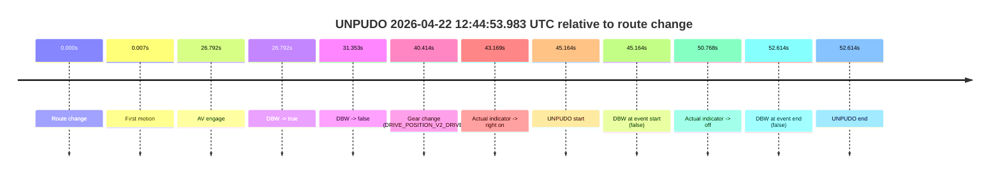
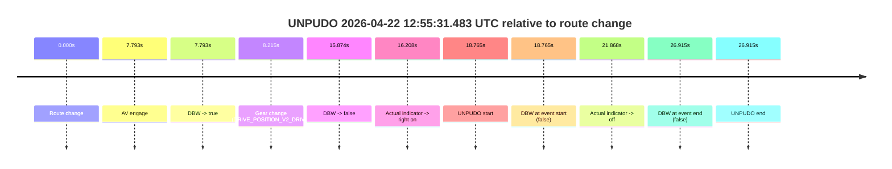

# Run Report: fme20032/2026-04-22--12-33-52--gen2-av-2404bd00-44c2-4b33-8228-6c8504522a0f

| Field | Value |
|---|---|
| Run ID | `fme20032/2026-04-22--12-33-52--gen2-av-2404bd00-44c2-4b33-8228-6c8504522a0f` |
| Date | `2026-04-22` |
| Model(s) | `pink-manta-ray-smooth` |
| Author | `guy.geva` |
| Event count | `2` |

## unpudo 2026-04-22 12:44:53.983 UTC

| Field | Value |
|---|---|
| Model | `pink-manta-ray-smooth` |
| Author | `guy.geva` |
| Run ID | `fme20032/2026-04-22--12-33-52--gen2-av-2404bd00-44c2-4b33-8228-6c8504522a0f` |
| Date | `2026-04-22` |
| Time (UTC) | `12:44:53.983` |
| Event type | `unpudo` |
| Disengagement type | `none observed` |
| Route change | `found` |
| Console | [run](https://console.sso.wayve.ai/run/fme20032/2026-04-22--12-33-52--gen2-av-2404bd00-44c2-4b33-8228-6c8504522a0f?id=&time-unixus=1776861893983305) |
| Foxglove | [segment](https://app.foxglove.dev/wayve-on-prem/p/prj_0dX18KZdVHg1fmmI/view?ds=foxglove-stream&ds.deviceName=fme20032&ds.start=2026-04-22T12%3A43%3A58.819242Z&ds.end=2026-04-22T12%3A45%3A11.433303Z&layoutId=lay_0e7VD4WIKDQGU73Y&time=2026-04-22T12%3A44%3A53.983305Z) |

### Event card: fail

- Fail: the credited unpudo does not stay AV-owned. The event window starts with DBW false, and the maneuver outcome lands outside a clean AV-owned segment.

| Event | Time (UTC) | Delta from route change |
|---|---:|---:|
| Route change | 2026-04-22 12:44:08.819 | `0.000s` |
| First motion | 2026-04-22 12:44:08.826 | `0.007s` |
| AV engage | 2026-04-22 12:44:35.611 | `26.792s` |
| DBW -> true | 2026-04-22 12:44:35.611 | `26.792s` |
| DBW -> false | 2026-04-22 12:44:40.172 | `31.353s` |
| Gear change (DRIVE_POSITION_V2_DRIVE) | 2026-04-22 12:44:49.233 | `40.414s` |
| Actual indicator -> right on | 2026-04-22 12:44:51.987 | `43.169s` |
| UNPUDO start | 2026-04-22 12:44:53.983 | `45.164s` |
| DBW at event start (false) | 2026-04-22 12:44:53.983 | `45.164s` |
| Actual indicator -> off | 2026-04-22 12:44:59.587 | `50.768s` |
| DBW at event end (false) | 2026-04-22 12:45:01.433 | `52.614s` |
| UNPUDO end | 2026-04-22 12:45:01.433 | `52.614s` |

| Metric | Value |
|---|---|
| Outcome | `fail` |
| Effective failure type | `completed_outside_av` |
| Route change status | `found` |
| DBW at event start | `false` |
| DBW at event end | `false` |
| Predicted gear at AV start | `DRIVE_POSITION_V2_DRIVE` |
| Actual gear at AV start | `DRIVE_POSITION_V2_PARK` |
| Predicted gear at event start | `DRIVE_POSITION_V2_DRIVE` |
| Actual gear at event start | `DRIVE_POSITION_V2_DRIVE` |
| Planned indicator direction | `INDICATORS_STATE_V2_LEFT_ON` |
| Controller indicator direction | `INDICATORS_STATE_V2_LEFT_ON` |
| Actual indicator direction | `INDICATORS_STATE_V2_RIGHT_ON` |
| Actual indicator at maneuver end | `INDICATORS_STATE_V2_OFF` |
| Driver accel help in AV | `false` |
| Driver accel help timestamp | `n/a` |
| Max accel pedal pct in AV | `0.0%` |
| Max brake pedal pct in AV | `8.0%` |
| Max speed mps in AV | `0.000` |
| Success timing baseline | `route change` |
| Route -> AV | `26.792s` |
| AV -> event start | `18.372s` |
| AV -> first motion | `-26.785s` |
| Success baseline -> event start | `45.164s` |
| Success baseline -> first motion | `0.007s` |
| AV duration before disengagement | `4.561s` |
| Trajectory waypoint count | `37` |
| Driving-plan step count | `11` |

The scored portion starts from the AV-owned window, not from the pre-AV setup. Route-change search in the stopped pre-event segment was `found`, with the baseline therefore set to route change. At the event anchor the model predicts `DRIVE_POSITION_V2_DRIVE` and the actual gear is `DRIVE_POSITION_V2_DRIVE`. The effective model outcome is `fail` because `completed_outside_av.`

### Resolution

| Field | Value |
|---|---|
| Final outcome | `fail` |
| Do we agree with this label? | `yes` |
| Source disengagement type | `none observed` |
| Resolved effective failure type | `completed_outside_av` |
| Confidence | `high` |

## unpudo 2026-04-22 12:55:31.483 UTC

| Field | Value |
|---|---|
| Model | `pink-manta-ray-smooth` |
| Author | `guy.geva` |
| Run ID | `fme20032/2026-04-22--12-33-52--gen2-av-2404bd00-44c2-4b33-8228-6c8504522a0f` |
| Date | `2026-04-22` |
| Time (UTC) | `12:55:31.483` |
| Event type | `unpudo` |
| Disengagement type | `none observed` |
| Route change | `found` |
| Console | [run](https://console.sso.wayve.ai/run/fme20032/2026-04-22--12-33-52--gen2-av-2404bd00-44c2-4b33-8228-6c8504522a0f?id=&time-unixus=1776862531483306) |
| Foxglove | [segment](https://app.foxglove.dev/wayve-on-prem/p/prj_0dX18KZdVHg1fmmI/view?ds=foxglove-stream&ds.deviceName=fme20032&ds.start=2026-04-22T12%3A55%3A02.718368Z&ds.end=2026-04-22T12%3A55%3A49.633329Z&layoutId=lay_0e7VD4WIKDQGU73Y&time=2026-04-22T12%3A55%3A31.483306Z) |

### Event card: fail

- Fail: the credited unpudo does not stay AV-owned. The event window starts with DBW false, and the maneuver outcome lands outside a clean AV-owned segment.

| Event | Time (UTC) | Delta from route change |
|---|---:|---:|
| Route change | 2026-04-22 12:55:12.718 | `0.000s` |
| AV engage | 2026-04-22 12:55:20.511 | `7.793s` |
| DBW -> true | 2026-04-22 12:55:20.511 | `7.793s` |
| Gear change (DRIVE_POSITION_V2_DRIVE) | 2026-04-22 12:55:20.933 | `8.215s` |
| DBW -> false | 2026-04-22 12:55:28.592 | `15.874s` |
| Actual indicator -> right on | 2026-04-22 12:55:28.926 | `16.208s` |
| UNPUDO start | 2026-04-22 12:55:31.483 | `18.765s` |
| DBW at event start (false) | 2026-04-22 12:55:31.483 | `18.765s` |
| Actual indicator -> off | 2026-04-22 12:55:34.586 | `21.868s` |
| DBW at event end (false) | 2026-04-22 12:55:39.633 | `26.915s` |
| UNPUDO end | 2026-04-22 12:55:39.633 | `26.915s` |

| Metric | Value |
|---|---|
| Outcome | `fail` |
| Effective failure type | `not_av_owned` |
| Route change status | `found` |
| DBW at event start | `false` |
| DBW at event end | `false` |
| Predicted gear at AV start | `DRIVE_POSITION_V2_DRIVE` |
| Actual gear at AV start | `DRIVE_POSITION_V2_PARK` |
| Predicted gear at event start | `DRIVE_POSITION_V2_DRIVE` |
| Actual gear at event start | `DRIVE_POSITION_V2_DRIVE` |
| Planned indicator direction | `INDICATORS_STATE_V2_RIGHT_ON` |
| Controller indicator direction | `INDICATORS_STATE_V2_RIGHT_ON` |
| Actual indicator direction | `INDICATORS_STATE_V2_RIGHT_ON` |
| Actual indicator at maneuver end | `INDICATORS_STATE_V2_OFF` |
| Driver accel help in AV | `false` |
| Driver accel help timestamp | `n/a` |
| Max accel pedal pct in AV | `0.0%` |
| Max brake pedal pct in AV | `8.0%` |
| Max speed mps in AV | `0.000` |
| Success timing baseline | `route change` |
| Route -> AV | `7.793s` |
| AV -> event start | `10.972s` |
| AV -> first motion | `n/a` |
| Success baseline -> event start | `18.765s` |
| Success baseline -> first motion | `n/a` |
| AV duration before disengagement | `8.081s` |
| Trajectory waypoint count | `37` |
| Driving-plan step count | `11` |

The scored portion starts from the AV-owned window, not from the pre-AV setup. Route-change search in the stopped pre-event segment was `found`, with the baseline therefore set to route change. At the event anchor the model predicts `DRIVE_POSITION_V2_DRIVE` and the actual gear is `DRIVE_POSITION_V2_DRIVE`. The effective model outcome is `fail` because `not_av_owned.`

### Resolution

| Field | Value |
|---|---|
| Final outcome | `fail` |
| Do we agree with this label? | `yes` |
| Source disengagement type | `none observed` |
| Resolved effective failure type | `not_av_owned` |
| Confidence | `high` |
