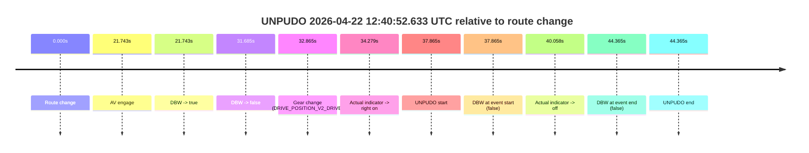
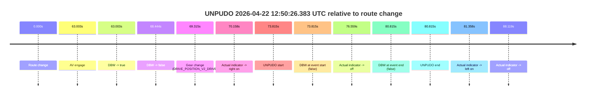
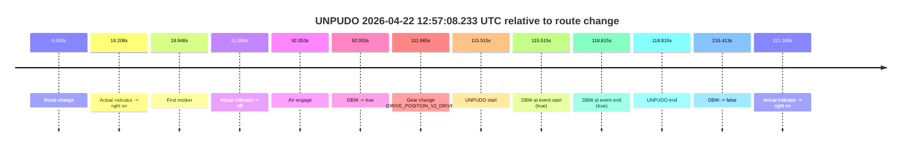
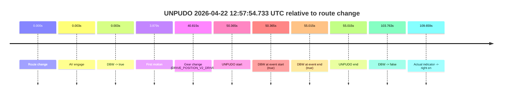
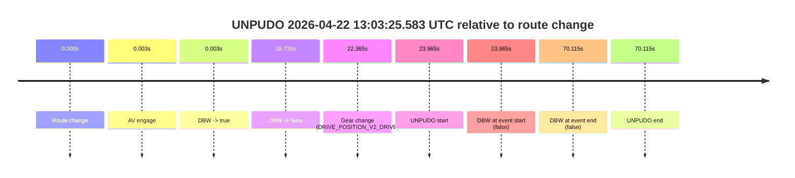
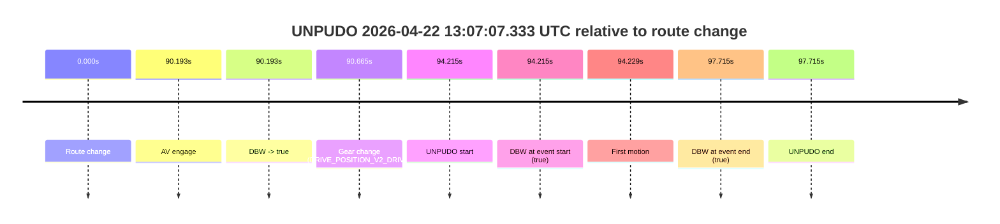

# Run Report: fme20032/2026-04-22--12-33-52--gen2-av-2404bd00-44c2-4b33-8228-6c8504522a0f

| Field | Value |
|---|---|
| Run ID | `fme20032/2026-04-22--12-33-52--gen2-av-2404bd00-44c2-4b33-8228-6c8504522a0f` |
| Date | `2026-04-22` |
| Model(s) | `eel-teal-outspoken` |
| Author | `zak` |
| Event count | `6` |

## unpudo 2026-04-22 12:40:52.633 UTC

| Field | Value |
|---|---|
| Model | `eel-teal-outspoken` |
| Author | `zak` |
| Run ID | `fme20032/2026-04-22--12-33-52--gen2-av-2404bd00-44c2-4b33-8228-6c8504522a0f` |
| Date | `2026-04-22` |
| Time (UTC) | `12:40:52.633` |
| Event type | `unpudo` |
| Disengagement type | `none observed` |
| Route change | `found` |
| Console | [run](https://console.sso.wayve.ai/run/fme20032/2026-04-22--12-33-52--gen2-av-2404bd00-44c2-4b33-8228-6c8504522a0f?id=&time-unixus=1776861652633297) |
| Foxglove | [segment](https://app.foxglove.dev/wayve-on-prem/p/prj_0dX18KZdVHg1fmmI/view?ds=foxglove-stream&ds.deviceName=fme20032&ds.start=2026-04-22T12%3A40%3A04.768261Z&ds.end=2026-04-22T12%3A41%3A09.133300Z&layoutId=lay_0e7VD4WIKDQGU73Y&time=2026-04-22T12%3A40%3A52.633297Z) |

### Event card: fail

- Fail: the credited unpudo does not stay AV-owned. The event window starts with DBW false, and the maneuver outcome lands outside a clean AV-owned segment.

| Event | Time (UTC) | Delta from route change |
|---|---:|---:|
| Route change | 2026-04-22 12:40:14.768 | `0.000s` |
| AV engage | 2026-04-22 12:40:36.511 | `21.743s` |
| DBW -> true | 2026-04-22 12:40:36.511 | `21.743s` |
| DBW -> false | 2026-04-22 12:40:46.453 | `31.685s` |
| Gear change (DRIVE_POSITION_V2_DRIVE) | 2026-04-22 12:40:47.633 | `32.865s` |
| Actual indicator -> right on | 2026-04-22 12:40:49.046 | `34.279s` |
| UNPUDO start | 2026-04-22 12:40:52.633 | `37.865s` |
| DBW at event start (false) | 2026-04-22 12:40:52.633 | `37.865s` |
| Actual indicator -> off | 2026-04-22 12:40:54.826 | `40.058s` |
| DBW at event end (false) | 2026-04-22 12:40:59.133 | `44.365s` |
| UNPUDO end | 2026-04-22 12:40:59.133 | `44.365s` |

| Metric | Value |
|---|---|
| Outcome | `fail` |
| Effective failure type | `not_av_owned` |
| Route change status | `found` |
| DBW at event start | `false` |
| DBW at event end | `false` |
| Predicted gear at AV start | `DRIVE_POSITION_V2_REVERSE` |
| Actual gear at AV start | `DRIVE_POSITION_V2_PARK` |
| Predicted gear at event start | `DRIVE_POSITION_V2_DRIVE` |
| Actual gear at event start | `DRIVE_POSITION_V2_DRIVE` |
| Planned indicator direction | `INDICATORS_STATE_V2_RIGHT_ON` |
| Controller indicator direction | `INDICATORS_STATE_V2_RIGHT_ON` |
| Actual indicator direction | `INDICATORS_STATE_V2_RIGHT_ON` |
| Actual indicator at maneuver end | `INDICATORS_STATE_V2_OFF` |
| Driver accel help in AV | `false` |
| Driver accel help timestamp | `n/a` |
| Max accel pedal pct in AV | `0.0%` |
| Max brake pedal pct in AV | `11.1%` |
| Max speed mps in AV | `0.000` |
| Success timing baseline | `route change` |
| Route -> AV | `21.743s` |
| AV -> event start | `16.122s` |
| AV -> first motion | `n/a` |
| Success baseline -> event start | `37.865s` |
| Success baseline -> first motion | `n/a` |
| AV duration before disengagement | `9.942s` |
| Trajectory waypoint count | `38` |
| Driving-plan step count | `11` |

The scored portion starts from the AV-owned window, not from the pre-AV setup. Route-change search in the stopped pre-event segment was `found`, with the baseline therefore set to route change. At the event anchor the model predicts `DRIVE_POSITION_V2_DRIVE` and the actual gear is `DRIVE_POSITION_V2_DRIVE`. The effective model outcome is `fail` because `not_av_owned.`

### Resolution

| Field | Value |
|---|---|
| Final outcome | `fail` |
| Do we agree with this label? | `yes` |
| Source disengagement type | `none observed` |
| Resolved effective failure type | `not_av_owned` |
| Confidence | `high` |

## unpudo 2026-04-22 12:50:26.383 UTC

| Field | Value |
|---|---|
| Model | `eel-teal-outspoken` |
| Author | `zak` |
| Run ID | `fme20032/2026-04-22--12-33-52--gen2-av-2404bd00-44c2-4b33-8228-6c8504522a0f` |
| Date | `2026-04-22` |
| Time (UTC) | `12:50:26.383` |
| Event type | `unpudo` |
| Disengagement type | `none observed` |
| Route change | `found` |
| Console | [run](https://console.sso.wayve.ai/run/fme20032/2026-04-22--12-33-52--gen2-av-2404bd00-44c2-4b33-8228-6c8504522a0f?id=&time-unixus=1776862226383316) |
| Foxglove | [segment](https://app.foxglove.dev/wayve-on-prem/p/prj_0dX18KZdVHg1fmmI/view?ds=foxglove-stream&ds.deviceName=fme20032&ds.start=2026-04-22T12%3A49%3A02.568305Z&ds.end=2026-04-22T12%3A50%3A43.383309Z&layoutId=lay_0e7VD4WIKDQGU73Y&time=2026-04-22T12%3A50%3A26.383316Z) |

### Event card: fail

- Fail: the credited unpudo does not stay AV-owned. The event window starts with DBW false, and the maneuver outcome lands outside a clean AV-owned segment.

| Event | Time (UTC) | Delta from route change |
|---|---:|---:|
| Route change | 2026-04-22 12:49:12.568 | `0.000s` |
| AV engage | 2026-04-22 12:50:15.571 | `63.003s` |
| DBW -> true | 2026-04-22 12:50:15.571 | `63.003s` |
| DBW -> false | 2026-04-22 12:50:21.012 | `68.444s` |
| Gear change (DRIVE_POSITION_V2_DRIVE) | 2026-04-22 12:50:21.883 | `69.315s` |
| Actual indicator -> right on | 2026-04-22 12:50:22.726 | `70.158s` |
| UNPUDO start | 2026-04-22 12:50:26.383 | `73.815s` |
| DBW at event start (false) | 2026-04-22 12:50:26.383 | `73.815s` |
| Actual indicator -> off | 2026-04-22 12:50:29.126 | `76.559s` |
| DBW at event end (false) | 2026-04-22 12:50:33.383 | `80.815s` |
| UNPUDO end | 2026-04-22 12:50:33.383 | `80.815s` |
| Actual indicator -> left on | 2026-04-22 12:50:33.926 | `81.358s` |
| Actual indicator -> off | 2026-04-22 12:50:40.686 | `88.119s` |

| Metric | Value |
|---|---|
| Outcome | `fail` |
| Effective failure type | `not_av_owned` |
| Route change status | `found` |
| DBW at event start | `false` |
| DBW at event end | `false` |
| Predicted gear at AV start | `DRIVE_POSITION_V2_DRIVE` |
| Actual gear at AV start | `DRIVE_POSITION_V2_PARK` |
| Predicted gear at event start | `DRIVE_POSITION_V2_DRIVE` |
| Actual gear at event start | `DRIVE_POSITION_V2_DRIVE` |
| Planned indicator direction | `INDICATORS_STATE_V2_OFF` |
| Controller indicator direction | `INDICATORS_STATE_V2_OFF` |
| Actual indicator direction | `INDICATORS_STATE_V2_RIGHT_ON` |
| Actual indicator at maneuver end | `INDICATORS_STATE_V2_OFF` |
| Driver accel help in AV | `false` |
| Driver accel help timestamp | `n/a` |
| Max accel pedal pct in AV | `0.0%` |
| Max brake pedal pct in AV | `8.0%` |
| Max speed mps in AV | `0.000` |
| Success timing baseline | `route change` |
| Route -> AV | `63.003s` |
| AV -> event start | `10.812s` |
| AV -> first motion | `n/a` |
| Success baseline -> event start | `73.815s` |
| Success baseline -> first motion | `n/a` |
| AV duration before disengagement | `5.441s` |
| Trajectory waypoint count | `37` |
| Driving-plan step count | `11` |

The scored portion starts from the AV-owned window, not from the pre-AV setup. Route-change search in the stopped pre-event segment was `found`, with the baseline therefore set to route change. At the event anchor the model predicts `DRIVE_POSITION_V2_DRIVE` and the actual gear is `DRIVE_POSITION_V2_DRIVE`. The effective model outcome is `fail` because `not_av_owned.`

### Resolution

| Field | Value |
|---|---|
| Final outcome | `fail` |
| Do we agree with this label? | `yes` |
| Source disengagement type | `none observed` |
| Resolved effective failure type | `not_av_owned` |
| Confidence | `high` |

## unpudo 2026-04-22 12:57:08.233 UTC

| Field | Value |
|---|---|
| Model | `eel-teal-outspoken` |
| Author | `zak` |
| Run ID | `fme20032/2026-04-22--12-33-52--gen2-av-2404bd00-44c2-4b33-8228-6c8504522a0f` |
| Date | `2026-04-22` |
| Time (UTC) | `12:57:08.233` |
| Event type | `unpudo` |
| Disengagement type | `none observed` |
| Route change | `found` |
| Console | [run](https://console.sso.wayve.ai/run/fme20032/2026-04-22--12-33-52--gen2-av-2404bd00-44c2-4b33-8228-6c8504522a0f?id=&time-unixus=1776862628233306) |
| Foxglove | [segment](https://app.foxglove.dev/wayve-on-prem/p/prj_0dX18KZdVHg1fmmI/view?ds=foxglove-stream&ds.deviceName=fme20032&ds.start=2026-04-22T12%3A55%3A02.718368Z&ds.end=2026-04-22T12%3A58%3A58.131476Z&layoutId=lay_0e7VD4WIKDQGU73Y&time=2026-04-22T12%3A57%3A08.233306Z) |

### Event card: pass

- Pass: AV owns the credited unpudo from route change through the official unpudo window, the gear state is aligned at the anchor, and the vehicle moves without driver accelerator help in AV.

| Event | Time (UTC) | Delta from route change |
|---|---:|---:|
| Route change | 2026-04-22 12:55:12.718 | `0.000s` |
| Actual indicator -> right on | 2026-04-22 12:55:28.926 | `16.208s` |
| First motion | 2026-04-22 12:55:31.666 | `18.948s` |
| Actual indicator -> off | 2026-04-22 12:55:34.586 | `21.868s` |
| AV engage | 2026-04-22 12:56:44.771 | `92.053s` |
| DBW -> true | 2026-04-22 12:56:44.771 | `92.053s` |
| Gear change (DRIVE_POSITION_V2_DRIVE) | 2026-04-22 12:57:04.683 | `111.965s` |
| UNPUDO start | 2026-04-22 12:57:08.233 | `115.515s` |
| DBW at event start (true) | 2026-04-22 12:57:08.233 | `115.515s` |
| DBW at event end (true) | 2026-04-22 12:57:11.533 | `118.815s` |
| UNPUDO end | 2026-04-22 12:57:11.533 | `118.815s` |
| DBW -> false | 2026-04-22 12:58:48.131 | `215.413s` |
| Actual indicator -> right on | 2026-04-22 12:58:54.026 | `221.308s` |

| Metric | Value |
|---|---|
| Outcome | `pass` |
| Effective failure type | `none` |
| Route change status | `found` |
| DBW at event start | `true` |
| DBW at event end | `true` |
| Predicted gear at AV start | `DRIVE_POSITION_V2_DRIVE` |
| Actual gear at AV start | `DRIVE_POSITION_V2_DRIVE` |
| Predicted gear at event start | `DRIVE_POSITION_V2_DRIVE` |
| Actual gear at event start | `DRIVE_POSITION_V2_DRIVE` |
| Planned indicator direction | `INDICATORS_STATE_V2_RIGHT_ON` |
| Controller indicator direction | `INDICATORS_STATE_V2_RIGHT_ON` |
| Actual indicator direction | `INDICATORS_STATE_V2_OFF` |
| Actual indicator at maneuver end | `INDICATORS_STATE_V2_OFF` |
| Driver accel help in AV | `false` |
| Driver accel help timestamp | `n/a` |
| Max accel pedal pct in AV | `0.0%` |
| Max brake pedal pct in AV | `18.2%` |
| Max speed mps in AV | `5.536` |
| Success timing baseline | `route change` |
| Route -> AV | `92.053s` |
| AV -> event start | `23.462s` |
| AV -> first motion | `-73.105s` |
| Success baseline -> event start | `115.515s` |
| Success baseline -> first motion | `18.948s` |
| AV duration before disengagement | `123.360s` |
| Trajectory waypoint count | `36` |
| Driving-plan step count | `11` |

The scored portion starts from the AV-owned window, not from the pre-AV setup. Route-change search in the stopped pre-event segment was `found`, with the baseline therefore set to route change. At the event anchor the model predicts `DRIVE_POSITION_V2_DRIVE` and the actual gear is `DRIVE_POSITION_V2_DRIVE`. The effective model outcome is `pass` because `the credited unpudo stays AV-owned through the official unpudo window.`

### Resolution

| Field | Value |
|---|---|
| Final outcome | `pass` |
| Do we agree with this label? | `yes` |
| Source disengagement type | `none observed` |
| Resolved effective failure type | `none` |
| Confidence | `high` |

## unpudo 2026-04-22 12:57:54.733 UTC

| Field | Value |
|---|---|
| Model | `eel-teal-outspoken` |
| Author | `zak` |
| Run ID | `fme20032/2026-04-22--12-33-52--gen2-av-2404bd00-44c2-4b33-8228-6c8504522a0f` |
| Date | `2026-04-22` |
| Time (UTC) | `12:57:54.733` |
| Event type | `unpudo` |
| Disengagement type | `none observed` |
| Route change | `found` |
| Console | [run](https://console.sso.wayve.ai/run/fme20032/2026-04-22--12-33-52--gen2-av-2404bd00-44c2-4b33-8228-6c8504522a0f?id=&time-unixus=1776862674733313) |
| Foxglove | [segment](https://app.foxglove.dev/wayve-on-prem/p/prj_0dX18KZdVHg1fmmI/view?ds=foxglove-stream&ds.deviceName=fme20032&ds.start=2026-04-22T12%3A56%3A54.368236Z&ds.end=2026-04-22T12%3A58%3A58.131476Z&layoutId=lay_0e7VD4WIKDQGU73Y&time=2026-04-22T12%3A57%3A54.733313Z) |

### Event card: pass

- Pass: AV owns the credited unpudo from route change through the official unpudo window, the gear state is aligned at the anchor, and the vehicle moves without driver accelerator help in AV.

| Event | Time (UTC) | Delta from route change |
|---|---:|---:|
| Route change | 2026-04-22 12:57:04.368 | `0.000s` |
| AV engage | 2026-04-22 12:57:04.371 | `0.003s` |
| DBW -> true | 2026-04-22 12:57:04.371 | `0.003s` |
| First motion | 2026-04-22 12:57:08.247 | `3.879s` |
| Gear change (DRIVE_POSITION_V2_DRIVE) | 2026-04-22 12:57:45.183 | `40.815s` |
| UNPUDO start | 2026-04-22 12:57:54.733 | `50.365s` |
| DBW at event start (true) | 2026-04-22 12:57:54.733 | `50.365s` |
| DBW at event end (true) | 2026-04-22 12:57:59.383 | `55.015s` |
| UNPUDO end | 2026-04-22 12:57:59.383 | `55.015s` |
| DBW -> false | 2026-04-22 12:58:48.131 | `103.763s` |
| Actual indicator -> right on | 2026-04-22 12:58:54.026 | `109.659s` |

| Metric | Value |
|---|---|
| Outcome | `pass` |
| Effective failure type | `none` |
| Route change status | `found` |
| DBW at event start | `true` |
| DBW at event end | `true` |
| Predicted gear at AV start | `DRIVE_POSITION_V2_PARK` |
| Actual gear at AV start | `DRIVE_POSITION_V2_PARK` |
| Predicted gear at event start | `DRIVE_POSITION_V2_DRIVE` |
| Actual gear at event start | `DRIVE_POSITION_V2_DRIVE` |
| Planned indicator direction | `INDICATORS_STATE_V2_RIGHT_ON` |
| Controller indicator direction | `INDICATORS_STATE_V2_RIGHT_ON` |
| Actual indicator direction | `INDICATORS_STATE_V2_OFF` |
| Actual indicator at maneuver end | `INDICATORS_STATE_V2_OFF` |
| Driver accel help in AV | `false` |
| Driver accel help timestamp | `n/a` |
| Max accel pedal pct in AV | `0.0%` |
| Max brake pedal pct in AV | `13.1%` |
| Max speed mps in AV | `6.617` |
| Success timing baseline | `route change` |
| Route -> AV | `0.003s` |
| AV -> event start | `50.362s` |
| AV -> first motion | `3.876s` |
| Success baseline -> event start | `50.365s` |
| Success baseline -> first motion | `3.879s` |
| AV duration before disengagement | `103.760s` |
| Trajectory waypoint count | `36` |
| Driving-plan step count | `11` |

The scored portion starts from the AV-owned window, not from the pre-AV setup. Route-change search in the stopped pre-event segment was `found`, with the baseline therefore set to route change. At the event anchor the model predicts `DRIVE_POSITION_V2_DRIVE` and the actual gear is `DRIVE_POSITION_V2_DRIVE`. The effective model outcome is `pass` because `the credited unpudo stays AV-owned through the official unpudo window.`

### Resolution

| Field | Value |
|---|---|
| Final outcome | `pass` |
| Do we agree with this label? | `yes` |
| Source disengagement type | `none observed` |
| Resolved effective failure type | `none` |
| Confidence | `high` |

## unpudo 2026-04-22 13:03:25.583 UTC

| Field | Value |
|---|---|
| Model | `eel-teal-outspoken` |
| Author | `zak` |
| Run ID | `fme20032/2026-04-22--12-33-52--gen2-av-2404bd00-44c2-4b33-8228-6c8504522a0f` |
| Date | `2026-04-22` |
| Time (UTC) | `13:03:25.583` |
| Event type | `unpudo` |
| Disengagement type | `none observed` |
| Route change | `found` |
| Console | [run](https://console.sso.wayve.ai/run/fme20032/2026-04-22--12-33-52--gen2-av-2404bd00-44c2-4b33-8228-6c8504522a0f?id=&time-unixus=1776863005583320) |
| Foxglove | [segment](https://app.foxglove.dev/wayve-on-prem/p/prj_0dX18KZdVHg1fmmI/view?ds=foxglove-stream&ds.deviceName=fme20032&ds.start=2026-04-22T13%3A02%3A51.618244Z&ds.end=2026-04-22T13%3A04%3A21.733305Z&layoutId=lay_0e7VD4WIKDQGU73Y&time=2026-04-22T13%3A03%3A25.583320Z) |

### Event card: fail

- Fail: the credited unpudo does not stay AV-owned. The event window starts with DBW false, and the maneuver outcome lands outside a clean AV-owned segment.

| Event | Time (UTC) | Delta from route change |
|---|---:|---:|
| Route change | 2026-04-22 13:03:01.618 | `0.000s` |
| AV engage | 2026-04-22 13:03:01.621 | `0.003s` |
| DBW -> true | 2026-04-22 13:03:01.621 | `0.003s` |
| DBW -> false | 2026-04-22 13:03:20.351 | `18.733s` |
| Gear change (DRIVE_POSITION_V2_DRIVE) | 2026-04-22 13:03:23.983 | `22.365s` |
| UNPUDO start | 2026-04-22 13:03:25.583 | `23.965s` |
| DBW at event start (false) | 2026-04-22 13:03:25.583 | `23.965s` |
| DBW at event end (false) | 2026-04-22 13:04:11.733 | `70.115s` |
| UNPUDO end | 2026-04-22 13:04:11.733 | `70.115s` |

| Metric | Value |
|---|---|
| Outcome | `fail` |
| Effective failure type | `not_av_owned` |
| Route change status | `found` |
| DBW at event start | `false` |
| DBW at event end | `false` |
| Predicted gear at AV start | `DRIVE_POSITION_V2_PARK` |
| Actual gear at AV start | `DRIVE_POSITION_V2_PARK` |
| Predicted gear at event start | `DRIVE_POSITION_V2_DRIVE` |
| Actual gear at event start | `DRIVE_POSITION_V2_DRIVE` |
| Planned indicator direction | `INDICATORS_STATE_V2_OFF` |
| Controller indicator direction | `INDICATORS_STATE_V2_OFF` |
| Actual indicator direction | `INDICATORS_STATE_V2_OFF` |
| Actual indicator at maneuver end | `INDICATORS_STATE_V2_OFF` |
| Driver accel help in AV | `false` |
| Driver accel help timestamp | `n/a` |
| Max accel pedal pct in AV | `0.0%` |
| Max brake pedal pct in AV | `10.8%` |
| Max speed mps in AV | `0.000` |
| Success timing baseline | `route change` |
| Route -> AV | `0.003s` |
| AV -> event start | `23.962s` |
| AV -> first motion | `n/a` |
| Success baseline -> event start | `23.965s` |
| Success baseline -> first motion | `n/a` |
| AV duration before disengagement | `18.730s` |
| Trajectory waypoint count | `37` |
| Driving-plan step count | `11` |

The scored portion starts from the AV-owned window, not from the pre-AV setup. Route-change search in the stopped pre-event segment was `found`, with the baseline therefore set to route change. At the event anchor the model predicts `DRIVE_POSITION_V2_DRIVE` and the actual gear is `DRIVE_POSITION_V2_DRIVE`. The effective model outcome is `fail` because `not_av_owned.`

### Resolution

| Field | Value |
|---|---|
| Final outcome | `fail` |
| Do we agree with this label? | `yes` |
| Source disengagement type | `none observed` |
| Resolved effective failure type | `not_av_owned` |
| Confidence | `high` |

## unpudo 2026-04-22 13:07:07.333 UTC

| Field | Value |
|---|---|
| Model | `eel-teal-outspoken` |
| Author | `zak` |
| Run ID | `fme20032/2026-04-22--12-33-52--gen2-av-2404bd00-44c2-4b33-8228-6c8504522a0f` |
| Date | `2026-04-22` |
| Time (UTC) | `13:07:07.333` |
| Event type | `unpudo` |
| Disengagement type | `none observed` |
| Route change | `found` |
| Console | [run](https://console.sso.wayve.ai/run/fme20032/2026-04-22--12-33-52--gen2-av-2404bd00-44c2-4b33-8228-6c8504522a0f?id=&time-unixus=1776863227333309) |
| Foxglove | [segment](https://app.foxglove.dev/wayve-on-prem/p/prj_0dX18KZdVHg1fmmI/view?ds=foxglove-stream&ds.deviceName=fme20032&ds.start=2026-04-22T13%3A05%3A23.118250Z&ds.end=2026-04-22T13%3A07%3A20.833320Z&layoutId=lay_0e7VD4WIKDQGU73Y&time=2026-04-22T13%3A07%3A07.333309Z) |

### Event card: pass

- Pass: AV owns the credited unpudo from route change through the official unpudo window, the gear state is aligned at the anchor, and the vehicle moves without driver accelerator help in AV.

| Event | Time (UTC) | Delta from route change |
|---|---:|---:|
| Route change | 2026-04-22 13:05:33.118 | `0.000s` |
| AV engage | 2026-04-22 13:07:03.311 | `90.193s` |
| DBW -> true | 2026-04-22 13:07:03.311 | `90.193s` |
| Gear change (DRIVE_POSITION_V2_DRIVE) | 2026-04-22 13:07:03.783 | `90.665s` |
| UNPUDO start | 2026-04-22 13:07:07.333 | `94.215s` |
| DBW at event start (true) | 2026-04-22 13:07:07.333 | `94.215s` |
| First motion | 2026-04-22 13:07:07.347 | `94.229s` |
| DBW at event end (true) | 2026-04-22 13:07:10.833 | `97.715s` |
| UNPUDO end | 2026-04-22 13:07:10.833 | `97.715s` |

| Metric | Value |
|---|---|
| Outcome | `pass` |
| Effective failure type | `none` |
| Route change status | `found` |
| DBW at event start | `true` |
| DBW at event end | `true` |
| Predicted gear at AV start | `DRIVE_POSITION_V2_DRIVE` |
| Actual gear at AV start | `DRIVE_POSITION_V2_PARK` |
| Predicted gear at event start | `DRIVE_POSITION_V2_DRIVE` |
| Actual gear at event start | `DRIVE_POSITION_V2_DRIVE` |
| Planned indicator direction | `INDICATORS_STATE_V2_RIGHT_ON` |
| Controller indicator direction | `INDICATORS_STATE_V2_RIGHT_ON` |
| Actual indicator direction | `INDICATORS_STATE_V2_OFF` |
| Actual indicator at maneuver end | `INDICATORS_STATE_V2_OFF` |
| Driver accel help in AV | `false` |
| Driver accel help timestamp | `n/a` |
| Max accel pedal pct in AV | `0.0%` |
| Max brake pedal pct in AV | `8.0%` |
| Max speed mps in AV | `4.072` |
| Success timing baseline | `route change` |
| Route -> AV | `90.193s` |
| AV -> event start | `4.022s` |
| AV -> first motion | `4.036s` |
| Success baseline -> event start | `94.215s` |
| Success baseline -> first motion | `94.229s` |
| AV duration before disengagement | `n/a` |
| Trajectory waypoint count | `38` |
| Driving-plan step count | `11` |

The scored portion starts from the AV-owned window, not from the pre-AV setup. Route-change search in the stopped pre-event segment was `found`, with the baseline therefore set to route change. At the event anchor the model predicts `DRIVE_POSITION_V2_DRIVE` and the actual gear is `DRIVE_POSITION_V2_DRIVE`. The effective model outcome is `pass` because `the credited unpudo stays AV-owned through the official unpudo window.`

### Resolution

| Field | Value |
|---|---|
| Final outcome | `pass` |
| Do we agree with this label? | `yes` |
| Source disengagement type | `none observed` |
| Resolved effective failure type | `none` |
| Confidence | `high` |
