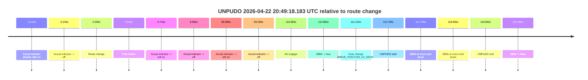
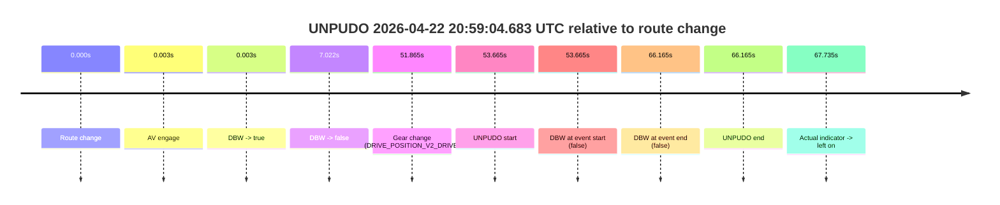
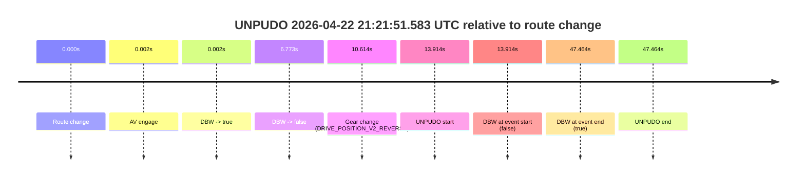

# Run Report: fme20032/2026-04-22--20-36-18--gen2-av-f9245e43-7437-4ea0-b515-55f4677dd44c

| Field | Value |
|---|---|
| Run ID | `fme20032/2026-04-22--20-36-18--gen2-av-f9245e43-7437-4ea0-b515-55f4677dd44c` |
| Date | `2026-04-22` |
| Model(s) | `eel-teal-outspoken` |
| Author | `zak` |
| Event count | `3` |

## unpudo 2026-04-22 20:49:18.183 UTC

| Field | Value |
|---|---|
| Model | `eel-teal-outspoken` |
| Author | `zak` |
| Run ID | `fme20032/2026-04-22--20-36-18--gen2-av-f9245e43-7437-4ea0-b515-55f4677dd44c` |
| Date | `2026-04-22` |
| Time (UTC) | `20:49:18.183` |
| Event type | `unpudo` |
| Disengagement type | `none observed` |
| Route change | `found` |
| Console | [run](https://console.sso.wayve.ai/run/fme20032/2026-04-22--20-36-18--gen2-av-f9245e43-7437-4ea0-b515-55f4677dd44c?id=&time-unixus=1776890958183289) |
| Foxglove | [segment](https://app.foxglove.dev/wayve-on-prem/p/prj_0dX18KZdVHg1fmmI/view?ds=foxglove-stream&ds.deviceName=fme20032&ds.start=2026-04-22T20%3A47%3A13.418227Z&ds.end=2026-04-22T20%3A51%3A24.501360Z&layoutId=lay_0e7VD4WIKDQGU73Y&time=2026-04-22T20%3A49%3A18.183289Z) |

### Event card: pass

- Pass: AV owns the credited unpudo from route change through the official unpudo window, the gear state is aligned at the anchor, and the vehicle moves without driver accelerator help in AV.

| Event | Time (UTC) | Delta from route change |
|---|---:|---:|
| Actual indicator already right on | 2026-04-22 20:47:18.193 | `-5.224s` |
| Actual indicator -> off | 2026-04-22 20:47:20.174 | `-3.244s` |
| Route change | 2026-04-22 20:47:23.418 | `0.000s` |
| First motion | 2026-04-22 20:47:23.434 | `0.016s` |
| Actual indicator -> left on | 2026-04-22 20:47:24.134 | `0.716s` |
| Actual indicator -> off | 2026-04-22 20:47:32.414 | `8.996s` |
| Actual indicator -> left on | 2026-04-22 20:48:50.313 | `86.896s` |
| Actual indicator -> off | 2026-04-22 20:48:52.713 | `89.296s` |
| AV engage | 2026-04-22 20:49:14.301 | `110.883s` |
| DBW -> true | 2026-04-22 20:49:14.301 | `110.883s` |
| Gear change (DRIVE_POSITION_V2_DRIVE) | 2026-04-22 20:49:14.633 | `111.215s` |
| UNPUDO start | 2026-04-22 20:49:18.183 | `114.765s` |
| DBW at event start (true) | 2026-04-22 20:49:18.183 | `114.765s` |
| DBW at event end (true) | 2026-04-22 20:49:22.283 | `118.865s` |
| UNPUDO end | 2026-04-22 20:49:22.283 | `118.865s` |
| DBW -> false | 2026-04-22 20:51:14.501 | `231.083s` |

| Metric | Value |
|---|---|
| Outcome | `pass` |
| Effective failure type | `none` |
| Route change status | `found` |
| DBW at event start | `true` |
| DBW at event end | `true` |
| Predicted gear at AV start | `DRIVE_POSITION_V2_PARK` |
| Actual gear at AV start | `DRIVE_POSITION_V2_PARK` |
| Predicted gear at event start | `DRIVE_POSITION_V2_DRIVE` |
| Actual gear at event start | `DRIVE_POSITION_V2_DRIVE` |
| Planned indicator direction | `INDICATORS_STATE_V2_RIGHT_ON` |
| Controller indicator direction | `INDICATORS_STATE_V2_RIGHT_ON` |
| Actual indicator direction | `INDICATORS_STATE_V2_OFF` |
| Actual indicator at maneuver end | `INDICATORS_STATE_V2_OFF` |
| Driver accel help in AV | `false` |
| Driver accel help timestamp | `n/a` |
| Max accel pedal pct in AV | `0.0%` |
| Max brake pedal pct in AV | `9.0%` |
| Max speed mps in AV | `4.367` |
| Success timing baseline | `route change` |
| Route -> AV | `110.883s` |
| AV -> event start | `3.882s` |
| AV -> first motion | `-110.867s` |
| Success baseline -> event start | `114.765s` |
| Success baseline -> first motion | `0.016s` |
| AV duration before disengagement | `120.200s` |
| Trajectory waypoint count | `37` |
| Driving-plan step count | `11` |

The scored portion starts from the AV-owned window, not from the pre-AV setup. Route-change search in the stopped pre-event segment was `found`, with the baseline therefore set to route change. At the event anchor the model predicts `DRIVE_POSITION_V2_DRIVE` and the actual gear is `DRIVE_POSITION_V2_DRIVE`. The effective model outcome is `pass` because `the credited unpudo stays AV-owned through the official unpudo window.`

### Resolution

| Field | Value |
|---|---|
| Final outcome | `pass` |
| Do we agree with this label? | `yes` |
| Source disengagement type | `none observed` |
| Resolved effective failure type | `none` |
| Confidence | `high` |

## unpudo 2026-04-22 20:59:04.683 UTC

| Field | Value |
|---|---|
| Model | `eel-teal-outspoken` |
| Author | `zak` |
| Run ID | `fme20032/2026-04-22--20-36-18--gen2-av-f9245e43-7437-4ea0-b515-55f4677dd44c` |
| Date | `2026-04-22` |
| Time (UTC) | `20:59:04.683` |
| Event type | `unpudo` |
| Disengagement type | `none observed` |
| Route change | `found` |
| Console | [run](https://console.sso.wayve.ai/run/fme20032/2026-04-22--20-36-18--gen2-av-f9245e43-7437-4ea0-b515-55f4677dd44c?id=&time-unixus=1776891544683322) |
| Foxglove | [segment](https://app.foxglove.dev/wayve-on-prem/p/prj_0dX18KZdVHg1fmmI/view?ds=foxglove-stream&ds.deviceName=fme20032&ds.start=2026-04-22T20%3A58%3A01.018369Z&ds.end=2026-04-22T20%3A59%3A27.183314Z&layoutId=lay_0e7VD4WIKDQGU73Y&time=2026-04-22T20%3A59%3A04.683322Z) |

### Event card: fail

- Fail: the credited unpudo does not stay AV-owned. The event window starts with DBW false, and the maneuver outcome lands outside a clean AV-owned segment.

| Event | Time (UTC) | Delta from route change |
|---|---:|---:|
| Route change | 2026-04-22 20:58:11.018 | `0.000s` |
| AV engage | 2026-04-22 20:58:11.021 | `0.003s` |
| DBW -> true | 2026-04-22 20:58:11.021 | `0.003s` |
| DBW -> false | 2026-04-22 20:58:18.040 | `7.022s` |
| Gear change (DRIVE_POSITION_V2_DRIVE) | 2026-04-22 20:59:02.883 | `51.865s` |
| UNPUDO start | 2026-04-22 20:59:04.683 | `53.665s` |
| DBW at event start (false) | 2026-04-22 20:59:04.683 | `53.665s` |
| DBW at event end (false) | 2026-04-22 20:59:17.183 | `66.165s` |
| UNPUDO end | 2026-04-22 20:59:17.183 | `66.165s` |
| Actual indicator -> left on | 2026-04-22 20:59:18.753 | `67.735s` |

| Metric | Value |
|---|---|
| Outcome | `fail` |
| Effective failure type | `not_av_owned` |
| Route change status | `found` |
| DBW at event start | `false` |
| DBW at event end | `false` |
| Predicted gear at AV start | `DRIVE_POSITION_V2_PARK` |
| Actual gear at AV start | `DRIVE_POSITION_V2_PARK` |
| Predicted gear at event start | `DRIVE_POSITION_V2_DRIVE` |
| Actual gear at event start | `DRIVE_POSITION_V2_DRIVE` |
| Planned indicator direction | `INDICATORS_STATE_V2_OFF` |
| Controller indicator direction | `INDICATORS_STATE_V2_OFF` |
| Actual indicator direction | `INDICATORS_STATE_V2_OFF` |
| Actual indicator at maneuver end | `INDICATORS_STATE_V2_OFF` |
| Driver accel help in AV | `false` |
| Driver accel help timestamp | `n/a` |
| Max accel pedal pct in AV | `0.0%` |
| Max brake pedal pct in AV | `8.0%` |
| Max speed mps in AV | `0.000` |
| Success timing baseline | `route change` |
| Route -> AV | `0.003s` |
| AV -> event start | `53.662s` |
| AV -> first motion | `n/a` |
| Success baseline -> event start | `53.665s` |
| Success baseline -> first motion | `n/a` |
| AV duration before disengagement | `7.019s` |
| Trajectory waypoint count | `37` |
| Driving-plan step count | `11` |

The scored portion starts from the AV-owned window, not from the pre-AV setup. Route-change search in the stopped pre-event segment was `found`, with the baseline therefore set to route change. At the event anchor the model predicts `DRIVE_POSITION_V2_DRIVE` and the actual gear is `DRIVE_POSITION_V2_DRIVE`. The effective model outcome is `fail` because `not_av_owned.`

### Resolution

| Field | Value |
|---|---|
| Final outcome | `fail` |
| Do we agree with this label? | `yes` |
| Source disengagement type | `none observed` |
| Resolved effective failure type | `not_av_owned` |
| Confidence | `high` |

## unpudo 2026-04-22 21:21:51.583 UTC

| Field | Value |
|---|---|
| Model | `eel-teal-outspoken` |
| Author | `zak` |
| Run ID | `fme20032/2026-04-22--20-36-18--gen2-av-f9245e43-7437-4ea0-b515-55f4677dd44c` |
| Date | `2026-04-22` |
| Time (UTC) | `21:21:51.583` |
| Event type | `unpudo` |
| Disengagement type | `none observed` |
| Route change | `found` |
| Console | [run](https://console.sso.wayve.ai/run/fme20032/2026-04-22--20-36-18--gen2-av-f9245e43-7437-4ea0-b515-55f4677dd44c?id=&time-unixus=1776892911583314) |
| Foxglove | [segment](https://app.foxglove.dev/wayve-on-prem/p/prj_0dX18KZdVHg1fmmI/view?ds=foxglove-stream&ds.deviceName=fme20032&ds.start=2026-04-22T21%3A21%3A27.668891Z&ds.end=2026-04-22T21%3A22%3A35.133318Z&layoutId=lay_0e7VD4WIKDQGU73Y&time=2026-04-22T21%3A21%3A51.583314Z) |

### Event card: fail

- Fail: the credited unpudo does not stay AV-owned. The event window starts with DBW false, and the maneuver outcome lands outside a clean AV-owned segment.

| Event | Time (UTC) | Delta from route change |
|---|---:|---:|
| Route change | 2026-04-22 21:21:37.668 | `0.000s` |
| AV engage | 2026-04-22 21:21:37.671 | `0.002s` |
| DBW -> true | 2026-04-22 21:21:37.671 | `0.002s` |
| DBW -> false | 2026-04-22 21:21:44.441 | `6.773s` |
| Gear change (DRIVE_POSITION_V2_REVERSE) | 2026-04-22 21:21:48.283 | `10.614s` |
| UNPUDO start | 2026-04-22 21:21:51.583 | `13.914s` |
| DBW at event start (false) | 2026-04-22 21:21:51.583 | `13.914s` |
| DBW at event end (true) | 2026-04-22 21:22:25.133 | `47.464s` |
| UNPUDO end | 2026-04-22 21:22:25.133 | `47.464s` |

| Metric | Value |
|---|---|
| Outcome | `fail` |
| Effective failure type | `not_av_owned` |
| Route change status | `found` |
| DBW at event start | `false` |
| DBW at event end | `true` |
| Predicted gear at AV start | `DRIVE_POSITION_V2_PARK` |
| Actual gear at AV start | `DRIVE_POSITION_V2_PARK` |
| Predicted gear at event start | `DRIVE_POSITION_V2_REVERSE` |
| Actual gear at event start | `DRIVE_POSITION_V2_REVERSE` |
| Planned indicator direction | `INDICATORS_STATE_V2_OFF` |
| Controller indicator direction | `INDICATORS_STATE_V2_OFF` |
| Actual indicator direction | `INDICATORS_STATE_V2_OFF` |
| Actual indicator at maneuver end | `INDICATORS_STATE_V2_OFF` |
| Driver accel help in AV | `false` |
| Driver accel help timestamp | `n/a` |
| Max accel pedal pct in AV | `0.0%` |
| Max brake pedal pct in AV | `8.2%` |
| Max speed mps in AV | `0.000` |
| Success timing baseline | `route change` |
| Route -> AV | `0.002s` |
| AV -> event start | `13.912s` |
| AV -> first motion | `n/a` |
| Success baseline -> event start | `13.914s` |
| Success baseline -> first motion | `n/a` |
| AV duration before disengagement | `6.771s` |
| Trajectory waypoint count | `37` |
| Driving-plan step count | `11` |

The scored portion starts from the AV-owned window, not from the pre-AV setup. Route-change search in the stopped pre-event segment was `found`, with the baseline therefore set to route change. At the event anchor the model predicts `DRIVE_POSITION_V2_REVERSE` and the actual gear is `DRIVE_POSITION_V2_REVERSE`. The effective model outcome is `fail` because `not_av_owned.`

### Resolution

| Field | Value |
|---|---|
| Final outcome | `fail` |
| Do we agree with this label? | `yes` |
| Source disengagement type | `none observed` |
| Resolved effective failure type | `not_av_owned` |
| Confidence | `high` |
