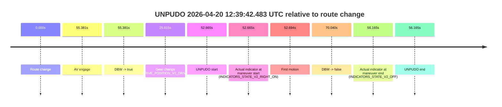
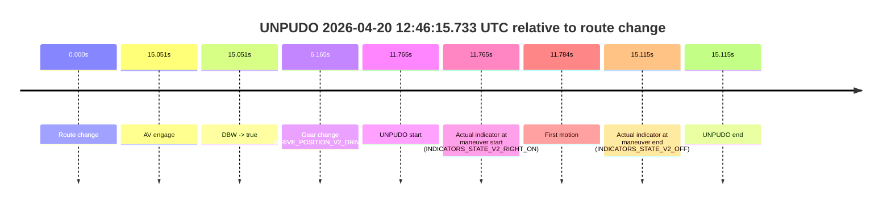

# Run Report: fme20036/2026-04-20--12-33-13--gen2-av-4752f44f-a4fe-432e-8852-7367c2178da9

| Field | Value |
|---|---|
| Run ID | `fme20036/2026-04-20--12-33-13--gen2-av-4752f44f-a4fe-432e-8852-7367c2178da9` |
| Date | `2026-04-20` |
| Model(s) | `blue-panther-solid` |
| Author | `guy.geva` |
| Event count | `2` |

## unpudo 2026-04-20 12:39:42.483 UTC

| Field | Value |
|---|---|
| Model | `blue-panther-solid` |
| Author | `guy.geva` |
| Run ID | `fme20036/2026-04-20--12-33-13--gen2-av-4752f44f-a4fe-432e-8852-7367c2178da9` |
| Date | `2026-04-20` |
| Time (UTC) | `12:39:42.483` |
| Event type | `unpudo` |
| Disengagement type | `none observed` |
| Route change | `found` |
| Console | [run](https://console.sso.wayve.ai/run/fme20036/2026-04-20--12-33-13--gen2-av-4752f44f-a4fe-432e-8852-7367c2178da9?id=&time-unixus=1776688782483315) |
| Foxglove | [segment](https://app.foxglove.dev/wayve-on-prem/p/prj_0dX18KZdVHg1fmmI/view?ds=foxglove-stream&ds.deviceName=fme20036&ds.start=2026-04-20T12%3A38%3A39.818263Z&ds.end=2026-04-20T12%3A40%3A09.858654Z&layoutId=lay_0e7VD4WIKDQGU73Y&time=2026-04-20T12%3A39%3A42.483315Z) |

### Event card: fail

- Fail: the credited unpudo does not stay AV-owned. The event window starts with DBW false, and the maneuver outcome lands outside a clean AV-owned segment.

| Event | Time (UTC) | Delta from route change |
|---|---:|---:|
| Route change | 2026-04-20 12:38:49.818 | `0.000s` |
| AV engage | 2026-04-20 12:39:45.198 | `55.381s` |
| DBW -> true | 2026-04-20 12:39:45.198 | `55.381s` |
| Gear change (DRIVE_POSITION_V2_DRIVE) | 2026-04-20 12:39:15.633 | `25.815s` |
| UNPUDO start | 2026-04-20 12:39:42.483 | `52.665s` |
| Actual indicator at maneuver start (INDICATORS_STATE_V2_RIGHT_ON) | 2026-04-20 12:39:42.483 | `52.665s` |
| First motion | 2026-04-20 12:39:42.512 | `52.694s` |
| DBW -> false | 2026-04-20 12:39:59.858 | `70.040s` |
| Actual indicator at maneuver end (INDICATORS_STATE_V2_OFF) | 2026-04-20 12:39:45.983 | `56.165s` |
| UNPUDO end | 2026-04-20 12:39:45.983 | `56.165s` |

| Metric | Value |
|---|---|
| Outcome | `fail` |
| Effective failure type | `completed_outside_av` |
| Route change status | `found` |
| DBW at event start | `false` |
| DBW at event end | `true` |
| Predicted gear at AV start | `DRIVE_POSITION_V2_DRIVE` |
| Actual gear at AV start | `DRIVE_POSITION_V2_DRIVE` |
| Predicted gear at event start | `DRIVE_POSITION_V2_DRIVE` |
| Actual gear at event start | `DRIVE_POSITION_V2_DRIVE` |
| Planned indicator direction | `INDICATORS_STATE_V2_LEFT_ON` |
| Controller indicator direction | `INDICATORS_STATE_V2_LEFT_ON` |
| Actual indicator direction | `INDICATORS_STATE_V2_RIGHT_ON` |
| Actual indicator at maneuver end | `INDICATORS_STATE_V2_OFF` |
| Driver accel help in AV | `false` |
| Driver accel help timestamp | `n/a` |
| Max accel pedal pct in AV | `0.0%` |
| Max brake pedal pct in AV | `0.0%` |
| Max speed mps in AV | `4.703` |
| Route -> AV | `55.381s` |
| AV -> event start | `-2.716s` |
| AV -> first motion | `-2.686s` |
| AV duration before disengagement | `14.660s` |
| Trajectory waypoint count | `37` |
| Driving-plan step count | `11` |

The scored portion starts from the AV-owned window, not from the pre-AV setup. Route-change search in the stopped pre-event segment was `found`, with the baseline therefore set to route change. At the event anchor the model predicts `DRIVE_POSITION_V2_DRIVE` and the actual gear is `DRIVE_POSITION_V2_DRIVE`. The effective model outcome is `fail` because `completed_outside_av`.

### Resolution

| Field | Value |
|---|---|
| Final outcome | `fail` |
| Do we agree with this label? | `yes` |
| Source disengagement type | `none observed` |
| Resolved effective failure type | `completed_outside_av` |
| Confidence | `high` |

## unpudo 2026-04-20 12:46:15.733 UTC

| Field | Value |
|---|---|
| Model | `blue-panther-solid` |
| Author | `guy.geva` |
| Run ID | `fme20036/2026-04-20--12-33-13--gen2-av-4752f44f-a4fe-432e-8852-7367c2178da9` |
| Date | `2026-04-20` |
| Time (UTC) | `12:46:15.733` |
| Event type | `unpudo` |
| Disengagement type | `none observed` |
| Route change | `found` |
| Console | [run](https://console.sso.wayve.ai/run/fme20036/2026-04-20--12-33-13--gen2-av-4752f44f-a4fe-432e-8852-7367c2178da9?id=&time-unixus=1776689175733299) |
| Foxglove | [segment](https://app.foxglove.dev/wayve-on-prem/p/prj_0dX18KZdVHg1fmmI/view?ds=foxglove-stream&ds.deviceName=fme20036&ds.start=2026-04-20T12%3A45%3A53.968290Z&ds.end=2026-04-20T12%3A46%3A29.083296Z&layoutId=lay_0e7VD4WIKDQGU73Y&time=2026-04-20T12%3A46%3A15.733299Z) |

### Event card: fail

- Fail: the credited unpudo does not stay AV-owned. The event window starts with DBW false, and the maneuver outcome lands outside a clean AV-owned segment.

| Event | Time (UTC) | Delta from route change |
|---|---:|---:|
| Route change | 2026-04-20 12:46:03.968 | `0.000s` |
| AV engage | 2026-04-20 12:46:19.018 | `15.051s` |
| DBW -> true | 2026-04-20 12:46:19.018 | `15.051s` |
| Gear change (DRIVE_POSITION_V2_DRIVE) | 2026-04-20 12:46:10.133 | `6.165s` |
| UNPUDO start | 2026-04-20 12:46:15.733 | `11.765s` |
| Actual indicator at maneuver start (INDICATORS_STATE_V2_RIGHT_ON) | 2026-04-20 12:46:15.733 | `11.765s` |
| First motion | 2026-04-20 12:46:15.752 | `11.784s` |
| Actual indicator at maneuver end (INDICATORS_STATE_V2_OFF) | 2026-04-20 12:46:19.083 | `15.115s` |
| UNPUDO end | 2026-04-20 12:46:19.083 | `15.115s` |

| Metric | Value |
|---|---|
| Outcome | `fail` |
| Effective failure type | `completed_outside_av` |
| Route change status | `found` |
| DBW at event start | `false` |
| DBW at event end | `true` |
| Predicted gear at AV start | `DRIVE_POSITION_V2_DRIVE` |
| Actual gear at AV start | `DRIVE_POSITION_V2_DRIVE` |
| Predicted gear at event start | `DRIVE_POSITION_V2_DRIVE` |
| Actual gear at event start | `DRIVE_POSITION_V2_DRIVE` |
| Planned indicator direction | `INDICATORS_STATE_V2_OFF` |
| Controller indicator direction | `INDICATORS_STATE_V2_OFF` |
| Actual indicator direction | `INDICATORS_STATE_V2_RIGHT_ON` |
| Actual indicator at maneuver end | `INDICATORS_STATE_V2_OFF` |
| Driver accel help in AV | `false` |
| Driver accel help timestamp | `n/a` |
| Max accel pedal pct in AV | `0.0%` |
| Max brake pedal pct in AV | `0.0%` |
| Max speed mps in AV | `5.864` |
| Route -> AV | `15.051s` |
| AV -> event start | `-3.286s` |
| AV -> first motion | `-3.266s` |
| AV duration before disengagement | `n/a` |
| Trajectory waypoint count | `36` |
| Driving-plan step count | `11` |

The scored portion starts from the AV-owned window, not from the pre-AV setup. Route-change search in the stopped pre-event segment was `found`, with the baseline therefore set to route change. At the event anchor the model predicts `DRIVE_POSITION_V2_DRIVE` and the actual gear is `DRIVE_POSITION_V2_DRIVE`. The effective model outcome is `fail` because `completed_outside_av`.

### Resolution

| Field | Value |
|---|---|
| Final outcome | `fail` |
| Do we agree with this label? | `yes` |
| Source disengagement type | `none observed` |
| Resolved effective failure type | `completed_outside_av` |
| Confidence | `high` |
