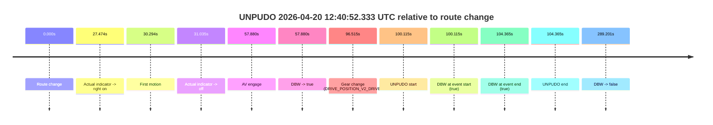
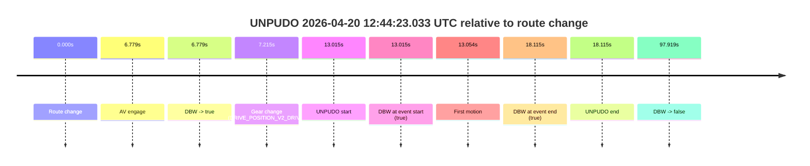
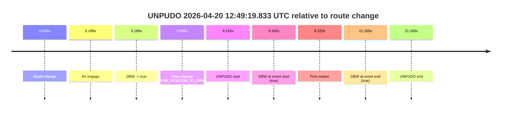

# Run Report: fme20036/2026-04-20--12-33-13--gen2-av-4752f44f-a4fe-432e-8852-7367c2178da9

| Field | Value |
|---|---|
| Run ID | `fme20036/2026-04-20--12-33-13--gen2-av-4752f44f-a4fe-432e-8852-7367c2178da9` |
| Date | `2026-04-20` |
| Model(s) | `eel-teal-outspoken` |
| Author | `zak` |
| Event count | `3` |

## unpudo 2026-04-20 12:40:52.333 UTC

| Field | Value |
|---|---|
| Model | `eel-teal-outspoken` |
| Author | `zak` |
| Run ID | `fme20036/2026-04-20--12-33-13--gen2-av-4752f44f-a4fe-432e-8852-7367c2178da9` |
| Date | `2026-04-20` |
| Time (UTC) | `12:40:52.333` |
| Event type | `unpudo` |
| Disengagement type | `none observed` |
| Route change | `found` |
| Console | [run](https://console.sso.wayve.ai/run/fme20036/2026-04-20--12-33-13--gen2-av-4752f44f-a4fe-432e-8852-7367c2178da9?id=&time-unixus=1776688852333310) |
| Foxglove | [segment](https://app.foxglove.dev/wayve-on-prem/p/prj_0dX18KZdVHg1fmmI/view?ds=foxglove-stream&ds.deviceName=fme20036&ds.start=2026-04-20T12%3A39%3A02.218254Z&ds.end=2026-04-20T12%3A44%3A11.418973Z&layoutId=lay_0e7VD4WIKDQGU73Y&time=2026-04-20T12%3A40%3A52.333310Z) |

### Event card: pass

- Pass: AV owns the credited unpudo from route change through the official unpudo window, the gear state is aligned at the anchor, and the vehicle moves without driver accelerator help in AV.

| Event | Time (UTC) | Delta from route change |
|---|---:|---:|
| Route change | 2026-04-20 12:39:12.218 | `0.000s` |
| Actual indicator -> right on | 2026-04-20 12:39:39.692 | `27.474s` |
| First motion | 2026-04-20 12:39:42.512 | `30.294s` |
| Actual indicator -> off | 2026-04-20 12:39:43.252 | `31.035s` |
| AV engage | 2026-04-20 12:40:10.098 | `57.880s` |
| DBW -> true | 2026-04-20 12:40:10.098 | `57.880s` |
| Gear change (DRIVE_POSITION_V2_DRIVE) | 2026-04-20 12:40:48.733 | `96.515s` |
| UNPUDO start | 2026-04-20 12:40:52.333 | `100.115s` |
| DBW at event start (true) | 2026-04-20 12:40:52.333 | `100.115s` |
| DBW at event end (true) | 2026-04-20 12:40:56.583 | `104.365s` |
| UNPUDO end | 2026-04-20 12:40:56.583 | `104.365s` |
| DBW -> false | 2026-04-20 12:44:01.418 | `289.201s` |

| Metric | Value |
|---|---|
| Outcome | `pass` |
| Effective failure type | `none` |
| Route change status | `found` |
| DBW at event start | `true` |
| DBW at event end | `true` |
| Predicted gear at AV start | `DRIVE_POSITION_V2_DRIVE` |
| Actual gear at AV start | `DRIVE_POSITION_V2_DRIVE` |
| Predicted gear at event start | `DRIVE_POSITION_V2_DRIVE` |
| Actual gear at event start | `DRIVE_POSITION_V2_DRIVE` |
| Planned indicator direction | `INDICATORS_STATE_V2_RIGHT_ON` |
| Controller indicator direction | `INDICATORS_STATE_V2_RIGHT_ON` |
| Actual indicator direction | `INDICATORS_STATE_V2_OFF` |
| Actual indicator at maneuver end | `INDICATORS_STATE_V2_OFF` |
| Driver accel help in AV | `false` |
| Driver accel help timestamp | `n/a` |
| Max accel pedal pct in AV | `0.0%` |
| Max brake pedal pct in AV | `17.2%` |
| Max speed mps in AV | `7.039` |
| Success timing baseline | `route change` |
| Route -> AV | `57.880s` |
| AV -> event start | `42.235s` |
| AV -> first motion | `-27.586s` |
| Success baseline -> event start | `100.115s` |
| Success baseline -> first motion | `30.294s` |
| AV duration before disengagement | `231.320s` |
| Trajectory waypoint count | `36` |
| Driving-plan step count | `11` |

The scored portion starts from the AV-owned window, not from the pre-AV setup. Route-change search in the stopped pre-event segment was `found`, with the baseline therefore set to route change. At the event anchor the model predicts `DRIVE_POSITION_V2_DRIVE` and the actual gear is `DRIVE_POSITION_V2_DRIVE`. The effective model outcome is `pass` because `the credited unpudo stays AV-owned through the official unpudo window.`

### Resolution

| Field | Value |
|---|---|
| Final outcome | `pass` |
| Do we agree with this label? | `yes` |
| Source disengagement type | `none observed` |
| Resolved effective failure type | `none` |
| Confidence | `high` |

## unpudo 2026-04-20 12:44:23.033 UTC

| Field | Value |
|---|---|
| Model | `eel-teal-outspoken` |
| Author | `zak` |
| Run ID | `fme20036/2026-04-20--12-33-13--gen2-av-4752f44f-a4fe-432e-8852-7367c2178da9` |
| Date | `2026-04-20` |
| Time (UTC) | `12:44:23.033` |
| Event type | `unpudo` |
| Disengagement type | `none observed` |
| Route change | `found` |
| Console | [run](https://console.sso.wayve.ai/run/fme20036/2026-04-20--12-33-13--gen2-av-4752f44f-a4fe-432e-8852-7367c2178da9?id=&time-unixus=1776689063033298) |
| Foxglove | [segment](https://app.foxglove.dev/wayve-on-prem/p/prj_0dX18KZdVHg1fmmI/view?ds=foxglove-stream&ds.deviceName=fme20036&ds.start=2026-04-20T12%3A44%3A00.018381Z&ds.end=2026-04-20T12%3A45%3A57.937771Z&layoutId=lay_0e7VD4WIKDQGU73Y&time=2026-04-20T12%3A44%3A23.033298Z) |

### Event card: pass

- Pass: AV owns the credited unpudo from route change through the official unpudo window, the gear state is aligned at the anchor, and the vehicle moves without driver accelerator help in AV.

| Event | Time (UTC) | Delta from route change |
|---|---:|---:|
| Route change | 2026-04-20 12:44:10.018 | `0.000s` |
| AV engage | 2026-04-20 12:44:16.797 | `6.779s` |
| DBW -> true | 2026-04-20 12:44:16.797 | `6.779s` |
| Gear change (DRIVE_POSITION_V2_DRIVE) | 2026-04-20 12:44:17.233 | `7.215s` |
| UNPUDO start | 2026-04-20 12:44:23.033 | `13.015s` |
| DBW at event start (true) | 2026-04-20 12:44:23.033 | `13.015s` |
| First motion | 2026-04-20 12:44:23.072 | `13.054s` |
| DBW at event end (true) | 2026-04-20 12:44:28.133 | `18.115s` |
| UNPUDO end | 2026-04-20 12:44:28.133 | `18.115s` |
| DBW -> false | 2026-04-20 12:45:47.937 | `97.919s` |

| Metric | Value |
|---|---|
| Outcome | `pass` |
| Effective failure type | `none` |
| Route change status | `found` |
| DBW at event start | `true` |
| DBW at event end | `true` |
| Predicted gear at AV start | `DRIVE_POSITION_V2_DRIVE` |
| Actual gear at AV start | `DRIVE_POSITION_V2_PARK` |
| Predicted gear at event start | `DRIVE_POSITION_V2_DRIVE` |
| Actual gear at event start | `DRIVE_POSITION_V2_DRIVE` |
| Planned indicator direction | `INDICATORS_STATE_V2_RIGHT_ON` |
| Controller indicator direction | `INDICATORS_STATE_V2_RIGHT_ON` |
| Actual indicator direction | `INDICATORS_STATE_V2_OFF` |
| Actual indicator at maneuver end | `INDICATORS_STATE_V2_OFF` |
| Driver accel help in AV | `false` |
| Driver accel help timestamp | `n/a` |
| Max accel pedal pct in AV | `0.0%` |
| Max brake pedal pct in AV | `8.0%` |
| Max speed mps in AV | `3.533` |
| Success timing baseline | `route change` |
| Route -> AV | `6.779s` |
| AV -> event start | `6.235s` |
| AV -> first motion | `6.275s` |
| Success baseline -> event start | `13.015s` |
| Success baseline -> first motion | `13.054s` |
| AV duration before disengagement | `91.140s` |
| Trajectory waypoint count | `37` |
| Driving-plan step count | `11` |

The scored portion starts from the AV-owned window, not from the pre-AV setup. Route-change search in the stopped pre-event segment was `found`, with the baseline therefore set to route change. At the event anchor the model predicts `DRIVE_POSITION_V2_DRIVE` and the actual gear is `DRIVE_POSITION_V2_DRIVE`. The effective model outcome is `pass` because `the credited unpudo stays AV-owned through the official unpudo window.`

### Resolution

| Field | Value |
|---|---|
| Final outcome | `pass` |
| Do we agree with this label? | `yes` |
| Source disengagement type | `none observed` |
| Resolved effective failure type | `none` |
| Confidence | `high` |

## unpudo 2026-04-20 12:49:19.833 UTC

| Field | Value |
|---|---|
| Model | `eel-teal-outspoken` |
| Author | `zak` |
| Run ID | `fme20036/2026-04-20--12-33-13--gen2-av-4752f44f-a4fe-432e-8852-7367c2178da9` |
| Date | `2026-04-20` |
| Time (UTC) | `12:49:19.833` |
| Event type | `unpudo` |
| Disengagement type | `none observed` |
| Route change | `found` |
| Console | [run](https://console.sso.wayve.ai/run/fme20036/2026-04-20--12-33-13--gen2-av-4752f44f-a4fe-432e-8852-7367c2178da9?id=&time-unixus=1776689359833294) |
| Foxglove | [segment](https://app.foxglove.dev/wayve-on-prem/p/prj_0dX18KZdVHg1fmmI/view?ds=foxglove-stream&ds.deviceName=fme20036&ds.start=2026-04-20T12%3A49%3A00.668266Z&ds.end=2026-04-20T12%3A49%3A41.833300Z&layoutId=lay_0e7VD4WIKDQGU73Y&time=2026-04-20T12%3A49%3A19.833294Z) |

### Event card: pass

- Pass: AV owns the credited unpudo from route change through the official unpudo window, the gear state is aligned at the anchor, and the vehicle moves without driver accelerator help in AV.

| Event | Time (UTC) | Delta from route change |
|---|---:|---:|
| Route change | 2026-04-20 12:49:10.668 | `0.000s` |
| AV engage | 2026-04-20 12:49:15.857 | `5.189s` |
| DBW -> true | 2026-04-20 12:49:15.857 | `5.189s` |
| Gear change (DRIVE_POSITION_V2_DRIVE) | 2026-04-20 12:49:16.333 | `5.665s` |
| UNPUDO start | 2026-04-20 12:49:19.833 | `9.165s` |
| DBW at event start (true) | 2026-04-20 12:49:19.833 | `9.165s` |
| First motion | 2026-04-20 12:49:19.892 | `9.225s` |
| DBW at event end (true) | 2026-04-20 12:49:31.833 | `21.165s` |
| UNPUDO end | 2026-04-20 12:49:31.833 | `21.165s` |

| Metric | Value |
|---|---|
| Outcome | `pass` |
| Effective failure type | `none` |
| Route change status | `found` |
| DBW at event start | `true` |
| DBW at event end | `true` |
| Predicted gear at AV start | `DRIVE_POSITION_V2_DRIVE` |
| Actual gear at AV start | `DRIVE_POSITION_V2_PARK` |
| Predicted gear at event start | `DRIVE_POSITION_V2_DRIVE` |
| Actual gear at event start | `DRIVE_POSITION_V2_DRIVE` |
| Planned indicator direction | `INDICATORS_STATE_V2_OFF` |
| Controller indicator direction | `INDICATORS_STATE_V2_OFF` |
| Actual indicator direction | `INDICATORS_STATE_V2_OFF` |
| Actual indicator at maneuver end | `INDICATORS_STATE_V2_OFF` |
| Driver accel help in AV | `false` |
| Driver accel help timestamp | `n/a` |
| Max accel pedal pct in AV | `0.0%` |
| Max brake pedal pct in AV | `8.0%` |
| Max speed mps in AV | `2.400` |
| Success timing baseline | `route change` |
| Route -> AV | `5.189s` |
| AV -> event start | `3.976s` |
| AV -> first motion | `4.036s` |
| Success baseline -> event start | `9.165s` |
| Success baseline -> first motion | `9.225s` |
| AV duration before disengagement | `n/a` |
| Trajectory waypoint count | `35` |
| Driving-plan step count | `11` |

The scored portion starts from the AV-owned window, not from the pre-AV setup. Route-change search in the stopped pre-event segment was `found`, with the baseline therefore set to route change. At the event anchor the model predicts `DRIVE_POSITION_V2_DRIVE` and the actual gear is `DRIVE_POSITION_V2_DRIVE`. The effective model outcome is `pass` because `the credited unpudo stays AV-owned through the official unpudo window.`

### Resolution

| Field | Value |
|---|---|
| Final outcome | `pass` |
| Do we agree with this label? | `yes` |
| Source disengagement type | `none observed` |
| Resolved effective failure type | `none` |
| Confidence | `high` |
