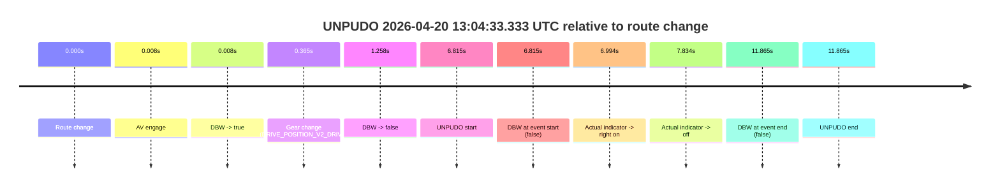
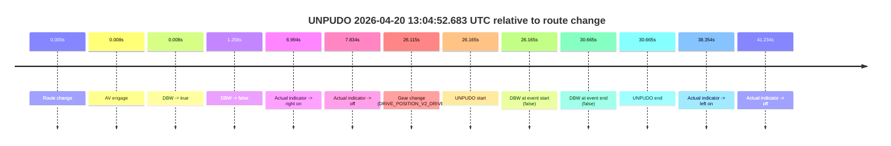
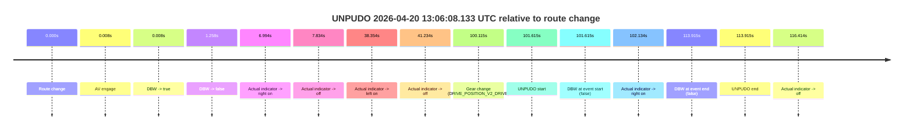
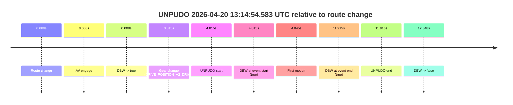

# Run Report: fme20036/2026-04-20--12-58-10--gen2-av-7b765d6a-673a-49d8-8393-4d7eb694735b

| Field | Value |
|---|---|
| Run ID | `fme20036/2026-04-20--12-58-10--gen2-av-7b765d6a-673a-49d8-8393-4d7eb694735b` |
| Date | `2026-04-20` |
| Model(s) | `eel-teal-outspoken` |
| Author | `zak` |
| Event count | `4` |

## unpudo 2026-04-20 13:04:33.333 UTC

| Field | Value |
|---|---|
| Model | `eel-teal-outspoken` |
| Author | `zak` |
| Run ID | `fme20036/2026-04-20--12-58-10--gen2-av-7b765d6a-673a-49d8-8393-4d7eb694735b` |
| Date | `2026-04-20` |
| Time (UTC) | `13:04:33.333` |
| Event type | `unpudo` |
| Disengagement type | `none observed` |
| Route change | `found` |
| Console | [run](https://console.sso.wayve.ai/run/fme20036/2026-04-20--12-58-10--gen2-av-7b765d6a-673a-49d8-8393-4d7eb694735b?id=&time-unixus=1776690273333309) |
| Foxglove | [segment](https://app.foxglove.dev/wayve-on-prem/p/prj_0dX18KZdVHg1fmmI/view?ds=foxglove-stream&ds.deviceName=fme20036&ds.start=2026-04-20T13%3A04%3A16.518261Z&ds.end=2026-04-20T13%3A04%3A48.383298Z&layoutId=lay_0e7VD4WIKDQGU73Y&time=2026-04-20T13%3A04%3A33.333309Z) |

### Event card: accidental

- Accidental: AV ownership is present for less than `2s`, so this is treated as an accidental brush with the maneuver rather than a meaningful model attempt.

| Event | Time (UTC) | Delta from route change |
|---|---:|---:|
| Route change | 2026-04-20 13:04:26.518 | `0.000s` |
| AV engage | 2026-04-20 13:04:26.526 | `0.008s` |
| DBW -> true | 2026-04-20 13:04:26.526 | `0.008s` |
| Gear change (DRIVE_POSITION_V2_DRIVE) | 2026-04-20 13:04:26.883 | `0.365s` |
| DBW -> false | 2026-04-20 13:04:27.776 | `1.258s` |
| UNPUDO start | 2026-04-20 13:04:33.333 | `6.815s` |
| DBW at event start (false) | 2026-04-20 13:04:33.333 | `6.815s` |
| Actual indicator -> right on | 2026-04-20 13:04:33.512 | `6.994s` |
| Actual indicator -> off | 2026-04-20 13:04:34.352 | `7.834s` |
| DBW at event end (false) | 2026-04-20 13:04:38.383 | `11.865s` |
| UNPUDO end | 2026-04-20 13:04:38.383 | `11.865s` |

| Metric | Value |
|---|---|
| Outcome | `accidental` |
| Effective failure type | `none` |
| Route change status | `found` |
| DBW at event start | `false` |
| DBW at event end | `false` |
| Predicted gear at AV start | `DRIVE_POSITION_V2_PARK` |
| Actual gear at AV start | `DRIVE_POSITION_V2_PARK` |
| Predicted gear at event start | `DRIVE_POSITION_V2_DRIVE` |
| Actual gear at event start | `DRIVE_POSITION_V2_DRIVE` |
| Planned indicator direction | `INDICATORS_STATE_V2_RIGHT_ON` |
| Controller indicator direction | `INDICATORS_STATE_V2_RIGHT_ON` |
| Actual indicator direction | `INDICATORS_STATE_V2_OFF` |
| Actual indicator at maneuver end | `INDICATORS_STATE_V2_OFF` |
| Driver accel help in AV | `false` |
| Driver accel help timestamp | `n/a` |
| Max accel pedal pct in AV | `0.0%` |
| Max brake pedal pct in AV | `8.0%` |
| Max speed mps in AV | `0.000` |
| Success timing baseline | `route change` |
| Route -> AV | `0.008s` |
| AV -> event start | `6.807s` |
| AV -> first motion | `n/a` |
| Success baseline -> event start | `6.815s` |
| Success baseline -> first motion | `n/a` |
| AV duration before disengagement | `1.250s` |
| Trajectory waypoint count | `37` |
| Driving-plan step count | `11` |

The scored portion starts from the AV-owned window, not from the pre-AV setup. Route-change search in the stopped pre-event segment was `found`, with the baseline therefore set to route change. At the event anchor the model predicts `DRIVE_POSITION_V2_DRIVE` and the actual gear is `DRIVE_POSITION_V2_DRIVE`. The effective model outcome is `accidental` because `the AV-owned portion is shorter than 2s.`

### Resolution

| Field | Value |
|---|---|
| Final outcome | `accidental` |
| Do we agree with this label? | `yes` |
| Source disengagement type | `none observed` |
| Resolved effective failure type | `none` |
| Confidence | `high` |

## unpudo 2026-04-20 13:04:52.683 UTC

| Field | Value |
|---|---|
| Model | `eel-teal-outspoken` |
| Author | `zak` |
| Run ID | `fme20036/2026-04-20--12-58-10--gen2-av-7b765d6a-673a-49d8-8393-4d7eb694735b` |
| Date | `2026-04-20` |
| Time (UTC) | `13:04:52.683` |
| Event type | `unpudo` |
| Disengagement type | `none observed` |
| Route change | `found` |
| Console | [run](https://console.sso.wayve.ai/run/fme20036/2026-04-20--12-58-10--gen2-av-7b765d6a-673a-49d8-8393-4d7eb694735b?id=&time-unixus=1776690292683321) |
| Foxglove | [segment](https://app.foxglove.dev/wayve-on-prem/p/prj_0dX18KZdVHg1fmmI/view?ds=foxglove-stream&ds.deviceName=fme20036&ds.start=2026-04-20T13%3A04%3A16.518261Z&ds.end=2026-04-20T13%3A05%3A07.183304Z&layoutId=lay_0e7VD4WIKDQGU73Y&time=2026-04-20T13%3A04%3A52.683321Z) |

### Event card: accidental

- Accidental: AV ownership is present for less than `2s`, so this is treated as an accidental brush with the maneuver rather than a meaningful model attempt.

| Event | Time (UTC) | Delta from route change |
|---|---:|---:|
| Route change | 2026-04-20 13:04:26.518 | `0.000s` |
| AV engage | 2026-04-20 13:04:26.526 | `0.008s` |
| DBW -> true | 2026-04-20 13:04:26.526 | `0.008s` |
| DBW -> false | 2026-04-20 13:04:27.776 | `1.258s` |
| Actual indicator -> right on | 2026-04-20 13:04:33.512 | `6.994s` |
| Actual indicator -> off | 2026-04-20 13:04:34.352 | `7.834s` |
| Gear change (DRIVE_POSITION_V2_DRIVE) | 2026-04-20 13:04:52.633 | `26.115s` |
| UNPUDO start | 2026-04-20 13:04:52.683 | `26.165s` |
| DBW at event start (false) | 2026-04-20 13:04:52.683 | `26.165s` |
| DBW at event end (false) | 2026-04-20 13:04:57.183 | `30.665s` |
| UNPUDO end | 2026-04-20 13:04:57.183 | `30.665s` |
| Actual indicator -> left on | 2026-04-20 13:05:04.872 | `38.354s` |
| Actual indicator -> off | 2026-04-20 13:05:07.752 | `41.234s` |

| Metric | Value |
|---|---|
| Outcome | `accidental` |
| Effective failure type | `none` |
| Route change status | `found` |
| DBW at event start | `false` |
| DBW at event end | `false` |
| Predicted gear at AV start | `DRIVE_POSITION_V2_PARK` |
| Actual gear at AV start | `DRIVE_POSITION_V2_PARK` |
| Predicted gear at event start | `DRIVE_POSITION_V2_DRIVE` |
| Actual gear at event start | `DRIVE_POSITION_V2_DRIVE` |
| Planned indicator direction | `INDICATORS_STATE_V2_OFF` |
| Controller indicator direction | `INDICATORS_STATE_V2_OFF` |
| Actual indicator direction | `INDICATORS_STATE_V2_OFF` |
| Actual indicator at maneuver end | `INDICATORS_STATE_V2_OFF` |
| Driver accel help in AV | `false` |
| Driver accel help timestamp | `n/a` |
| Max accel pedal pct in AV | `0.0%` |
| Max brake pedal pct in AV | `8.0%` |
| Max speed mps in AV | `0.000` |
| Success timing baseline | `route change` |
| Route -> AV | `0.008s` |
| AV -> event start | `26.157s` |
| AV -> first motion | `n/a` |
| Success baseline -> event start | `26.165s` |
| Success baseline -> first motion | `n/a` |
| AV duration before disengagement | `1.250s` |
| Trajectory waypoint count | `37` |
| Driving-plan step count | `11` |

The scored portion starts from the AV-owned window, not from the pre-AV setup. Route-change search in the stopped pre-event segment was `found`, with the baseline therefore set to route change. At the event anchor the model predicts `DRIVE_POSITION_V2_DRIVE` and the actual gear is `DRIVE_POSITION_V2_DRIVE`. The effective model outcome is `accidental` because `the AV-owned portion is shorter than 2s.`

### Resolution

| Field | Value |
|---|---|
| Final outcome | `accidental` |
| Do we agree with this label? | `yes` |
| Source disengagement type | `none observed` |
| Resolved effective failure type | `none` |
| Confidence | `high` |

## unpudo 2026-04-20 13:06:08.133 UTC

| Field | Value |
|---|---|
| Model | `eel-teal-outspoken` |
| Author | `zak` |
| Run ID | `fme20036/2026-04-20--12-58-10--gen2-av-7b765d6a-673a-49d8-8393-4d7eb694735b` |
| Date | `2026-04-20` |
| Time (UTC) | `13:06:08.133` |
| Event type | `unpudo` |
| Disengagement type | `none observed` |
| Route change | `found` |
| Console | [run](https://console.sso.wayve.ai/run/fme20036/2026-04-20--12-58-10--gen2-av-7b765d6a-673a-49d8-8393-4d7eb694735b?id=&time-unixus=1776690368133318) |
| Foxglove | [segment](https://app.foxglove.dev/wayve-on-prem/p/prj_0dX18KZdVHg1fmmI/view?ds=foxglove-stream&ds.deviceName=fme20036&ds.start=2026-04-20T13%3A04%3A16.518261Z&ds.end=2026-04-20T13%3A06%3A30.433304Z&layoutId=lay_0e7VD4WIKDQGU73Y&time=2026-04-20T13%3A06%3A08.133318Z) |

### Event card: accidental

- Accidental: AV ownership is present for less than `2s`, so this is treated as an accidental brush with the maneuver rather than a meaningful model attempt.

| Event | Time (UTC) | Delta from route change |
|---|---:|---:|
| Route change | 2026-04-20 13:04:26.518 | `0.000s` |
| AV engage | 2026-04-20 13:04:26.526 | `0.008s` |
| DBW -> true | 2026-04-20 13:04:26.526 | `0.008s` |
| DBW -> false | 2026-04-20 13:04:27.776 | `1.258s` |
| Actual indicator -> right on | 2026-04-20 13:04:33.512 | `6.994s` |
| Actual indicator -> off | 2026-04-20 13:04:34.352 | `7.834s` |
| Actual indicator -> left on | 2026-04-20 13:05:04.872 | `38.354s` |
| Actual indicator -> off | 2026-04-20 13:05:07.752 | `41.234s` |
| Gear change (DRIVE_POSITION_V2_DRIVE) | 2026-04-20 13:06:06.633 | `100.115s` |
| UNPUDO start | 2026-04-20 13:06:08.133 | `101.615s` |
| DBW at event start (false) | 2026-04-20 13:06:08.133 | `101.615s` |
| Actual indicator -> right on | 2026-04-20 13:06:08.652 | `102.134s` |
| DBW at event end (false) | 2026-04-20 13:06:20.433 | `113.915s` |
| UNPUDO end | 2026-04-20 13:06:20.433 | `113.915s` |
| Actual indicator -> off | 2026-04-20 13:06:22.932 | `116.414s` |

| Metric | Value |
|---|---|
| Outcome | `accidental` |
| Effective failure type | `none` |
| Route change status | `found` |
| DBW at event start | `false` |
| DBW at event end | `false` |
| Predicted gear at AV start | `DRIVE_POSITION_V2_PARK` |
| Actual gear at AV start | `DRIVE_POSITION_V2_PARK` |
| Predicted gear at event start | `DRIVE_POSITION_V2_DRIVE` |
| Actual gear at event start | `DRIVE_POSITION_V2_DRIVE` |
| Planned indicator direction | `INDICATORS_STATE_V2_OFF` |
| Controller indicator direction | `INDICATORS_STATE_V2_OFF` |
| Actual indicator direction | `INDICATORS_STATE_V2_OFF` |
| Actual indicator at maneuver end | `INDICATORS_STATE_V2_RIGHT_ON` |
| Driver accel help in AV | `false` |
| Driver accel help timestamp | `n/a` |
| Max accel pedal pct in AV | `0.0%` |
| Max brake pedal pct in AV | `8.0%` |
| Max speed mps in AV | `0.000` |
| Success timing baseline | `route change` |
| Route -> AV | `0.008s` |
| AV -> event start | `101.607s` |
| AV -> first motion | `n/a` |
| Success baseline -> event start | `101.615s` |
| Success baseline -> first motion | `n/a` |
| AV duration before disengagement | `1.250s` |
| Trajectory waypoint count | `37` |
| Driving-plan step count | `11` |

The scored portion starts from the AV-owned window, not from the pre-AV setup. Route-change search in the stopped pre-event segment was `found`, with the baseline therefore set to route change. At the event anchor the model predicts `DRIVE_POSITION_V2_DRIVE` and the actual gear is `DRIVE_POSITION_V2_DRIVE`. The effective model outcome is `accidental` because `the AV-owned portion is shorter than 2s.`

### Resolution

| Field | Value |
|---|---|
| Final outcome | `accidental` |
| Do we agree with this label? | `yes` |
| Source disengagement type | `none observed` |
| Resolved effective failure type | `none` |
| Confidence | `high` |

## unpudo 2026-04-20 13:14:54.583 UTC

| Field | Value |
|---|---|
| Model | `eel-teal-outspoken` |
| Author | `zak` |
| Run ID | `fme20036/2026-04-20--12-58-10--gen2-av-7b765d6a-673a-49d8-8393-4d7eb694735b` |
| Date | `2026-04-20` |
| Time (UTC) | `13:14:54.583` |
| Event type | `unpudo` |
| Disengagement type | `none observed` |
| Route change | `found` |
| Console | [run](https://console.sso.wayve.ai/run/fme20036/2026-04-20--12-58-10--gen2-av-7b765d6a-673a-49d8-8393-4d7eb694735b?id=&time-unixus=1776690894583298) |
| Foxglove | [segment](https://app.foxglove.dev/wayve-on-prem/p/prj_0dX18KZdVHg1fmmI/view?ds=foxglove-stream&ds.deviceName=fme20036&ds.start=2026-04-20T13%3A14%3A39.768322Z&ds.end=2026-04-20T13%3A15%3A12.616772Z&layoutId=lay_0e7VD4WIKDQGU73Y&time=2026-04-20T13%3A14%3A54.583298Z) |

### Event card: pass

- Pass: AV owns the credited unpudo from route change through the official unpudo window, the gear state is aligned at the anchor, and the vehicle moves without driver accelerator help in AV.

| Event | Time (UTC) | Delta from route change |
|---|---:|---:|
| Route change | 2026-04-20 13:14:49.768 | `0.000s` |
| AV engage | 2026-04-20 13:14:49.776 | `0.008s` |
| DBW -> true | 2026-04-20 13:14:49.776 | `0.008s` |
| Gear change (DRIVE_POSITION_V2_DRIVE) | 2026-04-20 13:14:50.083 | `0.315s` |
| UNPUDO start | 2026-04-20 13:14:54.583 | `4.815s` |
| DBW at event start (true) | 2026-04-20 13:14:54.583 | `4.815s` |
| First motion | 2026-04-20 13:14:54.613 | `4.845s` |
| DBW at event end (true) | 2026-04-20 13:15:01.683 | `11.915s` |
| UNPUDO end | 2026-04-20 13:15:01.683 | `11.915s` |
| DBW -> false | 2026-04-20 13:15:02.616 | `12.848s` |

| Metric | Value |
|---|---|
| Outcome | `pass` |
| Effective failure type | `none` |
| Route change status | `found` |
| DBW at event start | `true` |
| DBW at event end | `true` |
| Predicted gear at AV start | `DRIVE_POSITION_V2_PARK` |
| Actual gear at AV start | `DRIVE_POSITION_V2_PARK` |
| Predicted gear at event start | `DRIVE_POSITION_V2_DRIVE` |
| Actual gear at event start | `DRIVE_POSITION_V2_DRIVE` |
| Planned indicator direction | `INDICATORS_STATE_V2_LEFT_ON` |
| Controller indicator direction | `INDICATORS_STATE_V2_LEFT_ON` |
| Actual indicator direction | `INDICATORS_STATE_V2_OFF` |
| Actual indicator at maneuver end | `INDICATORS_STATE_V2_OFF` |
| Driver accel help in AV | `false` |
| Driver accel help timestamp | `n/a` |
| Max accel pedal pct in AV | `0.0%` |
| Max brake pedal pct in AV | `8.0%` |
| Max speed mps in AV | `2.253` |
| Success timing baseline | `route change` |
| Route -> AV | `0.008s` |
| AV -> event start | `4.807s` |
| AV -> first motion | `4.837s` |
| Success baseline -> event start | `4.815s` |
| Success baseline -> first motion | `4.845s` |
| AV duration before disengagement | `12.841s` |
| Trajectory waypoint count | `36` |
| Driving-plan step count | `11` |

The scored portion starts from the AV-owned window, not from the pre-AV setup. Route-change search in the stopped pre-event segment was `found`, with the baseline therefore set to route change. At the event anchor the model predicts `DRIVE_POSITION_V2_DRIVE` and the actual gear is `DRIVE_POSITION_V2_DRIVE`. The effective model outcome is `pass` because `the credited unpudo stays AV-owned through the official unpudo window.`

### Resolution

| Field | Value |
|---|---|
| Final outcome | `pass` |
| Do we agree with this label? | `yes` |
| Source disengagement type | `none observed` |
| Resolved effective failure type | `none` |
| Confidence | `high` |
