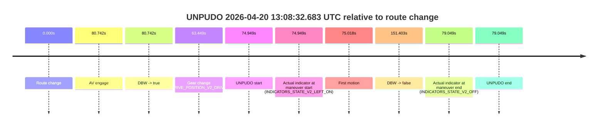
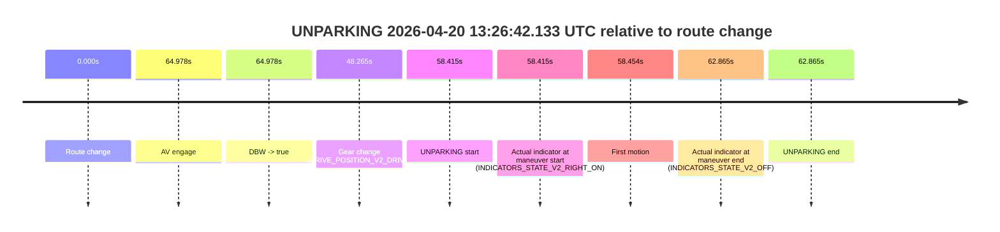

# Run Report: fme20036/2026-04-20--12-58-10--gen2-av-7b765d6a-673a-49d8-8393-4d7eb694735b

| Field | Value |
|---|---|
| Run ID | `fme20036/2026-04-20--12-58-10--gen2-av-7b765d6a-673a-49d8-8393-4d7eb694735b` |
| Date | `2026-04-20` |
| Model(s) | `blue-panther-solid` |
| Author | `guy.geva` |
| Event count | `2` |

## unpudo 2026-04-20 13:08:32.683 UTC

| Field | Value |
|---|---|
| Model | `blue-panther-solid` |
| Author | `guy.geva` |
| Run ID | `fme20036/2026-04-20--12-58-10--gen2-av-7b765d6a-673a-49d8-8393-4d7eb694735b` |
| Date | `2026-04-20` |
| Time (UTC) | `13:08:32.683` |
| Event type | `unpudo` |
| Disengagement type | `none observed` |
| Route change | `found` |
| Console | [run](https://console.sso.wayve.ai/run/fme20036/2026-04-20--12-58-10--gen2-av-7b765d6a-673a-49d8-8393-4d7eb694735b?id=&time-unixus=1776690512683318) |
| Foxglove | [segment](https://app.foxglove.dev/wayve-on-prem/p/prj_0dX18KZdVHg1fmmI/view?ds=foxglove-stream&ds.deviceName=fme20036&ds.start=2026-04-20T13%3A07%3A07.734318Z&ds.end=2026-04-20T13%3A09%3A59.137177Z&layoutId=lay_0e7VD4WIKDQGU73Y&time=2026-04-20T13%3A08%3A32.683318Z) |

### Event card: non-av

- Non-AV: there is no AV-owned portion anywhere inside the detected unpudo timeline, so it is kept for coverage but excluded from model success / failure scoring.

| Event | Time (UTC) | Delta from route change |
|---|---:|---:|
| Route change | 2026-04-20 13:07:17.734 | `0.000s` |
| AV engage | 2026-04-20 13:08:38.475 | `80.742s` |
| DBW -> true | 2026-04-20 13:08:38.475 | `80.742s` |
| Gear change (DRIVE_POSITION_V2_DRIVE) | 2026-04-20 13:08:21.183 | `63.449s` |
| UNPUDO start | 2026-04-20 13:08:32.683 | `74.949s` |
| Actual indicator at maneuver start (INDICATORS_STATE_V2_LEFT_ON) | 2026-04-20 13:08:32.683 | `74.949s` |
| First motion | 2026-04-20 13:08:32.752 | `75.018s` |
| DBW -> false | 2026-04-20 13:09:49.137 | `151.403s` |
| Actual indicator at maneuver end (INDICATORS_STATE_V2_OFF) | 2026-04-20 13:08:36.783 | `79.049s` |
| UNPUDO end | 2026-04-20 13:08:36.783 | `79.049s` |

| Metric | Value |
|---|---|
| Outcome | `non-av` |
| Effective failure type | `none` |
| Route change status | `found` |
| DBW at event start | `false` |
| DBW at event end | `false` |
| Predicted gear at AV start | `DRIVE_POSITION_V2_DRIVE` |
| Actual gear at AV start | `DRIVE_POSITION_V2_DRIVE` |
| Predicted gear at event start | `DRIVE_POSITION_V2_DRIVE` |
| Actual gear at event start | `DRIVE_POSITION_V2_DRIVE` |
| Planned indicator direction | `INDICATORS_STATE_V2_LEFT_ON` |
| Controller indicator direction | `INDICATORS_STATE_V2_LEFT_ON` |
| Actual indicator direction | `INDICATORS_STATE_V2_LEFT_ON` |
| Actual indicator at maneuver end | `INDICATORS_STATE_V2_OFF` |
| Driver accel help in AV | `false` |
| Driver accel help timestamp | `n/a` |
| Max accel pedal pct in AV | `0.0%` |
| Max brake pedal pct in AV | `0.0%` |
| Max speed mps in AV | `0.000` |
| Route -> AV | `80.742s` |
| AV -> event start | `-5.793s` |
| AV -> first motion | `-5.723s` |
| AV duration before disengagement | `70.661s` |
| Trajectory waypoint count | `36` |
| Driving-plan step count | `11` |

The scored portion starts from the AV-owned window, not from the pre-AV setup. Route-change search in the stopped pre-event segment was `found`, with the baseline therefore set to route change. At the event anchor the model predicts `DRIVE_POSITION_V2_DRIVE` and the actual gear is `DRIVE_POSITION_V2_DRIVE`. The effective model outcome is `non-av` because `there is no AV-owned overlap inside the event timeline`.

### Resolution

| Field | Value |
|---|---|
| Final outcome | `non-av` |
| Do we agree with this label? | `yes` |
| Source disengagement type | `none observed` |
| Resolved effective failure type | `none` |
| Confidence | `high` |

## unparking 2026-04-20 13:26:42.133 UTC

| Field | Value |
|---|---|
| Model | `blue-panther-solid` |
| Author | `guy.geva` |
| Run ID | `fme20036/2026-04-20--12-58-10--gen2-av-7b765d6a-673a-49d8-8393-4d7eb694735b` |
| Date | `2026-04-20` |
| Time (UTC) | `13:26:42.133` |
| Event type | `unparking` |
| Disengagement type | `none observed` |
| Route change | `found` |
| Console | [run](https://console.sso.wayve.ai/run/fme20036/2026-04-20--12-58-10--gen2-av-7b765d6a-673a-49d8-8393-4d7eb694735b?id=&time-unixus=1776691602133309) |
| Foxglove | [segment](https://app.foxglove.dev/wayve-on-prem/p/prj_0dX18KZdVHg1fmmI/view?ds=foxglove-stream&ds.deviceName=fme20036&ds.start=2026-04-20T13%3A25%3A33.718795Z&ds.end=2026-04-20T13%3A26%3A56.583319Z&layoutId=lay_0e7VD4WIKDQGU73Y&time=2026-04-20T13%3A26%3A42.133309Z) |

### Event card: non-av

- Non-AV: there is no AV-owned portion anywhere inside the detected unparking timeline, so it is kept for coverage but excluded from model success / failure scoring.

| Event | Time (UTC) | Delta from route change |
|---|---:|---:|
| Route change | 2026-04-20 13:25:43.718 | `0.000s` |
| AV engage | 2026-04-20 13:26:48.697 | `64.978s` |
| DBW -> true | 2026-04-20 13:26:48.697 | `64.978s` |
| Gear change (DRIVE_POSITION_V2_DRIVE) | 2026-04-20 13:26:31.983 | `48.265s` |
| UNPARKING start | 2026-04-20 13:26:42.133 | `58.415s` |
| Actual indicator at maneuver start (INDICATORS_STATE_V2_RIGHT_ON) | 2026-04-20 13:26:42.133 | `58.415s` |
| First motion | 2026-04-20 13:26:42.172 | `58.454s` |
| Actual indicator at maneuver end (INDICATORS_STATE_V2_OFF) | 2026-04-20 13:26:46.583 | `62.865s` |
| UNPARKING end | 2026-04-20 13:26:46.583 | `62.865s` |

| Metric | Value |
|---|---|
| Outcome | `non-av` |
| Effective failure type | `none` |
| Route change status | `found` |
| DBW at event start | `false` |
| DBW at event end | `false` |
| Predicted gear at AV start | `DRIVE_POSITION_V2_DRIVE` |
| Actual gear at AV start | `DRIVE_POSITION_V2_DRIVE` |
| Predicted gear at event start | `DRIVE_POSITION_V2_DRIVE` |
| Actual gear at event start | `DRIVE_POSITION_V2_DRIVE` |
| Planned indicator direction | `INDICATORS_STATE_V2_RIGHT_ON` |
| Controller indicator direction | `INDICATORS_STATE_V2_RIGHT_ON` |
| Actual indicator direction | `INDICATORS_STATE_V2_RIGHT_ON` |
| Actual indicator at maneuver end | `INDICATORS_STATE_V2_OFF` |
| Driver accel help in AV | `false` |
| Driver accel help timestamp | `n/a` |
| Max accel pedal pct in AV | `0.0%` |
| Max brake pedal pct in AV | `0.0%` |
| Max speed mps in AV | `0.000` |
| Route -> AV | `64.978s` |
| AV -> event start | `-6.564s` |
| AV -> first motion | `-6.524s` |
| AV duration before disengagement | `n/a` |
| Trajectory waypoint count | `35` |
| Driving-plan step count | `11` |

The scored portion starts from the AV-owned window, not from the pre-AV setup. Route-change search in the stopped pre-event segment was `found`, with the baseline therefore set to route change. At the event anchor the model predicts `DRIVE_POSITION_V2_DRIVE` and the actual gear is `DRIVE_POSITION_V2_DRIVE`. The effective model outcome is `non-av` because `there is no AV-owned overlap inside the event timeline`.

### Resolution

| Field | Value |
|---|---|
| Final outcome | `non-av` |
| Do we agree with this label? | `yes` |
| Source disengagement type | `none observed` |
| Resolved effective failure type | `none` |
| Confidence | `high` |
