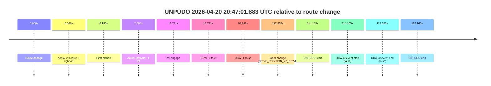
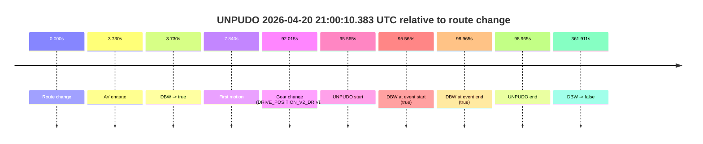
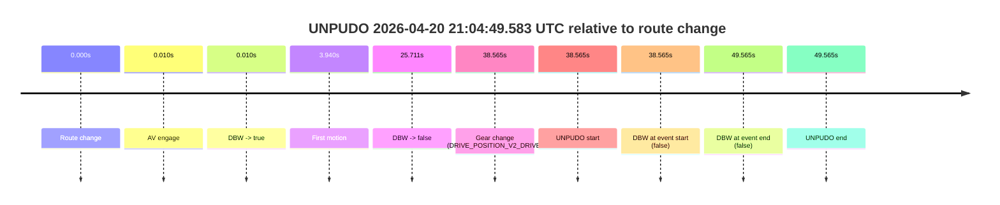
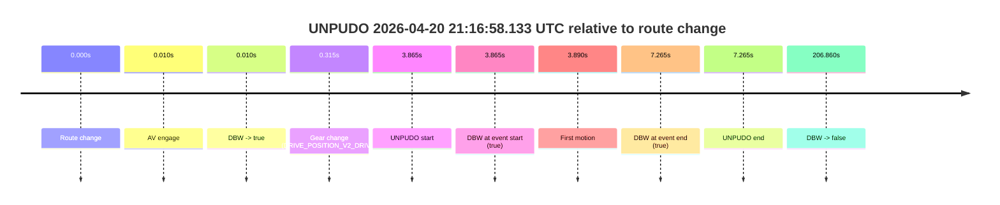
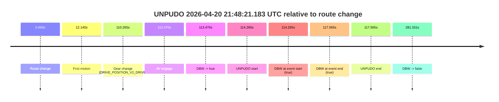

# Run Report: fme20036/2026-04-20--20-40-00--gen2-av-78b6b7fb-e37a-4d9e-9fca-a38d2eab5033

| Field | Value |
|---|---|
| Run ID | `fme20036/2026-04-20--20-40-00--gen2-av-78b6b7fb-e37a-4d9e-9fca-a38d2eab5033` |
| Date | `2026-04-20` |
| Model(s) | `eel-teal-outspoken` |
| Author | `zak` |
| Event count | `9` |

## unpudo 2026-04-20 20:47:01.883 UTC

| Field | Value |
|---|---|
| Model | `eel-teal-outspoken` |
| Author | `zak` |
| Run ID | `fme20036/2026-04-20--20-40-00--gen2-av-78b6b7fb-e37a-4d9e-9fca-a38d2eab5033` |
| Date | `2026-04-20` |
| Time (UTC) | `20:47:01.883` |
| Event type | `unpudo` |
| Disengagement type | `none observed` |
| Route change | `found` |
| Console | [run](https://console.sso.wayve.ai/run/fme20036/2026-04-20--20-40-00--gen2-av-78b6b7fb-e37a-4d9e-9fca-a38d2eab5033?id=&time-unixus=1776718021883308) |
| Foxglove | [segment](https://app.foxglove.dev/wayve-on-prem/p/prj_0dX18KZdVHg1fmmI/view?ds=foxglove-stream&ds.deviceName=fme20036&ds.start=2026-04-20T20%3A44%3A57.718372Z&ds.end=2026-04-20T20%3A47%3A14.883315Z&layoutId=lay_0e7VD4WIKDQGU73Y&time=2026-04-20T20%3A47%3A01.883308Z) |

### Event card: fail

- Fail: the credited unpudo does not stay AV-owned. The event window starts with DBW false, and the maneuver outcome lands outside a clean AV-owned segment.

| Event | Time (UTC) | Delta from route change |
|---|---:|---:|
| Route change | 2026-04-20 20:45:07.718 | `0.000s` |
| Actual indicator -> right on | 2026-04-20 20:45:13.277 | `5.560s` |
| First motion | 2026-04-20 20:45:13.898 | `6.180s` |
| Actual indicator -> off | 2026-04-20 20:45:15.398 | `7.680s` |
| AV engage | 2026-04-20 20:45:21.449 | `13.731s` |
| DBW -> true | 2026-04-20 20:45:21.449 | `13.731s` |
| DBW -> false | 2026-04-20 20:46:41.529 | `93.811s` |
| Gear change (DRIVE_POSITION_V2_DRIVE) | 2026-04-20 20:47:00.583 | `112.865s` |
| UNPUDO start | 2026-04-20 20:47:01.883 | `114.165s` |
| DBW at event start (false) | 2026-04-20 20:47:01.883 | `114.165s` |
| DBW at event end (false) | 2026-04-20 20:47:04.883 | `117.165s` |
| UNPUDO end | 2026-04-20 20:47:04.883 | `117.165s` |

| Metric | Value |
|---|---|
| Outcome | `fail` |
| Effective failure type | `completed_outside_av` |
| Route change status | `found` |
| DBW at event start | `false` |
| DBW at event end | `false` |
| Predicted gear at AV start | `DRIVE_POSITION_V2_DRIVE` |
| Actual gear at AV start | `DRIVE_POSITION_V2_DRIVE` |
| Predicted gear at event start | `DRIVE_POSITION_V2_DRIVE` |
| Actual gear at event start | `DRIVE_POSITION_V2_DRIVE` |
| Planned indicator direction | `INDICATORS_STATE_V2_OFF` |
| Controller indicator direction | `INDICATORS_STATE_V2_OFF` |
| Actual indicator direction | `INDICATORS_STATE_V2_OFF` |
| Actual indicator at maneuver end | `INDICATORS_STATE_V2_OFF` |
| Driver accel help in AV | `false` |
| Driver accel help timestamp | `n/a` |
| Max accel pedal pct in AV | `0.0%` |
| Max brake pedal pct in AV | `11.8%` |
| Max speed mps in AV | `7.972` |
| Success timing baseline | `route change` |
| Route -> AV | `13.731s` |
| AV -> event start | `100.434s` |
| AV -> first motion | `-7.551s` |
| Success baseline -> event start | `114.165s` |
| Success baseline -> first motion | `6.180s` |
| AV duration before disengagement | `80.080s` |
| Trajectory waypoint count | `36` |
| Driving-plan step count | `11` |

The scored portion starts from the AV-owned window, not from the pre-AV setup. Route-change search in the stopped pre-event segment was `found`, with the baseline therefore set to route change. At the event anchor the model predicts `DRIVE_POSITION_V2_DRIVE` and the actual gear is `DRIVE_POSITION_V2_DRIVE`. The effective model outcome is `fail` because `completed_outside_av.`

### Resolution

| Field | Value |
|---|---|
| Final outcome | `fail` |
| Do we agree with this label? | `yes` |
| Source disengagement type | `none observed` |
| Resolved effective failure type | `completed_outside_av` |
| Confidence | `high` |

## unpudo 2026-04-20 20:58:42.633 UTC

| Field | Value |
|---|---|
| Model | `eel-teal-outspoken` |
| Author | `zak` |
| Run ID | `fme20036/2026-04-20--20-40-00--gen2-av-78b6b7fb-e37a-4d9e-9fca-a38d2eab5033` |
| Date | `2026-04-20` |
| Time (UTC) | `20:58:42.633` |
| Event type | `unpudo` |
| Disengagement type | `none observed` |
| Route change | `found` |
| Console | [run](https://console.sso.wayve.ai/run/fme20036/2026-04-20--20-40-00--gen2-av-78b6b7fb-e37a-4d9e-9fca-a38d2eab5033?id=&time-unixus=1776718722633305) |
| Foxglove | [segment](https://app.foxglove.dev/wayve-on-prem/p/prj_0dX18KZdVHg1fmmI/view?ds=foxglove-stream&ds.deviceName=fme20036&ds.start=2026-04-20T20%3A58%3A24.818274Z&ds.end=2026-04-20T21%3A04%3A46.729212Z&layoutId=lay_0e7VD4WIKDQGU73Y&time=2026-04-20T20%3A58%3A42.633305Z) |

### Event card: pass

- Pass: AV owns the credited unpudo from route change through the official unpudo window, the gear state is aligned at the anchor, and the vehicle moves without driver accelerator help in AV.

| Event | Time (UTC) | Delta from route change |
|---|---:|---:|
| Route change | 2026-04-20 20:58:34.818 | `0.000s` |
| AV engage | 2026-04-20 20:58:38.548 | `3.730s` |
| DBW -> true | 2026-04-20 20:58:38.548 | `3.730s` |
| Gear change (DRIVE_POSITION_V2_DRIVE) | 2026-04-20 20:58:38.983 | `4.165s` |
| UNPUDO start | 2026-04-20 20:58:42.633 | `7.815s` |
| DBW at event start (true) | 2026-04-20 20:58:42.633 | `7.815s` |
| First motion | 2026-04-20 20:58:42.657 | `7.840s` |
| DBW at event end (true) | 2026-04-20 20:58:45.933 | `11.115s` |
| UNPUDO end | 2026-04-20 20:58:45.933 | `11.115s` |
| DBW -> false | 2026-04-20 21:04:36.729 | `361.911s` |

| Metric | Value |
|---|---|
| Outcome | `pass` |
| Effective failure type | `none` |
| Route change status | `found` |
| DBW at event start | `true` |
| DBW at event end | `true` |
| Predicted gear at AV start | `DRIVE_POSITION_V2_DRIVE` |
| Actual gear at AV start | `DRIVE_POSITION_V2_PARK` |
| Predicted gear at event start | `DRIVE_POSITION_V2_DRIVE` |
| Actual gear at event start | `DRIVE_POSITION_V2_DRIVE` |
| Planned indicator direction | `INDICATORS_STATE_V2_LEFT_ON` |
| Controller indicator direction | `INDICATORS_STATE_V2_LEFT_ON` |
| Actual indicator direction | `INDICATORS_STATE_V2_OFF` |
| Actual indicator at maneuver end | `INDICATORS_STATE_V2_OFF` |
| Driver accel help in AV | `false` |
| Driver accel help timestamp | `n/a` |
| Max accel pedal pct in AV | `0.0%` |
| Max brake pedal pct in AV | `8.0%` |
| Max speed mps in AV | `5.158` |
| Success timing baseline | `route change` |
| Route -> AV | `3.730s` |
| AV -> event start | `4.085s` |
| AV -> first motion | `4.110s` |
| Success baseline -> event start | `7.815s` |
| Success baseline -> first motion | `7.840s` |
| AV duration before disengagement | `358.181s` |
| Trajectory waypoint count | `37` |
| Driving-plan step count | `11` |

The scored portion starts from the AV-owned window, not from the pre-AV setup. Route-change search in the stopped pre-event segment was `found`, with the baseline therefore set to route change. At the event anchor the model predicts `DRIVE_POSITION_V2_DRIVE` and the actual gear is `DRIVE_POSITION_V2_DRIVE`. The effective model outcome is `pass` because `the credited unpudo stays AV-owned through the official unpudo window.`

### Resolution

| Field | Value |
|---|---|
| Final outcome | `pass` |
| Do we agree with this label? | `yes` |
| Source disengagement type | `none observed` |
| Resolved effective failure type | `none` |
| Confidence | `high` |

## unpudo 2026-04-20 21:00:10.383 UTC

| Field | Value |
|---|---|
| Model | `eel-teal-outspoken` |
| Author | `zak` |
| Run ID | `fme20036/2026-04-20--20-40-00--gen2-av-78b6b7fb-e37a-4d9e-9fca-a38d2eab5033` |
| Date | `2026-04-20` |
| Time (UTC) | `21:00:10.383` |
| Event type | `unpudo` |
| Disengagement type | `none observed` |
| Route change | `found` |
| Console | [run](https://console.sso.wayve.ai/run/fme20036/2026-04-20--20-40-00--gen2-av-78b6b7fb-e37a-4d9e-9fca-a38d2eab5033?id=&time-unixus=1776718810383296) |
| Foxglove | [segment](https://app.foxglove.dev/wayve-on-prem/p/prj_0dX18KZdVHg1fmmI/view?ds=foxglove-stream&ds.deviceName=fme20036&ds.start=2026-04-20T20%3A58%3A24.818274Z&ds.end=2026-04-20T21%3A04%3A46.729212Z&layoutId=lay_0e7VD4WIKDQGU73Y&time=2026-04-20T21%3A00%3A10.383296Z) |

### Event card: pass

- Pass: AV owns the credited unpudo from route change through the official unpudo window, the gear state is aligned at the anchor, and the vehicle moves without driver accelerator help in AV.

| Event | Time (UTC) | Delta from route change |
|---|---:|---:|
| Route change | 2026-04-20 20:58:34.818 | `0.000s` |
| AV engage | 2026-04-20 20:58:38.548 | `3.730s` |
| DBW -> true | 2026-04-20 20:58:38.548 | `3.730s` |
| First motion | 2026-04-20 20:58:42.657 | `7.840s` |
| Gear change (DRIVE_POSITION_V2_DRIVE) | 2026-04-20 21:00:06.833 | `92.015s` |
| UNPUDO start | 2026-04-20 21:00:10.383 | `95.565s` |
| DBW at event start (true) | 2026-04-20 21:00:10.383 | `95.565s` |
| DBW at event end (true) | 2026-04-20 21:00:13.783 | `98.965s` |
| UNPUDO end | 2026-04-20 21:00:13.783 | `98.965s` |
| DBW -> false | 2026-04-20 21:04:36.729 | `361.911s` |

| Metric | Value |
|---|---|
| Outcome | `pass` |
| Effective failure type | `none` |
| Route change status | `found` |
| DBW at event start | `true` |
| DBW at event end | `true` |
| Predicted gear at AV start | `DRIVE_POSITION_V2_DRIVE` |
| Actual gear at AV start | `DRIVE_POSITION_V2_PARK` |
| Predicted gear at event start | `DRIVE_POSITION_V2_DRIVE` |
| Actual gear at event start | `DRIVE_POSITION_V2_DRIVE` |
| Planned indicator direction | `INDICATORS_STATE_V2_RIGHT_ON` |
| Controller indicator direction | `INDICATORS_STATE_V2_RIGHT_ON` |
| Actual indicator direction | `INDICATORS_STATE_V2_OFF` |
| Actual indicator at maneuver end | `INDICATORS_STATE_V2_OFF` |
| Driver accel help in AV | `false` |
| Driver accel help timestamp | `n/a` |
| Max accel pedal pct in AV | `0.0%` |
| Max brake pedal pct in AV | `15.6%` |
| Max speed mps in AV | `7.911` |
| Success timing baseline | `route change` |
| Route -> AV | `3.730s` |
| AV -> event start | `91.835s` |
| AV -> first motion | `4.110s` |
| Success baseline -> event start | `95.565s` |
| Success baseline -> first motion | `7.840s` |
| AV duration before disengagement | `358.181s` |
| Trajectory waypoint count | `36` |
| Driving-plan step count | `11` |

The scored portion starts from the AV-owned window, not from the pre-AV setup. Route-change search in the stopped pre-event segment was `found`, with the baseline therefore set to route change. At the event anchor the model predicts `DRIVE_POSITION_V2_DRIVE` and the actual gear is `DRIVE_POSITION_V2_DRIVE`. The effective model outcome is `pass` because `the credited unpudo stays AV-owned through the official unpudo window.`

### Resolution

| Field | Value |
|---|---|
| Final outcome | `pass` |
| Do we agree with this label? | `yes` |
| Source disengagement type | `none observed` |
| Resolved effective failure type | `none` |
| Confidence | `high` |

## unpudo 2026-04-20 21:04:49.583 UTC

| Field | Value |
|---|---|
| Model | `eel-teal-outspoken` |
| Author | `zak` |
| Run ID | `fme20036/2026-04-20--20-40-00--gen2-av-78b6b7fb-e37a-4d9e-9fca-a38d2eab5033` |
| Date | `2026-04-20` |
| Time (UTC) | `21:04:49.583` |
| Event type | `unpudo` |
| Disengagement type | `none observed` |
| Route change | `found` |
| Console | [run](https://console.sso.wayve.ai/run/fme20036/2026-04-20--20-40-00--gen2-av-78b6b7fb-e37a-4d9e-9fca-a38d2eab5033?id=&time-unixus=1776719089583320) |
| Foxglove | [segment](https://app.foxglove.dev/wayve-on-prem/p/prj_0dX18KZdVHg1fmmI/view?ds=foxglove-stream&ds.deviceName=fme20036&ds.start=2026-04-20T21%3A04%3A01.018287Z&ds.end=2026-04-20T21%3A05%3A10.583302Z&layoutId=lay_0e7VD4WIKDQGU73Y&time=2026-04-20T21%3A04%3A49.583320Z) |

### Event card: fail

- Fail: the credited unpudo does not stay AV-owned. The event window starts with DBW false, and the maneuver outcome lands outside a clean AV-owned segment.

| Event | Time (UTC) | Delta from route change |
|---|---:|---:|
| Route change | 2026-04-20 21:04:11.018 | `0.000s` |
| AV engage | 2026-04-20 21:04:11.028 | `0.010s` |
| DBW -> true | 2026-04-20 21:04:11.028 | `0.010s` |
| First motion | 2026-04-20 21:04:14.957 | `3.940s` |
| DBW -> false | 2026-04-20 21:04:36.729 | `25.711s` |
| Gear change (DRIVE_POSITION_V2_DRIVE) | 2026-04-20 21:04:49.583 | `38.565s` |
| UNPUDO start | 2026-04-20 21:04:49.583 | `38.565s` |
| DBW at event start (false) | 2026-04-20 21:04:49.583 | `38.565s` |
| DBW at event end (false) | 2026-04-20 21:05:00.583 | `49.565s` |
| UNPUDO end | 2026-04-20 21:05:00.583 | `49.565s` |

| Metric | Value |
|---|---|
| Outcome | `fail` |
| Effective failure type | `not_av_owned` |
| Route change status | `found` |
| DBW at event start | `false` |
| DBW at event end | `false` |
| Predicted gear at AV start | `DRIVE_POSITION_V2_PARK` |
| Actual gear at AV start | `DRIVE_POSITION_V2_PARK` |
| Predicted gear at event start | `DRIVE_POSITION_V2_DRIVE` |
| Actual gear at event start | `DRIVE_POSITION_V2_DRIVE` |
| Planned indicator direction | `INDICATORS_STATE_V2_OFF` |
| Controller indicator direction | `INDICATORS_STATE_V2_OFF` |
| Actual indicator direction | `INDICATORS_STATE_V2_OFF` |
| Actual indicator at maneuver end | `INDICATORS_STATE_V2_OFF` |
| Driver accel help in AV | `false` |
| Driver accel help timestamp | `n/a` |
| Max accel pedal pct in AV | `0.0%` |
| Max brake pedal pct in AV | `8.0%` |
| Max speed mps in AV | `7.483` |
| Success timing baseline | `route change` |
| Route -> AV | `0.010s` |
| AV -> event start | `38.555s` |
| AV -> first motion | `3.930s` |
| Success baseline -> event start | `38.565s` |
| Success baseline -> first motion | `3.940s` |
| AV duration before disengagement | `25.701s` |
| Trajectory waypoint count | `34` |
| Driving-plan step count | `11` |

The scored portion starts from the AV-owned window, not from the pre-AV setup. Route-change search in the stopped pre-event segment was `found`, with the baseline therefore set to route change. At the event anchor the model predicts `DRIVE_POSITION_V2_DRIVE` and the actual gear is `DRIVE_POSITION_V2_DRIVE`. The effective model outcome is `fail` because `not_av_owned.`

### Resolution

| Field | Value |
|---|---|
| Final outcome | `fail` |
| Do we agree with this label? | `yes` |
| Source disengagement type | `none observed` |
| Resolved effective failure type | `not_av_owned` |
| Confidence | `high` |

## unpudo 2026-04-20 21:14:53.133 UTC

| Field | Value |
|---|---|
| Model | `eel-teal-outspoken` |
| Author | `zak` |
| Run ID | `fme20036/2026-04-20--20-40-00--gen2-av-78b6b7fb-e37a-4d9e-9fca-a38d2eab5033` |
| Date | `2026-04-20` |
| Time (UTC) | `21:14:53.133` |
| Event type | `unpudo` |
| Disengagement type | `none observed` |
| Route change | `found` |
| Console | [run](https://console.sso.wayve.ai/run/fme20036/2026-04-20--20-40-00--gen2-av-78b6b7fb-e37a-4d9e-9fca-a38d2eab5033?id=&time-unixus=1776719693133318) |
| Foxglove | [segment](https://app.foxglove.dev/wayve-on-prem/p/prj_0dX18KZdVHg1fmmI/view?ds=foxglove-stream&ds.deviceName=fme20036&ds.start=2026-04-20T21%3A14%3A21.668259Z&ds.end=2026-04-20T21%3A20%3A31.128241Z&layoutId=lay_0e7VD4WIKDQGU73Y&time=2026-04-20T21%3A14%3A53.133318Z) |

### Event card: pass

- Pass: AV owns the credited unpudo from route change through the official unpudo window, the gear state is aligned at the anchor, and the vehicle moves without driver accelerator help in AV.

| Event | Time (UTC) | Delta from route change |
|---|---:|---:|
| Route change | 2026-04-20 21:14:31.668 | `0.000s` |
| AV engage | 2026-04-20 21:14:31.678 | `0.010s` |
| DBW -> true | 2026-04-20 21:14:31.678 | `0.010s` |
| Gear change (DRIVE_POSITION_V2_DRIVE) | 2026-04-20 21:14:31.983 | `0.315s` |
| UNPUDO start | 2026-04-20 21:14:53.133 | `21.465s` |
| DBW at event start (true) | 2026-04-20 21:14:53.133 | `21.465s` |
| First motion | 2026-04-20 21:14:53.237 | `21.570s` |
| DBW at event end (true) | 2026-04-20 21:15:06.683 | `35.015s` |
| UNPUDO end | 2026-04-20 21:15:06.683 | `35.015s` |
| DBW -> false | 2026-04-20 21:20:21.128 | `349.460s` |

| Metric | Value |
|---|---|
| Outcome | `pass` |
| Effective failure type | `none` |
| Route change status | `found` |
| DBW at event start | `true` |
| DBW at event end | `true` |
| Predicted gear at AV start | `DRIVE_POSITION_V2_PARK` |
| Actual gear at AV start | `DRIVE_POSITION_V2_PARK` |
| Predicted gear at event start | `DRIVE_POSITION_V2_DRIVE` |
| Actual gear at event start | `DRIVE_POSITION_V2_DRIVE` |
| Planned indicator direction | `INDICATORS_STATE_V2_OFF` |
| Controller indicator direction | `INDICATORS_STATE_V2_OFF` |
| Actual indicator direction | `INDICATORS_STATE_V2_OFF` |
| Actual indicator at maneuver end | `INDICATORS_STATE_V2_OFF` |
| Driver accel help in AV | `false` |
| Driver accel help timestamp | `n/a` |
| Max accel pedal pct in AV | `0.0%` |
| Max brake pedal pct in AV | `8.0%` |
| Max speed mps in AV | `2.236` |
| Success timing baseline | `route change` |
| Route -> AV | `0.010s` |
| AV -> event start | `21.455s` |
| AV -> first motion | `21.560s` |
| Success baseline -> event start | `21.465s` |
| Success baseline -> first motion | `21.570s` |
| AV duration before disengagement | `349.450s` |
| Trajectory waypoint count | `36` |
| Driving-plan step count | `11` |

The scored portion starts from the AV-owned window, not from the pre-AV setup. Route-change search in the stopped pre-event segment was `found`, with the baseline therefore set to route change. At the event anchor the model predicts `DRIVE_POSITION_V2_DRIVE` and the actual gear is `DRIVE_POSITION_V2_DRIVE`. The effective model outcome is `pass` because `the credited unpudo stays AV-owned through the official unpudo window.`

### Resolution

| Field | Value |
|---|---|
| Final outcome | `pass` |
| Do we agree with this label? | `yes` |
| Source disengagement type | `none observed` |
| Resolved effective failure type | `none` |
| Confidence | `high` |

## unpudo 2026-04-20 21:16:58.133 UTC

| Field | Value |
|---|---|
| Model | `eel-teal-outspoken` |
| Author | `zak` |
| Run ID | `fme20036/2026-04-20--20-40-00--gen2-av-78b6b7fb-e37a-4d9e-9fca-a38d2eab5033` |
| Date | `2026-04-20` |
| Time (UTC) | `21:16:58.133` |
| Event type | `unpudo` |
| Disengagement type | `none observed` |
| Route change | `found` |
| Console | [run](https://console.sso.wayve.ai/run/fme20036/2026-04-20--20-40-00--gen2-av-78b6b7fb-e37a-4d9e-9fca-a38d2eab5033?id=&time-unixus=1776719818133308) |
| Foxglove | [segment](https://app.foxglove.dev/wayve-on-prem/p/prj_0dX18KZdVHg1fmmI/view?ds=foxglove-stream&ds.deviceName=fme20036&ds.start=2026-04-20T21%3A16%3A44.268298Z&ds.end=2026-04-20T21%3A20%3A31.128241Z&layoutId=lay_0e7VD4WIKDQGU73Y&time=2026-04-20T21%3A16%3A58.133308Z) |

### Event card: pass

- Pass: AV owns the credited unpudo from route change through the official unpudo window, the gear state is aligned at the anchor, and the vehicle moves without driver accelerator help in AV.

| Event | Time (UTC) | Delta from route change |
|---|---:|---:|
| Route change | 2026-04-20 21:16:54.268 | `0.000s` |
| AV engage | 2026-04-20 21:16:54.278 | `0.010s` |
| DBW -> true | 2026-04-20 21:16:54.278 | `0.010s` |
| Gear change (DRIVE_POSITION_V2_DRIVE) | 2026-04-20 21:16:54.583 | `0.315s` |
| UNPUDO start | 2026-04-20 21:16:58.133 | `3.865s` |
| DBW at event start (true) | 2026-04-20 21:16:58.133 | `3.865s` |
| First motion | 2026-04-20 21:16:58.158 | `3.890s` |
| DBW at event end (true) | 2026-04-20 21:17:01.533 | `7.265s` |
| UNPUDO end | 2026-04-20 21:17:01.533 | `7.265s` |
| DBW -> false | 2026-04-20 21:20:21.128 | `206.860s` |

| Metric | Value |
|---|---|
| Outcome | `pass` |
| Effective failure type | `none` |
| Route change status | `found` |
| DBW at event start | `true` |
| DBW at event end | `true` |
| Predicted gear at AV start | `DRIVE_POSITION_V2_PARK` |
| Actual gear at AV start | `DRIVE_POSITION_V2_PARK` |
| Predicted gear at event start | `DRIVE_POSITION_V2_DRIVE` |
| Actual gear at event start | `DRIVE_POSITION_V2_DRIVE` |
| Planned indicator direction | `INDICATORS_STATE_V2_RIGHT_ON` |
| Controller indicator direction | `INDICATORS_STATE_V2_RIGHT_ON` |
| Actual indicator direction | `INDICATORS_STATE_V2_OFF` |
| Actual indicator at maneuver end | `INDICATORS_STATE_V2_OFF` |
| Driver accel help in AV | `false` |
| Driver accel help timestamp | `n/a` |
| Max accel pedal pct in AV | `0.0%` |
| Max brake pedal pct in AV | `8.0%` |
| Max speed mps in AV | `5.158` |
| Success timing baseline | `route change` |
| Route -> AV | `0.010s` |
| AV -> event start | `3.855s` |
| AV -> first motion | `3.880s` |
| Success baseline -> event start | `3.865s` |
| Success baseline -> first motion | `3.890s` |
| AV duration before disengagement | `206.850s` |
| Trajectory waypoint count | `37` |
| Driving-plan step count | `11` |

The scored portion starts from the AV-owned window, not from the pre-AV setup. Route-change search in the stopped pre-event segment was `found`, with the baseline therefore set to route change. At the event anchor the model predicts `DRIVE_POSITION_V2_DRIVE` and the actual gear is `DRIVE_POSITION_V2_DRIVE`. The effective model outcome is `pass` because `the credited unpudo stays AV-owned through the official unpudo window.`

### Resolution

| Field | Value |
|---|---|
| Final outcome | `pass` |
| Do we agree with this label? | `yes` |
| Source disengagement type | `none observed` |
| Resolved effective failure type | `none` |
| Confidence | `high` |

## unpudo 2026-04-20 21:46:39.033 UTC

| Field | Value |
|---|---|
| Model | `eel-teal-outspoken` |
| Author | `zak` |
| Run ID | `fme20036/2026-04-20--20-40-00--gen2-av-78b6b7fb-e37a-4d9e-9fca-a38d2eab5033` |
| Date | `2026-04-20` |
| Time (UTC) | `21:46:39.033` |
| Event type | `unpudo` |
| Disengagement type | `none observed` |
| Route change | `found` |
| Console | [run](https://console.sso.wayve.ai/run/fme20036/2026-04-20--20-40-00--gen2-av-78b6b7fb-e37a-4d9e-9fca-a38d2eab5033?id=&time-unixus=1776721599033309) |
| Foxglove | [segment](https://app.foxglove.dev/wayve-on-prem/p/prj_0dX18KZdVHg1fmmI/view?ds=foxglove-stream&ds.deviceName=fme20036&ds.start=2026-04-20T21%3A46%3A16.918269Z&ds.end=2026-04-20T21%3A47%3A51.108243Z&layoutId=lay_0e7VD4WIKDQGU73Y&time=2026-04-20T21%3A46%3A39.033309Z) |

### Event card: pass

- Pass: AV owns the credited unpudo from route change through the official unpudo window, the gear state is aligned at the anchor, and the vehicle moves without driver accelerator help in AV.

| Event | Time (UTC) | Delta from route change |
|---|---:|---:|
| Route change | 2026-04-20 21:46:26.918 | `0.000s` |
| AV engage | 2026-04-20 21:46:26.928 | `0.010s` |
| DBW -> true | 2026-04-20 21:46:26.928 | `0.010s` |
| Gear change (DRIVE_POSITION_V2_DRIVE) | 2026-04-20 21:46:27.183 | `0.265s` |
| UNPUDO start | 2026-04-20 21:46:39.033 | `12.115s` |
| DBW at event start (true) | 2026-04-20 21:46:39.033 | `12.115s` |
| First motion | 2026-04-20 21:46:39.057 | `12.140s` |
| DBW at event end (true) | 2026-04-20 21:46:43.233 | `16.315s` |
| UNPUDO end | 2026-04-20 21:46:43.233 | `16.315s` |
| DBW -> false | 2026-04-20 21:47:41.108 | `74.190s` |

| Metric | Value |
|---|---|
| Outcome | `pass` |
| Effective failure type | `none` |
| Route change status | `found` |
| DBW at event start | `true` |
| DBW at event end | `true` |
| Predicted gear at AV start | `DRIVE_POSITION_V2_PARK` |
| Actual gear at AV start | `DRIVE_POSITION_V2_PARK` |
| Predicted gear at event start | `DRIVE_POSITION_V2_DRIVE` |
| Actual gear at event start | `DRIVE_POSITION_V2_DRIVE` |
| Planned indicator direction | `INDICATORS_STATE_V2_RIGHT_ON` |
| Controller indicator direction | `INDICATORS_STATE_V2_RIGHT_ON` |
| Actual indicator direction | `INDICATORS_STATE_V2_OFF` |
| Actual indicator at maneuver end | `INDICATORS_STATE_V2_OFF` |
| Driver accel help in AV | `false` |
| Driver accel help timestamp | `n/a` |
| Max accel pedal pct in AV | `0.0%` |
| Max brake pedal pct in AV | `8.0%` |
| Max speed mps in AV | `4.819` |
| Success timing baseline | `route change` |
| Route -> AV | `0.010s` |
| AV -> event start | `12.105s` |
| AV -> first motion | `12.130s` |
| Success baseline -> event start | `12.115s` |
| Success baseline -> first motion | `12.140s` |
| AV duration before disengagement | `74.180s` |
| Trajectory waypoint count | `37` |
| Driving-plan step count | `11` |

The scored portion starts from the AV-owned window, not from the pre-AV setup. Route-change search in the stopped pre-event segment was `found`, with the baseline therefore set to route change. At the event anchor the model predicts `DRIVE_POSITION_V2_DRIVE` and the actual gear is `DRIVE_POSITION_V2_DRIVE`. The effective model outcome is `pass` because `the credited unpudo stays AV-owned through the official unpudo window.`

### Resolution

| Field | Value |
|---|---|
| Final outcome | `pass` |
| Do we agree with this label? | `yes` |
| Source disengagement type | `none observed` |
| Resolved effective failure type | `none` |
| Confidence | `high` |

## unpudo 2026-04-20 21:47:43.733 UTC

| Field | Value |
|---|---|
| Model | `eel-teal-outspoken` |
| Author | `zak` |
| Run ID | `fme20036/2026-04-20--20-40-00--gen2-av-78b6b7fb-e37a-4d9e-9fca-a38d2eab5033` |
| Date | `2026-04-20` |
| Time (UTC) | `21:47:43.733` |
| Event type | `unpudo` |
| Disengagement type | `none observed` |
| Route change | `found` |
| Console | [run](https://console.sso.wayve.ai/run/fme20036/2026-04-20--20-40-00--gen2-av-78b6b7fb-e37a-4d9e-9fca-a38d2eab5033?id=&time-unixus=1776721663733310) |
| Foxglove | [segment](https://app.foxglove.dev/wayve-on-prem/p/prj_0dX18KZdVHg1fmmI/view?ds=foxglove-stream&ds.deviceName=fme20036&ds.start=2026-04-20T21%3A46%3A16.918269Z&ds.end=2026-04-20T21%3A47%3A57.583296Z&layoutId=lay_0e7VD4WIKDQGU73Y&time=2026-04-20T21%3A47%3A43.733310Z) |

### Event card: fail

- Fail: the credited unpudo does not stay AV-owned. The event window starts with DBW false, and the maneuver outcome lands outside a clean AV-owned segment.

| Event | Time (UTC) | Delta from route change |
|---|---:|---:|
| Route change | 2026-04-20 21:46:26.918 | `0.000s` |
| AV engage | 2026-04-20 21:46:26.928 | `0.010s` |
| DBW -> true | 2026-04-20 21:46:26.928 | `0.010s` |
| First motion | 2026-04-20 21:46:39.057 | `12.140s` |
| DBW -> false | 2026-04-20 21:47:41.108 | `74.190s` |
| Gear change (DRIVE_POSITION_V2_DRIVE) | 2026-04-20 21:47:42.683 | `75.765s` |
| UNPUDO start | 2026-04-20 21:47:43.733 | `76.815s` |
| DBW at event start (false) | 2026-04-20 21:47:43.733 | `76.815s` |
| DBW at event end (false) | 2026-04-20 21:47:47.583 | `80.665s` |
| UNPUDO end | 2026-04-20 21:47:47.583 | `80.665s` |

| Metric | Value |
|---|---|
| Outcome | `fail` |
| Effective failure type | `not_av_owned` |
| Route change status | `found` |
| DBW at event start | `false` |
| DBW at event end | `false` |
| Predicted gear at AV start | `DRIVE_POSITION_V2_PARK` |
| Actual gear at AV start | `DRIVE_POSITION_V2_PARK` |
| Predicted gear at event start | `DRIVE_POSITION_V2_DRIVE` |
| Actual gear at event start | `DRIVE_POSITION_V2_DRIVE` |
| Planned indicator direction | `INDICATORS_STATE_V2_LEFT_ON` |
| Controller indicator direction | `INDICATORS_STATE_V2_LEFT_ON` |
| Actual indicator direction | `INDICATORS_STATE_V2_OFF` |
| Actual indicator at maneuver end | `INDICATORS_STATE_V2_OFF` |
| Driver accel help in AV | `false` |
| Driver accel help timestamp | `n/a` |
| Max accel pedal pct in AV | `0.0%` |
| Max brake pedal pct in AV | `8.0%` |
| Max speed mps in AV | `8.039` |
| Success timing baseline | `route change` |
| Route -> AV | `0.010s` |
| AV -> event start | `76.805s` |
| AV -> first motion | `12.130s` |
| Success baseline -> event start | `76.815s` |
| Success baseline -> first motion | `12.140s` |
| AV duration before disengagement | `74.180s` |
| Trajectory waypoint count | `37` |
| Driving-plan step count | `11` |

The scored portion starts from the AV-owned window, not from the pre-AV setup. Route-change search in the stopped pre-event segment was `found`, with the baseline therefore set to route change. At the event anchor the model predicts `DRIVE_POSITION_V2_DRIVE` and the actual gear is `DRIVE_POSITION_V2_DRIVE`. The effective model outcome is `fail` because `not_av_owned.`

### Resolution

| Field | Value |
|---|---|
| Final outcome | `fail` |
| Do we agree with this label? | `yes` |
| Source disengagement type | `none observed` |
| Resolved effective failure type | `not_av_owned` |
| Confidence | `high` |

## unpudo 2026-04-20 21:48:21.183 UTC

| Field | Value |
|---|---|
| Model | `eel-teal-outspoken` |
| Author | `zak` |
| Run ID | `fme20036/2026-04-20--20-40-00--gen2-av-78b6b7fb-e37a-4d9e-9fca-a38d2eab5033` |
| Date | `2026-04-20` |
| Time (UTC) | `21:48:21.183` |
| Event type | `unpudo` |
| Disengagement type | `none observed` |
| Route change | `found` |
| Console | [run](https://console.sso.wayve.ai/run/fme20036/2026-04-20--20-40-00--gen2-av-78b6b7fb-e37a-4d9e-9fca-a38d2eab5033?id=&time-unixus=1776721701183296) |
| Foxglove | [segment](https://app.foxglove.dev/wayve-on-prem/p/prj_0dX18KZdVHg1fmmI/view?ds=foxglove-stream&ds.deviceName=fme20036&ds.start=2026-04-20T21%3A46%3A16.918269Z&ds.end=2026-04-20T21%3A51%3A18.249389Z&layoutId=lay_0e7VD4WIKDQGU73Y&time=2026-04-20T21%3A48%3A21.183296Z) |

### Event card: pass

- Pass: AV owns the credited unpudo from route change through the official unpudo window, the gear state is aligned at the anchor, and the vehicle moves without driver accelerator help in AV.

| Event | Time (UTC) | Delta from route change |
|---|---:|---:|
| Route change | 2026-04-20 21:46:26.918 | `0.000s` |
| First motion | 2026-04-20 21:46:39.057 | `12.140s` |
| Gear change (DRIVE_POSITION_V2_DRIVE) | 2026-04-20 21:48:17.183 | `110.265s` |
| AV engage | 2026-04-20 21:48:20.388 | `113.470s` |
| DBW -> true | 2026-04-20 21:48:20.388 | `113.470s` |
| UNPUDO start | 2026-04-20 21:48:21.183 | `114.265s` |
| DBW at event start (true) | 2026-04-20 21:48:21.183 | `114.265s` |
| DBW at event end (true) | 2026-04-20 21:48:24.483 | `117.565s` |
| UNPUDO end | 2026-04-20 21:48:24.483 | `117.565s` |
| DBW -> false | 2026-04-20 21:51:08.249 | `281.331s` |

| Metric | Value |
|---|---|
| Outcome | `pass` |
| Effective failure type | `none` |
| Route change status | `found` |
| DBW at event start | `true` |
| DBW at event end | `true` |
| Predicted gear at AV start | `DRIVE_POSITION_V2_DRIVE` |
| Actual gear at AV start | `DRIVE_POSITION_V2_DRIVE` |
| Predicted gear at event start | `DRIVE_POSITION_V2_DRIVE` |
| Actual gear at event start | `DRIVE_POSITION_V2_DRIVE` |
| Planned indicator direction | `INDICATORS_STATE_V2_RIGHT_ON` |
| Controller indicator direction | `INDICATORS_STATE_V2_RIGHT_ON` |
| Actual indicator direction | `INDICATORS_STATE_V2_OFF` |
| Actual indicator at maneuver end | `INDICATORS_STATE_V2_OFF` |
| Driver accel help in AV | `false` |
| Driver accel help timestamp | `n/a` |
| Max accel pedal pct in AV | `0.0%` |
| Max brake pedal pct in AV | `8.0%` |
| Max speed mps in AV | `5.197` |
| Success timing baseline | `route change` |
| Route -> AV | `113.470s` |
| AV -> event start | `0.795s` |
| AV -> first motion | `-101.330s` |
| Success baseline -> event start | `114.265s` |
| Success baseline -> first motion | `12.140s` |
| AV duration before disengagement | `167.861s` |
| Trajectory waypoint count | `36` |
| Driving-plan step count | `11` |

The scored portion starts from the AV-owned window, not from the pre-AV setup. Route-change search in the stopped pre-event segment was `found`, with the baseline therefore set to route change. At the event anchor the model predicts `DRIVE_POSITION_V2_DRIVE` and the actual gear is `DRIVE_POSITION_V2_DRIVE`. The effective model outcome is `pass` because `the credited unpudo stays AV-owned through the official unpudo window.`

### Resolution

| Field | Value |
|---|---|
| Final outcome | `pass` |
| Do we agree with this label? | `yes` |
| Source disengagement type | `none observed` |
| Resolved effective failure type | `none` |
| Confidence | `high` |
