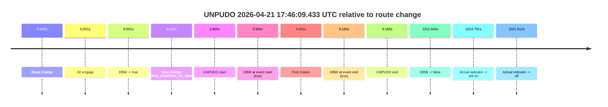
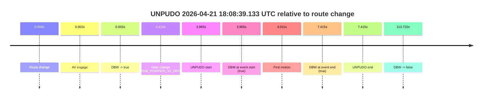
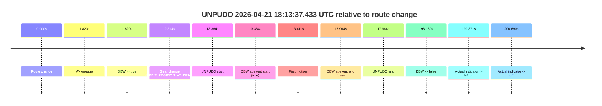
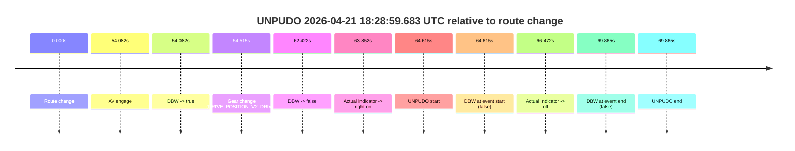

# Run Report: fme20036/2026-04-21--15-31-19--gen2-av-fe140b12-4b6b-41c0-bddb-bbe7d0e7594e

| Field | Value |
|---|---|
| Run ID | `fme20036/2026-04-21--15-31-19--gen2-av-fe140b12-4b6b-41c0-bddb-bbe7d0e7594e` |
| Date | `2026-04-21` |
| Model(s) | `eel-teal-outspoken` |
| Author | `zak` |
| Event count | `4` |

## unpudo 2026-04-21 17:46:09.433 UTC

| Field | Value |
|---|---|
| Model | `eel-teal-outspoken` |
| Author | `zak` |
| Run ID | `fme20036/2026-04-21--15-31-19--gen2-av-fe140b12-4b6b-41c0-bddb-bbe7d0e7594e` |
| Date | `2026-04-21` |
| Time (UTC) | `17:46:09.433` |
| Event type | `unpudo` |
| Disengagement type | `none observed` |
| Route change | `found` |
| Console | [run](https://console.sso.wayve.ai/run/fme20036/2026-04-21--15-31-19--gen2-av-fe140b12-4b6b-41c0-bddb-bbe7d0e7594e?id=&time-unixus=1776793569433293) |
| Foxglove | [segment](https://app.foxglove.dev/wayve-on-prem/p/prj_0dX18KZdVHg1fmmI/view?ds=foxglove-stream&ds.deviceName=fme20036&ds.start=2026-04-21T17%3A45%3A55.468421Z&ds.end=2026-04-21T18%3A03%3A08.110272Z&layoutId=lay_0e7VD4WIKDQGU73Y&time=2026-04-21T17%3A46%3A09.433293Z) |

### Event card: pass

- Pass: AV owns the credited unpudo from route change through the official unpudo window, the gear state is aligned at the anchor, and the vehicle moves without driver accelerator help in AV.

| Event | Time (UTC) | Delta from route change |
|---|---:|---:|
| Route change | 2026-04-21 17:46:05.468 | `0.000s` |
| AV engage | 2026-04-21 17:46:05.469 | `0.001s` |
| DBW -> true | 2026-04-21 17:46:05.469 | `0.001s` |
| Gear change (DRIVE_POSITION_V2_DRIVE) | 2026-04-21 17:46:05.883 | `0.415s` |
| UNPUDO start | 2026-04-21 17:46:09.433 | `3.965s` |
| DBW at event start (true) | 2026-04-21 17:46:09.433 | `3.965s` |
| First motion | 2026-04-21 17:46:09.479 | `4.011s` |
| DBW at event end (true) | 2026-04-21 17:46:14.633 | `9.165s` |
| UNPUDO end | 2026-04-21 17:46:14.633 | `9.165s` |
| DBW -> false | 2026-04-21 18:02:58.110 | `1012.642s` |
| Actual indicator -> left on | 2026-04-21 18:03:00.259 | `1014.791s` |
| Actual indicator -> off | 2026-04-21 18:03:06.980 | `1021.512s` |

| Metric | Value |
|---|---|
| Outcome | `pass` |
| Effective failure type | `none` |
| Route change status | `found` |
| DBW at event start | `true` |
| DBW at event end | `true` |
| Predicted gear at AV start | `DRIVE_POSITION_V2_PARK` |
| Actual gear at AV start | `DRIVE_POSITION_V2_PARK` |
| Predicted gear at event start | `DRIVE_POSITION_V2_DRIVE` |
| Actual gear at event start | `DRIVE_POSITION_V2_DRIVE` |
| Planned indicator direction | `INDICATORS_STATE_V2_OFF` |
| Controller indicator direction | `INDICATORS_STATE_V2_OFF` |
| Actual indicator direction | `INDICATORS_STATE_V2_OFF` |
| Actual indicator at maneuver end | `INDICATORS_STATE_V2_OFF` |
| Driver accel help in AV | `false` |
| Driver accel help timestamp | `n/a` |
| Max accel pedal pct in AV | `0.0%` |
| Max brake pedal pct in AV | `8.4%` |
| Max speed mps in AV | `2.828` |
| Success timing baseline | `route change` |
| Route -> AV | `0.001s` |
| AV -> event start | `3.963s` |
| AV -> first motion | `4.010s` |
| Success baseline -> event start | `3.965s` |
| Success baseline -> first motion | `4.011s` |
| AV duration before disengagement | `1012.640s` |
| Trajectory waypoint count | `38` |
| Driving-plan step count | `11` |

The scored portion starts from the AV-owned window, not from the pre-AV setup. Route-change search in the stopped pre-event segment was `found`, with the baseline therefore set to route change. At the event anchor the model predicts `DRIVE_POSITION_V2_DRIVE` and the actual gear is `DRIVE_POSITION_V2_DRIVE`. The effective model outcome is `pass` because `the credited unpudo stays AV-owned through the official unpudo window.`

### Resolution

| Field | Value |
|---|---|
| Final outcome | `pass` |
| Do we agree with this label? | `yes` |
| Source disengagement type | `none observed` |
| Resolved effective failure type | `none` |
| Confidence | `high` |

## unpudo 2026-04-21 18:08:39.133 UTC

| Field | Value |
|---|---|
| Model | `eel-teal-outspoken` |
| Author | `zak` |
| Run ID | `fme20036/2026-04-21--15-31-19--gen2-av-fe140b12-4b6b-41c0-bddb-bbe7d0e7594e` |
| Date | `2026-04-21` |
| Time (UTC) | `18:08:39.133` |
| Event type | `unpudo` |
| Disengagement type | `none observed` |
| Route change | `found` |
| Console | [run](https://console.sso.wayve.ai/run/fme20036/2026-04-21--15-31-19--gen2-av-fe140b12-4b6b-41c0-bddb-bbe7d0e7594e?id=&time-unixus=1776794919133307) |
| Foxglove | [segment](https://app.foxglove.dev/wayve-on-prem/p/prj_0dX18KZdVHg1fmmI/view?ds=foxglove-stream&ds.deviceName=fme20036&ds.start=2026-04-21T18%3A08%3A25.168292Z&ds.end=2026-04-21T18%3A10%3A38.890368Z&layoutId=lay_0e7VD4WIKDQGU73Y&time=2026-04-21T18%3A08%3A39.133307Z) |

### Event card: pass

- Pass: AV owns the credited unpudo from route change through the official unpudo window, the gear state is aligned at the anchor, and the vehicle moves without driver accelerator help in AV.

| Event | Time (UTC) | Delta from route change |
|---|---:|---:|
| Route change | 2026-04-21 18:08:35.168 | `0.000s` |
| AV engage | 2026-04-21 18:08:35.169 | `0.002s` |
| DBW -> true | 2026-04-21 18:08:35.169 | `0.002s` |
| Gear change (DRIVE_POSITION_V2_DRIVE) | 2026-04-21 18:08:35.583 | `0.415s` |
| UNPUDO start | 2026-04-21 18:08:39.133 | `3.965s` |
| DBW at event start (true) | 2026-04-21 18:08:39.133 | `3.965s` |
| First motion | 2026-04-21 18:08:39.179 | `4.011s` |
| DBW at event end (true) | 2026-04-21 18:08:42.583 | `7.415s` |
| UNPUDO end | 2026-04-21 18:08:42.583 | `7.415s` |
| DBW -> false | 2026-04-21 18:10:28.890 | `113.722s` |

| Metric | Value |
|---|---|
| Outcome | `pass` |
| Effective failure type | `none` |
| Route change status | `found` |
| DBW at event start | `true` |
| DBW at event end | `true` |
| Predicted gear at AV start | `DRIVE_POSITION_V2_PARK` |
| Actual gear at AV start | `DRIVE_POSITION_V2_PARK` |
| Predicted gear at event start | `DRIVE_POSITION_V2_DRIVE` |
| Actual gear at event start | `DRIVE_POSITION_V2_DRIVE` |
| Planned indicator direction | `INDICATORS_STATE_V2_RIGHT_ON` |
| Controller indicator direction | `INDICATORS_STATE_V2_RIGHT_ON` |
| Actual indicator direction | `INDICATORS_STATE_V2_OFF` |
| Actual indicator at maneuver end | `INDICATORS_STATE_V2_OFF` |
| Driver accel help in AV | `false` |
| Driver accel help timestamp | `n/a` |
| Max accel pedal pct in AV | `0.0%` |
| Max brake pedal pct in AV | `8.0%` |
| Max speed mps in AV | `4.664` |
| Success timing baseline | `route change` |
| Route -> AV | `0.002s` |
| AV -> event start | `3.963s` |
| AV -> first motion | `4.010s` |
| Success baseline -> event start | `3.965s` |
| Success baseline -> first motion | `4.011s` |
| AV duration before disengagement | `113.721s` |
| Trajectory waypoint count | `38` |
| Driving-plan step count | `11` |

The scored portion starts from the AV-owned window, not from the pre-AV setup. Route-change search in the stopped pre-event segment was `found`, with the baseline therefore set to route change. At the event anchor the model predicts `DRIVE_POSITION_V2_DRIVE` and the actual gear is `DRIVE_POSITION_V2_DRIVE`. The effective model outcome is `pass` because `the credited unpudo stays AV-owned through the official unpudo window.`

### Resolution

| Field | Value |
|---|---|
| Final outcome | `pass` |
| Do we agree with this label? | `yes` |
| Source disengagement type | `none observed` |
| Resolved effective failure type | `none` |
| Confidence | `high` |

## unpudo 2026-04-21 18:13:37.433 UTC

| Field | Value |
|---|---|
| Model | `eel-teal-outspoken` |
| Author | `zak` |
| Run ID | `fme20036/2026-04-21--15-31-19--gen2-av-fe140b12-4b6b-41c0-bddb-bbe7d0e7594e` |
| Date | `2026-04-21` |
| Time (UTC) | `18:13:37.433` |
| Event type | `unpudo` |
| Disengagement type | `none observed` |
| Route change | `found` |
| Console | [run](https://console.sso.wayve.ai/run/fme20036/2026-04-21--15-31-19--gen2-av-fe140b12-4b6b-41c0-bddb-bbe7d0e7594e?id=&time-unixus=1776795217433308) |
| Foxglove | [segment](https://app.foxglove.dev/wayve-on-prem/p/prj_0dX18KZdVHg1fmmI/view?ds=foxglove-stream&ds.deviceName=fme20036&ds.start=2026-04-21T18%3A13%3A14.069247Z&ds.end=2026-04-21T18%3A16%3A52.249547Z&layoutId=lay_0e7VD4WIKDQGU73Y&time=2026-04-21T18%3A13%3A37.433308Z) |

### Event card: pass

- Pass: AV owns the credited unpudo from route change through the official unpudo window, the gear state is aligned at the anchor, and the vehicle moves without driver accelerator help in AV.

| Event | Time (UTC) | Delta from route change |
|---|---:|---:|
| Route change | 2026-04-21 18:13:24.069 | `0.000s` |
| AV engage | 2026-04-21 18:13:25.889 | `1.820s` |
| DBW -> true | 2026-04-21 18:13:25.889 | `1.820s` |
| Gear change (DRIVE_POSITION_V2_DRIVE) | 2026-04-21 18:13:26.383 | `2.314s` |
| UNPUDO start | 2026-04-21 18:13:37.433 | `13.364s` |
| DBW at event start (true) | 2026-04-21 18:13:37.433 | `13.364s` |
| First motion | 2026-04-21 18:13:37.479 | `13.411s` |
| DBW at event end (true) | 2026-04-21 18:13:42.033 | `17.964s` |
| UNPUDO end | 2026-04-21 18:13:42.033 | `17.964s` |
| DBW -> false | 2026-04-21 18:16:42.249 | `198.180s` |
| Actual indicator -> left on | 2026-04-21 18:16:43.439 | `199.371s` |
| Actual indicator -> off | 2026-04-21 18:16:44.759 | `200.690s` |

| Metric | Value |
|---|---|
| Outcome | `pass` |
| Effective failure type | `none` |
| Route change status | `found` |
| DBW at event start | `true` |
| DBW at event end | `true` |
| Predicted gear at AV start | `DRIVE_POSITION_V2_DRIVE` |
| Actual gear at AV start | `DRIVE_POSITION_V2_PARK` |
| Predicted gear at event start | `DRIVE_POSITION_V2_DRIVE` |
| Actual gear at event start | `DRIVE_POSITION_V2_DRIVE` |
| Planned indicator direction | `INDICATORS_STATE_V2_LEFT_ON` |
| Controller indicator direction | `INDICATORS_STATE_V2_LEFT_ON` |
| Actual indicator direction | `INDICATORS_STATE_V2_OFF` |
| Actual indicator at maneuver end | `INDICATORS_STATE_V2_OFF` |
| Driver accel help in AV | `false` |
| Driver accel help timestamp | `n/a` |
| Max accel pedal pct in AV | `0.0%` |
| Max brake pedal pct in AV | `8.0%` |
| Max speed mps in AV | `3.439` |
| Success timing baseline | `route change` |
| Route -> AV | `1.820s` |
| AV -> event start | `11.544s` |
| AV -> first motion | `11.591s` |
| Success baseline -> event start | `13.364s` |
| Success baseline -> first motion | `13.411s` |
| AV duration before disengagement | `196.361s` |
| Trajectory waypoint count | `38` |
| Driving-plan step count | `11` |

The scored portion starts from the AV-owned window, not from the pre-AV setup. Route-change search in the stopped pre-event segment was `found`, with the baseline therefore set to route change. At the event anchor the model predicts `DRIVE_POSITION_V2_DRIVE` and the actual gear is `DRIVE_POSITION_V2_DRIVE`. The effective model outcome is `pass` because `the credited unpudo stays AV-owned through the official unpudo window.`

### Resolution

| Field | Value |
|---|---|
| Final outcome | `pass` |
| Do we agree with this label? | `yes` |
| Source disengagement type | `none observed` |
| Resolved effective failure type | `none` |
| Confidence | `high` |

## unpudo 2026-04-21 18:28:59.683 UTC

| Field | Value |
|---|---|
| Model | `eel-teal-outspoken` |
| Author | `zak` |
| Run ID | `fme20036/2026-04-21--15-31-19--gen2-av-fe140b12-4b6b-41c0-bddb-bbe7d0e7594e` |
| Date | `2026-04-21` |
| Time (UTC) | `18:28:59.683` |
| Event type | `unpudo` |
| Disengagement type | `none observed` |
| Route change | `found` |
| Console | [run](https://console.sso.wayve.ai/run/fme20036/2026-04-21--15-31-19--gen2-av-fe140b12-4b6b-41c0-bddb-bbe7d0e7594e?id=&time-unixus=1776796139683301) |
| Foxglove | [segment](https://app.foxglove.dev/wayve-on-prem/p/prj_0dX18KZdVHg1fmmI/view?ds=foxglove-stream&ds.deviceName=fme20036&ds.start=2026-04-21T18%3A27%3A45.068252Z&ds.end=2026-04-21T18%3A29%3A14.933307Z&layoutId=lay_0e7VD4WIKDQGU73Y&time=2026-04-21T18%3A28%3A59.683301Z) |

### Event card: fail

- Fail: the credited unpudo does not stay AV-owned. The event window starts with DBW false, and the maneuver outcome lands outside a clean AV-owned segment.

| Event | Time (UTC) | Delta from route change |
|---|---:|---:|
| Route change | 2026-04-21 18:27:55.068 | `0.000s` |
| AV engage | 2026-04-21 18:28:49.149 | `54.082s` |
| DBW -> true | 2026-04-21 18:28:49.149 | `54.082s` |
| Gear change (DRIVE_POSITION_V2_DRIVE) | 2026-04-21 18:28:49.583 | `54.515s` |
| DBW -> false | 2026-04-21 18:28:57.489 | `62.422s` |
| Actual indicator -> right on | 2026-04-21 18:28:58.919 | `63.852s` |
| UNPUDO start | 2026-04-21 18:28:59.683 | `64.615s` |
| DBW at event start (false) | 2026-04-21 18:28:59.683 | `64.615s` |
| Actual indicator -> off | 2026-04-21 18:29:01.539 | `66.472s` |
| DBW at event end (false) | 2026-04-21 18:29:04.933 | `69.865s` |
| UNPUDO end | 2026-04-21 18:29:04.933 | `69.865s` |

| Metric | Value |
|---|---|
| Outcome | `fail` |
| Effective failure type | `not_av_owned` |
| Route change status | `found` |
| DBW at event start | `false` |
| DBW at event end | `false` |
| Predicted gear at AV start | `DRIVE_POSITION_V2_DRIVE` |
| Actual gear at AV start | `DRIVE_POSITION_V2_PARK` |
| Predicted gear at event start | `DRIVE_POSITION_V2_DRIVE` |
| Actual gear at event start | `DRIVE_POSITION_V2_DRIVE` |
| Planned indicator direction | `INDICATORS_STATE_V2_RIGHT_ON` |
| Controller indicator direction | `INDICATORS_STATE_V2_RIGHT_ON` |
| Actual indicator direction | `INDICATORS_STATE_V2_RIGHT_ON` |
| Actual indicator at maneuver end | `INDICATORS_STATE_V2_OFF` |
| Driver accel help in AV | `false` |
| Driver accel help timestamp | `n/a` |
| Max accel pedal pct in AV | `0.0%` |
| Max brake pedal pct in AV | `8.1%` |
| Max speed mps in AV | `0.000` |
| Success timing baseline | `route change` |
| Route -> AV | `54.082s` |
| AV -> event start | `10.533s` |
| AV -> first motion | `n/a` |
| Success baseline -> event start | `64.615s` |
| Success baseline -> first motion | `n/a` |
| AV duration before disengagement | `8.340s` |
| Trajectory waypoint count | `37` |
| Driving-plan step count | `11` |

The scored portion starts from the AV-owned window, not from the pre-AV setup. Route-change search in the stopped pre-event segment was `found`, with the baseline therefore set to route change. At the event anchor the model predicts `DRIVE_POSITION_V2_DRIVE` and the actual gear is `DRIVE_POSITION_V2_DRIVE`. The effective model outcome is `fail` because `not_av_owned.`

### Resolution

| Field | Value |
|---|---|
| Final outcome | `fail` |
| Do we agree with this label? | `yes` |
| Source disengagement type | `none observed` |
| Resolved effective failure type | `not_av_owned` |
| Confidence | `high` |
