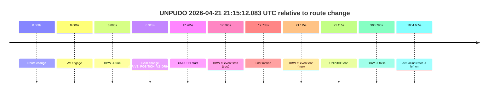
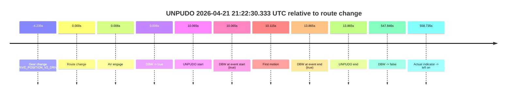

# Run Report: fme20036/2026-04-21--20-47-45--gen2-av-f7d37d9d-1bb1-4254-9bcc-feed94f26b1e

| Field | Value |
|---|---|
| Run ID | `fme20036/2026-04-21--20-47-45--gen2-av-f7d37d9d-1bb1-4254-9bcc-feed94f26b1e` |
| Date | `2026-04-21` |
| Model(s) | `pink-manta-ray-smooth` |
| Author | `guy.geva` |
| Event count | `3` |

## unpudo 2026-04-21 21:15:12.083 UTC

| Field | Value |
|---|---|
| Model | `pink-manta-ray-smooth` |
| Author | `guy.geva` |
| Run ID | `fme20036/2026-04-21--20-47-45--gen2-av-f7d37d9d-1bb1-4254-9bcc-feed94f26b1e` |
| Date | `2026-04-21` |
| Time (UTC) | `21:15:12.083` |
| Event type | `unpudo` |
| Disengagement type | `none observed` |
| Route change | `found` |
| Console | [run](https://console.sso.wayve.ai/run/fme20036/2026-04-21--20-47-45--gen2-av-f7d37d9d-1bb1-4254-9bcc-feed94f26b1e?id=&time-unixus=1776806112083298) |
| Foxglove | [segment](https://app.foxglove.dev/wayve-on-prem/p/prj_0dX18KZdVHg1fmmI/view?ds=foxglove-stream&ds.deviceName=fme20036&ds.start=2026-04-21T21%3A14%3A44.318275Z&ds.end=2026-04-21T21%3A31%3A38.114295Z&layoutId=lay_0e7VD4WIKDQGU73Y&time=2026-04-21T21%3A15%3A12.083298Z) |

### Event card: pass

- Pass: AV owns the credited unpudo from route change through the official unpudo window, the gear state is aligned at the anchor, and the vehicle moves without driver accelerator help in AV.

| Event | Time (UTC) | Delta from route change |
|---|---:|---:|
| Route change | 2026-04-21 21:14:54.318 | `0.000s` |
| AV engage | 2026-04-21 21:14:54.324 | `0.006s` |
| DBW -> true | 2026-04-21 21:14:54.324 | `0.006s` |
| Gear change (DRIVE_POSITION_V2_DRIVE) | 2026-04-21 21:14:54.633 | `0.315s` |
| UNPUDO start | 2026-04-21 21:15:12.083 | `17.765s` |
| DBW at event start (true) | 2026-04-21 21:15:12.083 | `17.765s` |
| First motion | 2026-04-21 21:15:12.103 | `17.785s` |
| DBW at event end (true) | 2026-04-21 21:15:15.433 | `21.115s` |
| UNPUDO end | 2026-04-21 21:15:15.433 | `21.115s` |
| DBW -> false | 2026-04-21 21:31:28.114 | `993.796s` |
| Actual indicator -> left on | 2026-04-21 21:31:39.003 | `1004.685s` |

| Metric | Value |
|---|---|
| Outcome | `pass` |
| Effective failure type | `none` |
| Route change status | `found` |
| DBW at event start | `true` |
| DBW at event end | `true` |
| Predicted gear at AV start | `DRIVE_POSITION_V2_PARK` |
| Actual gear at AV start | `DRIVE_POSITION_V2_PARK` |
| Predicted gear at event start | `DRIVE_POSITION_V2_DRIVE` |
| Actual gear at event start | `DRIVE_POSITION_V2_DRIVE` |
| Planned indicator direction | `INDICATORS_STATE_V2_RIGHT_ON` |
| Controller indicator direction | `INDICATORS_STATE_V2_RIGHT_ON` |
| Actual indicator direction | `INDICATORS_STATE_V2_OFF` |
| Actual indicator at maneuver end | `INDICATORS_STATE_V2_OFF` |
| Driver accel help in AV | `false` |
| Driver accel help timestamp | `n/a` |
| Max accel pedal pct in AV | `0.0%` |
| Max brake pedal pct in AV | `8.0%` |
| Max speed mps in AV | `5.639` |
| Success timing baseline | `route change` |
| Route -> AV | `0.006s` |
| AV -> event start | `17.759s` |
| AV -> first motion | `17.779s` |
| Success baseline -> event start | `17.765s` |
| Success baseline -> first motion | `17.785s` |
| AV duration before disengagement | `993.790s` |
| Trajectory waypoint count | `37` |
| Driving-plan step count | `11` |

The scored portion starts from the AV-owned window, not from the pre-AV setup. Route-change search in the stopped pre-event segment was `found`, with the baseline therefore set to route change. At the event anchor the model predicts `DRIVE_POSITION_V2_DRIVE` and the actual gear is `DRIVE_POSITION_V2_DRIVE`. The effective model outcome is `pass` because `the credited unpudo stays AV-owned through the official unpudo window.`

### Resolution

| Field | Value |
|---|---|
| Final outcome | `pass` |
| Do we agree with this label? | `yes` |
| Source disengagement type | `none observed` |
| Resolved effective failure type | `none` |
| Confidence | `high` |

## unpudo 2026-04-21 21:22:30.333 UTC

| Field | Value |
|---|---|
| Model | `pink-manta-ray-smooth` |
| Author | `guy.geva` |
| Run ID | `fme20036/2026-04-21--20-47-45--gen2-av-f7d37d9d-1bb1-4254-9bcc-feed94f26b1e` |
| Date | `2026-04-21` |
| Time (UTC) | `21:22:30.333` |
| Event type | `unpudo` |
| Disengagement type | `none observed` |
| Route change | `found` |
| Console | [run](https://console.sso.wayve.ai/run/fme20036/2026-04-21--20-47-45--gen2-av-f7d37d9d-1bb1-4254-9bcc-feed94f26b1e?id=&time-unixus=1776806550333318) |
| Foxglove | [segment](https://app.foxglove.dev/wayve-on-prem/p/prj_0dX18KZdVHg1fmmI/view?ds=foxglove-stream&ds.deviceName=fme20036&ds.start=2026-04-21T21%3A22%3A06.033318Z&ds.end=2026-04-21T21%3A31%3A38.114295Z&layoutId=lay_0e7VD4WIKDQGU73Y&time=2026-04-21T21%3A22%3A30.333318Z) |

### Event card: pass

- Pass: AV owns the credited unpudo from route change through the official unpudo window, the gear state is aligned at the anchor, and the vehicle moves without driver accelerator help in AV.

| Event | Time (UTC) | Delta from route change |
|---|---:|---:|
| Gear change (DRIVE_POSITION_V2_DRIVE) | 2026-04-21 21:22:16.033 | `-4.235s` |
| Route change | 2026-04-21 21:22:20.268 | `0.000s` |
| AV engage | 2026-04-21 21:22:20.274 | `0.006s` |
| DBW -> true | 2026-04-21 21:22:20.274 | `0.006s` |
| UNPUDO start | 2026-04-21 21:22:30.333 | `10.065s` |
| DBW at event start (true) | 2026-04-21 21:22:30.333 | `10.065s` |
| First motion | 2026-04-21 21:22:30.383 | `10.115s` |
| DBW at event end (true) | 2026-04-21 21:22:34.133 | `13.865s` |
| UNPUDO end | 2026-04-21 21:22:34.133 | `13.865s` |
| DBW -> false | 2026-04-21 21:31:28.114 | `547.846s` |
| Actual indicator -> left on | 2026-04-21 21:31:39.003 | `558.735s` |

| Metric | Value |
|---|---|
| Outcome | `pass` |
| Effective failure type | `none` |
| Route change status | `found` |
| DBW at event start | `true` |
| DBW at event end | `true` |
| Predicted gear at AV start | `DRIVE_POSITION_V2_DRIVE` |
| Actual gear at AV start | `DRIVE_POSITION_V2_DRIVE` |
| Predicted gear at event start | `DRIVE_POSITION_V2_DRIVE` |
| Actual gear at event start | `DRIVE_POSITION_V2_DRIVE` |
| Planned indicator direction | `INDICATORS_STATE_V2_LEFT_ON` |
| Controller indicator direction | `INDICATORS_STATE_V2_LEFT_ON` |
| Actual indicator direction | `INDICATORS_STATE_V2_OFF` |
| Actual indicator at maneuver end | `INDICATORS_STATE_V2_OFF` |
| Driver accel help in AV | `false` |
| Driver accel help timestamp | `n/a` |
| Max accel pedal pct in AV | `0.0%` |
| Max brake pedal pct in AV | `9.0%` |
| Max speed mps in AV | `4.506` |
| Success timing baseline | `route change` |
| Route -> AV | `0.006s` |
| AV -> event start | `10.059s` |
| AV -> first motion | `10.109s` |
| Success baseline -> event start | `10.065s` |
| Success baseline -> first motion | `10.115s` |
| AV duration before disengagement | `547.840s` |
| Trajectory waypoint count | `36` |
| Driving-plan step count | `11` |

The scored portion starts from the AV-owned window, not from the pre-AV setup. Route-change search in the stopped pre-event segment was `found`, with the baseline therefore set to route change. At the event anchor the model predicts `DRIVE_POSITION_V2_DRIVE` and the actual gear is `DRIVE_POSITION_V2_DRIVE`. The effective model outcome is `pass` because `the credited unpudo stays AV-owned through the official unpudo window.`

### Resolution

| Field | Value |
|---|---|
| Final outcome | `pass` |
| Do we agree with this label? | `yes` |
| Source disengagement type | `none observed` |
| Resolved effective failure type | `none` |
| Confidence | `high` |

## unpudo 2026-04-21 21:28:47.883 UTC

| Field | Value |
|---|---|
| Model | `pink-manta-ray-smooth` |
| Author | `guy.geva` |
| Run ID | `fme20036/2026-04-21--20-47-45--gen2-av-f7d37d9d-1bb1-4254-9bcc-feed94f26b1e` |
| Date | `2026-04-21` |
| Time (UTC) | `21:28:47.883` |
| Event type | `unpudo` |
| Disengagement type | `none observed` |
| Route change | `found` |
| Console | [run](https://console.sso.wayve.ai/run/fme20036/2026-04-21--20-47-45--gen2-av-f7d37d9d-1bb1-4254-9bcc-feed94f26b1e?id=&time-unixus=1776806927883313) |
| Foxglove | [segment](https://app.foxglove.dev/wayve-on-prem/p/prj_0dX18KZdVHg1fmmI/view?ds=foxglove-stream&ds.deviceName=fme20036&ds.start=2026-04-21T21%3A28%3A31.933308Z&ds.end=2026-04-21T21%3A31%3A38.114295Z&layoutId=lay_0e7VD4WIKDQGU73Y&time=2026-04-21T21%3A28%3A47.883313Z) |

### Event card: pass

- Pass: AV owns the credited unpudo from route change through the official unpudo window, the gear state is aligned at the anchor, and the vehicle moves without driver accelerator help in AV.

| Event | Time (UTC) | Delta from route change |
|---|---:|---:|
| Gear change (DRIVE_POSITION_V2_DRIVE) | 2026-04-21 21:28:41.933 | `-3.435s` |
| Route change | 2026-04-21 21:28:45.368 | `0.000s` |
| AV engage | 2026-04-21 21:28:45.375 | `0.007s` |
| DBW -> true | 2026-04-21 21:28:45.375 | `0.007s` |
| UNPUDO start | 2026-04-21 21:28:47.883 | `2.515s` |
| DBW at event start (true) | 2026-04-21 21:28:47.883 | `2.515s` |
| First motion | 2026-04-21 21:28:47.903 | `2.535s` |
| DBW at event end (true) | 2026-04-21 21:28:51.283 | `5.915s` |
| UNPUDO end | 2026-04-21 21:28:51.283 | `5.915s` |
| DBW -> false | 2026-04-21 21:31:28.114 | `162.746s` |
| Actual indicator -> left on | 2026-04-21 21:31:39.003 | `173.635s` |

| Metric | Value |
|---|---|
| Outcome | `pass` |
| Effective failure type | `none` |
| Route change status | `found` |
| DBW at event start | `true` |
| DBW at event end | `true` |
| Predicted gear at AV start | `DRIVE_POSITION_V2_DRIVE` |
| Actual gear at AV start | `DRIVE_POSITION_V2_DRIVE` |
| Predicted gear at event start | `DRIVE_POSITION_V2_DRIVE` |
| Actual gear at event start | `DRIVE_POSITION_V2_DRIVE` |
| Planned indicator direction | `INDICATORS_STATE_V2_RIGHT_ON` |
| Controller indicator direction | `INDICATORS_STATE_V2_RIGHT_ON` |
| Actual indicator direction | `INDICATORS_STATE_V2_OFF` |
| Actual indicator at maneuver end | `INDICATORS_STATE_V2_OFF` |
| Driver accel help in AV | `false` |
| Driver accel help timestamp | `n/a` |
| Max accel pedal pct in AV | `0.0%` |
| Max brake pedal pct in AV | `8.3%` |
| Max speed mps in AV | `5.156` |
| Success timing baseline | `route change` |
| Route -> AV | `0.007s` |
| AV -> event start | `2.508s` |
| AV -> first motion | `2.528s` |
| Success baseline -> event start | `2.515s` |
| Success baseline -> first motion | `2.535s` |
| AV duration before disengagement | `162.739s` |
| Trajectory waypoint count | `37` |
| Driving-plan step count | `11` |

The scored portion starts from the AV-owned window, not from the pre-AV setup. Route-change search in the stopped pre-event segment was `found`, with the baseline therefore set to route change. At the event anchor the model predicts `DRIVE_POSITION_V2_DRIVE` and the actual gear is `DRIVE_POSITION_V2_DRIVE`. The effective model outcome is `pass` because `the credited unpudo stays AV-owned through the official unpudo window.`

### Resolution

| Field | Value |
|---|---|
| Final outcome | `pass` |
| Do we agree with this label? | `yes` |
| Source disengagement type | `none observed` |
| Resolved effective failure type | `none` |
| Confidence | `high` |
