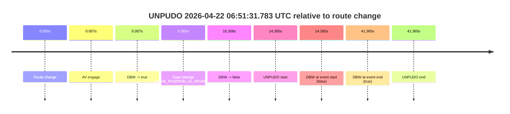
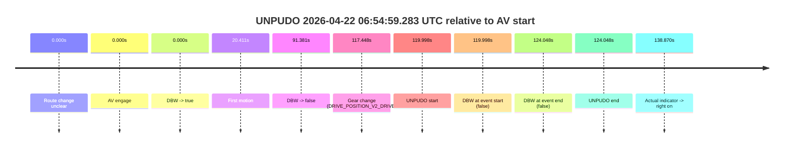
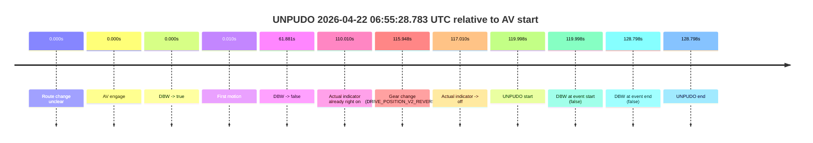
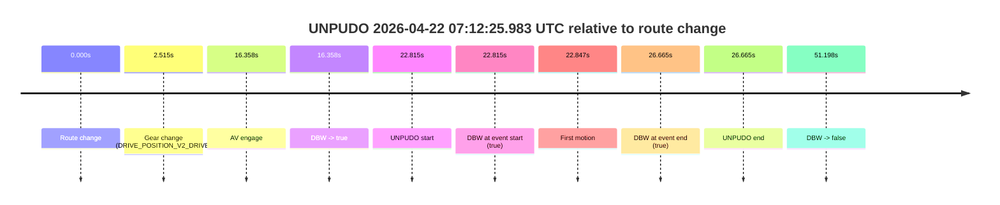
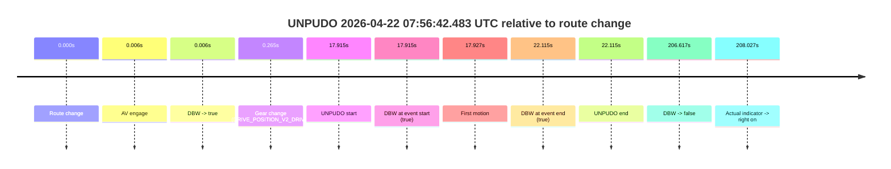
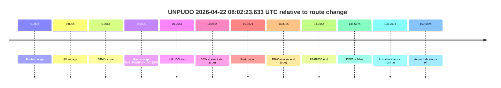
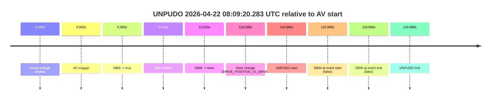
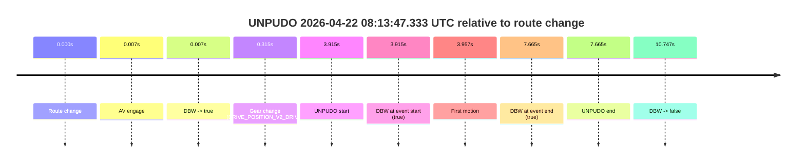

# Run Report: fme20036/2026-04-22--06-33-19--gen2-av-a5ab6b59-04e9-48b8-ab1d-b3db64f8f137

| Field | Value |
|---|---|
| Run ID | `fme20036/2026-04-22--06-33-19--gen2-av-a5ab6b59-04e9-48b8-ab1d-b3db64f8f137` |
| Date | `2026-04-22` |
| Model(s) | `eel-teal-outspoken` |
| Author | `zak` |
| Event count | `10` |

## unpudo 2026-04-22 06:47:05.533 UTC

| Field | Value |
|---|---|
| Model | `eel-teal-outspoken` |
| Author | `zak` |
| Run ID | `fme20036/2026-04-22--06-33-19--gen2-av-a5ab6b59-04e9-48b8-ab1d-b3db64f8f137` |
| Date | `2026-04-22` |
| Time (UTC) | `06:47:05.533` |
| Event type | `unpudo` |
| Disengagement type | `none observed` |
| Route change | `found` |
| Console | [run](https://console.sso.wayve.ai/run/fme20036/2026-04-22--06-33-19--gen2-av-a5ab6b59-04e9-48b8-ab1d-b3db64f8f137?id=&time-unixus=1776840425533316) |
| Foxglove | [segment](https://app.foxglove.dev/wayve-on-prem/p/prj_0dX18KZdVHg1fmmI/view?ds=foxglove-stream&ds.deviceName=fme20036&ds.start=2026-04-22T06%3A46%3A44.668320Z&ds.end=2026-04-22T06%3A51%3A37.826030Z&layoutId=lay_0e7VD4WIKDQGU73Y&time=2026-04-22T06%3A47%3A05.533316Z) |

### Event card: pass

- Pass: AV owns the credited unpudo from route change through the official unpudo window, the gear state is aligned at the anchor, and the vehicle moves without driver accelerator help in AV.

| Event | Time (UTC) | Delta from route change |
|---|---:|---:|
| Route change | 2026-04-22 06:46:54.668 | `0.000s` |
| AV engage | 2026-04-22 06:47:01.464 | `6.797s` |
| DBW -> true | 2026-04-22 06:47:01.464 | `6.797s` |
| Gear change (DRIVE_POSITION_V2_DRIVE) | 2026-04-22 06:47:01.983 | `7.315s` |
| UNPUDO start | 2026-04-22 06:47:05.533 | `10.865s` |
| DBW at event start (true) | 2026-04-22 06:47:05.533 | `10.865s` |
| First motion | 2026-04-22 06:47:05.555 | `10.887s` |
| DBW at event end (true) | 2026-04-22 06:47:08.933 | `14.265s` |
| UNPUDO end | 2026-04-22 06:47:08.933 | `14.265s` |
| DBW -> false | 2026-04-22 06:51:27.826 | `273.158s` |

| Metric | Value |
|---|---|
| Outcome | `pass` |
| Effective failure type | `none` |
| Route change status | `found` |
| DBW at event start | `true` |
| DBW at event end | `true` |
| Predicted gear at AV start | `DRIVE_POSITION_V2_DRIVE` |
| Actual gear at AV start | `DRIVE_POSITION_V2_PARK` |
| Predicted gear at event start | `DRIVE_POSITION_V2_DRIVE` |
| Actual gear at event start | `DRIVE_POSITION_V2_DRIVE` |
| Planned indicator direction | `INDICATORS_STATE_V2_RIGHT_ON` |
| Controller indicator direction | `INDICATORS_STATE_V2_RIGHT_ON` |
| Actual indicator direction | `INDICATORS_STATE_V2_OFF` |
| Actual indicator at maneuver end | `INDICATORS_STATE_V2_OFF` |
| Driver accel help in AV | `false` |
| Driver accel help timestamp | `n/a` |
| Max accel pedal pct in AV | `0.0%` |
| Max brake pedal pct in AV | `8.0%` |
| Max speed mps in AV | `5.114` |
| Success timing baseline | `route change` |
| Route -> AV | `6.797s` |
| AV -> event start | `4.068s` |
| AV -> first motion | `4.091s` |
| Success baseline -> event start | `10.865s` |
| Success baseline -> first motion | `10.887s` |
| AV duration before disengagement | `266.361s` |
| Trajectory waypoint count | `37` |
| Driving-plan step count | `11` |

The scored portion starts from the AV-owned window, not from the pre-AV setup. Route-change search in the stopped pre-event segment was `found`, with the baseline therefore set to route change. At the event anchor the model predicts `DRIVE_POSITION_V2_DRIVE` and the actual gear is `DRIVE_POSITION_V2_DRIVE`. The effective model outcome is `pass` because `the credited unpudo stays AV-owned through the official unpudo window.`

### Resolution

| Field | Value |
|---|---|
| Final outcome | `pass` |
| Do we agree with this label? | `yes` |
| Source disengagement type | `none observed` |
| Resolved effective failure type | `none` |
| Confidence | `high` |

## unpudo 2026-04-22 06:51:31.783 UTC

| Field | Value |
|---|---|
| Model | `eel-teal-outspoken` |
| Author | `zak` |
| Run ID | `fme20036/2026-04-22--06-33-19--gen2-av-a5ab6b59-04e9-48b8-ab1d-b3db64f8f137` |
| Date | `2026-04-22` |
| Time (UTC) | `06:51:31.783` |
| Event type | `unpudo` |
| Disengagement type | `none observed` |
| Route change | `found` |
| Console | [run](https://console.sso.wayve.ai/run/fme20036/2026-04-22--06-33-19--gen2-av-a5ab6b59-04e9-48b8-ab1d-b3db64f8f137?id=&time-unixus=1776840691783317) |
| Foxglove | [segment](https://app.foxglove.dev/wayve-on-prem/p/prj_0dX18KZdVHg1fmmI/view?ds=foxglove-stream&ds.deviceName=fme20036&ds.start=2026-04-22T06%3A51%3A07.518260Z&ds.end=2026-04-22T06%3A52%3A08.883299Z&layoutId=lay_0e7VD4WIKDQGU73Y&time=2026-04-22T06%3A51%3A31.783317Z) |

### Event card: fail

- Fail: the credited unpudo does not stay AV-owned. The event window starts with DBW false, and the maneuver outcome lands outside a clean AV-owned segment.

| Event | Time (UTC) | Delta from route change |
|---|---:|---:|
| Route change | 2026-04-22 06:51:17.518 | `0.000s` |
| AV engage | 2026-04-22 06:51:17.524 | `0.007s` |
| DBW -> true | 2026-04-22 06:51:17.524 | `0.007s` |
| Gear change (DRIVE_POSITION_V2_REVERSE) | 2026-04-22 06:51:17.883 | `0.365s` |
| DBW -> false | 2026-04-22 06:51:27.826 | `10.308s` |
| UNPUDO start | 2026-04-22 06:51:31.783 | `14.265s` |
| DBW at event start (false) | 2026-04-22 06:51:31.783 | `14.265s` |
| DBW at event end (true) | 2026-04-22 06:51:58.883 | `41.365s` |
| UNPUDO end | 2026-04-22 06:51:58.883 | `41.365s` |

| Metric | Value |
|---|---|
| Outcome | `fail` |
| Effective failure type | `not_av_owned` |
| Route change status | `found` |
| DBW at event start | `false` |
| DBW at event end | `true` |
| Predicted gear at AV start | `DRIVE_POSITION_V2_PARK` |
| Actual gear at AV start | `DRIVE_POSITION_V2_PARK` |
| Predicted gear at event start | `DRIVE_POSITION_V2_REVERSE` |
| Actual gear at event start | `DRIVE_POSITION_V2_REVERSE` |
| Planned indicator direction | `INDICATORS_STATE_V2_OFF` |
| Controller indicator direction | `INDICATORS_STATE_V2_OFF` |
| Actual indicator direction | `INDICATORS_STATE_V2_OFF` |
| Actual indicator at maneuver end | `INDICATORS_STATE_V2_OFF` |
| Driver accel help in AV | `false` |
| Driver accel help timestamp | `n/a` |
| Max accel pedal pct in AV | `0.0%` |
| Max brake pedal pct in AV | `8.8%` |
| Max speed mps in AV | `0.000` |
| Success timing baseline | `route change` |
| Route -> AV | `0.007s` |
| AV -> event start | `14.258s` |
| AV -> first motion | `n/a` |
| Success baseline -> event start | `14.265s` |
| Success baseline -> first motion | `n/a` |
| AV duration before disengagement | `10.301s` |
| Trajectory waypoint count | `36` |
| Driving-plan step count | `11` |

The scored portion starts from the AV-owned window, not from the pre-AV setup. Route-change search in the stopped pre-event segment was `found`, with the baseline therefore set to route change. At the event anchor the model predicts `DRIVE_POSITION_V2_REVERSE` and the actual gear is `DRIVE_POSITION_V2_REVERSE`. The effective model outcome is `fail` because `not_av_owned.`

### Resolution

| Field | Value |
|---|---|
| Final outcome | `fail` |
| Do we agree with this label? | `yes` |
| Source disengagement type | `none observed` |
| Resolved effective failure type | `not_av_owned` |
| Confidence | `high` |

## unpudo 2026-04-22 06:54:59.283 UTC

| Field | Value |
|---|---|
| Model | `eel-teal-outspoken` |
| Author | `zak` |
| Run ID | `fme20036/2026-04-22--06-33-19--gen2-av-a5ab6b59-04e9-48b8-ab1d-b3db64f8f137` |
| Date | `2026-04-22` |
| Time (UTC) | `06:54:59.283` |
| Event type | `unpudo` |
| Disengagement type | `none observed` |
| Route change | `unclear` |
| Console | [run](https://console.sso.wayve.ai/run/fme20036/2026-04-22--06-33-19--gen2-av-a5ab6b59-04e9-48b8-ab1d-b3db64f8f137?id=&time-unixus=1776840899283306) |
| Foxglove | [segment](https://app.foxglove.dev/wayve-on-prem/p/prj_0dX18KZdVHg1fmmI/view?ds=foxglove-stream&ds.deviceName=fme20036&ds.start=2026-04-22T06%3A52%3A49.284850Z&ds.end=2026-04-22T06%3A55%3A13.333302Z&layoutId=lay_0e7VD4WIKDQGU73Y&time=2026-04-22T06%3A54%3A59.283306Z) |

### Event card: fail

- Fail: the credited unpudo does not stay AV-owned. The event window starts with DBW false, and the maneuver outcome lands outside a clean AV-owned segment.

| Event | Time (UTC) | Delta from AV start |
|---|---:|---:|
| Route change unclear | 2026-04-22 06:52:59.284 | `0.000s` |
| AV engage | 2026-04-22 06:52:59.284 | `0.000s` |
| DBW -> true | 2026-04-22 06:52:59.284 | `0.000s` |
| First motion | 2026-04-22 06:53:19.696 | `20.411s` |
| DBW -> false | 2026-04-22 06:54:30.666 | `91.381s` |
| Gear change (DRIVE_POSITION_V2_DRIVE) | 2026-04-22 06:54:56.733 | `117.448s` |
| UNPUDO start | 2026-04-22 06:54:59.283 | `119.998s` |
| DBW at event start (false) | 2026-04-22 06:54:59.283 | `119.998s` |
| DBW at event end (false) | 2026-04-22 06:55:03.333 | `124.048s` |
| UNPUDO end | 2026-04-22 06:55:03.333 | `124.048s` |
| Actual indicator -> right on | 2026-04-22 06:55:18.155 | `138.870s` |

| Metric | Value |
|---|---|
| Outcome | `fail` |
| Effective failure type | `not_av_owned` |
| Route change status | `unclear` |
| DBW at event start | `false` |
| DBW at event end | `false` |
| Predicted gear at AV start | `DRIVE_POSITION_V2_DRIVE` |
| Actual gear at AV start | `DRIVE_POSITION_V2_DRIVE` |
| Predicted gear at event start | `DRIVE_POSITION_V2_DRIVE` |
| Actual gear at event start | `DRIVE_POSITION_V2_DRIVE` |
| Planned indicator direction | `INDICATORS_STATE_V2_OFF` |
| Controller indicator direction | `INDICATORS_STATE_V2_OFF` |
| Actual indicator direction | `INDICATORS_STATE_V2_OFF` |
| Actual indicator at maneuver end | `INDICATORS_STATE_V2_OFF` |
| Driver accel help in AV | `false` |
| Driver accel help timestamp | `n/a` |
| Max accel pedal pct in AV | `0.0%` |
| Max brake pedal pct in AV | `9.4%` |
| Max speed mps in AV | `8.078` |
| Success timing baseline | `AV start` |
| Route -> AV | `n/a` |
| AV -> event start | `119.998s` |
| AV -> first motion | `20.411s` |
| Success baseline -> event start | `119.998s` |
| Success baseline -> first motion | `20.411s` |
| AV duration before disengagement | `91.381s` |
| Trajectory waypoint count | `36` |
| Driving-plan step count | `11` |

The scored portion starts from the AV-owned window, not from the pre-AV setup. Route-change search in the stopped pre-event segment was `unclear`, with the baseline therefore set to AV start. At the event anchor the model predicts `DRIVE_POSITION_V2_DRIVE` and the actual gear is `DRIVE_POSITION_V2_DRIVE`. The effective model outcome is `fail` because `not_av_owned.`

### Resolution

| Field | Value |
|---|---|
| Final outcome | `fail` |
| Do we agree with this label? | `yes` |
| Source disengagement type | `none observed` |
| Resolved effective failure type | `not_av_owned` |
| Confidence | `medium` |

## unpudo 2026-04-22 06:55:28.783 UTC

| Field | Value |
|---|---|
| Model | `eel-teal-outspoken` |
| Author | `zak` |
| Run ID | `fme20036/2026-04-22--06-33-19--gen2-av-a5ab6b59-04e9-48b8-ab1d-b3db64f8f137` |
| Date | `2026-04-22` |
| Time (UTC) | `06:55:28.783` |
| Event type | `unpudo` |
| Disengagement type | `none observed` |
| Route change | `unclear` |
| Console | [run](https://console.sso.wayve.ai/run/fme20036/2026-04-22--06-33-19--gen2-av-a5ab6b59-04e9-48b8-ab1d-b3db64f8f137?id=&time-unixus=1776840928783301) |
| Foxglove | [segment](https://app.foxglove.dev/wayve-on-prem/p/prj_0dX18KZdVHg1fmmI/view?ds=foxglove-stream&ds.deviceName=fme20036&ds.start=2026-04-22T06%3A53%3A18.784894Z&ds.end=2026-04-22T06%3A55%3A47.583299Z&layoutId=lay_0e7VD4WIKDQGU73Y&time=2026-04-22T06%3A55%3A28.783301Z) |

### Event card: fail

- Fail: the credited unpudo does not stay AV-owned. The event window starts with DBW false, and the maneuver outcome lands outside a clean AV-owned segment.

| Event | Time (UTC) | Delta from AV start |
|---|---:|---:|
| Route change unclear | 2026-04-22 06:53:28.784 | `0.000s` |
| AV engage | 2026-04-22 06:53:28.784 | `0.000s` |
| DBW -> true | 2026-04-22 06:53:28.784 | `0.000s` |
| First motion | 2026-04-22 06:53:28.795 | `0.010s` |
| DBW -> false | 2026-04-22 06:54:30.666 | `61.881s` |
| Actual indicator already right on | 2026-04-22 06:55:18.795 | `110.010s` |
| Gear change (DRIVE_POSITION_V2_REVERSE) | 2026-04-22 06:55:24.733 | `115.948s` |
| Actual indicator -> off | 2026-04-22 06:55:25.795 | `117.010s` |
| UNPUDO start | 2026-04-22 06:55:28.783 | `119.998s` |
| DBW at event start (false) | 2026-04-22 06:55:28.783 | `119.998s` |
| DBW at event end (false) | 2026-04-22 06:55:37.583 | `128.798s` |
| UNPUDO end | 2026-04-22 06:55:37.583 | `128.798s` |

| Metric | Value |
|---|---|
| Outcome | `fail` |
| Effective failure type | `not_av_owned` |
| Route change status | `unclear` |
| DBW at event start | `false` |
| DBW at event end | `false` |
| Predicted gear at AV start | `DRIVE_POSITION_V2_DRIVE` |
| Actual gear at AV start | `DRIVE_POSITION_V2_DRIVE` |
| Predicted gear at event start | `DRIVE_POSITION_V2_REVERSE` |
| Actual gear at event start | `DRIVE_POSITION_V2_REVERSE` |
| Planned indicator direction | `INDICATORS_STATE_V2_OFF` |
| Controller indicator direction | `INDICATORS_STATE_V2_OFF` |
| Actual indicator direction | `INDICATORS_STATE_V2_OFF` |
| Actual indicator at maneuver end | `INDICATORS_STATE_V2_OFF` |
| Driver accel help in AV | `false` |
| Driver accel help timestamp | `n/a` |
| Max accel pedal pct in AV | `0.0%` |
| Max brake pedal pct in AV | `9.4%` |
| Max speed mps in AV | `8.078` |
| Success timing baseline | `AV start` |
| Route -> AV | `n/a` |
| AV -> event start | `119.998s` |
| AV -> first motion | `0.010s` |
| Success baseline -> event start | `119.998s` |
| Success baseline -> first motion | `0.010s` |
| AV duration before disengagement | `61.881s` |
| Trajectory waypoint count | `36` |
| Driving-plan step count | `11` |

The scored portion starts from the AV-owned window, not from the pre-AV setup. Route-change search in the stopped pre-event segment was `unclear`, with the baseline therefore set to AV start. At the event anchor the model predicts `DRIVE_POSITION_V2_REVERSE` and the actual gear is `DRIVE_POSITION_V2_REVERSE`. The effective model outcome is `fail` because `not_av_owned.`

### Resolution

| Field | Value |
|---|---|
| Final outcome | `fail` |
| Do we agree with this label? | `yes` |
| Source disengagement type | `none observed` |
| Resolved effective failure type | `not_av_owned` |
| Confidence | `medium` |

## unpudo 2026-04-22 07:12:25.983 UTC

| Field | Value |
|---|---|
| Model | `eel-teal-outspoken` |
| Author | `zak` |
| Run ID | `fme20036/2026-04-22--06-33-19--gen2-av-a5ab6b59-04e9-48b8-ab1d-b3db64f8f137` |
| Date | `2026-04-22` |
| Time (UTC) | `07:12:25.983` |
| Event type | `unpudo` |
| Disengagement type | `none observed` |
| Route change | `found` |
| Console | [run](https://console.sso.wayve.ai/run/fme20036/2026-04-22--06-33-19--gen2-av-a5ab6b59-04e9-48b8-ab1d-b3db64f8f137?id=&time-unixus=1776841945983311) |
| Foxglove | [segment](https://app.foxglove.dev/wayve-on-prem/p/prj_0dX18KZdVHg1fmmI/view?ds=foxglove-stream&ds.deviceName=fme20036&ds.start=2026-04-22T07%3A11%3A53.168267Z&ds.end=2026-04-22T07%3A13%3A04.366075Z&layoutId=lay_0e7VD4WIKDQGU73Y&time=2026-04-22T07%3A12%3A25.983311Z) |

### Event card: pass

- Pass: AV owns the credited unpudo from route change through the official unpudo window, the gear state is aligned at the anchor, and the vehicle moves without driver accelerator help in AV.

| Event | Time (UTC) | Delta from route change |
|---|---:|---:|
| Route change | 2026-04-22 07:12:03.168 | `0.000s` |
| Gear change (DRIVE_POSITION_V2_DRIVE) | 2026-04-22 07:12:05.683 | `2.515s` |
| AV engage | 2026-04-22 07:12:19.526 | `16.358s` |
| DBW -> true | 2026-04-22 07:12:19.526 | `16.358s` |
| UNPUDO start | 2026-04-22 07:12:25.983 | `22.815s` |
| DBW at event start (true) | 2026-04-22 07:12:25.983 | `22.815s` |
| First motion | 2026-04-22 07:12:26.015 | `22.847s` |
| DBW at event end (true) | 2026-04-22 07:12:29.833 | `26.665s` |
| UNPUDO end | 2026-04-22 07:12:29.833 | `26.665s` |
| DBW -> false | 2026-04-22 07:12:54.366 | `51.198s` |

| Metric | Value |
|---|---|
| Outcome | `pass` |
| Effective failure type | `none` |
| Route change status | `found` |
| DBW at event start | `true` |
| DBW at event end | `true` |
| Predicted gear at AV start | `DRIVE_POSITION_V2_DRIVE` |
| Actual gear at AV start | `DRIVE_POSITION_V2_DRIVE` |
| Predicted gear at event start | `DRIVE_POSITION_V2_DRIVE` |
| Actual gear at event start | `DRIVE_POSITION_V2_DRIVE` |
| Planned indicator direction | `INDICATORS_STATE_V2_OFF` |
| Controller indicator direction | `INDICATORS_STATE_V2_OFF` |
| Actual indicator direction | `INDICATORS_STATE_V2_OFF` |
| Actual indicator at maneuver end | `INDICATORS_STATE_V2_OFF` |
| Driver accel help in AV | `false` |
| Driver accel help timestamp | `n/a` |
| Max accel pedal pct in AV | `0.0%` |
| Max brake pedal pct in AV | `8.0%` |
| Max speed mps in AV | `3.667` |
| Success timing baseline | `route change` |
| Route -> AV | `16.358s` |
| AV -> event start | `6.457s` |
| AV -> first motion | `6.489s` |
| Success baseline -> event start | `22.815s` |
| Success baseline -> first motion | `22.847s` |
| AV duration before disengagement | `34.840s` |
| Trajectory waypoint count | `36` |
| Driving-plan step count | `11` |

The scored portion starts from the AV-owned window, not from the pre-AV setup. Route-change search in the stopped pre-event segment was `found`, with the baseline therefore set to route change. At the event anchor the model predicts `DRIVE_POSITION_V2_DRIVE` and the actual gear is `DRIVE_POSITION_V2_DRIVE`. The effective model outcome is `pass` because `the credited unpudo stays AV-owned through the official unpudo window.`

### Resolution

| Field | Value |
|---|---|
| Final outcome | `pass` |
| Do we agree with this label? | `yes` |
| Source disengagement type | `none observed` |
| Resolved effective failure type | `none` |
| Confidence | `high` |

## unpudo 2026-04-22 07:13:15.333 UTC

| Field | Value |
|---|---|
| Model | `eel-teal-outspoken` |
| Author | `zak` |
| Run ID | `fme20036/2026-04-22--06-33-19--gen2-av-a5ab6b59-04e9-48b8-ab1d-b3db64f8f137` |
| Date | `2026-04-22` |
| Time (UTC) | `07:13:15.333` |
| Event type | `unpudo` |
| Disengagement type | `none observed` |
| Route change | `found` |
| Console | [run](https://console.sso.wayve.ai/run/fme20036/2026-04-22--06-33-19--gen2-av-a5ab6b59-04e9-48b8-ab1d-b3db64f8f137?id=&time-unixus=1776841995333314) |
| Foxglove | [segment](https://app.foxglove.dev/wayve-on-prem/p/prj_0dX18KZdVHg1fmmI/view?ds=foxglove-stream&ds.deviceName=fme20036&ds.start=2026-04-22T07%3A11%3A53.168267Z&ds.end=2026-04-22T07%3A14%3A00.883303Z&layoutId=lay_0e7VD4WIKDQGU73Y&time=2026-04-22T07%3A13%3A15.333314Z) |

### Event card: fail

- Fail: the credited unpudo does not stay AV-owned. The event window starts with DBW false, and the maneuver outcome lands outside a clean AV-owned segment.

| Event | Time (UTC) | Delta from route change |
|---|---:|---:|
| Route change | 2026-04-22 07:12:03.168 | `0.000s` |
| AV engage | 2026-04-22 07:12:19.526 | `16.358s` |
| DBW -> true | 2026-04-22 07:12:19.526 | `16.358s` |
| First motion | 2026-04-22 07:12:26.015 | `22.847s` |
| DBW -> false | 2026-04-22 07:12:54.366 | `51.198s` |
| Gear change (DRIVE_POSITION_V2_DRIVE) | 2026-04-22 07:13:15.333 | `72.165s` |
| UNPUDO start | 2026-04-22 07:13:15.333 | `72.165s` |
| DBW at event start (false) | 2026-04-22 07:13:15.333 | `72.165s` |
| DBW at event end (false) | 2026-04-22 07:13:50.883 | `107.715s` |
| UNPUDO end | 2026-04-22 07:13:50.883 | `107.715s` |

| Metric | Value |
|---|---|
| Outcome | `fail` |
| Effective failure type | `not_av_owned` |
| Route change status | `found` |
| DBW at event start | `false` |
| DBW at event end | `false` |
| Predicted gear at AV start | `DRIVE_POSITION_V2_DRIVE` |
| Actual gear at AV start | `DRIVE_POSITION_V2_DRIVE` |
| Predicted gear at event start | `DRIVE_POSITION_V2_DRIVE` |
| Actual gear at event start | `DRIVE_POSITION_V2_DRIVE` |
| Planned indicator direction | `INDICATORS_STATE_V2_OFF` |
| Controller indicator direction | `INDICATORS_STATE_V2_OFF` |
| Actual indicator direction | `INDICATORS_STATE_V2_OFF` |
| Actual indicator at maneuver end | `INDICATORS_STATE_V2_OFF` |
| Driver accel help in AV | `false` |
| Driver accel help timestamp | `n/a` |
| Max accel pedal pct in AV | `0.0%` |
| Max brake pedal pct in AV | `8.0%` |
| Max speed mps in AV | `4.419` |
| Success timing baseline | `route change` |
| Route -> AV | `16.358s` |
| AV -> event start | `55.807s` |
| AV -> first motion | `6.489s` |
| Success baseline -> event start | `72.165s` |
| Success baseline -> first motion | `22.847s` |
| AV duration before disengagement | `34.840s` |
| Trajectory waypoint count | `37` |
| Driving-plan step count | `11` |

The scored portion starts from the AV-owned window, not from the pre-AV setup. Route-change search in the stopped pre-event segment was `found`, with the baseline therefore set to route change. At the event anchor the model predicts `DRIVE_POSITION_V2_DRIVE` and the actual gear is `DRIVE_POSITION_V2_DRIVE`. The effective model outcome is `fail` because `not_av_owned.`

### Resolution

| Field | Value |
|---|---|
| Final outcome | `fail` |
| Do we agree with this label? | `yes` |
| Source disengagement type | `none observed` |
| Resolved effective failure type | `not_av_owned` |
| Confidence | `high` |

## unpudo 2026-04-22 07:56:42.483 UTC

| Field | Value |
|---|---|
| Model | `eel-teal-outspoken` |
| Author | `zak` |
| Run ID | `fme20036/2026-04-22--06-33-19--gen2-av-a5ab6b59-04e9-48b8-ab1d-b3db64f8f137` |
| Date | `2026-04-22` |
| Time (UTC) | `07:56:42.483` |
| Event type | `unpudo` |
| Disengagement type | `none observed` |
| Route change | `found` |
| Console | [run](https://console.sso.wayve.ai/run/fme20036/2026-04-22--06-33-19--gen2-av-a5ab6b59-04e9-48b8-ab1d-b3db64f8f137?id=&time-unixus=1776844602483314) |
| Foxglove | [segment](https://app.foxglove.dev/wayve-on-prem/p/prj_0dX18KZdVHg1fmmI/view?ds=foxglove-stream&ds.deviceName=fme20036&ds.start=2026-04-22T07%3A56%3A14.568626Z&ds.end=2026-04-22T08%3A00%3A01.185448Z&layoutId=lay_0e7VD4WIKDQGU73Y&time=2026-04-22T07%3A56%3A42.483314Z) |

### Event card: pass

- Pass: AV owns the credited unpudo from route change through the official unpudo window, the gear state is aligned at the anchor, and the vehicle moves without driver accelerator help in AV.

| Event | Time (UTC) | Delta from route change |
|---|---:|---:|
| Route change | 2026-04-22 07:56:24.568 | `0.000s` |
| AV engage | 2026-04-22 07:56:24.574 | `0.006s` |
| DBW -> true | 2026-04-22 07:56:24.574 | `0.006s` |
| Gear change (DRIVE_POSITION_V2_DRIVE) | 2026-04-22 07:56:24.833 | `0.265s` |
| UNPUDO start | 2026-04-22 07:56:42.483 | `17.915s` |
| DBW at event start (true) | 2026-04-22 07:56:42.483 | `17.915s` |
| First motion | 2026-04-22 07:56:42.495 | `17.927s` |
| DBW at event end (true) | 2026-04-22 07:56:46.683 | `22.115s` |
| UNPUDO end | 2026-04-22 07:56:46.683 | `22.115s` |
| DBW -> false | 2026-04-22 07:59:51.185 | `206.617s` |
| Actual indicator -> right on | 2026-04-22 07:59:52.595 | `208.027s` |

| Metric | Value |
|---|---|
| Outcome | `pass` |
| Effective failure type | `none` |
| Route change status | `found` |
| DBW at event start | `true` |
| DBW at event end | `true` |
| Predicted gear at AV start | `DRIVE_POSITION_V2_PARK` |
| Actual gear at AV start | `DRIVE_POSITION_V2_PARK` |
| Predicted gear at event start | `DRIVE_POSITION_V2_DRIVE` |
| Actual gear at event start | `DRIVE_POSITION_V2_DRIVE` |
| Planned indicator direction | `INDICATORS_STATE_V2_RIGHT_ON` |
| Controller indicator direction | `INDICATORS_STATE_V2_RIGHT_ON` |
| Actual indicator direction | `INDICATORS_STATE_V2_OFF` |
| Actual indicator at maneuver end | `INDICATORS_STATE_V2_OFF` |
| Driver accel help in AV | `false` |
| Driver accel help timestamp | `n/a` |
| Max accel pedal pct in AV | `0.0%` |
| Max brake pedal pct in AV | `8.0%` |
| Max speed mps in AV | `4.200` |
| Success timing baseline | `route change` |
| Route -> AV | `0.006s` |
| AV -> event start | `17.909s` |
| AV -> first motion | `17.921s` |
| Success baseline -> event start | `17.915s` |
| Success baseline -> first motion | `17.927s` |
| AV duration before disengagement | `206.611s` |
| Trajectory waypoint count | `36` |
| Driving-plan step count | `11` |

The scored portion starts from the AV-owned window, not from the pre-AV setup. Route-change search in the stopped pre-event segment was `found`, with the baseline therefore set to route change. At the event anchor the model predicts `DRIVE_POSITION_V2_DRIVE` and the actual gear is `DRIVE_POSITION_V2_DRIVE`. The effective model outcome is `pass` because `the credited unpudo stays AV-owned through the official unpudo window.`

### Resolution

| Field | Value |
|---|---|
| Final outcome | `pass` |
| Do we agree with this label? | `yes` |
| Source disengagement type | `none observed` |
| Resolved effective failure type | `none` |
| Confidence | `high` |

## unpudo 2026-04-22 08:02:23.633 UTC

| Field | Value |
|---|---|
| Model | `eel-teal-outspoken` |
| Author | `zak` |
| Run ID | `fme20036/2026-04-22--06-33-19--gen2-av-a5ab6b59-04e9-48b8-ab1d-b3db64f8f137` |
| Date | `2026-04-22` |
| Time (UTC) | `08:02:23.633` |
| Event type | `unpudo` |
| Disengagement type | `none observed` |
| Route change | `found` |
| Console | [run](https://console.sso.wayve.ai/run/fme20036/2026-04-22--06-33-19--gen2-av-a5ab6b59-04e9-48b8-ab1d-b3db64f8f137?id=&time-unixus=1776844943633308) |
| Foxglove | [segment](https://app.foxglove.dev/wayve-on-prem/p/prj_0dX18KZdVHg1fmmI/view?ds=foxglove-stream&ds.deviceName=fme20036&ds.start=2026-04-22T08%3A02%3A03.368334Z&ds.end=2026-04-22T08%3A04%3A38.885623Z&layoutId=lay_0e7VD4WIKDQGU73Y&time=2026-04-22T08%3A02%3A23.633308Z) |

### Event card: pass

- Pass: AV owns the credited unpudo from route change through the official unpudo window, the gear state is aligned at the anchor, and the vehicle moves without driver accelerator help in AV.

| Event | Time (UTC) | Delta from route change |
|---|---:|---:|
| Route change | 2026-04-22 08:02:13.368 | `0.000s` |
| AV engage | 2026-04-22 08:02:13.374 | `0.006s` |
| DBW -> true | 2026-04-22 08:02:13.374 | `0.006s` |
| Gear change (DRIVE_POSITION_V2_DRIVE) | 2026-04-22 08:02:13.733 | `0.365s` |
| UNPUDO start | 2026-04-22 08:02:23.633 | `10.265s` |
| DBW at event start (true) | 2026-04-22 08:02:23.633 | `10.265s` |
| First motion | 2026-04-22 08:02:23.675 | `10.307s` |
| DBW at event end (true) | 2026-04-22 08:02:27.683 | `14.315s` |
| UNPUDO end | 2026-04-22 08:02:27.683 | `14.315s` |
| DBW -> false | 2026-04-22 08:04:28.885 | `135.517s` |
| Actual indicator -> right on | 2026-04-22 08:04:32.075 | `138.707s` |
| Actual indicator -> off | 2026-04-22 08:04:44.055 | `150.687s` |

| Metric | Value |
|---|---|
| Outcome | `pass` |
| Effective failure type | `none` |
| Route change status | `found` |
| DBW at event start | `true` |
| DBW at event end | `true` |
| Predicted gear at AV start | `DRIVE_POSITION_V2_PARK` |
| Actual gear at AV start | `DRIVE_POSITION_V2_PARK` |
| Predicted gear at event start | `DRIVE_POSITION_V2_DRIVE` |
| Actual gear at event start | `DRIVE_POSITION_V2_DRIVE` |
| Planned indicator direction | `INDICATORS_STATE_V2_RIGHT_ON` |
| Controller indicator direction | `INDICATORS_STATE_V2_RIGHT_ON` |
| Actual indicator direction | `INDICATORS_STATE_V2_OFF` |
| Actual indicator at maneuver end | `INDICATORS_STATE_V2_OFF` |
| Driver accel help in AV | `false` |
| Driver accel help timestamp | `n/a` |
| Max accel pedal pct in AV | `0.0%` |
| Max brake pedal pct in AV | `9.0%` |
| Max speed mps in AV | `4.711` |
| Success timing baseline | `route change` |
| Route -> AV | `0.006s` |
| AV -> event start | `10.259s` |
| AV -> first motion | `10.300s` |
| Success baseline -> event start | `10.265s` |
| Success baseline -> first motion | `10.307s` |
| AV duration before disengagement | `135.511s` |
| Trajectory waypoint count | `37` |
| Driving-plan step count | `11` |

The scored portion starts from the AV-owned window, not from the pre-AV setup. Route-change search in the stopped pre-event segment was `found`, with the baseline therefore set to route change. At the event anchor the model predicts `DRIVE_POSITION_V2_DRIVE` and the actual gear is `DRIVE_POSITION_V2_DRIVE`. The effective model outcome is `pass` because `the credited unpudo stays AV-owned through the official unpudo window.`

### Resolution

| Field | Value |
|---|---|
| Final outcome | `pass` |
| Do we agree with this label? | `yes` |
| Source disengagement type | `none observed` |
| Resolved effective failure type | `none` |
| Confidence | `high` |

## unpudo 2026-04-22 08:09:20.283 UTC

| Field | Value |
|---|---|
| Model | `eel-teal-outspoken` |
| Author | `zak` |
| Run ID | `fme20036/2026-04-22--06-33-19--gen2-av-a5ab6b59-04e9-48b8-ab1d-b3db64f8f137` |
| Date | `2026-04-22` |
| Time (UTC) | `08:09:20.283` |
| Event type | `unpudo` |
| Disengagement type | `none observed` |
| Route change | `unclear` |
| Console | [run](https://console.sso.wayve.ai/run/fme20036/2026-04-22--06-33-19--gen2-av-a5ab6b59-04e9-48b8-ab1d-b3db64f8f137?id=&time-unixus=1776845360283315) |
| Foxglove | [segment](https://app.foxglove.dev/wayve-on-prem/p/prj_0dX18KZdVHg1fmmI/view?ds=foxglove-stream&ds.deviceName=fme20036&ds.start=2026-04-22T08%3A07%3A10.285411Z&ds.end=2026-04-22T08%3A09%3A30.283315Z&layoutId=lay_0e7VD4WIKDQGU73Y&time=2026-04-22T08%3A09%3A20.283315Z) |

### Event card: fail

- Fail: the credited unpudo does not stay AV-owned. The event window starts with DBW false, and the maneuver outcome lands outside a clean AV-owned segment.

| Event | Time (UTC) | Delta from AV start |
|---|---:|---:|
| Route change unclear | 2026-04-22 08:07:20.285 | `0.000s` |
| AV engage | 2026-04-22 08:07:20.285 | `0.000s` |
| DBW -> true | 2026-04-22 08:07:20.285 | `0.000s` |
| First motion | 2026-04-22 08:07:20.295 | `0.010s` |
| DBW -> false | 2026-04-22 08:07:32.805 | `12.520s` |
| Gear change (DRIVE_POSITION_V2_DRIVE) | 2026-04-22 08:09:18.883 | `118.598s` |
| UNPUDO start | 2026-04-22 08:09:20.283 | `119.998s` |
| DBW at event start (false) | 2026-04-22 08:09:20.283 | `119.998s` |
| DBW at event end (false) | 2026-04-22 08:09:20.283 | `119.998s` |
| UNPUDO end | 2026-04-22 08:09:20.283 | `119.998s` |

| Metric | Value |
|---|---|
| Outcome | `fail` |
| Effective failure type | `not_av_owned` |
| Route change status | `unclear` |
| DBW at event start | `false` |
| DBW at event end | `false` |
| Predicted gear at AV start | `DRIVE_POSITION_V2_DRIVE` |
| Actual gear at AV start | `DRIVE_POSITION_V2_DRIVE` |
| Predicted gear at event start | `DRIVE_POSITION_V2_DRIVE` |
| Actual gear at event start | `DRIVE_POSITION_V2_DRIVE` |
| Planned indicator direction | `INDICATORS_STATE_V2_OFF` |
| Controller indicator direction | `INDICATORS_STATE_V2_OFF` |
| Actual indicator direction | `INDICATORS_STATE_V2_OFF` |
| Actual indicator at maneuver end | `INDICATORS_STATE_V2_OFF` |
| Driver accel help in AV | `false` |
| Driver accel help timestamp | `n/a` |
| Max accel pedal pct in AV | `0.0%` |
| Max brake pedal pct in AV | `0.0%` |
| Max speed mps in AV | `5.964` |
| Success timing baseline | `AV start` |
| Route -> AV | `n/a` |
| AV -> event start | `119.998s` |
| AV -> first motion | `0.010s` |
| Success baseline -> event start | `119.998s` |
| Success baseline -> first motion | `0.010s` |
| AV duration before disengagement | `12.520s` |
| Trajectory waypoint count | `36` |
| Driving-plan step count | `11` |

The scored portion starts from the AV-owned window, not from the pre-AV setup. Route-change search in the stopped pre-event segment was `unclear`, with the baseline therefore set to AV start. At the event anchor the model predicts `DRIVE_POSITION_V2_DRIVE` and the actual gear is `DRIVE_POSITION_V2_DRIVE`. The effective model outcome is `fail` because `not_av_owned.`

### Resolution

| Field | Value |
|---|---|
| Final outcome | `fail` |
| Do we agree with this label? | `yes` |
| Source disengagement type | `none observed` |
| Resolved effective failure type | `not_av_owned` |
| Confidence | `medium` |

## unpudo 2026-04-22 08:13:47.333 UTC

| Field | Value |
|---|---|
| Model | `eel-teal-outspoken` |
| Author | `zak` |
| Run ID | `fme20036/2026-04-22--06-33-19--gen2-av-a5ab6b59-04e9-48b8-ab1d-b3db64f8f137` |
| Date | `2026-04-22` |
| Time (UTC) | `08:13:47.333` |
| Event type | `unpudo` |
| Disengagement type | `none observed` |
| Route change | `found` |
| Console | [run](https://console.sso.wayve.ai/run/fme20036/2026-04-22--06-33-19--gen2-av-a5ab6b59-04e9-48b8-ab1d-b3db64f8f137?id=&time-unixus=1776845627333300) |
| Foxglove | [segment](https://app.foxglove.dev/wayve-on-prem/p/prj_0dX18KZdVHg1fmmI/view?ds=foxglove-stream&ds.deviceName=fme20036&ds.start=2026-04-22T08%3A13%3A33.418304Z&ds.end=2026-04-22T08%3A14%3A04.165315Z&layoutId=lay_0e7VD4WIKDQGU73Y&time=2026-04-22T08%3A13%3A47.333300Z) |

### Event card: pass

- Pass: AV owns the credited unpudo from route change through the official unpudo window, the gear state is aligned at the anchor, and the vehicle moves without driver accelerator help in AV.

| Event | Time (UTC) | Delta from route change |
|---|---:|---:|
| Route change | 2026-04-22 08:13:43.418 | `0.000s` |
| AV engage | 2026-04-22 08:13:43.424 | `0.007s` |
| DBW -> true | 2026-04-22 08:13:43.424 | `0.007s` |
| Gear change (DRIVE_POSITION_V2_DRIVE) | 2026-04-22 08:13:43.733 | `0.315s` |
| UNPUDO start | 2026-04-22 08:13:47.333 | `3.915s` |
| DBW at event start (true) | 2026-04-22 08:13:47.333 | `3.915s` |
| First motion | 2026-04-22 08:13:47.375 | `3.957s` |
| DBW at event end (true) | 2026-04-22 08:13:51.083 | `7.665s` |
| UNPUDO end | 2026-04-22 08:13:51.083 | `7.665s` |
| DBW -> false | 2026-04-22 08:13:54.165 | `10.747s` |

| Metric | Value |
|---|---|
| Outcome | `pass` |
| Effective failure type | `none` |
| Route change status | `found` |
| DBW at event start | `true` |
| DBW at event end | `true` |
| Predicted gear at AV start | `DRIVE_POSITION_V2_PARK` |
| Actual gear at AV start | `DRIVE_POSITION_V2_PARK` |
| Predicted gear at event start | `DRIVE_POSITION_V2_DRIVE` |
| Actual gear at event start | `DRIVE_POSITION_V2_DRIVE` |
| Planned indicator direction | `INDICATORS_STATE_V2_OFF` |
| Controller indicator direction | `INDICATORS_STATE_V2_OFF` |
| Actual indicator direction | `INDICATORS_STATE_V2_OFF` |
| Actual indicator at maneuver end | `INDICATORS_STATE_V2_OFF` |
| Driver accel help in AV | `false` |
| Driver accel help timestamp | `n/a` |
| Max accel pedal pct in AV | `0.0%` |
| Max brake pedal pct in AV | `9.7%` |
| Max speed mps in AV | `3.833` |
| Success timing baseline | `route change` |
| Route -> AV | `0.007s` |
| AV -> event start | `3.908s` |
| AV -> first motion | `3.950s` |
| Success baseline -> event start | `3.915s` |
| Success baseline -> first motion | `3.957s` |
| AV duration before disengagement | `10.740s` |
| Trajectory waypoint count | `37` |
| Driving-plan step count | `11` |

The scored portion starts from the AV-owned window, not from the pre-AV setup. Route-change search in the stopped pre-event segment was `found`, with the baseline therefore set to route change. At the event anchor the model predicts `DRIVE_POSITION_V2_DRIVE` and the actual gear is `DRIVE_POSITION_V2_DRIVE`. The effective model outcome is `pass` because `the credited unpudo stays AV-owned through the official unpudo window.`

### Resolution

| Field | Value |
|---|---|
| Final outcome | `pass` |
| Do we agree with this label? | `yes` |
| Source disengagement type | `none observed` |
| Resolved effective failure type | `none` |
| Confidence | `high` |
