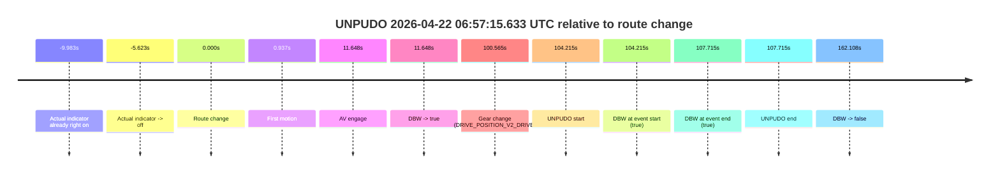
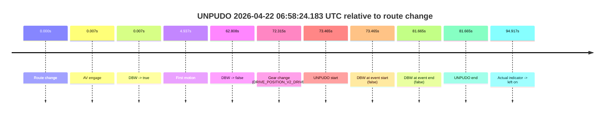
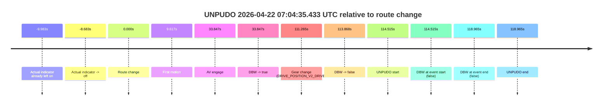
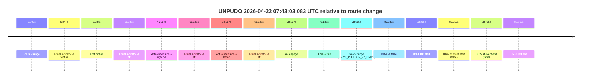
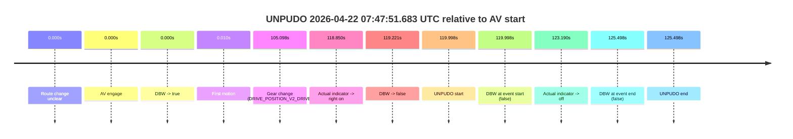
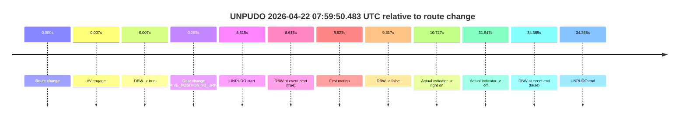
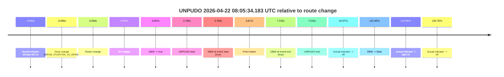

# Run Report: fme20036/2026-04-22--06-33-19--gen2-av-a5ab6b59-04e9-48b8-ab1d-b3db64f8f137

| Field | Value |
|---|---|
| Run ID | `fme20036/2026-04-22--06-33-19--gen2-av-a5ab6b59-04e9-48b8-ab1d-b3db64f8f137` |
| Date | `2026-04-22` |
| Model(s) | `pink-manta-ray-smooth` |
| Author | `guy.geva` |
| Event count | `9` |

## unpudo 2026-04-22 06:57:15.633 UTC

| Field | Value |
|---|---|
| Model | `pink-manta-ray-smooth` |
| Author | `guy.geva` |
| Run ID | `fme20036/2026-04-22--06-33-19--gen2-av-a5ab6b59-04e9-48b8-ab1d-b3db64f8f137` |
| Date | `2026-04-22` |
| Time (UTC) | `06:57:15.633` |
| Event type | `unpudo` |
| Disengagement type | `none observed` |
| Route change | `found` |
| Console | [run](https://console.sso.wayve.ai/run/fme20036/2026-04-22--06-33-19--gen2-av-a5ab6b59-04e9-48b8-ab1d-b3db64f8f137?id=&time-unixus=1776841035633316) |
| Foxglove | [segment](https://app.foxglove.dev/wayve-on-prem/p/prj_0dX18KZdVHg1fmmI/view?ds=foxglove-stream&ds.deviceName=fme20036&ds.start=2026-04-22T06%3A55%3A21.418246Z&ds.end=2026-04-22T06%3A58%3A23.526057Z&layoutId=lay_0e7VD4WIKDQGU73Y&time=2026-04-22T06%3A57%3A15.633316Z) |

### Event card: pass

- Pass: AV owns the credited unpudo from route change through the official unpudo window, the gear state is aligned at the anchor, and the vehicle moves without driver accelerator help in AV.

| Event | Time (UTC) | Delta from route change |
|---|---:|---:|
| Actual indicator already right on | 2026-04-22 06:55:21.435 | `-9.983s` |
| Actual indicator -> off | 2026-04-22 06:55:25.795 | `-5.623s` |
| Route change | 2026-04-22 06:55:31.418 | `0.000s` |
| First motion | 2026-04-22 06:55:32.355 | `0.937s` |
| AV engage | 2026-04-22 06:55:43.066 | `11.648s` |
| DBW -> true | 2026-04-22 06:55:43.066 | `11.648s` |
| Gear change (DRIVE_POSITION_V2_DRIVE) | 2026-04-22 06:57:11.983 | `100.565s` |
| UNPUDO start | 2026-04-22 06:57:15.633 | `104.215s` |
| DBW at event start (true) | 2026-04-22 06:57:15.633 | `104.215s` |
| DBW at event end (true) | 2026-04-22 06:57:19.133 | `107.715s` |
| UNPUDO end | 2026-04-22 06:57:19.133 | `107.715s` |
| DBW -> false | 2026-04-22 06:58:13.526 | `162.108s` |

| Metric | Value |
|---|---|
| Outcome | `pass` |
| Effective failure type | `none` |
| Route change status | `found` |
| DBW at event start | `true` |
| DBW at event end | `true` |
| Predicted gear at AV start | `DRIVE_POSITION_V2_DRIVE` |
| Actual gear at AV start | `DRIVE_POSITION_V2_DRIVE` |
| Predicted gear at event start | `DRIVE_POSITION_V2_DRIVE` |
| Actual gear at event start | `DRIVE_POSITION_V2_DRIVE` |
| Planned indicator direction | `INDICATORS_STATE_V2_RIGHT_ON` |
| Controller indicator direction | `INDICATORS_STATE_V2_RIGHT_ON` |
| Actual indicator direction | `INDICATORS_STATE_V2_OFF` |
| Actual indicator at maneuver end | `INDICATORS_STATE_V2_OFF` |
| Driver accel help in AV | `false` |
| Driver accel help timestamp | `n/a` |
| Max accel pedal pct in AV | `0.0%` |
| Max brake pedal pct in AV | `11.6%` |
| Max speed mps in AV | `7.864` |
| Success timing baseline | `route change` |
| Route -> AV | `11.648s` |
| AV -> event start | `92.567s` |
| AV -> first motion | `-10.711s` |
| Success baseline -> event start | `104.215s` |
| Success baseline -> first motion | `0.937s` |
| AV duration before disengagement | `150.460s` |
| Trajectory waypoint count | `37` |
| Driving-plan step count | `11` |

The scored portion starts from the AV-owned window, not from the pre-AV setup. Route-change search in the stopped pre-event segment was `found`, with the baseline therefore set to route change. At the event anchor the model predicts `DRIVE_POSITION_V2_DRIVE` and the actual gear is `DRIVE_POSITION_V2_DRIVE`. The effective model outcome is `pass` because `the credited unpudo stays AV-owned through the official unpudo window.`

### Resolution

| Field | Value |
|---|---|
| Final outcome | `pass` |
| Do we agree with this label? | `yes` |
| Source disengagement type | `none observed` |
| Resolved effective failure type | `none` |
| Confidence | `high` |

## unpudo 2026-04-22 06:58:24.183 UTC

| Field | Value |
|---|---|
| Model | `pink-manta-ray-smooth` |
| Author | `guy.geva` |
| Run ID | `fme20036/2026-04-22--06-33-19--gen2-av-a5ab6b59-04e9-48b8-ab1d-b3db64f8f137` |
| Date | `2026-04-22` |
| Time (UTC) | `06:58:24.183` |
| Event type | `unpudo` |
| Disengagement type | `failed_to_maintain_speed` |
| Route change | `found` |
| Console | [run](https://console.sso.wayve.ai/run/fme20036/2026-04-22--06-33-19--gen2-av-a5ab6b59-04e9-48b8-ab1d-b3db64f8f137?id=&time-unixus=1776841104183324) |
| Foxglove | [segment](https://app.foxglove.dev/wayve-on-prem/p/prj_0dX18KZdVHg1fmmI/view?ds=foxglove-stream&ds.deviceName=fme20036&ds.start=2026-04-22T06%3A57%3A00.718275Z&ds.end=2026-04-22T06%3A58%3A42.383315Z&layoutId=lay_0e7VD4WIKDQGU73Y&time=2026-04-22T06%3A58%3A24.183324Z) |

### Event card: fail

- Fail: AV owns part of the segment, but the event still resolves as a model-performance failure under the AV-only scoring rule.

| Event | Time (UTC) | Delta from route change |
|---|---:|---:|
| Route change | 2026-04-22 06:57:10.718 | `0.000s` |
| AV engage | 2026-04-22 06:57:10.724 | `0.007s` |
| DBW -> true | 2026-04-22 06:57:10.724 | `0.007s` |
| First motion | 2026-04-22 06:57:15.655 | `4.937s` |
| DBW -> false | 2026-04-22 06:58:13.526 | `62.808s` |
| Gear change (DRIVE_POSITION_V2_DRIVE) | 2026-04-22 06:58:23.033 | `72.315s` |
| UNPUDO start | 2026-04-22 06:58:24.183 | `73.465s` |
| DBW at event start (false) | 2026-04-22 06:58:24.183 | `73.465s` |
| DBW at event end (false) | 2026-04-22 06:58:32.383 | `81.665s` |
| UNPUDO end | 2026-04-22 06:58:32.383 | `81.665s` |
| Actual indicator -> left on | 2026-04-22 06:58:45.635 | `94.917s` |

| Metric | Value |
|---|---|
| Outcome | `fail` |
| Effective failure type | `failed_to_maintain_speed` |
| Route change status | `found` |
| DBW at event start | `false` |
| DBW at event end | `false` |
| Predicted gear at AV start | `DRIVE_POSITION_V2_DRIVE` |
| Actual gear at AV start | `DRIVE_POSITION_V2_DRIVE` |
| Predicted gear at event start | `DRIVE_POSITION_V2_DRIVE` |
| Actual gear at event start | `DRIVE_POSITION_V2_DRIVE` |
| Planned indicator direction | `INDICATORS_STATE_V2_OFF` |
| Controller indicator direction | `INDICATORS_STATE_V2_OFF` |
| Actual indicator direction | `INDICATORS_STATE_V2_OFF` |
| Actual indicator at maneuver end | `INDICATORS_STATE_V2_OFF` |
| Driver accel help in AV | `false` |
| Driver accel help timestamp | `n/a` |
| Max accel pedal pct in AV | `0.0%` |
| Max brake pedal pct in AV | `11.5%` |
| Max speed mps in AV | `8.083` |
| Success timing baseline | `route change` |
| Route -> AV | `0.007s` |
| AV -> event start | `73.459s` |
| AV -> first motion | `4.931s` |
| Success baseline -> event start | `73.465s` |
| Success baseline -> first motion | `4.937s` |
| AV duration before disengagement | `62.801s` |
| Trajectory waypoint count | `36` |
| Driving-plan step count | `11` |

The scored portion starts from the AV-owned window, not from the pre-AV setup. Route-change search in the stopped pre-event segment was `found`, with the baseline therefore set to route change. At the event anchor the model predicts `DRIVE_POSITION_V2_DRIVE` and the actual gear is `DRIVE_POSITION_V2_DRIVE`. The effective model outcome is `fail` because `failed_to_maintain_speed.`

### Resolution

| Field | Value |
|---|---|
| Final outcome | `fail` |
| Do we agree with this label? | `yes` |
| Source disengagement type | `failed_to_maintain_speed` |
| Resolved effective failure type | `failed_to_maintain_speed` |
| Confidence | `high` |

## unpudo 2026-04-22 07:04:35.433 UTC

| Field | Value |
|---|---|
| Model | `pink-manta-ray-smooth` |
| Author | `guy.geva` |
| Run ID | `fme20036/2026-04-22--06-33-19--gen2-av-a5ab6b59-04e9-48b8-ab1d-b3db64f8f137` |
| Date | `2026-04-22` |
| Time (UTC) | `07:04:35.433` |
| Event type | `unpudo` |
| Disengagement type | `none observed` |
| Route change | `found` |
| Console | [run](https://console.sso.wayve.ai/run/fme20036/2026-04-22--06-33-19--gen2-av-a5ab6b59-04e9-48b8-ab1d-b3db64f8f137?id=&time-unixus=1776841475433293) |
| Foxglove | [segment](https://app.foxglove.dev/wayve-on-prem/p/prj_0dX18KZdVHg1fmmI/view?ds=foxglove-stream&ds.deviceName=fme20036&ds.start=2026-04-22T07%3A02%3A30.918252Z&ds.end=2026-04-22T07%3A04%3A49.883300Z&layoutId=lay_0e7VD4WIKDQGU73Y&time=2026-04-22T07%3A04%3A35.433293Z) |

### Event card: fail

- Fail: the credited unpudo does not stay AV-owned. The event window starts with DBW false, and the maneuver outcome lands outside a clean AV-owned segment.

| Event | Time (UTC) | Delta from route change |
|---|---:|---:|
| Actual indicator already left on | 2026-04-22 07:02:30.935 | `-9.983s` |
| Actual indicator -> off | 2026-04-22 07:02:32.235 | `-8.683s` |
| Route change | 2026-04-22 07:02:40.918 | `0.000s` |
| First motion | 2026-04-22 07:02:50.535 | `9.617s` |
| AV engage | 2026-04-22 07:03:14.764 | `33.847s` |
| DBW -> true | 2026-04-22 07:03:14.764 | `33.847s` |
| Gear change (DRIVE_POSITION_V2_DRIVE) | 2026-04-22 07:04:32.183 | `111.265s` |
| DBW -> false | 2026-04-22 07:04:34.786 | `113.868s` |
| UNPUDO start | 2026-04-22 07:04:35.433 | `114.515s` |
| DBW at event start (false) | 2026-04-22 07:04:35.433 | `114.515s` |
| DBW at event end (false) | 2026-04-22 07:04:39.883 | `118.965s` |
| UNPUDO end | 2026-04-22 07:04:39.883 | `118.965s` |

| Metric | Value |
|---|---|
| Outcome | `fail` |
| Effective failure type | `completed_outside_av` |
| Route change status | `found` |
| DBW at event start | `false` |
| DBW at event end | `false` |
| Predicted gear at AV start | `DRIVE_POSITION_V2_DRIVE` |
| Actual gear at AV start | `DRIVE_POSITION_V2_PARK` |
| Predicted gear at event start | `DRIVE_POSITION_V2_DRIVE` |
| Actual gear at event start | `DRIVE_POSITION_V2_DRIVE` |
| Planned indicator direction | `INDICATORS_STATE_V2_RIGHT_ON` |
| Controller indicator direction | `INDICATORS_STATE_V2_RIGHT_ON` |
| Actual indicator direction | `INDICATORS_STATE_V2_OFF` |
| Actual indicator at maneuver end | `INDICATORS_STATE_V2_OFF` |
| Driver accel help in AV | `false` |
| Driver accel help timestamp | `n/a` |
| Max accel pedal pct in AV | `0.0%` |
| Max brake pedal pct in AV | `10.8%` |
| Max speed mps in AV | `7.875` |
| Success timing baseline | `route change` |
| Route -> AV | `33.847s` |
| AV -> event start | `80.668s` |
| AV -> first motion | `-24.229s` |
| Success baseline -> event start | `114.515s` |
| Success baseline -> first motion | `9.617s` |
| AV duration before disengagement | `80.021s` |
| Trajectory waypoint count | `37` |
| Driving-plan step count | `11` |

The scored portion starts from the AV-owned window, not from the pre-AV setup. Route-change search in the stopped pre-event segment was `found`, with the baseline therefore set to route change. At the event anchor the model predicts `DRIVE_POSITION_V2_DRIVE` and the actual gear is `DRIVE_POSITION_V2_DRIVE`. The effective model outcome is `fail` because `completed_outside_av.`

### Resolution

| Field | Value |
|---|---|
| Final outcome | `fail` |
| Do we agree with this label? | `yes` |
| Source disengagement type | `none observed` |
| Resolved effective failure type | `completed_outside_av` |
| Confidence | `high` |

## unpudo 2026-04-22 07:24:50.683 UTC

| Field | Value |
|---|---|
| Model | `pink-manta-ray-smooth` |
| Author | `guy.geva` |
| Run ID | `fme20036/2026-04-22--06-33-19--gen2-av-a5ab6b59-04e9-48b8-ab1d-b3db64f8f137` |
| Date | `2026-04-22` |
| Time (UTC) | `07:24:50.683` |
| Event type | `unpudo` |
| Disengagement type | `none observed` |
| Route change | `found` |
| Console | [run](https://console.sso.wayve.ai/run/fme20036/2026-04-22--06-33-19--gen2-av-a5ab6b59-04e9-48b8-ab1d-b3db64f8f137?id=&time-unixus=1776842690683322) |
| Foxglove | [segment](https://app.foxglove.dev/wayve-on-prem/p/prj_0dX18KZdVHg1fmmI/view?ds=foxglove-stream&ds.deviceName=fme20036&ds.start=2026-04-22T07%3A24%3A24.921034Z&ds.end=2026-04-22T07%3A25%3A06.933321Z&layoutId=lay_0e7VD4WIKDQGU73Y&time=2026-04-22T07%3A24%3A50.683322Z) |

### Event card: fail

- Fail: the credited unpudo does not stay AV-owned. The event window starts with DBW false, and the maneuver outcome lands outside a clean AV-owned segment.

| Event | Time (UTC) | Delta from route change |
|---|---:|---:|
| Route change | 2026-04-22 07:24:34.921 | `0.000s` |
| AV engage | 2026-04-22 07:24:42.444 | `7.524s` |
| DBW -> true | 2026-04-22 07:24:42.444 | `7.524s` |
| Gear change (DRIVE_POSITION_V2_DRIVE) | 2026-04-22 07:24:42.883 | `7.962s` |
| DBW -> false | 2026-04-22 07:24:49.987 | `15.066s` |
| UNPUDO start | 2026-04-22 07:24:50.683 | `15.762s` |
| DBW at event start (false) | 2026-04-22 07:24:50.683 | `15.762s` |
| DBW at event end (false) | 2026-04-22 07:24:56.933 | `22.012s` |
| UNPUDO end | 2026-04-22 07:24:56.933 | `22.012s` |

| Metric | Value |
|---|---|
| Outcome | `fail` |
| Effective failure type | `not_av_owned` |
| Route change status | `found` |
| DBW at event start | `false` |
| DBW at event end | `false` |
| Predicted gear at AV start | `DRIVE_POSITION_V2_DRIVE` |
| Actual gear at AV start | `DRIVE_POSITION_V2_PARK` |
| Predicted gear at event start | `DRIVE_POSITION_V2_DRIVE` |
| Actual gear at event start | `DRIVE_POSITION_V2_DRIVE` |
| Planned indicator direction | `INDICATORS_STATE_V2_RIGHT_ON` |
| Controller indicator direction | `INDICATORS_STATE_V2_RIGHT_ON` |
| Actual indicator direction | `INDICATORS_STATE_V2_OFF` |
| Actual indicator at maneuver end | `INDICATORS_STATE_V2_OFF` |
| Driver accel help in AV | `false` |
| Driver accel help timestamp | `n/a` |
| Max accel pedal pct in AV | `0.0%` |
| Max brake pedal pct in AV | `9.4%` |
| Max speed mps in AV | `0.000` |
| Success timing baseline | `route change` |
| Route -> AV | `7.524s` |
| AV -> event start | `8.238s` |
| AV -> first motion | `n/a` |
| Success baseline -> event start | `15.762s` |
| Success baseline -> first motion | `n/a` |
| AV duration before disengagement | `7.543s` |
| Trajectory waypoint count | `36` |
| Driving-plan step count | `11` |

The scored portion starts from the AV-owned window, not from the pre-AV setup. Route-change search in the stopped pre-event segment was `found`, with the baseline therefore set to route change. At the event anchor the model predicts `DRIVE_POSITION_V2_DRIVE` and the actual gear is `DRIVE_POSITION_V2_DRIVE`. The effective model outcome is `fail` because `not_av_owned.`

### Resolution

| Field | Value |
|---|---|
| Final outcome | `fail` |
| Do we agree with this label? | `yes` |
| Source disengagement type | `none observed` |
| Resolved effective failure type | `not_av_owned` |
| Confidence | `high` |

## unpudo 2026-04-22 07:39:01.183 UTC

| Field | Value |
|---|---|
| Model | `pink-manta-ray-smooth` |
| Author | `guy.geva` |
| Run ID | `fme20036/2026-04-22--06-33-19--gen2-av-a5ab6b59-04e9-48b8-ab1d-b3db64f8f137` |
| Date | `2026-04-22` |
| Time (UTC) | `07:39:01.183` |
| Event type | `unpudo` |
| Disengagement type | `none observed` |
| Route change | `found` |
| Console | [run](https://console.sso.wayve.ai/run/fme20036/2026-04-22--06-33-19--gen2-av-a5ab6b59-04e9-48b8-ab1d-b3db64f8f137?id=&time-unixus=1776843541183318) |
| Foxglove | [segment](https://app.foxglove.dev/wayve-on-prem/p/prj_0dX18KZdVHg1fmmI/view?ds=foxglove-stream&ds.deviceName=fme20036&ds.start=2026-04-22T07%3A38%3A37.818259Z&ds.end=2026-04-22T07%3A39%3A27.683303Z&layoutId=lay_0e7VD4WIKDQGU73Y&time=2026-04-22T07%3A39%3A01.183318Z) |

### Event card: fail

- Fail: the credited unpudo does not stay AV-owned. The event window starts with DBW false, and the maneuver outcome lands outside a clean AV-owned segment.

| Event | Time (UTC) | Delta from route change |
|---|---:|---:|
| Route change | 2026-04-22 07:38:47.818 | `0.000s` |
| AV engage | 2026-04-22 07:38:47.824 | `0.007s` |
| DBW -> true | 2026-04-22 07:38:47.824 | `0.007s` |
| Gear change (DRIVE_POSITION_V2_DRIVE) | 2026-04-22 07:38:48.083 | `0.265s` |
| DBW -> false | 2026-04-22 07:38:59.586 | `11.768s` |
| UNPUDO start | 2026-04-22 07:39:01.183 | `13.365s` |
| DBW at event start (false) | 2026-04-22 07:39:01.183 | `13.365s` |
| DBW at event end (true) | 2026-04-22 07:39:17.683 | `29.865s` |
| UNPUDO end | 2026-04-22 07:39:17.683 | `29.865s` |

| Metric | Value |
|---|---|
| Outcome | `fail` |
| Effective failure type | `not_av_owned` |
| Route change status | `found` |
| DBW at event start | `false` |
| DBW at event end | `true` |
| Predicted gear at AV start | `DRIVE_POSITION_V2_PARK` |
| Actual gear at AV start | `DRIVE_POSITION_V2_PARK` |
| Predicted gear at event start | `DRIVE_POSITION_V2_DRIVE` |
| Actual gear at event start | `DRIVE_POSITION_V2_DRIVE` |
| Planned indicator direction | `INDICATORS_STATE_V2_RIGHT_ON` |
| Controller indicator direction | `INDICATORS_STATE_V2_RIGHT_ON` |
| Actual indicator direction | `INDICATORS_STATE_V2_OFF` |
| Actual indicator at maneuver end | `INDICATORS_STATE_V2_OFF` |
| Driver accel help in AV | `false` |
| Driver accel help timestamp | `n/a` |
| Max accel pedal pct in AV | `0.0%` |
| Max brake pedal pct in AV | `8.0%` |
| Max speed mps in AV | `0.000` |
| Success timing baseline | `route change` |
| Route -> AV | `0.007s` |
| AV -> event start | `13.359s` |
| AV -> first motion | `n/a` |
| Success baseline -> event start | `13.365s` |
| Success baseline -> first motion | `n/a` |
| AV duration before disengagement | `11.762s` |
| Trajectory waypoint count | `36` |
| Driving-plan step count | `11` |

The scored portion starts from the AV-owned window, not from the pre-AV setup. Route-change search in the stopped pre-event segment was `found`, with the baseline therefore set to route change. At the event anchor the model predicts `DRIVE_POSITION_V2_DRIVE` and the actual gear is `DRIVE_POSITION_V2_DRIVE`. The effective model outcome is `fail` because `not_av_owned.`

### Resolution

| Field | Value |
|---|---|
| Final outcome | `fail` |
| Do we agree with this label? | `yes` |
| Source disengagement type | `none observed` |
| Resolved effective failure type | `not_av_owned` |
| Confidence | `high` |

## unpudo 2026-04-22 07:43:03.083 UTC

| Field | Value |
|---|---|
| Model | `pink-manta-ray-smooth` |
| Author | `guy.geva` |
| Run ID | `fme20036/2026-04-22--06-33-19--gen2-av-a5ab6b59-04e9-48b8-ab1d-b3db64f8f137` |
| Date | `2026-04-22` |
| Time (UTC) | `07:43:03.083` |
| Event type | `unpudo` |
| Disengagement type | `none observed` |
| Route change | `found` |
| Console | [run](https://console.sso.wayve.ai/run/fme20036/2026-04-22--06-33-19--gen2-av-a5ab6b59-04e9-48b8-ab1d-b3db64f8f137?id=&time-unixus=1776843783083298) |
| Foxglove | [segment](https://app.foxglove.dev/wayve-on-prem/p/prj_0dX18KZdVHg1fmmI/view?ds=foxglove-stream&ds.deviceName=fme20036&ds.start=2026-04-22T07%3A41%3A29.868270Z&ds.end=2026-04-22T07%3A43%3A18.633295Z&layoutId=lay_0e7VD4WIKDQGU73Y&time=2026-04-22T07%3A43%3A03.083298Z) |

### Event card: fail

- Fail: the credited unpudo does not stay AV-owned. The event window starts with DBW false, and the maneuver outcome lands outside a clean AV-owned segment.

| Event | Time (UTC) | Delta from route change |
|---|---:|---:|
| Route change | 2026-04-22 07:41:39.868 | `0.000s` |
| Actual indicator -> right on | 2026-04-22 07:41:46.215 | `6.347s` |
| First motion | 2026-04-22 07:41:49.155 | `9.287s` |
| Actual indicator -> off | 2026-04-22 07:41:51.555 | `11.687s` |
| Actual indicator -> right on | 2026-04-22 07:42:26.755 | `46.887s` |
| Actual indicator -> off | 2026-04-22 07:42:40.395 | `60.527s` |
| Actual indicator -> left on | 2026-04-22 07:42:42.455 | `62.587s` |
| Actual indicator -> off | 2026-04-22 07:42:45.395 | `65.527s` |
| AV engage | 2026-04-22 07:42:58.004 | `78.137s` |
| DBW -> true | 2026-04-22 07:42:58.004 | `78.137s` |
| Gear change (DRIVE_POSITION_V2_DRIVE) | 2026-04-22 07:42:58.483 | `78.615s` |
| DBW -> false | 2026-04-22 07:43:02.405 | `82.538s` |
| UNPUDO start | 2026-04-22 07:43:03.083 | `83.215s` |
| DBW at event start (false) | 2026-04-22 07:43:03.083 | `83.215s` |
| DBW at event end (false) | 2026-04-22 07:43:08.633 | `88.765s` |
| UNPUDO end | 2026-04-22 07:43:08.633 | `88.765s` |

| Metric | Value |
|---|---|
| Outcome | `fail` |
| Effective failure type | `completed_outside_av` |
| Route change status | `found` |
| DBW at event start | `false` |
| DBW at event end | `false` |
| Predicted gear at AV start | `DRIVE_POSITION_V2_DRIVE` |
| Actual gear at AV start | `DRIVE_POSITION_V2_PARK` |
| Predicted gear at event start | `DRIVE_POSITION_V2_DRIVE` |
| Actual gear at event start | `DRIVE_POSITION_V2_DRIVE` |
| Planned indicator direction | `INDICATORS_STATE_V2_RIGHT_ON` |
| Controller indicator direction | `INDICATORS_STATE_V2_RIGHT_ON` |
| Actual indicator direction | `INDICATORS_STATE_V2_OFF` |
| Actual indicator at maneuver end | `INDICATORS_STATE_V2_OFF` |
| Driver accel help in AV | `false` |
| Driver accel help timestamp | `n/a` |
| Max accel pedal pct in AV | `0.0%` |
| Max brake pedal pct in AV | `8.0%` |
| Max speed mps in AV | `0.000` |
| Success timing baseline | `route change` |
| Route -> AV | `78.137s` |
| AV -> event start | `5.078s` |
| AV -> first motion | `-68.849s` |
| Success baseline -> event start | `83.215s` |
| Success baseline -> first motion | `9.287s` |
| AV duration before disengagement | `4.401s` |
| Trajectory waypoint count | `36` |
| Driving-plan step count | `11` |

The scored portion starts from the AV-owned window, not from the pre-AV setup. Route-change search in the stopped pre-event segment was `found`, with the baseline therefore set to route change. At the event anchor the model predicts `DRIVE_POSITION_V2_DRIVE` and the actual gear is `DRIVE_POSITION_V2_DRIVE`. The effective model outcome is `fail` because `completed_outside_av.`

### Resolution

| Field | Value |
|---|---|
| Final outcome | `fail` |
| Do we agree with this label? | `yes` |
| Source disengagement type | `none observed` |
| Resolved effective failure type | `completed_outside_av` |
| Confidence | `high` |

## unpudo 2026-04-22 07:47:51.683 UTC

| Field | Value |
|---|---|
| Model | `pink-manta-ray-smooth` |
| Author | `guy.geva` |
| Run ID | `fme20036/2026-04-22--06-33-19--gen2-av-a5ab6b59-04e9-48b8-ab1d-b3db64f8f137` |
| Date | `2026-04-22` |
| Time (UTC) | `07:47:51.683` |
| Event type | `unpudo` |
| Disengagement type | `none observed` |
| Route change | `unclear` |
| Console | [run](https://console.sso.wayve.ai/run/fme20036/2026-04-22--06-33-19--gen2-av-a5ab6b59-04e9-48b8-ab1d-b3db64f8f137?id=&time-unixus=1776844071683323) |
| Foxglove | [segment](https://app.foxglove.dev/wayve-on-prem/p/prj_0dX18KZdVHg1fmmI/view?ds=foxglove-stream&ds.deviceName=fme20036&ds.start=2026-04-22T07%3A45%3A41.685351Z&ds.end=2026-04-22T07%3A48%3A07.183319Z&layoutId=lay_0e7VD4WIKDQGU73Y&time=2026-04-22T07%3A47%3A51.683323Z) |

### Event card: fail

- Fail: the credited unpudo does not stay AV-owned. The event window starts with DBW false, and the maneuver outcome lands outside a clean AV-owned segment.

| Event | Time (UTC) | Delta from AV start |
|---|---:|---:|
| Route change unclear | 2026-04-22 07:45:51.685 | `0.000s` |
| AV engage | 2026-04-22 07:45:51.685 | `0.000s` |
| DBW -> true | 2026-04-22 07:45:51.685 | `0.000s` |
| First motion | 2026-04-22 07:45:51.695 | `0.010s` |
| Gear change (DRIVE_POSITION_V2_DRIVE) | 2026-04-22 07:47:36.783 | `105.098s` |
| Actual indicator -> right on | 2026-04-22 07:47:50.535 | `118.850s` |
| DBW -> false | 2026-04-22 07:47:50.905 | `119.221s` |
| UNPUDO start | 2026-04-22 07:47:51.683 | `119.998s` |
| DBW at event start (false) | 2026-04-22 07:47:51.683 | `119.998s` |
| Actual indicator -> off | 2026-04-22 07:47:54.875 | `123.190s` |
| DBW at event end (false) | 2026-04-22 07:47:57.183 | `125.498s` |
| UNPUDO end | 2026-04-22 07:47:57.183 | `125.498s` |

| Metric | Value |
|---|---|
| Outcome | `fail` |
| Effective failure type | `not_av_owned` |
| Route change status | `unclear` |
| DBW at event start | `false` |
| DBW at event end | `false` |
| Predicted gear at AV start | `DRIVE_POSITION_V2_DRIVE` |
| Actual gear at AV start | `DRIVE_POSITION_V2_DRIVE` |
| Predicted gear at event start | `DRIVE_POSITION_V2_DRIVE` |
| Actual gear at event start | `DRIVE_POSITION_V2_DRIVE` |
| Planned indicator direction | `INDICATORS_STATE_V2_RIGHT_ON` |
| Controller indicator direction | `INDICATORS_STATE_V2_RIGHT_ON` |
| Actual indicator direction | `INDICATORS_STATE_V2_RIGHT_ON` |
| Actual indicator at maneuver end | `INDICATORS_STATE_V2_OFF` |
| Driver accel help in AV | `false` |
| Driver accel help timestamp | `n/a` |
| Max accel pedal pct in AV | `0.0%` |
| Max brake pedal pct in AV | `8.0%` |
| Max speed mps in AV | `6.383` |
| Success timing baseline | `AV start` |
| Route -> AV | `n/a` |
| AV -> event start | `119.998s` |
| AV -> first motion | `0.010s` |
| Success baseline -> event start | `119.998s` |
| Success baseline -> first motion | `0.010s` |
| AV duration before disengagement | `119.221s` |
| Trajectory waypoint count | `36` |
| Driving-plan step count | `11` |

The scored portion starts from the AV-owned window, not from the pre-AV setup. Route-change search in the stopped pre-event segment was `unclear`, with the baseline therefore set to AV start. At the event anchor the model predicts `DRIVE_POSITION_V2_DRIVE` and the actual gear is `DRIVE_POSITION_V2_DRIVE`. The effective model outcome is `fail` because `not_av_owned.`

### Resolution

| Field | Value |
|---|---|
| Final outcome | `fail` |
| Do we agree with this label? | `yes` |
| Source disengagement type | `none observed` |
| Resolved effective failure type | `not_av_owned` |
| Confidence | `medium` |

## unpudo 2026-04-22 07:59:50.483 UTC

| Field | Value |
|---|---|
| Model | `pink-manta-ray-smooth` |
| Author | `guy.geva` |
| Run ID | `fme20036/2026-04-22--06-33-19--gen2-av-a5ab6b59-04e9-48b8-ab1d-b3db64f8f137` |
| Date | `2026-04-22` |
| Time (UTC) | `07:59:50.483` |
| Event type | `unpudo` |
| Disengagement type | `none observed` |
| Route change | `found` |
| Console | [run](https://console.sso.wayve.ai/run/fme20036/2026-04-22--06-33-19--gen2-av-a5ab6b59-04e9-48b8-ab1d-b3db64f8f137?id=&time-unixus=1776844790483313) |
| Foxglove | [segment](https://app.foxglove.dev/wayve-on-prem/p/prj_0dX18KZdVHg1fmmI/view?ds=foxglove-stream&ds.deviceName=fme20036&ds.start=2026-04-22T07%3A59%3A31.868274Z&ds.end=2026-04-22T08%3A00%3A26.233308Z&layoutId=lay_0e7VD4WIKDQGU73Y&time=2026-04-22T07%3A59%3A50.483313Z) |

### Event card: fail

- Fail: this is a short AV stint rather than a durable model-owned maneuver. The vehicle never settles into a long enough AV-owned attempt to credit the model.

| Event | Time (UTC) | Delta from route change |
|---|---:|---:|
| Route change | 2026-04-22 07:59:41.868 | `0.000s` |
| AV engage | 2026-04-22 07:59:41.874 | `0.007s` |
| DBW -> true | 2026-04-22 07:59:41.874 | `0.007s` |
| Gear change (DRIVE_POSITION_V2_DRIVE) | 2026-04-22 07:59:42.133 | `0.265s` |
| UNPUDO start | 2026-04-22 07:59:50.483 | `8.615s` |
| DBW at event start (true) | 2026-04-22 07:59:50.483 | `8.615s` |
| First motion | 2026-04-22 07:59:50.495 | `8.627s` |
| DBW -> false | 2026-04-22 07:59:51.185 | `9.317s` |
| Actual indicator -> right on | 2026-04-22 07:59:52.595 | `10.727s` |
| Actual indicator -> off | 2026-04-22 08:00:13.715 | `31.847s` |
| DBW at event end (false) | 2026-04-22 08:00:16.233 | `34.365s` |
| UNPUDO end | 2026-04-22 08:00:16.233 | `34.365s` |

| Metric | Value |
|---|---|
| Outcome | `fail` |
| Effective failure type | `interrupted_handover` |
| Route change status | `found` |
| DBW at event start | `true` |
| DBW at event end | `false` |
| Predicted gear at AV start | `DRIVE_POSITION_V2_PARK` |
| Actual gear at AV start | `DRIVE_POSITION_V2_PARK` |
| Predicted gear at event start | `DRIVE_POSITION_V2_DRIVE` |
| Actual gear at event start | `DRIVE_POSITION_V2_DRIVE` |
| Planned indicator direction | `INDICATORS_STATE_V2_RIGHT_ON` |
| Controller indicator direction | `INDICATORS_STATE_V2_RIGHT_ON` |
| Actual indicator direction | `INDICATORS_STATE_V2_OFF` |
| Actual indicator at maneuver end | `INDICATORS_STATE_V2_OFF` |
| Driver accel help in AV | `false` |
| Driver accel help timestamp | `n/a` |
| Max accel pedal pct in AV | `0.0%` |
| Max brake pedal pct in AV | `8.0%` |
| Max speed mps in AV | `1.169` |
| Success timing baseline | `route change` |
| Route -> AV | `0.007s` |
| AV -> event start | `8.609s` |
| AV -> first motion | `8.621s` |
| Success baseline -> event start | `8.615s` |
| Success baseline -> first motion | `8.627s` |
| AV duration before disengagement | `9.311s` |
| Trajectory waypoint count | `36` |
| Driving-plan step count | `11` |

The scored portion starts from the AV-owned window, not from the pre-AV setup. Route-change search in the stopped pre-event segment was `found`, with the baseline therefore set to route change. At the event anchor the model predicts `DRIVE_POSITION_V2_DRIVE` and the actual gear is `DRIVE_POSITION_V2_DRIVE`. The effective model outcome is `fail` because `interrupted_handover.`

### Resolution

| Field | Value |
|---|---|
| Final outcome | `fail` |
| Do we agree with this label? | `yes` |
| Source disengagement type | `none observed` |
| Resolved effective failure type | `interrupted_handover` |
| Confidence | `high` |

## unpudo 2026-04-22 08:05:34.183 UTC

| Field | Value |
|---|---|
| Model | `pink-manta-ray-smooth` |
| Author | `guy.geva` |
| Run ID | `fme20036/2026-04-22--06-33-19--gen2-av-a5ab6b59-04e9-48b8-ab1d-b3db64f8f137` |
| Date | `2026-04-22` |
| Time (UTC) | `08:05:34.183` |
| Event type | `unpudo` |
| Disengagement type | `none observed` |
| Route change | `found` |
| Console | [run](https://console.sso.wayve.ai/run/fme20036/2026-04-22--06-33-19--gen2-av-a5ab6b59-04e9-48b8-ab1d-b3db64f8f137?id=&time-unixus=1776845134183308) |
| Foxglove | [segment](https://app.foxglove.dev/wayve-on-prem/p/prj_0dX18KZdVHg1fmmI/view?ds=foxglove-stream&ds.deviceName=fme20036&ds.start=2026-04-22T08%3A05%3A19.733296Z&ds.end=2026-04-22T08%3A07%3A42.805417Z&layoutId=lay_0e7VD4WIKDQGU73Y&time=2026-04-22T08%3A05%3A34.183308Z) |

### Event card: pass

- Pass: AV owns the credited unpudo from route change through the official unpudo window, the gear state is aligned at the anchor, and the vehicle moves without driver accelerator help in AV.

| Event | Time (UTC) | Delta from route change |
|---|---:|---:|
| Actual indicator already left on | 2026-04-22 08:05:20.435 | `-9.983s` |
| Gear change (DRIVE_POSITION_V2_DRIVE) | 2026-04-22 08:05:29.733 | `-0.685s` |
| Route change | 2026-04-22 08:05:30.418 | `0.000s` |
| AV engage | 2026-04-22 08:05:30.425 | `0.007s` |
| DBW -> true | 2026-04-22 08:05:30.425 | `0.007s` |
| UNPUDO start | 2026-04-22 08:05:34.183 | `3.765s` |
| DBW at event start (true) | 2026-04-22 08:05:34.183 | `3.765s` |
| First motion | 2026-04-22 08:05:34.235 | `3.817s` |
| DBW at event end (true) | 2026-04-22 08:05:37.633 | `7.215s` |
| UNPUDO end | 2026-04-22 08:05:37.633 | `7.215s` |
| Actual indicator -> off | 2026-04-22 08:05:40.995 | `10.577s` |
| DBW -> false | 2026-04-22 08:07:32.805 | `122.387s` |
| Actual indicator -> right on | 2026-04-22 08:07:35.315 | `124.897s` |
| Actual indicator -> off | 2026-04-22 08:07:37.215 | `126.797s` |

| Metric | Value |
|---|---|
| Outcome | `pass` |
| Effective failure type | `none` |
| Route change status | `found` |
| DBW at event start | `true` |
| DBW at event end | `true` |
| Predicted gear at AV start | `DRIVE_POSITION_V2_REVERSE` |
| Actual gear at AV start | `DRIVE_POSITION_V2_DRIVE` |
| Predicted gear at event start | `DRIVE_POSITION_V2_DRIVE` |
| Actual gear at event start | `DRIVE_POSITION_V2_DRIVE` |
| Planned indicator direction | `INDICATORS_STATE_V2_RIGHT_ON` |
| Controller indicator direction | `INDICATORS_STATE_V2_RIGHT_ON` |
| Actual indicator direction | `INDICATORS_STATE_V2_LEFT_ON` |
| Actual indicator at maneuver end | `INDICATORS_STATE_V2_LEFT_ON` |
| Driver accel help in AV | `false` |
| Driver accel help timestamp | `n/a` |
| Max accel pedal pct in AV | `0.0%` |
| Max brake pedal pct in AV | `8.0%` |
| Max speed mps in AV | `5.053` |
| Success timing baseline | `route change` |
| Route -> AV | `0.007s` |
| AV -> event start | `3.758s` |
| AV -> first motion | `3.810s` |
| Success baseline -> event start | `3.765s` |
| Success baseline -> first motion | `3.817s` |
| AV duration before disengagement | `122.380s` |
| Trajectory waypoint count | `36` |
| Driving-plan step count | `11` |

The scored portion starts from the AV-owned window, not from the pre-AV setup. Route-change search in the stopped pre-event segment was `found`, with the baseline therefore set to route change. At the event anchor the model predicts `DRIVE_POSITION_V2_DRIVE` and the actual gear is `DRIVE_POSITION_V2_DRIVE`. The effective model outcome is `pass` because `the credited unpudo stays AV-owned through the official unpudo window.`

### Resolution

| Field | Value |
|---|---|
| Final outcome | `pass` |
| Do we agree with this label? | `yes` |
| Source disengagement type | `none observed` |
| Resolved effective failure type | `none` |
| Confidence | `high` |
