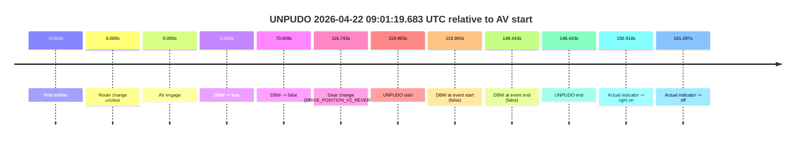
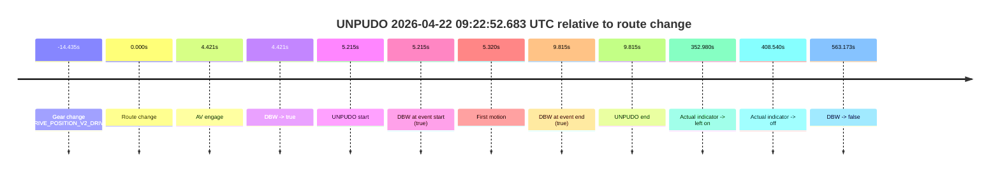
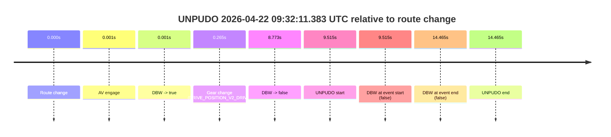
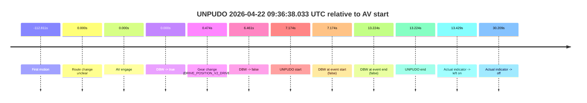
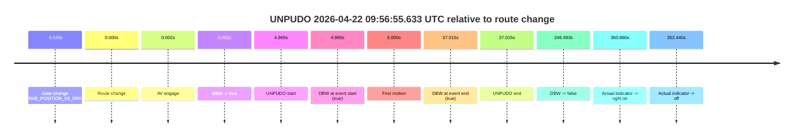
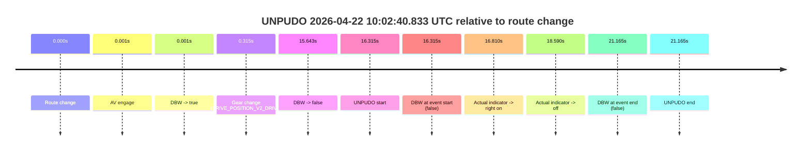
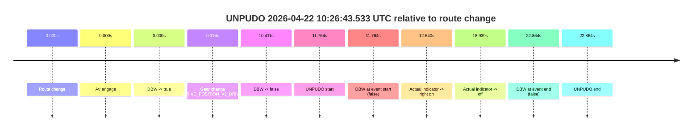
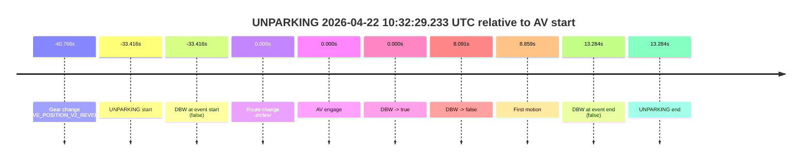

# Run Report: fme20036/2026-04-22--08-41-34--gen2-av-226468b9-4162-4768-9cdc-e643f6e5013a

| Field | Value |
|---|---|
| Run ID | `fme20036/2026-04-22--08-41-34--gen2-av-226468b9-4162-4768-9cdc-e643f6e5013a` |
| Date | `2026-04-22` |
| Model(s) | `pink-manta-ray-smooth` |
| Author | `guy.geva` |
| Event count | `9` |

## unpudo 2026-04-22 09:01:19.683 UTC

| Field | Value |
|---|---|
| Model | `pink-manta-ray-smooth` |
| Author | `guy.geva` |
| Run ID | `fme20036/2026-04-22--08-41-34--gen2-av-226468b9-4162-4768-9cdc-e643f6e5013a` |
| Date | `2026-04-22` |
| Time (UTC) | `09:01:19.683` |
| Event type | `unpudo` |
| Disengagement type | `none observed` |
| Route change | `unclear` |
| Console | [run](https://console.sso.wayve.ai/run/fme20036/2026-04-22--08-41-34--gen2-av-226468b9-4162-4768-9cdc-e643f6e5013a?id=&time-unixus=1776848479683322) |
| Foxglove | [segment](https://app.foxglove.dev/wayve-on-prem/p/prj_0dX18KZdVHg1fmmI/view?ds=foxglove-stream&ds.deviceName=fme20036&ds.start=2026-04-22T08%3A59%3A09.690564Z&ds.end=2026-04-22T09%3A01%3A58.133311Z&layoutId=lay_0e7VD4WIKDQGU73Y&time=2026-04-22T09%3A01%3A19.683322Z) |

### Event card: fail

- Fail: the credited unpudo does not stay AV-owned. The event window starts with DBW false, and the maneuver outcome lands outside a clean AV-owned segment.

| Event | Time (UTC) | Delta from AV start |
|---|---:|---:|
| First motion | 2026-04-22 08:59:19.688 | `-0.002s` |
| Route change unclear | 2026-04-22 08:59:19.690 | `0.000s` |
| AV engage | 2026-04-22 08:59:19.690 | `0.000s` |
| DBW -> true | 2026-04-22 08:59:19.690 | `0.000s` |
| DBW -> false | 2026-04-22 09:00:29.699 | `70.009s` |
| Gear change (DRIVE_POSITION_V2_REVERSE) | 2026-04-22 09:01:16.433 | `116.743s` |
| UNPUDO start | 2026-04-22 09:01:19.683 | `119.993s` |
| DBW at event start (false) | 2026-04-22 09:01:19.683 | `119.993s` |
| DBW at event end (false) | 2026-04-22 09:01:48.133 | `148.443s` |
| UNPUDO end | 2026-04-22 09:01:48.133 | `148.443s` |
| Actual indicator -> right on | 2026-04-22 09:01:50.608 | `150.918s` |
| Actual indicator -> off | 2026-04-22 09:02:00.788 | `161.097s` |

| Metric | Value |
|---|---|
| Outcome | `fail` |
| Effective failure type | `completed_outside_av` |
| Route change status | `unclear` |
| DBW at event start | `false` |
| DBW at event end | `false` |
| Predicted gear at AV start | `DRIVE_POSITION_V2_DRIVE` |
| Actual gear at AV start | `DRIVE_POSITION_V2_DRIVE` |
| Predicted gear at event start | `DRIVE_POSITION_V2_REVERSE` |
| Actual gear at event start | `DRIVE_POSITION_V2_REVERSE` |
| Planned indicator direction | `INDICATORS_STATE_V2_OFF` |
| Controller indicator direction | `INDICATORS_STATE_V2_OFF` |
| Actual indicator direction | `INDICATORS_STATE_V2_OFF` |
| Actual indicator at maneuver end | `INDICATORS_STATE_V2_OFF` |
| Driver accel help in AV | `false` |
| Driver accel help timestamp | `n/a` |
| Max accel pedal pct in AV | `0.0%` |
| Max brake pedal pct in AV | `8.0%` |
| Max speed mps in AV | `7.106` |
| Success timing baseline | `AV start` |
| Route -> AV | `n/a` |
| AV -> event start | `119.993s` |
| AV -> first motion | `-0.002s` |
| Success baseline -> event start | `119.993s` |
| Success baseline -> first motion | `-0.002s` |
| AV duration before disengagement | `70.009s` |
| Trajectory waypoint count | `37` |
| Driving-plan step count | `11` |

The scored portion starts from the AV-owned window, not from the pre-AV setup. Route-change search in the stopped pre-event segment was `unclear`, with the baseline therefore set to AV start. At the event anchor the model predicts `DRIVE_POSITION_V2_REVERSE` and the actual gear is `DRIVE_POSITION_V2_REVERSE`. The effective model outcome is `fail` because `completed_outside_av.`

### Resolution

| Field | Value |
|---|---|
| Final outcome | `fail` |
| Do we agree with this label? | `yes` |
| Source disengagement type | `none observed` |
| Resolved effective failure type | `completed_outside_av` |
| Confidence | `medium` |

## unpudo 2026-04-22 09:22:52.683 UTC

| Field | Value |
|---|---|
| Model | `pink-manta-ray-smooth` |
| Author | `guy.geva` |
| Run ID | `fme20036/2026-04-22--08-41-34--gen2-av-226468b9-4162-4768-9cdc-e643f6e5013a` |
| Date | `2026-04-22` |
| Time (UTC) | `09:22:52.683` |
| Event type | `unpudo` |
| Disengagement type | `none observed` |
| Route change | `found` |
| Console | [run](https://console.sso.wayve.ai/run/fme20036/2026-04-22--08-41-34--gen2-av-226468b9-4162-4768-9cdc-e643f6e5013a?id=&time-unixus=1776849772683317) |
| Foxglove | [segment](https://app.foxglove.dev/wayve-on-prem/p/prj_0dX18KZdVHg1fmmI/view?ds=foxglove-stream&ds.deviceName=fme20036&ds.start=2026-04-22T09%3A22%3A23.033318Z&ds.end=2026-04-22T09%3A32%3A20.641033Z&layoutId=lay_0e7VD4WIKDQGU73Y&time=2026-04-22T09%3A22%3A52.683317Z) |

### Event card: pass

- Pass: AV owns the credited unpudo from route change through the official unpudo window, the gear state is aligned at the anchor, and the vehicle moves without driver accelerator help in AV.

| Event | Time (UTC) | Delta from route change |
|---|---:|---:|
| Gear change (DRIVE_POSITION_V2_DRIVE) | 2026-04-22 09:22:33.033 | `-14.435s` |
| Route change | 2026-04-22 09:22:47.468 | `0.000s` |
| AV engage | 2026-04-22 09:22:51.889 | `4.421s` |
| DBW -> true | 2026-04-22 09:22:51.889 | `4.421s` |
| UNPUDO start | 2026-04-22 09:22:52.683 | `5.215s` |
| DBW at event start (true) | 2026-04-22 09:22:52.683 | `5.215s` |
| First motion | 2026-04-22 09:22:52.788 | `5.320s` |
| DBW at event end (true) | 2026-04-22 09:22:57.283 | `9.815s` |
| UNPUDO end | 2026-04-22 09:22:57.283 | `9.815s` |
| Actual indicator -> left on | 2026-04-22 09:28:40.448 | `352.980s` |
| Actual indicator -> off | 2026-04-22 09:29:36.008 | `408.540s` |
| DBW -> false | 2026-04-22 09:32:10.641 | `563.173s` |

| Metric | Value |
|---|---|
| Outcome | `pass` |
| Effective failure type | `none` |
| Route change status | `found` |
| DBW at event start | `true` |
| DBW at event end | `true` |
| Predicted gear at AV start | `DRIVE_POSITION_V2_DRIVE` |
| Actual gear at AV start | `DRIVE_POSITION_V2_DRIVE` |
| Predicted gear at event start | `DRIVE_POSITION_V2_DRIVE` |
| Actual gear at event start | `DRIVE_POSITION_V2_DRIVE` |
| Planned indicator direction | `INDICATORS_STATE_V2_RIGHT_ON` |
| Controller indicator direction | `INDICATORS_STATE_V2_RIGHT_ON` |
| Actual indicator direction | `INDICATORS_STATE_V2_OFF` |
| Actual indicator at maneuver end | `INDICATORS_STATE_V2_OFF` |
| Driver accel help in AV | `false` |
| Driver accel help timestamp | `n/a` |
| Max accel pedal pct in AV | `0.0%` |
| Max brake pedal pct in AV | `0.1%` |
| Max speed mps in AV | `3.050` |
| Success timing baseline | `route change` |
| Route -> AV | `4.421s` |
| AV -> event start | `0.794s` |
| AV -> first motion | `0.898s` |
| Success baseline -> event start | `5.215s` |
| Success baseline -> first motion | `5.320s` |
| AV duration before disengagement | `558.751s` |
| Trajectory waypoint count | `37` |
| Driving-plan step count | `11` |

The scored portion starts from the AV-owned window, not from the pre-AV setup. Route-change search in the stopped pre-event segment was `found`, with the baseline therefore set to route change. At the event anchor the model predicts `DRIVE_POSITION_V2_DRIVE` and the actual gear is `DRIVE_POSITION_V2_DRIVE`. The effective model outcome is `pass` because `the credited unpudo stays AV-owned through the official unpudo window.`

### Resolution

| Field | Value |
|---|---|
| Final outcome | `pass` |
| Do we agree with this label? | `yes` |
| Source disengagement type | `none observed` |
| Resolved effective failure type | `none` |
| Confidence | `high` |

## unpudo 2026-04-22 09:32:11.383 UTC

| Field | Value |
|---|---|
| Model | `pink-manta-ray-smooth` |
| Author | `guy.geva` |
| Run ID | `fme20036/2026-04-22--08-41-34--gen2-av-226468b9-4162-4768-9cdc-e643f6e5013a` |
| Date | `2026-04-22` |
| Time (UTC) | `09:32:11.383` |
| Event type | `unpudo` |
| Disengagement type | `none observed` |
| Route change | `found` |
| Console | [run](https://console.sso.wayve.ai/run/fme20036/2026-04-22--08-41-34--gen2-av-226468b9-4162-4768-9cdc-e643f6e5013a?id=&time-unixus=1776850331383306) |
| Foxglove | [segment](https://app.foxglove.dev/wayve-on-prem/p/prj_0dX18KZdVHg1fmmI/view?ds=foxglove-stream&ds.deviceName=fme20036&ds.start=2026-04-22T09%3A31%3A51.868285Z&ds.end=2026-04-22T09%3A32%3A26.333309Z&layoutId=lay_0e7VD4WIKDQGU73Y&time=2026-04-22T09%3A32%3A11.383306Z) |

### Event card: fail

- Fail: the credited unpudo does not stay AV-owned. The event window starts with DBW false, and the maneuver outcome lands outside a clean AV-owned segment.

| Event | Time (UTC) | Delta from route change |
|---|---:|---:|
| Route change | 2026-04-22 09:32:01.868 | `0.000s` |
| AV engage | 2026-04-22 09:32:01.869 | `0.001s` |
| DBW -> true | 2026-04-22 09:32:01.869 | `0.001s` |
| Gear change (DRIVE_POSITION_V2_DRIVE) | 2026-04-22 09:32:02.133 | `0.265s` |
| DBW -> false | 2026-04-22 09:32:10.641 | `8.773s` |
| UNPUDO start | 2026-04-22 09:32:11.383 | `9.515s` |
| DBW at event start (false) | 2026-04-22 09:32:11.383 | `9.515s` |
| DBW at event end (false) | 2026-04-22 09:32:16.333 | `14.465s` |
| UNPUDO end | 2026-04-22 09:32:16.333 | `14.465s` |

| Metric | Value |
|---|---|
| Outcome | `fail` |
| Effective failure type | `not_av_owned` |
| Route change status | `found` |
| DBW at event start | `false` |
| DBW at event end | `false` |
| Predicted gear at AV start | `DRIVE_POSITION_V2_PARK` |
| Actual gear at AV start | `DRIVE_POSITION_V2_PARK` |
| Predicted gear at event start | `DRIVE_POSITION_V2_DRIVE` |
| Actual gear at event start | `DRIVE_POSITION_V2_DRIVE` |
| Planned indicator direction | `INDICATORS_STATE_V2_OFF` |
| Controller indicator direction | `INDICATORS_STATE_V2_OFF` |
| Actual indicator direction | `INDICATORS_STATE_V2_OFF` |
| Actual indicator at maneuver end | `INDICATORS_STATE_V2_OFF` |
| Driver accel help in AV | `false` |
| Driver accel help timestamp | `n/a` |
| Max accel pedal pct in AV | `0.0%` |
| Max brake pedal pct in AV | `8.0%` |
| Max speed mps in AV | `0.000` |
| Success timing baseline | `route change` |
| Route -> AV | `0.001s` |
| AV -> event start | `9.514s` |
| AV -> first motion | `n/a` |
| Success baseline -> event start | `9.515s` |
| Success baseline -> first motion | `n/a` |
| AV duration before disengagement | `8.772s` |
| Trajectory waypoint count | `37` |
| Driving-plan step count | `11` |

The scored portion starts from the AV-owned window, not from the pre-AV setup. Route-change search in the stopped pre-event segment was `found`, with the baseline therefore set to route change. At the event anchor the model predicts `DRIVE_POSITION_V2_DRIVE` and the actual gear is `DRIVE_POSITION_V2_DRIVE`. The effective model outcome is `fail` because `not_av_owned.`

### Resolution

| Field | Value |
|---|---|
| Final outcome | `fail` |
| Do we agree with this label? | `yes` |
| Source disengagement type | `none observed` |
| Resolved effective failure type | `not_av_owned` |
| Confidence | `high` |

## unpudo 2026-04-22 09:36:38.033 UTC

| Field | Value |
|---|---|
| Model | `pink-manta-ray-smooth` |
| Author | `guy.geva` |
| Run ID | `fme20036/2026-04-22--08-41-34--gen2-av-226468b9-4162-4768-9cdc-e643f6e5013a` |
| Date | `2026-04-22` |
| Time (UTC) | `09:36:38.033` |
| Event type | `unpudo` |
| Disengagement type | `none observed` |
| Route change | `unclear` |
| Console | [run](https://console.sso.wayve.ai/run/fme20036/2026-04-22--08-41-34--gen2-av-226468b9-4162-4768-9cdc-e643f6e5013a?id=&time-unixus=1776850598033300) |
| Foxglove | [segment](https://app.foxglove.dev/wayve-on-prem/p/prj_0dX18KZdVHg1fmmI/view?ds=foxglove-stream&ds.deviceName=fme20036&ds.start=2026-04-22T09%3A36%3A20.859177Z&ds.end=2026-04-22T09%3A36%3A54.083290Z&layoutId=lay_0e7VD4WIKDQGU73Y&time=2026-04-22T09%3A36%3A38.033300Z) |

### Event card: fail

- Fail: the credited unpudo does not stay AV-owned. The event window starts with DBW false, and the maneuver outcome lands outside a clean AV-owned segment.

| Event | Time (UTC) | Delta from AV start |
|---|---:|---:|
| First motion | 2026-04-22 09:34:38.048 | `-112.811s` |
| Route change unclear | 2026-04-22 09:36:30.859 | `0.000s` |
| AV engage | 2026-04-22 09:36:30.859 | `0.000s` |
| DBW -> true | 2026-04-22 09:36:30.859 | `0.000s` |
| Gear change (DRIVE_POSITION_V2_DRIVE) | 2026-04-22 09:36:31.333 | `0.474s` |
| DBW -> false | 2026-04-22 09:36:37.320 | `6.461s` |
| UNPUDO start | 2026-04-22 09:36:38.033 | `7.174s` |
| DBW at event start (false) | 2026-04-22 09:36:38.033 | `7.174s` |
| DBW at event end (false) | 2026-04-22 09:36:44.083 | `13.224s` |
| UNPUDO end | 2026-04-22 09:36:44.083 | `13.224s` |
| Actual indicator -> left on | 2026-04-22 09:36:44.288 | `13.429s` |
| Actual indicator -> off | 2026-04-22 09:37:01.068 | `30.209s` |

| Metric | Value |
|---|---|
| Outcome | `fail` |
| Effective failure type | `completed_outside_av` |
| Route change status | `unclear` |
| DBW at event start | `false` |
| DBW at event end | `false` |
| Predicted gear at AV start | `DRIVE_POSITION_V2_DRIVE` |
| Actual gear at AV start | `DRIVE_POSITION_V2_PARK` |
| Predicted gear at event start | `DRIVE_POSITION_V2_DRIVE` |
| Actual gear at event start | `DRIVE_POSITION_V2_DRIVE` |
| Planned indicator direction | `INDICATORS_STATE_V2_OFF` |
| Controller indicator direction | `INDICATORS_STATE_V2_OFF` |
| Actual indicator direction | `INDICATORS_STATE_V2_OFF` |
| Actual indicator at maneuver end | `INDICATORS_STATE_V2_OFF` |
| Driver accel help in AV | `false` |
| Driver accel help timestamp | `n/a` |
| Max accel pedal pct in AV | `0.0%` |
| Max brake pedal pct in AV | `8.3%` |
| Max speed mps in AV | `0.000` |
| Success timing baseline | `AV start` |
| Route -> AV | `n/a` |
| AV -> event start | `7.174s` |
| AV -> first motion | `-112.811s` |
| Success baseline -> event start | `7.174s` |
| Success baseline -> first motion | `-112.811s` |
| AV duration before disengagement | `6.461s` |
| Trajectory waypoint count | `36` |
| Driving-plan step count | `11` |

The scored portion starts from the AV-owned window, not from the pre-AV setup. Route-change search in the stopped pre-event segment was `unclear`, with the baseline therefore set to AV start. At the event anchor the model predicts `DRIVE_POSITION_V2_DRIVE` and the actual gear is `DRIVE_POSITION_V2_DRIVE`. The effective model outcome is `fail` because `completed_outside_av.`

### Resolution

| Field | Value |
|---|---|
| Final outcome | `fail` |
| Do we agree with this label? | `yes` |
| Source disengagement type | `none observed` |
| Resolved effective failure type | `completed_outside_av` |
| Confidence | `medium` |

## unpudo 2026-04-22 09:53:05.333 UTC

| Field | Value |
|---|---|
| Model | `pink-manta-ray-smooth` |
| Author | `guy.geva` |
| Run ID | `fme20036/2026-04-22--08-41-34--gen2-av-226468b9-4162-4768-9cdc-e643f6e5013a` |
| Date | `2026-04-22` |
| Time (UTC) | `09:53:05.333` |
| Event type | `unpudo` |
| Disengagement type | `none observed` |
| Route change | `found` |
| Console | [run](https://console.sso.wayve.ai/run/fme20036/2026-04-22--08-41-34--gen2-av-226468b9-4162-4768-9cdc-e643f6e5013a?id=&time-unixus=1776851585333316) |
| Foxglove | [segment](https://app.foxglove.dev/wayve-on-prem/p/prj_0dX18KZdVHg1fmmI/view?ds=foxglove-stream&ds.deviceName=fme20036&ds.start=2026-04-22T09%3A52%3A38.268277Z&ds.end=2026-04-22T09%3A53%3A21.033302Z&layoutId=lay_0e7VD4WIKDQGU73Y&time=2026-04-22T09%3A53%3A05.333316Z) |

### Event card: fail

- Fail: the credited unpudo does not stay AV-owned. The event window starts with DBW false, and the maneuver outcome lands outside a clean AV-owned segment.

| Event | Time (UTC) | Delta from route change |
|---|---:|---:|
| Route change | 2026-04-22 09:52:48.268 | `0.000s` |
| AV engage | 2026-04-22 09:52:58.219 | `9.951s` |
| DBW -> true | 2026-04-22 09:52:58.219 | `9.951s` |
| Gear change (DRIVE_POSITION_V2_DRIVE) | 2026-04-22 09:52:58.633 | `10.365s` |
| DBW -> false | 2026-04-22 09:53:04.380 | `16.112s` |
| UNPUDO start | 2026-04-22 09:53:05.333 | `17.065s` |
| DBW at event start (false) | 2026-04-22 09:53:05.333 | `17.065s` |
| DBW at event end (false) | 2026-04-22 09:53:11.033 | `22.765s` |
| UNPUDO end | 2026-04-22 09:53:11.033 | `22.765s` |

| Metric | Value |
|---|---|
| Outcome | `fail` |
| Effective failure type | `not_av_owned` |
| Route change status | `found` |
| DBW at event start | `false` |
| DBW at event end | `false` |
| Predicted gear at AV start | `DRIVE_POSITION_V2_DRIVE` |
| Actual gear at AV start | `DRIVE_POSITION_V2_PARK` |
| Predicted gear at event start | `DRIVE_POSITION_V2_DRIVE` |
| Actual gear at event start | `DRIVE_POSITION_V2_DRIVE` |
| Planned indicator direction | `INDICATORS_STATE_V2_RIGHT_ON` |
| Controller indicator direction | `INDICATORS_STATE_V2_RIGHT_ON` |
| Actual indicator direction | `INDICATORS_STATE_V2_OFF` |
| Actual indicator at maneuver end | `INDICATORS_STATE_V2_OFF` |
| Driver accel help in AV | `false` |
| Driver accel help timestamp | `n/a` |
| Max accel pedal pct in AV | `0.0%` |
| Max brake pedal pct in AV | `15.4%` |
| Max speed mps in AV | `0.000` |
| Success timing baseline | `route change` |
| Route -> AV | `9.951s` |
| AV -> event start | `7.114s` |
| AV -> first motion | `n/a` |
| Success baseline -> event start | `17.065s` |
| Success baseline -> first motion | `n/a` |
| AV duration before disengagement | `6.161s` |
| Trajectory waypoint count | `36` |
| Driving-plan step count | `11` |

The scored portion starts from the AV-owned window, not from the pre-AV setup. Route-change search in the stopped pre-event segment was `found`, with the baseline therefore set to route change. At the event anchor the model predicts `DRIVE_POSITION_V2_DRIVE` and the actual gear is `DRIVE_POSITION_V2_DRIVE`. The effective model outcome is `fail` because `not_av_owned.`

### Resolution

| Field | Value |
|---|---|
| Final outcome | `fail` |
| Do we agree with this label? | `yes` |
| Source disengagement type | `none observed` |
| Resolved effective failure type | `not_av_owned` |
| Confidence | `high` |

## unpudo 2026-04-22 09:56:55.633 UTC

| Field | Value |
|---|---|
| Model | `pink-manta-ray-smooth` |
| Author | `guy.geva` |
| Run ID | `fme20036/2026-04-22--08-41-34--gen2-av-226468b9-4162-4768-9cdc-e643f6e5013a` |
| Date | `2026-04-22` |
| Time (UTC) | `09:56:55.633` |
| Event type | `unpudo` |
| Disengagement type | `none observed` |
| Route change | `found` |
| Console | [run](https://console.sso.wayve.ai/run/fme20036/2026-04-22--08-41-34--gen2-av-226468b9-4162-4768-9cdc-e643f6e5013a?id=&time-unixus=1776851815633324) |
| Foxglove | [segment](https://app.foxglove.dev/wayve-on-prem/p/prj_0dX18KZdVHg1fmmI/view?ds=foxglove-stream&ds.deviceName=fme20036&ds.start=2026-04-22T09%3A56%3A37.133289Z&ds.end=2026-04-22T10%3A02%3A50.160990Z&layoutId=lay_0e7VD4WIKDQGU73Y&time=2026-04-22T09%3A56%3A55.633324Z) |

### Event card: pass

- Pass: AV owns the credited unpudo from route change through the official unpudo window, the gear state is aligned at the anchor, and the vehicle moves without driver accelerator help in AV.

| Event | Time (UTC) | Delta from route change |
|---|---:|---:|
| Gear change (DRIVE_POSITION_V2_DRIVE) | 2026-04-22 09:56:47.133 | `-3.535s` |
| Route change | 2026-04-22 09:56:50.668 | `0.000s` |
| AV engage | 2026-04-22 09:56:50.670 | `0.002s` |
| DBW -> true | 2026-04-22 09:56:50.670 | `0.002s` |
| UNPUDO start | 2026-04-22 09:56:55.633 | `4.965s` |
| DBW at event start (true) | 2026-04-22 09:56:55.633 | `4.965s` |
| First motion | 2026-04-22 09:56:55.668 | `5.000s` |
| DBW at event end (true) | 2026-04-22 09:57:27.683 | `37.015s` |
| UNPUDO end | 2026-04-22 09:57:27.683 | `37.015s` |
| DBW -> false | 2026-04-22 10:02:40.160 | `349.493s` |
| Actual indicator -> right on | 2026-04-22 10:02:41.328 | `350.660s` |
| Actual indicator -> off | 2026-04-22 10:02:43.108 | `352.440s` |

| Metric | Value |
|---|---|
| Outcome | `pass` |
| Effective failure type | `none` |
| Route change status | `found` |
| DBW at event start | `true` |
| DBW at event end | `true` |
| Predicted gear at AV start | `DRIVE_POSITION_V2_DRIVE` |
| Actual gear at AV start | `DRIVE_POSITION_V2_DRIVE` |
| Predicted gear at event start | `DRIVE_POSITION_V2_DRIVE` |
| Actual gear at event start | `DRIVE_POSITION_V2_DRIVE` |
| Planned indicator direction | `INDICATORS_STATE_V2_RIGHT_ON` |
| Controller indicator direction | `INDICATORS_STATE_V2_RIGHT_ON` |
| Actual indicator direction | `INDICATORS_STATE_V2_OFF` |
| Actual indicator at maneuver end | `INDICATORS_STATE_V2_OFF` |
| Driver accel help in AV | `false` |
| Driver accel help timestamp | `n/a` |
| Max accel pedal pct in AV | `0.0%` |
| Max brake pedal pct in AV | `8.0%` |
| Max speed mps in AV | `2.242` |
| Success timing baseline | `route change` |
| Route -> AV | `0.002s` |
| AV -> event start | `4.963s` |
| AV -> first motion | `4.998s` |
| Success baseline -> event start | `4.965s` |
| Success baseline -> first motion | `5.000s` |
| AV duration before disengagement | `349.490s` |
| Trajectory waypoint count | `36` |
| Driving-plan step count | `11` |

The scored portion starts from the AV-owned window, not from the pre-AV setup. Route-change search in the stopped pre-event segment was `found`, with the baseline therefore set to route change. At the event anchor the model predicts `DRIVE_POSITION_V2_DRIVE` and the actual gear is `DRIVE_POSITION_V2_DRIVE`. The effective model outcome is `pass` because `the credited unpudo stays AV-owned through the official unpudo window.`

### Resolution

| Field | Value |
|---|---|
| Final outcome | `pass` |
| Do we agree with this label? | `yes` |
| Source disengagement type | `none observed` |
| Resolved effective failure type | `none` |
| Confidence | `high` |

## unpudo 2026-04-22 10:02:40.833 UTC

| Field | Value |
|---|---|
| Model | `pink-manta-ray-smooth` |
| Author | `guy.geva` |
| Run ID | `fme20036/2026-04-22--08-41-34--gen2-av-226468b9-4162-4768-9cdc-e643f6e5013a` |
| Date | `2026-04-22` |
| Time (UTC) | `10:02:40.833` |
| Event type | `unpudo` |
| Disengagement type | `none observed` |
| Route change | `found` |
| Console | [run](https://console.sso.wayve.ai/run/fme20036/2026-04-22--08-41-34--gen2-av-226468b9-4162-4768-9cdc-e643f6e5013a?id=&time-unixus=1776852160833301) |
| Foxglove | [segment](https://app.foxglove.dev/wayve-on-prem/p/prj_0dX18KZdVHg1fmmI/view?ds=foxglove-stream&ds.deviceName=fme20036&ds.start=2026-04-22T10%3A02%3A14.518288Z&ds.end=2026-04-22T10%3A02%3A55.683301Z&layoutId=lay_0e7VD4WIKDQGU73Y&time=2026-04-22T10%3A02%3A40.833301Z) |

### Event card: fail

- Fail: the credited unpudo does not stay AV-owned. The event window starts with DBW false, and the maneuver outcome lands outside a clean AV-owned segment.

| Event | Time (UTC) | Delta from route change |
|---|---:|---:|
| Route change | 2026-04-22 10:02:24.518 | `0.000s` |
| AV engage | 2026-04-22 10:02:24.519 | `0.001s` |
| DBW -> true | 2026-04-22 10:02:24.519 | `0.001s` |
| Gear change (DRIVE_POSITION_V2_DRIVE) | 2026-04-22 10:02:24.833 | `0.315s` |
| DBW -> false | 2026-04-22 10:02:40.160 | `15.643s` |
| UNPUDO start | 2026-04-22 10:02:40.833 | `16.315s` |
| DBW at event start (false) | 2026-04-22 10:02:40.833 | `16.315s` |
| Actual indicator -> right on | 2026-04-22 10:02:41.328 | `16.810s` |
| Actual indicator -> off | 2026-04-22 10:02:43.108 | `18.590s` |
| DBW at event end (false) | 2026-04-22 10:02:45.683 | `21.165s` |
| UNPUDO end | 2026-04-22 10:02:45.683 | `21.165s` |

| Metric | Value |
|---|---|
| Outcome | `fail` |
| Effective failure type | `not_av_owned` |
| Route change status | `found` |
| DBW at event start | `false` |
| DBW at event end | `false` |
| Predicted gear at AV start | `DRIVE_POSITION_V2_PARK` |
| Actual gear at AV start | `DRIVE_POSITION_V2_PARK` |
| Predicted gear at event start | `DRIVE_POSITION_V2_DRIVE` |
| Actual gear at event start | `DRIVE_POSITION_V2_DRIVE` |
| Planned indicator direction | `INDICATORS_STATE_V2_LEFT_ON` |
| Controller indicator direction | `INDICATORS_STATE_V2_LEFT_ON` |
| Actual indicator direction | `INDICATORS_STATE_V2_OFF` |
| Actual indicator at maneuver end | `INDICATORS_STATE_V2_OFF` |
| Driver accel help in AV | `false` |
| Driver accel help timestamp | `n/a` |
| Max accel pedal pct in AV | `0.0%` |
| Max brake pedal pct in AV | `8.0%` |
| Max speed mps in AV | `0.000` |
| Success timing baseline | `route change` |
| Route -> AV | `0.001s` |
| AV -> event start | `16.314s` |
| AV -> first motion | `n/a` |
| Success baseline -> event start | `16.315s` |
| Success baseline -> first motion | `n/a` |
| AV duration before disengagement | `15.642s` |
| Trajectory waypoint count | `36` |
| Driving-plan step count | `11` |

The scored portion starts from the AV-owned window, not from the pre-AV setup. Route-change search in the stopped pre-event segment was `found`, with the baseline therefore set to route change. At the event anchor the model predicts `DRIVE_POSITION_V2_DRIVE` and the actual gear is `DRIVE_POSITION_V2_DRIVE`. The effective model outcome is `fail` because `not_av_owned.`

### Resolution

| Field | Value |
|---|---|
| Final outcome | `fail` |
| Do we agree with this label? | `yes` |
| Source disengagement type | `none observed` |
| Resolved effective failure type | `not_av_owned` |
| Confidence | `high` |

## unpudo 2026-04-22 10:26:43.533 UTC

| Field | Value |
|---|---|
| Model | `pink-manta-ray-smooth` |
| Author | `guy.geva` |
| Run ID | `fme20036/2026-04-22--08-41-34--gen2-av-226468b9-4162-4768-9cdc-e643f6e5013a` |
| Date | `2026-04-22` |
| Time (UTC) | `10:26:43.533` |
| Event type | `unpudo` |
| Disengagement type | `none observed` |
| Route change | `found` |
| Console | [run](https://console.sso.wayve.ai/run/fme20036/2026-04-22--08-41-34--gen2-av-226468b9-4162-4768-9cdc-e643f6e5013a?id=&time-unixus=1776853603533306) |
| Foxglove | [segment](https://app.foxglove.dev/wayve-on-prem/p/prj_0dX18KZdVHg1fmmI/view?ds=foxglove-stream&ds.deviceName=fme20036&ds.start=2026-04-22T10%3A26%3A21.769074Z&ds.end=2026-04-22T10%3A27%3A04.633303Z&layoutId=lay_0e7VD4WIKDQGU73Y&time=2026-04-22T10%3A26%3A43.533306Z) |

### Event card: fail

- Fail: the credited unpudo does not stay AV-owned. The event window starts with DBW false, and the maneuver outcome lands outside a clean AV-owned segment.

| Event | Time (UTC) | Delta from route change |
|---|---:|---:|
| Route change | 2026-04-22 10:26:31.769 | `0.000s` |
| AV engage | 2026-04-22 10:26:31.769 | `0.000s` |
| DBW -> true | 2026-04-22 10:26:31.769 | `0.000s` |
| Gear change (DRIVE_POSITION_V2_DRIVE) | 2026-04-22 10:26:32.083 | `0.314s` |
| DBW -> false | 2026-04-22 10:26:42.180 | `10.411s` |
| UNPUDO start | 2026-04-22 10:26:43.533 | `11.764s` |
| DBW at event start (false) | 2026-04-22 10:26:43.533 | `11.764s` |
| Actual indicator -> right on | 2026-04-22 10:26:44.308 | `12.540s` |
| Actual indicator -> off | 2026-04-22 10:26:50.708 | `18.939s` |
| DBW at event end (false) | 2026-04-22 10:26:54.633 | `22.864s` |
| UNPUDO end | 2026-04-22 10:26:54.633 | `22.864s` |

| Metric | Value |
|---|---|
| Outcome | `fail` |
| Effective failure type | `not_av_owned` |
| Route change status | `found` |
| DBW at event start | `false` |
| DBW at event end | `false` |
| Predicted gear at AV start | `DRIVE_POSITION_V2_PARK` |
| Actual gear at AV start | `DRIVE_POSITION_V2_PARK` |
| Predicted gear at event start | `DRIVE_POSITION_V2_DRIVE` |
| Actual gear at event start | `DRIVE_POSITION_V2_DRIVE` |
| Planned indicator direction | `INDICATORS_STATE_V2_OFF` |
| Controller indicator direction | `INDICATORS_STATE_V2_OFF` |
| Actual indicator direction | `INDICATORS_STATE_V2_OFF` |
| Actual indicator at maneuver end | `INDICATORS_STATE_V2_OFF` |
| Driver accel help in AV | `false` |
| Driver accel help timestamp | `n/a` |
| Max accel pedal pct in AV | `0.0%` |
| Max brake pedal pct in AV | `8.0%` |
| Max speed mps in AV | `0.000` |
| Success timing baseline | `route change` |
| Route -> AV | `0.000s` |
| AV -> event start | `11.764s` |
| AV -> first motion | `n/a` |
| Success baseline -> event start | `11.764s` |
| Success baseline -> first motion | `n/a` |
| AV duration before disengagement | `10.411s` |
| Trajectory waypoint count | `36` |
| Driving-plan step count | `11` |

The scored portion starts from the AV-owned window, not from the pre-AV setup. Route-change search in the stopped pre-event segment was `found`, with the baseline therefore set to route change. At the event anchor the model predicts `DRIVE_POSITION_V2_DRIVE` and the actual gear is `DRIVE_POSITION_V2_DRIVE`. The effective model outcome is `fail` because `not_av_owned.`

### Resolution

| Field | Value |
|---|---|
| Final outcome | `fail` |
| Do we agree with this label? | `yes` |
| Source disengagement type | `none observed` |
| Resolved effective failure type | `not_av_owned` |
| Confidence | `high` |

## unparking 2026-04-22 10:32:29.233 UTC

| Field | Value |
|---|---|
| Model | `pink-manta-ray-smooth` |
| Author | `guy.geva` |
| Run ID | `fme20036/2026-04-22--08-41-34--gen2-av-226468b9-4162-4768-9cdc-e643f6e5013a` |
| Date | `2026-04-22` |
| Time (UTC) | `10:32:29.233` |
| Event type | `unparking` |
| Disengagement type | `none observed` |
| Route change | `unclear` |
| Console | [run](https://console.sso.wayve.ai/run/fme20036/2026-04-22--08-41-34--gen2-av-226468b9-4162-4768-9cdc-e643f6e5013a?id=&time-unixus=1776853949233316) |
| Foxglove | [segment](https://app.foxglove.dev/wayve-on-prem/p/prj_0dX18KZdVHg1fmmI/view?ds=foxglove-stream&ds.deviceName=fme20036&ds.start=2026-04-22T10%3A32%3A11.883324Z&ds.end=2026-04-22T10%3A33%3A25.933309Z&layoutId=lay_0e7VD4WIKDQGU73Y&time=2026-04-22T10%3A32%3A29.233316Z) |

### Event card: fail

- Fail: the credited unparking does not stay AV-owned. The event window starts with DBW false, and the maneuver outcome lands outside a clean AV-owned segment.

| Event | Time (UTC) | Delta from AV start |
|---|---:|---:|
| Gear change (DRIVE_POSITION_V2_REVERSE) | 2026-04-22 10:32:21.883 | `-40.766s` |
| UNPARKING start | 2026-04-22 10:32:29.233 | `-33.416s` |
| DBW at event start (false) | 2026-04-22 10:32:29.233 | `-33.416s` |
| Route change unclear | 2026-04-22 10:33:02.649 | `0.000s` |
| AV engage | 2026-04-22 10:33:02.649 | `0.000s` |
| DBW -> true | 2026-04-22 10:33:02.649 | `0.000s` |
| DBW -> false | 2026-04-22 10:33:10.740 | `8.091s` |
| First motion | 2026-04-22 10:33:11.508 | `8.859s` |
| DBW at event end (false) | 2026-04-22 10:33:15.933 | `13.284s` |
| UNPARKING end | 2026-04-22 10:33:15.933 | `13.284s` |

| Metric | Value |
|---|---|
| Outcome | `fail` |
| Effective failure type | `not_av_owned` |
| Route change status | `unclear` |
| DBW at event start | `false` |
| DBW at event end | `false` |
| Predicted gear at AV start | `DRIVE_POSITION_V2_DRIVE` |
| Actual gear at AV start | `DRIVE_POSITION_V2_PARK` |
| Predicted gear at event start | `DRIVE_POSITION_V2_REVERSE` |
| Actual gear at event start | `DRIVE_POSITION_V2_REVERSE` |
| Planned indicator direction | `INDICATORS_STATE_V2_OFF` |
| Controller indicator direction | `INDICATORS_STATE_V2_OFF` |
| Actual indicator direction | `INDICATORS_STATE_V2_OFF` |
| Actual indicator at maneuver end | `INDICATORS_STATE_V2_OFF` |
| Driver accel help in AV | `false` |
| Driver accel help timestamp | `n/a` |
| Max accel pedal pct in AV | `0.0%` |
| Max brake pedal pct in AV | `8.0%` |
| Max speed mps in AV | `0.000` |
| Success timing baseline | `AV start` |
| Route -> AV | `n/a` |
| AV -> event start | `-33.416s` |
| AV -> first motion | `8.859s` |
| Success baseline -> event start | `-33.416s` |
| Success baseline -> first motion | `8.859s` |
| AV duration before disengagement | `8.091s` |
| Trajectory waypoint count | `36` |
| Driving-plan step count | `11` |

The scored portion starts from the AV-owned window, not from the pre-AV setup. Route-change search in the stopped pre-event segment was `unclear`, with the baseline therefore set to AV start. At the event anchor the model predicts `DRIVE_POSITION_V2_REVERSE` and the actual gear is `DRIVE_POSITION_V2_REVERSE`. The effective model outcome is `fail` because `not_av_owned.`

### Resolution

| Field | Value |
|---|---|
| Final outcome | `fail` |
| Do we agree with this label? | `yes` |
| Source disengagement type | `none observed` |
| Resolved effective failure type | `not_av_owned` |
| Confidence | `medium` |
