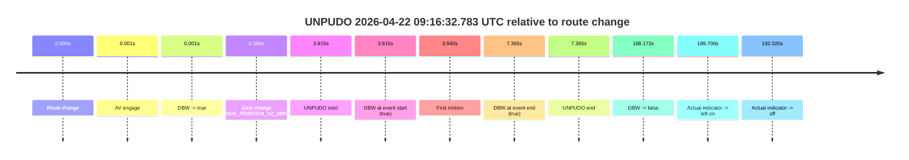
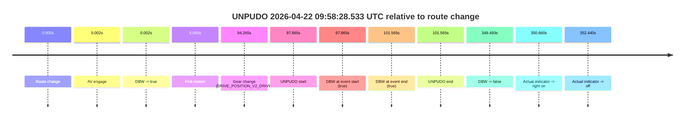
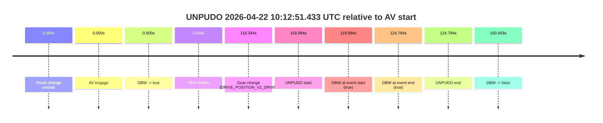
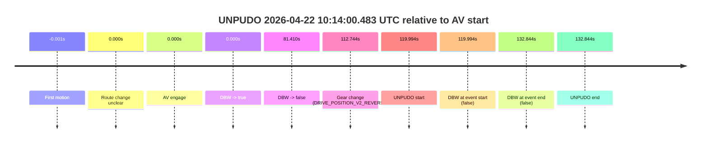
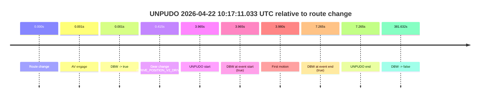
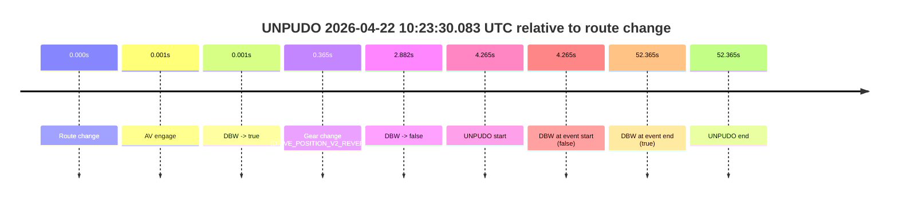

# Run Report: fme20036/2026-04-22--08-41-34--gen2-av-226468b9-4162-4768-9cdc-e643f6e5013a

| Field | Value |
|---|---|
| Run ID | `fme20036/2026-04-22--08-41-34--gen2-av-226468b9-4162-4768-9cdc-e643f6e5013a` |
| Date | `2026-04-22` |
| Model(s) | `eel-teal-outspoken` |
| Author | `zak` |
| Event count | `7` |

## unpudo 2026-04-22 09:16:32.783 UTC

| Field | Value |
|---|---|
| Model | `eel-teal-outspoken` |
| Author | `zak` |
| Run ID | `fme20036/2026-04-22--08-41-34--gen2-av-226468b9-4162-4768-9cdc-e643f6e5013a` |
| Date | `2026-04-22` |
| Time (UTC) | `09:16:32.783` |
| Event type | `unpudo` |
| Disengagement type | `none observed` |
| Route change | `found` |
| Console | [run](https://console.sso.wayve.ai/run/fme20036/2026-04-22--08-41-34--gen2-av-226468b9-4162-4768-9cdc-e643f6e5013a?id=&time-unixus=1776849392783303) |
| Foxglove | [segment](https://app.foxglove.dev/wayve-on-prem/p/prj_0dX18KZdVHg1fmmI/view?ds=foxglove-stream&ds.deviceName=fme20036&ds.start=2026-04-22T09%3A16%3A18.868282Z&ds.end=2026-04-22T09%3A19%3A47.040611Z&layoutId=lay_0e7VD4WIKDQGU73Y&time=2026-04-22T09%3A16%3A32.783303Z) |

### Event card: pass

- Pass: AV owns the credited unpudo from route change through the official unpudo window, the gear state is aligned at the anchor, and the vehicle moves without driver accelerator help in AV.

| Event | Time (UTC) | Delta from route change |
|---|---:|---:|
| Route change | 2026-04-22 09:16:28.868 | `0.000s` |
| AV engage | 2026-04-22 09:16:28.869 | `0.001s` |
| DBW -> true | 2026-04-22 09:16:28.869 | `0.001s` |
| Gear change (DRIVE_POSITION_V2_DRIVE) | 2026-04-22 09:16:29.233 | `0.365s` |
| UNPUDO start | 2026-04-22 09:16:32.783 | `3.915s` |
| DBW at event start (true) | 2026-04-22 09:16:32.783 | `3.915s` |
| First motion | 2026-04-22 09:16:32.808 | `3.940s` |
| DBW at event end (true) | 2026-04-22 09:16:36.233 | `7.365s` |
| UNPUDO end | 2026-04-22 09:16:36.233 | `7.365s` |
| DBW -> false | 2026-04-22 09:19:37.040 | `188.172s` |
| Actual indicator -> left on | 2026-04-22 09:19:38.568 | `189.700s` |
| Actual indicator -> off | 2026-04-22 09:19:40.888 | `192.020s` |

| Metric | Value |
|---|---|
| Outcome | `pass` |
| Effective failure type | `none` |
| Route change status | `found` |
| DBW at event start | `true` |
| DBW at event end | `true` |
| Predicted gear at AV start | `DRIVE_POSITION_V2_PARK` |
| Actual gear at AV start | `DRIVE_POSITION_V2_PARK` |
| Predicted gear at event start | `DRIVE_POSITION_V2_DRIVE` |
| Actual gear at event start | `DRIVE_POSITION_V2_DRIVE` |
| Planned indicator direction | `INDICATORS_STATE_V2_RIGHT_ON` |
| Controller indicator direction | `INDICATORS_STATE_V2_RIGHT_ON` |
| Actual indicator direction | `INDICATORS_STATE_V2_OFF` |
| Actual indicator at maneuver end | `INDICATORS_STATE_V2_OFF` |
| Driver accel help in AV | `false` |
| Driver accel help timestamp | `n/a` |
| Max accel pedal pct in AV | `0.0%` |
| Max brake pedal pct in AV | `8.0%` |
| Max speed mps in AV | `4.833` |
| Success timing baseline | `route change` |
| Route -> AV | `0.001s` |
| AV -> event start | `3.914s` |
| AV -> first motion | `3.939s` |
| Success baseline -> event start | `3.915s` |
| Success baseline -> first motion | `3.940s` |
| AV duration before disengagement | `188.171s` |
| Trajectory waypoint count | `37` |
| Driving-plan step count | `11` |

The scored portion starts from the AV-owned window, not from the pre-AV setup. Route-change search in the stopped pre-event segment was `found`, with the baseline therefore set to route change. At the event anchor the model predicts `DRIVE_POSITION_V2_DRIVE` and the actual gear is `DRIVE_POSITION_V2_DRIVE`. The effective model outcome is `pass` because `the credited unpudo stays AV-owned through the official unpudo window.`

### Resolution

| Field | Value |
|---|---|
| Final outcome | `pass` |
| Do we agree with this label? | `yes` |
| Source disengagement type | `none observed` |
| Resolved effective failure type | `none` |
| Confidence | `high` |

## unpudo 2026-04-22 09:58:28.533 UTC

| Field | Value |
|---|---|
| Model | `eel-teal-outspoken` |
| Author | `zak` |
| Run ID | `fme20036/2026-04-22--08-41-34--gen2-av-226468b9-4162-4768-9cdc-e643f6e5013a` |
| Date | `2026-04-22` |
| Time (UTC) | `09:58:28.533` |
| Event type | `unpudo` |
| Disengagement type | `none observed` |
| Route change | `found` |
| Console | [run](https://console.sso.wayve.ai/run/fme20036/2026-04-22--08-41-34--gen2-av-226468b9-4162-4768-9cdc-e643f6e5013a?id=&time-unixus=1776851908533294) |
| Foxglove | [segment](https://app.foxglove.dev/wayve-on-prem/p/prj_0dX18KZdVHg1fmmI/view?ds=foxglove-stream&ds.deviceName=fme20036&ds.start=2026-04-22T09%3A56%3A40.668275Z&ds.end=2026-04-22T10%3A02%3A50.160990Z&layoutId=lay_0e7VD4WIKDQGU73Y&time=2026-04-22T09%3A58%3A28.533294Z) |

### Event card: pass

- Pass: AV owns the credited unpudo from route change through the official unpudo window, the gear state is aligned at the anchor, and the vehicle moves without driver accelerator help in AV.

| Event | Time (UTC) | Delta from route change |
|---|---:|---:|
| Route change | 2026-04-22 09:56:50.668 | `0.000s` |
| AV engage | 2026-04-22 09:56:50.670 | `0.002s` |
| DBW -> true | 2026-04-22 09:56:50.670 | `0.002s` |
| First motion | 2026-04-22 09:56:55.668 | `5.000s` |
| Gear change (DRIVE_POSITION_V2_DRIVE) | 2026-04-22 09:58:24.933 | `94.265s` |
| UNPUDO start | 2026-04-22 09:58:28.533 | `97.865s` |
| DBW at event start (true) | 2026-04-22 09:58:28.533 | `97.865s` |
| DBW at event end (true) | 2026-04-22 09:58:32.233 | `101.565s` |
| UNPUDO end | 2026-04-22 09:58:32.233 | `101.565s` |
| DBW -> false | 2026-04-22 10:02:40.160 | `349.493s` |
| Actual indicator -> right on | 2026-04-22 10:02:41.328 | `350.660s` |
| Actual indicator -> off | 2026-04-22 10:02:43.108 | `352.440s` |

| Metric | Value |
|---|---|
| Outcome | `pass` |
| Effective failure type | `none` |
| Route change status | `found` |
| DBW at event start | `true` |
| DBW at event end | `true` |
| Predicted gear at AV start | `DRIVE_POSITION_V2_DRIVE` |
| Actual gear at AV start | `DRIVE_POSITION_V2_DRIVE` |
| Predicted gear at event start | `DRIVE_POSITION_V2_DRIVE` |
| Actual gear at event start | `DRIVE_POSITION_V2_DRIVE` |
| Planned indicator direction | `INDICATORS_STATE_V2_RIGHT_ON` |
| Controller indicator direction | `INDICATORS_STATE_V2_RIGHT_ON` |
| Actual indicator direction | `INDICATORS_STATE_V2_OFF` |
| Actual indicator at maneuver end | `INDICATORS_STATE_V2_OFF` |
| Driver accel help in AV | `false` |
| Driver accel help timestamp | `n/a` |
| Max accel pedal pct in AV | `0.0%` |
| Max brake pedal pct in AV | `19.3%` |
| Max speed mps in AV | `7.175` |
| Success timing baseline | `route change` |
| Route -> AV | `0.002s` |
| AV -> event start | `97.863s` |
| AV -> first motion | `4.998s` |
| Success baseline -> event start | `97.865s` |
| Success baseline -> first motion | `5.000s` |
| AV duration before disengagement | `349.490s` |
| Trajectory waypoint count | `38` |
| Driving-plan step count | `11` |

The scored portion starts from the AV-owned window, not from the pre-AV setup. Route-change search in the stopped pre-event segment was `found`, with the baseline therefore set to route change. At the event anchor the model predicts `DRIVE_POSITION_V2_DRIVE` and the actual gear is `DRIVE_POSITION_V2_DRIVE`. The effective model outcome is `pass` because `the credited unpudo stays AV-owned through the official unpudo window.`

### Resolution

| Field | Value |
|---|---|
| Final outcome | `pass` |
| Do we agree with this label? | `yes` |
| Source disengagement type | `none observed` |
| Resolved effective failure type | `none` |
| Confidence | `high` |

## unpudo 2026-04-22 10:12:51.433 UTC

| Field | Value |
|---|---|
| Model | `eel-teal-outspoken` |
| Author | `zak` |
| Run ID | `fme20036/2026-04-22--08-41-34--gen2-av-226468b9-4162-4768-9cdc-e643f6e5013a` |
| Date | `2026-04-22` |
| Time (UTC) | `10:12:51.433` |
| Event type | `unpudo` |
| Disengagement type | `none observed` |
| Route change | `unclear` |
| Console | [run](https://console.sso.wayve.ai/run/fme20036/2026-04-22--08-41-34--gen2-av-226468b9-4162-4768-9cdc-e643f6e5013a?id=&time-unixus=1776852771433301) |
| Foxglove | [segment](https://app.foxglove.dev/wayve-on-prem/p/prj_0dX18KZdVHg1fmmI/view?ds=foxglove-stream&ds.deviceName=fme20036&ds.start=2026-04-22T10%3A10%3A41.439749Z&ds.end=2026-04-22T10%3A13%3A31.899180Z&layoutId=lay_0e7VD4WIKDQGU73Y&time=2026-04-22T10%3A12%3A51.433301Z) |

### Event card: pass

- Pass: AV owns the credited unpudo from route change through the official unpudo window, the gear state is aligned at the anchor, and the vehicle moves without driver accelerator help in AV.

| Event | Time (UTC) | Delta from AV start |
|---|---:|---:|
| Route change unclear | 2026-04-22 10:10:51.439 | `0.000s` |
| AV engage | 2026-04-22 10:10:51.439 | `0.000s` |
| DBW -> true | 2026-04-22 10:10:51.439 | `0.000s` |
| First motion | 2026-04-22 10:10:51.448 | `0.008s` |
| Gear change (DRIVE_POSITION_V2_DRIVE) | 2026-04-22 10:12:47.783 | `116.344s` |
| UNPUDO start | 2026-04-22 10:12:51.433 | `119.994s` |
| DBW at event start (true) | 2026-04-22 10:12:51.433 | `119.994s` |
| DBW at event end (true) | 2026-04-22 10:12:56.233 | `124.794s` |
| UNPUDO end | 2026-04-22 10:12:56.233 | `124.794s` |
| DBW -> false | 2026-04-22 10:13:21.899 | `150.459s` |

| Metric | Value |
|---|---|
| Outcome | `pass` |
| Effective failure type | `none` |
| Route change status | `unclear` |
| DBW at event start | `true` |
| DBW at event end | `true` |
| Predicted gear at AV start | `DRIVE_POSITION_V2_DRIVE` |
| Actual gear at AV start | `DRIVE_POSITION_V2_DRIVE` |
| Predicted gear at event start | `DRIVE_POSITION_V2_DRIVE` |
| Actual gear at event start | `DRIVE_POSITION_V2_DRIVE` |
| Planned indicator direction | `INDICATORS_STATE_V2_OFF` |
| Controller indicator direction | `INDICATORS_STATE_V2_OFF` |
| Actual indicator direction | `INDICATORS_STATE_V2_OFF` |
| Actual indicator at maneuver end | `INDICATORS_STATE_V2_OFF` |
| Driver accel help in AV | `false` |
| Driver accel help timestamp | `n/a` |
| Max accel pedal pct in AV | `0.0%` |
| Max brake pedal pct in AV | `21.3%` |
| Max speed mps in AV | `7.533` |
| Success timing baseline | `AV start` |
| Route -> AV | `n/a` |
| AV -> event start | `119.994s` |
| AV -> first motion | `0.008s` |
| Success baseline -> event start | `119.994s` |
| Success baseline -> first motion | `0.008s` |
| AV duration before disengagement | `150.459s` |
| Trajectory waypoint count | `38` |
| Driving-plan step count | `11` |

The scored portion starts from the AV-owned window, not from the pre-AV setup. Route-change search in the stopped pre-event segment was `unclear`, with the baseline therefore set to AV start. At the event anchor the model predicts `DRIVE_POSITION_V2_DRIVE` and the actual gear is `DRIVE_POSITION_V2_DRIVE`. The effective model outcome is `pass` because `the credited unpudo stays AV-owned through the official unpudo window.`

### Resolution

| Field | Value |
|---|---|
| Final outcome | `pass` |
| Do we agree with this label? | `yes` |
| Source disengagement type | `none observed` |
| Resolved effective failure type | `none` |
| Confidence | `medium` |

## unpudo 2026-04-22 10:14:00.483 UTC

| Field | Value |
|---|---|
| Model | `eel-teal-outspoken` |
| Author | `zak` |
| Run ID | `fme20036/2026-04-22--08-41-34--gen2-av-226468b9-4162-4768-9cdc-e643f6e5013a` |
| Date | `2026-04-22` |
| Time (UTC) | `10:14:00.483` |
| Event type | `unpudo` |
| Disengagement type | `none observed` |
| Route change | `unclear` |
| Console | [run](https://console.sso.wayve.ai/run/fme20036/2026-04-22--08-41-34--gen2-av-226468b9-4162-4768-9cdc-e643f6e5013a?id=&time-unixus=1776852840483297) |
| Foxglove | [segment](https://app.foxglove.dev/wayve-on-prem/p/prj_0dX18KZdVHg1fmmI/view?ds=foxglove-stream&ds.deviceName=fme20036&ds.start=2026-04-22T10%3A11%3A50.489150Z&ds.end=2026-04-22T10%3A14%3A23.333292Z&layoutId=lay_0e7VD4WIKDQGU73Y&time=2026-04-22T10%3A14%3A00.483297Z) |

### Event card: fail

- Fail: the credited unpudo does not stay AV-owned. The event window starts with DBW false, and the maneuver outcome lands outside a clean AV-owned segment.

| Event | Time (UTC) | Delta from AV start |
|---|---:|---:|
| First motion | 2026-04-22 10:12:00.488 | `-0.001s` |
| Route change unclear | 2026-04-22 10:12:00.489 | `0.000s` |
| AV engage | 2026-04-22 10:12:00.489 | `0.000s` |
| DBW -> true | 2026-04-22 10:12:00.489 | `0.000s` |
| DBW -> false | 2026-04-22 10:13:21.899 | `81.410s` |
| Gear change (DRIVE_POSITION_V2_REVERSE) | 2026-04-22 10:13:53.233 | `112.744s` |
| UNPUDO start | 2026-04-22 10:14:00.483 | `119.994s` |
| DBW at event start (false) | 2026-04-22 10:14:00.483 | `119.994s` |
| DBW at event end (false) | 2026-04-22 10:14:13.333 | `132.844s` |
| UNPUDO end | 2026-04-22 10:14:13.333 | `132.844s` |

| Metric | Value |
|---|---|
| Outcome | `fail` |
| Effective failure type | `completed_outside_av` |
| Route change status | `unclear` |
| DBW at event start | `false` |
| DBW at event end | `false` |
| Predicted gear at AV start | `DRIVE_POSITION_V2_DRIVE` |
| Actual gear at AV start | `DRIVE_POSITION_V2_DRIVE` |
| Predicted gear at event start | `DRIVE_POSITION_V2_DRIVE` |
| Actual gear at event start | `DRIVE_POSITION_V2_REVERSE` |
| Planned indicator direction | `INDICATORS_STATE_V2_OFF` |
| Controller indicator direction | `INDICATORS_STATE_V2_OFF` |
| Actual indicator direction | `INDICATORS_STATE_V2_OFF` |
| Actual indicator at maneuver end | `INDICATORS_STATE_V2_OFF` |
| Driver accel help in AV | `false` |
| Driver accel help timestamp | `n/a` |
| Max accel pedal pct in AV | `0.0%` |
| Max brake pedal pct in AV | `21.3%` |
| Max speed mps in AV | `7.514` |
| Success timing baseline | `AV start` |
| Route -> AV | `n/a` |
| AV -> event start | `119.994s` |
| AV -> first motion | `-0.001s` |
| Success baseline -> event start | `119.994s` |
| Success baseline -> first motion | `-0.001s` |
| AV duration before disengagement | `81.410s` |
| Trajectory waypoint count | `37` |
| Driving-plan step count | `11` |

The scored portion starts from the AV-owned window, not from the pre-AV setup. Route-change search in the stopped pre-event segment was `unclear`, with the baseline therefore set to AV start. At the event anchor the model predicts `DRIVE_POSITION_V2_DRIVE` and the actual gear is `DRIVE_POSITION_V2_REVERSE`. The effective model outcome is `fail` because `completed_outside_av.`

### Resolution

| Field | Value |
|---|---|
| Final outcome | `fail` |
| Do we agree with this label? | `yes` |
| Source disengagement type | `none observed` |
| Resolved effective failure type | `completed_outside_av` |
| Confidence | `medium` |

## unpudo 2026-04-22 10:17:11.033 UTC

| Field | Value |
|---|---|
| Model | `eel-teal-outspoken` |
| Author | `zak` |
| Run ID | `fme20036/2026-04-22--08-41-34--gen2-av-226468b9-4162-4768-9cdc-e643f6e5013a` |
| Date | `2026-04-22` |
| Time (UTC) | `10:17:11.033` |
| Event type | `unpudo` |
| Disengagement type | `none observed` |
| Route change | `found` |
| Console | [run](https://console.sso.wayve.ai/run/fme20036/2026-04-22--08-41-34--gen2-av-226468b9-4162-4768-9cdc-e643f6e5013a?id=&time-unixus=1776853031033304) |
| Foxglove | [segment](https://app.foxglove.dev/wayve-on-prem/p/prj_0dX18KZdVHg1fmmI/view?ds=foxglove-stream&ds.deviceName=fme20036&ds.start=2026-04-22T10%3A16%3A57.068280Z&ds.end=2026-04-22T10%3A23%3A38.700288Z&layoutId=lay_0e7VD4WIKDQGU73Y&time=2026-04-22T10%3A17%3A11.033304Z) |

### Event card: pass

- Pass: AV owns the credited unpudo from route change through the official unpudo window, the gear state is aligned at the anchor, and the vehicle moves without driver accelerator help in AV.

| Event | Time (UTC) | Delta from route change |
|---|---:|---:|
| Route change | 2026-04-22 10:17:07.068 | `0.000s` |
| AV engage | 2026-04-22 10:17:07.069 | `0.001s` |
| DBW -> true | 2026-04-22 10:17:07.069 | `0.001s` |
| Gear change (DRIVE_POSITION_V2_DRIVE) | 2026-04-22 10:17:07.483 | `0.415s` |
| UNPUDO start | 2026-04-22 10:17:11.033 | `3.965s` |
| DBW at event start (true) | 2026-04-22 10:17:11.033 | `3.965s` |
| First motion | 2026-04-22 10:17:11.048 | `3.980s` |
| DBW at event end (true) | 2026-04-22 10:17:14.333 | `7.265s` |
| UNPUDO end | 2026-04-22 10:17:14.333 | `7.265s` |
| DBW -> false | 2026-04-22 10:23:28.700 | `381.632s` |

| Metric | Value |
|---|---|
| Outcome | `pass` |
| Effective failure type | `none` |
| Route change status | `found` |
| DBW at event start | `true` |
| DBW at event end | `true` |
| Predicted gear at AV start | `DRIVE_POSITION_V2_PARK` |
| Actual gear at AV start | `DRIVE_POSITION_V2_PARK` |
| Predicted gear at event start | `DRIVE_POSITION_V2_DRIVE` |
| Actual gear at event start | `DRIVE_POSITION_V2_DRIVE` |
| Planned indicator direction | `INDICATORS_STATE_V2_RIGHT_ON` |
| Controller indicator direction | `INDICATORS_STATE_V2_RIGHT_ON` |
| Actual indicator direction | `INDICATORS_STATE_V2_OFF` |
| Actual indicator at maneuver end | `INDICATORS_STATE_V2_OFF` |
| Driver accel help in AV | `false` |
| Driver accel help timestamp | `n/a` |
| Max accel pedal pct in AV | `0.0%` |
| Max brake pedal pct in AV | `8.0%` |
| Max speed mps in AV | `5.564` |
| Success timing baseline | `route change` |
| Route -> AV | `0.001s` |
| AV -> event start | `3.964s` |
| AV -> first motion | `3.979s` |
| Success baseline -> event start | `3.965s` |
| Success baseline -> first motion | `3.980s` |
| AV duration before disengagement | `381.631s` |
| Trajectory waypoint count | `38` |
| Driving-plan step count | `11` |

The scored portion starts from the AV-owned window, not from the pre-AV setup. Route-change search in the stopped pre-event segment was `found`, with the baseline therefore set to route change. At the event anchor the model predicts `DRIVE_POSITION_V2_DRIVE` and the actual gear is `DRIVE_POSITION_V2_DRIVE`. The effective model outcome is `pass` because `the credited unpudo stays AV-owned through the official unpudo window.`

### Resolution

| Field | Value |
|---|---|
| Final outcome | `pass` |
| Do we agree with this label? | `yes` |
| Source disengagement type | `none observed` |
| Resolved effective failure type | `none` |
| Confidence | `high` |

## unpudo 2026-04-22 10:23:30.083 UTC

| Field | Value |
|---|---|
| Model | `eel-teal-outspoken` |
| Author | `zak` |
| Run ID | `fme20036/2026-04-22--08-41-34--gen2-av-226468b9-4162-4768-9cdc-e643f6e5013a` |
| Date | `2026-04-22` |
| Time (UTC) | `10:23:30.083` |
| Event type | `unpudo` |
| Disengagement type | `none observed` |
| Route change | `found` |
| Console | [run](https://console.sso.wayve.ai/run/fme20036/2026-04-22--08-41-34--gen2-av-226468b9-4162-4768-9cdc-e643f6e5013a?id=&time-unixus=1776853410083303) |
| Foxglove | [segment](https://app.foxglove.dev/wayve-on-prem/p/prj_0dX18KZdVHg1fmmI/view?ds=foxglove-stream&ds.deviceName=fme20036&ds.start=2026-04-22T10%3A23%3A15.818253Z&ds.end=2026-04-22T10%3A24%3A28.183318Z&layoutId=lay_0e7VD4WIKDQGU73Y&time=2026-04-22T10%3A23%3A30.083303Z) |

### Event card: fail

- Fail: the credited unpudo does not stay AV-owned. The event window starts with DBW false, and the maneuver outcome lands outside a clean AV-owned segment.

| Event | Time (UTC) | Delta from route change |
|---|---:|---:|
| Route change | 2026-04-22 10:23:25.818 | `0.000s` |
| AV engage | 2026-04-22 10:23:25.819 | `0.001s` |
| DBW -> true | 2026-04-22 10:23:25.819 | `0.001s` |
| Gear change (DRIVE_POSITION_V2_REVERSE) | 2026-04-22 10:23:26.183 | `0.365s` |
| DBW -> false | 2026-04-22 10:23:28.700 | `2.882s` |
| UNPUDO start | 2026-04-22 10:23:30.083 | `4.265s` |
| DBW at event start (false) | 2026-04-22 10:23:30.083 | `4.265s` |
| DBW at event end (true) | 2026-04-22 10:24:18.183 | `52.365s` |
| UNPUDO end | 2026-04-22 10:24:18.183 | `52.365s` |

| Metric | Value |
|---|---|
| Outcome | `fail` |
| Effective failure type | `not_av_owned` |
| Route change status | `found` |
| DBW at event start | `false` |
| DBW at event end | `true` |
| Predicted gear at AV start | `DRIVE_POSITION_V2_PARK` |
| Actual gear at AV start | `DRIVE_POSITION_V2_PARK` |
| Predicted gear at event start | `DRIVE_POSITION_V2_REVERSE` |
| Actual gear at event start | `DRIVE_POSITION_V2_REVERSE` |
| Planned indicator direction | `INDICATORS_STATE_V2_OFF` |
| Controller indicator direction | `INDICATORS_STATE_V2_OFF` |
| Actual indicator direction | `INDICATORS_STATE_V2_OFF` |
| Actual indicator at maneuver end | `INDICATORS_STATE_V2_OFF` |
| Driver accel help in AV | `false` |
| Driver accel help timestamp | `n/a` |
| Max accel pedal pct in AV | `0.0%` |
| Max brake pedal pct in AV | `8.0%` |
| Max speed mps in AV | `0.000` |
| Success timing baseline | `route change` |
| Route -> AV | `0.001s` |
| AV -> event start | `4.264s` |
| AV -> first motion | `n/a` |
| Success baseline -> event start | `4.265s` |
| Success baseline -> first motion | `n/a` |
| AV duration before disengagement | `2.881s` |
| Trajectory waypoint count | `37` |
| Driving-plan step count | `11` |

The scored portion starts from the AV-owned window, not from the pre-AV setup. Route-change search in the stopped pre-event segment was `found`, with the baseline therefore set to route change. At the event anchor the model predicts `DRIVE_POSITION_V2_REVERSE` and the actual gear is `DRIVE_POSITION_V2_REVERSE`. The effective model outcome is `fail` because `not_av_owned.`

### Resolution

| Field | Value |
|---|---|
| Final outcome | `fail` |
| Do we agree with this label? | `yes` |
| Source disengagement type | `none observed` |
| Resolved effective failure type | `not_av_owned` |
| Confidence | `high` |

## unpudo 2026-04-22 10:29:03.883 UTC

| Field | Value |
|---|---|
| Model | `eel-teal-outspoken` |
| Author | `zak` |
| Run ID | `fme20036/2026-04-22--08-41-34--gen2-av-226468b9-4162-4768-9cdc-e643f6e5013a` |
| Date | `2026-04-22` |
| Time (UTC) | `10:29:03.883` |
| Event type | `unpudo` |
| Disengagement type | `failed_to_accelerate` |
| Route change | `found` |
| Console | [run](https://console.sso.wayve.ai/run/fme20036/2026-04-22--08-41-34--gen2-av-226468b9-4162-4768-9cdc-e643f6e5013a?id=&time-unixus=1776853743883311) |
| Foxglove | [segment](https://app.foxglove.dev/wayve-on-prem/p/prj_0dX18KZdVHg1fmmI/view?ds=foxglove-stream&ds.deviceName=fme20036&ds.start=2026-04-22T10%3A28%3A49.418258Z&ds.end=2026-04-22T10%3A29%3A30.133313Z&layoutId=lay_0e7VD4WIKDQGU73Y&time=2026-04-22T10%3A29%3A03.883311Z) |

### Event card: fail

- Fail: AV owns part of the segment, but the event still resolves as a model-performance failure under the AV-only scoring rule.

| Event | Time (UTC) | Delta from route change |
|---|---:|---:|
| Route change | 2026-04-22 10:28:59.418 | `0.000s` |
| AV engage | 2026-04-22 10:28:59.419 | `0.001s` |
| DBW -> true | 2026-04-22 10:28:59.419 | `0.001s` |
| Gear change (DRIVE_POSITION_V2_DRIVE) | 2026-04-22 10:28:59.783 | `0.365s` |
| UNPUDO start | 2026-04-22 10:29:03.883 | `4.465s` |
| DBW at event start (true) | 2026-04-22 10:29:03.883 | `4.465s` |
| First motion | 2026-04-22 10:29:03.908 | `4.490s` |
| DBW -> false | 2026-04-22 10:29:16.379 | `16.962s` |
| DBW at event end (false) | 2026-04-22 10:29:20.133 | `20.715s` |
| UNPUDO end | 2026-04-22 10:29:20.133 | `20.715s` |

| Metric | Value |
|---|---|
| Outcome | `fail` |
| Effective failure type | `failed_to_accelerate` |
| Route change status | `found` |
| DBW at event start | `true` |
| DBW at event end | `false` |
| Predicted gear at AV start | `DRIVE_POSITION_V2_PARK` |
| Actual gear at AV start | `DRIVE_POSITION_V2_PARK` |
| Predicted gear at event start | `DRIVE_POSITION_V2_DRIVE` |
| Actual gear at event start | `DRIVE_POSITION_V2_DRIVE` |
| Planned indicator direction | `INDICATORS_STATE_V2_RIGHT_ON` |
| Controller indicator direction | `INDICATORS_STATE_V2_RIGHT_ON` |
| Actual indicator direction | `INDICATORS_STATE_V2_OFF` |
| Actual indicator at maneuver end | `INDICATORS_STATE_V2_OFF` |
| Driver accel help in AV | `false` |
| Driver accel help timestamp | `n/a` |
| Max accel pedal pct in AV | `0.0%` |
| Max brake pedal pct in AV | `9.5%` |
| Max speed mps in AV | `2.072` |
| Success timing baseline | `route change` |
| Route -> AV | `0.001s` |
| AV -> event start | `4.464s` |
| AV -> first motion | `4.489s` |
| Success baseline -> event start | `4.465s` |
| Success baseline -> first motion | `4.490s` |
| AV duration before disengagement | `16.961s` |
| Trajectory waypoint count | `37` |
| Driving-plan step count | `11` |

The scored portion starts from the AV-owned window, not from the pre-AV setup. Route-change search in the stopped pre-event segment was `found`, with the baseline therefore set to route change. At the event anchor the model predicts `DRIVE_POSITION_V2_DRIVE` and the actual gear is `DRIVE_POSITION_V2_DRIVE`. The effective model outcome is `fail` because `failed_to_accelerate.`

### Resolution

| Field | Value |
|---|---|
| Final outcome | `fail` |
| Do we agree with this label? | `yes` |
| Source disengagement type | `failed_to_accelerate` |
| Resolved effective failure type | `failed_to_accelerate` |
| Confidence | `high` |
