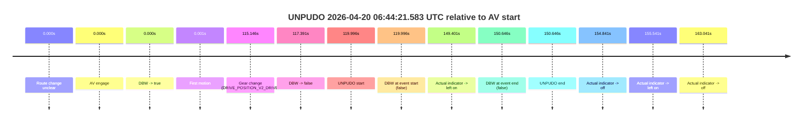
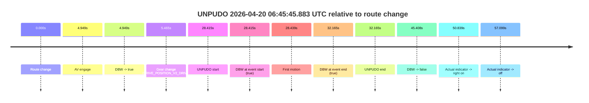
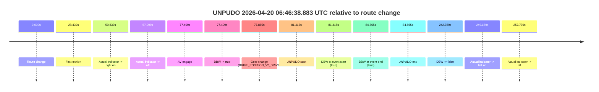
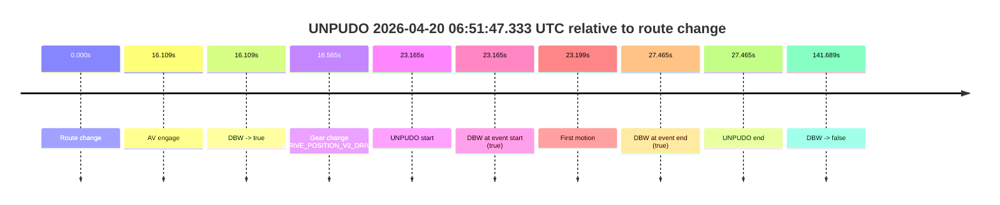
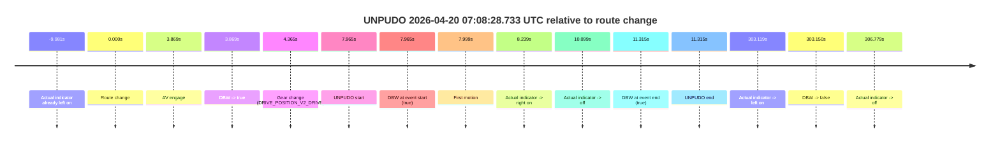
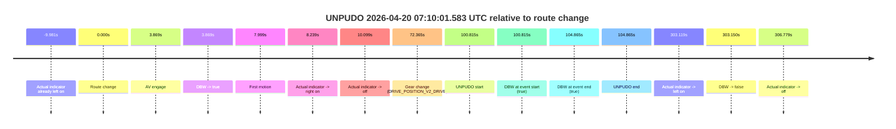
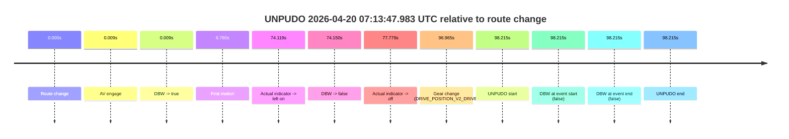

# Run Report: fme20038/2026-04-20--06-25-49--gen2-av-3409d356-9e42-46ab-956f-5e94e0ac1d68

| Field | Value |
|---|---|
| Run ID | `fme20038/2026-04-20--06-25-49--gen2-av-3409d356-9e42-46ab-956f-5e94e0ac1d68` |
| Date | `2026-04-20` |
| Model(s) | `eel-teal-outspoken` |
| Author | `zak` |
| Event count | `8` |

## unpudo 2026-04-20 06:44:21.583 UTC

| Field | Value |
|---|---|
| Model | `eel-teal-outspoken` |
| Author | `zak` |
| Run ID | `fme20038/2026-04-20--06-25-49--gen2-av-3409d356-9e42-46ab-956f-5e94e0ac1d68` |
| Date | `2026-04-20` |
| Time (UTC) | `06:44:21.583` |
| Event type | `unpudo` |
| Disengagement type | `none observed` |
| Route change | `unclear` |
| Console | [run](https://console.sso.wayve.ai/run/fme20038/2026-04-20--06-25-49--gen2-av-3409d356-9e42-46ab-956f-5e94e0ac1d68?id=&time-unixus=1776667461583297) |
| Foxglove | [segment](https://app.foxglove.dev/wayve-on-prem/p/prj_0dX18KZdVHg1fmmI/view?ds=foxglove-stream&ds.deviceName=fme20038&ds.start=2026-04-20T06%3A42%3A11.586936Z&ds.end=2026-04-20T06%3A45%3A02.233288Z&layoutId=lay_0e7VD4WIKDQGU73Y&time=2026-04-20T06%3A44%3A21.583297Z) |

### Event card: fail

- Fail: the credited unpudo does not stay AV-owned. The event window starts with DBW false, and the maneuver outcome lands outside a clean AV-owned segment.

| Event | Time (UTC) | Delta from AV start |
|---|---:|---:|
| Route change unclear | 2026-04-20 06:42:21.586 | `0.000s` |
| AV engage | 2026-04-20 06:42:21.586 | `0.000s` |
| DBW -> true | 2026-04-20 06:42:21.586 | `0.000s` |
| First motion | 2026-04-20 06:42:21.587 | `0.001s` |
| Gear change (DRIVE_POSITION_V2_DRIVE) | 2026-04-20 06:44:16.733 | `115.146s` |
| DBW -> false | 2026-04-20 06:44:18.977 | `117.391s` |
| UNPUDO start | 2026-04-20 06:44:21.583 | `119.996s` |
| DBW at event start (false) | 2026-04-20 06:44:21.583 | `119.996s` |
| Actual indicator -> left on | 2026-04-20 06:44:50.987 | `149.401s` |
| DBW at event end (false) | 2026-04-20 06:44:52.233 | `150.646s` |
| UNPUDO end | 2026-04-20 06:44:52.233 | `150.646s` |
| Actual indicator -> off | 2026-04-20 06:44:56.427 | `154.841s` |
| Actual indicator -> left on | 2026-04-20 06:44:57.127 | `155.541s` |
| Actual indicator -> off | 2026-04-20 06:45:04.627 | `163.041s` |

| Metric | Value |
|---|---|
| Outcome | `fail` |
| Effective failure type | `not_av_owned` |
| Route change status | `unclear` |
| DBW at event start | `false` |
| DBW at event end | `false` |
| Predicted gear at AV start | `DRIVE_POSITION_V2_DRIVE` |
| Actual gear at AV start | `DRIVE_POSITION_V2_DRIVE` |
| Predicted gear at event start | `DRIVE_POSITION_V2_DRIVE` |
| Actual gear at event start | `DRIVE_POSITION_V2_DRIVE` |
| Planned indicator direction | `INDICATORS_STATE_V2_OFF` |
| Controller indicator direction | `INDICATORS_STATE_V2_OFF` |
| Actual indicator direction | `INDICATORS_STATE_V2_OFF` |
| Actual indicator at maneuver end | `INDICATORS_STATE_V2_LEFT_ON` |
| Driver accel help in AV | `false` |
| Driver accel help timestamp | `n/a` |
| Max accel pedal pct in AV | `0.0%` |
| Max brake pedal pct in AV | `8.0%` |
| Max speed mps in AV | `8.267` |
| Success timing baseline | `AV start` |
| Route -> AV | `n/a` |
| AV -> event start | `119.996s` |
| AV -> first motion | `0.001s` |
| Success baseline -> event start | `119.996s` |
| Success baseline -> first motion | `0.001s` |
| AV duration before disengagement | `117.391s` |
| Trajectory waypoint count | `37` |
| Driving-plan step count | `11` |

The scored portion starts from the AV-owned window, not from the pre-AV setup. Route-change search in the stopped pre-event segment was `unclear`, with the baseline therefore set to AV start. At the event anchor the model predicts `DRIVE_POSITION_V2_DRIVE` and the actual gear is `DRIVE_POSITION_V2_DRIVE`. The effective model outcome is `fail` because `not_av_owned.`

### Resolution

| Field | Value |
|---|---|
| Final outcome | `fail` |
| Do we agree with this label? | `yes` |
| Source disengagement type | `none observed` |
| Resolved effective failure type | `not_av_owned` |
| Confidence | `medium` |

## unpudo 2026-04-20 06:45:45.883 UTC

| Field | Value |
|---|---|
| Model | `eel-teal-outspoken` |
| Author | `zak` |
| Run ID | `fme20038/2026-04-20--06-25-49--gen2-av-3409d356-9e42-46ab-956f-5e94e0ac1d68` |
| Date | `2026-04-20` |
| Time (UTC) | `06:45:45.883` |
| Event type | `unpudo` |
| Disengagement type | `none observed` |
| Route change | `found` |
| Console | [run](https://console.sso.wayve.ai/run/fme20038/2026-04-20--06-25-49--gen2-av-3409d356-9e42-46ab-956f-5e94e0ac1d68?id=&time-unixus=1776667545883319) |
| Foxglove | [segment](https://app.foxglove.dev/wayve-on-prem/p/prj_0dX18KZdVHg1fmmI/view?ds=foxglove-stream&ds.deviceName=fme20038&ds.start=2026-04-20T06%3A45%3A07.468693Z&ds.end=2026-04-20T06%3A46%3A12.876948Z&layoutId=lay_0e7VD4WIKDQGU73Y&time=2026-04-20T06%3A45%3A45.883319Z) |

### Event card: pass

- Pass: AV owns the credited unpudo from route change through the official unpudo window, the gear state is aligned at the anchor, and the vehicle moves without driver accelerator help in AV.

| Event | Time (UTC) | Delta from route change |
|---|---:|---:|
| Route change | 2026-04-20 06:45:17.468 | `0.000s` |
| AV engage | 2026-04-20 06:45:22.417 | `4.949s` |
| DBW -> true | 2026-04-20 06:45:22.417 | `4.949s` |
| Gear change (DRIVE_POSITION_V2_DRIVE) | 2026-04-20 06:45:22.933 | `5.465s` |
| UNPUDO start | 2026-04-20 06:45:45.883 | `28.415s` |
| DBW at event start (true) | 2026-04-20 06:45:45.883 | `28.415s` |
| First motion | 2026-04-20 06:45:45.907 | `28.439s` |
| DBW at event end (true) | 2026-04-20 06:45:49.633 | `32.165s` |
| UNPUDO end | 2026-04-20 06:45:49.633 | `32.165s` |
| DBW -> false | 2026-04-20 06:46:02.876 | `45.408s` |
| Actual indicator -> right on | 2026-04-20 06:46:08.307 | `50.839s` |
| Actual indicator -> off | 2026-04-20 06:46:14.567 | `57.099s` |

| Metric | Value |
|---|---|
| Outcome | `pass` |
| Effective failure type | `none` |
| Route change status | `found` |
| DBW at event start | `true` |
| DBW at event end | `true` |
| Predicted gear at AV start | `DRIVE_POSITION_V2_DRIVE` |
| Actual gear at AV start | `DRIVE_POSITION_V2_PARK` |
| Predicted gear at event start | `DRIVE_POSITION_V2_DRIVE` |
| Actual gear at event start | `DRIVE_POSITION_V2_DRIVE` |
| Planned indicator direction | `INDICATORS_STATE_V2_RIGHT_ON` |
| Controller indicator direction | `INDICATORS_STATE_V2_RIGHT_ON` |
| Actual indicator direction | `INDICATORS_STATE_V2_OFF` |
| Actual indicator at maneuver end | `INDICATORS_STATE_V2_OFF` |
| Driver accel help in AV | `false` |
| Driver accel help timestamp | `n/a` |
| Max accel pedal pct in AV | `0.0%` |
| Max brake pedal pct in AV | `8.0%` |
| Max speed mps in AV | `5.569` |
| Success timing baseline | `route change` |
| Route -> AV | `4.949s` |
| AV -> event start | `23.466s` |
| AV -> first motion | `23.490s` |
| Success baseline -> event start | `28.415s` |
| Success baseline -> first motion | `28.439s` |
| AV duration before disengagement | `40.459s` |
| Trajectory waypoint count | `36` |
| Driving-plan step count | `11` |

The scored portion starts from the AV-owned window, not from the pre-AV setup. Route-change search in the stopped pre-event segment was `found`, with the baseline therefore set to route change. At the event anchor the model predicts `DRIVE_POSITION_V2_DRIVE` and the actual gear is `DRIVE_POSITION_V2_DRIVE`. The effective model outcome is `pass` because `the credited unpudo stays AV-owned through the official unpudo window.`

### Resolution

| Field | Value |
|---|---|
| Final outcome | `pass` |
| Do we agree with this label? | `yes` |
| Source disengagement type | `none observed` |
| Resolved effective failure type | `none` |
| Confidence | `high` |

## unpudo 2026-04-20 06:46:38.883 UTC

| Field | Value |
|---|---|
| Model | `eel-teal-outspoken` |
| Author | `zak` |
| Run ID | `fme20038/2026-04-20--06-25-49--gen2-av-3409d356-9e42-46ab-956f-5e94e0ac1d68` |
| Date | `2026-04-20` |
| Time (UTC) | `06:46:38.883` |
| Event type | `unpudo` |
| Disengagement type | `none observed` |
| Route change | `found` |
| Console | [run](https://console.sso.wayve.ai/run/fme20038/2026-04-20--06-25-49--gen2-av-3409d356-9e42-46ab-956f-5e94e0ac1d68?id=&time-unixus=1776667598883316) |
| Foxglove | [segment](https://app.foxglove.dev/wayve-on-prem/p/prj_0dX18KZdVHg1fmmI/view?ds=foxglove-stream&ds.deviceName=fme20038&ds.start=2026-04-20T06%3A45%3A07.468693Z&ds.end=2026-04-20T06%3A49%3A30.257504Z&layoutId=lay_0e7VD4WIKDQGU73Y&time=2026-04-20T06%3A46%3A38.883316Z) |

### Event card: pass

- Pass: AV owns the credited unpudo from route change through the official unpudo window, the gear state is aligned at the anchor, and the vehicle moves without driver accelerator help in AV.

| Event | Time (UTC) | Delta from route change |
|---|---:|---:|
| Route change | 2026-04-20 06:45:17.468 | `0.000s` |
| First motion | 2026-04-20 06:45:45.907 | `28.439s` |
| Actual indicator -> right on | 2026-04-20 06:46:08.307 | `50.839s` |
| Actual indicator -> off | 2026-04-20 06:46:14.567 | `57.099s` |
| AV engage | 2026-04-20 06:46:34.877 | `77.409s` |
| DBW -> true | 2026-04-20 06:46:34.877 | `77.409s` |
| Gear change (DRIVE_POSITION_V2_DRIVE) | 2026-04-20 06:46:35.333 | `77.865s` |
| UNPUDO start | 2026-04-20 06:46:38.883 | `81.415s` |
| DBW at event start (true) | 2026-04-20 06:46:38.883 | `81.415s` |
| DBW at event end (true) | 2026-04-20 06:46:42.333 | `84.865s` |
| UNPUDO end | 2026-04-20 06:46:42.333 | `84.865s` |
| DBW -> false | 2026-04-20 06:49:20.257 | `242.789s` |
| Actual indicator -> left on | 2026-04-20 06:49:26.627 | `249.159s` |
| Actual indicator -> off | 2026-04-20 06:49:30.247 | `252.779s` |

| Metric | Value |
|---|---|
| Outcome | `pass` |
| Effective failure type | `none` |
| Route change status | `found` |
| DBW at event start | `true` |
| DBW at event end | `true` |
| Predicted gear at AV start | `DRIVE_POSITION_V2_DRIVE` |
| Actual gear at AV start | `DRIVE_POSITION_V2_PARK` |
| Predicted gear at event start | `DRIVE_POSITION_V2_DRIVE` |
| Actual gear at event start | `DRIVE_POSITION_V2_DRIVE` |
| Planned indicator direction | `INDICATORS_STATE_V2_LEFT_ON` |
| Controller indicator direction | `INDICATORS_STATE_V2_LEFT_ON` |
| Actual indicator direction | `INDICATORS_STATE_V2_OFF` |
| Actual indicator at maneuver end | `INDICATORS_STATE_V2_OFF` |
| Driver accel help in AV | `false` |
| Driver accel help timestamp | `n/a` |
| Max accel pedal pct in AV | `0.0%` |
| Max brake pedal pct in AV | `8.0%` |
| Max speed mps in AV | `4.303` |
| Success timing baseline | `route change` |
| Route -> AV | `77.409s` |
| AV -> event start | `4.006s` |
| AV -> first motion | `-48.970s` |
| Success baseline -> event start | `81.415s` |
| Success baseline -> first motion | `28.439s` |
| AV duration before disengagement | `165.380s` |
| Trajectory waypoint count | `36` |
| Driving-plan step count | `11` |

The scored portion starts from the AV-owned window, not from the pre-AV setup. Route-change search in the stopped pre-event segment was `found`, with the baseline therefore set to route change. At the event anchor the model predicts `DRIVE_POSITION_V2_DRIVE` and the actual gear is `DRIVE_POSITION_V2_DRIVE`. The effective model outcome is `pass` because `the credited unpudo stays AV-owned through the official unpudo window.`

### Resolution

| Field | Value |
|---|---|
| Final outcome | `pass` |
| Do we agree with this label? | `yes` |
| Source disengagement type | `none observed` |
| Resolved effective failure type | `none` |
| Confidence | `high` |

## unpudo 2026-04-20 06:51:47.333 UTC

| Field | Value |
|---|---|
| Model | `eel-teal-outspoken` |
| Author | `zak` |
| Run ID | `fme20038/2026-04-20--06-25-49--gen2-av-3409d356-9e42-46ab-956f-5e94e0ac1d68` |
| Date | `2026-04-20` |
| Time (UTC) | `06:51:47.333` |
| Event type | `unpudo` |
| Disengagement type | `none observed` |
| Route change | `found` |
| Console | [run](https://console.sso.wayve.ai/run/fme20038/2026-04-20--06-25-49--gen2-av-3409d356-9e42-46ab-956f-5e94e0ac1d68?id=&time-unixus=1776667907333291) |
| Foxglove | [segment](https://app.foxglove.dev/wayve-on-prem/p/prj_0dX18KZdVHg1fmmI/view?ds=foxglove-stream&ds.deviceName=fme20038&ds.start=2026-04-20T06%3A51%3A14.168379Z&ds.end=2026-04-20T06%3A53%3A55.857496Z&layoutId=lay_0e7VD4WIKDQGU73Y&time=2026-04-20T06%3A51%3A47.333291Z) |

### Event card: pass

- Pass: AV owns the credited unpudo from route change through the official unpudo window, the gear state is aligned at the anchor, and the vehicle moves without driver accelerator help in AV.

| Event | Time (UTC) | Delta from route change |
|---|---:|---:|
| Route change | 2026-04-20 06:51:24.168 | `0.000s` |
| AV engage | 2026-04-20 06:51:40.277 | `16.109s` |
| DBW -> true | 2026-04-20 06:51:40.277 | `16.109s` |
| Gear change (DRIVE_POSITION_V2_DRIVE) | 2026-04-20 06:51:40.733 | `16.565s` |
| UNPUDO start | 2026-04-20 06:51:47.333 | `23.165s` |
| DBW at event start (true) | 2026-04-20 06:51:47.333 | `23.165s` |
| First motion | 2026-04-20 06:51:47.367 | `23.199s` |
| DBW at event end (true) | 2026-04-20 06:51:51.633 | `27.465s` |
| UNPUDO end | 2026-04-20 06:51:51.633 | `27.465s` |
| DBW -> false | 2026-04-20 06:53:45.857 | `141.689s` |

| Metric | Value |
|---|---|
| Outcome | `pass` |
| Effective failure type | `none` |
| Route change status | `found` |
| DBW at event start | `true` |
| DBW at event end | `true` |
| Predicted gear at AV start | `DRIVE_POSITION_V2_DRIVE` |
| Actual gear at AV start | `DRIVE_POSITION_V2_PARK` |
| Predicted gear at event start | `DRIVE_POSITION_V2_DRIVE` |
| Actual gear at event start | `DRIVE_POSITION_V2_DRIVE` |
| Planned indicator direction | `INDICATORS_STATE_V2_LEFT_ON` |
| Controller indicator direction | `INDICATORS_STATE_V2_LEFT_ON` |
| Actual indicator direction | `INDICATORS_STATE_V2_OFF` |
| Actual indicator at maneuver end | `INDICATORS_STATE_V2_OFF` |
| Driver accel help in AV | `false` |
| Driver accel help timestamp | `n/a` |
| Max accel pedal pct in AV | `0.0%` |
| Max brake pedal pct in AV | `8.0%` |
| Max speed mps in AV | `4.742` |
| Success timing baseline | `route change` |
| Route -> AV | `16.109s` |
| AV -> event start | `7.056s` |
| AV -> first motion | `7.090s` |
| Success baseline -> event start | `23.165s` |
| Success baseline -> first motion | `23.199s` |
| AV duration before disengagement | `125.580s` |
| Trajectory waypoint count | `37` |
| Driving-plan step count | `11` |

The scored portion starts from the AV-owned window, not from the pre-AV setup. Route-change search in the stopped pre-event segment was `found`, with the baseline therefore set to route change. At the event anchor the model predicts `DRIVE_POSITION_V2_DRIVE` and the actual gear is `DRIVE_POSITION_V2_DRIVE`. The effective model outcome is `pass` because `the credited unpudo stays AV-owned through the official unpudo window.`

### Resolution

| Field | Value |
|---|---|
| Final outcome | `pass` |
| Do we agree with this label? | `yes` |
| Source disengagement type | `none observed` |
| Resolved effective failure type | `none` |
| Confidence | `high` |

## unpudo 2026-04-20 07:02:30.933 UTC

| Field | Value |
|---|---|
| Model | `eel-teal-outspoken` |
| Author | `zak` |
| Run ID | `fme20038/2026-04-20--06-25-49--gen2-av-3409d356-9e42-46ab-956f-5e94e0ac1d68` |
| Date | `2026-04-20` |
| Time (UTC) | `07:02:30.933` |
| Event type | `unpudo` |
| Disengagement type | `none observed` |
| Route change | `found` |
| Console | [run](https://console.sso.wayve.ai/run/fme20038/2026-04-20--06-25-49--gen2-av-3409d356-9e42-46ab-956f-5e94e0ac1d68?id=&time-unixus=1776668550933309) |
| Foxglove | [segment](https://app.foxglove.dev/wayve-on-prem/p/prj_0dX18KZdVHg1fmmI/view?ds=foxglove-stream&ds.deviceName=fme20038&ds.start=2026-04-20T07%3A02%3A07.018294Z&ds.end=2026-04-20T07%3A06%3A14.817893Z&layoutId=lay_0e7VD4WIKDQGU73Y&time=2026-04-20T07%3A02%3A30.933309Z) |

### Event card: pass

- Pass: AV owns the credited unpudo from route change through the official unpudo window, the gear state is aligned at the anchor, and the vehicle moves without driver accelerator help in AV.

| Event | Time (UTC) | Delta from route change |
|---|---:|---:|
| Route change | 2026-04-20 07:02:17.018 | `0.000s` |
| AV engage | 2026-04-20 07:02:26.837 | `9.819s` |
| DBW -> true | 2026-04-20 07:02:26.837 | `9.819s` |
| Gear change (DRIVE_POSITION_V2_DRIVE) | 2026-04-20 07:02:27.333 | `10.315s` |
| UNPUDO start | 2026-04-20 07:02:30.933 | `13.915s` |
| DBW at event start (true) | 2026-04-20 07:02:30.933 | `13.915s` |
| First motion | 2026-04-20 07:02:30.967 | `13.949s` |
| DBW at event end (true) | 2026-04-20 07:02:34.383 | `17.365s` |
| UNPUDO end | 2026-04-20 07:02:34.383 | `17.365s` |
| DBW -> false | 2026-04-20 07:06:04.817 | `227.800s` |

| Metric | Value |
|---|---|
| Outcome | `pass` |
| Effective failure type | `none` |
| Route change status | `found` |
| DBW at event start | `true` |
| DBW at event end | `true` |
| Predicted gear at AV start | `DRIVE_POSITION_V2_DRIVE` |
| Actual gear at AV start | `DRIVE_POSITION_V2_PARK` |
| Predicted gear at event start | `DRIVE_POSITION_V2_DRIVE` |
| Actual gear at event start | `DRIVE_POSITION_V2_DRIVE` |
| Planned indicator direction | `INDICATORS_STATE_V2_RIGHT_ON` |
| Controller indicator direction | `INDICATORS_STATE_V2_RIGHT_ON` |
| Actual indicator direction | `INDICATORS_STATE_V2_OFF` |
| Actual indicator at maneuver end | `INDICATORS_STATE_V2_OFF` |
| Driver accel help in AV | `false` |
| Driver accel help timestamp | `n/a` |
| Max accel pedal pct in AV | `0.0%` |
| Max brake pedal pct in AV | `8.0%` |
| Max speed mps in AV | `4.997` |
| Success timing baseline | `route change` |
| Route -> AV | `9.819s` |
| AV -> event start | `4.096s` |
| AV -> first motion | `4.130s` |
| Success baseline -> event start | `13.915s` |
| Success baseline -> first motion | `13.949s` |
| AV duration before disengagement | `217.980s` |
| Trajectory waypoint count | `37` |
| Driving-plan step count | `11` |

The scored portion starts from the AV-owned window, not from the pre-AV setup. Route-change search in the stopped pre-event segment was `found`, with the baseline therefore set to route change. At the event anchor the model predicts `DRIVE_POSITION_V2_DRIVE` and the actual gear is `DRIVE_POSITION_V2_DRIVE`. The effective model outcome is `pass` because `the credited unpudo stays AV-owned through the official unpudo window.`

### Resolution

| Field | Value |
|---|---|
| Final outcome | `pass` |
| Do we agree with this label? | `yes` |
| Source disengagement type | `none observed` |
| Resolved effective failure type | `none` |
| Confidence | `high` |

## unpudo 2026-04-20 07:08:28.733 UTC

| Field | Value |
|---|---|
| Model | `eel-teal-outspoken` |
| Author | `zak` |
| Run ID | `fme20038/2026-04-20--06-25-49--gen2-av-3409d356-9e42-46ab-956f-5e94e0ac1d68` |
| Date | `2026-04-20` |
| Time (UTC) | `07:08:28.733` |
| Event type | `unpudo` |
| Disengagement type | `none observed` |
| Route change | `found` |
| Console | [run](https://console.sso.wayve.ai/run/fme20038/2026-04-20--06-25-49--gen2-av-3409d356-9e42-46ab-956f-5e94e0ac1d68?id=&time-unixus=1776668908733302) |
| Foxglove | [segment](https://app.foxglove.dev/wayve-on-prem/p/prj_0dX18KZdVHg1fmmI/view?ds=foxglove-stream&ds.deviceName=fme20038&ds.start=2026-04-20T07%3A08%3A10.768344Z&ds.end=2026-04-20T07%3A13%3A33.918682Z&layoutId=lay_0e7VD4WIKDQGU73Y&time=2026-04-20T07%3A08%3A28.733302Z) |

### Event card: pass

- Pass: AV owns the credited unpudo from route change through the official unpudo window, the gear state is aligned at the anchor, and the vehicle moves without driver accelerator help in AV.

| Event | Time (UTC) | Delta from route change |
|---|---:|---:|
| Actual indicator already left on | 2026-04-20 07:08:10.787 | `-9.981s` |
| Route change | 2026-04-20 07:08:20.768 | `0.000s` |
| AV engage | 2026-04-20 07:08:24.637 | `3.869s` |
| DBW -> true | 2026-04-20 07:08:24.637 | `3.869s` |
| Gear change (DRIVE_POSITION_V2_DRIVE) | 2026-04-20 07:08:25.133 | `4.365s` |
| UNPUDO start | 2026-04-20 07:08:28.733 | `7.965s` |
| DBW at event start (true) | 2026-04-20 07:08:28.733 | `7.965s` |
| First motion | 2026-04-20 07:08:28.767 | `7.999s` |
| Actual indicator -> right on | 2026-04-20 07:08:29.007 | `8.239s` |
| Actual indicator -> off | 2026-04-20 07:08:30.867 | `10.099s` |
| DBW at event end (true) | 2026-04-20 07:08:32.083 | `11.315s` |
| UNPUDO end | 2026-04-20 07:08:32.083 | `11.315s` |
| Actual indicator -> left on | 2026-04-20 07:13:23.887 | `303.119s` |
| DBW -> false | 2026-04-20 07:13:23.918 | `303.150s` |
| Actual indicator -> off | 2026-04-20 07:13:27.547 | `306.779s` |

| Metric | Value |
|---|---|
| Outcome | `pass` |
| Effective failure type | `none` |
| Route change status | `found` |
| DBW at event start | `true` |
| DBW at event end | `true` |
| Predicted gear at AV start | `DRIVE_POSITION_V2_DRIVE` |
| Actual gear at AV start | `DRIVE_POSITION_V2_PARK` |
| Predicted gear at event start | `DRIVE_POSITION_V2_DRIVE` |
| Actual gear at event start | `DRIVE_POSITION_V2_DRIVE` |
| Planned indicator direction | `INDICATORS_STATE_V2_RIGHT_ON` |
| Controller indicator direction | `INDICATORS_STATE_V2_RIGHT_ON` |
| Actual indicator direction | `INDICATORS_STATE_V2_LEFT_ON` |
| Actual indicator at maneuver end | `INDICATORS_STATE_V2_OFF` |
| Driver accel help in AV | `false` |
| Driver accel help timestamp | `n/a` |
| Max accel pedal pct in AV | `0.0%` |
| Max brake pedal pct in AV | `8.0%` |
| Max speed mps in AV | `5.581` |
| Success timing baseline | `route change` |
| Route -> AV | `3.869s` |
| AV -> event start | `4.096s` |
| AV -> first motion | `4.130s` |
| Success baseline -> event start | `7.965s` |
| Success baseline -> first motion | `7.999s` |
| AV duration before disengagement | `299.281s` |
| Trajectory waypoint count | `37` |
| Driving-plan step count | `11` |

The scored portion starts from the AV-owned window, not from the pre-AV setup. Route-change search in the stopped pre-event segment was `found`, with the baseline therefore set to route change. At the event anchor the model predicts `DRIVE_POSITION_V2_DRIVE` and the actual gear is `DRIVE_POSITION_V2_DRIVE`. The effective model outcome is `pass` because `the credited unpudo stays AV-owned through the official unpudo window.`

### Resolution

| Field | Value |
|---|---|
| Final outcome | `pass` |
| Do we agree with this label? | `yes` |
| Source disengagement type | `none observed` |
| Resolved effective failure type | `none` |
| Confidence | `high` |

## unpudo 2026-04-20 07:10:01.583 UTC

| Field | Value |
|---|---|
| Model | `eel-teal-outspoken` |
| Author | `zak` |
| Run ID | `fme20038/2026-04-20--06-25-49--gen2-av-3409d356-9e42-46ab-956f-5e94e0ac1d68` |
| Date | `2026-04-20` |
| Time (UTC) | `07:10:01.583` |
| Event type | `unpudo` |
| Disengagement type | `none observed` |
| Route change | `found` |
| Console | [run](https://console.sso.wayve.ai/run/fme20038/2026-04-20--06-25-49--gen2-av-3409d356-9e42-46ab-956f-5e94e0ac1d68?id=&time-unixus=1776669001583297) |
| Foxglove | [segment](https://app.foxglove.dev/wayve-on-prem/p/prj_0dX18KZdVHg1fmmI/view?ds=foxglove-stream&ds.deviceName=fme20038&ds.start=2026-04-20T07%3A08%3A10.768344Z&ds.end=2026-04-20T07%3A13%3A33.918682Z&layoutId=lay_0e7VD4WIKDQGU73Y&time=2026-04-20T07%3A10%3A01.583297Z) |

### Event card: pass

- Pass: AV owns the credited unpudo from route change through the official unpudo window, the gear state is aligned at the anchor, and the vehicle moves without driver accelerator help in AV.

| Event | Time (UTC) | Delta from route change |
|---|---:|---:|
| Actual indicator already left on | 2026-04-20 07:08:10.787 | `-9.981s` |
| Route change | 2026-04-20 07:08:20.768 | `0.000s` |
| AV engage | 2026-04-20 07:08:24.637 | `3.869s` |
| DBW -> true | 2026-04-20 07:08:24.637 | `3.869s` |
| First motion | 2026-04-20 07:08:28.767 | `7.999s` |
| Actual indicator -> right on | 2026-04-20 07:08:29.007 | `8.239s` |
| Actual indicator -> off | 2026-04-20 07:08:30.867 | `10.099s` |
| Gear change (DRIVE_POSITION_V2_DRIVE) | 2026-04-20 07:09:33.133 | `72.365s` |
| UNPUDO start | 2026-04-20 07:10:01.583 | `100.815s` |
| DBW at event start (true) | 2026-04-20 07:10:01.583 | `100.815s` |
| DBW at event end (true) | 2026-04-20 07:10:05.633 | `104.865s` |
| UNPUDO end | 2026-04-20 07:10:05.633 | `104.865s` |
| Actual indicator -> left on | 2026-04-20 07:13:23.887 | `303.119s` |
| DBW -> false | 2026-04-20 07:13:23.918 | `303.150s` |
| Actual indicator -> off | 2026-04-20 07:13:27.547 | `306.779s` |

| Metric | Value |
|---|---|
| Outcome | `pass` |
| Effective failure type | `none` |
| Route change status | `found` |
| DBW at event start | `true` |
| DBW at event end | `true` |
| Predicted gear at AV start | `DRIVE_POSITION_V2_DRIVE` |
| Actual gear at AV start | `DRIVE_POSITION_V2_PARK` |
| Predicted gear at event start | `DRIVE_POSITION_V2_DRIVE` |
| Actual gear at event start | `DRIVE_POSITION_V2_DRIVE` |
| Planned indicator direction | `INDICATORS_STATE_V2_RIGHT_ON` |
| Controller indicator direction | `INDICATORS_STATE_V2_RIGHT_ON` |
| Actual indicator direction | `INDICATORS_STATE_V2_OFF` |
| Actual indicator at maneuver end | `INDICATORS_STATE_V2_OFF` |
| Driver accel help in AV | `false` |
| Driver accel help timestamp | `n/a` |
| Max accel pedal pct in AV | `0.0%` |
| Max brake pedal pct in AV | `21.8%` |
| Max speed mps in AV | `8.331` |
| Success timing baseline | `route change` |
| Route -> AV | `3.869s` |
| AV -> event start | `96.946s` |
| AV -> first motion | `4.130s` |
| Success baseline -> event start | `100.815s` |
| Success baseline -> first motion | `7.999s` |
| AV duration before disengagement | `299.281s` |
| Trajectory waypoint count | `36` |
| Driving-plan step count | `11` |

The scored portion starts from the AV-owned window, not from the pre-AV setup. Route-change search in the stopped pre-event segment was `found`, with the baseline therefore set to route change. At the event anchor the model predicts `DRIVE_POSITION_V2_DRIVE` and the actual gear is `DRIVE_POSITION_V2_DRIVE`. The effective model outcome is `pass` because `the credited unpudo stays AV-owned through the official unpudo window.`

### Resolution

| Field | Value |
|---|---|
| Final outcome | `pass` |
| Do we agree with this label? | `yes` |
| Source disengagement type | `none observed` |
| Resolved effective failure type | `none` |
| Confidence | `high` |

## unpudo 2026-04-20 07:13:47.983 UTC

| Field | Value |
|---|---|
| Model | `eel-teal-outspoken` |
| Author | `zak` |
| Run ID | `fme20038/2026-04-20--06-25-49--gen2-av-3409d356-9e42-46ab-956f-5e94e0ac1d68` |
| Date | `2026-04-20` |
| Time (UTC) | `07:13:47.983` |
| Event type | `unpudo` |
| Disengagement type | `none observed` |
| Route change | `found` |
| Console | [run](https://console.sso.wayve.ai/run/fme20038/2026-04-20--06-25-49--gen2-av-3409d356-9e42-46ab-956f-5e94e0ac1d68?id=&time-unixus=1776669227983301) |
| Foxglove | [segment](https://app.foxglove.dev/wayve-on-prem/p/prj_0dX18KZdVHg1fmmI/view?ds=foxglove-stream&ds.deviceName=fme20038&ds.start=2026-04-20T07%3A11%3A59.768251Z&ds.end=2026-04-20T07%3A13%3A57.983301Z&layoutId=lay_0e7VD4WIKDQGU73Y&time=2026-04-20T07%3A13%3A47.983301Z) |

### Event card: fail

- Fail: the credited unpudo does not stay AV-owned. The event window starts with DBW false, and the maneuver outcome lands outside a clean AV-owned segment.

| Event | Time (UTC) | Delta from route change |
|---|---:|---:|
| Route change | 2026-04-20 07:12:09.768 | `0.000s` |
| AV engage | 2026-04-20 07:12:09.777 | `0.009s` |
| DBW -> true | 2026-04-20 07:12:09.777 | `0.009s` |
| First motion | 2026-04-20 07:12:16.547 | `6.780s` |
| Actual indicator -> left on | 2026-04-20 07:13:23.887 | `74.119s` |
| DBW -> false | 2026-04-20 07:13:23.918 | `74.150s` |
| Actual indicator -> off | 2026-04-20 07:13:27.547 | `77.779s` |
| Gear change (DRIVE_POSITION_V2_DRIVE) | 2026-04-20 07:13:46.733 | `96.965s` |
| UNPUDO start | 2026-04-20 07:13:47.983 | `98.215s` |
| DBW at event start (false) | 2026-04-20 07:13:47.983 | `98.215s` |
| DBW at event end (false) | 2026-04-20 07:13:47.983 | `98.215s` |
| UNPUDO end | 2026-04-20 07:13:47.983 | `98.215s` |

| Metric | Value |
|---|---|
| Outcome | `fail` |
| Effective failure type | `not_av_owned` |
| Route change status | `found` |
| DBW at event start | `false` |
| DBW at event end | `false` |
| Predicted gear at AV start | `DRIVE_POSITION_V2_PARK` |
| Actual gear at AV start | `DRIVE_POSITION_V2_PARK` |
| Predicted gear at event start | `DRIVE_POSITION_V2_DRIVE` |
| Actual gear at event start | `DRIVE_POSITION_V2_DRIVE` |
| Planned indicator direction | `INDICATORS_STATE_V2_OFF` |
| Controller indicator direction | `INDICATORS_STATE_V2_OFF` |
| Actual indicator direction | `INDICATORS_STATE_V2_OFF` |
| Actual indicator at maneuver end | `INDICATORS_STATE_V2_OFF` |
| Driver accel help in AV | `false` |
| Driver accel help timestamp | `n/a` |
| Max accel pedal pct in AV | `0.0%` |
| Max brake pedal pct in AV | `8.0%` |
| Max speed mps in AV | `7.706` |
| Success timing baseline | `route change` |
| Route -> AV | `0.009s` |
| AV -> event start | `98.206s` |
| AV -> first motion | `6.770s` |
| Success baseline -> event start | `98.215s` |
| Success baseline -> first motion | `6.780s` |
| AV duration before disengagement | `74.141s` |
| Trajectory waypoint count | `36` |
| Driving-plan step count | `11` |

The scored portion starts from the AV-owned window, not from the pre-AV setup. Route-change search in the stopped pre-event segment was `found`, with the baseline therefore set to route change. At the event anchor the model predicts `DRIVE_POSITION_V2_DRIVE` and the actual gear is `DRIVE_POSITION_V2_DRIVE`. The effective model outcome is `fail` because `not_av_owned.`

### Resolution

| Field | Value |
|---|---|
| Final outcome | `fail` |
| Do we agree with this label? | `yes` |
| Source disengagement type | `none observed` |
| Resolved effective failure type | `not_av_owned` |
| Confidence | `high` |
