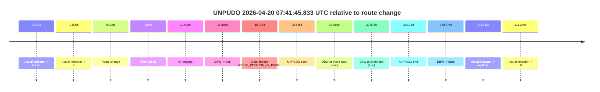
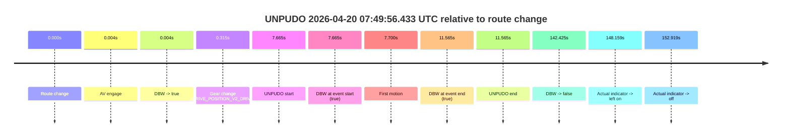
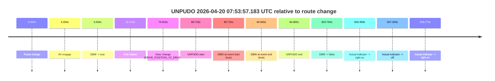
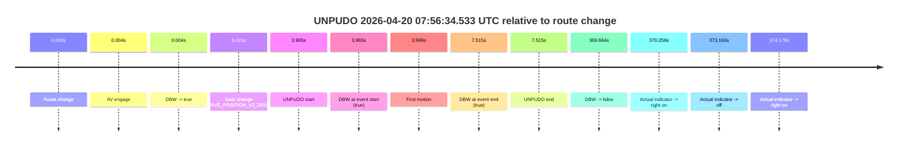
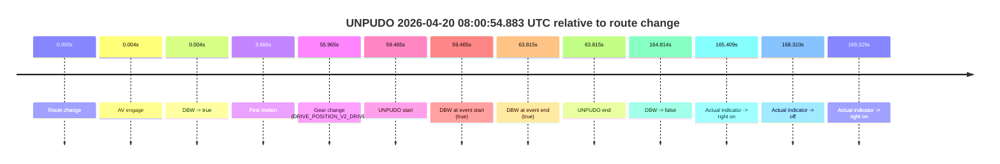
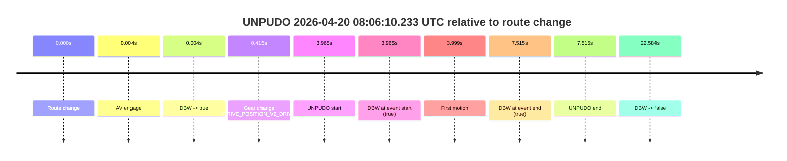
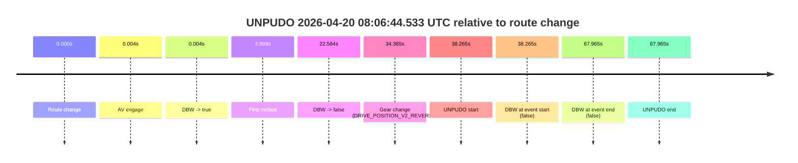
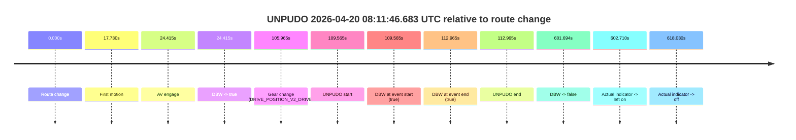
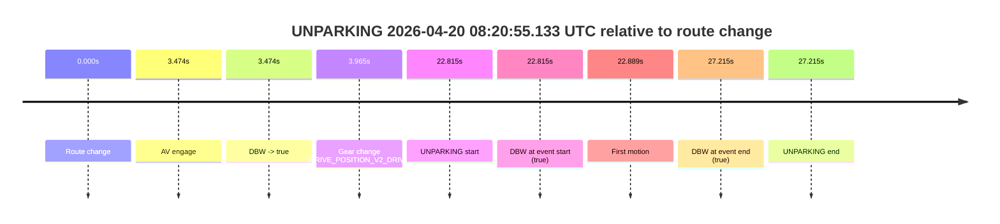

# Run Report: fme20038/2026-04-20--07-36-42--gen2-av-20a1d649-e7d2-44a8-9539-315c89d44658

| Field | Value |
|---|---|
| Run ID | `fme20038/2026-04-20--07-36-42--gen2-av-20a1d649-e7d2-44a8-9539-315c89d44658` |
| Date | `2026-04-20` |
| Model(s) | `eel-teal-outspoken` |
| Author | `zak` |
| Event count | `9` |

## unpudo 2026-04-20 07:41:45.833 UTC

| Field | Value |
|---|---|
| Model | `eel-teal-outspoken` |
| Author | `zak` |
| Run ID | `fme20038/2026-04-20--07-36-42--gen2-av-20a1d649-e7d2-44a8-9539-315c89d44658` |
| Date | `2026-04-20` |
| Time (UTC) | `07:41:45.833` |
| Event type | `unpudo` |
| Disengagement type | `none observed` |
| Route change | `found` |
| Console | [run](https://console.sso.wayve.ai/run/fme20038/2026-04-20--07-36-42--gen2-av-20a1d649-e7d2-44a8-9539-315c89d44658?id=&time-unixus=1776670905833323) |
| Foxglove | [segment](https://app.foxglove.dev/wayve-on-prem/p/prj_0dX18KZdVHg1fmmI/view?ds=foxglove-stream&ds.deviceName=fme20038&ds.start=2026-04-20T07%3A41%3A06.418259Z&ds.end=2026-04-20T07%3A48%3A17.192494Z&layoutId=lay_0e7VD4WIKDQGU73Y&time=2026-04-20T07%3A41%3A45.833323Z) |

### Event card: pass

- Pass: AV owns the credited unpudo from route change through the official unpudo window, the gear state is aligned at the anchor, and the vehicle moves without driver accelerator help in AV.

| Event | Time (UTC) | Delta from route change |
|---|---:|---:|
| Actual indicator -> left on | 2026-04-20 07:41:09.587 | `-6.831s` |
| Actual indicator -> off | 2026-04-20 07:41:15.528 | `-0.890s` |
| Route change | 2026-04-20 07:41:16.418 | `0.000s` |
| First motion | 2026-04-20 07:41:16.428 | `0.010s` |
| AV engage | 2026-04-20 07:41:35.912 | `19.494s` |
| DBW -> true | 2026-04-20 07:41:35.912 | `19.494s` |
| Gear change (DRIVE_POSITION_V2_DRIVE) | 2026-04-20 07:41:36.333 | `19.915s` |
| UNPUDO start | 2026-04-20 07:41:45.833 | `29.415s` |
| DBW at event start (true) | 2026-04-20 07:41:45.833 | `29.415s` |
| DBW at event end (true) | 2026-04-20 07:41:49.433 | `33.015s` |
| UNPUDO end | 2026-04-20 07:41:49.433 | `33.015s` |
| DBW -> false | 2026-04-20 07:48:07.192 | `410.774s` |
| Actual indicator -> right on | 2026-04-20 07:48:10.027 | `413.610s` |
| Actual indicator -> off | 2026-04-20 07:48:17.667 | `421.249s` |

| Metric | Value |
|---|---|
| Outcome | `pass` |
| Effective failure type | `none` |
| Route change status | `found` |
| DBW at event start | `true` |
| DBW at event end | `true` |
| Predicted gear at AV start | `DRIVE_POSITION_V2_DRIVE` |
| Actual gear at AV start | `DRIVE_POSITION_V2_PARK` |
| Predicted gear at event start | `DRIVE_POSITION_V2_DRIVE` |
| Actual gear at event start | `DRIVE_POSITION_V2_DRIVE` |
| Planned indicator direction | `INDICATORS_STATE_V2_RIGHT_ON` |
| Controller indicator direction | `INDICATORS_STATE_V2_RIGHT_ON` |
| Actual indicator direction | `INDICATORS_STATE_V2_OFF` |
| Actual indicator at maneuver end | `INDICATORS_STATE_V2_OFF` |
| Driver accel help in AV | `false` |
| Driver accel help timestamp | `n/a` |
| Max accel pedal pct in AV | `0.0%` |
| Max brake pedal pct in AV | `8.0%` |
| Max speed mps in AV | `4.511` |
| Success timing baseline | `route change` |
| Route -> AV | `19.494s` |
| AV -> event start | `9.921s` |
| AV -> first motion | `-19.484s` |
| Success baseline -> event start | `29.415s` |
| Success baseline -> first motion | `0.010s` |
| AV duration before disengagement | `391.280s` |
| Trajectory waypoint count | `38` |
| Driving-plan step count | `11` |

The scored portion starts from the AV-owned window, not from the pre-AV setup. Route-change search in the stopped pre-event segment was `found`, with the baseline therefore set to route change. At the event anchor the model predicts `DRIVE_POSITION_V2_DRIVE` and the actual gear is `DRIVE_POSITION_V2_DRIVE`. The effective model outcome is `pass` because `the credited unpudo stays AV-owned through the official unpudo window.`

### Resolution

| Field | Value |
|---|---|
| Final outcome | `pass` |
| Do we agree with this label? | `yes` |
| Source disengagement type | `none observed` |
| Resolved effective failure type | `none` |
| Confidence | `high` |

## unpudo 2026-04-20 07:49:56.433 UTC

| Field | Value |
|---|---|
| Model | `eel-teal-outspoken` |
| Author | `zak` |
| Run ID | `fme20038/2026-04-20--07-36-42--gen2-av-20a1d649-e7d2-44a8-9539-315c89d44658` |
| Date | `2026-04-20` |
| Time (UTC) | `07:49:56.433` |
| Event type | `unpudo` |
| Disengagement type | `none observed` |
| Route change | `found` |
| Console | [run](https://console.sso.wayve.ai/run/fme20038/2026-04-20--07-36-42--gen2-av-20a1d649-e7d2-44a8-9539-315c89d44658?id=&time-unixus=1776671396433320) |
| Foxglove | [segment](https://app.foxglove.dev/wayve-on-prem/p/prj_0dX18KZdVHg1fmmI/view?ds=foxglove-stream&ds.deviceName=fme20038&ds.start=2026-04-20T07%3A49%3A38.768255Z&ds.end=2026-04-20T07%3A52%3A21.193146Z&layoutId=lay_0e7VD4WIKDQGU73Y&time=2026-04-20T07%3A49%3A56.433320Z) |

### Event card: pass

- Pass: AV owns the credited unpudo from route change through the official unpudo window, the gear state is aligned at the anchor, and the vehicle moves without driver accelerator help in AV.

| Event | Time (UTC) | Delta from route change |
|---|---:|---:|
| Route change | 2026-04-20 07:49:48.768 | `0.000s` |
| AV engage | 2026-04-20 07:49:48.772 | `0.004s` |
| DBW -> true | 2026-04-20 07:49:48.772 | `0.004s` |
| Gear change (DRIVE_POSITION_V2_DRIVE) | 2026-04-20 07:49:49.083 | `0.315s` |
| UNPUDO start | 2026-04-20 07:49:56.433 | `7.665s` |
| DBW at event start (true) | 2026-04-20 07:49:56.433 | `7.665s` |
| First motion | 2026-04-20 07:49:56.467 | `7.700s` |
| DBW at event end (true) | 2026-04-20 07:50:00.333 | `11.565s` |
| UNPUDO end | 2026-04-20 07:50:00.333 | `11.565s` |
| DBW -> false | 2026-04-20 07:52:11.193 | `142.425s` |
| Actual indicator -> left on | 2026-04-20 07:52:16.927 | `148.159s` |
| Actual indicator -> off | 2026-04-20 07:52:21.687 | `152.919s` |

| Metric | Value |
|---|---|
| Outcome | `pass` |
| Effective failure type | `none` |
| Route change status | `found` |
| DBW at event start | `true` |
| DBW at event end | `true` |
| Predicted gear at AV start | `DRIVE_POSITION_V2_PARK` |
| Actual gear at AV start | `DRIVE_POSITION_V2_PARK` |
| Predicted gear at event start | `DRIVE_POSITION_V2_DRIVE` |
| Actual gear at event start | `DRIVE_POSITION_V2_DRIVE` |
| Planned indicator direction | `INDICATORS_STATE_V2_RIGHT_ON` |
| Controller indicator direction | `INDICATORS_STATE_V2_RIGHT_ON` |
| Actual indicator direction | `INDICATORS_STATE_V2_OFF` |
| Actual indicator at maneuver end | `INDICATORS_STATE_V2_OFF` |
| Driver accel help in AV | `false` |
| Driver accel help timestamp | `n/a` |
| Max accel pedal pct in AV | `0.0%` |
| Max brake pedal pct in AV | `8.0%` |
| Max speed mps in AV | `4.856` |
| Success timing baseline | `route change` |
| Route -> AV | `0.004s` |
| AV -> event start | `7.661s` |
| AV -> first motion | `7.696s` |
| Success baseline -> event start | `7.665s` |
| Success baseline -> first motion | `7.700s` |
| AV duration before disengagement | `142.421s` |
| Trajectory waypoint count | `38` |
| Driving-plan step count | `11` |

The scored portion starts from the AV-owned window, not from the pre-AV setup. Route-change search in the stopped pre-event segment was `found`, with the baseline therefore set to route change. At the event anchor the model predicts `DRIVE_POSITION_V2_DRIVE` and the actual gear is `DRIVE_POSITION_V2_DRIVE`. The effective model outcome is `pass` because `the credited unpudo stays AV-owned through the official unpudo window.`

### Resolution

| Field | Value |
|---|---|
| Final outcome | `pass` |
| Do we agree with this label? | `yes` |
| Source disengagement type | `none observed` |
| Resolved effective failure type | `none` |
| Confidence | `high` |

## unpudo 2026-04-20 07:53:57.183 UTC

| Field | Value |
|---|---|
| Model | `eel-teal-outspoken` |
| Author | `zak` |
| Run ID | `fme20038/2026-04-20--07-36-42--gen2-av-20a1d649-e7d2-44a8-9539-315c89d44658` |
| Date | `2026-04-20` |
| Time (UTC) | `07:53:57.183` |
| Event type | `unpudo` |
| Disengagement type | `none observed` |
| Route change | `found` |
| Console | [run](https://console.sso.wayve.ai/run/fme20038/2026-04-20--07-36-42--gen2-av-20a1d649-e7d2-44a8-9539-315c89d44658?id=&time-unixus=1776671637183289) |
| Foxglove | [segment](https://app.foxglove.dev/wayve-on-prem/p/prj_0dX18KZdVHg1fmmI/view?ds=foxglove-stream&ds.deviceName=fme20038&ds.start=2026-04-20T07%3A52%3A26.468250Z&ds.end=2026-04-20T08%3A02%3A50.232192Z&layoutId=lay_0e7VD4WIKDQGU73Y&time=2026-04-20T07%3A53%3A57.183289Z) |

### Event card: pass

- Pass: AV owns the credited unpudo from route change through the official unpudo window, the gear state is aligned at the anchor, and the vehicle moves without driver accelerator help in AV.

| Event | Time (UTC) | Delta from route change |
|---|---:|---:|
| Route change | 2026-04-20 07:52:36.468 | `0.000s` |
| AV engage | 2026-04-20 07:52:39.672 | `3.204s` |
| DBW -> true | 2026-04-20 07:52:39.672 | `3.204s` |
| First motion | 2026-04-20 07:52:52.187 | `15.719s` |
| Gear change (DRIVE_POSITION_V2_DRIVE) | 2026-04-20 07:53:51.383 | `74.915s` |
| UNPUDO start | 2026-04-20 07:53:57.183 | `80.715s` |
| DBW at event start (true) | 2026-04-20 07:53:57.183 | `80.715s` |
| DBW at event end (true) | 2026-04-20 07:54:01.133 | `84.665s` |
| UNPUDO end | 2026-04-20 07:54:01.133 | `84.665s` |
| DBW -> false | 2026-04-20 08:02:40.232 | `603.764s` |
| Actual indicator -> right on | 2026-04-20 08:02:40.827 | `604.359s` |
| Actual indicator -> off | 2026-04-20 08:02:43.728 | `607.260s` |
| Actual indicator -> right on | 2026-04-20 08:02:44.747 | `608.279s` |

| Metric | Value |
|---|---|
| Outcome | `pass` |
| Effective failure type | `none` |
| Route change status | `found` |
| DBW at event start | `true` |
| DBW at event end | `true` |
| Predicted gear at AV start | `DRIVE_POSITION_V2_DRIVE` |
| Actual gear at AV start | `DRIVE_POSITION_V2_PARK` |
| Predicted gear at event start | `DRIVE_POSITION_V2_DRIVE` |
| Actual gear at event start | `DRIVE_POSITION_V2_DRIVE` |
| Planned indicator direction | `INDICATORS_STATE_V2_RIGHT_ON` |
| Controller indicator direction | `INDICATORS_STATE_V2_RIGHT_ON` |
| Actual indicator direction | `INDICATORS_STATE_V2_OFF` |
| Actual indicator at maneuver end | `INDICATORS_STATE_V2_OFF` |
| Driver accel help in AV | `false` |
| Driver accel help timestamp | `n/a` |
| Max accel pedal pct in AV | `0.0%` |
| Max brake pedal pct in AV | `16.1%` |
| Max speed mps in AV | `8.228` |
| Success timing baseline | `route change` |
| Route -> AV | `3.204s` |
| AV -> event start | `77.511s` |
| AV -> first motion | `12.515s` |
| Success baseline -> event start | `80.715s` |
| Success baseline -> first motion | `15.719s` |
| AV duration before disengagement | `600.560s` |
| Trajectory waypoint count | `37` |
| Driving-plan step count | `11` |

The scored portion starts from the AV-owned window, not from the pre-AV setup. Route-change search in the stopped pre-event segment was `found`, with the baseline therefore set to route change. At the event anchor the model predicts `DRIVE_POSITION_V2_DRIVE` and the actual gear is `DRIVE_POSITION_V2_DRIVE`. The effective model outcome is `pass` because `the credited unpudo stays AV-owned through the official unpudo window.`

### Resolution

| Field | Value |
|---|---|
| Final outcome | `pass` |
| Do we agree with this label? | `yes` |
| Source disengagement type | `none observed` |
| Resolved effective failure type | `none` |
| Confidence | `high` |

## unpudo 2026-04-20 07:56:34.533 UTC

| Field | Value |
|---|---|
| Model | `eel-teal-outspoken` |
| Author | `zak` |
| Run ID | `fme20038/2026-04-20--07-36-42--gen2-av-20a1d649-e7d2-44a8-9539-315c89d44658` |
| Date | `2026-04-20` |
| Time (UTC) | `07:56:34.533` |
| Event type | `unpudo` |
| Disengagement type | `none observed` |
| Route change | `found` |
| Console | [run](https://console.sso.wayve.ai/run/fme20038/2026-04-20--07-36-42--gen2-av-20a1d649-e7d2-44a8-9539-315c89d44658?id=&time-unixus=1776671794533293) |
| Foxglove | [segment](https://app.foxglove.dev/wayve-on-prem/p/prj_0dX18KZdVHg1fmmI/view?ds=foxglove-stream&ds.deviceName=fme20038&ds.start=2026-04-20T07%3A56%3A20.568263Z&ds.end=2026-04-20T08%3A02%3A50.232192Z&layoutId=lay_0e7VD4WIKDQGU73Y&time=2026-04-20T07%3A56%3A34.533293Z) |

### Event card: pass

- Pass: AV owns the credited unpudo from route change through the official unpudo window, the gear state is aligned at the anchor, and the vehicle moves without driver accelerator help in AV.

| Event | Time (UTC) | Delta from route change |
|---|---:|---:|
| Route change | 2026-04-20 07:56:30.568 | `0.000s` |
| AV engage | 2026-04-20 07:56:30.572 | `0.004s` |
| DBW -> true | 2026-04-20 07:56:30.572 | `0.004s` |
| Gear change (DRIVE_POSITION_V2_DRIVE) | 2026-04-20 07:56:30.983 | `0.415s` |
| UNPUDO start | 2026-04-20 07:56:34.533 | `3.965s` |
| DBW at event start (true) | 2026-04-20 07:56:34.533 | `3.965s` |
| First motion | 2026-04-20 07:56:34.567 | `3.999s` |
| DBW at event end (true) | 2026-04-20 07:56:38.083 | `7.515s` |
| UNPUDO end | 2026-04-20 07:56:38.083 | `7.515s` |
| DBW -> false | 2026-04-20 08:02:40.232 | `369.664s` |
| Actual indicator -> right on | 2026-04-20 08:02:40.827 | `370.259s` |
| Actual indicator -> off | 2026-04-20 08:02:43.728 | `373.160s` |
| Actual indicator -> right on | 2026-04-20 08:02:44.747 | `374.179s` |

| Metric | Value |
|---|---|
| Outcome | `pass` |
| Effective failure type | `none` |
| Route change status | `found` |
| DBW at event start | `true` |
| DBW at event end | `true` |
| Predicted gear at AV start | `DRIVE_POSITION_V2_PARK` |
| Actual gear at AV start | `DRIVE_POSITION_V2_PARK` |
| Predicted gear at event start | `DRIVE_POSITION_V2_DRIVE` |
| Actual gear at event start | `DRIVE_POSITION_V2_DRIVE` |
| Planned indicator direction | `INDICATORS_STATE_V2_RIGHT_ON` |
| Controller indicator direction | `INDICATORS_STATE_V2_RIGHT_ON` |
| Actual indicator direction | `INDICATORS_STATE_V2_OFF` |
| Actual indicator at maneuver end | `INDICATORS_STATE_V2_OFF` |
| Driver accel help in AV | `false` |
| Driver accel help timestamp | `n/a` |
| Max accel pedal pct in AV | `0.0%` |
| Max brake pedal pct in AV | `8.0%` |
| Max speed mps in AV | `4.814` |
| Success timing baseline | `route change` |
| Route -> AV | `0.004s` |
| AV -> event start | `3.961s` |
| AV -> first motion | `3.995s` |
| Success baseline -> event start | `3.965s` |
| Success baseline -> first motion | `3.999s` |
| AV duration before disengagement | `369.660s` |
| Trajectory waypoint count | `38` |
| Driving-plan step count | `11` |

The scored portion starts from the AV-owned window, not from the pre-AV setup. Route-change search in the stopped pre-event segment was `found`, with the baseline therefore set to route change. At the event anchor the model predicts `DRIVE_POSITION_V2_DRIVE` and the actual gear is `DRIVE_POSITION_V2_DRIVE`. The effective model outcome is `pass` because `the credited unpudo stays AV-owned through the official unpudo window.`

### Resolution

| Field | Value |
|---|---|
| Final outcome | `pass` |
| Do we agree with this label? | `yes` |
| Source disengagement type | `none observed` |
| Resolved effective failure type | `none` |
| Confidence | `high` |

## unpudo 2026-04-20 08:00:54.883 UTC

| Field | Value |
|---|---|
| Model | `eel-teal-outspoken` |
| Author | `zak` |
| Run ID | `fme20038/2026-04-20--07-36-42--gen2-av-20a1d649-e7d2-44a8-9539-315c89d44658` |
| Date | `2026-04-20` |
| Time (UTC) | `08:00:54.883` |
| Event type | `unpudo` |
| Disengagement type | `none observed` |
| Route change | `found` |
| Console | [run](https://console.sso.wayve.ai/run/fme20038/2026-04-20--07-36-42--gen2-av-20a1d649-e7d2-44a8-9539-315c89d44658?id=&time-unixus=1776672054883296) |
| Foxglove | [segment](https://app.foxglove.dev/wayve-on-prem/p/prj_0dX18KZdVHg1fmmI/view?ds=foxglove-stream&ds.deviceName=fme20038&ds.start=2026-04-20T07%3A59%3A45.418280Z&ds.end=2026-04-20T08%3A02%3A50.232192Z&layoutId=lay_0e7VD4WIKDQGU73Y&time=2026-04-20T08%3A00%3A54.883296Z) |

### Event card: pass

- Pass: AV owns the credited unpudo from route change through the official unpudo window, the gear state is aligned at the anchor, and the vehicle moves without driver accelerator help in AV.

| Event | Time (UTC) | Delta from route change |
|---|---:|---:|
| Route change | 2026-04-20 07:59:55.418 | `0.000s` |
| AV engage | 2026-04-20 07:59:55.422 | `0.004s` |
| DBW -> true | 2026-04-20 07:59:55.422 | `0.004s` |
| First motion | 2026-04-20 07:59:59.307 | `3.889s` |
| Gear change (DRIVE_POSITION_V2_DRIVE) | 2026-04-20 08:00:51.383 | `55.965s` |
| UNPUDO start | 2026-04-20 08:00:54.883 | `59.465s` |
| DBW at event start (true) | 2026-04-20 08:00:54.883 | `59.465s` |
| DBW at event end (true) | 2026-04-20 08:00:59.233 | `63.815s` |
| UNPUDO end | 2026-04-20 08:00:59.233 | `63.815s` |
| DBW -> false | 2026-04-20 08:02:40.232 | `164.814s` |
| Actual indicator -> right on | 2026-04-20 08:02:40.827 | `165.409s` |
| Actual indicator -> off | 2026-04-20 08:02:43.728 | `168.310s` |
| Actual indicator -> right on | 2026-04-20 08:02:44.747 | `169.329s` |

| Metric | Value |
|---|---|
| Outcome | `pass` |
| Effective failure type | `none` |
| Route change status | `found` |
| DBW at event start | `true` |
| DBW at event end | `true` |
| Predicted gear at AV start | `DRIVE_POSITION_V2_PARK` |
| Actual gear at AV start | `DRIVE_POSITION_V2_PARK` |
| Predicted gear at event start | `DRIVE_POSITION_V2_DRIVE` |
| Actual gear at event start | `DRIVE_POSITION_V2_DRIVE` |
| Planned indicator direction | `INDICATORS_STATE_V2_OFF` |
| Controller indicator direction | `INDICATORS_STATE_V2_OFF` |
| Actual indicator direction | `INDICATORS_STATE_V2_OFF` |
| Actual indicator at maneuver end | `INDICATORS_STATE_V2_OFF` |
| Driver accel help in AV | `false` |
| Driver accel help timestamp | `n/a` |
| Max accel pedal pct in AV | `0.0%` |
| Max brake pedal pct in AV | `8.0%` |
| Max speed mps in AV | `7.353` |
| Success timing baseline | `route change` |
| Route -> AV | `0.004s` |
| AV -> event start | `59.461s` |
| AV -> first motion | `3.885s` |
| Success baseline -> event start | `59.465s` |
| Success baseline -> first motion | `3.889s` |
| AV duration before disengagement | `164.810s` |
| Trajectory waypoint count | `37` |
| Driving-plan step count | `11` |

The scored portion starts from the AV-owned window, not from the pre-AV setup. Route-change search in the stopped pre-event segment was `found`, with the baseline therefore set to route change. At the event anchor the model predicts `DRIVE_POSITION_V2_DRIVE` and the actual gear is `DRIVE_POSITION_V2_DRIVE`. The effective model outcome is `pass` because `the credited unpudo stays AV-owned through the official unpudo window.`

### Resolution

| Field | Value |
|---|---|
| Final outcome | `pass` |
| Do we agree with this label? | `yes` |
| Source disengagement type | `none observed` |
| Resolved effective failure type | `none` |
| Confidence | `high` |

## unpudo 2026-04-20 08:06:10.233 UTC

| Field | Value |
|---|---|
| Model | `eel-teal-outspoken` |
| Author | `zak` |
| Run ID | `fme20038/2026-04-20--07-36-42--gen2-av-20a1d649-e7d2-44a8-9539-315c89d44658` |
| Date | `2026-04-20` |
| Time (UTC) | `08:06:10.233` |
| Event type | `unpudo` |
| Disengagement type | `none observed` |
| Route change | `found` |
| Console | [run](https://console.sso.wayve.ai/run/fme20038/2026-04-20--07-36-42--gen2-av-20a1d649-e7d2-44a8-9539-315c89d44658?id=&time-unixus=1776672370233297) |
| Foxglove | [segment](https://app.foxglove.dev/wayve-on-prem/p/prj_0dX18KZdVHg1fmmI/view?ds=foxglove-stream&ds.deviceName=fme20038&ds.start=2026-04-20T08%3A05%3A56.268280Z&ds.end=2026-04-20T08%3A06%3A38.851977Z&layoutId=lay_0e7VD4WIKDQGU73Y&time=2026-04-20T08%3A06%3A10.233297Z) |

### Event card: pass

- Pass: AV owns the credited unpudo from route change through the official unpudo window, the gear state is aligned at the anchor, and the vehicle moves without driver accelerator help in AV.

| Event | Time (UTC) | Delta from route change |
|---|---:|---:|
| Route change | 2026-04-20 08:06:06.268 | `0.000s` |
| AV engage | 2026-04-20 08:06:06.272 | `0.004s` |
| DBW -> true | 2026-04-20 08:06:06.272 | `0.004s` |
| Gear change (DRIVE_POSITION_V2_DRIVE) | 2026-04-20 08:06:06.683 | `0.415s` |
| UNPUDO start | 2026-04-20 08:06:10.233 | `3.965s` |
| DBW at event start (true) | 2026-04-20 08:06:10.233 | `3.965s` |
| First motion | 2026-04-20 08:06:10.267 | `3.999s` |
| DBW at event end (true) | 2026-04-20 08:06:13.783 | `7.515s` |
| UNPUDO end | 2026-04-20 08:06:13.783 | `7.515s` |
| DBW -> false | 2026-04-20 08:06:28.851 | `22.584s` |

| Metric | Value |
|---|---|
| Outcome | `pass` |
| Effective failure type | `none` |
| Route change status | `found` |
| DBW at event start | `true` |
| DBW at event end | `true` |
| Predicted gear at AV start | `DRIVE_POSITION_V2_PARK` |
| Actual gear at AV start | `DRIVE_POSITION_V2_PARK` |
| Predicted gear at event start | `DRIVE_POSITION_V2_DRIVE` |
| Actual gear at event start | `DRIVE_POSITION_V2_DRIVE` |
| Planned indicator direction | `INDICATORS_STATE_V2_RIGHT_ON` |
| Controller indicator direction | `INDICATORS_STATE_V2_RIGHT_ON` |
| Actual indicator direction | `INDICATORS_STATE_V2_OFF` |
| Actual indicator at maneuver end | `INDICATORS_STATE_V2_OFF` |
| Driver accel help in AV | `false` |
| Driver accel help timestamp | `n/a` |
| Max accel pedal pct in AV | `0.0%` |
| Max brake pedal pct in AV | `8.0%` |
| Max speed mps in AV | `4.492` |
| Success timing baseline | `route change` |
| Route -> AV | `0.004s` |
| AV -> event start | `3.961s` |
| AV -> first motion | `3.995s` |
| Success baseline -> event start | `3.965s` |
| Success baseline -> first motion | `3.999s` |
| AV duration before disengagement | `22.580s` |
| Trajectory waypoint count | `38` |
| Driving-plan step count | `11` |

The scored portion starts from the AV-owned window, not from the pre-AV setup. Route-change search in the stopped pre-event segment was `found`, with the baseline therefore set to route change. At the event anchor the model predicts `DRIVE_POSITION_V2_DRIVE` and the actual gear is `DRIVE_POSITION_V2_DRIVE`. The effective model outcome is `pass` because `the credited unpudo stays AV-owned through the official unpudo window.`

### Resolution

| Field | Value |
|---|---|
| Final outcome | `pass` |
| Do we agree with this label? | `yes` |
| Source disengagement type | `none observed` |
| Resolved effective failure type | `none` |
| Confidence | `high` |

## unpudo 2026-04-20 08:06:44.533 UTC

| Field | Value |
|---|---|
| Model | `eel-teal-outspoken` |
| Author | `zak` |
| Run ID | `fme20038/2026-04-20--07-36-42--gen2-av-20a1d649-e7d2-44a8-9539-315c89d44658` |
| Date | `2026-04-20` |
| Time (UTC) | `08:06:44.533` |
| Event type | `unpudo` |
| Disengagement type | `none observed` |
| Route change | `found` |
| Console | [run](https://console.sso.wayve.ai/run/fme20038/2026-04-20--07-36-42--gen2-av-20a1d649-e7d2-44a8-9539-315c89d44658?id=&time-unixus=1776672404533316) |
| Foxglove | [segment](https://app.foxglove.dev/wayve-on-prem/p/prj_0dX18KZdVHg1fmmI/view?ds=foxglove-stream&ds.deviceName=fme20038&ds.start=2026-04-20T08%3A05%3A56.268280Z&ds.end=2026-04-20T08%3A07%3A24.233309Z&layoutId=lay_0e7VD4WIKDQGU73Y&time=2026-04-20T08%3A06%3A44.533316Z) |

### Event card: fail

- Fail: the credited unpudo does not stay AV-owned. The event window starts with DBW false, and the maneuver outcome lands outside a clean AV-owned segment.

| Event | Time (UTC) | Delta from route change |
|---|---:|---:|
| Route change | 2026-04-20 08:06:06.268 | `0.000s` |
| AV engage | 2026-04-20 08:06:06.272 | `0.004s` |
| DBW -> true | 2026-04-20 08:06:06.272 | `0.004s` |
| First motion | 2026-04-20 08:06:10.267 | `3.999s` |
| DBW -> false | 2026-04-20 08:06:28.851 | `22.584s` |
| Gear change (DRIVE_POSITION_V2_REVERSE) | 2026-04-20 08:06:40.633 | `34.365s` |
| UNPUDO start | 2026-04-20 08:06:44.533 | `38.265s` |
| DBW at event start (false) | 2026-04-20 08:06:44.533 | `38.265s` |
| DBW at event end (false) | 2026-04-20 08:07:14.233 | `67.965s` |
| UNPUDO end | 2026-04-20 08:07:14.233 | `67.965s` |

| Metric | Value |
|---|---|
| Outcome | `fail` |
| Effective failure type | `not_av_owned` |
| Route change status | `found` |
| DBW at event start | `false` |
| DBW at event end | `false` |
| Predicted gear at AV start | `DRIVE_POSITION_V2_PARK` |
| Actual gear at AV start | `DRIVE_POSITION_V2_PARK` |
| Predicted gear at event start | `DRIVE_POSITION_V2_REVERSE` |
| Actual gear at event start | `DRIVE_POSITION_V2_REVERSE` |
| Planned indicator direction | `INDICATORS_STATE_V2_OFF` |
| Controller indicator direction | `INDICATORS_STATE_V2_OFF` |
| Actual indicator direction | `INDICATORS_STATE_V2_OFF` |
| Actual indicator at maneuver end | `INDICATORS_STATE_V2_OFF` |
| Driver accel help in AV | `false` |
| Driver accel help timestamp | `n/a` |
| Max accel pedal pct in AV | `0.0%` |
| Max brake pedal pct in AV | `8.0%` |
| Max speed mps in AV | `6.828` |
| Success timing baseline | `route change` |
| Route -> AV | `0.004s` |
| AV -> event start | `38.261s` |
| AV -> first motion | `3.995s` |
| Success baseline -> event start | `38.265s` |
| Success baseline -> first motion | `3.999s` |
| AV duration before disengagement | `22.580s` |
| Trajectory waypoint count | `38` |
| Driving-plan step count | `11` |

The scored portion starts from the AV-owned window, not from the pre-AV setup. Route-change search in the stopped pre-event segment was `found`, with the baseline therefore set to route change. At the event anchor the model predicts `DRIVE_POSITION_V2_REVERSE` and the actual gear is `DRIVE_POSITION_V2_REVERSE`. The effective model outcome is `fail` because `not_av_owned.`

### Resolution

| Field | Value |
|---|---|
| Final outcome | `fail` |
| Do we agree with this label? | `yes` |
| Source disengagement type | `none observed` |
| Resolved effective failure type | `not_av_owned` |
| Confidence | `high` |

## unpudo 2026-04-20 08:11:46.683 UTC

| Field | Value |
|---|---|
| Model | `eel-teal-outspoken` |
| Author | `zak` |
| Run ID | `fme20038/2026-04-20--07-36-42--gen2-av-20a1d649-e7d2-44a8-9539-315c89d44658` |
| Date | `2026-04-20` |
| Time (UTC) | `08:11:46.683` |
| Event type | `unpudo` |
| Disengagement type | `none observed` |
| Route change | `found` |
| Console | [run](https://console.sso.wayve.ai/run/fme20038/2026-04-20--07-36-42--gen2-av-20a1d649-e7d2-44a8-9539-315c89d44658?id=&time-unixus=1776672706683299) |
| Foxglove | [segment](https://app.foxglove.dev/wayve-on-prem/p/prj_0dX18KZdVHg1fmmI/view?ds=foxglove-stream&ds.deviceName=fme20038&ds.start=2026-04-20T08%3A09%3A47.118240Z&ds.end=2026-04-20T08%3A20%3A08.812708Z&layoutId=lay_0e7VD4WIKDQGU73Y&time=2026-04-20T08%3A11%3A46.683299Z) |

### Event card: pass

- Pass: AV owns the credited unpudo from route change through the official unpudo window, the gear state is aligned at the anchor, and the vehicle moves without driver accelerator help in AV.

| Event | Time (UTC) | Delta from route change |
|---|---:|---:|
| Route change | 2026-04-20 08:09:57.118 | `0.000s` |
| First motion | 2026-04-20 08:10:14.848 | `17.730s` |
| AV engage | 2026-04-20 08:10:21.533 | `24.415s` |
| DBW -> true | 2026-04-20 08:10:21.533 | `24.415s` |
| Gear change (DRIVE_POSITION_V2_DRIVE) | 2026-04-20 08:11:43.083 | `105.965s` |
| UNPUDO start | 2026-04-20 08:11:46.683 | `109.565s` |
| DBW at event start (true) | 2026-04-20 08:11:46.683 | `109.565s` |
| DBW at event end (true) | 2026-04-20 08:11:50.083 | `112.965s` |
| UNPUDO end | 2026-04-20 08:11:50.083 | `112.965s` |
| DBW -> false | 2026-04-20 08:19:58.812 | `601.694s` |
| Actual indicator -> left on | 2026-04-20 08:19:59.828 | `602.710s` |
| Actual indicator -> off | 2026-04-20 08:20:15.148 | `618.030s` |

| Metric | Value |
|---|---|
| Outcome | `pass` |
| Effective failure type | `none` |
| Route change status | `found` |
| DBW at event start | `true` |
| DBW at event end | `true` |
| Predicted gear at AV start | `DRIVE_POSITION_V2_DRIVE` |
| Actual gear at AV start | `DRIVE_POSITION_V2_DRIVE` |
| Predicted gear at event start | `DRIVE_POSITION_V2_DRIVE` |
| Actual gear at event start | `DRIVE_POSITION_V2_DRIVE` |
| Planned indicator direction | `INDICATORS_STATE_V2_LEFT_ON` |
| Controller indicator direction | `INDICATORS_STATE_V2_LEFT_ON` |
| Actual indicator direction | `INDICATORS_STATE_V2_OFF` |
| Actual indicator at maneuver end | `INDICATORS_STATE_V2_OFF` |
| Driver accel help in AV | `false` |
| Driver accel help timestamp | `n/a` |
| Max accel pedal pct in AV | `0.0%` |
| Max brake pedal pct in AV | `9.9%` |
| Max speed mps in AV | `7.686` |
| Success timing baseline | `route change` |
| Route -> AV | `24.415s` |
| AV -> event start | `85.150s` |
| AV -> first motion | `-6.685s` |
| Success baseline -> event start | `109.565s` |
| Success baseline -> first motion | `17.730s` |
| AV duration before disengagement | `577.280s` |
| Trajectory waypoint count | `37` |
| Driving-plan step count | `11` |

The scored portion starts from the AV-owned window, not from the pre-AV setup. Route-change search in the stopped pre-event segment was `found`, with the baseline therefore set to route change. At the event anchor the model predicts `DRIVE_POSITION_V2_DRIVE` and the actual gear is `DRIVE_POSITION_V2_DRIVE`. The effective model outcome is `pass` because `the credited unpudo stays AV-owned through the official unpudo window.`

### Resolution

| Field | Value |
|---|---|
| Final outcome | `pass` |
| Do we agree with this label? | `yes` |
| Source disengagement type | `none observed` |
| Resolved effective failure type | `none` |
| Confidence | `high` |

## unparking 2026-04-20 08:20:55.133 UTC

| Field | Value |
|---|---|
| Model | `eel-teal-outspoken` |
| Author | `zak` |
| Run ID | `fme20038/2026-04-20--07-36-42--gen2-av-20a1d649-e7d2-44a8-9539-315c89d44658` |
| Date | `2026-04-20` |
| Time (UTC) | `08:20:55.133` |
| Event type | `unparking` |
| Disengagement type | `none observed` |
| Route change | `found` |
| Console | [run](https://console.sso.wayve.ai/run/fme20038/2026-04-20--07-36-42--gen2-av-20a1d649-e7d2-44a8-9539-315c89d44658?id=&time-unixus=1776673255133292) |
| Foxglove | [segment](https://app.foxglove.dev/wayve-on-prem/p/prj_0dX18KZdVHg1fmmI/view?ds=foxglove-stream&ds.deviceName=fme20038&ds.start=2026-04-20T08%3A20%3A22.318283Z&ds.end=2026-04-20T08%3A21%3A09.533293Z&layoutId=lay_0e7VD4WIKDQGU73Y&time=2026-04-20T08%3A20%3A55.133292Z) |

### Event card: pass

- Pass: AV owns the credited unparking through the official event window, the gear state is aligned at the anchor, and the vehicle moves without driver accelerator help in AV.

| Event | Time (UTC) | Delta from route change |
|---|---:|---:|
| Route change | 2026-04-20 08:20:32.318 | `0.000s` |
| AV engage | 2026-04-20 08:20:35.792 | `3.474s` |
| DBW -> true | 2026-04-20 08:20:35.792 | `3.474s` |
| Gear change (DRIVE_POSITION_V2_DRIVE) | 2026-04-20 08:20:36.283 | `3.965s` |
| UNPARKING start | 2026-04-20 08:20:55.133 | `22.815s` |
| DBW at event start (true) | 2026-04-20 08:20:55.133 | `22.815s` |
| First motion | 2026-04-20 08:20:55.207 | `22.889s` |
| DBW at event end (true) | 2026-04-20 08:20:59.533 | `27.215s` |
| UNPARKING end | 2026-04-20 08:20:59.533 | `27.215s` |

| Metric | Value |
|---|---|
| Outcome | `pass` |
| Effective failure type | `none` |
| Route change status | `found` |
| DBW at event start | `true` |
| DBW at event end | `true` |
| Predicted gear at AV start | `DRIVE_POSITION_V2_DRIVE` |
| Actual gear at AV start | `DRIVE_POSITION_V2_PARK` |
| Predicted gear at event start | `DRIVE_POSITION_V2_DRIVE` |
| Actual gear at event start | `DRIVE_POSITION_V2_DRIVE` |
| Planned indicator direction | `INDICATORS_STATE_V2_RIGHT_ON` |
| Controller indicator direction | `INDICATORS_STATE_V2_RIGHT_ON` |
| Actual indicator direction | `INDICATORS_STATE_V2_OFF` |
| Actual indicator at maneuver end | `INDICATORS_STATE_V2_OFF` |
| Driver accel help in AV | `false` |
| Driver accel help timestamp | `n/a` |
| Max accel pedal pct in AV | `0.0%` |
| Max brake pedal pct in AV | `0.0%` |
| Max speed mps in AV | `3.319` |
| Success timing baseline | `route change` |
| Route -> AV | `3.474s` |
| AV -> event start | `19.341s` |
| AV -> first motion | `19.415s` |
| Success baseline -> event start | `22.815s` |
| Success baseline -> first motion | `22.889s` |
| AV duration before disengagement | `n/a` |
| Trajectory waypoint count | `38` |
| Driving-plan step count | `11` |

The scored portion starts from the AV-owned window, not from the pre-AV setup. Route-change search in the stopped pre-event segment was `found`, with the baseline therefore set to route change. At the event anchor the model predicts `DRIVE_POSITION_V2_DRIVE` and the actual gear is `DRIVE_POSITION_V2_DRIVE`. The effective model outcome is `pass` because `the credited maneuver stays AV-owned through the official event end.`

### Resolution

| Field | Value |
|---|---|
| Final outcome | `pass` |
| Do we agree with this label? | `yes` |
| Source disengagement type | `none observed` |
| Resolved effective failure type | `none` |
| Confidence | `high` |
