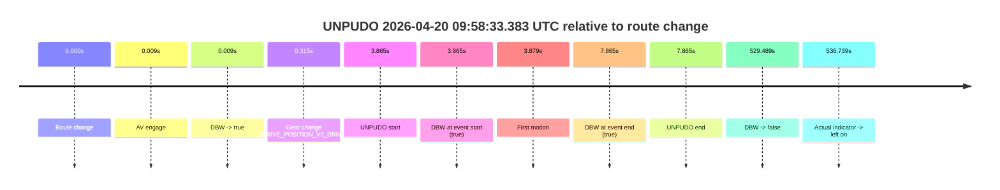
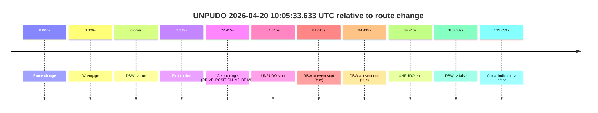
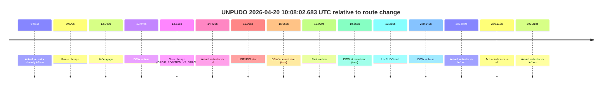
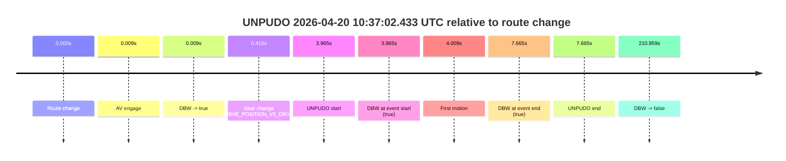
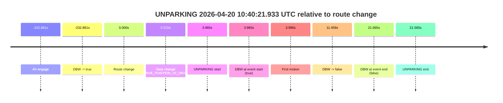

# Run Report: fme20038/2026-04-20--09-42-12--gen2-av-d2486dc4-9a6a-4a40-b407-dca9017037fe

| Field | Value |
|---|---|
| Run ID | `fme20038/2026-04-20--09-42-12--gen2-av-d2486dc4-9a6a-4a40-b407-dca9017037fe` |
| Date | `2026-04-20` |
| Model(s) | `eel-teal-outspoken` |
| Author | `zak` |
| Event count | `6` |

## unpudo 2026-04-20 09:58:33.383 UTC

| Field | Value |
|---|---|
| Model | `eel-teal-outspoken` |
| Author | `zak` |
| Run ID | `fme20038/2026-04-20--09-42-12--gen2-av-d2486dc4-9a6a-4a40-b407-dca9017037fe` |
| Date | `2026-04-20` |
| Time (UTC) | `09:58:33.383` |
| Event type | `unpudo` |
| Disengagement type | `none observed` |
| Route change | `found` |
| Console | [run](https://console.sso.wayve.ai/run/fme20038/2026-04-20--09-42-12--gen2-av-d2486dc4-9a6a-4a40-b407-dca9017037fe?id=&time-unixus=1776679113383304) |
| Foxglove | [segment](https://app.foxglove.dev/wayve-on-prem/p/prj_0dX18KZdVHg1fmmI/view?ds=foxglove-stream&ds.deviceName=fme20038&ds.start=2026-04-20T09%3A58%3A19.518274Z&ds.end=2026-04-20T10%3A07%3A29.007134Z&layoutId=lay_0e7VD4WIKDQGU73Y&time=2026-04-20T09%3A58%3A33.383304Z) |

### Event card: pass

- Pass: AV owns the credited unpudo from route change through the official unpudo window, the gear state is aligned at the anchor, and the vehicle moves without driver accelerator help in AV.

| Event | Time (UTC) | Delta from route change |
|---|---:|---:|
| Route change | 2026-04-20 09:58:29.518 | `0.000s` |
| AV engage | 2026-04-20 09:58:29.527 | `0.009s` |
| DBW -> true | 2026-04-20 09:58:29.527 | `0.009s` |
| Gear change (DRIVE_POSITION_V2_DRIVE) | 2026-04-20 09:58:29.833 | `0.315s` |
| UNPUDO start | 2026-04-20 09:58:33.383 | `3.865s` |
| DBW at event start (true) | 2026-04-20 09:58:33.383 | `3.865s` |
| First motion | 2026-04-20 09:58:33.397 | `3.879s` |
| DBW at event end (true) | 2026-04-20 09:58:37.383 | `7.865s` |
| UNPUDO end | 2026-04-20 09:58:37.383 | `7.865s` |
| DBW -> false | 2026-04-20 10:07:19.007 | `529.489s` |
| Actual indicator -> left on | 2026-04-20 10:07:26.257 | `536.739s` |

| Metric | Value |
|---|---|
| Outcome | `pass` |
| Effective failure type | `none` |
| Route change status | `found` |
| DBW at event start | `true` |
| DBW at event end | `true` |
| Predicted gear at AV start | `DRIVE_POSITION_V2_PARK` |
| Actual gear at AV start | `DRIVE_POSITION_V2_PARK` |
| Predicted gear at event start | `DRIVE_POSITION_V2_DRIVE` |
| Actual gear at event start | `DRIVE_POSITION_V2_DRIVE` |
| Planned indicator direction | `INDICATORS_STATE_V2_RIGHT_ON` |
| Controller indicator direction | `INDICATORS_STATE_V2_RIGHT_ON` |
| Actual indicator direction | `INDICATORS_STATE_V2_OFF` |
| Actual indicator at maneuver end | `INDICATORS_STATE_V2_OFF` |
| Driver accel help in AV | `false` |
| Driver accel help timestamp | `n/a` |
| Max accel pedal pct in AV | `0.0%` |
| Max brake pedal pct in AV | `8.0%` |
| Max speed mps in AV | `3.617` |
| Success timing baseline | `route change` |
| Route -> AV | `0.009s` |
| AV -> event start | `3.856s` |
| AV -> first motion | `3.870s` |
| Success baseline -> event start | `3.865s` |
| Success baseline -> first motion | `3.879s` |
| AV duration before disengagement | `529.480s` |
| Trajectory waypoint count | `36` |
| Driving-plan step count | `11` |

The scored portion starts from the AV-owned window, not from the pre-AV setup. Route-change search in the stopped pre-event segment was `found`, with the baseline therefore set to route change. At the event anchor the model predicts `DRIVE_POSITION_V2_DRIVE` and the actual gear is `DRIVE_POSITION_V2_DRIVE`. The effective model outcome is `pass` because `the credited unpudo stays AV-owned through the official unpudo window.`

### Resolution

| Field | Value |
|---|---|
| Final outcome | `pass` |
| Do we agree with this label? | `yes` |
| Source disengagement type | `none observed` |
| Resolved effective failure type | `none` |
| Confidence | `high` |

## unpudo 2026-04-20 10:05:33.633 UTC

| Field | Value |
|---|---|
| Model | `eel-teal-outspoken` |
| Author | `zak` |
| Run ID | `fme20038/2026-04-20--09-42-12--gen2-av-d2486dc4-9a6a-4a40-b407-dca9017037fe` |
| Date | `2026-04-20` |
| Time (UTC) | `10:05:33.633` |
| Event type | `unpudo` |
| Disengagement type | `none observed` |
| Route change | `found` |
| Console | [run](https://console.sso.wayve.ai/run/fme20038/2026-04-20--09-42-12--gen2-av-d2486dc4-9a6a-4a40-b407-dca9017037fe?id=&time-unixus=1776679533633300) |
| Foxglove | [segment](https://app.foxglove.dev/wayve-on-prem/p/prj_0dX18KZdVHg1fmmI/view?ds=foxglove-stream&ds.deviceName=fme20038&ds.start=2026-04-20T10%3A04%3A02.618263Z&ds.end=2026-04-20T10%3A07%3A29.007134Z&layoutId=lay_0e7VD4WIKDQGU73Y&time=2026-04-20T10%3A05%3A33.633300Z) |

### Event card: pass

- Pass: AV owns the credited unpudo from route change through the official unpudo window, the gear state is aligned at the anchor, and the vehicle moves without driver accelerator help in AV.

| Event | Time (UTC) | Delta from route change |
|---|---:|---:|
| Route change | 2026-04-20 10:04:12.618 | `0.000s` |
| AV engage | 2026-04-20 10:04:12.627 | `0.009s` |
| DBW -> true | 2026-04-20 10:04:12.627 | `0.009s` |
| First motion | 2026-04-20 10:04:16.537 | `3.919s` |
| Gear change (DRIVE_POSITION_V2_DRIVE) | 2026-04-20 10:05:30.033 | `77.415s` |
| UNPUDO start | 2026-04-20 10:05:33.633 | `81.015s` |
| DBW at event start (true) | 2026-04-20 10:05:33.633 | `81.015s` |
| DBW at event end (true) | 2026-04-20 10:05:37.033 | `84.415s` |
| UNPUDO end | 2026-04-20 10:05:37.033 | `84.415s` |
| DBW -> false | 2026-04-20 10:07:19.007 | `186.389s` |
| Actual indicator -> left on | 2026-04-20 10:07:26.257 | `193.639s` |

| Metric | Value |
|---|---|
| Outcome | `pass` |
| Effective failure type | `none` |
| Route change status | `found` |
| DBW at event start | `true` |
| DBW at event end | `true` |
| Predicted gear at AV start | `DRIVE_POSITION_V2_PARK` |
| Actual gear at AV start | `DRIVE_POSITION_V2_PARK` |
| Predicted gear at event start | `DRIVE_POSITION_V2_DRIVE` |
| Actual gear at event start | `DRIVE_POSITION_V2_DRIVE` |
| Planned indicator direction | `INDICATORS_STATE_V2_RIGHT_ON` |
| Controller indicator direction | `INDICATORS_STATE_V2_RIGHT_ON` |
| Actual indicator direction | `INDICATORS_STATE_V2_OFF` |
| Actual indicator at maneuver end | `INDICATORS_STATE_V2_OFF` |
| Driver accel help in AV | `false` |
| Driver accel help timestamp | `n/a` |
| Max accel pedal pct in AV | `0.0%` |
| Max brake pedal pct in AV | `11.7%` |
| Max speed mps in AV | `8.167` |
| Success timing baseline | `route change` |
| Route -> AV | `0.009s` |
| AV -> event start | `81.006s` |
| AV -> first motion | `3.910s` |
| Success baseline -> event start | `81.015s` |
| Success baseline -> first motion | `3.919s` |
| AV duration before disengagement | `186.380s` |
| Trajectory waypoint count | `37` |
| Driving-plan step count | `11` |

The scored portion starts from the AV-owned window, not from the pre-AV setup. Route-change search in the stopped pre-event segment was `found`, with the baseline therefore set to route change. At the event anchor the model predicts `DRIVE_POSITION_V2_DRIVE` and the actual gear is `DRIVE_POSITION_V2_DRIVE`. The effective model outcome is `pass` because `the credited unpudo stays AV-owned through the official unpudo window.`

### Resolution

| Field | Value |
|---|---|
| Final outcome | `pass` |
| Do we agree with this label? | `yes` |
| Source disengagement type | `none observed` |
| Resolved effective failure type | `none` |
| Confidence | `high` |

## unpudo 2026-04-20 10:08:02.683 UTC

| Field | Value |
|---|---|
| Model | `eel-teal-outspoken` |
| Author | `zak` |
| Run ID | `fme20038/2026-04-20--09-42-12--gen2-av-d2486dc4-9a6a-4a40-b407-dca9017037fe` |
| Date | `2026-04-20` |
| Time (UTC) | `10:08:02.683` |
| Event type | `unpudo` |
| Disengagement type | `none observed` |
| Route change | `found` |
| Console | [run](https://console.sso.wayve.ai/run/fme20038/2026-04-20--09-42-12--gen2-av-d2486dc4-9a6a-4a40-b407-dca9017037fe?id=&time-unixus=1776679682683304) |
| Foxglove | [segment](https://app.foxglove.dev/wayve-on-prem/p/prj_0dX18KZdVHg1fmmI/view?ds=foxglove-stream&ds.deviceName=fme20038&ds.start=2026-04-20T10%3A07%3A36.618372Z&ds.end=2026-04-20T10%3A12%3A36.267136Z&layoutId=lay_0e7VD4WIKDQGU73Y&time=2026-04-20T10%3A08%3A02.683304Z) |

### Event card: pass

- Pass: AV owns the credited unpudo from route change through the official unpudo window, the gear state is aligned at the anchor, and the vehicle moves without driver accelerator help in AV.

| Event | Time (UTC) | Delta from route change |
|---|---:|---:|
| Actual indicator already left on | 2026-04-20 10:07:36.637 | `-9.981s` |
| Route change | 2026-04-20 10:07:46.618 | `0.000s` |
| AV engage | 2026-04-20 10:07:58.667 | `12.049s` |
| DBW -> true | 2026-04-20 10:07:58.667 | `12.049s` |
| Gear change (DRIVE_POSITION_V2_DRIVE) | 2026-04-20 10:07:59.133 | `12.515s` |
| Actual indicator -> off | 2026-04-20 10:08:01.057 | `14.439s` |
| UNPUDO start | 2026-04-20 10:08:02.683 | `16.065s` |
| DBW at event start (true) | 2026-04-20 10:08:02.683 | `16.065s` |
| First motion | 2026-04-20 10:08:02.717 | `16.099s` |
| DBW at event end (true) | 2026-04-20 10:08:05.983 | `19.365s` |
| UNPUDO end | 2026-04-20 10:08:05.983 | `19.365s` |
| DBW -> false | 2026-04-20 10:12:26.267 | `279.649s` |
| Actual indicator -> left on | 2026-04-20 10:12:29.497 | `282.879s` |
| Actual indicator -> off | 2026-04-20 10:12:32.737 | `286.119s` |
| Actual indicator -> left on | 2026-04-20 10:12:36.837 | `290.219s` |

| Metric | Value |
|---|---|
| Outcome | `pass` |
| Effective failure type | `none` |
| Route change status | `found` |
| DBW at event start | `true` |
| DBW at event end | `true` |
| Predicted gear at AV start | `DRIVE_POSITION_V2_DRIVE` |
| Actual gear at AV start | `DRIVE_POSITION_V2_PARK` |
| Predicted gear at event start | `DRIVE_POSITION_V2_DRIVE` |
| Actual gear at event start | `DRIVE_POSITION_V2_DRIVE` |
| Planned indicator direction | `INDICATORS_STATE_V2_RIGHT_ON` |
| Controller indicator direction | `INDICATORS_STATE_V2_RIGHT_ON` |
| Actual indicator direction | `INDICATORS_STATE_V2_OFF` |
| Actual indicator at maneuver end | `INDICATORS_STATE_V2_OFF` |
| Driver accel help in AV | `false` |
| Driver accel help timestamp | `n/a` |
| Max accel pedal pct in AV | `0.0%` |
| Max brake pedal pct in AV | `8.0%` |
| Max speed mps in AV | `5.569` |
| Success timing baseline | `route change` |
| Route -> AV | `12.049s` |
| AV -> event start | `4.016s` |
| AV -> first motion | `4.050s` |
| Success baseline -> event start | `16.065s` |
| Success baseline -> first motion | `16.099s` |
| AV duration before disengagement | `267.600s` |
| Trajectory waypoint count | `36` |
| Driving-plan step count | `11` |

The scored portion starts from the AV-owned window, not from the pre-AV setup. Route-change search in the stopped pre-event segment was `found`, with the baseline therefore set to route change. At the event anchor the model predicts `DRIVE_POSITION_V2_DRIVE` and the actual gear is `DRIVE_POSITION_V2_DRIVE`. The effective model outcome is `pass` because `the credited unpudo stays AV-owned through the official unpudo window.`

### Resolution

| Field | Value |
|---|---|
| Final outcome | `pass` |
| Do we agree with this label? | `yes` |
| Source disengagement type | `none observed` |
| Resolved effective failure type | `none` |
| Confidence | `high` |

## unpudo 2026-04-20 10:22:22.883 UTC

| Field | Value |
|---|---|
| Model | `eel-teal-outspoken` |
| Author | `zak` |
| Run ID | `fme20038/2026-04-20--09-42-12--gen2-av-d2486dc4-9a6a-4a40-b407-dca9017037fe` |
| Date | `2026-04-20` |
| Time (UTC) | `10:22:22.883` |
| Event type | `unpudo` |
| Disengagement type | `none observed` |
| Route change | `found` |
| Console | [run](https://console.sso.wayve.ai/run/fme20038/2026-04-20--09-42-12--gen2-av-d2486dc4-9a6a-4a40-b407-dca9017037fe?id=&time-unixus=1776680542883299) |
| Foxglove | [segment](https://app.foxglove.dev/wayve-on-prem/p/prj_0dX18KZdVHg1fmmI/view?ds=foxglove-stream&ds.deviceName=fme20038&ds.start=2026-04-20T10%3A21%3A56.518360Z&ds.end=2026-04-20T10%3A25%3A07.967441Z&layoutId=lay_0e7VD4WIKDQGU73Y&time=2026-04-20T10%3A22%3A22.883299Z) |

### Event card: pass

- Pass: AV owns the credited unpudo from route change through the official unpudo window, the gear state is aligned at the anchor, and the vehicle moves without driver accelerator help in AV.

| Event | Time (UTC) | Delta from route change |
|---|---:|---:|
| Route change | 2026-04-20 10:22:06.518 | `0.000s` |
| AV engage | 2026-04-20 10:22:06.527 | `0.009s` |
| DBW -> true | 2026-04-20 10:22:06.527 | `0.009s` |
| Gear change (DRIVE_POSITION_V2_DRIVE) | 2026-04-20 10:22:06.833 | `0.315s` |
| UNPUDO start | 2026-04-20 10:22:22.883 | `16.365s` |
| DBW at event start (true) | 2026-04-20 10:22:22.883 | `16.365s` |
| First motion | 2026-04-20 10:22:22.957 | `16.439s` |
| DBW at event end (true) | 2026-04-20 10:22:26.783 | `20.265s` |
| UNPUDO end | 2026-04-20 10:22:26.783 | `20.265s` |
| DBW -> false | 2026-04-20 10:24:57.967 | `171.449s` |

| Metric | Value |
|---|---|
| Outcome | `pass` |
| Effective failure type | `none` |
| Route change status | `found` |
| DBW at event start | `true` |
| DBW at event end | `true` |
| Predicted gear at AV start | `DRIVE_POSITION_V2_PARK` |
| Actual gear at AV start | `DRIVE_POSITION_V2_PARK` |
| Predicted gear at event start | `DRIVE_POSITION_V2_DRIVE` |
| Actual gear at event start | `DRIVE_POSITION_V2_DRIVE` |
| Planned indicator direction | `INDICATORS_STATE_V2_RIGHT_ON` |
| Controller indicator direction | `INDICATORS_STATE_V2_RIGHT_ON` |
| Actual indicator direction | `INDICATORS_STATE_V2_OFF` |
| Actual indicator at maneuver end | `INDICATORS_STATE_V2_OFF` |
| Driver accel help in AV | `false` |
| Driver accel help timestamp | `n/a` |
| Max accel pedal pct in AV | `0.0%` |
| Max brake pedal pct in AV | `8.0%` |
| Max speed mps in AV | `4.975` |
| Success timing baseline | `route change` |
| Route -> AV | `0.009s` |
| AV -> event start | `16.356s` |
| AV -> first motion | `16.430s` |
| Success baseline -> event start | `16.365s` |
| Success baseline -> first motion | `16.439s` |
| AV duration before disengagement | `171.440s` |
| Trajectory waypoint count | `36` |
| Driving-plan step count | `11` |

The scored portion starts from the AV-owned window, not from the pre-AV setup. Route-change search in the stopped pre-event segment was `found`, with the baseline therefore set to route change. At the event anchor the model predicts `DRIVE_POSITION_V2_DRIVE` and the actual gear is `DRIVE_POSITION_V2_DRIVE`. The effective model outcome is `pass` because `the credited unpudo stays AV-owned through the official unpudo window.`

### Resolution

| Field | Value |
|---|---|
| Final outcome | `pass` |
| Do we agree with this label? | `yes` |
| Source disengagement type | `none observed` |
| Resolved effective failure type | `none` |
| Confidence | `high` |

## unpudo 2026-04-20 10:37:02.433 UTC

| Field | Value |
|---|---|
| Model | `eel-teal-outspoken` |
| Author | `zak` |
| Run ID | `fme20038/2026-04-20--09-42-12--gen2-av-d2486dc4-9a6a-4a40-b407-dca9017037fe` |
| Date | `2026-04-20` |
| Time (UTC) | `10:37:02.433` |
| Event type | `unpudo` |
| Disengagement type | `none observed` |
| Route change | `found` |
| Console | [run](https://console.sso.wayve.ai/run/fme20038/2026-04-20--09-42-12--gen2-av-d2486dc4-9a6a-4a40-b407-dca9017037fe?id=&time-unixus=1776681422433308) |
| Foxglove | [segment](https://app.foxglove.dev/wayve-on-prem/p/prj_0dX18KZdVHg1fmmI/view?ds=foxglove-stream&ds.deviceName=fme20038&ds.start=2026-04-20T10%3A36%3A48.468357Z&ds.end=2026-04-20T10%3A40%3A39.427219Z&layoutId=lay_0e7VD4WIKDQGU73Y&time=2026-04-20T10%3A37%3A02.433308Z) |

### Event card: pass

- Pass: AV owns the credited unpudo from route change through the official unpudo window, the gear state is aligned at the anchor, and the vehicle moves without driver accelerator help in AV.

| Event | Time (UTC) | Delta from route change |
|---|---:|---:|
| Route change | 2026-04-20 10:36:58.468 | `0.000s` |
| AV engage | 2026-04-20 10:36:58.477 | `0.009s` |
| DBW -> true | 2026-04-20 10:36:58.477 | `0.009s` |
| Gear change (DRIVE_POSITION_V2_DRIVE) | 2026-04-20 10:36:58.883 | `0.415s` |
| UNPUDO start | 2026-04-20 10:37:02.433 | `3.965s` |
| DBW at event start (true) | 2026-04-20 10:37:02.433 | `3.965s` |
| First motion | 2026-04-20 10:37:02.477 | `4.009s` |
| DBW at event end (true) | 2026-04-20 10:37:06.133 | `7.665s` |
| UNPUDO end | 2026-04-20 10:37:06.133 | `7.665s` |
| DBW -> false | 2026-04-20 10:40:29.427 | `210.959s` |

| Metric | Value |
|---|---|
| Outcome | `pass` |
| Effective failure type | `none` |
| Route change status | `found` |
| DBW at event start | `true` |
| DBW at event end | `true` |
| Predicted gear at AV start | `DRIVE_POSITION_V2_PARK` |
| Actual gear at AV start | `DRIVE_POSITION_V2_PARK` |
| Predicted gear at event start | `DRIVE_POSITION_V2_DRIVE` |
| Actual gear at event start | `DRIVE_POSITION_V2_DRIVE` |
| Planned indicator direction | `INDICATORS_STATE_V2_RIGHT_ON` |
| Controller indicator direction | `INDICATORS_STATE_V2_RIGHT_ON` |
| Actual indicator direction | `INDICATORS_STATE_V2_OFF` |
| Actual indicator at maneuver end | `INDICATORS_STATE_V2_OFF` |
| Driver accel help in AV | `false` |
| Driver accel help timestamp | `n/a` |
| Max accel pedal pct in AV | `0.0%` |
| Max brake pedal pct in AV | `8.6%` |
| Max speed mps in AV | `4.017` |
| Success timing baseline | `route change` |
| Route -> AV | `0.009s` |
| AV -> event start | `3.956s` |
| AV -> first motion | `4.000s` |
| Success baseline -> event start | `3.965s` |
| Success baseline -> first motion | `4.009s` |
| AV duration before disengagement | `210.950s` |
| Trajectory waypoint count | `38` |
| Driving-plan step count | `11` |

The scored portion starts from the AV-owned window, not from the pre-AV setup. Route-change search in the stopped pre-event segment was `found`, with the baseline therefore set to route change. At the event anchor the model predicts `DRIVE_POSITION_V2_DRIVE` and the actual gear is `DRIVE_POSITION_V2_DRIVE`. The effective model outcome is `pass` because `the credited unpudo stays AV-owned through the official unpudo window.`

### Resolution

| Field | Value |
|---|---|
| Final outcome | `pass` |
| Do we agree with this label? | `yes` |
| Source disengagement type | `none observed` |
| Resolved effective failure type | `none` |
| Confidence | `high` |

## unparking 2026-04-20 10:40:21.933 UTC

| Field | Value |
|---|---|
| Model | `eel-teal-outspoken` |
| Author | `zak` |
| Run ID | `fme20038/2026-04-20--09-42-12--gen2-av-d2486dc4-9a6a-4a40-b407-dca9017037fe` |
| Date | `2026-04-20` |
| Time (UTC) | `10:40:21.933` |
| Event type | `unparking` |
| Disengagement type | `none observed` |
| Route change | `found` |
| Console | [run](https://console.sso.wayve.ai/run/fme20038/2026-04-20--09-42-12--gen2-av-d2486dc4-9a6a-4a40-b407-dca9017037fe?id=&time-unixus=1776681621933313) |
| Foxglove | [segment](https://app.foxglove.dev/wayve-on-prem/p/prj_0dX18KZdVHg1fmmI/view?ds=foxglove-stream&ds.deviceName=fme20038&ds.start=2026-04-20T10%3A36%3A15.087654Z&ds.end=2026-04-20T10%3A40%3A49.533302Z&layoutId=lay_0e7VD4WIKDQGU73Y&time=2026-04-20T10%3A40%3A21.933313Z) |

### Event card: fail

- Fail: the credited unparking does not stay AV-owned. The event window starts with DBW true, and the maneuver outcome lands outside a clean AV-owned segment.

| Event | Time (UTC) | Delta from route change |
|---|---:|---:|
| AV engage | 2026-04-20 10:36:25.087 | `-232.881s` |
| DBW -> true | 2026-04-20 10:36:25.087 | `-232.881s` |
| Route change | 2026-04-20 10:40:17.968 | `0.000s` |
| Gear change (DRIVE_POSITION_V2_DRIVE) | 2026-04-20 10:40:18.283 | `0.315s` |
| UNPARKING start | 2026-04-20 10:40:21.933 | `3.965s` |
| DBW at event start (true) | 2026-04-20 10:40:21.933 | `3.965s` |
| First motion | 2026-04-20 10:40:21.958 | `3.990s` |
| DBW -> false | 2026-04-20 10:40:29.427 | `11.459s` |
| DBW at event end (false) | 2026-04-20 10:40:39.533 | `21.565s` |
| UNPARKING end | 2026-04-20 10:40:39.533 | `21.565s` |

| Metric | Value |
|---|---|
| Outcome | `fail` |
| Effective failure type | `driver_completed_maneuver` |
| Route change status | `found` |
| DBW at event start | `true` |
| DBW at event end | `false` |
| Predicted gear at AV start | `DRIVE_POSITION_V2_DRIVE` |
| Actual gear at AV start | `DRIVE_POSITION_V2_DRIVE` |
| Predicted gear at event start | `DRIVE_POSITION_V2_DRIVE` |
| Actual gear at event start | `DRIVE_POSITION_V2_DRIVE` |
| Planned indicator direction | `INDICATORS_STATE_V2_OFF` |
| Controller indicator direction | `INDICATORS_STATE_V2_OFF` |
| Actual indicator direction | `INDICATORS_STATE_V2_OFF` |
| Actual indicator at maneuver end | `INDICATORS_STATE_V2_OFF` |
| Driver accel help in AV | `false` |
| Driver accel help timestamp | `n/a` |
| Max accel pedal pct in AV | `0.0%` |
| Max brake pedal pct in AV | `0.0%` |
| Max speed mps in AV | `2.017` |
| Success timing baseline | `AV start` |
| Route -> AV | `-232.881s` |
| AV -> event start | `236.846s` |
| AV -> first motion | `236.870s` |
| Success baseline -> event start | `236.846s` |
| Success baseline -> first motion | `236.870s` |
| AV duration before disengagement | `244.340s` |
| Trajectory waypoint count | `38` |
| Driving-plan step count | `11` |

The scored portion starts from the AV-owned window, not from the pre-AV setup. Route-change search in the stopped pre-event segment was `found`, with the baseline therefore set to route change. At the event anchor the model predicts `DRIVE_POSITION_V2_DRIVE` and the actual gear is `DRIVE_POSITION_V2_DRIVE`. The effective model outcome is `fail` because `driver_completed_maneuver.`

### Resolution

| Field | Value |
|---|---|
| Final outcome | `fail` |
| Do we agree with this label? | `yes` |
| Source disengagement type | `none observed` |
| Resolved effective failure type | `driver_completed_maneuver` |
| Confidence | `high` |
