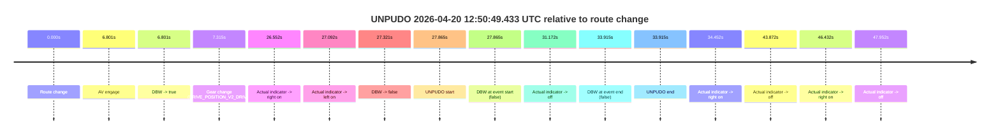
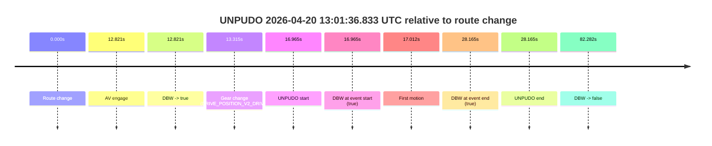
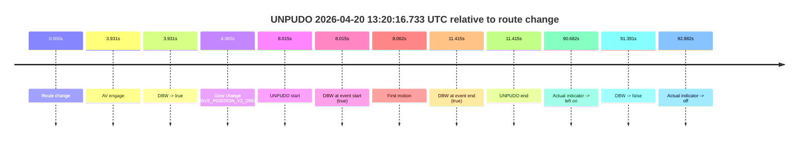
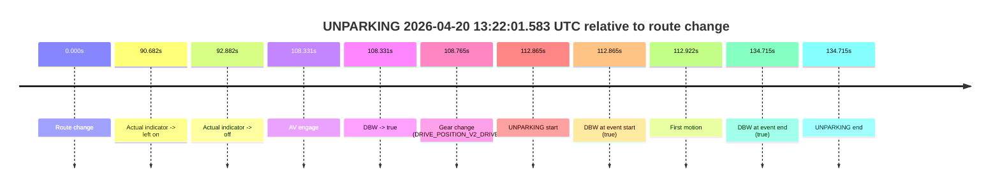

# Run Report: fme20038/2026-04-20--12-44-55--gen2-av-d7b5ebe9-0257-4947-a48a-ade5f11aa01b

| Field | Value |
|---|---|
| Run ID | `fme20038/2026-04-20--12-44-55--gen2-av-d7b5ebe9-0257-4947-a48a-ade5f11aa01b` |
| Date | `2026-04-20` |
| Model(s) | `eel-teal-outspoken` |
| Author | `zak` |
| Event count | `6` |

## unpudo 2026-04-20 12:50:49.433 UTC

| Field | Value |
|---|---|
| Model | `eel-teal-outspoken` |
| Author | `zak` |
| Run ID | `fme20038/2026-04-20--12-44-55--gen2-av-d7b5ebe9-0257-4947-a48a-ade5f11aa01b` |
| Date | `2026-04-20` |
| Time (UTC) | `12:50:49.433` |
| Event type | `unpudo` |
| Disengagement type | `none observed` |
| Route change | `found` |
| Console | [run](https://console.sso.wayve.ai/run/fme20038/2026-04-20--12-44-55--gen2-av-d7b5ebe9-0257-4947-a48a-ade5f11aa01b?id=&time-unixus=1776689449433309) |
| Foxglove | [segment](https://app.foxglove.dev/wayve-on-prem/p/prj_0dX18KZdVHg1fmmI/view?ds=foxglove-stream&ds.deviceName=fme20038&ds.start=2026-04-20T12%3A50%3A11.568292Z&ds.end=2026-04-20T12%3A51%3A05.483293Z&layoutId=lay_0e7VD4WIKDQGU73Y&time=2026-04-20T12%3A50%3A49.433309Z) |

### Event card: fail

- Fail: the credited unpudo does not stay AV-owned. The event window starts with DBW false, and the maneuver outcome lands outside a clean AV-owned segment.

| Event | Time (UTC) | Delta from route change |
|---|---:|---:|
| Route change | 2026-04-20 12:50:21.568 | `0.000s` |
| AV engage | 2026-04-20 12:50:28.369 | `6.801s` |
| DBW -> true | 2026-04-20 12:50:28.369 | `6.801s` |
| Gear change (DRIVE_POSITION_V2_DRIVE) | 2026-04-20 12:50:28.883 | `7.315s` |
| Actual indicator -> right on | 2026-04-20 12:50:48.120 | `26.552s` |
| Actual indicator -> left on | 2026-04-20 12:50:48.659 | `27.092s` |
| DBW -> false | 2026-04-20 12:50:48.889 | `27.321s` |
| UNPUDO start | 2026-04-20 12:50:49.433 | `27.865s` |
| DBW at event start (false) | 2026-04-20 12:50:49.433 | `27.865s` |
| Actual indicator -> off | 2026-04-20 12:50:52.740 | `31.172s` |
| DBW at event end (false) | 2026-04-20 12:50:55.483 | `33.915s` |
| UNPUDO end | 2026-04-20 12:50:55.483 | `33.915s` |
| Actual indicator -> right on | 2026-04-20 12:50:56.019 | `34.452s` |
| Actual indicator -> off | 2026-04-20 12:51:05.440 | `43.872s` |
| Actual indicator -> right on | 2026-04-20 12:51:07.999 | `46.432s` |
| Actual indicator -> off | 2026-04-20 12:51:09.520 | `47.952s` |

| Metric | Value |
|---|---|
| Outcome | `fail` |
| Effective failure type | `not_av_owned` |
| Route change status | `found` |
| DBW at event start | `false` |
| DBW at event end | `false` |
| Predicted gear at AV start | `DRIVE_POSITION_V2_DRIVE` |
| Actual gear at AV start | `DRIVE_POSITION_V2_PARK` |
| Predicted gear at event start | `DRIVE_POSITION_V2_DRIVE` |
| Actual gear at event start | `DRIVE_POSITION_V2_DRIVE` |
| Planned indicator direction | `INDICATORS_STATE_V2_LEFT_ON` |
| Controller indicator direction | `INDICATORS_STATE_V2_LEFT_ON` |
| Actual indicator direction | `INDICATORS_STATE_V2_LEFT_ON` |
| Actual indicator at maneuver end | `INDICATORS_STATE_V2_OFF` |
| Driver accel help in AV | `false` |
| Driver accel help timestamp | `n/a` |
| Max accel pedal pct in AV | `0.0%` |
| Max brake pedal pct in AV | `8.0%` |
| Max speed mps in AV | `0.000` |
| Success timing baseline | `route change` |
| Route -> AV | `6.801s` |
| AV -> event start | `21.064s` |
| AV -> first motion | `n/a` |
| Success baseline -> event start | `27.865s` |
| Success baseline -> first motion | `n/a` |
| AV duration before disengagement | `20.520s` |
| Trajectory waypoint count | `38` |
| Driving-plan step count | `11` |

The scored portion starts from the AV-owned window, not from the pre-AV setup. Route-change search in the stopped pre-event segment was `found`, with the baseline therefore set to route change. At the event anchor the model predicts `DRIVE_POSITION_V2_DRIVE` and the actual gear is `DRIVE_POSITION_V2_DRIVE`. The effective model outcome is `fail` because `not_av_owned.`

### Resolution

| Field | Value |
|---|---|
| Final outcome | `fail` |
| Do we agree with this label? | `yes` |
| Source disengagement type | `none observed` |
| Resolved effective failure type | `not_av_owned` |
| Confidence | `high` |

## unpudo 2026-04-20 12:59:41.433 UTC

| Field | Value |
|---|---|
| Model | `eel-teal-outspoken` |
| Author | `zak` |
| Run ID | `fme20038/2026-04-20--12-44-55--gen2-av-d7b5ebe9-0257-4947-a48a-ade5f11aa01b` |
| Date | `2026-04-20` |
| Time (UTC) | `12:59:41.433` |
| Event type | `unpudo` |
| Disengagement type | `none observed` |
| Route change | `found` |
| Console | [run](https://console.sso.wayve.ai/run/fme20038/2026-04-20--12-44-55--gen2-av-d7b5ebe9-0257-4947-a48a-ade5f11aa01b?id=&time-unixus=1776689981433291) |
| Foxglove | [segment](https://app.foxglove.dev/wayve-on-prem/p/prj_0dX18KZdVHg1fmmI/view?ds=foxglove-stream&ds.deviceName=fme20038&ds.start=2026-04-20T12%3A59%3A21.318239Z&ds.end=2026-04-20T13%3A00%3A41.050619Z&layoutId=lay_0e7VD4WIKDQGU73Y&time=2026-04-20T12%3A59%3A41.433291Z) |

### Event card: pass

- Pass: AV owns the credited unpudo from route change through the official unpudo window, the gear state is aligned at the anchor, and the vehicle moves without driver accelerator help in AV.

| Event | Time (UTC) | Delta from route change |
|---|---:|---:|
| Route change | 2026-04-20 12:59:31.318 | `0.000s` |
| AV engage | 2026-04-20 12:59:37.269 | `5.951s` |
| DBW -> true | 2026-04-20 12:59:37.269 | `5.951s` |
| Gear change (DRIVE_POSITION_V2_DRIVE) | 2026-04-20 12:59:37.783 | `6.465s` |
| UNPUDO start | 2026-04-20 12:59:41.433 | `10.115s` |
| DBW at event start (true) | 2026-04-20 12:59:41.433 | `10.115s` |
| First motion | 2026-04-20 12:59:41.460 | `10.142s` |
| DBW at event end (true) | 2026-04-20 12:59:44.783 | `13.465s` |
| UNPUDO end | 2026-04-20 12:59:44.783 | `13.465s` |
| DBW -> false | 2026-04-20 13:00:31.050 | `59.732s` |

| Metric | Value |
|---|---|
| Outcome | `pass` |
| Effective failure type | `none` |
| Route change status | `found` |
| DBW at event start | `true` |
| DBW at event end | `true` |
| Predicted gear at AV start | `DRIVE_POSITION_V2_DRIVE` |
| Actual gear at AV start | `DRIVE_POSITION_V2_PARK` |
| Predicted gear at event start | `DRIVE_POSITION_V2_DRIVE` |
| Actual gear at event start | `DRIVE_POSITION_V2_DRIVE` |
| Planned indicator direction | `INDICATORS_STATE_V2_RIGHT_ON` |
| Controller indicator direction | `INDICATORS_STATE_V2_RIGHT_ON` |
| Actual indicator direction | `INDICATORS_STATE_V2_OFF` |
| Actual indicator at maneuver end | `INDICATORS_STATE_V2_OFF` |
| Driver accel help in AV | `false` |
| Driver accel help timestamp | `n/a` |
| Max accel pedal pct in AV | `0.0%` |
| Max brake pedal pct in AV | `8.0%` |
| Max speed mps in AV | `5.156` |
| Success timing baseline | `route change` |
| Route -> AV | `5.951s` |
| AV -> event start | `4.164s` |
| AV -> first motion | `4.191s` |
| Success baseline -> event start | `10.115s` |
| Success baseline -> first motion | `10.142s` |
| AV duration before disengagement | `53.781s` |
| Trajectory waypoint count | `38` |
| Driving-plan step count | `11` |

The scored portion starts from the AV-owned window, not from the pre-AV setup. Route-change search in the stopped pre-event segment was `found`, with the baseline therefore set to route change. At the event anchor the model predicts `DRIVE_POSITION_V2_DRIVE` and the actual gear is `DRIVE_POSITION_V2_DRIVE`. The effective model outcome is `pass` because `the credited unpudo stays AV-owned through the official unpudo window.`

### Resolution

| Field | Value |
|---|---|
| Final outcome | `pass` |
| Do we agree with this label? | `yes` |
| Source disengagement type | `none observed` |
| Resolved effective failure type | `none` |
| Confidence | `high` |

## unpudo 2026-04-20 13:01:36.833 UTC

| Field | Value |
|---|---|
| Model | `eel-teal-outspoken` |
| Author | `zak` |
| Run ID | `fme20038/2026-04-20--12-44-55--gen2-av-d7b5ebe9-0257-4947-a48a-ade5f11aa01b` |
| Date | `2026-04-20` |
| Time (UTC) | `13:01:36.833` |
| Event type | `unpudo` |
| Disengagement type | `none observed` |
| Route change | `found` |
| Console | [run](https://console.sso.wayve.ai/run/fme20038/2026-04-20--12-44-55--gen2-av-d7b5ebe9-0257-4947-a48a-ade5f11aa01b?id=&time-unixus=1776690096833302) |
| Foxglove | [segment](https://app.foxglove.dev/wayve-on-prem/p/prj_0dX18KZdVHg1fmmI/view?ds=foxglove-stream&ds.deviceName=fme20038&ds.start=2026-04-20T13%3A01%3A09.868262Z&ds.end=2026-04-20T13%3A02%3A52.150318Z&layoutId=lay_0e7VD4WIKDQGU73Y&time=2026-04-20T13%3A01%3A36.833302Z) |

### Event card: pass

- Pass: AV owns the credited unpudo from route change through the official unpudo window, the gear state is aligned at the anchor, and the vehicle moves without driver accelerator help in AV.

| Event | Time (UTC) | Delta from route change |
|---|---:|---:|
| Route change | 2026-04-20 13:01:19.868 | `0.000s` |
| AV engage | 2026-04-20 13:01:32.689 | `12.821s` |
| DBW -> true | 2026-04-20 13:01:32.689 | `12.821s` |
| Gear change (DRIVE_POSITION_V2_DRIVE) | 2026-04-20 13:01:33.183 | `13.315s` |
| UNPUDO start | 2026-04-20 13:01:36.833 | `16.965s` |
| DBW at event start (true) | 2026-04-20 13:01:36.833 | `16.965s` |
| First motion | 2026-04-20 13:01:36.879 | `17.012s` |
| DBW at event end (true) | 2026-04-20 13:01:48.033 | `28.165s` |
| UNPUDO end | 2026-04-20 13:01:48.033 | `28.165s` |
| DBW -> false | 2026-04-20 13:02:42.150 | `82.282s` |

| Metric | Value |
|---|---|
| Outcome | `pass` |
| Effective failure type | `none` |
| Route change status | `found` |
| DBW at event start | `true` |
| DBW at event end | `true` |
| Predicted gear at AV start | `DRIVE_POSITION_V2_DRIVE` |
| Actual gear at AV start | `DRIVE_POSITION_V2_PARK` |
| Predicted gear at event start | `DRIVE_POSITION_V2_DRIVE` |
| Actual gear at event start | `DRIVE_POSITION_V2_DRIVE` |
| Planned indicator direction | `INDICATORS_STATE_V2_RIGHT_ON` |
| Controller indicator direction | `INDICATORS_STATE_V2_RIGHT_ON` |
| Actual indicator direction | `INDICATORS_STATE_V2_OFF` |
| Actual indicator at maneuver end | `INDICATORS_STATE_V2_OFF` |
| Driver accel help in AV | `false` |
| Driver accel help timestamp | `n/a` |
| Max accel pedal pct in AV | `0.0%` |
| Max brake pedal pct in AV | `8.6%` |
| Max speed mps in AV | `2.539` |
| Success timing baseline | `route change` |
| Route -> AV | `12.821s` |
| AV -> event start | `4.144s` |
| AV -> first motion | `4.191s` |
| Success baseline -> event start | `16.965s` |
| Success baseline -> first motion | `17.012s` |
| AV duration before disengagement | `69.461s` |
| Trajectory waypoint count | `38` |
| Driving-plan step count | `11` |

The scored portion starts from the AV-owned window, not from the pre-AV setup. Route-change search in the stopped pre-event segment was `found`, with the baseline therefore set to route change. At the event anchor the model predicts `DRIVE_POSITION_V2_DRIVE` and the actual gear is `DRIVE_POSITION_V2_DRIVE`. The effective model outcome is `pass` because `the credited unpudo stays AV-owned through the official unpudo window.`

### Resolution

| Field | Value |
|---|---|
| Final outcome | `pass` |
| Do we agree with this label? | `yes` |
| Source disengagement type | `none observed` |
| Resolved effective failure type | `none` |
| Confidence | `high` |

## unpudo 2026-04-20 13:07:15.683 UTC

| Field | Value |
|---|---|
| Model | `eel-teal-outspoken` |
| Author | `zak` |
| Run ID | `fme20038/2026-04-20--12-44-55--gen2-av-d7b5ebe9-0257-4947-a48a-ade5f11aa01b` |
| Date | `2026-04-20` |
| Time (UTC) | `13:07:15.683` |
| Event type | `unpudo` |
| Disengagement type | `none observed` |
| Route change | `found` |
| Console | [run](https://console.sso.wayve.ai/run/fme20038/2026-04-20--12-44-55--gen2-av-d7b5ebe9-0257-4947-a48a-ade5f11aa01b?id=&time-unixus=1776690435683299) |
| Foxglove | [segment](https://app.foxglove.dev/wayve-on-prem/p/prj_0dX18KZdVHg1fmmI/view?ds=foxglove-stream&ds.deviceName=fme20038&ds.start=2026-04-20T13%3A06%3A57.318261Z&ds.end=2026-04-20T13%3A09%3A10.929328Z&layoutId=lay_0e7VD4WIKDQGU73Y&time=2026-04-20T13%3A07%3A15.683299Z) |

### Event card: pass

- Pass: AV owns the credited unpudo from route change through the official unpudo window, the gear state is aligned at the anchor, and the vehicle moves without driver accelerator help in AV.

| Event | Time (UTC) | Delta from route change |
|---|---:|---:|
| Route change | 2026-04-20 13:07:07.318 | `0.000s` |
| AV engage | 2026-04-20 13:07:11.589 | `4.271s` |
| DBW -> true | 2026-04-20 13:07:11.589 | `4.271s` |
| Gear change (DRIVE_POSITION_V2_DRIVE) | 2026-04-20 13:07:12.083 | `4.765s` |
| UNPUDO start | 2026-04-20 13:07:15.683 | `8.365s` |
| DBW at event start (true) | 2026-04-20 13:07:15.683 | `8.365s` |
| First motion | 2026-04-20 13:07:15.700 | `8.382s` |
| DBW at event end (true) | 2026-04-20 13:07:23.483 | `16.165s` |
| UNPUDO end | 2026-04-20 13:07:23.483 | `16.165s` |
| DBW -> false | 2026-04-20 13:09:00.929 | `113.611s` |

| Metric | Value |
|---|---|
| Outcome | `pass` |
| Effective failure type | `none` |
| Route change status | `found` |
| DBW at event start | `true` |
| DBW at event end | `true` |
| Predicted gear at AV start | `DRIVE_POSITION_V2_DRIVE` |
| Actual gear at AV start | `DRIVE_POSITION_V2_PARK` |
| Predicted gear at event start | `DRIVE_POSITION_V2_DRIVE` |
| Actual gear at event start | `DRIVE_POSITION_V2_DRIVE` |
| Planned indicator direction | `INDICATORS_STATE_V2_OFF` |
| Controller indicator direction | `INDICATORS_STATE_V2_OFF` |
| Actual indicator direction | `INDICATORS_STATE_V2_OFF` |
| Actual indicator at maneuver end | `INDICATORS_STATE_V2_OFF` |
| Driver accel help in AV | `false` |
| Driver accel help timestamp | `n/a` |
| Max accel pedal pct in AV | `0.0%` |
| Max brake pedal pct in AV | `10.9%` |
| Max speed mps in AV | `2.489` |
| Success timing baseline | `route change` |
| Route -> AV | `4.271s` |
| AV -> event start | `4.094s` |
| AV -> first motion | `4.111s` |
| Success baseline -> event start | `8.365s` |
| Success baseline -> first motion | `8.382s` |
| AV duration before disengagement | `109.340s` |
| Trajectory waypoint count | `37` |
| Driving-plan step count | `11` |

The scored portion starts from the AV-owned window, not from the pre-AV setup. Route-change search in the stopped pre-event segment was `found`, with the baseline therefore set to route change. At the event anchor the model predicts `DRIVE_POSITION_V2_DRIVE` and the actual gear is `DRIVE_POSITION_V2_DRIVE`. The effective model outcome is `pass` because `the credited unpudo stays AV-owned through the official unpudo window.`

### Resolution

| Field | Value |
|---|---|
| Final outcome | `pass` |
| Do we agree with this label? | `yes` |
| Source disengagement type | `none observed` |
| Resolved effective failure type | `none` |
| Confidence | `high` |

## unpudo 2026-04-20 13:20:16.733 UTC

| Field | Value |
|---|---|
| Model | `eel-teal-outspoken` |
| Author | `zak` |
| Run ID | `fme20038/2026-04-20--12-44-55--gen2-av-d7b5ebe9-0257-4947-a48a-ade5f11aa01b` |
| Date | `2026-04-20` |
| Time (UTC) | `13:20:16.733` |
| Event type | `unpudo` |
| Disengagement type | `none observed` |
| Route change | `found` |
| Console | [run](https://console.sso.wayve.ai/run/fme20038/2026-04-20--12-44-55--gen2-av-d7b5ebe9-0257-4947-a48a-ade5f11aa01b?id=&time-unixus=1776691216733311) |
| Foxglove | [segment](https://app.foxglove.dev/wayve-on-prem/p/prj_0dX18KZdVHg1fmmI/view?ds=foxglove-stream&ds.deviceName=fme20038&ds.start=2026-04-20T13%3A19%3A58.718270Z&ds.end=2026-04-20T13%3A21%3A50.109257Z&layoutId=lay_0e7VD4WIKDQGU73Y&time=2026-04-20T13%3A20%3A16.733311Z) |

### Event card: pass

- Pass: AV owns the credited unpudo from route change through the official unpudo window, the gear state is aligned at the anchor, and the vehicle moves without driver accelerator help in AV.

| Event | Time (UTC) | Delta from route change |
|---|---:|---:|
| Route change | 2026-04-20 13:20:08.718 | `0.000s` |
| AV engage | 2026-04-20 13:20:12.649 | `3.931s` |
| DBW -> true | 2026-04-20 13:20:12.649 | `3.931s` |
| Gear change (DRIVE_POSITION_V2_DRIVE) | 2026-04-20 13:20:13.083 | `4.365s` |
| UNPUDO start | 2026-04-20 13:20:16.733 | `8.015s` |
| DBW at event start (true) | 2026-04-20 13:20:16.733 | `8.015s` |
| First motion | 2026-04-20 13:20:16.780 | `8.062s` |
| DBW at event end (true) | 2026-04-20 13:20:20.133 | `11.415s` |
| UNPUDO end | 2026-04-20 13:20:20.133 | `11.415s` |
| Actual indicator -> left on | 2026-04-20 13:21:39.400 | `90.682s` |
| DBW -> false | 2026-04-20 13:21:40.109 | `91.391s` |
| Actual indicator -> off | 2026-04-20 13:21:41.600 | `92.882s` |

| Metric | Value |
|---|---|
| Outcome | `pass` |
| Effective failure type | `none` |
| Route change status | `found` |
| DBW at event start | `true` |
| DBW at event end | `true` |
| Predicted gear at AV start | `DRIVE_POSITION_V2_DRIVE` |
| Actual gear at AV start | `DRIVE_POSITION_V2_PARK` |
| Predicted gear at event start | `DRIVE_POSITION_V2_DRIVE` |
| Actual gear at event start | `DRIVE_POSITION_V2_DRIVE` |
| Planned indicator direction | `INDICATORS_STATE_V2_RIGHT_ON` |
| Controller indicator direction | `INDICATORS_STATE_V2_RIGHT_ON` |
| Actual indicator direction | `INDICATORS_STATE_V2_OFF` |
| Actual indicator at maneuver end | `INDICATORS_STATE_V2_OFF` |
| Driver accel help in AV | `false` |
| Driver accel help timestamp | `n/a` |
| Max accel pedal pct in AV | `0.0%` |
| Max brake pedal pct in AV | `8.1%` |
| Max speed mps in AV | `5.214` |
| Success timing baseline | `route change` |
| Route -> AV | `3.931s` |
| AV -> event start | `4.084s` |
| AV -> first motion | `4.131s` |
| Success baseline -> event start | `8.015s` |
| Success baseline -> first motion | `8.062s` |
| AV duration before disengagement | `87.460s` |
| Trajectory waypoint count | `38` |
| Driving-plan step count | `11` |

The scored portion starts from the AV-owned window, not from the pre-AV setup. Route-change search in the stopped pre-event segment was `found`, with the baseline therefore set to route change. At the event anchor the model predicts `DRIVE_POSITION_V2_DRIVE` and the actual gear is `DRIVE_POSITION_V2_DRIVE`. The effective model outcome is `pass` because `the credited unpudo stays AV-owned through the official unpudo window.`

### Resolution

| Field | Value |
|---|---|
| Final outcome | `pass` |
| Do we agree with this label? | `yes` |
| Source disengagement type | `none observed` |
| Resolved effective failure type | `none` |
| Confidence | `high` |

## unparking 2026-04-20 13:22:01.583 UTC

| Field | Value |
|---|---|
| Model | `eel-teal-outspoken` |
| Author | `zak` |
| Run ID | `fme20038/2026-04-20--12-44-55--gen2-av-d7b5ebe9-0257-4947-a48a-ade5f11aa01b` |
| Date | `2026-04-20` |
| Time (UTC) | `13:22:01.583` |
| Event type | `unparking` |
| Disengagement type | `none observed` |
| Route change | `found` |
| Console | [run](https://console.sso.wayve.ai/run/fme20038/2026-04-20--12-44-55--gen2-av-d7b5ebe9-0257-4947-a48a-ade5f11aa01b?id=&time-unixus=1776691321583299) |
| Foxglove | [segment](https://app.foxglove.dev/wayve-on-prem/p/prj_0dX18KZdVHg1fmmI/view?ds=foxglove-stream&ds.deviceName=fme20038&ds.start=2026-04-20T13%3A19%3A58.718270Z&ds.end=2026-04-20T13%3A22%3A33.433297Z&layoutId=lay_0e7VD4WIKDQGU73Y&time=2026-04-20T13%3A22%3A01.583299Z) |

### Event card: pass

- Pass: AV owns the credited unparking through the official event window, the gear state is aligned at the anchor, and the vehicle moves without driver accelerator help in AV.

| Event | Time (UTC) | Delta from route change |
|---|---:|---:|
| Route change | 2026-04-20 13:20:08.718 | `0.000s` |
| Actual indicator -> left on | 2026-04-20 13:21:39.400 | `90.682s` |
| Actual indicator -> off | 2026-04-20 13:21:41.600 | `92.882s` |
| AV engage | 2026-04-20 13:21:57.049 | `108.331s` |
| DBW -> true | 2026-04-20 13:21:57.049 | `108.331s` |
| Gear change (DRIVE_POSITION_V2_DRIVE) | 2026-04-20 13:21:57.483 | `108.765s` |
| UNPARKING start | 2026-04-20 13:22:01.583 | `112.865s` |
| DBW at event start (true) | 2026-04-20 13:22:01.583 | `112.865s` |
| First motion | 2026-04-20 13:22:01.640 | `112.922s` |
| DBW at event end (true) | 2026-04-20 13:22:23.433 | `134.715s` |
| UNPARKING end | 2026-04-20 13:22:23.433 | `134.715s` |

| Metric | Value |
|---|---|
| Outcome | `pass` |
| Effective failure type | `none` |
| Route change status | `found` |
| DBW at event start | `true` |
| DBW at event end | `true` |
| Predicted gear at AV start | `DRIVE_POSITION_V2_DRIVE` |
| Actual gear at AV start | `DRIVE_POSITION_V2_PARK` |
| Predicted gear at event start | `DRIVE_POSITION_V2_DRIVE` |
| Actual gear at event start | `DRIVE_POSITION_V2_DRIVE` |
| Planned indicator direction | `INDICATORS_STATE_V2_RIGHT_ON` |
| Controller indicator direction | `INDICATORS_STATE_V2_RIGHT_ON` |
| Actual indicator direction | `INDICATORS_STATE_V2_OFF` |
| Actual indicator at maneuver end | `INDICATORS_STATE_V2_OFF` |
| Driver accel help in AV | `false` |
| Driver accel help timestamp | `n/a` |
| Max accel pedal pct in AV | `0.0%` |
| Max brake pedal pct in AV | `8.0%` |
| Max speed mps in AV | `3.256` |
| Success timing baseline | `route change` |
| Route -> AV | `108.331s` |
| AV -> event start | `4.534s` |
| AV -> first motion | `4.591s` |
| Success baseline -> event start | `112.865s` |
| Success baseline -> first motion | `112.922s` |
| AV duration before disengagement | `n/a` |
| Trajectory waypoint count | `37` |
| Driving-plan step count | `11` |

The scored portion starts from the AV-owned window, not from the pre-AV setup. Route-change search in the stopped pre-event segment was `found`, with the baseline therefore set to route change. At the event anchor the model predicts `DRIVE_POSITION_V2_DRIVE` and the actual gear is `DRIVE_POSITION_V2_DRIVE`. The effective model outcome is `pass` because `the credited maneuver stays AV-owned through the official event end.`

### Resolution

| Field | Value |
|---|---|
| Final outcome | `pass` |
| Do we agree with this label? | `yes` |
| Source disengagement type | `none observed` |
| Resolved effective failure type | `none` |
| Confidence | `high` |
