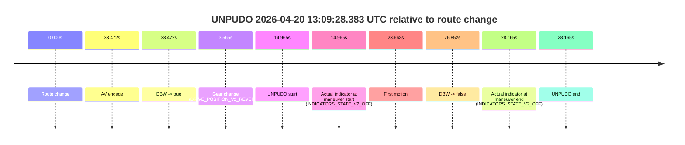
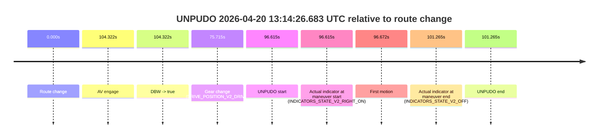

# Run Report: fme20038/2026-04-20--12-44-55--gen2-av-d7b5ebe9-0257-4947-a48a-ade5f11aa01b

| Field | Value |
|---|---|
| Run ID | `fme20038/2026-04-20--12-44-55--gen2-av-d7b5ebe9-0257-4947-a48a-ade5f11aa01b` |
| Date | `2026-04-20` |
| Model(s) | `blue-panther-solid` |
| Author | `guy.geva` |
| Event count | `6` |

## unpudo 2026-04-20 12:53:32.583 UTC

| Field | Value |
|---|---|
| Model | `blue-panther-solid` |
| Author | `guy.geva` |
| Run ID | `fme20038/2026-04-20--12-44-55--gen2-av-d7b5ebe9-0257-4947-a48a-ade5f11aa01b` |
| Date | `2026-04-20` |
| Time (UTC) | `12:53:32.583` |
| Event type | `unpudo` |
| Disengagement type | `none observed` |
| Route change | `found` |
| Console | [run](https://console.sso.wayve.ai/run/fme20038/2026-04-20--12-44-55--gen2-av-d7b5ebe9-0257-4947-a48a-ade5f11aa01b?id=&time-unixus=1776689612583315) |
| Foxglove | [segment](https://app.foxglove.dev/wayve-on-prem/p/prj_0dX18KZdVHg1fmmI/view?ds=foxglove-stream&ds.deviceName=fme20038&ds.start=2026-04-20T12%3A53%3A07.118342Z&ds.end=2026-04-20T12%3A55%3A37.009296Z&layoutId=lay_0e7VD4WIKDQGU73Y&time=2026-04-20T12%3A53%3A32.583315Z) |

### Event card: fail

- Fail: the credited unpudo does not stay AV-owned. The event window starts with DBW false, and the maneuver outcome lands outside a clean AV-owned segment.

| Event | Time (UTC) | Delta from route change |
|---|---:|---:|
| Route change | 2026-04-20 12:53:17.118 | `0.000s` |
| AV engage | 2026-04-20 12:53:41.530 | `24.412s` |
| DBW -> true | 2026-04-20 12:53:41.530 | `24.412s` |
| Gear change (DRIVE_POSITION_V2_DRIVE) | 2026-04-20 12:53:23.183 | `6.065s` |
| UNPUDO start | 2026-04-20 12:53:32.583 | `15.465s` |
| Actual indicator at maneuver start (INDICATORS_STATE_V2_OFF) | 2026-04-20 12:53:32.583 | `15.465s` |
| First motion | 2026-04-20 12:53:32.660 | `15.542s` |
| DBW -> false | 2026-04-20 12:55:27.009 | `129.891s` |
| Actual indicator at maneuver end (INDICATORS_STATE_V2_OFF) | 2026-04-20 12:53:39.433 | `22.315s` |
| UNPUDO end | 2026-04-20 12:53:39.433 | `22.315s` |

| Metric | Value |
|---|---|
| Outcome | `fail` |
| Effective failure type | `completed_outside_av` |
| Route change status | `found` |
| DBW at event start | `false` |
| DBW at event end | `false` |
| Predicted gear at AV start | `DRIVE_POSITION_V2_DRIVE` |
| Actual gear at AV start | `DRIVE_POSITION_V2_DRIVE` |
| Predicted gear at event start | `DRIVE_POSITION_V2_DRIVE` |
| Actual gear at event start | `DRIVE_POSITION_V2_DRIVE` |
| Planned indicator direction | `INDICATORS_STATE_V2_LEFT_ON` |
| Controller indicator direction | `INDICATORS_STATE_V2_LEFT_ON` |
| Actual indicator direction | `INDICATORS_STATE_V2_OFF` |
| Actual indicator at maneuver end | `INDICATORS_STATE_V2_OFF` |
| Driver accel help in AV | `false` |
| Driver accel help timestamp | `n/a` |
| Max accel pedal pct in AV | `0.0%` |
| Max brake pedal pct in AV | `0.0%` |
| Max speed mps in AV | `0.000` |
| Route -> AV | `24.412s` |
| AV -> event start | `-8.947s` |
| AV -> first motion | `-8.871s` |
| AV duration before disengagement | `105.479s` |
| Trajectory waypoint count | `37` |
| Driving-plan step count | `11` |

The scored portion starts from the AV-owned window, not from the pre-AV setup. Route-change search in the stopped pre-event segment was `found`, with the baseline therefore set to route change. At the event anchor the model predicts `DRIVE_POSITION_V2_DRIVE` and the actual gear is `DRIVE_POSITION_V2_DRIVE`. The effective model outcome is `fail` because `completed_outside_av`.

### Resolution

| Field | Value |
|---|---|
| Final outcome | `fail` |
| Do we agree with this label? | `yes` |
| Source disengagement type | `none observed` |
| Resolved effective failure type | `completed_outside_av` |
| Confidence | `high` |

## unpudo 2026-04-20 12:56:07.533 UTC

| Field | Value |
|---|---|
| Model | `blue-panther-solid` |
| Author | `guy.geva` |
| Run ID | `fme20038/2026-04-20--12-44-55--gen2-av-d7b5ebe9-0257-4947-a48a-ade5f11aa01b` |
| Date | `2026-04-20` |
| Time (UTC) | `12:56:07.533` |
| Event type | `unpudo` |
| Disengagement type | `none observed` |
| Route change | `found` |
| Console | [run](https://console.sso.wayve.ai/run/fme20038/2026-04-20--12-44-55--gen2-av-d7b5ebe9-0257-4947-a48a-ade5f11aa01b?id=&time-unixus=1776689767533313) |
| Foxglove | [segment](https://app.foxglove.dev/wayve-on-prem/p/prj_0dX18KZdVHg1fmmI/view?ds=foxglove-stream&ds.deviceName=fme20038&ds.start=2026-04-20T12%3A55%3A34.218249Z&ds.end=2026-04-20T12%3A57%3A13.649414Z&layoutId=lay_0e7VD4WIKDQGU73Y&time=2026-04-20T12%3A56%3A07.533313Z) |

### Event card: fail

- Fail: the credited unpudo does not stay AV-owned. The event window starts with DBW false, and the maneuver outcome lands outside a clean AV-owned segment.

| Event | Time (UTC) | Delta from route change |
|---|---:|---:|
| Route change | 2026-04-20 12:55:44.218 | `0.000s` |
| AV engage | 2026-04-20 12:56:12.269 | `28.051s` |
| DBW -> true | 2026-04-20 12:56:12.269 | `28.051s` |
| Gear change (DRIVE_POSITION_V2_DRIVE) | 2026-04-20 12:55:50.683 | `6.465s` |
| UNPUDO start | 2026-04-20 12:56:07.533 | `23.315s` |
| Actual indicator at maneuver start (INDICATORS_STATE_V2_OFF) | 2026-04-20 12:56:07.533 | `23.315s` |
| First motion | 2026-04-20 12:56:07.580 | `23.362s` |
| DBW -> false | 2026-04-20 12:57:03.649 | `79.431s` |
| Actual indicator at maneuver end (INDICATORS_STATE_V2_OFF) | 2026-04-20 12:56:11.883 | `27.665s` |
| UNPUDO end | 2026-04-20 12:56:11.883 | `27.665s` |

| Metric | Value |
|---|---|
| Outcome | `fail` |
| Effective failure type | `completed_outside_av` |
| Route change status | `found` |
| DBW at event start | `false` |
| DBW at event end | `false` |
| Predicted gear at AV start | `DRIVE_POSITION_V2_DRIVE` |
| Actual gear at AV start | `DRIVE_POSITION_V2_DRIVE` |
| Predicted gear at event start | `DRIVE_POSITION_V2_DRIVE` |
| Actual gear at event start | `DRIVE_POSITION_V2_DRIVE` |
| Planned indicator direction | `INDICATORS_STATE_V2_OFF` |
| Controller indicator direction | `INDICATORS_STATE_V2_OFF` |
| Actual indicator direction | `INDICATORS_STATE_V2_OFF` |
| Actual indicator at maneuver end | `INDICATORS_STATE_V2_OFF` |
| Driver accel help in AV | `false` |
| Driver accel help timestamp | `n/a` |
| Max accel pedal pct in AV | `0.0%` |
| Max brake pedal pct in AV | `0.0%` |
| Max speed mps in AV | `0.000` |
| Route -> AV | `28.051s` |
| AV -> event start | `-4.736s` |
| AV -> first motion | `-4.689s` |
| AV duration before disengagement | `51.380s` |
| Trajectory waypoint count | `36` |
| Driving-plan step count | `11` |

The scored portion starts from the AV-owned window, not from the pre-AV setup. Route-change search in the stopped pre-event segment was `found`, with the baseline therefore set to route change. At the event anchor the model predicts `DRIVE_POSITION_V2_DRIVE` and the actual gear is `DRIVE_POSITION_V2_DRIVE`. The effective model outcome is `fail` because `completed_outside_av`.

### Resolution

| Field | Value |
|---|---|
| Final outcome | `fail` |
| Do we agree with this label? | `yes` |
| Source disengagement type | `none observed` |
| Resolved effective failure type | `completed_outside_av` |
| Confidence | `high` |

## unpudo 2026-04-20 13:04:52.633 UTC

| Field | Value |
|---|---|
| Model | `blue-panther-solid` |
| Author | `guy.geva` |
| Run ID | `fme20038/2026-04-20--12-44-55--gen2-av-d7b5ebe9-0257-4947-a48a-ade5f11aa01b` |
| Date | `2026-04-20` |
| Time (UTC) | `13:04:52.633` |
| Event type | `unpudo` |
| Disengagement type | `none observed` |
| Route change | `found` |
| Console | [run](https://console.sso.wayve.ai/run/fme20038/2026-04-20--12-44-55--gen2-av-d7b5ebe9-0257-4947-a48a-ade5f11aa01b?id=&time-unixus=1776690292633309) |
| Foxglove | [segment](https://app.foxglove.dev/wayve-on-prem/p/prj_0dX18KZdVHg1fmmI/view?ds=foxglove-stream&ds.deviceName=fme20038&ds.start=2026-04-20T13%3A04%3A17.118303Z&ds.end=2026-04-20T13%3A07%3A02.049336Z&layoutId=lay_0e7VD4WIKDQGU73Y&time=2026-04-20T13%3A04%3A52.633309Z) |

### Event card: fail

- Fail: the credited unpudo does not stay AV-owned. The event window starts with DBW false, and the maneuver outcome lands outside a clean AV-owned segment.

| Event | Time (UTC) | Delta from route change |
|---|---:|---:|
| Route change | 2026-04-20 13:04:27.118 | `0.000s` |
| AV engage | 2026-04-20 13:05:01.290 | `34.172s` |
| DBW -> true | 2026-04-20 13:05:01.290 | `34.172s` |
| Gear change (DRIVE_POSITION_V2_DRIVE) | 2026-04-20 13:04:37.583 | `10.465s` |
| UNPUDO start | 2026-04-20 13:04:52.633 | `25.515s` |
| Actual indicator at maneuver start (INDICATORS_STATE_V2_RIGHT_ON) | 2026-04-20 13:04:52.633 | `25.515s` |
| First motion | 2026-04-20 13:04:52.680 | `25.562s` |
| DBW -> false | 2026-04-20 13:06:52.049 | `144.931s` |
| Actual indicator at maneuver end (INDICATORS_STATE_V2_OFF) | 2026-04-20 13:04:56.883 | `29.765s` |
| UNPUDO end | 2026-04-20 13:04:56.883 | `29.765s` |

| Metric | Value |
|---|---|
| Outcome | `fail` |
| Effective failure type | `completed_outside_av` |
| Route change status | `found` |
| DBW at event start | `false` |
| DBW at event end | `false` |
| Predicted gear at AV start | `DRIVE_POSITION_V2_DRIVE` |
| Actual gear at AV start | `DRIVE_POSITION_V2_DRIVE` |
| Predicted gear at event start | `DRIVE_POSITION_V2_DRIVE` |
| Actual gear at event start | `DRIVE_POSITION_V2_DRIVE` |
| Planned indicator direction | `INDICATORS_STATE_V2_RIGHT_ON` |
| Controller indicator direction | `INDICATORS_STATE_V2_RIGHT_ON` |
| Actual indicator direction | `INDICATORS_STATE_V2_RIGHT_ON` |
| Actual indicator at maneuver end | `INDICATORS_STATE_V2_OFF` |
| Driver accel help in AV | `false` |
| Driver accel help timestamp | `n/a` |
| Max accel pedal pct in AV | `0.0%` |
| Max brake pedal pct in AV | `0.0%` |
| Max speed mps in AV | `0.000` |
| Route -> AV | `34.172s` |
| AV -> event start | `-8.657s` |
| AV -> first motion | `-8.610s` |
| AV duration before disengagement | `110.759s` |
| Trajectory waypoint count | `36` |
| Driving-plan step count | `11` |

The scored portion starts from the AV-owned window, not from the pre-AV setup. Route-change search in the stopped pre-event segment was `found`, with the baseline therefore set to route change. At the event anchor the model predicts `DRIVE_POSITION_V2_DRIVE` and the actual gear is `DRIVE_POSITION_V2_DRIVE`. The effective model outcome is `fail` because `completed_outside_av`.

### Resolution

| Field | Value |
|---|---|
| Final outcome | `fail` |
| Do we agree with this label? | `yes` |
| Source disengagement type | `none observed` |
| Resolved effective failure type | `completed_outside_av` |
| Confidence | `high` |

## unpudo 2026-04-20 13:09:28.383 UTC

| Field | Value |
|---|---|
| Model | `blue-panther-solid` |
| Author | `guy.geva` |
| Run ID | `fme20038/2026-04-20--12-44-55--gen2-av-d7b5ebe9-0257-4947-a48a-ade5f11aa01b` |
| Date | `2026-04-20` |
| Time (UTC) | `13:09:28.383` |
| Event type | `unpudo` |
| Disengagement type | `none observed` |
| Route change | `found` |
| Console | [run](https://console.sso.wayve.ai/run/fme20038/2026-04-20--12-44-55--gen2-av-d7b5ebe9-0257-4947-a48a-ade5f11aa01b?id=&time-unixus=1776690568383306) |
| Foxglove | [segment](https://app.foxglove.dev/wayve-on-prem/p/prj_0dX18KZdVHg1fmmI/view?ds=foxglove-stream&ds.deviceName=fme20038&ds.start=2026-04-20T13%3A09%3A03.418329Z&ds.end=2026-04-20T13%3A10%3A40.270509Z&layoutId=lay_0e7VD4WIKDQGU73Y&time=2026-04-20T13%3A09%3A28.383306Z) |

### Event card: fail

- Fail: the credited unpudo does not stay AV-owned. The event window starts with DBW false, and the maneuver outcome lands outside a clean AV-owned segment.

| Event | Time (UTC) | Delta from route change |
|---|---:|---:|
| Route change | 2026-04-20 13:09:13.418 | `0.000s` |
| AV engage | 2026-04-20 13:09:46.890 | `33.472s` |
| DBW -> true | 2026-04-20 13:09:46.890 | `33.472s` |
| Gear change (DRIVE_POSITION_V2_REVERSE) | 2026-04-20 13:09:16.983 | `3.565s` |
| UNPUDO start | 2026-04-20 13:09:28.383 | `14.965s` |
| Actual indicator at maneuver start (INDICATORS_STATE_V2_OFF) | 2026-04-20 13:09:28.383 | `14.965s` |
| First motion | 2026-04-20 13:09:37.080 | `23.662s` |
| DBW -> false | 2026-04-20 13:10:30.270 | `76.852s` |
| Actual indicator at maneuver end (INDICATORS_STATE_V2_OFF) | 2026-04-20 13:09:41.583 | `28.165s` |
| UNPUDO end | 2026-04-20 13:09:41.583 | `28.165s` |

| Metric | Value |
|---|---|
| Outcome | `fail` |
| Effective failure type | `completed_outside_av` |
| Route change status | `found` |
| DBW at event start | `false` |
| DBW at event end | `false` |
| Predicted gear at AV start | `DRIVE_POSITION_V2_DRIVE` |
| Actual gear at AV start | `DRIVE_POSITION_V2_DRIVE` |
| Predicted gear at event start | `DRIVE_POSITION_V2_REVERSE` |
| Actual gear at event start | `DRIVE_POSITION_V2_REVERSE` |
| Planned indicator direction | `INDICATORS_STATE_V2_RIGHT_ON` |
| Controller indicator direction | `INDICATORS_STATE_V2_RIGHT_ON` |
| Actual indicator direction | `INDICATORS_STATE_V2_OFF` |
| Actual indicator at maneuver end | `INDICATORS_STATE_V2_OFF` |
| Driver accel help in AV | `false` |
| Driver accel help timestamp | `n/a` |
| Max accel pedal pct in AV | `0.0%` |
| Max brake pedal pct in AV | `0.0%` |
| Max speed mps in AV | `0.000` |
| Route -> AV | `33.472s` |
| AV -> event start | `-18.507s` |
| AV -> first motion | `-9.810s` |
| AV duration before disengagement | `43.380s` |
| Trajectory waypoint count | `37` |
| Driving-plan step count | `11` |

The scored portion starts from the AV-owned window, not from the pre-AV setup. Route-change search in the stopped pre-event segment was `found`, with the baseline therefore set to route change. At the event anchor the model predicts `DRIVE_POSITION_V2_REVERSE` and the actual gear is `DRIVE_POSITION_V2_REVERSE`. The effective model outcome is `fail` because `completed_outside_av`.

### Resolution

| Field | Value |
|---|---|
| Final outcome | `fail` |
| Do we agree with this label? | `yes` |
| Source disengagement type | `none observed` |
| Resolved effective failure type | `completed_outside_av` |
| Confidence | `high` |

## unpudo 2026-04-20 13:12:58.583 UTC

| Field | Value |
|---|---|
| Model | `blue-panther-solid` |
| Author | `guy.geva` |
| Run ID | `fme20038/2026-04-20--12-44-55--gen2-av-d7b5ebe9-0257-4947-a48a-ade5f11aa01b` |
| Date | `2026-04-20` |
| Time (UTC) | `13:12:58.583` |
| Event type | `unpudo` |
| Disengagement type | `none observed` |
| Route change | `found` |
| Console | [run](https://console.sso.wayve.ai/run/fme20038/2026-04-20--12-44-55--gen2-av-d7b5ebe9-0257-4947-a48a-ade5f11aa01b?id=&time-unixus=1776690778583310) |
| Foxglove | [segment](https://app.foxglove.dev/wayve-on-prem/p/prj_0dX18KZdVHg1fmmI/view?ds=foxglove-stream&ds.deviceName=fme20038&ds.start=2026-04-20T13%3A12%3A40.068245Z&ds.end=2026-04-20T13%3A13%3A42.251237Z&layoutId=lay_0e7VD4WIKDQGU73Y&time=2026-04-20T13%3A12%3A58.583310Z) |

### Event card: fail

- Fail: the credited unpudo does not stay AV-owned. The event window starts with DBW false, and the maneuver outcome lands outside a clean AV-owned segment.

| Event | Time (UTC) | Delta from route change |
|---|---:|---:|
| Route change | 2026-04-20 13:12:50.068 | `0.000s` |
| AV engage | 2026-04-20 13:13:04.689 | `14.621s` |
| DBW -> true | 2026-04-20 13:13:04.689 | `14.621s` |
| Gear change (DRIVE_POSITION_V2_DRIVE) | 2026-04-20 13:12:53.883 | `3.815s` |
| UNPUDO start | 2026-04-20 13:12:58.583 | `8.515s` |
| Actual indicator at maneuver start (INDICATORS_STATE_V2_RIGHT_ON) | 2026-04-20 13:12:58.583 | `8.515s` |
| First motion | 2026-04-20 13:12:58.640 | `8.572s` |
| DBW -> false | 2026-04-20 13:13:32.251 | `42.183s` |
| Actual indicator at maneuver end (INDICATORS_STATE_V2_OFF) | 2026-04-20 13:13:02.583 | `12.515s` |
| UNPUDO end | 2026-04-20 13:13:02.583 | `12.515s` |

| Metric | Value |
|---|---|
| Outcome | `fail` |
| Effective failure type | `completed_outside_av` |
| Route change status | `found` |
| DBW at event start | `false` |
| DBW at event end | `false` |
| Predicted gear at AV start | `DRIVE_POSITION_V2_DRIVE` |
| Actual gear at AV start | `DRIVE_POSITION_V2_DRIVE` |
| Predicted gear at event start | `DRIVE_POSITION_V2_DRIVE` |
| Actual gear at event start | `DRIVE_POSITION_V2_DRIVE` |
| Planned indicator direction | `INDICATORS_STATE_V2_RIGHT_ON` |
| Controller indicator direction | `INDICATORS_STATE_V2_RIGHT_ON` |
| Actual indicator direction | `INDICATORS_STATE_V2_RIGHT_ON` |
| Actual indicator at maneuver end | `INDICATORS_STATE_V2_OFF` |
| Driver accel help in AV | `false` |
| Driver accel help timestamp | `n/a` |
| Max accel pedal pct in AV | `0.0%` |
| Max brake pedal pct in AV | `0.0%` |
| Max speed mps in AV | `0.000` |
| Route -> AV | `14.621s` |
| AV -> event start | `-6.106s` |
| AV -> first motion | `-6.049s` |
| AV duration before disengagement | `27.562s` |
| Trajectory waypoint count | `37` |
| Driving-plan step count | `11` |

The scored portion starts from the AV-owned window, not from the pre-AV setup. Route-change search in the stopped pre-event segment was `found`, with the baseline therefore set to route change. At the event anchor the model predicts `DRIVE_POSITION_V2_DRIVE` and the actual gear is `DRIVE_POSITION_V2_DRIVE`. The effective model outcome is `fail` because `completed_outside_av`.

### Resolution

| Field | Value |
|---|---|
| Final outcome | `fail` |
| Do we agree with this label? | `yes` |
| Source disengagement type | `none observed` |
| Resolved effective failure type | `completed_outside_av` |
| Confidence | `high` |

## unpudo 2026-04-20 13:14:26.683 UTC

| Field | Value |
|---|---|
| Model | `blue-panther-solid` |
| Author | `guy.geva` |
| Run ID | `fme20038/2026-04-20--12-44-55--gen2-av-d7b5ebe9-0257-4947-a48a-ade5f11aa01b` |
| Date | `2026-04-20` |
| Time (UTC) | `13:14:26.683` |
| Event type | `unpudo` |
| Disengagement type | `none observed` |
| Route change | `found` |
| Console | [run](https://console.sso.wayve.ai/run/fme20038/2026-04-20--12-44-55--gen2-av-d7b5ebe9-0257-4947-a48a-ade5f11aa01b?id=&time-unixus=1776690866683313) |
| Foxglove | [segment](https://app.foxglove.dev/wayve-on-prem/p/prj_0dX18KZdVHg1fmmI/view?ds=foxglove-stream&ds.deviceName=fme20038&ds.start=2026-04-20T13%3A12%3A40.068245Z&ds.end=2026-04-20T13%3A14%3A41.333310Z&layoutId=lay_0e7VD4WIKDQGU73Y&time=2026-04-20T13%3A14%3A26.683313Z) |

### Event card: fail

- Fail: the credited unpudo does not stay AV-owned. The event window starts with DBW false, and the maneuver outcome lands outside a clean AV-owned segment.

| Event | Time (UTC) | Delta from route change |
|---|---:|---:|
| Route change | 2026-04-20 13:12:50.068 | `0.000s` |
| AV engage | 2026-04-20 13:14:34.390 | `104.322s` |
| DBW -> true | 2026-04-20 13:14:34.390 | `104.322s` |
| Gear change (DRIVE_POSITION_V2_DRIVE) | 2026-04-20 13:14:05.783 | `75.715s` |
| UNPUDO start | 2026-04-20 13:14:26.683 | `96.615s` |
| Actual indicator at maneuver start (INDICATORS_STATE_V2_RIGHT_ON) | 2026-04-20 13:14:26.683 | `96.615s` |
| First motion | 2026-04-20 13:14:26.740 | `96.672s` |
| Actual indicator at maneuver end (INDICATORS_STATE_V2_OFF) | 2026-04-20 13:14:31.333 | `101.265s` |
| UNPUDO end | 2026-04-20 13:14:31.333 | `101.265s` |

| Metric | Value |
|---|---|
| Outcome | `fail` |
| Effective failure type | `completed_outside_av` |
| Route change status | `found` |
| DBW at event start | `false` |
| DBW at event end | `false` |
| Predicted gear at AV start | `DRIVE_POSITION_V2_DRIVE` |
| Actual gear at AV start | `DRIVE_POSITION_V2_DRIVE` |
| Predicted gear at event start | `DRIVE_POSITION_V2_DRIVE` |
| Actual gear at event start | `DRIVE_POSITION_V2_DRIVE` |
| Planned indicator direction | `INDICATORS_STATE_V2_RIGHT_ON` |
| Controller indicator direction | `INDICATORS_STATE_V2_RIGHT_ON` |
| Actual indicator direction | `INDICATORS_STATE_V2_RIGHT_ON` |
| Actual indicator at maneuver end | `INDICATORS_STATE_V2_OFF` |
| Driver accel help in AV | `false` |
| Driver accel help timestamp | `n/a` |
| Max accel pedal pct in AV | `0.0%` |
| Max brake pedal pct in AV | `0.0%` |
| Max speed mps in AV | `0.000` |
| Route -> AV | `104.322s` |
| AV -> event start | `-7.707s` |
| AV -> first motion | `-7.650s` |
| AV duration before disengagement | `n/a` |
| Trajectory waypoint count | `37` |
| Driving-plan step count | `11` |

The scored portion starts from the AV-owned window, not from the pre-AV setup. Route-change search in the stopped pre-event segment was `found`, with the baseline therefore set to route change. At the event anchor the model predicts `DRIVE_POSITION_V2_DRIVE` and the actual gear is `DRIVE_POSITION_V2_DRIVE`. The effective model outcome is `fail` because `completed_outside_av`.

### Resolution

| Field | Value |
|---|---|
| Final outcome | `fail` |
| Do we agree with this label? | `yes` |
| Source disengagement type | `none observed` |
| Resolved effective failure type | `completed_outside_av` |
| Confidence | `high` |
