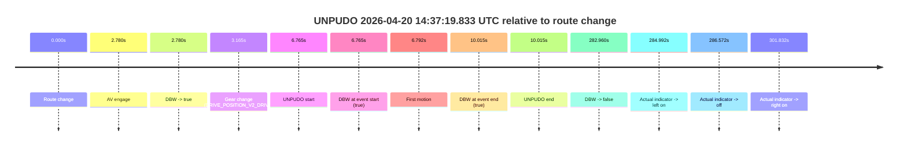
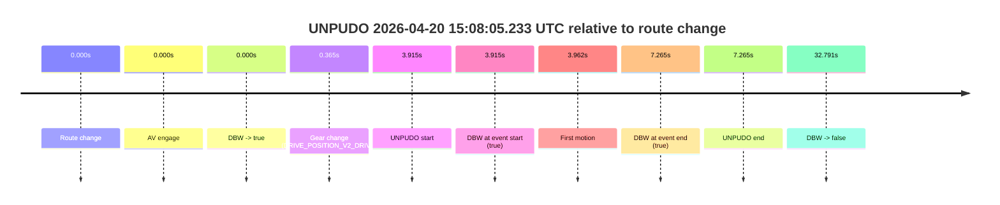
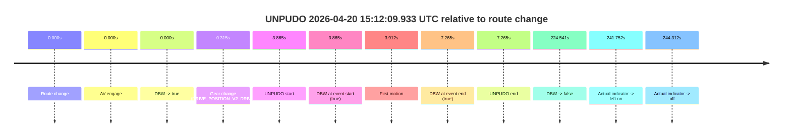
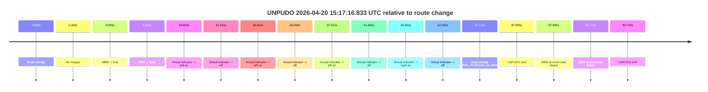
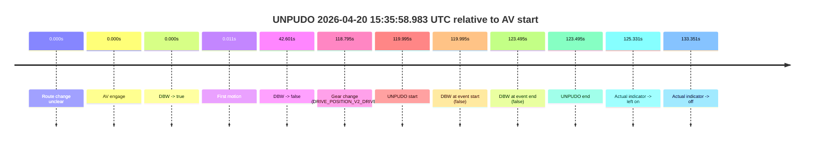
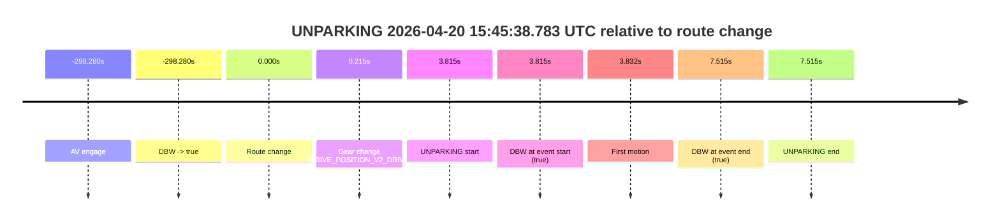

# Run Report: fme20038/2026-04-20--14-29-25--gen2-av-b8c3ecc9-d0ee-4a65-a4e6-e2fb1efde5f2

| Field | Value |
|---|---|
| Run ID | `fme20038/2026-04-20--14-29-25--gen2-av-b8c3ecc9-d0ee-4a65-a4e6-e2fb1efde5f2` |
| Date | `2026-04-20` |
| Model(s) | `eel-teal-outspoken` |
| Author | `zak` |
| Event count | `9` |

## unpudo 2026-04-20 14:37:19.833 UTC

| Field | Value |
|---|---|
| Model | `eel-teal-outspoken` |
| Author | `zak` |
| Run ID | `fme20038/2026-04-20--14-29-25--gen2-av-b8c3ecc9-d0ee-4a65-a4e6-e2fb1efde5f2` |
| Date | `2026-04-20` |
| Time (UTC) | `14:37:19.833` |
| Event type | `unpudo` |
| Disengagement type | `none observed` |
| Route change | `found` |
| Console | [run](https://console.sso.wayve.ai/run/fme20038/2026-04-20--14-29-25--gen2-av-b8c3ecc9-d0ee-4a65-a4e6-e2fb1efde5f2?id=&time-unixus=1776695839833299) |
| Foxglove | [segment](https://app.foxglove.dev/wayve-on-prem/p/prj_0dX18KZdVHg1fmmI/view?ds=foxglove-stream&ds.deviceName=fme20038&ds.start=2026-04-20T14%3A37%3A03.068355Z&ds.end=2026-04-20T14%3A42%3A06.028205Z&layoutId=lay_0e7VD4WIKDQGU73Y&time=2026-04-20T14%3A37%3A19.833299Z) |

### Event card: pass

- Pass: AV owns the credited unpudo from route change through the official unpudo window, the gear state is aligned at the anchor, and the vehicle moves without driver accelerator help in AV.

| Event | Time (UTC) | Delta from route change |
|---|---:|---:|
| Route change | 2026-04-20 14:37:13.068 | `0.000s` |
| AV engage | 2026-04-20 14:37:15.848 | `2.780s` |
| DBW -> true | 2026-04-20 14:37:15.848 | `2.780s` |
| Gear change (DRIVE_POSITION_V2_DRIVE) | 2026-04-20 14:37:16.233 | `3.165s` |
| UNPUDO start | 2026-04-20 14:37:19.833 | `6.765s` |
| DBW at event start (true) | 2026-04-20 14:37:19.833 | `6.765s` |
| First motion | 2026-04-20 14:37:19.859 | `6.792s` |
| DBW at event end (true) | 2026-04-20 14:37:23.083 | `10.015s` |
| UNPUDO end | 2026-04-20 14:37:23.083 | `10.015s` |
| DBW -> false | 2026-04-20 14:41:56.028 | `282.960s` |
| Actual indicator -> left on | 2026-04-20 14:41:58.059 | `284.992s` |
| Actual indicator -> off | 2026-04-20 14:41:59.639 | `286.572s` |
| Actual indicator -> right on | 2026-04-20 14:42:14.899 | `301.832s` |

| Metric | Value |
|---|---|
| Outcome | `pass` |
| Effective failure type | `none` |
| Route change status | `found` |
| DBW at event start | `true` |
| DBW at event end | `true` |
| Predicted gear at AV start | `DRIVE_POSITION_V2_DRIVE` |
| Actual gear at AV start | `DRIVE_POSITION_V2_PARK` |
| Predicted gear at event start | `DRIVE_POSITION_V2_DRIVE` |
| Actual gear at event start | `DRIVE_POSITION_V2_DRIVE` |
| Planned indicator direction | `INDICATORS_STATE_V2_RIGHT_ON` |
| Controller indicator direction | `INDICATORS_STATE_V2_RIGHT_ON` |
| Actual indicator direction | `INDICATORS_STATE_V2_OFF` |
| Actual indicator at maneuver end | `INDICATORS_STATE_V2_OFF` |
| Driver accel help in AV | `false` |
| Driver accel help timestamp | `n/a` |
| Max accel pedal pct in AV | `0.0%` |
| Max brake pedal pct in AV | `8.8%` |
| Max speed mps in AV | `5.272` |
| Success timing baseline | `route change` |
| Route -> AV | `2.780s` |
| AV -> event start | `3.985s` |
| AV -> first motion | `4.012s` |
| Success baseline -> event start | `6.765s` |
| Success baseline -> first motion | `6.792s` |
| AV duration before disengagement | `280.180s` |
| Trajectory waypoint count | `38` |
| Driving-plan step count | `11` |

The scored portion starts from the AV-owned window, not from the pre-AV setup. Route-change search in the stopped pre-event segment was `found`, with the baseline therefore set to route change. At the event anchor the model predicts `DRIVE_POSITION_V2_DRIVE` and the actual gear is `DRIVE_POSITION_V2_DRIVE`. The effective model outcome is `pass` because `the credited unpudo stays AV-owned through the official unpudo window.`

### Resolution

| Field | Value |
|---|---|
| Final outcome | `pass` |
| Do we agree with this label? | `yes` |
| Source disengagement type | `none observed` |
| Resolved effective failure type | `none` |
| Confidence | `high` |

## unpudo 2026-04-20 14:46:59.683 UTC

| Field | Value |
|---|---|
| Model | `eel-teal-outspoken` |
| Author | `zak` |
| Run ID | `fme20038/2026-04-20--14-29-25--gen2-av-b8c3ecc9-d0ee-4a65-a4e6-e2fb1efde5f2` |
| Date | `2026-04-20` |
| Time (UTC) | `14:46:59.683` |
| Event type | `unpudo` |
| Disengagement type | `none observed` |
| Route change | `found` |
| Console | [run](https://console.sso.wayve.ai/run/fme20038/2026-04-20--14-29-25--gen2-av-b8c3ecc9-d0ee-4a65-a4e6-e2fb1efde5f2?id=&time-unixus=1776696419683317) |
| Foxglove | [segment](https://app.foxglove.dev/wayve-on-prem/p/prj_0dX18KZdVHg1fmmI/view?ds=foxglove-stream&ds.deviceName=fme20038&ds.start=2026-04-20T14%3A45%3A22.968780Z&ds.end=2026-04-20T14%3A48%3A30.088838Z&layoutId=lay_0e7VD4WIKDQGU73Y&time=2026-04-20T14%3A46%3A59.683317Z) |

### Event card: pass

- Pass: AV owns the credited unpudo from route change through the official unpudo window, the gear state is aligned at the anchor, and the vehicle moves without driver accelerator help in AV.

| Event | Time (UTC) | Delta from route change |
|---|---:|---:|
| Route change | 2026-04-20 14:45:32.968 | `0.000s` |
| AV engage | 2026-04-20 14:46:55.688 | `82.720s` |
| DBW -> true | 2026-04-20 14:46:55.688 | `82.720s` |
| Gear change (DRIVE_POSITION_V2_DRIVE) | 2026-04-20 14:46:56.183 | `83.215s` |
| UNPUDO start | 2026-04-20 14:46:59.683 | `86.715s` |
| DBW at event start (true) | 2026-04-20 14:46:59.683 | `86.715s` |
| First motion | 2026-04-20 14:46:59.740 | `86.771s` |
| DBW at event end (true) | 2026-04-20 14:47:03.483 | `90.515s` |
| UNPUDO end | 2026-04-20 14:47:03.483 | `90.515s` |
| DBW -> false | 2026-04-20 14:48:20.088 | `167.120s` |
| Actual indicator -> right on | 2026-04-20 14:48:24.919 | `171.951s` |
| Actual indicator -> off | 2026-04-20 14:48:29.879 | `176.911s` |

| Metric | Value |
|---|---|
| Outcome | `pass` |
| Effective failure type | `none` |
| Route change status | `found` |
| DBW at event start | `true` |
| DBW at event end | `true` |
| Predicted gear at AV start | `DRIVE_POSITION_V2_DRIVE` |
| Actual gear at AV start | `DRIVE_POSITION_V2_PARK` |
| Predicted gear at event start | `DRIVE_POSITION_V2_DRIVE` |
| Actual gear at event start | `DRIVE_POSITION_V2_DRIVE` |
| Planned indicator direction | `INDICATORS_STATE_V2_RIGHT_ON` |
| Controller indicator direction | `INDICATORS_STATE_V2_RIGHT_ON` |
| Actual indicator direction | `INDICATORS_STATE_V2_OFF` |
| Actual indicator at maneuver end | `INDICATORS_STATE_V2_OFF` |
| Driver accel help in AV | `false` |
| Driver accel help timestamp | `n/a` |
| Max accel pedal pct in AV | `0.0%` |
| Max brake pedal pct in AV | `8.0%` |
| Max speed mps in AV | `4.831` |
| Success timing baseline | `route change` |
| Route -> AV | `82.720s` |
| AV -> event start | `3.995s` |
| AV -> first motion | `4.052s` |
| Success baseline -> event start | `86.715s` |
| Success baseline -> first motion | `86.771s` |
| AV duration before disengagement | `84.400s` |
| Trajectory waypoint count | `37` |
| Driving-plan step count | `11` |

The scored portion starts from the AV-owned window, not from the pre-AV setup. Route-change search in the stopped pre-event segment was `found`, with the baseline therefore set to route change. At the event anchor the model predicts `DRIVE_POSITION_V2_DRIVE` and the actual gear is `DRIVE_POSITION_V2_DRIVE`. The effective model outcome is `pass` because `the credited unpudo stays AV-owned through the official unpudo window.`

### Resolution

| Field | Value |
|---|---|
| Final outcome | `pass` |
| Do we agree with this label? | `yes` |
| Source disengagement type | `none observed` |
| Resolved effective failure type | `none` |
| Confidence | `high` |

## unpudo 2026-04-20 14:56:28.833 UTC

| Field | Value |
|---|---|
| Model | `eel-teal-outspoken` |
| Author | `zak` |
| Run ID | `fme20038/2026-04-20--14-29-25--gen2-av-b8c3ecc9-d0ee-4a65-a4e6-e2fb1efde5f2` |
| Date | `2026-04-20` |
| Time (UTC) | `14:56:28.833` |
| Event type | `unpudo` |
| Disengagement type | `none observed` |
| Route change | `found` |
| Console | [run](https://console.sso.wayve.ai/run/fme20038/2026-04-20--14-29-25--gen2-av-b8c3ecc9-d0ee-4a65-a4e6-e2fb1efde5f2?id=&time-unixus=1776696988833311) |
| Foxglove | [segment](https://app.foxglove.dev/wayve-on-prem/p/prj_0dX18KZdVHg1fmmI/view?ds=foxglove-stream&ds.deviceName=fme20038&ds.start=2026-04-20T14%3A56%3A11.918595Z&ds.end=2026-04-20T14%3A59%3A04.069148Z&layoutId=lay_0e7VD4WIKDQGU73Y&time=2026-04-20T14%3A56%3A28.833311Z) |

### Event card: pass

- Pass: AV owns the credited unpudo from route change through the official unpudo window, the gear state is aligned at the anchor, and the vehicle moves without driver accelerator help in AV.

| Event | Time (UTC) | Delta from route change |
|---|---:|---:|
| Route change | 2026-04-20 14:56:21.918 | `0.000s` |
| AV engage | 2026-04-20 14:56:24.748 | `2.830s` |
| DBW -> true | 2026-04-20 14:56:24.748 | `2.830s` |
| Gear change (DRIVE_POSITION_V2_DRIVE) | 2026-04-20 14:56:25.283 | `3.365s` |
| UNPUDO start | 2026-04-20 14:56:28.833 | `6.915s` |
| DBW at event start (true) | 2026-04-20 14:56:28.833 | `6.915s` |
| First motion | 2026-04-20 14:56:28.860 | `6.942s` |
| DBW at event end (true) | 2026-04-20 14:56:32.183 | `10.265s` |
| UNPUDO end | 2026-04-20 14:56:32.183 | `10.265s` |
| DBW -> false | 2026-04-20 14:58:54.069 | `152.151s` |

| Metric | Value |
|---|---|
| Outcome | `pass` |
| Effective failure type | `none` |
| Route change status | `found` |
| DBW at event start | `true` |
| DBW at event end | `true` |
| Predicted gear at AV start | `DRIVE_POSITION_V2_DRIVE` |
| Actual gear at AV start | `DRIVE_POSITION_V2_PARK` |
| Predicted gear at event start | `DRIVE_POSITION_V2_DRIVE` |
| Actual gear at event start | `DRIVE_POSITION_V2_DRIVE` |
| Planned indicator direction | `INDICATORS_STATE_V2_RIGHT_ON` |
| Controller indicator direction | `INDICATORS_STATE_V2_RIGHT_ON` |
| Actual indicator direction | `INDICATORS_STATE_V2_OFF` |
| Actual indicator at maneuver end | `INDICATORS_STATE_V2_OFF` |
| Driver accel help in AV | `false` |
| Driver accel help timestamp | `n/a` |
| Max accel pedal pct in AV | `0.0%` |
| Max brake pedal pct in AV | `8.0%` |
| Max speed mps in AV | `5.428` |
| Success timing baseline | `route change` |
| Route -> AV | `2.830s` |
| AV -> event start | `4.085s` |
| AV -> first motion | `4.112s` |
| Success baseline -> event start | `6.915s` |
| Success baseline -> first motion | `6.942s` |
| AV duration before disengagement | `149.321s` |
| Trajectory waypoint count | `37` |
| Driving-plan step count | `11` |

The scored portion starts from the AV-owned window, not from the pre-AV setup. Route-change search in the stopped pre-event segment was `found`, with the baseline therefore set to route change. At the event anchor the model predicts `DRIVE_POSITION_V2_DRIVE` and the actual gear is `DRIVE_POSITION_V2_DRIVE`. The effective model outcome is `pass` because `the credited unpudo stays AV-owned through the official unpudo window.`

### Resolution

| Field | Value |
|---|---|
| Final outcome | `pass` |
| Do we agree with this label? | `yes` |
| Source disengagement type | `none observed` |
| Resolved effective failure type | `none` |
| Confidence | `high` |

## unpudo 2026-04-20 15:08:05.233 UTC

| Field | Value |
|---|---|
| Model | `eel-teal-outspoken` |
| Author | `zak` |
| Run ID | `fme20038/2026-04-20--14-29-25--gen2-av-b8c3ecc9-d0ee-4a65-a4e6-e2fb1efde5f2` |
| Date | `2026-04-20` |
| Time (UTC) | `15:08:05.233` |
| Event type | `unpudo` |
| Disengagement type | `none observed` |
| Route change | `found` |
| Console | [run](https://console.sso.wayve.ai/run/fme20038/2026-04-20--14-29-25--gen2-av-b8c3ecc9-d0ee-4a65-a4e6-e2fb1efde5f2?id=&time-unixus=1776697685233307) |
| Foxglove | [segment](https://app.foxglove.dev/wayve-on-prem/p/prj_0dX18KZdVHg1fmmI/view?ds=foxglove-stream&ds.deviceName=fme20038&ds.start=2026-04-20T15%3A07%3A51.318328Z&ds.end=2026-04-20T15%3A08%3A44.108845Z&layoutId=lay_0e7VD4WIKDQGU73Y&time=2026-04-20T15%3A08%3A05.233307Z) |

### Event card: pass

- Pass: AV owns the credited unpudo from route change through the official unpudo window, the gear state is aligned at the anchor, and the vehicle moves without driver accelerator help in AV.

| Event | Time (UTC) | Delta from route change |
|---|---:|---:|
| Route change | 2026-04-20 15:08:01.318 | `0.000s` |
| AV engage | 2026-04-20 15:08:01.318 | `0.000s` |
| DBW -> true | 2026-04-20 15:08:01.318 | `0.000s` |
| Gear change (DRIVE_POSITION_V2_DRIVE) | 2026-04-20 15:08:01.683 | `0.365s` |
| UNPUDO start | 2026-04-20 15:08:05.233 | `3.915s` |
| DBW at event start (true) | 2026-04-20 15:08:05.233 | `3.915s` |
| First motion | 2026-04-20 15:08:05.279 | `3.962s` |
| DBW at event end (true) | 2026-04-20 15:08:08.583 | `7.265s` |
| UNPUDO end | 2026-04-20 15:08:08.583 | `7.265s` |
| DBW -> false | 2026-04-20 15:08:34.108 | `32.791s` |

| Metric | Value |
|---|---|
| Outcome | `pass` |
| Effective failure type | `none` |
| Route change status | `found` |
| DBW at event start | `true` |
| DBW at event end | `true` |
| Predicted gear at AV start | `DRIVE_POSITION_V2_PARK` |
| Actual gear at AV start | `DRIVE_POSITION_V2_PARK` |
| Predicted gear at event start | `DRIVE_POSITION_V2_DRIVE` |
| Actual gear at event start | `DRIVE_POSITION_V2_DRIVE` |
| Planned indicator direction | `INDICATORS_STATE_V2_LEFT_ON` |
| Controller indicator direction | `INDICATORS_STATE_V2_LEFT_ON` |
| Actual indicator direction | `INDICATORS_STATE_V2_OFF` |
| Actual indicator at maneuver end | `INDICATORS_STATE_V2_OFF` |
| Driver accel help in AV | `false` |
| Driver accel help timestamp | `n/a` |
| Max accel pedal pct in AV | `0.0%` |
| Max brake pedal pct in AV | `8.0%` |
| Max speed mps in AV | `4.997` |
| Success timing baseline | `route change` |
| Route -> AV | `0.000s` |
| AV -> event start | `3.915s` |
| AV -> first motion | `3.962s` |
| Success baseline -> event start | `3.915s` |
| Success baseline -> first motion | `3.962s` |
| AV duration before disengagement | `32.790s` |
| Trajectory waypoint count | `36` |
| Driving-plan step count | `11` |

The scored portion starts from the AV-owned window, not from the pre-AV setup. Route-change search in the stopped pre-event segment was `found`, with the baseline therefore set to route change. At the event anchor the model predicts `DRIVE_POSITION_V2_DRIVE` and the actual gear is `DRIVE_POSITION_V2_DRIVE`. The effective model outcome is `pass` because `the credited unpudo stays AV-owned through the official unpudo window.`

### Resolution

| Field | Value |
|---|---|
| Final outcome | `pass` |
| Do we agree with this label? | `yes` |
| Source disengagement type | `none observed` |
| Resolved effective failure type | `none` |
| Confidence | `high` |

## unpudo 2026-04-20 15:12:09.933 UTC

| Field | Value |
|---|---|
| Model | `eel-teal-outspoken` |
| Author | `zak` |
| Run ID | `fme20038/2026-04-20--14-29-25--gen2-av-b8c3ecc9-d0ee-4a65-a4e6-e2fb1efde5f2` |
| Date | `2026-04-20` |
| Time (UTC) | `15:12:09.933` |
| Event type | `unpudo` |
| Disengagement type | `none observed` |
| Route change | `found` |
| Console | [run](https://console.sso.wayve.ai/run/fme20038/2026-04-20--14-29-25--gen2-av-b8c3ecc9-d0ee-4a65-a4e6-e2fb1efde5f2?id=&time-unixus=1776697929933321) |
| Foxglove | [segment](https://app.foxglove.dev/wayve-on-prem/p/prj_0dX18KZdVHg1fmmI/view?ds=foxglove-stream&ds.deviceName=fme20038&ds.start=2026-04-20T15%3A11%3A56.068280Z&ds.end=2026-04-20T15%3A16%3A00.609608Z&layoutId=lay_0e7VD4WIKDQGU73Y&time=2026-04-20T15%3A12%3A09.933321Z) |

### Event card: pass

- Pass: AV owns the credited unpudo from route change through the official unpudo window, the gear state is aligned at the anchor, and the vehicle moves without driver accelerator help in AV.

| Event | Time (UTC) | Delta from route change |
|---|---:|---:|
| Route change | 2026-04-20 15:12:06.068 | `0.000s` |
| AV engage | 2026-04-20 15:12:06.068 | `0.000s` |
| DBW -> true | 2026-04-20 15:12:06.068 | `0.000s` |
| Gear change (DRIVE_POSITION_V2_DRIVE) | 2026-04-20 15:12:06.383 | `0.315s` |
| UNPUDO start | 2026-04-20 15:12:09.933 | `3.865s` |
| DBW at event start (true) | 2026-04-20 15:12:09.933 | `3.865s` |
| First motion | 2026-04-20 15:12:09.980 | `3.912s` |
| DBW at event end (true) | 2026-04-20 15:12:13.333 | `7.265s` |
| UNPUDO end | 2026-04-20 15:12:13.333 | `7.265s` |
| DBW -> false | 2026-04-20 15:15:50.609 | `224.541s` |
| Actual indicator -> left on | 2026-04-20 15:16:07.820 | `241.752s` |
| Actual indicator -> off | 2026-04-20 15:16:10.380 | `244.312s` |

| Metric | Value |
|---|---|
| Outcome | `pass` |
| Effective failure type | `none` |
| Route change status | `found` |
| DBW at event start | `true` |
| DBW at event end | `true` |
| Predicted gear at AV start | `DRIVE_POSITION_V2_PARK` |
| Actual gear at AV start | `DRIVE_POSITION_V2_PARK` |
| Predicted gear at event start | `DRIVE_POSITION_V2_DRIVE` |
| Actual gear at event start | `DRIVE_POSITION_V2_DRIVE` |
| Planned indicator direction | `INDICATORS_STATE_V2_RIGHT_ON` |
| Controller indicator direction | `INDICATORS_STATE_V2_RIGHT_ON` |
| Actual indicator direction | `INDICATORS_STATE_V2_OFF` |
| Actual indicator at maneuver end | `INDICATORS_STATE_V2_OFF` |
| Driver accel help in AV | `false` |
| Driver accel help timestamp | `n/a` |
| Max accel pedal pct in AV | `0.0%` |
| Max brake pedal pct in AV | `8.0%` |
| Max speed mps in AV | `5.228` |
| Success timing baseline | `route change` |
| Route -> AV | `0.000s` |
| AV -> event start | `3.865s` |
| AV -> first motion | `3.912s` |
| Success baseline -> event start | `3.865s` |
| Success baseline -> first motion | `3.912s` |
| AV duration before disengagement | `224.541s` |
| Trajectory waypoint count | `38` |
| Driving-plan step count | `11` |

The scored portion starts from the AV-owned window, not from the pre-AV setup. Route-change search in the stopped pre-event segment was `found`, with the baseline therefore set to route change. At the event anchor the model predicts `DRIVE_POSITION_V2_DRIVE` and the actual gear is `DRIVE_POSITION_V2_DRIVE`. The effective model outcome is `pass` because `the credited unpudo stays AV-owned through the official unpudo window.`

### Resolution

| Field | Value |
|---|---|
| Final outcome | `pass` |
| Do we agree with this label? | `yes` |
| Source disengagement type | `none observed` |
| Resolved effective failure type | `none` |
| Confidence | `high` |

## unpudo 2026-04-20 15:17:16.833 UTC

| Field | Value |
|---|---|
| Model | `eel-teal-outspoken` |
| Author | `zak` |
| Run ID | `fme20038/2026-04-20--14-29-25--gen2-av-b8c3ecc9-d0ee-4a65-a4e6-e2fb1efde5f2` |
| Date | `2026-04-20` |
| Time (UTC) | `15:17:16.833` |
| Event type | `unpudo` |
| Disengagement type | `none observed` |
| Route change | `found` |
| Console | [run](https://console.sso.wayve.ai/run/fme20038/2026-04-20--14-29-25--gen2-av-b8c3ecc9-d0ee-4a65-a4e6-e2fb1efde5f2?id=&time-unixus=1776698236833310) |
| Foxglove | [segment](https://app.foxglove.dev/wayve-on-prem/p/prj_0dX18KZdVHg1fmmI/view?ds=foxglove-stream&ds.deviceName=fme20038&ds.start=2026-04-20T15%3A15%3A38.968292Z&ds.end=2026-04-20T15%3A17%3A31.683295Z&layoutId=lay_0e7VD4WIKDQGU73Y&time=2026-04-20T15%3A17%3A16.833310Z) |

### Event card: accidental

- Accidental: AV ownership is present for less than `2s`, so this is treated as an accidental brush with the maneuver rather than a meaningful model attempt.

| Event | Time (UTC) | Delta from route change |
|---|---:|---:|
| Route change | 2026-04-20 15:15:48.968 | `0.000s` |
| AV engage | 2026-04-20 15:15:48.968 | `0.000s` |
| DBW -> true | 2026-04-20 15:15:48.968 | `0.000s` |
| DBW -> false | 2026-04-20 15:15:50.609 | `1.641s` |
| Actual indicator -> left on | 2026-04-20 15:16:07.820 | `18.852s` |
| Actual indicator -> off | 2026-04-20 15:16:10.380 | `21.412s` |
| Actual indicator -> left on | 2026-04-20 15:16:21.980 | `33.012s` |
| Actual indicator -> off | 2026-04-20 15:16:25.059 | `36.092s` |
| Actual indicator -> left on | 2026-04-20 15:16:26.580 | `37.612s` |
| Actual indicator -> off | 2026-04-20 15:16:30.459 | `41.492s` |
| Actual indicator -> right on | 2026-04-20 15:16:32.019 | `43.052s` |
| Actual indicator -> off | 2026-04-20 15:16:40.999 | `52.032s` |
| Gear change (DRIVE_POSITION_V2_DRIVE) | 2026-04-20 15:17:03.683 | `74.715s` |
| UNPUDO start | 2026-04-20 15:17:16.833 | `87.865s` |
| DBW at event start (false) | 2026-04-20 15:17:16.833 | `87.865s` |
| DBW at event end (false) | 2026-04-20 15:17:21.683 | `92.715s` |
| UNPUDO end | 2026-04-20 15:17:21.683 | `92.715s` |

| Metric | Value |
|---|---|
| Outcome | `accidental` |
| Effective failure type | `none` |
| Route change status | `found` |
| DBW at event start | `false` |
| DBW at event end | `false` |
| Predicted gear at AV start | `DRIVE_POSITION_V2_PARK` |
| Actual gear at AV start | `DRIVE_POSITION_V2_PARK` |
| Predicted gear at event start | `DRIVE_POSITION_V2_DRIVE` |
| Actual gear at event start | `DRIVE_POSITION_V2_DRIVE` |
| Planned indicator direction | `INDICATORS_STATE_V2_OFF` |
| Controller indicator direction | `INDICATORS_STATE_V2_OFF` |
| Actual indicator direction | `INDICATORS_STATE_V2_OFF` |
| Actual indicator at maneuver end | `INDICATORS_STATE_V2_OFF` |
| Driver accel help in AV | `false` |
| Driver accel help timestamp | `n/a` |
| Max accel pedal pct in AV | `0.0%` |
| Max brake pedal pct in AV | `8.1%` |
| Max speed mps in AV | `0.000` |
| Success timing baseline | `route change` |
| Route -> AV | `0.000s` |
| AV -> event start | `87.865s` |
| AV -> first motion | `n/a` |
| Success baseline -> event start | `87.865s` |
| Success baseline -> first motion | `n/a` |
| AV duration before disengagement | `1.641s` |
| Trajectory waypoint count | `38` |
| Driving-plan step count | `11` |

The scored portion starts from the AV-owned window, not from the pre-AV setup. Route-change search in the stopped pre-event segment was `found`, with the baseline therefore set to route change. At the event anchor the model predicts `DRIVE_POSITION_V2_DRIVE` and the actual gear is `DRIVE_POSITION_V2_DRIVE`. The effective model outcome is `accidental` because `the AV-owned portion is shorter than 2s.`

### Resolution

| Field | Value |
|---|---|
| Final outcome | `accidental` |
| Do we agree with this label? | `yes` |
| Source disengagement type | `none observed` |
| Resolved effective failure type | `none` |
| Confidence | `high` |

## unpudo 2026-04-20 15:33:37.883 UTC

| Field | Value |
|---|---|
| Model | `eel-teal-outspoken` |
| Author | `zak` |
| Run ID | `fme20038/2026-04-20--14-29-25--gen2-av-b8c3ecc9-d0ee-4a65-a4e6-e2fb1efde5f2` |
| Date | `2026-04-20` |
| Time (UTC) | `15:33:37.883` |
| Event type | `unpudo` |
| Disengagement type | `none observed` |
| Route change | `found` |
| Console | [run](https://console.sso.wayve.ai/run/fme20038/2026-04-20--14-29-25--gen2-av-b8c3ecc9-d0ee-4a65-a4e6-e2fb1efde5f2?id=&time-unixus=1776699217883302) |
| Foxglove | [segment](https://app.foxglove.dev/wayve-on-prem/p/prj_0dX18KZdVHg1fmmI/view?ds=foxglove-stream&ds.deviceName=fme20038&ds.start=2026-04-20T15%3A33%3A12.268287Z&ds.end=2026-04-20T15%3A34%3A51.589577Z&layoutId=lay_0e7VD4WIKDQGU73Y&time=2026-04-20T15%3A33%3A37.883302Z) |

### Event card: pass

- Pass: AV owns the credited unpudo from route change through the official unpudo window, the gear state is aligned at the anchor, and the vehicle moves without driver accelerator help in AV.

| Event | Time (UTC) | Delta from route change |
|---|---:|---:|
| Route change | 2026-04-20 15:33:22.268 | `0.000s` |
| AV engage | 2026-04-20 15:33:33.788 | `11.520s` |
| DBW -> true | 2026-04-20 15:33:33.788 | `11.520s` |
| Gear change (DRIVE_POSITION_V2_DRIVE) | 2026-04-20 15:33:34.333 | `12.065s` |
| UNPUDO start | 2026-04-20 15:33:37.883 | `15.615s` |
| DBW at event start (true) | 2026-04-20 15:33:37.883 | `15.615s` |
| First motion | 2026-04-20 15:33:37.920 | `15.652s` |
| DBW at event end (true) | 2026-04-20 15:33:41.233 | `18.965s` |
| UNPUDO end | 2026-04-20 15:33:41.233 | `18.965s` |
| DBW -> false | 2026-04-20 15:34:41.589 | `79.321s` |

| Metric | Value |
|---|---|
| Outcome | `pass` |
| Effective failure type | `none` |
| Route change status | `found` |
| DBW at event start | `true` |
| DBW at event end | `true` |
| Predicted gear at AV start | `DRIVE_POSITION_V2_DRIVE` |
| Actual gear at AV start | `DRIVE_POSITION_V2_PARK` |
| Predicted gear at event start | `DRIVE_POSITION_V2_DRIVE` |
| Actual gear at event start | `DRIVE_POSITION_V2_DRIVE` |
| Planned indicator direction | `INDICATORS_STATE_V2_RIGHT_ON` |
| Controller indicator direction | `INDICATORS_STATE_V2_RIGHT_ON` |
| Actual indicator direction | `INDICATORS_STATE_V2_OFF` |
| Actual indicator at maneuver end | `INDICATORS_STATE_V2_OFF` |
| Driver accel help in AV | `false` |
| Driver accel help timestamp | `n/a` |
| Max accel pedal pct in AV | `0.0%` |
| Max brake pedal pct in AV | `8.0%` |
| Max speed mps in AV | `5.006` |
| Success timing baseline | `route change` |
| Route -> AV | `11.520s` |
| AV -> event start | `4.095s` |
| AV -> first motion | `4.132s` |
| Success baseline -> event start | `15.615s` |
| Success baseline -> first motion | `15.652s` |
| AV duration before disengagement | `67.801s` |
| Trajectory waypoint count | `37` |
| Driving-plan step count | `11` |

The scored portion starts from the AV-owned window, not from the pre-AV setup. Route-change search in the stopped pre-event segment was `found`, with the baseline therefore set to route change. At the event anchor the model predicts `DRIVE_POSITION_V2_DRIVE` and the actual gear is `DRIVE_POSITION_V2_DRIVE`. The effective model outcome is `pass` because `the credited unpudo stays AV-owned through the official unpudo window.`

### Resolution

| Field | Value |
|---|---|
| Final outcome | `pass` |
| Do we agree with this label? | `yes` |
| Source disengagement type | `none observed` |
| Resolved effective failure type | `none` |
| Confidence | `high` |

## unpudo 2026-04-20 15:35:58.983 UTC

| Field | Value |
|---|---|
| Model | `eel-teal-outspoken` |
| Author | `zak` |
| Run ID | `fme20038/2026-04-20--14-29-25--gen2-av-b8c3ecc9-d0ee-4a65-a4e6-e2fb1efde5f2` |
| Date | `2026-04-20` |
| Time (UTC) | `15:35:58.983` |
| Event type | `unpudo` |
| Disengagement type | `none observed` |
| Route change | `unclear` |
| Console | [run](https://console.sso.wayve.ai/run/fme20038/2026-04-20--14-29-25--gen2-av-b8c3ecc9-d0ee-4a65-a4e6-e2fb1efde5f2?id=&time-unixus=1776699358983323) |
| Foxglove | [segment](https://app.foxglove.dev/wayve-on-prem/p/prj_0dX18KZdVHg1fmmI/view?ds=foxglove-stream&ds.deviceName=fme20038&ds.start=2026-04-20T15%3A33%3A48.988665Z&ds.end=2026-04-20T15%3A36%3A12.483317Z&layoutId=lay_0e7VD4WIKDQGU73Y&time=2026-04-20T15%3A35%3A58.983323Z) |

### Event card: fail

- Fail: the credited unpudo does not stay AV-owned. The event window starts with DBW false, and the maneuver outcome lands outside a clean AV-owned segment.

| Event | Time (UTC) | Delta from AV start |
|---|---:|---:|
| Route change unclear | 2026-04-20 15:33:58.988 | `0.000s` |
| AV engage | 2026-04-20 15:33:58.988 | `0.000s` |
| DBW -> true | 2026-04-20 15:33:58.988 | `0.000s` |
| First motion | 2026-04-20 15:33:59.000 | `0.011s` |
| DBW -> false | 2026-04-20 15:34:41.589 | `42.601s` |
| Gear change (DRIVE_POSITION_V2_DRIVE) | 2026-04-20 15:35:57.783 | `118.795s` |
| UNPUDO start | 2026-04-20 15:35:58.983 | `119.995s` |
| DBW at event start (false) | 2026-04-20 15:35:58.983 | `119.995s` |
| DBW at event end (false) | 2026-04-20 15:36:02.483 | `123.495s` |
| UNPUDO end | 2026-04-20 15:36:02.483 | `123.495s` |
| Actual indicator -> left on | 2026-04-20 15:36:04.319 | `125.331s` |
| Actual indicator -> off | 2026-04-20 15:36:12.340 | `133.351s` |

| Metric | Value |
|---|---|
| Outcome | `fail` |
| Effective failure type | `not_av_owned` |
| Route change status | `unclear` |
| DBW at event start | `false` |
| DBW at event end | `false` |
| Predicted gear at AV start | `DRIVE_POSITION_V2_DRIVE` |
| Actual gear at AV start | `DRIVE_POSITION_V2_DRIVE` |
| Predicted gear at event start | `DRIVE_POSITION_V2_DRIVE` |
| Actual gear at event start | `DRIVE_POSITION_V2_DRIVE` |
| Planned indicator direction | `INDICATORS_STATE_V2_RIGHT_ON` |
| Controller indicator direction | `INDICATORS_STATE_V2_RIGHT_ON` |
| Actual indicator direction | `INDICATORS_STATE_V2_OFF` |
| Actual indicator at maneuver end | `INDICATORS_STATE_V2_OFF` |
| Driver accel help in AV | `false` |
| Driver accel help timestamp | `n/a` |
| Max accel pedal pct in AV | `0.0%` |
| Max brake pedal pct in AV | `0.0%` |
| Max speed mps in AV | `7.681` |
| Success timing baseline | `AV start` |
| Route -> AV | `n/a` |
| AV -> event start | `119.995s` |
| AV -> first motion | `0.011s` |
| Success baseline -> event start | `119.995s` |
| Success baseline -> first motion | `0.011s` |
| AV duration before disengagement | `42.601s` |
| Trajectory waypoint count | `37` |
| Driving-plan step count | `11` |

The scored portion starts from the AV-owned window, not from the pre-AV setup. Route-change search in the stopped pre-event segment was `unclear`, with the baseline therefore set to AV start. At the event anchor the model predicts `DRIVE_POSITION_V2_DRIVE` and the actual gear is `DRIVE_POSITION_V2_DRIVE`. The effective model outcome is `fail` because `not_av_owned.`

### Resolution

| Field | Value |
|---|---|
| Final outcome | `fail` |
| Do we agree with this label? | `yes` |
| Source disengagement type | `none observed` |
| Resolved effective failure type | `not_av_owned` |
| Confidence | `medium` |

## unparking 2026-04-20 15:45:38.783 UTC

| Field | Value |
|---|---|
| Model | `eel-teal-outspoken` |
| Author | `zak` |
| Run ID | `fme20038/2026-04-20--14-29-25--gen2-av-b8c3ecc9-d0ee-4a65-a4e6-e2fb1efde5f2` |
| Date | `2026-04-20` |
| Time (UTC) | `15:45:38.783` |
| Event type | `unparking` |
| Disengagement type | `none observed` |
| Route change | `found` |
| Console | [run](https://console.sso.wayve.ai/run/fme20038/2026-04-20--14-29-25--gen2-av-b8c3ecc9-d0ee-4a65-a4e6-e2fb1efde5f2?id=&time-unixus=1776699938783306) |
| Foxglove | [segment](https://app.foxglove.dev/wayve-on-prem/p/prj_0dX18KZdVHg1fmmI/view?ds=foxglove-stream&ds.deviceName=fme20038&ds.start=2026-04-20T15%3A40%3A26.688763Z&ds.end=2026-04-20T15%3A45%3A52.483304Z&layoutId=lay_0e7VD4WIKDQGU73Y&time=2026-04-20T15%3A45%3A38.783306Z) |

### Event card: pass

- Pass: AV owns the credited unparking through the official event window, the gear state is aligned at the anchor, and the vehicle moves without driver accelerator help in AV.

| Event | Time (UTC) | Delta from route change |
|---|---:|---:|
| AV engage | 2026-04-20 15:40:36.688 | `-298.280s` |
| DBW -> true | 2026-04-20 15:40:36.688 | `-298.280s` |
| Route change | 2026-04-20 15:45:34.968 | `0.000s` |
| Gear change (DRIVE_POSITION_V2_DRIVE) | 2026-04-20 15:45:35.183 | `0.215s` |
| UNPARKING start | 2026-04-20 15:45:38.783 | `3.815s` |
| DBW at event start (true) | 2026-04-20 15:45:38.783 | `3.815s` |
| First motion | 2026-04-20 15:45:38.800 | `3.832s` |
| DBW at event end (true) | 2026-04-20 15:45:42.483 | `7.515s` |
| UNPARKING end | 2026-04-20 15:45:42.483 | `7.515s` |

| Metric | Value |
|---|---|
| Outcome | `pass` |
| Effective failure type | `none` |
| Route change status | `found` |
| DBW at event start | `true` |
| DBW at event end | `true` |
| Predicted gear at AV start | `DRIVE_POSITION_V2_DRIVE` |
| Actual gear at AV start | `DRIVE_POSITION_V2_DRIVE` |
| Predicted gear at event start | `DRIVE_POSITION_V2_DRIVE` |
| Actual gear at event start | `DRIVE_POSITION_V2_DRIVE` |
| Planned indicator direction | `INDICATORS_STATE_V2_RIGHT_ON` |
| Controller indicator direction | `INDICATORS_STATE_V2_RIGHT_ON` |
| Actual indicator direction | `INDICATORS_STATE_V2_OFF` |
| Actual indicator at maneuver end | `INDICATORS_STATE_V2_OFF` |
| Driver accel help in AV | `false` |
| Driver accel help timestamp | `n/a` |
| Max accel pedal pct in AV | `0.0%` |
| Max brake pedal pct in AV | `0.0%` |
| Max speed mps in AV | `3.608` |
| Success timing baseline | `AV start` |
| Route -> AV | `-298.280s` |
| AV -> event start | `302.095s` |
| AV -> first motion | `302.112s` |
| Success baseline -> event start | `302.095s` |
| Success baseline -> first motion | `302.112s` |
| AV duration before disengagement | `n/a` |
| Trajectory waypoint count | `36` |
| Driving-plan step count | `11` |

The scored portion starts from the AV-owned window, not from the pre-AV setup. Route-change search in the stopped pre-event segment was `found`, with the baseline therefore set to route change. At the event anchor the model predicts `DRIVE_POSITION_V2_DRIVE` and the actual gear is `DRIVE_POSITION_V2_DRIVE`. The effective model outcome is `pass` because `the credited maneuver stays AV-owned through the official event end.`

### Resolution

| Field | Value |
|---|---|
| Final outcome | `pass` |
| Do we agree with this label? | `yes` |
| Source disengagement type | `none observed` |
| Resolved effective failure type | `none` |
| Confidence | `high` |
