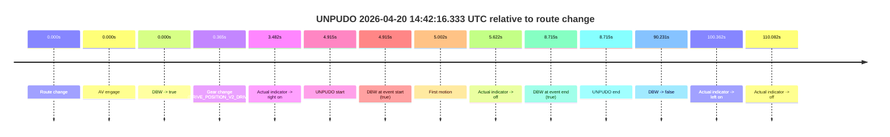
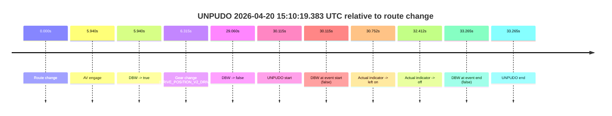
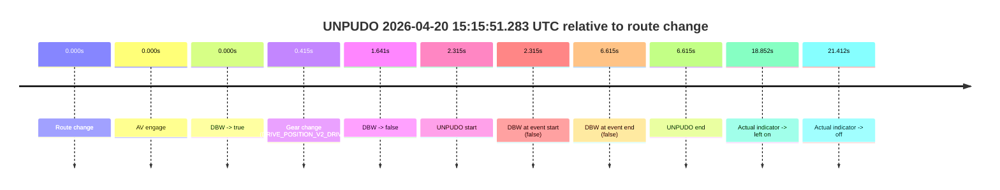
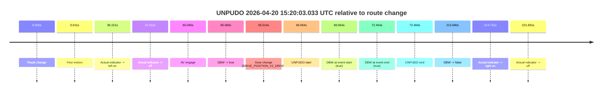
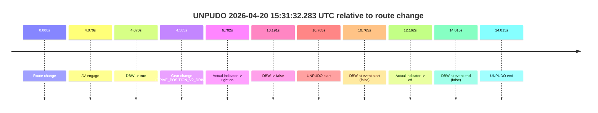
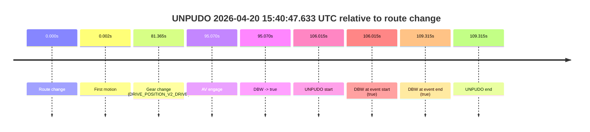

# Run Report: fme20038/2026-04-20--14-29-25--gen2-av-b8c3ecc9-d0ee-4a65-a4e6-e2fb1efde5f2

| Field | Value |
|---|---|
| Run ID | `fme20038/2026-04-20--14-29-25--gen2-av-b8c3ecc9-d0ee-4a65-a4e6-e2fb1efde5f2` |
| Date | `2026-04-20` |
| Model(s) | `pink-manta-ray-smooth` |
| Author | `guy.geva` |
| Event count | `6` |

## unpudo 2026-04-20 14:42:16.333 UTC

| Field | Value |
|---|---|
| Model | `pink-manta-ray-smooth` |
| Author | `guy.geva` |
| Run ID | `fme20038/2026-04-20--14-29-25--gen2-av-b8c3ecc9-d0ee-4a65-a4e6-e2fb1efde5f2` |
| Date | `2026-04-20` |
| Time (UTC) | `14:42:16.333` |
| Event type | `unpudo` |
| Disengagement type | `none observed` |
| Route change | `found` |
| Console | [run](https://console.sso.wayve.ai/run/fme20038/2026-04-20--14-29-25--gen2-av-b8c3ecc9-d0ee-4a65-a4e6-e2fb1efde5f2?id=&time-unixus=1776696136333314) |
| Foxglove | [segment](https://app.foxglove.dev/wayve-on-prem/p/prj_0dX18KZdVHg1fmmI/view?ds=foxglove-stream&ds.deviceName=fme20038&ds.start=2026-04-20T14%3A42%3A01.418286Z&ds.end=2026-04-20T14%3A43%3A51.649486Z&layoutId=lay_0e7VD4WIKDQGU73Y&time=2026-04-20T14%3A42%3A16.333314Z) |

### Event card: pass

- Pass: AV owns the credited unpudo from route change through the official unpudo window, the gear state is aligned at the anchor, and the vehicle moves without driver accelerator help in AV.

| Event | Time (UTC) | Delta from route change |
|---|---:|---:|
| Route change | 2026-04-20 14:42:11.418 | `0.000s` |
| AV engage | 2026-04-20 14:42:11.418 | `0.000s` |
| DBW -> true | 2026-04-20 14:42:11.418 | `0.000s` |
| Gear change (DRIVE_POSITION_V2_DRIVE) | 2026-04-20 14:42:11.783 | `0.365s` |
| Actual indicator -> right on | 2026-04-20 14:42:14.899 | `3.482s` |
| UNPUDO start | 2026-04-20 14:42:16.333 | `4.915s` |
| DBW at event start (true) | 2026-04-20 14:42:16.333 | `4.915s` |
| First motion | 2026-04-20 14:42:16.420 | `5.002s` |
| Actual indicator -> off | 2026-04-20 14:42:17.039 | `5.622s` |
| DBW at event end (true) | 2026-04-20 14:42:20.133 | `8.715s` |
| UNPUDO end | 2026-04-20 14:42:20.133 | `8.715s` |
| DBW -> false | 2026-04-20 14:43:41.649 | `90.231s` |
| Actual indicator -> left on | 2026-04-20 14:43:51.780 | `100.362s` |
| Actual indicator -> off | 2026-04-20 14:44:01.500 | `110.082s` |

| Metric | Value |
|---|---|
| Outcome | `pass` |
| Effective failure type | `none` |
| Route change status | `found` |
| DBW at event start | `true` |
| DBW at event end | `true` |
| Predicted gear at AV start | `DRIVE_POSITION_V2_PARK` |
| Actual gear at AV start | `DRIVE_POSITION_V2_PARK` |
| Predicted gear at event start | `DRIVE_POSITION_V2_DRIVE` |
| Actual gear at event start | `DRIVE_POSITION_V2_DRIVE` |
| Planned indicator direction | `INDICATORS_STATE_V2_RIGHT_ON` |
| Controller indicator direction | `INDICATORS_STATE_V2_RIGHT_ON` |
| Actual indicator direction | `INDICATORS_STATE_V2_RIGHT_ON` |
| Actual indicator at maneuver end | `INDICATORS_STATE_V2_OFF` |
| Driver accel help in AV | `false` |
| Driver accel help timestamp | `n/a` |
| Max accel pedal pct in AV | `0.0%` |
| Max brake pedal pct in AV | `8.0%` |
| Max speed mps in AV | `4.239` |
| Success timing baseline | `route change` |
| Route -> AV | `0.000s` |
| AV -> event start | `4.915s` |
| AV -> first motion | `5.002s` |
| Success baseline -> event start | `4.915s` |
| Success baseline -> first motion | `5.002s` |
| AV duration before disengagement | `90.231s` |
| Trajectory waypoint count | `36` |
| Driving-plan step count | `11` |

The scored portion starts from the AV-owned window, not from the pre-AV setup. Route-change search in the stopped pre-event segment was `found`, with the baseline therefore set to route change. At the event anchor the model predicts `DRIVE_POSITION_V2_DRIVE` and the actual gear is `DRIVE_POSITION_V2_DRIVE`. The effective model outcome is `pass` because `the credited unpudo stays AV-owned through the official unpudo window.`

### Resolution

| Field | Value |
|---|---|
| Final outcome | `pass` |
| Do we agree with this label? | `yes` |
| Source disengagement type | `none observed` |
| Resolved effective failure type | `none` |
| Confidence | `high` |

## unpudo 2026-04-20 15:10:19.383 UTC

| Field | Value |
|---|---|
| Model | `pink-manta-ray-smooth` |
| Author | `guy.geva` |
| Run ID | `fme20038/2026-04-20--14-29-25--gen2-av-b8c3ecc9-d0ee-4a65-a4e6-e2fb1efde5f2` |
| Date | `2026-04-20` |
| Time (UTC) | `15:10:19.383` |
| Event type | `unpudo` |
| Disengagement type | `none observed` |
| Route change | `found` |
| Console | [run](https://console.sso.wayve.ai/run/fme20038/2026-04-20--14-29-25--gen2-av-b8c3ecc9-d0ee-4a65-a4e6-e2fb1efde5f2?id=&time-unixus=1776697819383313) |
| Foxglove | [segment](https://app.foxglove.dev/wayve-on-prem/p/prj_0dX18KZdVHg1fmmI/view?ds=foxglove-stream&ds.deviceName=fme20038&ds.start=2026-04-20T15%3A09%3A39.268305Z&ds.end=2026-04-20T15%3A10%3A32.533303Z&layoutId=lay_0e7VD4WIKDQGU73Y&time=2026-04-20T15%3A10%3A19.383313Z) |

### Event card: fail

- Fail: the credited unpudo does not stay AV-owned. The event window starts with DBW false, and the maneuver outcome lands outside a clean AV-owned segment.

| Event | Time (UTC) | Delta from route change |
|---|---:|---:|
| Route change | 2026-04-20 15:09:49.268 | `0.000s` |
| AV engage | 2026-04-20 15:09:55.208 | `5.940s` |
| DBW -> true | 2026-04-20 15:09:55.208 | `5.940s` |
| Gear change (DRIVE_POSITION_V2_DRIVE) | 2026-04-20 15:09:55.583 | `6.315s` |
| DBW -> false | 2026-04-20 15:10:18.328 | `29.060s` |
| UNPUDO start | 2026-04-20 15:10:19.383 | `30.115s` |
| DBW at event start (false) | 2026-04-20 15:10:19.383 | `30.115s` |
| Actual indicator -> left on | 2026-04-20 15:10:20.020 | `30.752s` |
| Actual indicator -> off | 2026-04-20 15:10:21.680 | `32.412s` |
| DBW at event end (false) | 2026-04-20 15:10:22.533 | `33.265s` |
| UNPUDO end | 2026-04-20 15:10:22.533 | `33.265s` |

| Metric | Value |
|---|---|
| Outcome | `fail` |
| Effective failure type | `not_av_owned` |
| Route change status | `found` |
| DBW at event start | `false` |
| DBW at event end | `false` |
| Predicted gear at AV start | `DRIVE_POSITION_V2_DRIVE` |
| Actual gear at AV start | `DRIVE_POSITION_V2_PARK` |
| Predicted gear at event start | `DRIVE_POSITION_V2_DRIVE` |
| Actual gear at event start | `DRIVE_POSITION_V2_DRIVE` |
| Planned indicator direction | `INDICATORS_STATE_V2_LEFT_ON` |
| Controller indicator direction | `INDICATORS_STATE_V2_LEFT_ON` |
| Actual indicator direction | `INDICATORS_STATE_V2_OFF` |
| Actual indicator at maneuver end | `INDICATORS_STATE_V2_OFF` |
| Driver accel help in AV | `false` |
| Driver accel help timestamp | `n/a` |
| Max accel pedal pct in AV | `0.0%` |
| Max brake pedal pct in AV | `8.0%` |
| Max speed mps in AV | `0.000` |
| Success timing baseline | `route change` |
| Route -> AV | `5.940s` |
| AV -> event start | `24.175s` |
| AV -> first motion | `n/a` |
| Success baseline -> event start | `30.115s` |
| Success baseline -> first motion | `n/a` |
| AV duration before disengagement | `23.120s` |
| Trajectory waypoint count | `37` |
| Driving-plan step count | `11` |

The scored portion starts from the AV-owned window, not from the pre-AV setup. Route-change search in the stopped pre-event segment was `found`, with the baseline therefore set to route change. At the event anchor the model predicts `DRIVE_POSITION_V2_DRIVE` and the actual gear is `DRIVE_POSITION_V2_DRIVE`. The effective model outcome is `fail` because `not_av_owned.`

### Resolution

| Field | Value |
|---|---|
| Final outcome | `fail` |
| Do we agree with this label? | `yes` |
| Source disengagement type | `none observed` |
| Resolved effective failure type | `not_av_owned` |
| Confidence | `high` |

## unpudo 2026-04-20 15:15:51.283 UTC

| Field | Value |
|---|---|
| Model | `pink-manta-ray-smooth` |
| Author | `guy.geva` |
| Run ID | `fme20038/2026-04-20--14-29-25--gen2-av-b8c3ecc9-d0ee-4a65-a4e6-e2fb1efde5f2` |
| Date | `2026-04-20` |
| Time (UTC) | `15:15:51.283` |
| Event type | `unpudo` |
| Disengagement type | `none observed` |
| Route change | `found` |
| Console | [run](https://console.sso.wayve.ai/run/fme20038/2026-04-20--14-29-25--gen2-av-b8c3ecc9-d0ee-4a65-a4e6-e2fb1efde5f2?id=&time-unixus=1776698151283291) |
| Foxglove | [segment](https://app.foxglove.dev/wayve-on-prem/p/prj_0dX18KZdVHg1fmmI/view?ds=foxglove-stream&ds.deviceName=fme20038&ds.start=2026-04-20T15%3A15%3A38.968292Z&ds.end=2026-04-20T15%3A16%3A05.583297Z&layoutId=lay_0e7VD4WIKDQGU73Y&time=2026-04-20T15%3A15%3A51.283291Z) |

### Event card: accidental

- Accidental: AV ownership is present for less than `2s`, so this is treated as an accidental brush with the maneuver rather than a meaningful model attempt.

| Event | Time (UTC) | Delta from route change |
|---|---:|---:|
| Route change | 2026-04-20 15:15:48.968 | `0.000s` |
| AV engage | 2026-04-20 15:15:48.968 | `0.000s` |
| DBW -> true | 2026-04-20 15:15:48.968 | `0.000s` |
| Gear change (DRIVE_POSITION_V2_DRIVE) | 2026-04-20 15:15:49.383 | `0.415s` |
| DBW -> false | 2026-04-20 15:15:50.609 | `1.641s` |
| UNPUDO start | 2026-04-20 15:15:51.283 | `2.315s` |
| DBW at event start (false) | 2026-04-20 15:15:51.283 | `2.315s` |
| DBW at event end (false) | 2026-04-20 15:15:55.583 | `6.615s` |
| UNPUDO end | 2026-04-20 15:15:55.583 | `6.615s` |
| Actual indicator -> left on | 2026-04-20 15:16:07.820 | `18.852s` |
| Actual indicator -> off | 2026-04-20 15:16:10.380 | `21.412s` |

| Metric | Value |
|---|---|
| Outcome | `accidental` |
| Effective failure type | `none` |
| Route change status | `found` |
| DBW at event start | `false` |
| DBW at event end | `false` |
| Predicted gear at AV start | `DRIVE_POSITION_V2_PARK` |
| Actual gear at AV start | `DRIVE_POSITION_V2_PARK` |
| Predicted gear at event start | `DRIVE_POSITION_V2_DRIVE` |
| Actual gear at event start | `DRIVE_POSITION_V2_DRIVE` |
| Planned indicator direction | `INDICATORS_STATE_V2_LEFT_ON` |
| Controller indicator direction | `INDICATORS_STATE_V2_LEFT_ON` |
| Actual indicator direction | `INDICATORS_STATE_V2_OFF` |
| Actual indicator at maneuver end | `INDICATORS_STATE_V2_OFF` |
| Driver accel help in AV | `false` |
| Driver accel help timestamp | `n/a` |
| Max accel pedal pct in AV | `0.0%` |
| Max brake pedal pct in AV | `8.1%` |
| Max speed mps in AV | `0.000` |
| Success timing baseline | `route change` |
| Route -> AV | `0.000s` |
| AV -> event start | `2.315s` |
| AV -> first motion | `n/a` |
| Success baseline -> event start | `2.315s` |
| Success baseline -> first motion | `n/a` |
| AV duration before disengagement | `1.641s` |
| Trajectory waypoint count | `37` |
| Driving-plan step count | `11` |

The scored portion starts from the AV-owned window, not from the pre-AV setup. Route-change search in the stopped pre-event segment was `found`, with the baseline therefore set to route change. At the event anchor the model predicts `DRIVE_POSITION_V2_DRIVE` and the actual gear is `DRIVE_POSITION_V2_DRIVE`. The effective model outcome is `accidental` because `the AV-owned portion is shorter than 2s.`

### Resolution

| Field | Value |
|---|---|
| Final outcome | `accidental` |
| Do we agree with this label? | `yes` |
| Source disengagement type | `none observed` |
| Resolved effective failure type | `none` |
| Confidence | `high` |

## unpudo 2026-04-20 15:20:03.033 UTC

| Field | Value |
|---|---|
| Model | `pink-manta-ray-smooth` |
| Author | `guy.geva` |
| Run ID | `fme20038/2026-04-20--14-29-25--gen2-av-b8c3ecc9-d0ee-4a65-a4e6-e2fb1efde5f2` |
| Date | `2026-04-20` |
| Time (UTC) | `15:20:03.033` |
| Event type | `unpudo` |
| Disengagement type | `none observed` |
| Route change | `found` |
| Console | [run](https://console.sso.wayve.ai/run/fme20038/2026-04-20--14-29-25--gen2-av-b8c3ecc9-d0ee-4a65-a4e6-e2fb1efde5f2?id=&time-unixus=1776698403033307) |
| Foxglove | [segment](https://app.foxglove.dev/wayve-on-prem/p/prj_0dX18KZdVHg1fmmI/view?ds=foxglove-stream&ds.deviceName=fme20038&ds.start=2026-04-20T15%3A18%3A43.968873Z&ds.end=2026-04-20T15%3A22%3A37.648477Z&layoutId=lay_0e7VD4WIKDQGU73Y&time=2026-04-20T15%3A20%3A03.033307Z) |

### Event card: pass

- Pass: AV owns the credited unpudo from route change through the official unpudo window, the gear state is aligned at the anchor, and the vehicle moves without driver accelerator help in AV.

| Event | Time (UTC) | Delta from route change |
|---|---:|---:|
| Route change | 2026-04-20 15:18:53.968 | `0.000s` |
| First motion | 2026-04-20 15:18:53.979 | `0.011s` |
| Actual indicator -> left on | 2026-04-20 15:19:30.119 | `36.151s` |
| Actual indicator -> off | 2026-04-20 15:19:31.480 | `37.511s` |
| AV engage | 2026-04-20 15:19:59.028 | `65.060s` |
| DBW -> true | 2026-04-20 15:19:59.028 | `65.060s` |
| Gear change (DRIVE_POSITION_V2_DRIVE) | 2026-04-20 15:19:59.483 | `65.514s` |
| UNPUDO start | 2026-04-20 15:20:03.033 | `69.064s` |
| DBW at event start (true) | 2026-04-20 15:20:03.033 | `69.064s` |
| DBW at event end (true) | 2026-04-20 15:20:06.433 | `72.464s` |
| UNPUDO end | 2026-04-20 15:20:06.433 | `72.464s` |
| DBW -> false | 2026-04-20 15:22:27.648 | `213.680s` |
| Actual indicator -> right on | 2026-04-20 15:22:28.700 | `214.731s` |
| Actual indicator -> off | 2026-04-20 15:22:35.800 | `221.831s` |

| Metric | Value |
|---|---|
| Outcome | `pass` |
| Effective failure type | `none` |
| Route change status | `found` |
| DBW at event start | `true` |
| DBW at event end | `true` |
| Predicted gear at AV start | `DRIVE_POSITION_V2_DRIVE` |
| Actual gear at AV start | `DRIVE_POSITION_V2_PARK` |
| Predicted gear at event start | `DRIVE_POSITION_V2_DRIVE` |
| Actual gear at event start | `DRIVE_POSITION_V2_DRIVE` |
| Planned indicator direction | `INDICATORS_STATE_V2_RIGHT_ON` |
| Controller indicator direction | `INDICATORS_STATE_V2_RIGHT_ON` |
| Actual indicator direction | `INDICATORS_STATE_V2_OFF` |
| Actual indicator at maneuver end | `INDICATORS_STATE_V2_OFF` |
| Driver accel help in AV | `false` |
| Driver accel help timestamp | `n/a` |
| Max accel pedal pct in AV | `0.0%` |
| Max brake pedal pct in AV | `8.0%` |
| Max speed mps in AV | `4.572` |
| Success timing baseline | `route change` |
| Route -> AV | `65.060s` |
| AV -> event start | `4.005s` |
| AV -> first motion | `-65.049s` |
| Success baseline -> event start | `69.064s` |
| Success baseline -> first motion | `0.011s` |
| AV duration before disengagement | `148.620s` |
| Trajectory waypoint count | `36` |
| Driving-plan step count | `11` |

The scored portion starts from the AV-owned window, not from the pre-AV setup. Route-change search in the stopped pre-event segment was `found`, with the baseline therefore set to route change. At the event anchor the model predicts `DRIVE_POSITION_V2_DRIVE` and the actual gear is `DRIVE_POSITION_V2_DRIVE`. The effective model outcome is `pass` because `the credited unpudo stays AV-owned through the official unpudo window.`

### Resolution

| Field | Value |
|---|---|
| Final outcome | `pass` |
| Do we agree with this label? | `yes` |
| Source disengagement type | `none observed` |
| Resolved effective failure type | `none` |
| Confidence | `high` |

## unpudo 2026-04-20 15:31:32.283 UTC

| Field | Value |
|---|---|
| Model | `pink-manta-ray-smooth` |
| Author | `guy.geva` |
| Run ID | `fme20038/2026-04-20--14-29-25--gen2-av-b8c3ecc9-d0ee-4a65-a4e6-e2fb1efde5f2` |
| Date | `2026-04-20` |
| Time (UTC) | `15:31:32.283` |
| Event type | `unpudo` |
| Disengagement type | `none observed` |
| Route change | `found` |
| Console | [run](https://console.sso.wayve.ai/run/fme20038/2026-04-20--14-29-25--gen2-av-b8c3ecc9-d0ee-4a65-a4e6-e2fb1efde5f2?id=&time-unixus=1776699092283310) |
| Foxglove | [segment](https://app.foxglove.dev/wayve-on-prem/p/prj_0dX18KZdVHg1fmmI/view?ds=foxglove-stream&ds.deviceName=fme20038&ds.start=2026-04-20T15%3A31%3A11.518408Z&ds.end=2026-04-20T15%3A31%3A45.533301Z&layoutId=lay_0e7VD4WIKDQGU73Y&time=2026-04-20T15%3A31%3A32.283310Z) |

### Event card: fail

- Fail: the credited unpudo does not stay AV-owned. The event window starts with DBW false, and the maneuver outcome lands outside a clean AV-owned segment.

| Event | Time (UTC) | Delta from route change |
|---|---:|---:|
| Route change | 2026-04-20 15:31:21.518 | `0.000s` |
| AV engage | 2026-04-20 15:31:25.588 | `4.070s` |
| DBW -> true | 2026-04-20 15:31:25.588 | `4.070s` |
| Gear change (DRIVE_POSITION_V2_DRIVE) | 2026-04-20 15:31:26.083 | `4.565s` |
| Actual indicator -> right on | 2026-04-20 15:31:28.219 | `6.702s` |
| DBW -> false | 2026-04-20 15:31:31.708 | `10.191s` |
| UNPUDO start | 2026-04-20 15:31:32.283 | `10.765s` |
| DBW at event start (false) | 2026-04-20 15:31:32.283 | `10.765s` |
| Actual indicator -> off | 2026-04-20 15:31:33.679 | `12.162s` |
| DBW at event end (false) | 2026-04-20 15:31:35.533 | `14.015s` |
| UNPUDO end | 2026-04-20 15:31:35.533 | `14.015s` |

| Metric | Value |
|---|---|
| Outcome | `fail` |
| Effective failure type | `not_av_owned` |
| Route change status | `found` |
| DBW at event start | `false` |
| DBW at event end | `false` |
| Predicted gear at AV start | `DRIVE_POSITION_V2_DRIVE` |
| Actual gear at AV start | `DRIVE_POSITION_V2_PARK` |
| Predicted gear at event start | `DRIVE_POSITION_V2_DRIVE` |
| Actual gear at event start | `DRIVE_POSITION_V2_DRIVE` |
| Planned indicator direction | `INDICATORS_STATE_V2_RIGHT_ON` |
| Controller indicator direction | `INDICATORS_STATE_V2_RIGHT_ON` |
| Actual indicator direction | `INDICATORS_STATE_V2_RIGHT_ON` |
| Actual indicator at maneuver end | `INDICATORS_STATE_V2_OFF` |
| Driver accel help in AV | `false` |
| Driver accel help timestamp | `n/a` |
| Max accel pedal pct in AV | `0.0%` |
| Max brake pedal pct in AV | `8.0%` |
| Max speed mps in AV | `0.000` |
| Success timing baseline | `route change` |
| Route -> AV | `4.070s` |
| AV -> event start | `6.695s` |
| AV -> first motion | `n/a` |
| Success baseline -> event start | `10.765s` |
| Success baseline -> first motion | `n/a` |
| AV duration before disengagement | `6.120s` |
| Trajectory waypoint count | `37` |
| Driving-plan step count | `11` |

The scored portion starts from the AV-owned window, not from the pre-AV setup. Route-change search in the stopped pre-event segment was `found`, with the baseline therefore set to route change. At the event anchor the model predicts `DRIVE_POSITION_V2_DRIVE` and the actual gear is `DRIVE_POSITION_V2_DRIVE`. The effective model outcome is `fail` because `not_av_owned.`

### Resolution

| Field | Value |
|---|---|
| Final outcome | `fail` |
| Do we agree with this label? | `yes` |
| Source disengagement type | `none observed` |
| Resolved effective failure type | `not_av_owned` |
| Confidence | `high` |

## unpudo 2026-04-20 15:40:47.633 UTC

| Field | Value |
|---|---|
| Model | `pink-manta-ray-smooth` |
| Author | `guy.geva` |
| Run ID | `fme20038/2026-04-20--14-29-25--gen2-av-b8c3ecc9-d0ee-4a65-a4e6-e2fb1efde5f2` |
| Date | `2026-04-20` |
| Time (UTC) | `15:40:47.633` |
| Event type | `unpudo` |
| Disengagement type | `none observed` |
| Route change | `found` |
| Console | [run](https://console.sso.wayve.ai/run/fme20038/2026-04-20--14-29-25--gen2-av-b8c3ecc9-d0ee-4a65-a4e6-e2fb1efde5f2?id=&time-unixus=1776699647633309) |
| Foxglove | [segment](https://app.foxglove.dev/wayve-on-prem/p/prj_0dX18KZdVHg1fmmI/view?ds=foxglove-stream&ds.deviceName=fme20038&ds.start=2026-04-20T15%3A38%3A51.618365Z&ds.end=2026-04-20T15%3A41%3A00.933301Z&layoutId=lay_0e7VD4WIKDQGU73Y&time=2026-04-20T15%3A40%3A47.633309Z) |

### Event card: pass

- Pass: AV owns the credited unpudo from route change through the official unpudo window, the gear state is aligned at the anchor, and the vehicle moves without driver accelerator help in AV.

| Event | Time (UTC) | Delta from route change |
|---|---:|---:|
| Route change | 2026-04-20 15:39:01.618 | `0.000s` |
| First motion | 2026-04-20 15:39:01.619 | `0.002s` |
| Gear change (DRIVE_POSITION_V2_DRIVE) | 2026-04-20 15:40:22.983 | `81.365s` |
| AV engage | 2026-04-20 15:40:36.688 | `95.070s` |
| DBW -> true | 2026-04-20 15:40:36.688 | `95.070s` |
| UNPUDO start | 2026-04-20 15:40:47.633 | `106.015s` |
| DBW at event start (true) | 2026-04-20 15:40:47.633 | `106.015s` |
| DBW at event end (true) | 2026-04-20 15:40:50.933 | `109.315s` |
| UNPUDO end | 2026-04-20 15:40:50.933 | `109.315s` |

| Metric | Value |
|---|---|
| Outcome | `pass` |
| Effective failure type | `none` |
| Route change status | `found` |
| DBW at event start | `true` |
| DBW at event end | `true` |
| Predicted gear at AV start | `DRIVE_POSITION_V2_DRIVE` |
| Actual gear at AV start | `DRIVE_POSITION_V2_DRIVE` |
| Predicted gear at event start | `DRIVE_POSITION_V2_DRIVE` |
| Actual gear at event start | `DRIVE_POSITION_V2_DRIVE` |
| Planned indicator direction | `INDICATORS_STATE_V2_OFF` |
| Controller indicator direction | `INDICATORS_STATE_V2_OFF` |
| Actual indicator direction | `INDICATORS_STATE_V2_OFF` |
| Actual indicator at maneuver end | `INDICATORS_STATE_V2_OFF` |
| Driver accel help in AV | `false` |
| Driver accel help timestamp | `n/a` |
| Max accel pedal pct in AV | `0.0%` |
| Max brake pedal pct in AV | `9.8%` |
| Max speed mps in AV | `5.044` |
| Success timing baseline | `route change` |
| Route -> AV | `95.070s` |
| AV -> event start | `10.945s` |
| AV -> first motion | `-95.069s` |
| Success baseline -> event start | `106.015s` |
| Success baseline -> first motion | `0.002s` |
| AV duration before disengagement | `n/a` |
| Trajectory waypoint count | `36` |
| Driving-plan step count | `11` |

The scored portion starts from the AV-owned window, not from the pre-AV setup. Route-change search in the stopped pre-event segment was `found`, with the baseline therefore set to route change. At the event anchor the model predicts `DRIVE_POSITION_V2_DRIVE` and the actual gear is `DRIVE_POSITION_V2_DRIVE`. The effective model outcome is `pass` because `the credited unpudo stays AV-owned through the official unpudo window.`

### Resolution

| Field | Value |
|---|---|
| Final outcome | `pass` |
| Do we agree with this label? | `yes` |
| Source disengagement type | `none observed` |
| Resolved effective failure type | `none` |
| Confidence | `high` |
