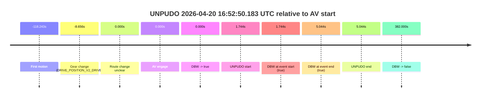
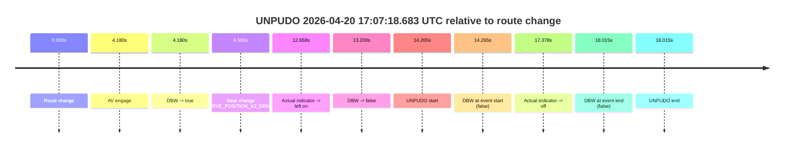
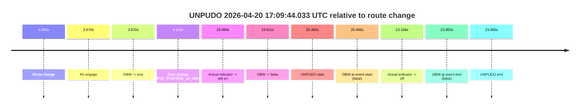
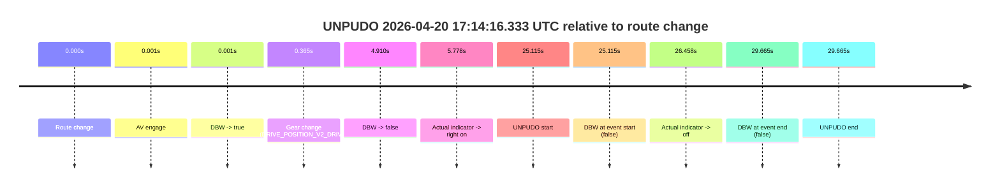
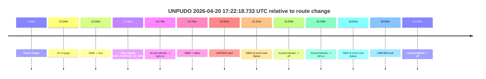
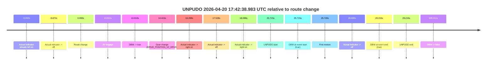

# Run Report: fme20038/2026-04-20--16-20-45--gen2-av-fbe4e51a-0dd9-4a52-9bc6-eff63f0939cd

| Field | Value |
|---|---|
| Run ID | `fme20038/2026-04-20--16-20-45--gen2-av-fbe4e51a-0dd9-4a52-9bc6-eff63f0939cd` |
| Date | `2026-04-20` |
| Model(s) | `pink-manta-ray-smooth` |
| Author | `guy.geva` |
| Event count | `7` |

## unpudo 2026-04-20 16:52:50.183 UTC

| Field | Value |
|---|---|
| Model | `pink-manta-ray-smooth` |
| Author | `guy.geva` |
| Run ID | `fme20038/2026-04-20--16-20-45--gen2-av-fbe4e51a-0dd9-4a52-9bc6-eff63f0939cd` |
| Date | `2026-04-20` |
| Time (UTC) | `16:52:50.183` |
| Event type | `unpudo` |
| Disengagement type | `none observed` |
| Route change | `unclear` |
| Console | [run](https://console.sso.wayve.ai/run/fme20038/2026-04-20--16-20-45--gen2-av-fbe4e51a-0dd9-4a52-9bc6-eff63f0939cd?id=&time-unixus=1776703970183306) |
| Foxglove | [segment](https://app.foxglove.dev/wayve-on-prem/p/prj_0dX18KZdVHg1fmmI/view?ds=foxglove-stream&ds.deviceName=fme20038&ds.start=2026-04-20T16%3A52%3A29.783300Z&ds.end=2026-04-20T16%3A59%3A20.439229Z&layoutId=lay_0e7VD4WIKDQGU73Y&time=2026-04-20T16%3A52%3A50.183306Z) |

### Event card: pass

- Pass: AV owns the credited unpudo from route change through the official unpudo window, the gear state is aligned at the anchor, and the vehicle moves without driver accelerator help in AV.

| Event | Time (UTC) | Delta from AV start |
|---|---:|---:|
| First motion | 2026-04-20 16:50:50.196 | `-118.243s` |
| Gear change (DRIVE_POSITION_V2_DRIVE) | 2026-04-20 16:52:39.783 | `-8.656s` |
| Route change unclear | 2026-04-20 16:52:48.439 | `0.000s` |
| AV engage | 2026-04-20 16:52:48.439 | `0.000s` |
| DBW -> true | 2026-04-20 16:52:48.439 | `0.000s` |
| UNPUDO start | 2026-04-20 16:52:50.183 | `1.744s` |
| DBW at event start (true) | 2026-04-20 16:52:50.183 | `1.744s` |
| DBW at event end (true) | 2026-04-20 16:52:53.483 | `5.044s` |
| UNPUDO end | 2026-04-20 16:52:53.483 | `5.044s` |
| DBW -> false | 2026-04-20 16:59:10.439 | `382.000s` |

| Metric | Value |
|---|---|
| Outcome | `pass` |
| Effective failure type | `none` |
| Route change status | `unclear` |
| DBW at event start | `true` |
| DBW at event end | `true` |
| Predicted gear at AV start | `DRIVE_POSITION_V2_DRIVE` |
| Actual gear at AV start | `DRIVE_POSITION_V2_DRIVE` |
| Predicted gear at event start | `DRIVE_POSITION_V2_DRIVE` |
| Actual gear at event start | `DRIVE_POSITION_V2_DRIVE` |
| Planned indicator direction | `INDICATORS_STATE_V2_OFF` |
| Controller indicator direction | `INDICATORS_STATE_V2_OFF` |
| Actual indicator direction | `INDICATORS_STATE_V2_OFF` |
| Actual indicator at maneuver end | `INDICATORS_STATE_V2_OFF` |
| Driver accel help in AV | `false` |
| Driver accel help timestamp | `n/a` |
| Max accel pedal pct in AV | `0.0%` |
| Max brake pedal pct in AV | `8.0%` |
| Max speed mps in AV | `5.336` |
| Success timing baseline | `AV start` |
| Route -> AV | `n/a` |
| AV -> event start | `1.744s` |
| AV -> first motion | `-118.243s` |
| Success baseline -> event start | `1.744s` |
| Success baseline -> first motion | `-118.243s` |
| AV duration before disengagement | `382.000s` |
| Trajectory waypoint count | `37` |
| Driving-plan step count | `11` |

The scored portion starts from the AV-owned window, not from the pre-AV setup. Route-change search in the stopped pre-event segment was `unclear`, with the baseline therefore set to AV start. At the event anchor the model predicts `DRIVE_POSITION_V2_DRIVE` and the actual gear is `DRIVE_POSITION_V2_DRIVE`. The effective model outcome is `pass` because `the credited unpudo stays AV-owned through the official unpudo window.`

### Resolution

| Field | Value |
|---|---|
| Final outcome | `pass` |
| Do we agree with this label? | `yes` |
| Source disengagement type | `none observed` |
| Resolved effective failure type | `none` |
| Confidence | `medium` |

## unpudo 2026-04-20 17:07:18.683 UTC

| Field | Value |
|---|---|
| Model | `pink-manta-ray-smooth` |
| Author | `guy.geva` |
| Run ID | `fme20038/2026-04-20--16-20-45--gen2-av-fbe4e51a-0dd9-4a52-9bc6-eff63f0939cd` |
| Date | `2026-04-20` |
| Time (UTC) | `17:07:18.683` |
| Event type | `unpudo` |
| Disengagement type | `none observed` |
| Route change | `found` |
| Console | [run](https://console.sso.wayve.ai/run/fme20038/2026-04-20--16-20-45--gen2-av-fbe4e51a-0dd9-4a52-9bc6-eff63f0939cd?id=&time-unixus=1776704838683304) |
| Foxglove | [segment](https://app.foxglove.dev/wayve-on-prem/p/prj_0dX18KZdVHg1fmmI/view?ds=foxglove-stream&ds.deviceName=fme20038&ds.start=2026-04-20T17%3A06%3A54.418302Z&ds.end=2026-04-20T17%3A07%3A32.433301Z&layoutId=lay_0e7VD4WIKDQGU73Y&time=2026-04-20T17%3A07%3A18.683304Z) |

### Event card: fail

- Fail: the credited unpudo does not stay AV-owned. The event window starts with DBW false, and the maneuver outcome lands outside a clean AV-owned segment.

| Event | Time (UTC) | Delta from route change |
|---|---:|---:|
| Route change | 2026-04-20 17:07:04.418 | `0.000s` |
| AV engage | 2026-04-20 17:07:08.598 | `4.180s` |
| DBW -> true | 2026-04-20 17:07:08.598 | `4.180s` |
| Gear change (DRIVE_POSITION_V2_DRIVE) | 2026-04-20 17:07:08.983 | `4.565s` |
| Actual indicator -> left on | 2026-04-20 17:07:17.076 | `12.658s` |
| DBW -> false | 2026-04-20 17:07:17.618 | `13.200s` |
| UNPUDO start | 2026-04-20 17:07:18.683 | `14.265s` |
| DBW at event start (false) | 2026-04-20 17:07:18.683 | `14.265s` |
| Actual indicator -> off | 2026-04-20 17:07:21.796 | `17.378s` |
| DBW at event end (false) | 2026-04-20 17:07:22.433 | `18.015s` |
| UNPUDO end | 2026-04-20 17:07:22.433 | `18.015s` |

| Metric | Value |
|---|---|
| Outcome | `fail` |
| Effective failure type | `not_av_owned` |
| Route change status | `found` |
| DBW at event start | `false` |
| DBW at event end | `false` |
| Predicted gear at AV start | `DRIVE_POSITION_V2_DRIVE` |
| Actual gear at AV start | `DRIVE_POSITION_V2_PARK` |
| Predicted gear at event start | `DRIVE_POSITION_V2_DRIVE` |
| Actual gear at event start | `DRIVE_POSITION_V2_DRIVE` |
| Planned indicator direction | `INDICATORS_STATE_V2_LEFT_ON` |
| Controller indicator direction | `INDICATORS_STATE_V2_LEFT_ON` |
| Actual indicator direction | `INDICATORS_STATE_V2_LEFT_ON` |
| Actual indicator at maneuver end | `INDICATORS_STATE_V2_OFF` |
| Driver accel help in AV | `false` |
| Driver accel help timestamp | `n/a` |
| Max accel pedal pct in AV | `0.0%` |
| Max brake pedal pct in AV | `8.2%` |
| Max speed mps in AV | `0.000` |
| Success timing baseline | `route change` |
| Route -> AV | `4.180s` |
| AV -> event start | `10.085s` |
| AV -> first motion | `n/a` |
| Success baseline -> event start | `14.265s` |
| Success baseline -> first motion | `n/a` |
| AV duration before disengagement | `9.020s` |
| Trajectory waypoint count | `37` |
| Driving-plan step count | `11` |

The scored portion starts from the AV-owned window, not from the pre-AV setup. Route-change search in the stopped pre-event segment was `found`, with the baseline therefore set to route change. At the event anchor the model predicts `DRIVE_POSITION_V2_DRIVE` and the actual gear is `DRIVE_POSITION_V2_DRIVE`. The effective model outcome is `fail` because `not_av_owned.`

### Resolution

| Field | Value |
|---|---|
| Final outcome | `fail` |
| Do we agree with this label? | `yes` |
| Source disengagement type | `none observed` |
| Resolved effective failure type | `not_av_owned` |
| Confidence | `high` |

## unpudo 2026-04-20 17:09:44.033 UTC

| Field | Value |
|---|---|
| Model | `pink-manta-ray-smooth` |
| Author | `guy.geva` |
| Run ID | `fme20038/2026-04-20--16-20-45--gen2-av-fbe4e51a-0dd9-4a52-9bc6-eff63f0939cd` |
| Date | `2026-04-20` |
| Time (UTC) | `17:09:44.033` |
| Event type | `unpudo` |
| Disengagement type | `none observed` |
| Route change | `found` |
| Console | [run](https://console.sso.wayve.ai/run/fme20038/2026-04-20--16-20-45--gen2-av-fbe4e51a-0dd9-4a52-9bc6-eff63f0939cd?id=&time-unixus=1776704984033318) |
| Foxglove | [segment](https://app.foxglove.dev/wayve-on-prem/p/prj_0dX18KZdVHg1fmmI/view?ds=foxglove-stream&ds.deviceName=fme20038&ds.start=2026-04-20T17%3A09%3A13.568628Z&ds.end=2026-04-20T17%3A09%3A57.533311Z&layoutId=lay_0e7VD4WIKDQGU73Y&time=2026-04-20T17%3A09%3A44.033318Z) |

### Event card: fail

- Fail: the credited unpudo does not stay AV-owned. The event window starts with DBW false, and the maneuver outcome lands outside a clean AV-owned segment.

| Event | Time (UTC) | Delta from route change |
|---|---:|---:|
| Route change | 2026-04-20 17:09:23.568 | `0.000s` |
| AV engage | 2026-04-20 17:09:27.238 | `3.670s` |
| DBW -> true | 2026-04-20 17:09:27.238 | `3.670s` |
| Gear change (DRIVE_POSITION_V2_DRIVE) | 2026-04-20 17:09:27.683 | `4.115s` |
| Actual indicator -> left on | 2026-04-20 17:09:41.656 | `18.088s` |
| DBW -> false | 2026-04-20 17:09:43.179 | `19.611s` |
| UNPUDO start | 2026-04-20 17:09:44.033 | `20.465s` |
| DBW at event start (false) | 2026-04-20 17:09:44.033 | `20.465s` |
| Actual indicator -> off | 2026-04-20 17:09:46.736 | `23.168s` |
| DBW at event end (false) | 2026-04-20 17:09:47.533 | `23.965s` |
| UNPUDO end | 2026-04-20 17:09:47.533 | `23.965s` |

| Metric | Value |
|---|---|
| Outcome | `fail` |
| Effective failure type | `not_av_owned` |
| Route change status | `found` |
| DBW at event start | `false` |
| DBW at event end | `false` |
| Predicted gear at AV start | `DRIVE_POSITION_V2_DRIVE` |
| Actual gear at AV start | `DRIVE_POSITION_V2_PARK` |
| Predicted gear at event start | `DRIVE_POSITION_V2_DRIVE` |
| Actual gear at event start | `DRIVE_POSITION_V2_DRIVE` |
| Planned indicator direction | `INDICATORS_STATE_V2_LEFT_ON` |
| Controller indicator direction | `INDICATORS_STATE_V2_LEFT_ON` |
| Actual indicator direction | `INDICATORS_STATE_V2_LEFT_ON` |
| Actual indicator at maneuver end | `INDICATORS_STATE_V2_OFF` |
| Driver accel help in AV | `false` |
| Driver accel help timestamp | `n/a` |
| Max accel pedal pct in AV | `0.0%` |
| Max brake pedal pct in AV | `8.0%` |
| Max speed mps in AV | `0.000` |
| Success timing baseline | `route change` |
| Route -> AV | `3.670s` |
| AV -> event start | `16.795s` |
| AV -> first motion | `n/a` |
| Success baseline -> event start | `20.465s` |
| Success baseline -> first motion | `n/a` |
| AV duration before disengagement | `15.941s` |
| Trajectory waypoint count | `36` |
| Driving-plan step count | `11` |

The scored portion starts from the AV-owned window, not from the pre-AV setup. Route-change search in the stopped pre-event segment was `found`, with the baseline therefore set to route change. At the event anchor the model predicts `DRIVE_POSITION_V2_DRIVE` and the actual gear is `DRIVE_POSITION_V2_DRIVE`. The effective model outcome is `fail` because `not_av_owned.`

### Resolution

| Field | Value |
|---|---|
| Final outcome | `fail` |
| Do we agree with this label? | `yes` |
| Source disengagement type | `none observed` |
| Resolved effective failure type | `not_av_owned` |
| Confidence | `high` |

## unpudo 2026-04-20 17:14:16.333 UTC

| Field | Value |
|---|---|
| Model | `pink-manta-ray-smooth` |
| Author | `guy.geva` |
| Run ID | `fme20038/2026-04-20--16-20-45--gen2-av-fbe4e51a-0dd9-4a52-9bc6-eff63f0939cd` |
| Date | `2026-04-20` |
| Time (UTC) | `17:14:16.333` |
| Event type | `unpudo` |
| Disengagement type | `none observed` |
| Route change | `found` |
| Console | [run](https://console.sso.wayve.ai/run/fme20038/2026-04-20--16-20-45--gen2-av-fbe4e51a-0dd9-4a52-9bc6-eff63f0939cd?id=&time-unixus=1776705256333301) |
| Foxglove | [segment](https://app.foxglove.dev/wayve-on-prem/p/prj_0dX18KZdVHg1fmmI/view?ds=foxglove-stream&ds.deviceName=fme20038&ds.start=2026-04-20T17%3A13%3A41.218254Z&ds.end=2026-04-20T17%3A14%3A30.883309Z&layoutId=lay_0e7VD4WIKDQGU73Y&time=2026-04-20T17%3A14%3A16.333301Z) |

### Event card: fail

- Fail: the credited unpudo does not stay AV-owned. The event window starts with DBW false, and the maneuver outcome lands outside a clean AV-owned segment.

| Event | Time (UTC) | Delta from route change |
|---|---:|---:|
| Route change | 2026-04-20 17:13:51.218 | `0.000s` |
| AV engage | 2026-04-20 17:13:51.218 | `0.001s` |
| DBW -> true | 2026-04-20 17:13:51.218 | `0.001s` |
| Gear change (DRIVE_POSITION_V2_DRIVE) | 2026-04-20 17:13:51.583 | `0.365s` |
| DBW -> false | 2026-04-20 17:13:56.127 | `4.910s` |
| Actual indicator -> right on | 2026-04-20 17:13:56.996 | `5.778s` |
| UNPUDO start | 2026-04-20 17:14:16.333 | `25.115s` |
| DBW at event start (false) | 2026-04-20 17:14:16.333 | `25.115s` |
| Actual indicator -> off | 2026-04-20 17:14:17.676 | `26.458s` |
| DBW at event end (false) | 2026-04-20 17:14:20.883 | `29.665s` |
| UNPUDO end | 2026-04-20 17:14:20.883 | `29.665s` |

| Metric | Value |
|---|---|
| Outcome | `fail` |
| Effective failure type | `not_av_owned` |
| Route change status | `found` |
| DBW at event start | `false` |
| DBW at event end | `false` |
| Predicted gear at AV start | `DRIVE_POSITION_V2_PARK` |
| Actual gear at AV start | `DRIVE_POSITION_V2_PARK` |
| Predicted gear at event start | `DRIVE_POSITION_V2_DRIVE` |
| Actual gear at event start | `DRIVE_POSITION_V2_DRIVE` |
| Planned indicator direction | `INDICATORS_STATE_V2_RIGHT_ON` |
| Controller indicator direction | `INDICATORS_STATE_V2_RIGHT_ON` |
| Actual indicator direction | `INDICATORS_STATE_V2_RIGHT_ON` |
| Actual indicator at maneuver end | `INDICATORS_STATE_V2_OFF` |
| Driver accel help in AV | `false` |
| Driver accel help timestamp | `n/a` |
| Max accel pedal pct in AV | `0.0%` |
| Max brake pedal pct in AV | `8.0%` |
| Max speed mps in AV | `0.000` |
| Success timing baseline | `route change` |
| Route -> AV | `0.001s` |
| AV -> event start | `25.114s` |
| AV -> first motion | `n/a` |
| Success baseline -> event start | `25.115s` |
| Success baseline -> first motion | `n/a` |
| AV duration before disengagement | `4.909s` |
| Trajectory waypoint count | `36` |
| Driving-plan step count | `11` |

The scored portion starts from the AV-owned window, not from the pre-AV setup. Route-change search in the stopped pre-event segment was `found`, with the baseline therefore set to route change. At the event anchor the model predicts `DRIVE_POSITION_V2_DRIVE` and the actual gear is `DRIVE_POSITION_V2_DRIVE`. The effective model outcome is `fail` because `not_av_owned.`

### Resolution

| Field | Value |
|---|---|
| Final outcome | `fail` |
| Do we agree with this label? | `yes` |
| Source disengagement type | `none observed` |
| Resolved effective failure type | `not_av_owned` |
| Confidence | `high` |

## unpudo 2026-04-20 17:15:58.983 UTC

| Field | Value |
|---|---|
| Model | `pink-manta-ray-smooth` |
| Author | `guy.geva` |
| Run ID | `fme20038/2026-04-20--16-20-45--gen2-av-fbe4e51a-0dd9-4a52-9bc6-eff63f0939cd` |
| Date | `2026-04-20` |
| Time (UTC) | `17:15:58.983` |
| Event type | `unpudo` |
| Disengagement type | `none observed` |
| Route change | `found` |
| Console | [run](https://console.sso.wayve.ai/run/fme20038/2026-04-20--16-20-45--gen2-av-fbe4e51a-0dd9-4a52-9bc6-eff63f0939cd?id=&time-unixus=1776705358983323) |
| Foxglove | [segment](https://app.foxglove.dev/wayve-on-prem/p/prj_0dX18KZdVHg1fmmI/view?ds=foxglove-stream&ds.deviceName=fme20038&ds.start=2026-04-20T17%3A15%3A37.368283Z&ds.end=2026-04-20T17%3A16%3A12.183312Z&layoutId=lay_0e7VD4WIKDQGU73Y&time=2026-04-20T17%3A15%3A58.983323Z) |

### Event card: fail

- Fail: the credited unpudo does not stay AV-owned. The event window starts with DBW false, and the maneuver outcome lands outside a clean AV-owned segment.

| Event | Time (UTC) | Delta from route change |
|---|---:|---:|
| Route change | 2026-04-20 17:15:47.368 | `0.000s` |
| AV engage | 2026-04-20 17:15:51.298 | `3.930s` |
| DBW -> true | 2026-04-20 17:15:51.298 | `3.930s` |
| Gear change (DRIVE_POSITION_V2_DRIVE) | 2026-04-20 17:15:51.783 | `4.415s` |
| Actual indicator -> right on | 2026-04-20 17:15:56.536 | `9.168s` |
| DBW -> false | 2026-04-20 17:15:58.379 | `11.011s` |
| UNPUDO start | 2026-04-20 17:15:58.983 | `11.615s` |
| DBW at event start (false) | 2026-04-20 17:15:58.983 | `11.615s` |
| Actual indicator -> off | 2026-04-20 17:16:00.956 | `13.588s` |
| DBW at event end (false) | 2026-04-20 17:16:02.183 | `14.815s` |
| UNPUDO end | 2026-04-20 17:16:02.183 | `14.815s` |

| Metric | Value |
|---|---|
| Outcome | `fail` |
| Effective failure type | `not_av_owned` |
| Route change status | `found` |
| DBW at event start | `false` |
| DBW at event end | `false` |
| Predicted gear at AV start | `DRIVE_POSITION_V2_DRIVE` |
| Actual gear at AV start | `DRIVE_POSITION_V2_PARK` |
| Predicted gear at event start | `DRIVE_POSITION_V2_DRIVE` |
| Actual gear at event start | `DRIVE_POSITION_V2_DRIVE` |
| Planned indicator direction | `INDICATORS_STATE_V2_RIGHT_ON` |
| Controller indicator direction | `INDICATORS_STATE_V2_RIGHT_ON` |
| Actual indicator direction | `INDICATORS_STATE_V2_RIGHT_ON` |
| Actual indicator at maneuver end | `INDICATORS_STATE_V2_OFF` |
| Driver accel help in AV | `false` |
| Driver accel help timestamp | `n/a` |
| Max accel pedal pct in AV | `0.0%` |
| Max brake pedal pct in AV | `8.0%` |
| Max speed mps in AV | `0.000` |
| Success timing baseline | `route change` |
| Route -> AV | `3.930s` |
| AV -> event start | `7.685s` |
| AV -> first motion | `n/a` |
| Success baseline -> event start | `11.615s` |
| Success baseline -> first motion | `n/a` |
| AV duration before disengagement | `7.081s` |
| Trajectory waypoint count | `37` |
| Driving-plan step count | `11` |

The scored portion starts from the AV-owned window, not from the pre-AV setup. Route-change search in the stopped pre-event segment was `found`, with the baseline therefore set to route change. At the event anchor the model predicts `DRIVE_POSITION_V2_DRIVE` and the actual gear is `DRIVE_POSITION_V2_DRIVE`. The effective model outcome is `fail` because `not_av_owned.`

### Resolution

| Field | Value |
|---|---|
| Final outcome | `fail` |
| Do we agree with this label? | `yes` |
| Source disengagement type | `none observed` |
| Resolved effective failure type | `not_av_owned` |
| Confidence | `high` |

## unpudo 2026-04-20 17:22:18.733 UTC

| Field | Value |
|---|---|
| Model | `pink-manta-ray-smooth` |
| Author | `guy.geva` |
| Run ID | `fme20038/2026-04-20--16-20-45--gen2-av-fbe4e51a-0dd9-4a52-9bc6-eff63f0939cd` |
| Date | `2026-04-20` |
| Time (UTC) | `17:22:18.733` |
| Event type | `unpudo` |
| Disengagement type | `none observed` |
| Route change | `found` |
| Console | [run](https://console.sso.wayve.ai/run/fme20038/2026-04-20--16-20-45--gen2-av-fbe4e51a-0dd9-4a52-9bc6-eff63f0939cd?id=&time-unixus=1776705738733307) |
| Foxglove | [segment](https://app.foxglove.dev/wayve-on-prem/p/prj_0dX18KZdVHg1fmmI/view?ds=foxglove-stream&ds.deviceName=fme20038&ds.start=2026-04-20T17%3A21%3A53.418270Z&ds.end=2026-04-20T17%3A22%3A32.233296Z&layoutId=lay_0e7VD4WIKDQGU73Y&time=2026-04-20T17%3A22%3A18.733307Z) |

### Event card: fail

- Fail: the credited unpudo does not stay AV-owned. The event window starts with DBW false, and the maneuver outcome lands outside a clean AV-owned segment.

| Event | Time (UTC) | Delta from route change |
|---|---:|---:|
| Route change | 2026-04-20 17:22:03.418 | `0.000s` |
| AV engage | 2026-04-20 17:22:13.458 | `10.040s` |
| DBW -> true | 2026-04-20 17:22:13.458 | `10.040s` |
| Gear change (DRIVE_POSITION_V2_DRIVE) | 2026-04-20 17:22:13.983 | `10.565s` |
| Actual indicator -> right on | 2026-04-20 17:22:17.596 | `14.178s` |
| DBW -> false | 2026-04-20 17:22:18.179 | `14.761s` |
| UNPUDO start | 2026-04-20 17:22:18.733 | `15.315s` |
| DBW at event start (false) | 2026-04-20 17:22:18.733 | `15.315s` |
| Actual indicator -> off | 2026-04-20 17:22:19.476 | `16.058s` |
| Actual indicator -> left on | 2026-04-20 17:22:19.616 | `16.198s` |
| DBW at event end (false) | 2026-04-20 17:22:22.233 | `18.815s` |
| UNPUDO end | 2026-04-20 17:22:22.233 | `18.815s` |
| Actual indicator -> off | 2026-04-20 17:22:25.036 | `21.618s` |

| Metric | Value |
|---|---|
| Outcome | `fail` |
| Effective failure type | `not_av_owned` |
| Route change status | `found` |
| DBW at event start | `false` |
| DBW at event end | `false` |
| Predicted gear at AV start | `DRIVE_POSITION_V2_DRIVE` |
| Actual gear at AV start | `DRIVE_POSITION_V2_PARK` |
| Predicted gear at event start | `DRIVE_POSITION_V2_DRIVE` |
| Actual gear at event start | `DRIVE_POSITION_V2_DRIVE` |
| Planned indicator direction | `INDICATORS_STATE_V2_OFF` |
| Controller indicator direction | `INDICATORS_STATE_V2_OFF` |
| Actual indicator direction | `INDICATORS_STATE_V2_RIGHT_ON` |
| Actual indicator at maneuver end | `INDICATORS_STATE_V2_LEFT_ON` |
| Driver accel help in AV | `false` |
| Driver accel help timestamp | `n/a` |
| Max accel pedal pct in AV | `0.0%` |
| Max brake pedal pct in AV | `8.0%` |
| Max speed mps in AV | `0.000` |
| Success timing baseline | `route change` |
| Route -> AV | `10.040s` |
| AV -> event start | `5.275s` |
| AV -> first motion | `n/a` |
| Success baseline -> event start | `15.315s` |
| Success baseline -> first motion | `n/a` |
| AV duration before disengagement | `4.721s` |
| Trajectory waypoint count | `36` |
| Driving-plan step count | `11` |

The scored portion starts from the AV-owned window, not from the pre-AV setup. Route-change search in the stopped pre-event segment was `found`, with the baseline therefore set to route change. At the event anchor the model predicts `DRIVE_POSITION_V2_DRIVE` and the actual gear is `DRIVE_POSITION_V2_DRIVE`. The effective model outcome is `fail` because `not_av_owned.`

### Resolution

| Field | Value |
|---|---|
| Final outcome | `fail` |
| Do we agree with this label? | `yes` |
| Source disengagement type | `none observed` |
| Resolved effective failure type | `not_av_owned` |
| Confidence | `high` |

## unpudo 2026-04-20 17:42:38.983 UTC

| Field | Value |
|---|---|
| Model | `pink-manta-ray-smooth` |
| Author | `guy.geva` |
| Run ID | `fme20038/2026-04-20--16-20-45--gen2-av-fbe4e51a-0dd9-4a52-9bc6-eff63f0939cd` |
| Date | `2026-04-20` |
| Time (UTC) | `17:42:38.983` |
| Event type | `unpudo` |
| Disengagement type | `none observed` |
| Route change | `found` |
| Console | [run](https://console.sso.wayve.ai/run/fme20038/2026-04-20--16-20-45--gen2-av-fbe4e51a-0dd9-4a52-9bc6-eff63f0939cd?id=&time-unixus=1776706958983322) |
| Foxglove | [segment](https://app.foxglove.dev/wayve-on-prem/p/prj_0dX18KZdVHg1fmmI/view?ds=foxglove-stream&ds.deviceName=fme20038&ds.start=2026-04-20T17%3A42%3A03.268458Z&ds.end=2026-04-20T17%3A53%3A58.279072Z&layoutId=lay_0e7VD4WIKDQGU73Y&time=2026-04-20T17%3A42%3A38.983322Z) |

### Event card: pass

- Pass: AV owns the credited unpudo from route change through the official unpudo window, the gear state is aligned at the anchor, and the vehicle moves without driver accelerator help in AV.

| Event | Time (UTC) | Delta from route change |
|---|---:|---:|
| Actual indicator already left on | 2026-04-20 17:42:03.276 | `-9.992s` |
| Actual indicator -> off | 2026-04-20 17:42:03.396 | `-9.872s` |
| Route change | 2026-04-20 17:42:13.268 | `0.000s` |
| AV engage | 2026-04-20 17:42:27.178 | `13.910s` |
| DBW -> true | 2026-04-20 17:42:27.178 | `13.910s` |
| Gear change (DRIVE_POSITION_V2_DRIVE) | 2026-04-20 17:42:27.683 | `14.415s` |
| Actual indicator -> right on | 2026-04-20 17:42:29.476 | `16.208s` |
| Actual indicator -> off | 2026-04-20 17:42:30.796 | `17.528s` |
| Actual indicator -> right on | 2026-04-20 17:42:31.356 | `18.088s` |
| UNPUDO start | 2026-04-20 17:42:38.983 | `25.715s` |
| DBW at event start (true) | 2026-04-20 17:42:38.983 | `25.715s` |
| First motion | 2026-04-20 17:42:38.996 | `25.728s` |
| Actual indicator -> off | 2026-04-20 17:42:41.876 | `28.608s` |
| DBW at event end (true) | 2026-04-20 17:42:42.483 | `29.215s` |
| UNPUDO end | 2026-04-20 17:42:42.483 | `29.215s` |
| DBW -> false | 2026-04-20 17:53:48.279 | `695.011s` |

| Metric | Value |
|---|---|
| Outcome | `pass` |
| Effective failure type | `none` |
| Route change status | `found` |
| DBW at event start | `true` |
| DBW at event end | `true` |
| Predicted gear at AV start | `DRIVE_POSITION_V2_DRIVE` |
| Actual gear at AV start | `DRIVE_POSITION_V2_PARK` |
| Predicted gear at event start | `DRIVE_POSITION_V2_DRIVE` |
| Actual gear at event start | `DRIVE_POSITION_V2_DRIVE` |
| Planned indicator direction | `INDICATORS_STATE_V2_RIGHT_ON` |
| Controller indicator direction | `INDICATORS_STATE_V2_RIGHT_ON` |
| Actual indicator direction | `INDICATORS_STATE_V2_RIGHT_ON` |
| Actual indicator at maneuver end | `INDICATORS_STATE_V2_OFF` |
| Driver accel help in AV | `false` |
| Driver accel help timestamp | `n/a` |
| Max accel pedal pct in AV | `0.0%` |
| Max brake pedal pct in AV | `8.0%` |
| Max speed mps in AV | `4.417` |
| Success timing baseline | `route change` |
| Route -> AV | `13.910s` |
| AV -> event start | `11.805s` |
| AV -> first motion | `11.818s` |
| Success baseline -> event start | `25.715s` |
| Success baseline -> first motion | `25.728s` |
| AV duration before disengagement | `681.100s` |
| Trajectory waypoint count | `37` |
| Driving-plan step count | `11` |

The scored portion starts from the AV-owned window, not from the pre-AV setup. Route-change search in the stopped pre-event segment was `found`, with the baseline therefore set to route change. At the event anchor the model predicts `DRIVE_POSITION_V2_DRIVE` and the actual gear is `DRIVE_POSITION_V2_DRIVE`. The effective model outcome is `pass` because `the credited unpudo stays AV-owned through the official unpudo window.`

### Resolution

| Field | Value |
|---|---|
| Final outcome | `pass` |
| Do we agree with this label? | `yes` |
| Source disengagement type | `none observed` |
| Resolved effective failure type | `none` |
| Confidence | `high` |
