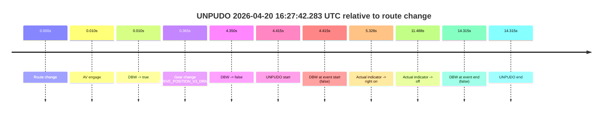
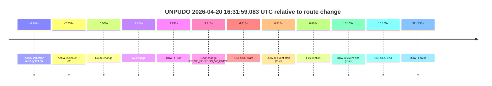
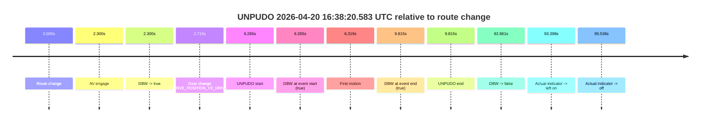
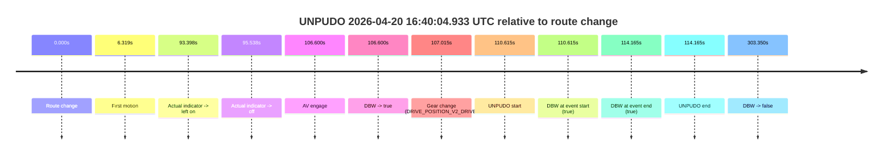
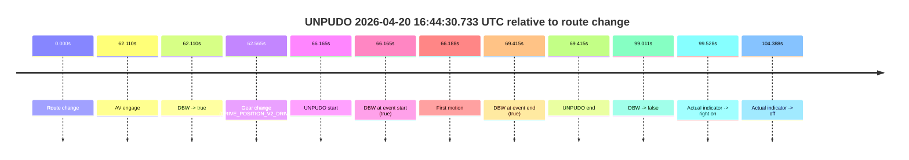
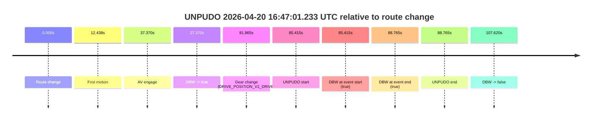
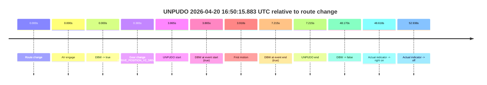
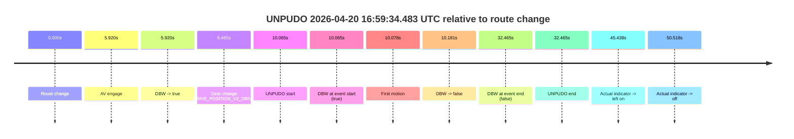
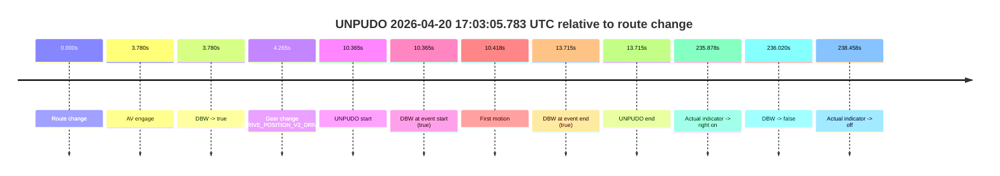
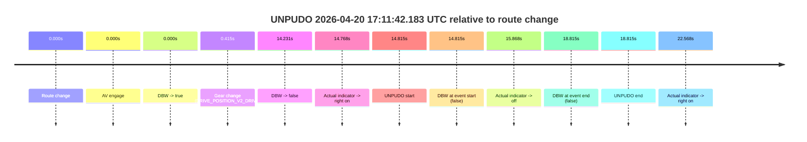

# Run Report: fme20038/2026-04-20--16-20-45--gen2-av-fbe4e51a-0dd9-4a52-9bc6-eff63f0939cd

| Field | Value |
|---|---|
| Run ID | `fme20038/2026-04-20--16-20-45--gen2-av-fbe4e51a-0dd9-4a52-9bc6-eff63f0939cd` |
| Date | `2026-04-20` |
| Model(s) | `eel-teal-outspoken` |
| Author | `zak` |
| Event count | `11` |

## unpudo 2026-04-20 16:27:42.283 UTC

| Field | Value |
|---|---|
| Model | `eel-teal-outspoken` |
| Author | `zak` |
| Run ID | `fme20038/2026-04-20--16-20-45--gen2-av-fbe4e51a-0dd9-4a52-9bc6-eff63f0939cd` |
| Date | `2026-04-20` |
| Time (UTC) | `16:27:42.283` |
| Event type | `unpudo` |
| Disengagement type | `none observed` |
| Route change | `found` |
| Console | [run](https://console.sso.wayve.ai/run/fme20038/2026-04-20--16-20-45--gen2-av-fbe4e51a-0dd9-4a52-9bc6-eff63f0939cd?id=&time-unixus=1776702462283292) |
| Foxglove | [segment](https://app.foxglove.dev/wayve-on-prem/p/prj_0dX18KZdVHg1fmmI/view?ds=foxglove-stream&ds.deviceName=fme20038&ds.start=2026-04-20T16%3A27%3A27.868385Z&ds.end=2026-04-20T16%3A28%3A02.183320Z&layoutId=lay_0e7VD4WIKDQGU73Y&time=2026-04-20T16%3A27%3A42.283292Z) |

### Event card: fail

- Fail: the credited unpudo does not stay AV-owned. The event window starts with DBW false, and the maneuver outcome lands outside a clean AV-owned segment.

| Event | Time (UTC) | Delta from route change |
|---|---:|---:|
| Route change | 2026-04-20 16:27:37.868 | `0.000s` |
| AV engage | 2026-04-20 16:27:37.878 | `0.010s` |
| DBW -> true | 2026-04-20 16:27:37.878 | `0.010s` |
| Gear change (DRIVE_POSITION_V2_DRIVE) | 2026-04-20 16:27:38.233 | `0.365s` |
| DBW -> false | 2026-04-20 16:27:42.218 | `4.350s` |
| UNPUDO start | 2026-04-20 16:27:42.283 | `4.415s` |
| DBW at event start (false) | 2026-04-20 16:27:42.283 | `4.415s` |
| Actual indicator -> right on | 2026-04-20 16:27:43.196 | `5.328s` |
| Actual indicator -> off | 2026-04-20 16:27:49.356 | `11.488s` |
| DBW at event end (false) | 2026-04-20 16:27:52.183 | `14.315s` |
| UNPUDO end | 2026-04-20 16:27:52.183 | `14.315s` |

| Metric | Value |
|---|---|
| Outcome | `fail` |
| Effective failure type | `not_av_owned` |
| Route change status | `found` |
| DBW at event start | `false` |
| DBW at event end | `false` |
| Predicted gear at AV start | `DRIVE_POSITION_V2_PARK` |
| Actual gear at AV start | `DRIVE_POSITION_V2_PARK` |
| Predicted gear at event start | `DRIVE_POSITION_V2_DRIVE` |
| Actual gear at event start | `DRIVE_POSITION_V2_DRIVE` |
| Planned indicator direction | `INDICATORS_STATE_V2_RIGHT_ON` |
| Controller indicator direction | `INDICATORS_STATE_V2_RIGHT_ON` |
| Actual indicator direction | `INDICATORS_STATE_V2_OFF` |
| Actual indicator at maneuver end | `INDICATORS_STATE_V2_OFF` |
| Driver accel help in AV | `false` |
| Driver accel help timestamp | `n/a` |
| Max accel pedal pct in AV | `0.0%` |
| Max brake pedal pct in AV | `9.2%` |
| Max speed mps in AV | `0.000` |
| Success timing baseline | `route change` |
| Route -> AV | `0.010s` |
| AV -> event start | `4.405s` |
| AV -> first motion | `n/a` |
| Success baseline -> event start | `4.415s` |
| Success baseline -> first motion | `n/a` |
| AV duration before disengagement | `4.340s` |
| Trajectory waypoint count | `37` |
| Driving-plan step count | `11` |

The scored portion starts from the AV-owned window, not from the pre-AV setup. Route-change search in the stopped pre-event segment was `found`, with the baseline therefore set to route change. At the event anchor the model predicts `DRIVE_POSITION_V2_DRIVE` and the actual gear is `DRIVE_POSITION_V2_DRIVE`. The effective model outcome is `fail` because `not_av_owned.`

### Resolution

| Field | Value |
|---|---|
| Final outcome | `fail` |
| Do we agree with this label? | `yes` |
| Source disengagement type | `none observed` |
| Resolved effective failure type | `not_av_owned` |
| Confidence | `high` |

## unpudo 2026-04-20 16:31:59.083 UTC

| Field | Value |
|---|---|
| Model | `eel-teal-outspoken` |
| Author | `zak` |
| Run ID | `fme20038/2026-04-20--16-20-45--gen2-av-fbe4e51a-0dd9-4a52-9bc6-eff63f0939cd` |
| Date | `2026-04-20` |
| Time (UTC) | `16:31:59.083` |
| Event type | `unpudo` |
| Disengagement type | `none observed` |
| Route change | `found` |
| Console | [run](https://console.sso.wayve.ai/run/fme20038/2026-04-20--16-20-45--gen2-av-fbe4e51a-0dd9-4a52-9bc6-eff63f0939cd?id=&time-unixus=1776702719083320) |
| Foxglove | [segment](https://app.foxglove.dev/wayve-on-prem/p/prj_0dX18KZdVHg1fmmI/view?ds=foxglove-stream&ds.deviceName=fme20038&ds.start=2026-04-20T16%3A31%3A42.268382Z&ds.end=2026-04-20T16%3A38%3A14.098511Z&layoutId=lay_0e7VD4WIKDQGU73Y&time=2026-04-20T16%3A31%3A59.083320Z) |

### Event card: pass

- Pass: AV owns the credited unpudo from route change through the official unpudo window, the gear state is aligned at the anchor, and the vehicle moves without driver accelerator help in AV.

| Event | Time (UTC) | Delta from route change |
|---|---:|---:|
| Actual indicator already left on | 2026-04-20 16:31:42.276 | `-9.992s` |
| Actual indicator -> off | 2026-04-20 16:31:44.536 | `-7.732s` |
| Route change | 2026-04-20 16:31:52.268 | `0.000s` |
| AV engage | 2026-04-20 16:31:55.018 | `2.750s` |
| DBW -> true | 2026-04-20 16:31:55.018 | `2.750s` |
| Gear change (DRIVE_POSITION_V2_DRIVE) | 2026-04-20 16:31:55.583 | `3.315s` |
| UNPUDO start | 2026-04-20 16:31:59.083 | `6.815s` |
| DBW at event start (true) | 2026-04-20 16:31:59.083 | `6.815s` |
| First motion | 2026-04-20 16:31:59.136 | `6.868s` |
| DBW at event end (true) | 2026-04-20 16:32:02.433 | `10.165s` |
| UNPUDO end | 2026-04-20 16:32:02.433 | `10.165s` |
| DBW -> false | 2026-04-20 16:38:04.098 | `371.830s` |

| Metric | Value |
|---|---|
| Outcome | `pass` |
| Effective failure type | `none` |
| Route change status | `found` |
| DBW at event start | `true` |
| DBW at event end | `true` |
| Predicted gear at AV start | `DRIVE_POSITION_V2_DRIVE` |
| Actual gear at AV start | `DRIVE_POSITION_V2_PARK` |
| Predicted gear at event start | `DRIVE_POSITION_V2_DRIVE` |
| Actual gear at event start | `DRIVE_POSITION_V2_DRIVE` |
| Planned indicator direction | `INDICATORS_STATE_V2_RIGHT_ON` |
| Controller indicator direction | `INDICATORS_STATE_V2_RIGHT_ON` |
| Actual indicator direction | `INDICATORS_STATE_V2_OFF` |
| Actual indicator at maneuver end | `INDICATORS_STATE_V2_OFF` |
| Driver accel help in AV | `false` |
| Driver accel help timestamp | `n/a` |
| Max accel pedal pct in AV | `0.0%` |
| Max brake pedal pct in AV | `8.0%` |
| Max speed mps in AV | `5.019` |
| Success timing baseline | `route change` |
| Route -> AV | `2.750s` |
| AV -> event start | `4.065s` |
| AV -> first motion | `4.118s` |
| Success baseline -> event start | `6.815s` |
| Success baseline -> first motion | `6.868s` |
| AV duration before disengagement | `369.080s` |
| Trajectory waypoint count | `37` |
| Driving-plan step count | `11` |

The scored portion starts from the AV-owned window, not from the pre-AV setup. Route-change search in the stopped pre-event segment was `found`, with the baseline therefore set to route change. At the event anchor the model predicts `DRIVE_POSITION_V2_DRIVE` and the actual gear is `DRIVE_POSITION_V2_DRIVE`. The effective model outcome is `pass` because `the credited unpudo stays AV-owned through the official unpudo window.`

### Resolution

| Field | Value |
|---|---|
| Final outcome | `pass` |
| Do we agree with this label? | `yes` |
| Source disengagement type | `none observed` |
| Resolved effective failure type | `none` |
| Confidence | `high` |

## unpudo 2026-04-20 16:38:20.583 UTC

| Field | Value |
|---|---|
| Model | `eel-teal-outspoken` |
| Author | `zak` |
| Run ID | `fme20038/2026-04-20--16-20-45--gen2-av-fbe4e51a-0dd9-4a52-9bc6-eff63f0939cd` |
| Date | `2026-04-20` |
| Time (UTC) | `16:38:20.583` |
| Event type | `unpudo` |
| Disengagement type | `none observed` |
| Route change | `found` |
| Console | [run](https://console.sso.wayve.ai/run/fme20038/2026-04-20--16-20-45--gen2-av-fbe4e51a-0dd9-4a52-9bc6-eff63f0939cd?id=&time-unixus=1776703100583297) |
| Foxglove | [segment](https://app.foxglove.dev/wayve-on-prem/p/prj_0dX18KZdVHg1fmmI/view?ds=foxglove-stream&ds.deviceName=fme20038&ds.start=2026-04-20T16%3A38%3A04.318260Z&ds.end=2026-04-20T16%3A39%3A57.179758Z&layoutId=lay_0e7VD4WIKDQGU73Y&time=2026-04-20T16%3A38%3A20.583297Z) |

### Event card: pass

- Pass: AV owns the credited unpudo from route change through the official unpudo window, the gear state is aligned at the anchor, and the vehicle moves without driver accelerator help in AV.

| Event | Time (UTC) | Delta from route change |
|---|---:|---:|
| Route change | 2026-04-20 16:38:14.318 | `0.000s` |
| AV engage | 2026-04-20 16:38:16.618 | `2.300s` |
| DBW -> true | 2026-04-20 16:38:16.618 | `2.300s` |
| Gear change (DRIVE_POSITION_V2_DRIVE) | 2026-04-20 16:38:17.033 | `2.715s` |
| UNPUDO start | 2026-04-20 16:38:20.583 | `6.265s` |
| DBW at event start (true) | 2026-04-20 16:38:20.583 | `6.265s` |
| First motion | 2026-04-20 16:38:20.636 | `6.319s` |
| DBW at event end (true) | 2026-04-20 16:38:24.133 | `9.815s` |
| UNPUDO end | 2026-04-20 16:38:24.133 | `9.815s` |
| DBW -> false | 2026-04-20 16:39:47.179 | `92.861s` |
| Actual indicator -> left on | 2026-04-20 16:39:47.716 | `93.398s` |
| Actual indicator -> off | 2026-04-20 16:39:49.856 | `95.538s` |

| Metric | Value |
|---|---|
| Outcome | `pass` |
| Effective failure type | `none` |
| Route change status | `found` |
| DBW at event start | `true` |
| DBW at event end | `true` |
| Predicted gear at AV start | `DRIVE_POSITION_V2_DRIVE` |
| Actual gear at AV start | `DRIVE_POSITION_V2_PARK` |
| Predicted gear at event start | `DRIVE_POSITION_V2_DRIVE` |
| Actual gear at event start | `DRIVE_POSITION_V2_DRIVE` |
| Planned indicator direction | `INDICATORS_STATE_V2_LEFT_ON` |
| Controller indicator direction | `INDICATORS_STATE_V2_LEFT_ON` |
| Actual indicator direction | `INDICATORS_STATE_V2_OFF` |
| Actual indicator at maneuver end | `INDICATORS_STATE_V2_OFF` |
| Driver accel help in AV | `false` |
| Driver accel help timestamp | `n/a` |
| Max accel pedal pct in AV | `0.0%` |
| Max brake pedal pct in AV | `8.0%` |
| Max speed mps in AV | `5.042` |
| Success timing baseline | `route change` |
| Route -> AV | `2.300s` |
| AV -> event start | `3.965s` |
| AV -> first motion | `4.018s` |
| Success baseline -> event start | `6.265s` |
| Success baseline -> first motion | `6.319s` |
| AV duration before disengagement | `90.561s` |
| Trajectory waypoint count | `37` |
| Driving-plan step count | `11` |

The scored portion starts from the AV-owned window, not from the pre-AV setup. Route-change search in the stopped pre-event segment was `found`, with the baseline therefore set to route change. At the event anchor the model predicts `DRIVE_POSITION_V2_DRIVE` and the actual gear is `DRIVE_POSITION_V2_DRIVE`. The effective model outcome is `pass` because `the credited unpudo stays AV-owned through the official unpudo window.`

### Resolution

| Field | Value |
|---|---|
| Final outcome | `pass` |
| Do we agree with this label? | `yes` |
| Source disengagement type | `none observed` |
| Resolved effective failure type | `none` |
| Confidence | `high` |

## unpudo 2026-04-20 16:40:04.933 UTC

| Field | Value |
|---|---|
| Model | `eel-teal-outspoken` |
| Author | `zak` |
| Run ID | `fme20038/2026-04-20--16-20-45--gen2-av-fbe4e51a-0dd9-4a52-9bc6-eff63f0939cd` |
| Date | `2026-04-20` |
| Time (UTC) | `16:40:04.933` |
| Event type | `unpudo` |
| Disengagement type | `none observed` |
| Route change | `found` |
| Console | [run](https://console.sso.wayve.ai/run/fme20038/2026-04-20--16-20-45--gen2-av-fbe4e51a-0dd9-4a52-9bc6-eff63f0939cd?id=&time-unixus=1776703204933307) |
| Foxglove | [segment](https://app.foxglove.dev/wayve-on-prem/p/prj_0dX18KZdVHg1fmmI/view?ds=foxglove-stream&ds.deviceName=fme20038&ds.start=2026-04-20T16%3A38%3A04.318260Z&ds.end=2026-04-20T16%3A43%3A27.668638Z&layoutId=lay_0e7VD4WIKDQGU73Y&time=2026-04-20T16%3A40%3A04.933307Z) |

### Event card: pass

- Pass: AV owns the credited unpudo from route change through the official unpudo window, the gear state is aligned at the anchor, and the vehicle moves without driver accelerator help in AV.

| Event | Time (UTC) | Delta from route change |
|---|---:|---:|
| Route change | 2026-04-20 16:38:14.318 | `0.000s` |
| First motion | 2026-04-20 16:38:20.636 | `6.319s` |
| Actual indicator -> left on | 2026-04-20 16:39:47.716 | `93.398s` |
| Actual indicator -> off | 2026-04-20 16:39:49.856 | `95.538s` |
| AV engage | 2026-04-20 16:40:00.918 | `106.600s` |
| DBW -> true | 2026-04-20 16:40:00.918 | `106.600s` |
| Gear change (DRIVE_POSITION_V2_DRIVE) | 2026-04-20 16:40:01.333 | `107.015s` |
| UNPUDO start | 2026-04-20 16:40:04.933 | `110.615s` |
| DBW at event start (true) | 2026-04-20 16:40:04.933 | `110.615s` |
| DBW at event end (true) | 2026-04-20 16:40:08.483 | `114.165s` |
| UNPUDO end | 2026-04-20 16:40:08.483 | `114.165s` |
| DBW -> false | 2026-04-20 16:43:17.668 | `303.350s` |

| Metric | Value |
|---|---|
| Outcome | `pass` |
| Effective failure type | `none` |
| Route change status | `found` |
| DBW at event start | `true` |
| DBW at event end | `true` |
| Predicted gear at AV start | `DRIVE_POSITION_V2_DRIVE` |
| Actual gear at AV start | `DRIVE_POSITION_V2_PARK` |
| Predicted gear at event start | `DRIVE_POSITION_V2_DRIVE` |
| Actual gear at event start | `DRIVE_POSITION_V2_DRIVE` |
| Planned indicator direction | `INDICATORS_STATE_V2_RIGHT_ON` |
| Controller indicator direction | `INDICATORS_STATE_V2_RIGHT_ON` |
| Actual indicator direction | `INDICATORS_STATE_V2_OFF` |
| Actual indicator at maneuver end | `INDICATORS_STATE_V2_OFF` |
| Driver accel help in AV | `false` |
| Driver accel help timestamp | `n/a` |
| Max accel pedal pct in AV | `0.0%` |
| Max brake pedal pct in AV | `8.0%` |
| Max speed mps in AV | `5.172` |
| Success timing baseline | `route change` |
| Route -> AV | `106.600s` |
| AV -> event start | `4.015s` |
| AV -> first motion | `-100.282s` |
| Success baseline -> event start | `110.615s` |
| Success baseline -> first motion | `6.319s` |
| AV duration before disengagement | `196.750s` |
| Trajectory waypoint count | `36` |
| Driving-plan step count | `11` |

The scored portion starts from the AV-owned window, not from the pre-AV setup. Route-change search in the stopped pre-event segment was `found`, with the baseline therefore set to route change. At the event anchor the model predicts `DRIVE_POSITION_V2_DRIVE` and the actual gear is `DRIVE_POSITION_V2_DRIVE`. The effective model outcome is `pass` because `the credited unpudo stays AV-owned through the official unpudo window.`

### Resolution

| Field | Value |
|---|---|
| Final outcome | `pass` |
| Do we agree with this label? | `yes` |
| Source disengagement type | `none observed` |
| Resolved effective failure type | `none` |
| Confidence | `high` |

## unpudo 2026-04-20 16:44:30.733 UTC

| Field | Value |
|---|---|
| Model | `eel-teal-outspoken` |
| Author | `zak` |
| Run ID | `fme20038/2026-04-20--16-20-45--gen2-av-fbe4e51a-0dd9-4a52-9bc6-eff63f0939cd` |
| Date | `2026-04-20` |
| Time (UTC) | `16:44:30.733` |
| Event type | `unpudo` |
| Disengagement type | `none observed` |
| Route change | `found` |
| Console | [run](https://console.sso.wayve.ai/run/fme20038/2026-04-20--16-20-45--gen2-av-fbe4e51a-0dd9-4a52-9bc6-eff63f0939cd?id=&time-unixus=1776703470733319) |
| Foxglove | [segment](https://app.foxglove.dev/wayve-on-prem/p/prj_0dX18KZdVHg1fmmI/view?ds=foxglove-stream&ds.deviceName=fme20038&ds.start=2026-04-20T16%3A43%3A14.568276Z&ds.end=2026-04-20T16%3A45%3A13.579085Z&layoutId=lay_0e7VD4WIKDQGU73Y&time=2026-04-20T16%3A44%3A30.733319Z) |

### Event card: pass

- Pass: AV owns the credited unpudo from route change through the official unpudo window, the gear state is aligned at the anchor, and the vehicle moves without driver accelerator help in AV.

| Event | Time (UTC) | Delta from route change |
|---|---:|---:|
| Route change | 2026-04-20 16:43:24.568 | `0.000s` |
| AV engage | 2026-04-20 16:44:26.678 | `62.110s` |
| DBW -> true | 2026-04-20 16:44:26.678 | `62.110s` |
| Gear change (DRIVE_POSITION_V2_DRIVE) | 2026-04-20 16:44:27.133 | `62.565s` |
| UNPUDO start | 2026-04-20 16:44:30.733 | `66.165s` |
| DBW at event start (true) | 2026-04-20 16:44:30.733 | `66.165s` |
| First motion | 2026-04-20 16:44:30.756 | `66.188s` |
| DBW at event end (true) | 2026-04-20 16:44:33.983 | `69.415s` |
| UNPUDO end | 2026-04-20 16:44:33.983 | `69.415s` |
| DBW -> false | 2026-04-20 16:45:03.579 | `99.011s` |
| Actual indicator -> right on | 2026-04-20 16:45:04.096 | `99.528s` |
| Actual indicator -> off | 2026-04-20 16:45:08.956 | `104.388s` |

| Metric | Value |
|---|---|
| Outcome | `pass` |
| Effective failure type | `none` |
| Route change status | `found` |
| DBW at event start | `true` |
| DBW at event end | `true` |
| Predicted gear at AV start | `DRIVE_POSITION_V2_DRIVE` |
| Actual gear at AV start | `DRIVE_POSITION_V2_PARK` |
| Predicted gear at event start | `DRIVE_POSITION_V2_DRIVE` |
| Actual gear at event start | `DRIVE_POSITION_V2_DRIVE` |
| Planned indicator direction | `INDICATORS_STATE_V2_RIGHT_ON` |
| Controller indicator direction | `INDICATORS_STATE_V2_RIGHT_ON` |
| Actual indicator direction | `INDICATORS_STATE_V2_OFF` |
| Actual indicator at maneuver end | `INDICATORS_STATE_V2_OFF` |
| Driver accel help in AV | `false` |
| Driver accel help timestamp | `n/a` |
| Max accel pedal pct in AV | `0.0%` |
| Max brake pedal pct in AV | `8.3%` |
| Max speed mps in AV | `5.569` |
| Success timing baseline | `route change` |
| Route -> AV | `62.110s` |
| AV -> event start | `4.055s` |
| AV -> first motion | `4.077s` |
| Success baseline -> event start | `66.165s` |
| Success baseline -> first motion | `66.188s` |
| AV duration before disengagement | `36.900s` |
| Trajectory waypoint count | `36` |
| Driving-plan step count | `11` |

The scored portion starts from the AV-owned window, not from the pre-AV setup. Route-change search in the stopped pre-event segment was `found`, with the baseline therefore set to route change. At the event anchor the model predicts `DRIVE_POSITION_V2_DRIVE` and the actual gear is `DRIVE_POSITION_V2_DRIVE`. The effective model outcome is `pass` because `the credited unpudo stays AV-owned through the official unpudo window.`

### Resolution

| Field | Value |
|---|---|
| Final outcome | `pass` |
| Do we agree with this label? | `yes` |
| Source disengagement type | `none observed` |
| Resolved effective failure type | `none` |
| Confidence | `high` |

## unpudo 2026-04-20 16:47:01.233 UTC

| Field | Value |
|---|---|
| Model | `eel-teal-outspoken` |
| Author | `zak` |
| Run ID | `fme20038/2026-04-20--16-20-45--gen2-av-fbe4e51a-0dd9-4a52-9bc6-eff63f0939cd` |
| Date | `2026-04-20` |
| Time (UTC) | `16:47:01.233` |
| Event type | `unpudo` |
| Disengagement type | `none observed` |
| Route change | `found` |
| Console | [run](https://console.sso.wayve.ai/run/fme20038/2026-04-20--16-20-45--gen2-av-fbe4e51a-0dd9-4a52-9bc6-eff63f0939cd?id=&time-unixus=1776703621233316) |
| Foxglove | [segment](https://app.foxglove.dev/wayve-on-prem/p/prj_0dX18KZdVHg1fmmI/view?ds=foxglove-stream&ds.deviceName=fme20038&ds.start=2026-04-20T16%3A45%3A25.818235Z&ds.end=2026-04-20T16%3A47%3A33.438579Z&layoutId=lay_0e7VD4WIKDQGU73Y&time=2026-04-20T16%3A47%3A01.233316Z) |

### Event card: pass

- Pass: AV owns the credited unpudo from route change through the official unpudo window, the gear state is aligned at the anchor, and the vehicle moves without driver accelerator help in AV.

| Event | Time (UTC) | Delta from route change |
|---|---:|---:|
| Route change | 2026-04-20 16:45:35.818 | `0.000s` |
| First motion | 2026-04-20 16:45:48.256 | `12.438s` |
| AV engage | 2026-04-20 16:46:13.188 | `37.370s` |
| DBW -> true | 2026-04-20 16:46:13.188 | `37.370s` |
| Gear change (DRIVE_POSITION_V2_DRIVE) | 2026-04-20 16:46:57.683 | `81.865s` |
| UNPUDO start | 2026-04-20 16:47:01.233 | `85.415s` |
| DBW at event start (true) | 2026-04-20 16:47:01.233 | `85.415s` |
| DBW at event end (true) | 2026-04-20 16:47:04.583 | `88.765s` |
| UNPUDO end | 2026-04-20 16:47:04.583 | `88.765s` |
| DBW -> false | 2026-04-20 16:47:23.438 | `107.620s` |

| Metric | Value |
|---|---|
| Outcome | `pass` |
| Effective failure type | `none` |
| Route change status | `found` |
| DBW at event start | `true` |
| DBW at event end | `true` |
| Predicted gear at AV start | `DRIVE_POSITION_V2_PARK` |
| Actual gear at AV start | `DRIVE_POSITION_V2_PARK` |
| Predicted gear at event start | `DRIVE_POSITION_V2_DRIVE` |
| Actual gear at event start | `DRIVE_POSITION_V2_DRIVE` |
| Planned indicator direction | `INDICATORS_STATE_V2_RIGHT_ON` |
| Controller indicator direction | `INDICATORS_STATE_V2_RIGHT_ON` |
| Actual indicator direction | `INDICATORS_STATE_V2_OFF` |
| Actual indicator at maneuver end | `INDICATORS_STATE_V2_OFF` |
| Driver accel help in AV | `false` |
| Driver accel help timestamp | `n/a` |
| Max accel pedal pct in AV | `0.0%` |
| Max brake pedal pct in AV | `25.1%` |
| Max speed mps in AV | `6.169` |
| Success timing baseline | `route change` |
| Route -> AV | `37.370s` |
| AV -> event start | `48.045s` |
| AV -> first motion | `-24.932s` |
| Success baseline -> event start | `85.415s` |
| Success baseline -> first motion | `12.438s` |
| AV duration before disengagement | `70.250s` |
| Trajectory waypoint count | `38` |
| Driving-plan step count | `11` |

The scored portion starts from the AV-owned window, not from the pre-AV setup. Route-change search in the stopped pre-event segment was `found`, with the baseline therefore set to route change. At the event anchor the model predicts `DRIVE_POSITION_V2_DRIVE` and the actual gear is `DRIVE_POSITION_V2_DRIVE`. The effective model outcome is `pass` because `the credited unpudo stays AV-owned through the official unpudo window.`

### Resolution

| Field | Value |
|---|---|
| Final outcome | `pass` |
| Do we agree with this label? | `yes` |
| Source disengagement type | `none observed` |
| Resolved effective failure type | `none` |
| Confidence | `high` |

## unpudo 2026-04-20 16:50:15.883 UTC

| Field | Value |
|---|---|
| Model | `eel-teal-outspoken` |
| Author | `zak` |
| Run ID | `fme20038/2026-04-20--16-20-45--gen2-av-fbe4e51a-0dd9-4a52-9bc6-eff63f0939cd` |
| Date | `2026-04-20` |
| Time (UTC) | `16:50:15.883` |
| Event type | `unpudo` |
| Disengagement type | `none observed` |
| Route change | `found` |
| Console | [run](https://console.sso.wayve.ai/run/fme20038/2026-04-20--16-20-45--gen2-av-fbe4e51a-0dd9-4a52-9bc6-eff63f0939cd?id=&time-unixus=1776703815883307) |
| Foxglove | [segment](https://app.foxglove.dev/wayve-on-prem/p/prj_0dX18KZdVHg1fmmI/view?ds=foxglove-stream&ds.deviceName=fme20038&ds.start=2026-04-20T16%3A50%3A02.018397Z&ds.end=2026-04-20T16%3A51%3A10.188737Z&layoutId=lay_0e7VD4WIKDQGU73Y&time=2026-04-20T16%3A50%3A15.883307Z) |

### Event card: pass

- Pass: AV owns the credited unpudo from route change through the official unpudo window, the gear state is aligned at the anchor, and the vehicle moves without driver accelerator help in AV.

| Event | Time (UTC) | Delta from route change |
|---|---:|---:|
| Route change | 2026-04-20 16:50:12.018 | `0.000s` |
| AV engage | 2026-04-20 16:50:12.018 | `0.000s` |
| DBW -> true | 2026-04-20 16:50:12.018 | `0.000s` |
| Gear change (DRIVE_POSITION_V2_DRIVE) | 2026-04-20 16:50:12.383 | `0.365s` |
| UNPUDO start | 2026-04-20 16:50:15.883 | `3.865s` |
| DBW at event start (true) | 2026-04-20 16:50:15.883 | `3.865s` |
| First motion | 2026-04-20 16:50:15.936 | `3.918s` |
| DBW at event end (true) | 2026-04-20 16:50:19.233 | `7.215s` |
| UNPUDO end | 2026-04-20 16:50:19.233 | `7.215s` |
| DBW -> false | 2026-04-20 16:51:00.188 | `48.170s` |
| Actual indicator -> right on | 2026-04-20 16:51:00.636 | `48.618s` |
| Actual indicator -> off | 2026-04-20 16:51:04.956 | `52.938s` |

| Metric | Value |
|---|---|
| Outcome | `pass` |
| Effective failure type | `none` |
| Route change status | `found` |
| DBW at event start | `true` |
| DBW at event end | `true` |
| Predicted gear at AV start | `DRIVE_POSITION_V2_PARK` |
| Actual gear at AV start | `DRIVE_POSITION_V2_PARK` |
| Predicted gear at event start | `DRIVE_POSITION_V2_DRIVE` |
| Actual gear at event start | `DRIVE_POSITION_V2_DRIVE` |
| Planned indicator direction | `INDICATORS_STATE_V2_RIGHT_ON` |
| Controller indicator direction | `INDICATORS_STATE_V2_RIGHT_ON` |
| Actual indicator direction | `INDICATORS_STATE_V2_OFF` |
| Actual indicator at maneuver end | `INDICATORS_STATE_V2_OFF` |
| Driver accel help in AV | `false` |
| Driver accel help timestamp | `n/a` |
| Max accel pedal pct in AV | `0.0%` |
| Max brake pedal pct in AV | `8.0%` |
| Max speed mps in AV | `5.636` |
| Success timing baseline | `route change` |
| Route -> AV | `0.000s` |
| AV -> event start | `3.865s` |
| AV -> first motion | `3.918s` |
| Success baseline -> event start | `3.865s` |
| Success baseline -> first motion | `3.918s` |
| AV duration before disengagement | `48.170s` |
| Trajectory waypoint count | `37` |
| Driving-plan step count | `11` |

The scored portion starts from the AV-owned window, not from the pre-AV setup. Route-change search in the stopped pre-event segment was `found`, with the baseline therefore set to route change. At the event anchor the model predicts `DRIVE_POSITION_V2_DRIVE` and the actual gear is `DRIVE_POSITION_V2_DRIVE`. The effective model outcome is `pass` because `the credited unpudo stays AV-owned through the official unpudo window.`

### Resolution

| Field | Value |
|---|---|
| Final outcome | `pass` |
| Do we agree with this label? | `yes` |
| Source disengagement type | `none observed` |
| Resolved effective failure type | `none` |
| Confidence | `high` |

## unpudo 2026-04-20 16:59:34.483 UTC

| Field | Value |
|---|---|
| Model | `eel-teal-outspoken` |
| Author | `zak` |
| Run ID | `fme20038/2026-04-20--16-20-45--gen2-av-fbe4e51a-0dd9-4a52-9bc6-eff63f0939cd` |
| Date | `2026-04-20` |
| Time (UTC) | `16:59:34.483` |
| Event type | `unpudo` |
| Disengagement type | `none observed` |
| Route change | `found` |
| Console | [run](https://console.sso.wayve.ai/run/fme20038/2026-04-20--16-20-45--gen2-av-fbe4e51a-0dd9-4a52-9bc6-eff63f0939cd?id=&time-unixus=1776704374483300) |
| Foxglove | [segment](https://app.foxglove.dev/wayve-on-prem/p/prj_0dX18KZdVHg1fmmI/view?ds=foxglove-stream&ds.deviceName=fme20038&ds.start=2026-04-20T16%3A59%3A14.418280Z&ds.end=2026-04-20T17%3A00%3A06.883303Z&layoutId=lay_0e7VD4WIKDQGU73Y&time=2026-04-20T16%3A59%3A34.483300Z) |

### Event card: fail

- Fail: this is a short AV stint rather than a durable model-owned maneuver. The vehicle never settles into a long enough AV-owned attempt to credit the model.

| Event | Time (UTC) | Delta from route change |
|---|---:|---:|
| Route change | 2026-04-20 16:59:24.418 | `0.000s` |
| AV engage | 2026-04-20 16:59:30.338 | `5.920s` |
| DBW -> true | 2026-04-20 16:59:30.338 | `5.920s` |
| Gear change (DRIVE_POSITION_V2_DRIVE) | 2026-04-20 16:59:30.883 | `6.465s` |
| UNPUDO start | 2026-04-20 16:59:34.483 | `10.065s` |
| DBW at event start (true) | 2026-04-20 16:59:34.483 | `10.065s` |
| First motion | 2026-04-20 16:59:34.496 | `10.078s` |
| DBW -> false | 2026-04-20 16:59:34.599 | `10.181s` |
| DBW at event end (false) | 2026-04-20 16:59:56.883 | `32.465s` |
| UNPUDO end | 2026-04-20 16:59:56.883 | `32.465s` |
| Actual indicator -> left on | 2026-04-20 17:00:09.856 | `45.438s` |
| Actual indicator -> off | 2026-04-20 17:00:14.936 | `50.518s` |

| Metric | Value |
|---|---|
| Outcome | `fail` |
| Effective failure type | `interrupted_handover` |
| Route change status | `found` |
| DBW at event start | `true` |
| DBW at event end | `false` |
| Predicted gear at AV start | `DRIVE_POSITION_V2_DRIVE` |
| Actual gear at AV start | `DRIVE_POSITION_V2_PARK` |
| Predicted gear at event start | `DRIVE_POSITION_V2_DRIVE` |
| Actual gear at event start | `DRIVE_POSITION_V2_DRIVE` |
| Planned indicator direction | `INDICATORS_STATE_V2_OFF` |
| Controller indicator direction | `INDICATORS_STATE_V2_OFF` |
| Actual indicator direction | `INDICATORS_STATE_V2_OFF` |
| Actual indicator at maneuver end | `INDICATORS_STATE_V2_OFF` |
| Driver accel help in AV | `false` |
| Driver accel help timestamp | `n/a` |
| Max accel pedal pct in AV | `0.0%` |
| Max brake pedal pct in AV | `8.0%` |
| Max speed mps in AV | `0.556` |
| Success timing baseline | `route change` |
| Route -> AV | `5.920s` |
| AV -> event start | `4.145s` |
| AV -> first motion | `4.158s` |
| Success baseline -> event start | `10.065s` |
| Success baseline -> first motion | `10.078s` |
| AV duration before disengagement | `4.261s` |
| Trajectory waypoint count | `37` |
| Driving-plan step count | `11` |

The scored portion starts from the AV-owned window, not from the pre-AV setup. Route-change search in the stopped pre-event segment was `found`, with the baseline therefore set to route change. At the event anchor the model predicts `DRIVE_POSITION_V2_DRIVE` and the actual gear is `DRIVE_POSITION_V2_DRIVE`. The effective model outcome is `fail` because `interrupted_handover.`

### Resolution

| Field | Value |
|---|---|
| Final outcome | `fail` |
| Do we agree with this label? | `yes` |
| Source disengagement type | `none observed` |
| Resolved effective failure type | `interrupted_handover` |
| Confidence | `high` |

## unpudo 2026-04-20 17:03:05.783 UTC

| Field | Value |
|---|---|
| Model | `eel-teal-outspoken` |
| Author | `zak` |
| Run ID | `fme20038/2026-04-20--16-20-45--gen2-av-fbe4e51a-0dd9-4a52-9bc6-eff63f0939cd` |
| Date | `2026-04-20` |
| Time (UTC) | `17:03:05.783` |
| Event type | `unpudo` |
| Disengagement type | `none observed` |
| Route change | `found` |
| Console | [run](https://console.sso.wayve.ai/run/fme20038/2026-04-20--16-20-45--gen2-av-fbe4e51a-0dd9-4a52-9bc6-eff63f0939cd?id=&time-unixus=1776704585783315) |
| Foxglove | [segment](https://app.foxglove.dev/wayve-on-prem/p/prj_0dX18KZdVHg1fmmI/view?ds=foxglove-stream&ds.deviceName=fme20038&ds.start=2026-04-20T17%3A02%3A45.418317Z&ds.end=2026-04-20T17%3A07%3A01.438491Z&layoutId=lay_0e7VD4WIKDQGU73Y&time=2026-04-20T17%3A03%3A05.783315Z) |

### Event card: pass

- Pass: AV owns the credited unpudo from route change through the official unpudo window, the gear state is aligned at the anchor, and the vehicle moves without driver accelerator help in AV.

| Event | Time (UTC) | Delta from route change |
|---|---:|---:|
| Route change | 2026-04-20 17:02:55.418 | `0.000s` |
| AV engage | 2026-04-20 17:02:59.198 | `3.780s` |
| DBW -> true | 2026-04-20 17:02:59.198 | `3.780s` |
| Gear change (DRIVE_POSITION_V2_DRIVE) | 2026-04-20 17:02:59.683 | `4.265s` |
| UNPUDO start | 2026-04-20 17:03:05.783 | `10.365s` |
| DBW at event start (true) | 2026-04-20 17:03:05.783 | `10.365s` |
| First motion | 2026-04-20 17:03:05.836 | `10.418s` |
| DBW at event end (true) | 2026-04-20 17:03:09.133 | `13.715s` |
| UNPUDO end | 2026-04-20 17:03:09.133 | `13.715s` |
| Actual indicator -> right on | 2026-04-20 17:06:51.296 | `235.878s` |
| DBW -> false | 2026-04-20 17:06:51.438 | `236.020s` |
| Actual indicator -> off | 2026-04-20 17:06:53.876 | `238.458s` |

| Metric | Value |
|---|---|
| Outcome | `pass` |
| Effective failure type | `none` |
| Route change status | `found` |
| DBW at event start | `true` |
| DBW at event end | `true` |
| Predicted gear at AV start | `DRIVE_POSITION_V2_DRIVE` |
| Actual gear at AV start | `DRIVE_POSITION_V2_PARK` |
| Predicted gear at event start | `DRIVE_POSITION_V2_DRIVE` |
| Actual gear at event start | `DRIVE_POSITION_V2_DRIVE` |
| Planned indicator direction | `INDICATORS_STATE_V2_RIGHT_ON` |
| Controller indicator direction | `INDICATORS_STATE_V2_RIGHT_ON` |
| Actual indicator direction | `INDICATORS_STATE_V2_OFF` |
| Actual indicator at maneuver end | `INDICATORS_STATE_V2_OFF` |
| Driver accel help in AV | `false` |
| Driver accel help timestamp | `n/a` |
| Max accel pedal pct in AV | `0.0%` |
| Max brake pedal pct in AV | `8.2%` |
| Max speed mps in AV | `5.311` |
| Success timing baseline | `route change` |
| Route -> AV | `3.780s` |
| AV -> event start | `6.585s` |
| AV -> first motion | `6.637s` |
| Success baseline -> event start | `10.365s` |
| Success baseline -> first motion | `10.418s` |
| AV duration before disengagement | `232.240s` |
| Trajectory waypoint count | `37` |
| Driving-plan step count | `11` |

The scored portion starts from the AV-owned window, not from the pre-AV setup. Route-change search in the stopped pre-event segment was `found`, with the baseline therefore set to route change. At the event anchor the model predicts `DRIVE_POSITION_V2_DRIVE` and the actual gear is `DRIVE_POSITION_V2_DRIVE`. The effective model outcome is `pass` because `the credited unpudo stays AV-owned through the official unpudo window.`

### Resolution

| Field | Value |
|---|---|
| Final outcome | `pass` |
| Do we agree with this label? | `yes` |
| Source disengagement type | `none observed` |
| Resolved effective failure type | `none` |
| Confidence | `high` |

## unpudo 2026-04-20 17:11:42.183 UTC

| Field | Value |
|---|---|
| Model | `eel-teal-outspoken` |
| Author | `zak` |
| Run ID | `fme20038/2026-04-20--16-20-45--gen2-av-fbe4e51a-0dd9-4a52-9bc6-eff63f0939cd` |
| Date | `2026-04-20` |
| Time (UTC) | `17:11:42.183` |
| Event type | `unpudo` |
| Disengagement type | `none observed` |
| Route change | `found` |
| Console | [run](https://console.sso.wayve.ai/run/fme20038/2026-04-20--16-20-45--gen2-av-fbe4e51a-0dd9-4a52-9bc6-eff63f0939cd?id=&time-unixus=1776705102183312) |
| Foxglove | [segment](https://app.foxglove.dev/wayve-on-prem/p/prj_0dX18KZdVHg1fmmI/view?ds=foxglove-stream&ds.deviceName=fme20038&ds.start=2026-04-20T17%3A11%3A17.368345Z&ds.end=2026-04-20T17%3A11%3A56.183310Z&layoutId=lay_0e7VD4WIKDQGU73Y&time=2026-04-20T17%3A11%3A42.183312Z) |

### Event card: fail

- Fail: the credited unpudo does not stay AV-owned. The event window starts with DBW false, and the maneuver outcome lands outside a clean AV-owned segment.

| Event | Time (UTC) | Delta from route change |
|---|---:|---:|
| Route change | 2026-04-20 17:11:27.368 | `0.000s` |
| AV engage | 2026-04-20 17:11:27.368 | `0.000s` |
| DBW -> true | 2026-04-20 17:11:27.368 | `0.000s` |
| Gear change (DRIVE_POSITION_V2_DRIVE) | 2026-04-20 17:11:27.783 | `0.415s` |
| DBW -> false | 2026-04-20 17:11:41.599 | `14.231s` |
| Actual indicator -> right on | 2026-04-20 17:11:42.136 | `14.768s` |
| UNPUDO start | 2026-04-20 17:11:42.183 | `14.815s` |
| DBW at event start (false) | 2026-04-20 17:11:42.183 | `14.815s` |
| Actual indicator -> off | 2026-04-20 17:11:43.236 | `15.868s` |
| DBW at event end (false) | 2026-04-20 17:11:46.183 | `18.815s` |
| UNPUDO end | 2026-04-20 17:11:46.183 | `18.815s` |
| Actual indicator -> right on | 2026-04-20 17:11:49.936 | `22.568s` |

| Metric | Value |
|---|---|
| Outcome | `fail` |
| Effective failure type | `not_av_owned` |
| Route change status | `found` |
| DBW at event start | `false` |
| DBW at event end | `false` |
| Predicted gear at AV start | `DRIVE_POSITION_V2_PARK` |
| Actual gear at AV start | `DRIVE_POSITION_V2_PARK` |
| Predicted gear at event start | `DRIVE_POSITION_V2_DRIVE` |
| Actual gear at event start | `DRIVE_POSITION_V2_DRIVE` |
| Planned indicator direction | `INDICATORS_STATE_V2_RIGHT_ON` |
| Controller indicator direction | `INDICATORS_STATE_V2_RIGHT_ON` |
| Actual indicator direction | `INDICATORS_STATE_V2_RIGHT_ON` |
| Actual indicator at maneuver end | `INDICATORS_STATE_V2_OFF` |
| Driver accel help in AV | `false` |
| Driver accel help timestamp | `n/a` |
| Max accel pedal pct in AV | `0.0%` |
| Max brake pedal pct in AV | `8.5%` |
| Max speed mps in AV | `0.000` |
| Success timing baseline | `route change` |
| Route -> AV | `0.000s` |
| AV -> event start | `14.815s` |
| AV -> first motion | `n/a` |
| Success baseline -> event start | `14.815s` |
| Success baseline -> first motion | `n/a` |
| AV duration before disengagement | `14.231s` |
| Trajectory waypoint count | `37` |
| Driving-plan step count | `11` |

The scored portion starts from the AV-owned window, not from the pre-AV setup. Route-change search in the stopped pre-event segment was `found`, with the baseline therefore set to route change. At the event anchor the model predicts `DRIVE_POSITION_V2_DRIVE` and the actual gear is `DRIVE_POSITION_V2_DRIVE`. The effective model outcome is `fail` because `not_av_owned.`

### Resolution

| Field | Value |
|---|---|
| Final outcome | `fail` |
| Do we agree with this label? | `yes` |
| Source disengagement type | `none observed` |
| Resolved effective failure type | `not_av_owned` |
| Confidence | `high` |

## unpudo 2026-04-20 17:29:37.883 UTC

| Field | Value |
|---|---|
| Model | `eel-teal-outspoken` |
| Author | `zak` |
| Run ID | `fme20038/2026-04-20--16-20-45--gen2-av-fbe4e51a-0dd9-4a52-9bc6-eff63f0939cd` |
| Date | `2026-04-20` |
| Time (UTC) | `17:29:37.883` |
| Event type | `unpudo` |
| Disengagement type | `none observed` |
| Route change | `found` |
| Console | [run](https://console.sso.wayve.ai/run/fme20038/2026-04-20--16-20-45--gen2-av-fbe4e51a-0dd9-4a52-9bc6-eff63f0939cd?id=&time-unixus=1776706177883323) |
| Foxglove | [segment](https://app.foxglove.dev/wayve-on-prem/p/prj_0dX18KZdVHg1fmmI/view?ds=foxglove-stream&ds.deviceName=fme20038&ds.start=2026-04-20T17%3A29%3A13.018279Z&ds.end=2026-04-20T17%3A31%3A17.778462Z&layoutId=lay_0e7VD4WIKDQGU73Y&time=2026-04-20T17%3A29%3A37.883323Z) |

### Event card: pass

- Pass: AV owns the credited unpudo from route change through the official unpudo window, the gear state is aligned at the anchor, and the vehicle moves without driver accelerator help in AV.

| Event | Time (UTC) | Delta from route change |
|---|---:|---:|
| Route change | 2026-04-20 17:29:23.018 | `0.000s` |
| AV engage | 2026-04-20 17:29:23.018 | `0.000s` |
| DBW -> true | 2026-04-20 17:29:23.018 | `0.000s` |
| Gear change (DRIVE_POSITION_V2_DRIVE) | 2026-04-20 17:29:23.283 | `0.265s` |
| UNPUDO start | 2026-04-20 17:29:37.883 | `14.865s` |
| DBW at event start (true) | 2026-04-20 17:29:37.883 | `14.865s` |
| First motion | 2026-04-20 17:29:37.936 | `14.918s` |
| DBW at event end (true) | 2026-04-20 17:29:41.483 | `18.465s` |
| UNPUDO end | 2026-04-20 17:29:41.483 | `18.465s` |
| DBW -> false | 2026-04-20 17:31:07.778 | `104.760s` |
| Actual indicator -> left on | 2026-04-20 17:31:08.136 | `105.119s` |
| Actual indicator -> off | 2026-04-20 17:31:11.196 | `108.179s` |

| Metric | Value |
|---|---|
| Outcome | `pass` |
| Effective failure type | `none` |
| Route change status | `found` |
| DBW at event start | `true` |
| DBW at event end | `true` |
| Predicted gear at AV start | `DRIVE_POSITION_V2_PARK` |
| Actual gear at AV start | `DRIVE_POSITION_V2_PARK` |
| Predicted gear at event start | `DRIVE_POSITION_V2_DRIVE` |
| Actual gear at event start | `DRIVE_POSITION_V2_DRIVE` |
| Planned indicator direction | `INDICATORS_STATE_V2_LEFT_ON` |
| Controller indicator direction | `INDICATORS_STATE_V2_LEFT_ON` |
| Actual indicator direction | `INDICATORS_STATE_V2_OFF` |
| Actual indicator at maneuver end | `INDICATORS_STATE_V2_OFF` |
| Driver accel help in AV | `false` |
| Driver accel help timestamp | `n/a` |
| Max accel pedal pct in AV | `0.0%` |
| Max brake pedal pct in AV | `10.4%` |
| Max speed mps in AV | `4.106` |
| Success timing baseline | `route change` |
| Route -> AV | `0.000s` |
| AV -> event start | `14.865s` |
| AV -> first motion | `14.917s` |
| Success baseline -> event start | `14.865s` |
| Success baseline -> first motion | `14.918s` |
| AV duration before disengagement | `104.760s` |
| Trajectory waypoint count | `37` |
| Driving-plan step count | `11` |

The scored portion starts from the AV-owned window, not from the pre-AV setup. Route-change search in the stopped pre-event segment was `found`, with the baseline therefore set to route change. At the event anchor the model predicts `DRIVE_POSITION_V2_DRIVE` and the actual gear is `DRIVE_POSITION_V2_DRIVE`. The effective model outcome is `pass` because `the credited unpudo stays AV-owned through the official unpudo window.`

### Resolution

| Field | Value |
|---|---|
| Final outcome | `pass` |
| Do we agree with this label? | `yes` |
| Source disengagement type | `none observed` |
| Resolved effective failure type | `none` |
| Confidence | `high` |
