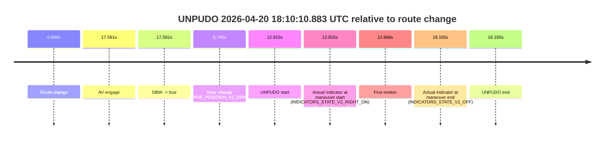

# Run Report: fme20038/2026-04-20--18-04-59--gen2-av-71f20556-6d74-4553-9f80-2c44392b02ea

| Field | Value |
|---|---|
| Run ID | `fme20038/2026-04-20--18-04-59--gen2-av-71f20556-6d74-4553-9f80-2c44392b02ea` |
| Date | `2026-04-20` |
| Model(s) | `pink-manta-ray-smooth` |
| Author | `guy.geva` |
| Event count | `1` |

## unpudo 2026-04-20 18:10:10.883 UTC

| Field | Value |
|---|---|
| Model | `pink-manta-ray-smooth` |
| Author | `guy.geva` |
| Run ID | `fme20038/2026-04-20--18-04-59--gen2-av-71f20556-6d74-4553-9f80-2c44392b02ea` |
| Date | `2026-04-20` |
| Time (UTC) | `18:10:10.883` |
| Event type | `unpudo` |
| Disengagement type | `none observed` |
| Route change | `found` |
| Console | [run](https://console.sso.wayve.ai/run/fme20038/2026-04-20--18-04-59--gen2-av-71f20556-6d74-4553-9f80-2c44392b02ea?id=&time-unixus=1776708610883315) |
| Foxglove | [segment](https://app.foxglove.dev/wayve-on-prem/p/prj_0dX18KZdVHg1fmmI/view?ds=foxglove-stream&ds.deviceName=fme20038&ds.start=2026-04-20T18%3A09%3A48.068647Z&ds.end=2026-04-20T18%3A10%3A24.233311Z&layoutId=lay_0e7VD4WIKDQGU73Y&time=2026-04-20T18%3A10%3A10.883315Z) |

### Event card: accidental

- Accidental: AV ownership is present for less than `2s`, so this is treated as an accidental brush with the maneuver rather than a meaningful model attempt.

| Event | Time (UTC) | Delta from route change |
|---|---:|---:|
| Route change | 2026-04-20 18:09:58.068 | `0.000s` |
| AV engage | 2026-04-20 18:10:15.659 | `17.591s` |
| DBW -> true | 2026-04-20 18:10:15.659 | `17.591s` |
| Gear change (DRIVE_POSITION_V2_DRIVE) | 2026-04-20 18:10:04.833 | `6.765s` |
| UNPUDO start | 2026-04-20 18:10:10.883 | `12.815s` |
| Actual indicator at maneuver start (INDICATORS_STATE_V2_RIGHT_ON) | 2026-04-20 18:10:10.883 | `12.815s` |
| First motion | 2026-04-20 18:10:10.936 | `12.868s` |
| Actual indicator at maneuver end (INDICATORS_STATE_V2_OFF) | 2026-04-20 18:10:14.233 | `16.165s` |
| UNPUDO end | 2026-04-20 18:10:14.233 | `16.165s` |

| Metric | Value |
|---|---|
| Outcome | `accidental` |
| Effective failure type | `none` |
| Route change status | `found` |
| DBW at event start | `false` |
| DBW at event end | `false` |
| Predicted gear at AV start | `DRIVE_POSITION_V2_DRIVE` |
| Actual gear at AV start | `DRIVE_POSITION_V2_DRIVE` |
| Predicted gear at event start | `DRIVE_POSITION_V2_DRIVE` |
| Actual gear at event start | `DRIVE_POSITION_V2_DRIVE` |
| Planned indicator direction | `INDICATORS_STATE_V2_OFF` |
| Controller indicator direction | `INDICATORS_STATE_V2_OFF` |
| Actual indicator direction | `INDICATORS_STATE_V2_RIGHT_ON` |
| Actual indicator at maneuver end | `INDICATORS_STATE_V2_OFF` |
| Driver accel help in AV | `false` |
| Driver accel help timestamp | `n/a` |
| Max accel pedal pct in AV | `0.0%` |
| Max brake pedal pct in AV | `0.0%` |
| Max speed mps in AV | `0.000` |
| Route -> AV | `17.591s` |
| AV -> event start | `-4.776s` |
| AV -> first motion | `-4.723s` |
| AV duration before disengagement | `n/a` |
| Trajectory waypoint count | `37` |
| Driving-plan step count | `11` |

The scored portion starts from the AV-owned window, not from the pre-AV setup. Route-change search in the stopped pre-event segment was `found`, with the baseline therefore set to route change. At the event anchor the model predicts `DRIVE_POSITION_V2_DRIVE` and the actual gear is `DRIVE_POSITION_V2_DRIVE`. The effective model outcome is `accidental` because `the AV-owned portion is shorter than 2s`.

### Resolution

| Field | Value |
|---|---|
| Final outcome | `accidental` |
| Do we agree with this label? | `yes` |
| Source disengagement type | `none observed` |
| Resolved effective failure type | `none` |
| Confidence | `high` |
