# Run Report: fme20038/2026-04-20--20-14-14--gen2-av-64bfb241-2a77-49b3-9a73-b3fb4cc1406d

| Field | Value |
|---|---|
| Run ID | `fme20038/2026-04-20--20-14-14--gen2-av-64bfb241-2a77-49b3-9a73-b3fb4cc1406d` |
| Date | `2026-04-20` |
| Model(s) | `pink-manta-ray-smooth` |
| Author | `guy.geva` |
| Event count | `13` |

## unpudo 2026-04-20 20:20:23.133 UTC

| Field | Value |
|---|---|
| Model | `pink-manta-ray-smooth` |
| Author | `guy.geva` |
| Run ID | `fme20038/2026-04-20--20-14-14--gen2-av-64bfb241-2a77-49b3-9a73-b3fb4cc1406d` |
| Date | `2026-04-20` |
| Time (UTC) | `20:20:23.133` |
| Event type | `unpudo` |
| Disengagement type | `none observed` |
| Route change | `found` |
| Console | [run](https://console.sso.wayve.ai/run/fme20038/2026-04-20--20-14-14--gen2-av-64bfb241-2a77-49b3-9a73-b3fb4cc1406d?id=&time-unixus=1776716423133309) |
| Foxglove | [segment](https://app.foxglove.dev/wayve-on-prem/p/prj_0dX18KZdVHg1fmmI/view?ds=foxglove-stream&ds.deviceName=fme20038&ds.start=2026-04-20T20%3A20%3A06.168365Z&ds.end=2026-04-20T20%3A25%3A16.628668Z&layoutId=lay_0e7VD4WIKDQGU73Y&time=2026-04-20T20%3A20%3A23.133309Z) |

### Event card: pass

- Pass: AV owns the credited unpudo from route change through the official unpudo window, the gear state is aligned at the anchor, and the vehicle moves without driver accelerator help in AV.

| Event | Time (UTC) | Delta from route change |
|---|---:|---:|
| Actual indicator already left on | 2026-04-20 20:20:06.184 | `-9.984s` |
| Actual indicator -> off | 2026-04-20 20:20:08.384 | `-7.784s` |
| Route change | 2026-04-20 20:20:16.168 | `0.000s` |
| AV engage | 2026-04-20 20:20:19.127 | `2.960s` |
| DBW -> true | 2026-04-20 20:20:19.127 | `2.960s` |
| Gear change (DRIVE_POSITION_V2_DRIVE) | 2026-04-20 20:20:19.633 | `3.465s` |
| UNPUDO start | 2026-04-20 20:20:23.133 | `6.965s` |
| DBW at event start (true) | 2026-04-20 20:20:23.133 | `6.965s` |
| First motion | 2026-04-20 20:20:23.164 | `6.996s` |
| DBW at event end (true) | 2026-04-20 20:20:26.533 | `10.365s` |
| UNPUDO end | 2026-04-20 20:20:26.533 | `10.365s` |
| DBW -> false | 2026-04-20 20:25:06.628 | `290.460s` |
| Actual indicator -> left on | 2026-04-20 20:25:23.644 | `307.476s` |

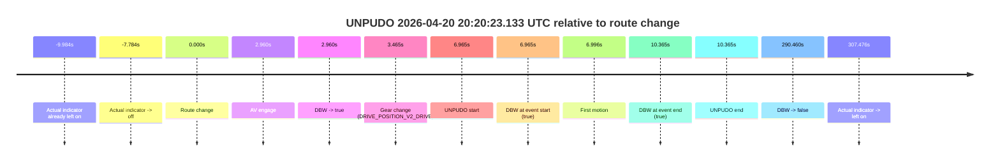

| Metric | Value |
|---|---|
| Outcome | `pass` |
| Effective failure type | `none` |
| Route change status | `found` |
| DBW at event start | `true` |
| DBW at event end | `true` |
| Predicted gear at AV start | `DRIVE_POSITION_V2_DRIVE` |
| Actual gear at AV start | `DRIVE_POSITION_V2_PARK` |
| Predicted gear at event start | `DRIVE_POSITION_V2_DRIVE` |
| Actual gear at event start | `DRIVE_POSITION_V2_DRIVE` |
| Planned indicator direction | `INDICATORS_STATE_V2_RIGHT_ON` |
| Controller indicator direction | `INDICATORS_STATE_V2_RIGHT_ON` |
| Actual indicator direction | `INDICATORS_STATE_V2_OFF` |
| Actual indicator at maneuver end | `INDICATORS_STATE_V2_OFF` |
| Driver accel help in AV | `false` |
| Driver accel help timestamp | `n/a` |
| Max accel pedal pct in AV | `0.0%` |
| Max brake pedal pct in AV | `8.0%` |
| Max speed mps in AV | `5.044` |
| Success timing baseline | `route change` |
| Route -> AV | `2.960s` |
| AV -> event start | `4.005s` |
| AV -> first motion | `4.036s` |
| Success baseline -> event start | `6.965s` |
| Success baseline -> first motion | `6.996s` |
| AV duration before disengagement | `287.501s` |
| Trajectory waypoint count | `37` |
| Driving-plan step count | `11` |

The scored portion starts from the AV-owned window, not from the pre-AV setup. Route-change search in the stopped pre-event segment was `found`, with the baseline therefore set to route change. At the event anchor the model predicts `DRIVE_POSITION_V2_DRIVE` and the actual gear is `DRIVE_POSITION_V2_DRIVE`. The effective model outcome is `pass` because `the credited unpudo stays AV-owned through the official unpudo window.`

### Resolution

| Field | Value |
|---|---|
| Final outcome | `pass` |
| Do we agree with this label? | `yes` |
| Source disengagement type | `none observed` |
| Resolved effective failure type | `none` |
| Confidence | `high` |

## unpudo 2026-04-20 20:25:29.983 UTC

| Field | Value |
|---|---|
| Model | `pink-manta-ray-smooth` |
| Author | `guy.geva` |
| Run ID | `fme20038/2026-04-20--20-14-14--gen2-av-64bfb241-2a77-49b3-9a73-b3fb4cc1406d` |
| Date | `2026-04-20` |
| Time (UTC) | `20:25:29.983` |
| Event type | `unpudo` |
| Disengagement type | `none observed` |
| Route change | `found` |
| Console | [run](https://console.sso.wayve.ai/run/fme20038/2026-04-20--20-14-14--gen2-av-64bfb241-2a77-49b3-9a73-b3fb4cc1406d?id=&time-unixus=1776716729983305) |
| Foxglove | [segment](https://app.foxglove.dev/wayve-on-prem/p/prj_0dX18KZdVHg1fmmI/view?ds=foxglove-stream&ds.deviceName=fme20038&ds.start=2026-04-20T20%3A25%3A03.668272Z&ds.end=2026-04-20T20%3A25%3A45.283301Z&layoutId=lay_0e7VD4WIKDQGU73Y&time=2026-04-20T20%3A25%3A29.983305Z) |

### Event card: fail

- Fail: the credited unpudo does not stay AV-owned. The event window starts with DBW false, and the maneuver outcome lands outside a clean AV-owned segment.

| Event | Time (UTC) | Delta from route change |
|---|---:|---:|
| Route change | 2026-04-20 20:25:13.668 | `0.000s` |
| AV engage | 2026-04-20 20:25:16.527 | `2.860s` |
| DBW -> true | 2026-04-20 20:25:16.527 | `2.860s` |
| Gear change (DRIVE_POSITION_V2_DRIVE) | 2026-04-20 20:25:17.033 | `3.365s` |
| Actual indicator -> left on | 2026-04-20 20:25:23.644 | `9.976s` |
| DBW -> false | 2026-04-20 20:25:27.908 | `14.240s` |
| UNPUDO start | 2026-04-20 20:25:29.983 | `16.315s` |
| DBW at event start (false) | 2026-04-20 20:25:29.983 | `16.315s` |
| Actual indicator -> off | 2026-04-20 20:25:33.004 | `19.336s` |
| DBW at event end (false) | 2026-04-20 20:25:35.283 | `21.615s` |
| UNPUDO end | 2026-04-20 20:25:35.283 | `21.615s` |

| Metric | Value |
|---|---|
| Outcome | `fail` |
| Effective failure type | `not_av_owned` |
| Route change status | `found` |
| DBW at event start | `false` |
| DBW at event end | `false` |
| Predicted gear at AV start | `DRIVE_POSITION_V2_DRIVE` |
| Actual gear at AV start | `DRIVE_POSITION_V2_PARK` |
| Predicted gear at event start | `DRIVE_POSITION_V2_DRIVE` |
| Actual gear at event start | `DRIVE_POSITION_V2_DRIVE` |
| Planned indicator direction | `INDICATORS_STATE_V2_LEFT_ON` |
| Controller indicator direction | `INDICATORS_STATE_V2_LEFT_ON` |
| Actual indicator direction | `INDICATORS_STATE_V2_LEFT_ON` |
| Actual indicator at maneuver end | `INDICATORS_STATE_V2_OFF` |
| Driver accel help in AV | `false` |
| Driver accel help timestamp | `n/a` |
| Max accel pedal pct in AV | `0.0%` |
| Max brake pedal pct in AV | `8.0%` |
| Max speed mps in AV | `0.000` |
| Success timing baseline | `route change` |
| Route -> AV | `2.860s` |
| AV -> event start | `13.455s` |
| AV -> first motion | `n/a` |
| Success baseline -> event start | `16.315s` |
| Success baseline -> first motion | `n/a` |
| AV duration before disengagement | `11.380s` |
| Trajectory waypoint count | `36` |
| Driving-plan step count | `11` |

The scored portion starts from the AV-owned window, not from the pre-AV setup. Route-change search in the stopped pre-event segment was `found`, with the baseline therefore set to route change. At the event anchor the model predicts `DRIVE_POSITION_V2_DRIVE` and the actual gear is `DRIVE_POSITION_V2_DRIVE`. The effective model outcome is `fail` because `not_av_owned.`

### Resolution

| Field | Value |
|---|---|
| Final outcome | `fail` |
| Do we agree with this label? | `yes` |
| Source disengagement type | `none observed` |
| Resolved effective failure type | `not_av_owned` |
| Confidence | `high` |

## unpudo 2026-04-20 20:33:36.783 UTC

| Field | Value |
|---|---|
| Model | `pink-manta-ray-smooth` |
| Author | `guy.geva` |
| Run ID | `fme20038/2026-04-20--20-14-14--gen2-av-64bfb241-2a77-49b3-9a73-b3fb4cc1406d` |
| Date | `2026-04-20` |
| Time (UTC) | `20:33:36.783` |
| Event type | `unpudo` |
| Disengagement type | `none observed` |
| Route change | `found` |
| Console | [run](https://console.sso.wayve.ai/run/fme20038/2026-04-20--20-14-14--gen2-av-64bfb241-2a77-49b3-9a73-b3fb4cc1406d?id=&time-unixus=1776717216783289) |
| Foxglove | [segment](https://app.foxglove.dev/wayve-on-prem/p/prj_0dX18KZdVHg1fmmI/view?ds=foxglove-stream&ds.deviceName=fme20038&ds.start=2026-04-20T20%3A33%3A14.418350Z&ds.end=2026-04-20T20%3A35%3A11.767758Z&layoutId=lay_0e7VD4WIKDQGU73Y&time=2026-04-20T20%3A33%3A36.783289Z) |

### Event card: pass

- Pass: AV owns the credited unpudo from route change through the official unpudo window, the gear state is aligned at the anchor, and the vehicle moves without driver accelerator help in AV.

| Event | Time (UTC) | Delta from route change |
|---|---:|---:|
| Route change | 2026-04-20 20:33:24.418 | `0.000s` |
| AV engage | 2026-04-20 20:33:32.787 | `8.370s` |
| DBW -> true | 2026-04-20 20:33:32.787 | `8.370s` |
| Gear change (DRIVE_POSITION_V2_DRIVE) | 2026-04-20 20:33:33.233 | `8.815s` |
| Actual indicator -> right on | 2026-04-20 20:33:34.385 | `9.967s` |
| UNPUDO start | 2026-04-20 20:33:36.783 | `12.365s` |
| DBW at event start (true) | 2026-04-20 20:33:36.783 | `12.365s` |
| First motion | 2026-04-20 20:33:36.804 | `12.386s` |
| Actual indicator -> off | 2026-04-20 20:33:39.485 | `15.067s` |
| DBW at event end (true) | 2026-04-20 20:33:40.033 | `15.615s` |
| UNPUDO end | 2026-04-20 20:33:40.033 | `15.615s` |
| DBW -> false | 2026-04-20 20:35:01.767 | `97.349s` |

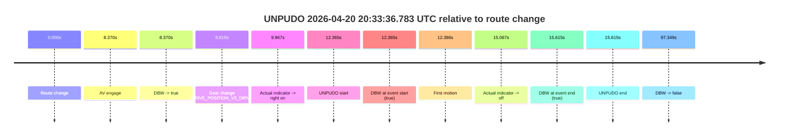

| Metric | Value |
|---|---|
| Outcome | `pass` |
| Effective failure type | `none` |
| Route change status | `found` |
| DBW at event start | `true` |
| DBW at event end | `true` |
| Predicted gear at AV start | `DRIVE_POSITION_V2_DRIVE` |
| Actual gear at AV start | `DRIVE_POSITION_V2_PARK` |
| Predicted gear at event start | `DRIVE_POSITION_V2_DRIVE` |
| Actual gear at event start | `DRIVE_POSITION_V2_DRIVE` |
| Planned indicator direction | `INDICATORS_STATE_V2_RIGHT_ON` |
| Controller indicator direction | `INDICATORS_STATE_V2_RIGHT_ON` |
| Actual indicator direction | `INDICATORS_STATE_V2_RIGHT_ON` |
| Actual indicator at maneuver end | `INDICATORS_STATE_V2_OFF` |
| Driver accel help in AV | `false` |
| Driver accel help timestamp | `n/a` |
| Max accel pedal pct in AV | `0.0%` |
| Max brake pedal pct in AV | `8.0%` |
| Max speed mps in AV | `5.442` |
| Success timing baseline | `route change` |
| Route -> AV | `8.370s` |
| AV -> event start | `3.995s` |
| AV -> first motion | `4.016s` |
| Success baseline -> event start | `12.365s` |
| Success baseline -> first motion | `12.386s` |
| AV duration before disengagement | `88.980s` |
| Trajectory waypoint count | `36` |
| Driving-plan step count | `11` |

The scored portion starts from the AV-owned window, not from the pre-AV setup. Route-change search in the stopped pre-event segment was `found`, with the baseline therefore set to route change. At the event anchor the model predicts `DRIVE_POSITION_V2_DRIVE` and the actual gear is `DRIVE_POSITION_V2_DRIVE`. The effective model outcome is `pass` because `the credited unpudo stays AV-owned through the official unpudo window.`

### Resolution

| Field | Value |
|---|---|
| Final outcome | `pass` |
| Do we agree with this label? | `yes` |
| Source disengagement type | `none observed` |
| Resolved effective failure type | `none` |
| Confidence | `high` |

## unpudo 2026-04-20 20:35:19.233 UTC

| Field | Value |
|---|---|
| Model | `pink-manta-ray-smooth` |
| Author | `guy.geva` |
| Run ID | `fme20038/2026-04-20--20-14-14--gen2-av-64bfb241-2a77-49b3-9a73-b3fb4cc1406d` |
| Date | `2026-04-20` |
| Time (UTC) | `20:35:19.233` |
| Event type | `unpudo` |
| Disengagement type | `none observed` |
| Route change | `found` |
| Console | [run](https://console.sso.wayve.ai/run/fme20038/2026-04-20--20-14-14--gen2-av-64bfb241-2a77-49b3-9a73-b3fb4cc1406d?id=&time-unixus=1776717319233313) |
| Foxglove | [segment](https://app.foxglove.dev/wayve-on-prem/p/prj_0dX18KZdVHg1fmmI/view?ds=foxglove-stream&ds.deviceName=fme20038&ds.start=2026-04-20T20%3A33%3A14.418350Z&ds.end=2026-04-20T20%3A35%3A32.867845Z&layoutId=lay_0e7VD4WIKDQGU73Y&time=2026-04-20T20%3A35%3A19.233313Z) |

### Event card: pass

- Pass: AV owns the credited unpudo from route change through the official unpudo window, the gear state is aligned at the anchor, and the vehicle moves without driver accelerator help in AV.

| Event | Time (UTC) | Delta from route change |
|---|---:|---:|
| Route change | 2026-04-20 20:33:24.418 | `0.000s` |
| Actual indicator -> right on | 2026-04-20 20:33:34.385 | `9.967s` |
| First motion | 2026-04-20 20:33:36.804 | `12.386s` |
| Actual indicator -> off | 2026-04-20 20:33:39.485 | `15.067s` |
| AV engage | 2026-04-20 20:35:15.147 | `110.730s` |
| DBW -> true | 2026-04-20 20:35:15.147 | `110.730s` |
| Gear change (DRIVE_POSITION_V2_DRIVE) | 2026-04-20 20:35:15.533 | `111.115s` |
| UNPUDO start | 2026-04-20 20:35:19.233 | `114.815s` |
| DBW at event start (true) | 2026-04-20 20:35:19.233 | `114.815s` |
| DBW at event end (true) | 2026-04-20 20:35:22.683 | `118.265s` |
| UNPUDO end | 2026-04-20 20:35:22.683 | `118.265s` |
| DBW -> false | 2026-04-20 20:35:22.867 | `118.449s` |
| Actual indicator -> left on | 2026-04-20 20:35:24.384 | `119.966s` |
| Actual indicator -> off | 2026-04-20 20:35:26.284 | `121.866s` |

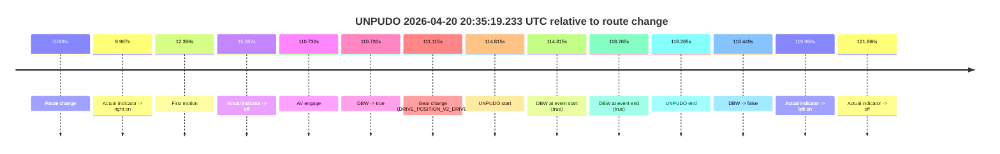

| Metric | Value |
|---|---|
| Outcome | `pass` |
| Effective failure type | `none` |
| Route change status | `found` |
| DBW at event start | `true` |
| DBW at event end | `true` |
| Predicted gear at AV start | `DRIVE_POSITION_V2_DRIVE` |
| Actual gear at AV start | `DRIVE_POSITION_V2_PARK` |
| Predicted gear at event start | `DRIVE_POSITION_V2_DRIVE` |
| Actual gear at event start | `DRIVE_POSITION_V2_DRIVE` |
| Planned indicator direction | `INDICATORS_STATE_V2_RIGHT_ON` |
| Controller indicator direction | `INDICATORS_STATE_V2_RIGHT_ON` |
| Actual indicator direction | `INDICATORS_STATE_V2_OFF` |
| Actual indicator at maneuver end | `INDICATORS_STATE_V2_OFF` |
| Driver accel help in AV | `false` |
| Driver accel help timestamp | `n/a` |
| Max accel pedal pct in AV | `0.0%` |
| Max brake pedal pct in AV | `8.0%` |
| Max speed mps in AV | `5.347` |
| Success timing baseline | `route change` |
| Route -> AV | `110.730s` |
| AV -> event start | `4.085s` |
| AV -> first motion | `-98.344s` |
| Success baseline -> event start | `114.815s` |
| Success baseline -> first motion | `12.386s` |
| AV duration before disengagement | `7.720s` |
| Trajectory waypoint count | `37` |
| Driving-plan step count | `11` |

The scored portion starts from the AV-owned window, not from the pre-AV setup. Route-change search in the stopped pre-event segment was `found`, with the baseline therefore set to route change. At the event anchor the model predicts `DRIVE_POSITION_V2_DRIVE` and the actual gear is `DRIVE_POSITION_V2_DRIVE`. The effective model outcome is `pass` because `the credited unpudo stays AV-owned through the official unpudo window.`

### Resolution

| Field | Value |
|---|---|
| Final outcome | `pass` |
| Do we agree with this label? | `yes` |
| Source disengagement type | `none observed` |
| Resolved effective failure type | `none` |
| Confidence | `high` |

## unpudo 2026-04-20 20:37:14.133 UTC

| Field | Value |
|---|---|
| Model | `pink-manta-ray-smooth` |
| Author | `guy.geva` |
| Run ID | `fme20038/2026-04-20--20-14-14--gen2-av-64bfb241-2a77-49b3-9a73-b3fb4cc1406d` |
| Date | `2026-04-20` |
| Time (UTC) | `20:37:14.133` |
| Event type | `unpudo` |
| Disengagement type | `none observed` |
| Route change | `found` |
| Console | [run](https://console.sso.wayve.ai/run/fme20038/2026-04-20--20-14-14--gen2-av-64bfb241-2a77-49b3-9a73-b3fb4cc1406d?id=&time-unixus=1776717434133309) |
| Foxglove | [segment](https://app.foxglove.dev/wayve-on-prem/p/prj_0dX18KZdVHg1fmmI/view?ds=foxglove-stream&ds.deviceName=fme20038&ds.start=2026-04-20T20%3A36%3A53.668261Z&ds.end=2026-04-20T20%3A37%3A28.533320Z&layoutId=lay_0e7VD4WIKDQGU73Y&time=2026-04-20T20%3A37%3A14.133309Z) |

### Event card: fail

- Fail: the credited unpudo does not stay AV-owned. The event window starts with DBW false, and the maneuver outcome lands outside a clean AV-owned segment.

| Event | Time (UTC) | Delta from route change |
|---|---:|---:|
| Route change | 2026-04-20 20:37:03.668 | `0.000s` |
| AV engage | 2026-04-20 20:37:07.147 | `3.480s` |
| DBW -> true | 2026-04-20 20:37:07.147 | `3.480s` |
| Gear change (DRIVE_POSITION_V2_DRIVE) | 2026-04-20 20:37:07.533 | `3.865s` |
| Actual indicator -> right on | 2026-04-20 20:37:11.804 | `8.136s` |
| DBW -> false | 2026-04-20 20:37:13.188 | `9.520s` |
| UNPUDO start | 2026-04-20 20:37:14.133 | `10.465s` |
| DBW at event start (false) | 2026-04-20 20:37:14.133 | `10.465s` |
| Actual indicator -> off | 2026-04-20 20:37:16.284 | `12.616s` |
| DBW at event end (false) | 2026-04-20 20:37:18.533 | `14.865s` |
| UNPUDO end | 2026-04-20 20:37:18.533 | `14.865s` |

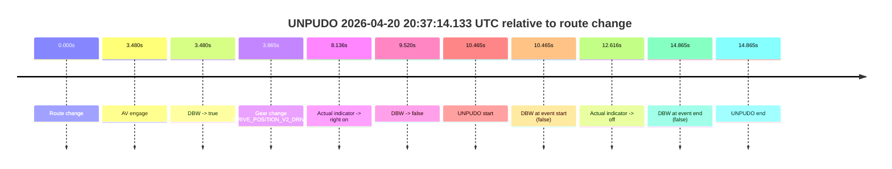

| Metric | Value |
|---|---|
| Outcome | `fail` |
| Effective failure type | `not_av_owned` |
| Route change status | `found` |
| DBW at event start | `false` |
| DBW at event end | `false` |
| Predicted gear at AV start | `DRIVE_POSITION_V2_DRIVE` |
| Actual gear at AV start | `DRIVE_POSITION_V2_PARK` |
| Predicted gear at event start | `DRIVE_POSITION_V2_DRIVE` |
| Actual gear at event start | `DRIVE_POSITION_V2_DRIVE` |
| Planned indicator direction | `INDICATORS_STATE_V2_RIGHT_ON` |
| Controller indicator direction | `INDICATORS_STATE_V2_RIGHT_ON` |
| Actual indicator direction | `INDICATORS_STATE_V2_RIGHT_ON` |
| Actual indicator at maneuver end | `INDICATORS_STATE_V2_OFF` |
| Driver accel help in AV | `false` |
| Driver accel help timestamp | `n/a` |
| Max accel pedal pct in AV | `0.0%` |
| Max brake pedal pct in AV | `8.0%` |
| Max speed mps in AV | `0.000` |
| Success timing baseline | `route change` |
| Route -> AV | `3.480s` |
| AV -> event start | `6.985s` |
| AV -> first motion | `n/a` |
| Success baseline -> event start | `10.465s` |
| Success baseline -> first motion | `n/a` |
| AV duration before disengagement | `6.041s` |
| Trajectory waypoint count | `37` |
| Driving-plan step count | `11` |

The scored portion starts from the AV-owned window, not from the pre-AV setup. Route-change search in the stopped pre-event segment was `found`, with the baseline therefore set to route change. At the event anchor the model predicts `DRIVE_POSITION_V2_DRIVE` and the actual gear is `DRIVE_POSITION_V2_DRIVE`. The effective model outcome is `fail` because `not_av_owned.`

### Resolution

| Field | Value |
|---|---|
| Final outcome | `fail` |
| Do we agree with this label? | `yes` |
| Source disengagement type | `none observed` |
| Resolved effective failure type | `not_av_owned` |
| Confidence | `high` |

## unpudo 2026-04-20 20:39:23.433 UTC

| Field | Value |
|---|---|
| Model | `pink-manta-ray-smooth` |
| Author | `guy.geva` |
| Run ID | `fme20038/2026-04-20--20-14-14--gen2-av-64bfb241-2a77-49b3-9a73-b3fb4cc1406d` |
| Date | `2026-04-20` |
| Time (UTC) | `20:39:23.433` |
| Event type | `unpudo` |
| Disengagement type | `none observed` |
| Route change | `found` |
| Console | [run](https://console.sso.wayve.ai/run/fme20038/2026-04-20--20-14-14--gen2-av-64bfb241-2a77-49b3-9a73-b3fb4cc1406d?id=&time-unixus=1776717563433298) |
| Foxglove | [segment](https://app.foxglove.dev/wayve-on-prem/p/prj_0dX18KZdVHg1fmmI/view?ds=foxglove-stream&ds.deviceName=fme20038&ds.start=2026-04-20T20%3A39%3A08.818264Z&ds.end=2026-04-20T20%3A43%3A29.868589Z&layoutId=lay_0e7VD4WIKDQGU73Y&time=2026-04-20T20%3A39%3A23.433298Z) |

### Event card: pass

- Pass: AV owns the credited unpudo from route change through the official unpudo window, the gear state is aligned at the anchor, and the vehicle moves without driver accelerator help in AV.

| Event | Time (UTC) | Delta from route change |
|---|---:|---:|
| Route change | 2026-04-20 20:39:18.818 | `0.000s` |
| AV engage | 2026-04-20 20:39:18.827 | `0.010s` |
| DBW -> true | 2026-04-20 20:39:18.827 | `0.010s` |
| Gear change (DRIVE_POSITION_V2_DRIVE) | 2026-04-20 20:39:19.133 | `0.315s` |
| UNPUDO start | 2026-04-20 20:39:23.433 | `4.615s` |
| DBW at event start (true) | 2026-04-20 20:39:23.433 | `4.615s` |
| First motion | 2026-04-20 20:39:23.484 | `4.667s` |
| DBW at event end (true) | 2026-04-20 20:39:26.933 | `8.115s` |
| UNPUDO end | 2026-04-20 20:39:26.933 | `8.115s` |
| DBW -> false | 2026-04-20 20:43:19.868 | `241.050s` |
| Actual indicator -> left on | 2026-04-20 20:43:20.624 | `241.806s` |
| Actual indicator -> off | 2026-04-20 20:43:24.464 | `245.647s` |

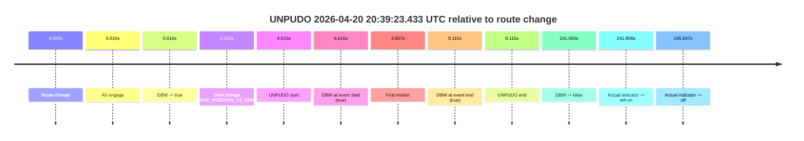

| Metric | Value |
|---|---|
| Outcome | `pass` |
| Effective failure type | `none` |
| Route change status | `found` |
| DBW at event start | `true` |
| DBW at event end | `true` |
| Predicted gear at AV start | `DRIVE_POSITION_V2_PARK` |
| Actual gear at AV start | `DRIVE_POSITION_V2_PARK` |
| Predicted gear at event start | `DRIVE_POSITION_V2_DRIVE` |
| Actual gear at event start | `DRIVE_POSITION_V2_DRIVE` |
| Planned indicator direction | `INDICATORS_STATE_V2_RIGHT_ON` |
| Controller indicator direction | `INDICATORS_STATE_V2_RIGHT_ON` |
| Actual indicator direction | `INDICATORS_STATE_V2_OFF` |
| Actual indicator at maneuver end | `INDICATORS_STATE_V2_OFF` |
| Driver accel help in AV | `false` |
| Driver accel help timestamp | `n/a` |
| Max accel pedal pct in AV | `0.0%` |
| Max brake pedal pct in AV | `8.0%` |
| Max speed mps in AV | `4.886` |
| Success timing baseline | `route change` |
| Route -> AV | `0.010s` |
| AV -> event start | `4.605s` |
| AV -> first motion | `4.657s` |
| Success baseline -> event start | `4.615s` |
| Success baseline -> first motion | `4.667s` |
| AV duration before disengagement | `241.041s` |
| Trajectory waypoint count | `37` |
| Driving-plan step count | `11` |

The scored portion starts from the AV-owned window, not from the pre-AV setup. Route-change search in the stopped pre-event segment was `found`, with the baseline therefore set to route change. At the event anchor the model predicts `DRIVE_POSITION_V2_DRIVE` and the actual gear is `DRIVE_POSITION_V2_DRIVE`. The effective model outcome is `pass` because `the credited unpudo stays AV-owned through the official unpudo window.`

### Resolution

| Field | Value |
|---|---|
| Final outcome | `pass` |
| Do we agree with this label? | `yes` |
| Source disengagement type | `none observed` |
| Resolved effective failure type | `none` |
| Confidence | `high` |

## unpudo 2026-04-20 20:44:45.083 UTC

| Field | Value |
|---|---|
| Model | `pink-manta-ray-smooth` |
| Author | `guy.geva` |
| Run ID | `fme20038/2026-04-20--20-14-14--gen2-av-64bfb241-2a77-49b3-9a73-b3fb4cc1406d` |
| Date | `2026-04-20` |
| Time (UTC) | `20:44:45.083` |
| Event type | `unpudo` |
| Disengagement type | `none observed` |
| Route change | `found` |
| Console | [run](https://console.sso.wayve.ai/run/fme20038/2026-04-20--20-14-14--gen2-av-64bfb241-2a77-49b3-9a73-b3fb4cc1406d?id=&time-unixus=1776717885083290) |
| Foxglove | [segment](https://app.foxglove.dev/wayve-on-prem/p/prj_0dX18KZdVHg1fmmI/view?ds=foxglove-stream&ds.deviceName=fme20038&ds.start=2026-04-20T20%3A42%3A45.768266Z&ds.end=2026-04-20T20%3A46%3A19.168320Z&layoutId=lay_0e7VD4WIKDQGU73Y&time=2026-04-20T20%3A44%3A45.083290Z) |

### Event card: pass

- Pass: AV owns the credited unpudo from route change through the official unpudo window, the gear state is aligned at the anchor, and the vehicle moves without driver accelerator help in AV.

| Event | Time (UTC) | Delta from route change |
|---|---:|---:|
| Route change | 2026-04-20 20:42:55.768 | `0.000s` |
| First motion | 2026-04-20 20:42:59.664 | `3.896s` |
| Actual indicator -> left on | 2026-04-20 20:43:20.624 | `24.856s` |
| Actual indicator -> off | 2026-04-20 20:43:24.464 | `28.697s` |
| AV engage | 2026-04-20 20:43:28.287 | `32.520s` |
| DBW -> true | 2026-04-20 20:43:28.287 | `32.520s` |
| Actual indicator -> left on | 2026-04-20 20:44:22.984 | `87.216s` |
| Actual indicator -> off | 2026-04-20 20:44:24.865 | `89.097s` |
| Gear change (DRIVE_POSITION_V2_DRIVE) | 2026-04-20 20:44:39.133 | `103.365s` |
| UNPUDO start | 2026-04-20 20:44:45.083 | `109.315s` |
| DBW at event start (true) | 2026-04-20 20:44:45.083 | `109.315s` |
| DBW at event end (true) | 2026-04-20 20:44:48.583 | `112.815s` |
| UNPUDO end | 2026-04-20 20:44:48.583 | `112.815s` |
| Actual indicator -> right on | 2026-04-20 20:46:06.864 | `191.096s` |
| DBW -> false | 2026-04-20 20:46:09.168 | `193.400s` |
| Actual indicator -> off | 2026-04-20 20:46:16.264 | `200.496s` |

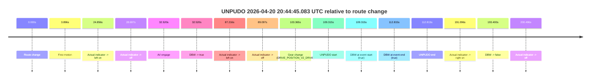

| Metric | Value |
|---|---|
| Outcome | `pass` |
| Effective failure type | `none` |
| Route change status | `found` |
| DBW at event start | `true` |
| DBW at event end | `true` |
| Predicted gear at AV start | `DRIVE_POSITION_V2_DRIVE` |
| Actual gear at AV start | `DRIVE_POSITION_V2_DRIVE` |
| Predicted gear at event start | `DRIVE_POSITION_V2_DRIVE` |
| Actual gear at event start | `DRIVE_POSITION_V2_DRIVE` |
| Planned indicator direction | `INDICATORS_STATE_V2_RIGHT_ON` |
| Controller indicator direction | `INDICATORS_STATE_V2_RIGHT_ON` |
| Actual indicator direction | `INDICATORS_STATE_V2_OFF` |
| Actual indicator at maneuver end | `INDICATORS_STATE_V2_OFF` |
| Driver accel help in AV | `false` |
| Driver accel help timestamp | `n/a` |
| Max accel pedal pct in AV | `0.0%` |
| Max brake pedal pct in AV | `8.0%` |
| Max speed mps in AV | `8.108` |
| Success timing baseline | `route change` |
| Route -> AV | `32.520s` |
| AV -> event start | `76.796s` |
| AV -> first motion | `-28.623s` |
| Success baseline -> event start | `109.315s` |
| Success baseline -> first motion | `3.896s` |
| AV duration before disengagement | `160.881s` |
| Trajectory waypoint count | `36` |
| Driving-plan step count | `11` |

The scored portion starts from the AV-owned window, not from the pre-AV setup. Route-change search in the stopped pre-event segment was `found`, with the baseline therefore set to route change. At the event anchor the model predicts `DRIVE_POSITION_V2_DRIVE` and the actual gear is `DRIVE_POSITION_V2_DRIVE`. The effective model outcome is `pass` because `the credited unpudo stays AV-owned through the official unpudo window.`

### Resolution

| Field | Value |
|---|---|
| Final outcome | `pass` |
| Do we agree with this label? | `yes` |
| Source disengagement type | `none observed` |
| Resolved effective failure type | `none` |
| Confidence | `high` |

## unpudo 2026-04-20 20:46:09.933 UTC

| Field | Value |
|---|---|
| Model | `pink-manta-ray-smooth` |
| Author | `guy.geva` |
| Run ID | `fme20038/2026-04-20--20-14-14--gen2-av-64bfb241-2a77-49b3-9a73-b3fb4cc1406d` |
| Date | `2026-04-20` |
| Time (UTC) | `20:46:09.933` |
| Event type | `unpudo` |
| Disengagement type | `none observed` |
| Route change | `found` |
| Console | [run](https://console.sso.wayve.ai/run/fme20038/2026-04-20--20-14-14--gen2-av-64bfb241-2a77-49b3-9a73-b3fb4cc1406d?id=&time-unixus=1776717969933298) |
| Foxglove | [segment](https://app.foxglove.dev/wayve-on-prem/p/prj_0dX18KZdVHg1fmmI/view?ds=foxglove-stream&ds.deviceName=fme20038&ds.start=2026-04-20T20%3A44%3A28.818265Z&ds.end=2026-04-20T20%3A46%3A23.383302Z&layoutId=lay_0e7VD4WIKDQGU73Y&time=2026-04-20T20%3A46%3A09.933298Z) |

### Event card: fail

- Fail: the credited unpudo does not stay AV-owned. The event window starts with DBW false, and the maneuver outcome lands outside a clean AV-owned segment.

| Event | Time (UTC) | Delta from route change |
|---|---:|---:|
| Route change | 2026-04-20 20:44:38.818 | `0.000s` |
| AV engage | 2026-04-20 20:44:38.827 | `0.010s` |
| DBW -> true | 2026-04-20 20:44:38.827 | `0.010s` |
| First motion | 2026-04-20 20:44:45.164 | `6.346s` |
| Gear change (DRIVE_POSITION_V2_DRIVE) | 2026-04-20 20:46:02.933 | `84.115s` |
| Actual indicator -> right on | 2026-04-20 20:46:06.864 | `88.046s` |
| DBW -> false | 2026-04-20 20:46:09.168 | `90.350s` |
| UNPUDO start | 2026-04-20 20:46:09.933 | `91.115s` |
| DBW at event start (false) | 2026-04-20 20:46:09.933 | `91.115s` |
| DBW at event end (false) | 2026-04-20 20:46:13.383 | `94.565s` |
| UNPUDO end | 2026-04-20 20:46:13.383 | `94.565s` |
| Actual indicator -> off | 2026-04-20 20:46:16.264 | `97.446s` |

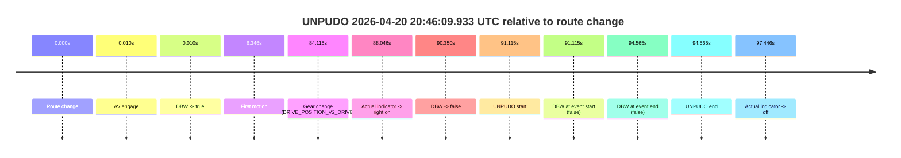

| Metric | Value |
|---|---|
| Outcome | `fail` |
| Effective failure type | `not_av_owned` |
| Route change status | `found` |
| DBW at event start | `false` |
| DBW at event end | `false` |
| Predicted gear at AV start | `DRIVE_POSITION_V2_PARK` |
| Actual gear at AV start | `DRIVE_POSITION_V2_PARK` |
| Predicted gear at event start | `DRIVE_POSITION_V2_DRIVE` |
| Actual gear at event start | `DRIVE_POSITION_V2_DRIVE` |
| Planned indicator direction | `INDICATORS_STATE_V2_RIGHT_ON` |
| Controller indicator direction | `INDICATORS_STATE_V2_RIGHT_ON` |
| Actual indicator direction | `INDICATORS_STATE_V2_RIGHT_ON` |
| Actual indicator at maneuver end | `INDICATORS_STATE_V2_RIGHT_ON` |
| Driver accel help in AV | `false` |
| Driver accel help timestamp | `n/a` |
| Max accel pedal pct in AV | `0.0%` |
| Max brake pedal pct in AV | `8.0%` |
| Max speed mps in AV | `8.433` |
| Success timing baseline | `route change` |
| Route -> AV | `0.010s` |
| AV -> event start | `91.105s` |
| AV -> first motion | `6.336s` |
| Success baseline -> event start | `91.115s` |
| Success baseline -> first motion | `6.346s` |
| AV duration before disengagement | `90.340s` |
| Trajectory waypoint count | `37` |
| Driving-plan step count | `11` |

The scored portion starts from the AV-owned window, not from the pre-AV setup. Route-change search in the stopped pre-event segment was `found`, with the baseline therefore set to route change. At the event anchor the model predicts `DRIVE_POSITION_V2_DRIVE` and the actual gear is `DRIVE_POSITION_V2_DRIVE`. The effective model outcome is `fail` because `not_av_owned.`

### Resolution

| Field | Value |
|---|---|
| Final outcome | `fail` |
| Do we agree with this label? | `yes` |
| Source disengagement type | `none observed` |
| Resolved effective failure type | `not_av_owned` |
| Confidence | `high` |

## unpudo 2026-04-20 20:53:08.533 UTC

| Field | Value |
|---|---|
| Model | `pink-manta-ray-smooth` |
| Author | `guy.geva` |
| Run ID | `fme20038/2026-04-20--20-14-14--gen2-av-64bfb241-2a77-49b3-9a73-b3fb4cc1406d` |
| Date | `2026-04-20` |
| Time (UTC) | `20:53:08.533` |
| Event type | `unpudo` |
| Disengagement type | `none observed` |
| Route change | `found` |
| Console | [run](https://console.sso.wayve.ai/run/fme20038/2026-04-20--20-14-14--gen2-av-64bfb241-2a77-49b3-9a73-b3fb4cc1406d?id=&time-unixus=1776718388533311) |
| Foxglove | [segment](https://app.foxglove.dev/wayve-on-prem/p/prj_0dX18KZdVHg1fmmI/view?ds=foxglove-stream&ds.deviceName=fme20038&ds.start=2026-04-20T20%3A52%3A48.768504Z&ds.end=2026-04-20T20%3A53%3A22.383318Z&layoutId=lay_0e7VD4WIKDQGU73Y&time=2026-04-20T20%3A53%3A08.533311Z) |

### Event card: fail

- Fail: the credited unpudo does not stay AV-owned. The event window starts with DBW false, and the maneuver outcome lands outside a clean AV-owned segment.

| Event | Time (UTC) | Delta from route change |
|---|---:|---:|
| Route change | 2026-04-20 20:52:58.768 | `0.000s` |
| AV engage | 2026-04-20 20:53:02.147 | `3.379s` |
| DBW -> true | 2026-04-20 20:53:02.147 | `3.379s` |
| Gear change (DRIVE_POSITION_V2_DRIVE) | 2026-04-20 20:53:02.633 | `3.865s` |
| DBW -> false | 2026-04-20 20:53:07.828 | `9.060s` |
| UNPUDO start | 2026-04-20 20:53:08.533 | `9.765s` |
| DBW at event start (false) | 2026-04-20 20:53:08.533 | `9.765s` |
| Actual indicator -> right on | 2026-04-20 20:53:09.164 | `10.396s` |
| Actual indicator -> off | 2026-04-20 20:53:10.104 | `11.336s` |
| DBW at event end (true) | 2026-04-20 20:53:12.383 | `13.615s` |
| UNPUDO end | 2026-04-20 20:53:12.383 | `13.615s` |

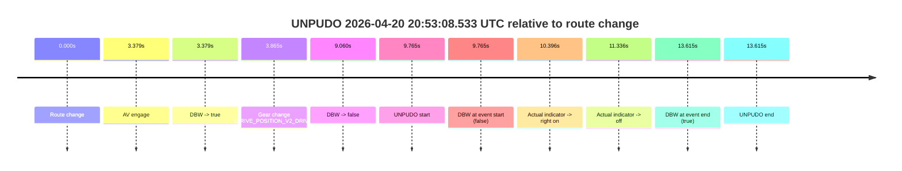

| Metric | Value |
|---|---|
| Outcome | `fail` |
| Effective failure type | `not_av_owned` |
| Route change status | `found` |
| DBW at event start | `false` |
| DBW at event end | `true` |
| Predicted gear at AV start | `DRIVE_POSITION_V2_DRIVE` |
| Actual gear at AV start | `DRIVE_POSITION_V2_PARK` |
| Predicted gear at event start | `DRIVE_POSITION_V2_DRIVE` |
| Actual gear at event start | `DRIVE_POSITION_V2_DRIVE` |
| Planned indicator direction | `INDICATORS_STATE_V2_LEFT_ON` |
| Controller indicator direction | `INDICATORS_STATE_V2_LEFT_ON` |
| Actual indicator direction | `INDICATORS_STATE_V2_OFF` |
| Actual indicator at maneuver end | `INDICATORS_STATE_V2_OFF` |
| Driver accel help in AV | `false` |
| Driver accel help timestamp | `n/a` |
| Max accel pedal pct in AV | `0.0%` |
| Max brake pedal pct in AV | `8.0%` |
| Max speed mps in AV | `0.000` |
| Success timing baseline | `route change` |
| Route -> AV | `3.379s` |
| AV -> event start | `6.385s` |
| AV -> first motion | `n/a` |
| Success baseline -> event start | `9.765s` |
| Success baseline -> first motion | `n/a` |
| AV duration before disengagement | `5.680s` |
| Trajectory waypoint count | `37` |
| Driving-plan step count | `11` |

The scored portion starts from the AV-owned window, not from the pre-AV setup. Route-change search in the stopped pre-event segment was `found`, with the baseline therefore set to route change. At the event anchor the model predicts `DRIVE_POSITION_V2_DRIVE` and the actual gear is `DRIVE_POSITION_V2_DRIVE`. The effective model outcome is `fail` because `not_av_owned.`

### Resolution

| Field | Value |
|---|---|
| Final outcome | `fail` |
| Do we agree with this label? | `yes` |
| Source disengagement type | `none observed` |
| Resolved effective failure type | `not_av_owned` |
| Confidence | `high` |

## unpudo 2026-04-20 20:59:57.533 UTC

| Field | Value |
|---|---|
| Model | `pink-manta-ray-smooth` |
| Author | `guy.geva` |
| Run ID | `fme20038/2026-04-20--20-14-14--gen2-av-64bfb241-2a77-49b3-9a73-b3fb4cc1406d` |
| Date | `2026-04-20` |
| Time (UTC) | `20:59:57.533` |
| Event type | `unpudo` |
| Disengagement type | `none observed` |
| Route change | `found` |
| Console | [run](https://console.sso.wayve.ai/run/fme20038/2026-04-20--20-14-14--gen2-av-64bfb241-2a77-49b3-9a73-b3fb4cc1406d?id=&time-unixus=1776718797533295) |
| Foxglove | [segment](https://app.foxglove.dev/wayve-on-prem/p/prj_0dX18KZdVHg1fmmI/view?ds=foxglove-stream&ds.deviceName=fme20038&ds.start=2026-04-20T20%3A59%3A44.418212Z&ds.end=2026-04-20T21%3A00%3A10.683300Z&layoutId=lay_0e7VD4WIKDQGU73Y&time=2026-04-20T20%3A59%3A57.533295Z) |

### Event card: fail

- Fail: the credited unpudo does not stay AV-owned. The event window starts with DBW false, and the maneuver outcome lands outside a clean AV-owned segment.

| Event | Time (UTC) | Delta from route change |
|---|---:|---:|
| Route change | 2026-04-20 20:59:54.418 | `0.000s` |
| AV engage | 2026-04-20 20:59:54.427 | `0.010s` |
| DBW -> true | 2026-04-20 20:59:54.427 | `0.010s` |
| Gear change (DRIVE_POSITION_V2_DRIVE) | 2026-04-20 20:59:54.733 | `0.315s` |
| DBW -> false | 2026-04-20 20:59:56.988 | `2.571s` |
| UNPUDO start | 2026-04-20 20:59:57.533 | `3.115s` |
| DBW at event start (false) | 2026-04-20 20:59:57.533 | `3.115s` |
| Actual indicator -> left on | 2026-04-20 20:59:58.264 | `3.846s` |
| DBW at event end (false) | 2026-04-20 21:00:00.683 | `6.265s` |
| UNPUDO end | 2026-04-20 21:00:00.683 | `6.265s` |
| Actual indicator -> off | 2026-04-20 21:00:09.724 | `15.306s` |

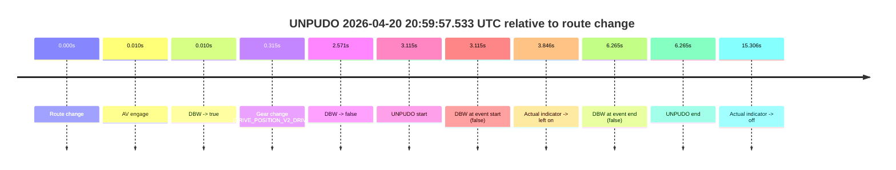

| Metric | Value |
|---|---|
| Outcome | `fail` |
| Effective failure type | `not_av_owned` |
| Route change status | `found` |
| DBW at event start | `false` |
| DBW at event end | `false` |
| Predicted gear at AV start | `DRIVE_POSITION_V2_PARK` |
| Actual gear at AV start | `DRIVE_POSITION_V2_PARK` |
| Predicted gear at event start | `DRIVE_POSITION_V2_DRIVE` |
| Actual gear at event start | `DRIVE_POSITION_V2_DRIVE` |
| Planned indicator direction | `INDICATORS_STATE_V2_OFF` |
| Controller indicator direction | `INDICATORS_STATE_V2_OFF` |
| Actual indicator direction | `INDICATORS_STATE_V2_OFF` |
| Actual indicator at maneuver end | `INDICATORS_STATE_V2_LEFT_ON` |
| Driver accel help in AV | `false` |
| Driver accel help timestamp | `n/a` |
| Max accel pedal pct in AV | `0.0%` |
| Max brake pedal pct in AV | `8.0%` |
| Max speed mps in AV | `0.000` |
| Success timing baseline | `route change` |
| Route -> AV | `0.010s` |
| AV -> event start | `3.105s` |
| AV -> first motion | `n/a` |
| Success baseline -> event start | `3.115s` |
| Success baseline -> first motion | `n/a` |
| AV duration before disengagement | `2.561s` |
| Trajectory waypoint count | `36` |
| Driving-plan step count | `11` |

The scored portion starts from the AV-owned window, not from the pre-AV setup. Route-change search in the stopped pre-event segment was `found`, with the baseline therefore set to route change. At the event anchor the model predicts `DRIVE_POSITION_V2_DRIVE` and the actual gear is `DRIVE_POSITION_V2_DRIVE`. The effective model outcome is `fail` because `not_av_owned.`

### Resolution

| Field | Value |
|---|---|
| Final outcome | `fail` |
| Do we agree with this label? | `yes` |
| Source disengagement type | `none observed` |
| Resolved effective failure type | `not_av_owned` |
| Confidence | `high` |

## unpudo 2026-04-20 21:01:25.983 UTC

| Field | Value |
|---|---|
| Model | `pink-manta-ray-smooth` |
| Author | `guy.geva` |
| Run ID | `fme20038/2026-04-20--20-14-14--gen2-av-64bfb241-2a77-49b3-9a73-b3fb4cc1406d` |
| Date | `2026-04-20` |
| Time (UTC) | `21:01:25.983` |
| Event type | `unpudo` |
| Disengagement type | `none observed` |
| Route change | `found` |
| Console | [run](https://console.sso.wayve.ai/run/fme20038/2026-04-20--20-14-14--gen2-av-64bfb241-2a77-49b3-9a73-b3fb4cc1406d?id=&time-unixus=1776718885983315) |
| Foxglove | [segment](https://app.foxglove.dev/wayve-on-prem/p/prj_0dX18KZdVHg1fmmI/view?ds=foxglove-stream&ds.deviceName=fme20038&ds.start=2026-04-20T20%3A59%3A44.418212Z&ds.end=2026-04-20T21%3A01%3A35.983315Z&layoutId=lay_0e7VD4WIKDQGU73Y&time=2026-04-20T21%3A01%3A25.983315Z) |

### Event card: fail

- Fail: the credited unpudo does not stay AV-owned. The event window starts with DBW false, and the maneuver outcome lands outside a clean AV-owned segment.

| Event | Time (UTC) | Delta from route change |
|---|---:|---:|
| Route change | 2026-04-20 20:59:54.418 | `0.000s` |
| First motion | 2026-04-20 20:59:57.564 | `3.146s` |
| Actual indicator -> left on | 2026-04-20 20:59:58.264 | `3.846s` |
| Actual indicator -> off | 2026-04-20 21:00:09.724 | `15.306s` |
| AV engage | 2026-04-20 21:00:12.509 | `18.091s` |
| DBW -> true | 2026-04-20 21:00:12.509 | `18.091s` |
| DBW -> false | 2026-04-20 21:01:04.207 | `69.790s` |
| Gear change (DRIVE_POSITION_V2_DRIVE) | 2026-04-20 21:01:19.733 | `85.315s` |
| UNPUDO start | 2026-04-20 21:01:25.983 | `91.565s` |
| DBW at event start (false) | 2026-04-20 21:01:25.983 | `91.565s` |
| DBW at event end (false) | 2026-04-20 21:01:25.983 | `91.565s` |
| UNPUDO end | 2026-04-20 21:01:25.983 | `91.565s` |

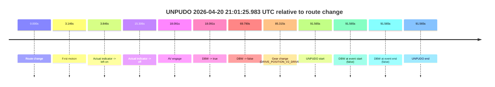

| Metric | Value |
|---|---|
| Outcome | `fail` |
| Effective failure type | `completed_outside_av` |
| Route change status | `found` |
| DBW at event start | `false` |
| DBW at event end | `false` |
| Predicted gear at AV start | `DRIVE_POSITION_V2_DRIVE` |
| Actual gear at AV start | `DRIVE_POSITION_V2_DRIVE` |
| Predicted gear at event start | `DRIVE_POSITION_V2_DRIVE` |
| Actual gear at event start | `DRIVE_POSITION_V2_DRIVE` |
| Planned indicator direction | `INDICATORS_STATE_V2_OFF` |
| Controller indicator direction | `INDICATORS_STATE_V2_OFF` |
| Actual indicator direction | `INDICATORS_STATE_V2_OFF` |
| Actual indicator at maneuver end | `INDICATORS_STATE_V2_OFF` |
| Driver accel help in AV | `false` |
| Driver accel help timestamp | `n/a` |
| Max accel pedal pct in AV | `0.0%` |
| Max brake pedal pct in AV | `0.0%` |
| Max speed mps in AV | `8.083` |
| Success timing baseline | `route change` |
| Route -> AV | `18.091s` |
| AV -> event start | `73.474s` |
| AV -> first motion | `-14.945s` |
| Success baseline -> event start | `91.565s` |
| Success baseline -> first motion | `3.146s` |
| AV duration before disengagement | `51.699s` |
| Trajectory waypoint count | `37` |
| Driving-plan step count | `11` |

The scored portion starts from the AV-owned window, not from the pre-AV setup. Route-change search in the stopped pre-event segment was `found`, with the baseline therefore set to route change. At the event anchor the model predicts `DRIVE_POSITION_V2_DRIVE` and the actual gear is `DRIVE_POSITION_V2_DRIVE`. The effective model outcome is `fail` because `completed_outside_av.`

### Resolution

| Field | Value |
|---|---|
| Final outcome | `fail` |
| Do we agree with this label? | `yes` |
| Source disengagement type | `none observed` |
| Resolved effective failure type | `completed_outside_av` |
| Confidence | `high` |

## unpudo 2026-04-20 21:01:41.183 UTC

| Field | Value |
|---|---|
| Model | `pink-manta-ray-smooth` |
| Author | `guy.geva` |
| Run ID | `fme20038/2026-04-20--20-14-14--gen2-av-64bfb241-2a77-49b3-9a73-b3fb4cc1406d` |
| Date | `2026-04-20` |
| Time (UTC) | `21:01:41.183` |
| Event type | `unpudo` |
| Disengagement type | `none observed` |
| Route change | `found` |
| Console | [run](https://console.sso.wayve.ai/run/fme20038/2026-04-20--20-14-14--gen2-av-64bfb241-2a77-49b3-9a73-b3fb4cc1406d?id=&time-unixus=1776718901183305) |
| Foxglove | [segment](https://app.foxglove.dev/wayve-on-prem/p/prj_0dX18KZdVHg1fmmI/view?ds=foxglove-stream&ds.deviceName=fme20038&ds.start=2026-04-20T20%3A59%3A44.418212Z&ds.end=2026-04-20T21%3A02%3A05.933323Z&layoutId=lay_0e7VD4WIKDQGU73Y&time=2026-04-20T21%3A01%3A41.183305Z) |

### Event card: fail

- Fail: the credited unpudo does not stay AV-owned. The event window starts with DBW false, and the maneuver outcome lands outside a clean AV-owned segment.

| Event | Time (UTC) | Delta from route change |
|---|---:|---:|
| Route change | 2026-04-20 20:59:54.418 | `0.000s` |
| First motion | 2026-04-20 20:59:57.564 | `3.146s` |
| Actual indicator -> left on | 2026-04-20 20:59:58.264 | `3.846s` |
| Actual indicator -> off | 2026-04-20 21:00:09.724 | `15.306s` |
| AV engage | 2026-04-20 21:00:12.509 | `18.091s` |
| DBW -> true | 2026-04-20 21:00:12.509 | `18.091s` |
| DBW -> false | 2026-04-20 21:01:04.207 | `69.790s` |
| Gear change (DRIVE_POSITION_V2_REVERSE) | 2026-04-20 21:01:37.283 | `102.865s` |
| UNPUDO start | 2026-04-20 21:01:41.183 | `106.765s` |
| DBW at event start (false) | 2026-04-20 21:01:41.183 | `106.765s` |
| DBW at event end (false) | 2026-04-20 21:01:55.933 | `121.515s` |
| UNPUDO end | 2026-04-20 21:01:55.933 | `121.515s` |
| Actual indicator -> left on | 2026-04-20 21:01:58.824 | `124.406s` |
| Actual indicator -> off | 2026-04-20 21:02:13.004 | `138.586s` |

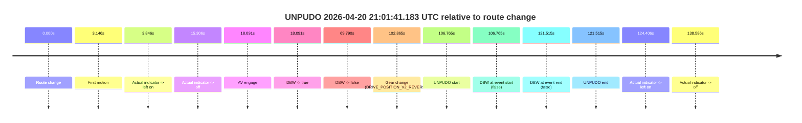

| Metric | Value |
|---|---|
| Outcome | `fail` |
| Effective failure type | `completed_outside_av` |
| Route change status | `found` |
| DBW at event start | `false` |
| DBW at event end | `false` |
| Predicted gear at AV start | `DRIVE_POSITION_V2_DRIVE` |
| Actual gear at AV start | `DRIVE_POSITION_V2_DRIVE` |
| Predicted gear at event start | `DRIVE_POSITION_V2_REVERSE` |
| Actual gear at event start | `DRIVE_POSITION_V2_REVERSE` |
| Planned indicator direction | `INDICATORS_STATE_V2_OFF` |
| Controller indicator direction | `INDICATORS_STATE_V2_OFF` |
| Actual indicator direction | `INDICATORS_STATE_V2_OFF` |
| Actual indicator at maneuver end | `INDICATORS_STATE_V2_OFF` |
| Driver accel help in AV | `false` |
| Driver accel help timestamp | `n/a` |
| Max accel pedal pct in AV | `0.0%` |
| Max brake pedal pct in AV | `0.0%` |
| Max speed mps in AV | `8.083` |
| Success timing baseline | `route change` |
| Route -> AV | `18.091s` |
| AV -> event start | `88.674s` |
| AV -> first motion | `-14.945s` |
| Success baseline -> event start | `106.765s` |
| Success baseline -> first motion | `3.146s` |
| AV duration before disengagement | `51.699s` |
| Trajectory waypoint count | `36` |
| Driving-plan step count | `11` |

The scored portion starts from the AV-owned window, not from the pre-AV setup. Route-change search in the stopped pre-event segment was `found`, with the baseline therefore set to route change. At the event anchor the model predicts `DRIVE_POSITION_V2_REVERSE` and the actual gear is `DRIVE_POSITION_V2_REVERSE`. The effective model outcome is `fail` because `completed_outside_av.`

### Resolution

| Field | Value |
|---|---|
| Final outcome | `fail` |
| Do we agree with this label? | `yes` |
| Source disengagement type | `none observed` |
| Resolved effective failure type | `completed_outside_av` |
| Confidence | `high` |

## unpudo 2026-04-20 21:07:15.783 UTC

| Field | Value |
|---|---|
| Model | `pink-manta-ray-smooth` |
| Author | `guy.geva` |
| Run ID | `fme20038/2026-04-20--20-14-14--gen2-av-64bfb241-2a77-49b3-9a73-b3fb4cc1406d` |
| Date | `2026-04-20` |
| Time (UTC) | `21:07:15.783` |
| Event type | `unpudo` |
| Disengagement type | `none observed` |
| Route change | `found` |
| Console | [run](https://console.sso.wayve.ai/run/fme20038/2026-04-20--20-14-14--gen2-av-64bfb241-2a77-49b3-9a73-b3fb4cc1406d?id=&time-unixus=1776719235783299) |
| Foxglove | [segment](https://app.foxglove.dev/wayve-on-prem/p/prj_0dX18KZdVHg1fmmI/view?ds=foxglove-stream&ds.deviceName=fme20038&ds.start=2026-04-20T21%3A06%3A57.568279Z&ds.end=2026-04-20T21%3A07%3A28.733297Z&layoutId=lay_0e7VD4WIKDQGU73Y&time=2026-04-20T21%3A07%3A15.783299Z) |

### Event card: fail

- Fail: the credited unpudo does not stay AV-owned. The event window starts with DBW false, and the maneuver outcome lands outside a clean AV-owned segment.

| Event | Time (UTC) | Delta from route change |
|---|---:|---:|
| Route change | 2026-04-20 21:07:07.568 | `0.000s` |
| AV engage | 2026-04-20 21:07:07.578 | `0.010s` |
| DBW -> true | 2026-04-20 21:07:07.578 | `0.010s` |
| Gear change (DRIVE_POSITION_V2_DRIVE) | 2026-04-20 21:07:07.833 | `0.265s` |
| Actual indicator -> right on | 2026-04-20 21:07:14.224 | `6.656s` |
| DBW -> false | 2026-04-20 21:07:14.908 | `7.340s` |
| UNPUDO start | 2026-04-20 21:07:15.783 | `8.215s` |
| DBW at event start (false) | 2026-04-20 21:07:15.783 | `8.215s` |
| Actual indicator -> off | 2026-04-20 21:07:18.284 | `10.716s` |
| DBW at event end (false) | 2026-04-20 21:07:18.733 | `11.165s` |
| UNPUDO end | 2026-04-20 21:07:18.733 | `11.165s` |

| Metric | Value |
|---|---|
| Outcome | `fail` |
| Effective failure type | `not_av_owned` |
| Route change status | `found` |
| DBW at event start | `false` |
| DBW at event end | `false` |
| Predicted gear at AV start | `DRIVE_POSITION_V2_PARK` |
| Actual gear at AV start | `DRIVE_POSITION_V2_PARK` |
| Predicted gear at event start | `DRIVE_POSITION_V2_DRIVE` |
| Actual gear at event start | `DRIVE_POSITION_V2_DRIVE` |
| Planned indicator direction | `INDICATORS_STATE_V2_RIGHT_ON` |
| Controller indicator direction | `INDICATORS_STATE_V2_RIGHT_ON` |
| Actual indicator direction | `INDICATORS_STATE_V2_RIGHT_ON` |
| Actual indicator at maneuver end | `INDICATORS_STATE_V2_OFF` |
| Driver accel help in AV | `false` |
| Driver accel help timestamp | `n/a` |
| Max accel pedal pct in AV | `0.0%` |
| Max brake pedal pct in AV | `8.0%` |
| Max speed mps in AV | `0.000` |
| Success timing baseline | `route change` |
| Route -> AV | `0.010s` |
| AV -> event start | `8.205s` |
| AV -> first motion | `n/a` |
| Success baseline -> event start | `8.215s` |
| Success baseline -> first motion | `n/a` |
| AV duration before disengagement | `7.330s` |
| Trajectory waypoint count | `36` |
| Driving-plan step count | `11` |

The scored portion starts from the AV-owned window, not from the pre-AV setup. Route-change search in the stopped pre-event segment was `found`, with the baseline therefore set to route change. At the event anchor the model predicts `DRIVE_POSITION_V2_DRIVE` and the actual gear is `DRIVE_POSITION_V2_DRIVE`. The effective model outcome is `fail` because `not_av_owned.`

### Resolution

| Field | Value |
|---|---|
| Final outcome | `fail` |
| Do we agree with this label? | `yes` |
| Source disengagement type | `none observed` |
| Resolved effective failure type | `not_av_owned` |
| Confidence | `high` |
