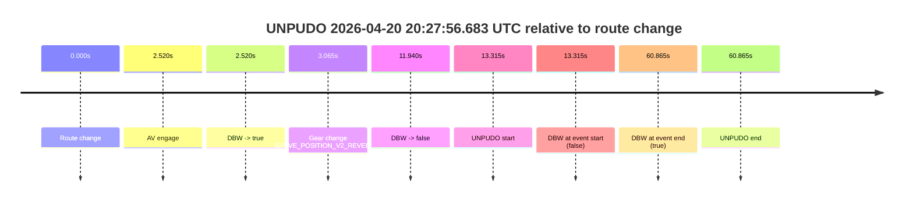
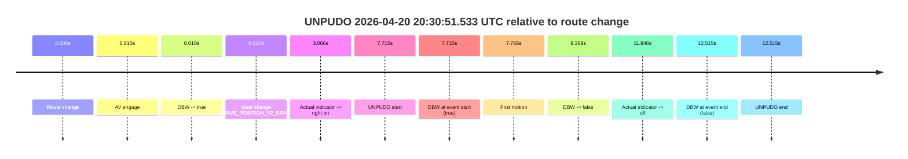
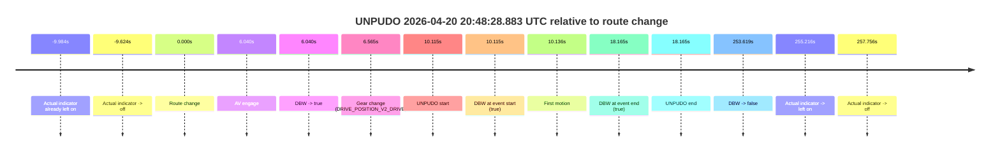
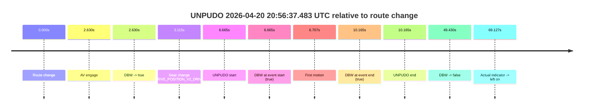

# Run Report: fme20038/2026-04-20--20-14-14--gen2-av-64bfb241-2a77-49b3-9a73-b3fb4cc1406d

| Field | Value |
|---|---|
| Run ID | `fme20038/2026-04-20--20-14-14--gen2-av-64bfb241-2a77-49b3-9a73-b3fb4cc1406d` |
| Date | `2026-04-20` |
| Model(s) | `eel-teal-outspoken` |
| Author | `zak` |
| Event count | `6` |

## unpudo 2026-04-20 20:27:56.683 UTC

| Field | Value |
|---|---|
| Model | `eel-teal-outspoken` |
| Author | `zak` |
| Run ID | `fme20038/2026-04-20--20-14-14--gen2-av-64bfb241-2a77-49b3-9a73-b3fb4cc1406d` |
| Date | `2026-04-20` |
| Time (UTC) | `20:27:56.683` |
| Event type | `unpudo` |
| Disengagement type | `none observed` |
| Route change | `found` |
| Console | [run](https://console.sso.wayve.ai/run/fme20038/2026-04-20--20-14-14--gen2-av-64bfb241-2a77-49b3-9a73-b3fb4cc1406d?id=&time-unixus=1776716876683299) |
| Foxglove | [segment](https://app.foxglove.dev/wayve-on-prem/p/prj_0dX18KZdVHg1fmmI/view?ds=foxglove-stream&ds.deviceName=fme20038&ds.start=2026-04-20T20%3A27%3A33.368281Z&ds.end=2026-04-20T20%3A28%3A54.233300Z&layoutId=lay_0e7VD4WIKDQGU73Y&time=2026-04-20T20%3A27%3A56.683299Z) |

### Event card: fail

- Fail: the credited unpudo does not stay AV-owned. The event window starts with DBW false, and the maneuver outcome lands outside a clean AV-owned segment.

| Event | Time (UTC) | Delta from route change |
|---|---:|---:|
| Route change | 2026-04-20 20:27:43.368 | `0.000s` |
| AV engage | 2026-04-20 20:27:45.887 | `2.520s` |
| DBW -> true | 2026-04-20 20:27:45.887 | `2.520s` |
| Gear change (DRIVE_POSITION_V2_REVERSE) | 2026-04-20 20:27:46.433 | `3.065s` |
| DBW -> false | 2026-04-20 20:27:55.308 | `11.940s` |
| UNPUDO start | 2026-04-20 20:27:56.683 | `13.315s` |
| DBW at event start (false) | 2026-04-20 20:27:56.683 | `13.315s` |
| DBW at event end (true) | 2026-04-20 20:28:44.233 | `60.865s` |
| UNPUDO end | 2026-04-20 20:28:44.233 | `60.865s` |

| Metric | Value |
|---|---|
| Outcome | `fail` |
| Effective failure type | `not_av_owned` |
| Route change status | `found` |
| DBW at event start | `false` |
| DBW at event end | `true` |
| Predicted gear at AV start | `DRIVE_POSITION_V2_DRIVE` |
| Actual gear at AV start | `DRIVE_POSITION_V2_PARK` |
| Predicted gear at event start | `DRIVE_POSITION_V2_REVERSE` |
| Actual gear at event start | `DRIVE_POSITION_V2_REVERSE` |
| Planned indicator direction | `INDICATORS_STATE_V2_OFF` |
| Controller indicator direction | `INDICATORS_STATE_V2_OFF` |
| Actual indicator direction | `INDICATORS_STATE_V2_OFF` |
| Actual indicator at maneuver end | `INDICATORS_STATE_V2_OFF` |
| Driver accel help in AV | `false` |
| Driver accel help timestamp | `n/a` |
| Max accel pedal pct in AV | `0.0%` |
| Max brake pedal pct in AV | `8.0%` |
| Max speed mps in AV | `0.000` |
| Success timing baseline | `route change` |
| Route -> AV | `2.520s` |
| AV -> event start | `10.795s` |
| AV -> first motion | `n/a` |
| Success baseline -> event start | `13.315s` |
| Success baseline -> first motion | `n/a` |
| AV duration before disengagement | `9.421s` |
| Trajectory waypoint count | `36` |
| Driving-plan step count | `11` |

The scored portion starts from the AV-owned window, not from the pre-AV setup. Route-change search in the stopped pre-event segment was `found`, with the baseline therefore set to route change. At the event anchor the model predicts `DRIVE_POSITION_V2_REVERSE` and the actual gear is `DRIVE_POSITION_V2_REVERSE`. The effective model outcome is `fail` because `not_av_owned.`

### Resolution

| Field | Value |
|---|---|
| Final outcome | `fail` |
| Do we agree with this label? | `yes` |
| Source disengagement type | `none observed` |
| Resolved effective failure type | `not_av_owned` |
| Confidence | `high` |

## unpudo 2026-04-20 20:30:51.533 UTC

| Field | Value |
|---|---|
| Model | `eel-teal-outspoken` |
| Author | `zak` |
| Run ID | `fme20038/2026-04-20--20-14-14--gen2-av-64bfb241-2a77-49b3-9a73-b3fb4cc1406d` |
| Date | `2026-04-20` |
| Time (UTC) | `20:30:51.533` |
| Event type | `unpudo` |
| Disengagement type | `none observed` |
| Route change | `found` |
| Console | [run](https://console.sso.wayve.ai/run/fme20038/2026-04-20--20-14-14--gen2-av-64bfb241-2a77-49b3-9a73-b3fb4cc1406d?id=&time-unixus=1776717051533299) |
| Foxglove | [segment](https://app.foxglove.dev/wayve-on-prem/p/prj_0dX18KZdVHg1fmmI/view?ds=foxglove-stream&ds.deviceName=fme20038&ds.start=2026-04-20T20%3A30%3A33.818279Z&ds.end=2026-04-20T20%3A31%3A06.333303Z&layoutId=lay_0e7VD4WIKDQGU73Y&time=2026-04-20T20%3A30%3A51.533299Z) |

### Event card: fail

- Fail: this is a short AV stint rather than a durable model-owned maneuver. The vehicle never settles into a long enough AV-owned attempt to credit the model.

| Event | Time (UTC) | Delta from route change |
|---|---:|---:|
| Route change | 2026-04-20 20:30:43.818 | `0.000s` |
| AV engage | 2026-04-20 20:30:43.828 | `0.010s` |
| DBW -> true | 2026-04-20 20:30:43.828 | `0.010s` |
| Gear change (DRIVE_POSITION_V2_DRIVE) | 2026-04-20 20:30:44.133 | `0.315s` |
| Actual indicator -> right on | 2026-04-20 20:30:46.884 | `3.066s` |
| UNPUDO start | 2026-04-20 20:30:51.533 | `7.715s` |
| DBW at event start (true) | 2026-04-20 20:30:51.533 | `7.715s` |
| First motion | 2026-04-20 20:30:51.584 | `7.766s` |
| DBW -> false | 2026-04-20 20:30:52.187 | `8.369s` |
| Actual indicator -> off | 2026-04-20 20:30:55.764 | `11.946s` |
| DBW at event end (false) | 2026-04-20 20:30:56.333 | `12.515s` |
| UNPUDO end | 2026-04-20 20:30:56.333 | `12.515s` |

| Metric | Value |
|---|---|
| Outcome | `fail` |
| Effective failure type | `interrupted_handover` |
| Route change status | `found` |
| DBW at event start | `true` |
| DBW at event end | `false` |
| Predicted gear at AV start | `DRIVE_POSITION_V2_PARK` |
| Actual gear at AV start | `DRIVE_POSITION_V2_PARK` |
| Predicted gear at event start | `DRIVE_POSITION_V2_DRIVE` |
| Actual gear at event start | `DRIVE_POSITION_V2_DRIVE` |
| Planned indicator direction | `INDICATORS_STATE_V2_RIGHT_ON` |
| Controller indicator direction | `INDICATORS_STATE_V2_RIGHT_ON` |
| Actual indicator direction | `INDICATORS_STATE_V2_RIGHT_ON` |
| Actual indicator at maneuver end | `INDICATORS_STATE_V2_OFF` |
| Driver accel help in AV | `false` |
| Driver accel help timestamp | `n/a` |
| Max accel pedal pct in AV | `0.0%` |
| Max brake pedal pct in AV | `8.0%` |
| Max speed mps in AV | `1.289` |
| Success timing baseline | `route change` |
| Route -> AV | `0.010s` |
| AV -> event start | `7.705s` |
| AV -> first motion | `7.756s` |
| Success baseline -> event start | `7.715s` |
| Success baseline -> first motion | `7.766s` |
| AV duration before disengagement | `8.360s` |
| Trajectory waypoint count | `36` |
| Driving-plan step count | `11` |

The scored portion starts from the AV-owned window, not from the pre-AV setup. Route-change search in the stopped pre-event segment was `found`, with the baseline therefore set to route change. At the event anchor the model predicts `DRIVE_POSITION_V2_DRIVE` and the actual gear is `DRIVE_POSITION_V2_DRIVE`. The effective model outcome is `fail` because `interrupted_handover.`

### Resolution

| Field | Value |
|---|---|
| Final outcome | `fail` |
| Do we agree with this label? | `yes` |
| Source disengagement type | `none observed` |
| Resolved effective failure type | `interrupted_handover` |
| Confidence | `high` |

## unpudo 2026-04-20 20:42:59.633 UTC

| Field | Value |
|---|---|
| Model | `eel-teal-outspoken` |
| Author | `zak` |
| Run ID | `fme20038/2026-04-20--20-14-14--gen2-av-64bfb241-2a77-49b3-9a73-b3fb4cc1406d` |
| Date | `2026-04-20` |
| Time (UTC) | `20:42:59.633` |
| Event type | `unpudo` |
| Disengagement type | `none observed` |
| Route change | `found` |
| Console | [run](https://console.sso.wayve.ai/run/fme20038/2026-04-20--20-14-14--gen2-av-64bfb241-2a77-49b3-9a73-b3fb4cc1406d?id=&time-unixus=1776717779633302) |
| Foxglove | [segment](https://app.foxglove.dev/wayve-on-prem/p/prj_0dX18KZdVHg1fmmI/view?ds=foxglove-stream&ds.deviceName=fme20038&ds.start=2026-04-20T20%3A42%3A45.768266Z&ds.end=2026-04-20T20%3A43%3A29.868589Z&layoutId=lay_0e7VD4WIKDQGU73Y&time=2026-04-20T20%3A42%3A59.633302Z) |

### Event card: pass

- Pass: AV owns the credited unpudo from route change through the official unpudo window, the gear state is aligned at the anchor, and the vehicle moves without driver accelerator help in AV.

| Event | Time (UTC) | Delta from route change |
|---|---:|---:|
| Route change | 2026-04-20 20:42:55.768 | `0.000s` |
| AV engage | 2026-04-20 20:42:55.778 | `0.010s` |
| DBW -> true | 2026-04-20 20:42:55.778 | `0.010s` |
| Gear change (DRIVE_POSITION_V2_DRIVE) | 2026-04-20 20:42:56.033 | `0.265s` |
| UNPUDO start | 2026-04-20 20:42:59.633 | `3.865s` |
| DBW at event start (true) | 2026-04-20 20:42:59.633 | `3.865s` |
| First motion | 2026-04-20 20:42:59.664 | `3.896s` |
| DBW at event end (true) | 2026-04-20 20:43:03.133 | `7.365s` |
| UNPUDO end | 2026-04-20 20:43:03.133 | `7.365s` |
| DBW -> false | 2026-04-20 20:43:19.868 | `24.100s` |
| Actual indicator -> left on | 2026-04-20 20:43:20.624 | `24.856s` |
| Actual indicator -> off | 2026-04-20 20:43:24.464 | `28.697s` |

| Metric | Value |
|---|---|
| Outcome | `pass` |
| Effective failure type | `none` |
| Route change status | `found` |
| DBW at event start | `true` |
| DBW at event end | `true` |
| Predicted gear at AV start | `DRIVE_POSITION_V2_PARK` |
| Actual gear at AV start | `DRIVE_POSITION_V2_PARK` |
| Predicted gear at event start | `DRIVE_POSITION_V2_DRIVE` |
| Actual gear at event start | `DRIVE_POSITION_V2_DRIVE` |
| Planned indicator direction | `INDICATORS_STATE_V2_RIGHT_ON` |
| Controller indicator direction | `INDICATORS_STATE_V2_RIGHT_ON` |
| Actual indicator direction | `INDICATORS_STATE_V2_OFF` |
| Actual indicator at maneuver end | `INDICATORS_STATE_V2_OFF` |
| Driver accel help in AV | `false` |
| Driver accel help timestamp | `n/a` |
| Max accel pedal pct in AV | `0.0%` |
| Max brake pedal pct in AV | `8.4%` |
| Max speed mps in AV | `4.011` |
| Success timing baseline | `route change` |
| Route -> AV | `0.010s` |
| AV -> event start | `3.855s` |
| AV -> first motion | `3.886s` |
| Success baseline -> event start | `3.865s` |
| Success baseline -> first motion | `3.896s` |
| AV duration before disengagement | `24.091s` |
| Trajectory waypoint count | `37` |
| Driving-plan step count | `11` |

The scored portion starts from the AV-owned window, not from the pre-AV setup. Route-change search in the stopped pre-event segment was `found`, with the baseline therefore set to route change. At the event anchor the model predicts `DRIVE_POSITION_V2_DRIVE` and the actual gear is `DRIVE_POSITION_V2_DRIVE`. The effective model outcome is `pass` because `the credited unpudo stays AV-owned through the official unpudo window.`

### Resolution

| Field | Value |
|---|---|
| Final outcome | `pass` |
| Do we agree with this label? | `yes` |
| Source disengagement type | `none observed` |
| Resolved effective failure type | `none` |
| Confidence | `high` |

## unpudo 2026-04-20 20:48:28.883 UTC

| Field | Value |
|---|---|
| Model | `eel-teal-outspoken` |
| Author | `zak` |
| Run ID | `fme20038/2026-04-20--20-14-14--gen2-av-64bfb241-2a77-49b3-9a73-b3fb4cc1406d` |
| Date | `2026-04-20` |
| Time (UTC) | `20:48:28.883` |
| Event type | `unpudo` |
| Disengagement type | `none observed` |
| Route change | `found` |
| Console | [run](https://console.sso.wayve.ai/run/fme20038/2026-04-20--20-14-14--gen2-av-64bfb241-2a77-49b3-9a73-b3fb4cc1406d?id=&time-unixus=1776718108883305) |
| Foxglove | [segment](https://app.foxglove.dev/wayve-on-prem/p/prj_0dX18KZdVHg1fmmI/view?ds=foxglove-stream&ds.deviceName=fme20038&ds.start=2026-04-20T20%3A48%3A08.768274Z&ds.end=2026-04-20T20%3A52%3A42.387721Z&layoutId=lay_0e7VD4WIKDQGU73Y&time=2026-04-20T20%3A48%3A28.883305Z) |

### Event card: pass

- Pass: AV owns the credited unpudo from route change through the official unpudo window, the gear state is aligned at the anchor, and the vehicle moves without driver accelerator help in AV.

| Event | Time (UTC) | Delta from route change |
|---|---:|---:|
| Actual indicator already left on | 2026-04-20 20:48:08.784 | `-9.984s` |
| Actual indicator -> off | 2026-04-20 20:48:09.144 | `-9.624s` |
| Route change | 2026-04-20 20:48:18.768 | `0.000s` |
| AV engage | 2026-04-20 20:48:24.807 | `6.040s` |
| DBW -> true | 2026-04-20 20:48:24.807 | `6.040s` |
| Gear change (DRIVE_POSITION_V2_DRIVE) | 2026-04-20 20:48:25.333 | `6.565s` |
| UNPUDO start | 2026-04-20 20:48:28.883 | `10.115s` |
| DBW at event start (true) | 2026-04-20 20:48:28.883 | `10.115s` |
| First motion | 2026-04-20 20:48:28.904 | `10.136s` |
| DBW at event end (true) | 2026-04-20 20:48:36.933 | `18.165s` |
| UNPUDO end | 2026-04-20 20:48:36.933 | `18.165s` |
| DBW -> false | 2026-04-20 20:52:32.387 | `253.619s` |
| Actual indicator -> left on | 2026-04-20 20:52:33.984 | `255.216s` |
| Actual indicator -> off | 2026-04-20 20:52:36.524 | `257.756s` |

| Metric | Value |
|---|---|
| Outcome | `pass` |
| Effective failure type | `none` |
| Route change status | `found` |
| DBW at event start | `true` |
| DBW at event end | `true` |
| Predicted gear at AV start | `DRIVE_POSITION_V2_PARK` |
| Actual gear at AV start | `DRIVE_POSITION_V2_PARK` |
| Predicted gear at event start | `DRIVE_POSITION_V2_DRIVE` |
| Actual gear at event start | `DRIVE_POSITION_V2_DRIVE` |
| Planned indicator direction | `INDICATORS_STATE_V2_RIGHT_ON` |
| Controller indicator direction | `INDICATORS_STATE_V2_RIGHT_ON` |
| Actual indicator direction | `INDICATORS_STATE_V2_OFF` |
| Actual indicator at maneuver end | `INDICATORS_STATE_V2_OFF` |
| Driver accel help in AV | `false` |
| Driver accel help timestamp | `n/a` |
| Max accel pedal pct in AV | `0.0%` |
| Max brake pedal pct in AV | `8.0%` |
| Max speed mps in AV | `3.447` |
| Success timing baseline | `route change` |
| Route -> AV | `6.040s` |
| AV -> event start | `4.075s` |
| AV -> first motion | `4.096s` |
| Success baseline -> event start | `10.115s` |
| Success baseline -> first motion | `10.136s` |
| AV duration before disengagement | `247.580s` |
| Trajectory waypoint count | `37` |
| Driving-plan step count | `11` |

The scored portion starts from the AV-owned window, not from the pre-AV setup. Route-change search in the stopped pre-event segment was `found`, with the baseline therefore set to route change. At the event anchor the model predicts `DRIVE_POSITION_V2_DRIVE` and the actual gear is `DRIVE_POSITION_V2_DRIVE`. The effective model outcome is `pass` because `the credited unpudo stays AV-owned through the official unpudo window.`

### Resolution

| Field | Value |
|---|---|
| Final outcome | `pass` |
| Do we agree with this label? | `yes` |
| Source disengagement type | `none observed` |
| Resolved effective failure type | `none` |
| Confidence | `high` |

## unpudo 2026-04-20 20:50:45.233 UTC

| Field | Value |
|---|---|
| Model | `eel-teal-outspoken` |
| Author | `zak` |
| Run ID | `fme20038/2026-04-20--20-14-14--gen2-av-64bfb241-2a77-49b3-9a73-b3fb4cc1406d` |
| Date | `2026-04-20` |
| Time (UTC) | `20:50:45.233` |
| Event type | `unpudo` |
| Disengagement type | `none observed` |
| Route change | `found` |
| Console | [run](https://console.sso.wayve.ai/run/fme20038/2026-04-20--20-14-14--gen2-av-64bfb241-2a77-49b3-9a73-b3fb4cc1406d?id=&time-unixus=1776718245233287) |
| Foxglove | [segment](https://app.foxglove.dev/wayve-on-prem/p/prj_0dX18KZdVHg1fmmI/view?ds=foxglove-stream&ds.deviceName=fme20038&ds.start=2026-04-20T20%3A50%3A21.468268Z&ds.end=2026-04-20T20%3A52%3A42.387721Z&layoutId=lay_0e7VD4WIKDQGU73Y&time=2026-04-20T20%3A50%3A45.233287Z) |

### Event card: pass

- Pass: AV owns the credited unpudo from route change through the official unpudo window, the gear state is aligned at the anchor, and the vehicle moves without driver accelerator help in AV.

| Event | Time (UTC) | Delta from route change |
|---|---:|---:|
| Route change | 2026-04-20 20:50:31.468 | `0.000s` |
| AV engage | 2026-04-20 20:50:31.477 | `0.009s` |
| DBW -> true | 2026-04-20 20:50:31.477 | `0.009s` |
| Gear change (DRIVE_POSITION_V2_DRIVE) | 2026-04-20 20:50:31.833 | `0.365s` |
| UNPUDO start | 2026-04-20 20:50:45.233 | `13.765s` |
| DBW at event start (true) | 2026-04-20 20:50:45.233 | `13.765s` |
| First motion | 2026-04-20 20:50:45.244 | `13.776s` |
| DBW at event end (true) | 2026-04-20 20:50:48.533 | `17.065s` |
| UNPUDO end | 2026-04-20 20:50:48.533 | `17.065s` |
| DBW -> false | 2026-04-20 20:52:32.387 | `120.919s` |
| Actual indicator -> left on | 2026-04-20 20:52:33.984 | `122.516s` |
| Actual indicator -> off | 2026-04-20 20:52:36.524 | `125.056s` |

| Metric | Value |
|---|---|
| Outcome | `pass` |
| Effective failure type | `none` |
| Route change status | `found` |
| DBW at event start | `true` |
| DBW at event end | `true` |
| Predicted gear at AV start | `DRIVE_POSITION_V2_PARK` |
| Actual gear at AV start | `DRIVE_POSITION_V2_PARK` |
| Predicted gear at event start | `DRIVE_POSITION_V2_DRIVE` |
| Actual gear at event start | `DRIVE_POSITION_V2_DRIVE` |
| Planned indicator direction | `INDICATORS_STATE_V2_OFF` |
| Controller indicator direction | `INDICATORS_STATE_V2_OFF` |
| Actual indicator direction | `INDICATORS_STATE_V2_OFF` |
| Actual indicator at maneuver end | `INDICATORS_STATE_V2_OFF` |
| Driver accel help in AV | `false` |
| Driver accel help timestamp | `n/a` |
| Max accel pedal pct in AV | `0.0%` |
| Max brake pedal pct in AV | `8.0%` |
| Max speed mps in AV | `4.986` |
| Success timing baseline | `route change` |
| Route -> AV | `0.009s` |
| AV -> event start | `13.756s` |
| AV -> first motion | `13.767s` |
| Success baseline -> event start | `13.765s` |
| Success baseline -> first motion | `13.776s` |
| AV duration before disengagement | `120.911s` |
| Trajectory waypoint count | `38` |
| Driving-plan step count | `11` |

The scored portion starts from the AV-owned window, not from the pre-AV setup. Route-change search in the stopped pre-event segment was `found`, with the baseline therefore set to route change. At the event anchor the model predicts `DRIVE_POSITION_V2_DRIVE` and the actual gear is `DRIVE_POSITION_V2_DRIVE`. The effective model outcome is `pass` because `the credited unpudo stays AV-owned through the official unpudo window.`

### Resolution

| Field | Value |
|---|---|
| Final outcome | `pass` |
| Do we agree with this label? | `yes` |
| Source disengagement type | `none observed` |
| Resolved effective failure type | `none` |
| Confidence | `high` |

## unpudo 2026-04-20 20:56:37.483 UTC

| Field | Value |
|---|---|
| Model | `eel-teal-outspoken` |
| Author | `zak` |
| Run ID | `fme20038/2026-04-20--20-14-14--gen2-av-64bfb241-2a77-49b3-9a73-b3fb4cc1406d` |
| Date | `2026-04-20` |
| Time (UTC) | `20:56:37.483` |
| Event type | `unpudo` |
| Disengagement type | `none observed` |
| Route change | `found` |
| Console | [run](https://console.sso.wayve.ai/run/fme20038/2026-04-20--20-14-14--gen2-av-64bfb241-2a77-49b3-9a73-b3fb4cc1406d?id=&time-unixus=1776718597483314) |
| Foxglove | [segment](https://app.foxglove.dev/wayve-on-prem/p/prj_0dX18KZdVHg1fmmI/view?ds=foxglove-stream&ds.deviceName=fme20038&ds.start=2026-04-20T20%3A56%3A20.818256Z&ds.end=2026-04-20T20%3A57%3A30.248471Z&layoutId=lay_0e7VD4WIKDQGU73Y&time=2026-04-20T20%3A56%3A37.483314Z) |

### Event card: pass

- Pass: AV owns the credited unpudo from route change through the official unpudo window, the gear state is aligned at the anchor, and the vehicle moves without driver accelerator help in AV.

| Event | Time (UTC) | Delta from route change |
|---|---:|---:|
| Route change | 2026-04-20 20:56:30.818 | `0.000s` |
| AV engage | 2026-04-20 20:56:33.447 | `2.630s` |
| DBW -> true | 2026-04-20 20:56:33.447 | `2.630s` |
| Gear change (DRIVE_POSITION_V2_DRIVE) | 2026-04-20 20:56:33.933 | `3.115s` |
| UNPUDO start | 2026-04-20 20:56:37.483 | `6.665s` |
| DBW at event start (true) | 2026-04-20 20:56:37.483 | `6.665s` |
| First motion | 2026-04-20 20:56:37.524 | `6.707s` |
| DBW at event end (true) | 2026-04-20 20:56:40.983 | `10.165s` |
| UNPUDO end | 2026-04-20 20:56:40.983 | `10.165s` |
| DBW -> false | 2026-04-20 20:57:20.248 | `49.430s` |
| Actual indicator -> left on | 2026-04-20 20:57:39.945 | `69.127s` |

| Metric | Value |
|---|---|
| Outcome | `pass` |
| Effective failure type | `none` |
| Route change status | `found` |
| DBW at event start | `true` |
| DBW at event end | `true` |
| Predicted gear at AV start | `DRIVE_POSITION_V2_DRIVE` |
| Actual gear at AV start | `DRIVE_POSITION_V2_PARK` |
| Predicted gear at event start | `DRIVE_POSITION_V2_DRIVE` |
| Actual gear at event start | `DRIVE_POSITION_V2_DRIVE` |
| Planned indicator direction | `INDICATORS_STATE_V2_RIGHT_ON` |
| Controller indicator direction | `INDICATORS_STATE_V2_RIGHT_ON` |
| Actual indicator direction | `INDICATORS_STATE_V2_OFF` |
| Actual indicator at maneuver end | `INDICATORS_STATE_V2_OFF` |
| Driver accel help in AV | `false` |
| Driver accel help timestamp | `n/a` |
| Max accel pedal pct in AV | `0.0%` |
| Max brake pedal pct in AV | `8.0%` |
| Max speed mps in AV | `4.147` |
| Success timing baseline | `route change` |
| Route -> AV | `2.630s` |
| AV -> event start | `4.035s` |
| AV -> first motion | `4.077s` |
| Success baseline -> event start | `6.665s` |
| Success baseline -> first motion | `6.707s` |
| AV duration before disengagement | `46.801s` |
| Trajectory waypoint count | `36` |
| Driving-plan step count | `11` |

The scored portion starts from the AV-owned window, not from the pre-AV setup. Route-change search in the stopped pre-event segment was `found`, with the baseline therefore set to route change. At the event anchor the model predicts `DRIVE_POSITION_V2_DRIVE` and the actual gear is `DRIVE_POSITION_V2_DRIVE`. The effective model outcome is `pass` because `the credited unpudo stays AV-owned through the official unpudo window.`

### Resolution

| Field | Value |
|---|---|
| Final outcome | `pass` |
| Do we agree with this label? | `yes` |
| Source disengagement type | `none observed` |
| Resolved effective failure type | `none` |
| Confidence | `high` |
