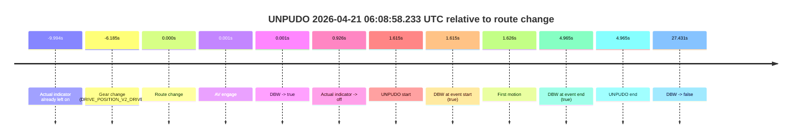
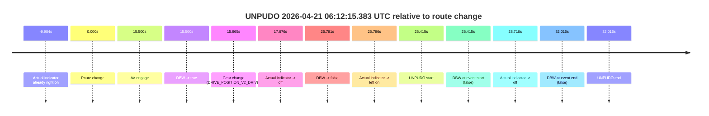
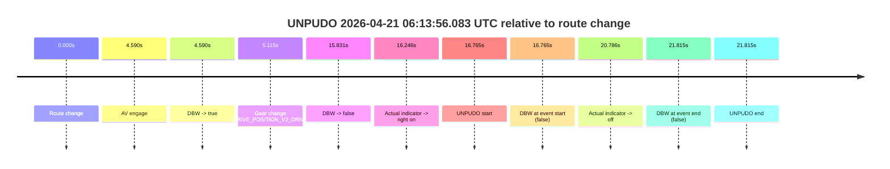
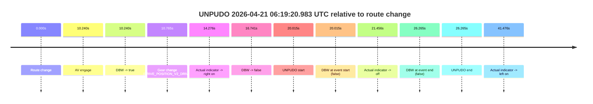

# Run Report: fme20038/2026-04-21--06-03-35--gen2-av-42061048-f331-47b3-b578-8968894338d5

| Field | Value |
|---|---|
| Run ID | `fme20038/2026-04-21--06-03-35--gen2-av-42061048-f331-47b3-b578-8968894338d5` |
| Date | `2026-04-21` |
| Model(s) | `pink-manta-ray-smooth` |
| Author | `guy.geva` |
| Event count | `4` |

## unpudo 2026-04-21 06:08:58.233 UTC

| Field | Value |
|---|---|
| Model | `pink-manta-ray-smooth` |
| Author | `guy.geva` |
| Run ID | `fme20038/2026-04-21--06-03-35--gen2-av-42061048-f331-47b3-b578-8968894338d5` |
| Date | `2026-04-21` |
| Time (UTC) | `06:08:58.233` |
| Event type | `unpudo` |
| Disengagement type | `none observed` |
| Route change | `found` |
| Console | [run](https://console.sso.wayve.ai/run/fme20038/2026-04-21--06-03-35--gen2-av-42061048-f331-47b3-b578-8968894338d5?id=&time-unixus=1776751738233296) |
| Foxglove | [segment](https://app.foxglove.dev/wayve-on-prem/p/prj_0dX18KZdVHg1fmmI/view?ds=foxglove-stream&ds.deviceName=fme20038&ds.start=2026-04-21T06%3A08%3A40.433306Z&ds.end=2026-04-21T06%3A09%3A34.049876Z&layoutId=lay_0e7VD4WIKDQGU73Y&time=2026-04-21T06%3A08%3A58.233296Z) |

### Event card: pass

- Pass: AV owns the credited unpudo from route change through the official unpudo window, the gear state is aligned at the anchor, and the vehicle moves without driver accelerator help in AV.

| Event | Time (UTC) | Delta from route change |
|---|---:|---:|
| Actual indicator already left on | 2026-04-21 06:08:46.624 | `-9.994s` |
| Gear change (DRIVE_POSITION_V2_DRIVE) | 2026-04-21 06:08:50.433 | `-6.185s` |
| Route change | 2026-04-21 06:08:56.618 | `0.000s` |
| AV engage | 2026-04-21 06:08:56.619 | `0.001s` |
| DBW -> true | 2026-04-21 06:08:56.619 | `0.001s` |
| Actual indicator -> off | 2026-04-21 06:08:57.544 | `0.926s` |
| UNPUDO start | 2026-04-21 06:08:58.233 | `1.615s` |
| DBW at event start (true) | 2026-04-21 06:08:58.233 | `1.615s` |
| First motion | 2026-04-21 06:08:58.244 | `1.626s` |
| DBW at event end (true) | 2026-04-21 06:09:01.583 | `4.965s` |
| UNPUDO end | 2026-04-21 06:09:01.583 | `4.965s` |
| DBW -> false | 2026-04-21 06:09:24.049 | `27.431s` |

| Metric | Value |
|---|---|
| Outcome | `pass` |
| Effective failure type | `none` |
| Route change status | `found` |
| DBW at event start | `true` |
| DBW at event end | `true` |
| Predicted gear at AV start | `DRIVE_POSITION_V2_DRIVE` |
| Actual gear at AV start | `DRIVE_POSITION_V2_DRIVE` |
| Predicted gear at event start | `DRIVE_POSITION_V2_DRIVE` |
| Actual gear at event start | `DRIVE_POSITION_V2_DRIVE` |
| Planned indicator direction | `INDICATORS_STATE_V2_RIGHT_ON` |
| Controller indicator direction | `INDICATORS_STATE_V2_RIGHT_ON` |
| Actual indicator direction | `INDICATORS_STATE_V2_OFF` |
| Actual indicator at maneuver end | `INDICATORS_STATE_V2_OFF` |
| Driver accel help in AV | `false` |
| Driver accel help timestamp | `n/a` |
| Max accel pedal pct in AV | `0.0%` |
| Max brake pedal pct in AV | `10.6%` |
| Max speed mps in AV | `5.158` |
| Success timing baseline | `route change` |
| Route -> AV | `0.001s` |
| AV -> event start | `1.614s` |
| AV -> first motion | `1.625s` |
| Success baseline -> event start | `1.615s` |
| Success baseline -> first motion | `1.626s` |
| AV duration before disengagement | `27.430s` |
| Trajectory waypoint count | `36` |
| Driving-plan step count | `11` |

The scored portion starts from the AV-owned window, not from the pre-AV setup. Route-change search in the stopped pre-event segment was `found`, with the baseline therefore set to route change. At the event anchor the model predicts `DRIVE_POSITION_V2_DRIVE` and the actual gear is `DRIVE_POSITION_V2_DRIVE`. The effective model outcome is `pass` because `the credited unpudo stays AV-owned through the official unpudo window.`

### Resolution

| Field | Value |
|---|---|
| Final outcome | `pass` |
| Do we agree with this label? | `yes` |
| Source disengagement type | `none observed` |
| Resolved effective failure type | `none` |
| Confidence | `high` |

## unpudo 2026-04-21 06:12:15.383 UTC

| Field | Value |
|---|---|
| Model | `pink-manta-ray-smooth` |
| Author | `guy.geva` |
| Run ID | `fme20038/2026-04-21--06-03-35--gen2-av-42061048-f331-47b3-b578-8968894338d5` |
| Date | `2026-04-21` |
| Time (UTC) | `06:12:15.383` |
| Event type | `unpudo` |
| Disengagement type | `none observed` |
| Route change | `found` |
| Console | [run](https://console.sso.wayve.ai/run/fme20038/2026-04-21--06-03-35--gen2-av-42061048-f331-47b3-b578-8968894338d5?id=&time-unixus=1776751935383291) |
| Foxglove | [segment](https://app.foxglove.dev/wayve-on-prem/p/prj_0dX18KZdVHg1fmmI/view?ds=foxglove-stream&ds.deviceName=fme20038&ds.start=2026-04-21T06%3A11%3A38.968327Z&ds.end=2026-04-21T06%3A12%3A30.983308Z&layoutId=lay_0e7VD4WIKDQGU73Y&time=2026-04-21T06%3A12%3A15.383291Z) |

### Event card: fail

- Fail: the credited unpudo does not stay AV-owned. The event window starts with DBW false, and the maneuver outcome lands outside a clean AV-owned segment.

| Event | Time (UTC) | Delta from route change |
|---|---:|---:|
| Actual indicator already right on | 2026-04-21 06:11:38.984 | `-9.984s` |
| Route change | 2026-04-21 06:11:48.968 | `0.000s` |
| AV engage | 2026-04-21 06:12:04.468 | `15.500s` |
| DBW -> true | 2026-04-21 06:12:04.468 | `15.500s` |
| Gear change (DRIVE_POSITION_V2_DRIVE) | 2026-04-21 06:12:04.933 | `15.965s` |
| Actual indicator -> off | 2026-04-21 06:12:06.644 | `17.676s` |
| DBW -> false | 2026-04-21 06:12:14.749 | `25.781s` |
| Actual indicator -> left on | 2026-04-21 06:12:14.764 | `25.796s` |
| UNPUDO start | 2026-04-21 06:12:15.383 | `26.415s` |
| DBW at event start (false) | 2026-04-21 06:12:15.383 | `26.415s` |
| Actual indicator -> off | 2026-04-21 06:12:17.684 | `28.716s` |
| DBW at event end (false) | 2026-04-21 06:12:20.983 | `32.015s` |
| UNPUDO end | 2026-04-21 06:12:20.983 | `32.015s` |

| Metric | Value |
|---|---|
| Outcome | `fail` |
| Effective failure type | `not_av_owned` |
| Route change status | `found` |
| DBW at event start | `false` |
| DBW at event end | `false` |
| Predicted gear at AV start | `DRIVE_POSITION_V2_DRIVE` |
| Actual gear at AV start | `DRIVE_POSITION_V2_PARK` |
| Predicted gear at event start | `DRIVE_POSITION_V2_DRIVE` |
| Actual gear at event start | `DRIVE_POSITION_V2_DRIVE` |
| Planned indicator direction | `INDICATORS_STATE_V2_LEFT_ON` |
| Controller indicator direction | `INDICATORS_STATE_V2_LEFT_ON` |
| Actual indicator direction | `INDICATORS_STATE_V2_LEFT_ON` |
| Actual indicator at maneuver end | `INDICATORS_STATE_V2_OFF` |
| Driver accel help in AV | `false` |
| Driver accel help timestamp | `n/a` |
| Max accel pedal pct in AV | `0.0%` |
| Max brake pedal pct in AV | `8.0%` |
| Max speed mps in AV | `0.000` |
| Success timing baseline | `route change` |
| Route -> AV | `15.500s` |
| AV -> event start | `10.915s` |
| AV -> first motion | `n/a` |
| Success baseline -> event start | `26.415s` |
| Success baseline -> first motion | `n/a` |
| AV duration before disengagement | `10.280s` |
| Trajectory waypoint count | `37` |
| Driving-plan step count | `11` |

The scored portion starts from the AV-owned window, not from the pre-AV setup. Route-change search in the stopped pre-event segment was `found`, with the baseline therefore set to route change. At the event anchor the model predicts `DRIVE_POSITION_V2_DRIVE` and the actual gear is `DRIVE_POSITION_V2_DRIVE`. The effective model outcome is `fail` because `not_av_owned.`

### Resolution

| Field | Value |
|---|---|
| Final outcome | `fail` |
| Do we agree with this label? | `yes` |
| Source disengagement type | `none observed` |
| Resolved effective failure type | `not_av_owned` |
| Confidence | `high` |

## unpudo 2026-04-21 06:13:56.083 UTC

| Field | Value |
|---|---|
| Model | `pink-manta-ray-smooth` |
| Author | `guy.geva` |
| Run ID | `fme20038/2026-04-21--06-03-35--gen2-av-42061048-f331-47b3-b578-8968894338d5` |
| Date | `2026-04-21` |
| Time (UTC) | `06:13:56.083` |
| Event type | `unpudo` |
| Disengagement type | `none observed` |
| Route change | `found` |
| Console | [run](https://console.sso.wayve.ai/run/fme20038/2026-04-21--06-03-35--gen2-av-42061048-f331-47b3-b578-8968894338d5?id=&time-unixus=1776752036083313) |
| Foxglove | [segment](https://app.foxglove.dev/wayve-on-prem/p/prj_0dX18KZdVHg1fmmI/view?ds=foxglove-stream&ds.deviceName=fme20038&ds.start=2026-04-21T06%3A13%3A29.318743Z&ds.end=2026-04-21T06%3A14%3A11.133293Z&layoutId=lay_0e7VD4WIKDQGU73Y&time=2026-04-21T06%3A13%3A56.083313Z) |

### Event card: fail

- Fail: the credited unpudo does not stay AV-owned. The event window starts with DBW false, and the maneuver outcome lands outside a clean AV-owned segment.

| Event | Time (UTC) | Delta from route change |
|---|---:|---:|
| Route change | 2026-04-21 06:13:39.318 | `0.000s` |
| AV engage | 2026-04-21 06:13:43.908 | `4.590s` |
| DBW -> true | 2026-04-21 06:13:43.908 | `4.590s` |
| Gear change (DRIVE_POSITION_V2_DRIVE) | 2026-04-21 06:13:44.433 | `5.115s` |
| DBW -> false | 2026-04-21 06:13:55.149 | `15.831s` |
| Actual indicator -> right on | 2026-04-21 06:13:55.564 | `16.246s` |
| UNPUDO start | 2026-04-21 06:13:56.083 | `16.765s` |
| DBW at event start (false) | 2026-04-21 06:13:56.083 | `16.765s` |
| Actual indicator -> off | 2026-04-21 06:14:00.104 | `20.786s` |
| DBW at event end (false) | 2026-04-21 06:14:01.133 | `21.815s` |
| UNPUDO end | 2026-04-21 06:14:01.133 | `21.815s` |

| Metric | Value |
|---|---|
| Outcome | `fail` |
| Effective failure type | `not_av_owned` |
| Route change status | `found` |
| DBW at event start | `false` |
| DBW at event end | `false` |
| Predicted gear at AV start | `DRIVE_POSITION_V2_DRIVE` |
| Actual gear at AV start | `DRIVE_POSITION_V2_PARK` |
| Predicted gear at event start | `DRIVE_POSITION_V2_DRIVE` |
| Actual gear at event start | `DRIVE_POSITION_V2_DRIVE` |
| Planned indicator direction | `INDICATORS_STATE_V2_RIGHT_ON` |
| Controller indicator direction | `INDICATORS_STATE_V2_RIGHT_ON` |
| Actual indicator direction | `INDICATORS_STATE_V2_RIGHT_ON` |
| Actual indicator at maneuver end | `INDICATORS_STATE_V2_OFF` |
| Driver accel help in AV | `false` |
| Driver accel help timestamp | `n/a` |
| Max accel pedal pct in AV | `0.0%` |
| Max brake pedal pct in AV | `8.0%` |
| Max speed mps in AV | `0.000` |
| Success timing baseline | `route change` |
| Route -> AV | `4.590s` |
| AV -> event start | `12.174s` |
| AV -> first motion | `n/a` |
| Success baseline -> event start | `16.765s` |
| Success baseline -> first motion | `n/a` |
| AV duration before disengagement | `11.241s` |
| Trajectory waypoint count | `37` |
| Driving-plan step count | `11` |

The scored portion starts from the AV-owned window, not from the pre-AV setup. Route-change search in the stopped pre-event segment was `found`, with the baseline therefore set to route change. At the event anchor the model predicts `DRIVE_POSITION_V2_DRIVE` and the actual gear is `DRIVE_POSITION_V2_DRIVE`. The effective model outcome is `fail` because `not_av_owned.`

### Resolution

| Field | Value |
|---|---|
| Final outcome | `fail` |
| Do we agree with this label? | `yes` |
| Source disengagement type | `none observed` |
| Resolved effective failure type | `not_av_owned` |
| Confidence | `high` |

## unpudo 2026-04-21 06:19:20.983 UTC

| Field | Value |
|---|---|
| Model | `pink-manta-ray-smooth` |
| Author | `guy.geva` |
| Run ID | `fme20038/2026-04-21--06-03-35--gen2-av-42061048-f331-47b3-b578-8968894338d5` |
| Date | `2026-04-21` |
| Time (UTC) | `06:19:20.983` |
| Event type | `unpudo` |
| Disengagement type | `none observed` |
| Route change | `found` |
| Console | [run](https://console.sso.wayve.ai/run/fme20038/2026-04-21--06-03-35--gen2-av-42061048-f331-47b3-b578-8968894338d5?id=&time-unixus=1776752360983317) |
| Foxglove | [segment](https://app.foxglove.dev/wayve-on-prem/p/prj_0dX18KZdVHg1fmmI/view?ds=foxglove-stream&ds.deviceName=fme20038&ds.start=2026-04-21T06%3A18%3A50.968490Z&ds.end=2026-04-21T06%3A19%3A37.233312Z&layoutId=lay_0e7VD4WIKDQGU73Y&time=2026-04-21T06%3A19%3A20.983317Z) |

### Event card: fail

- Fail: the credited unpudo does not stay AV-owned. The event window starts with DBW false, and the maneuver outcome lands outside a clean AV-owned segment.

| Event | Time (UTC) | Delta from route change |
|---|---:|---:|
| Route change | 2026-04-21 06:19:00.968 | `0.000s` |
| AV engage | 2026-04-21 06:19:11.208 | `10.240s` |
| DBW -> true | 2026-04-21 06:19:11.208 | `10.240s` |
| Gear change (DRIVE_POSITION_V2_DRIVE) | 2026-04-21 06:19:11.733 | `10.765s` |
| Actual indicator -> right on | 2026-04-21 06:19:15.244 | `14.276s` |
| DBW -> false | 2026-04-21 06:19:17.709 | `16.741s` |
| UNPUDO start | 2026-04-21 06:19:20.983 | `20.015s` |
| DBW at event start (false) | 2026-04-21 06:19:20.983 | `20.015s` |
| Actual indicator -> off | 2026-04-21 06:19:22.424 | `21.456s` |
| DBW at event end (false) | 2026-04-21 06:19:27.233 | `26.265s` |
| UNPUDO end | 2026-04-21 06:19:27.233 | `26.265s` |
| Actual indicator -> left on | 2026-04-21 06:19:42.444 | `41.476s` |

| Metric | Value |
|---|---|
| Outcome | `fail` |
| Effective failure type | `not_av_owned` |
| Route change status | `found` |
| DBW at event start | `false` |
| DBW at event end | `false` |
| Predicted gear at AV start | `DRIVE_POSITION_V2_DRIVE` |
| Actual gear at AV start | `DRIVE_POSITION_V2_PARK` |
| Predicted gear at event start | `DRIVE_POSITION_V2_DRIVE` |
| Actual gear at event start | `DRIVE_POSITION_V2_DRIVE` |
| Planned indicator direction | `INDICATORS_STATE_V2_OFF` |
| Controller indicator direction | `INDICATORS_STATE_V2_OFF` |
| Actual indicator direction | `INDICATORS_STATE_V2_RIGHT_ON` |
| Actual indicator at maneuver end | `INDICATORS_STATE_V2_OFF` |
| Driver accel help in AV | `false` |
| Driver accel help timestamp | `n/a` |
| Max accel pedal pct in AV | `0.0%` |
| Max brake pedal pct in AV | `8.0%` |
| Max speed mps in AV | `0.000` |
| Success timing baseline | `route change` |
| Route -> AV | `10.240s` |
| AV -> event start | `9.774s` |
| AV -> first motion | `n/a` |
| Success baseline -> event start | `20.015s` |
| Success baseline -> first motion | `n/a` |
| AV duration before disengagement | `6.501s` |
| Trajectory waypoint count | `37` |
| Driving-plan step count | `11` |

The scored portion starts from the AV-owned window, not from the pre-AV setup. Route-change search in the stopped pre-event segment was `found`, with the baseline therefore set to route change. At the event anchor the model predicts `DRIVE_POSITION_V2_DRIVE` and the actual gear is `DRIVE_POSITION_V2_DRIVE`. The effective model outcome is `fail` because `not_av_owned.`

### Resolution

| Field | Value |
|---|---|
| Final outcome | `fail` |
| Do we agree with this label? | `yes` |
| Source disengagement type | `none observed` |
| Resolved effective failure type | `not_av_owned` |
| Confidence | `high` |
